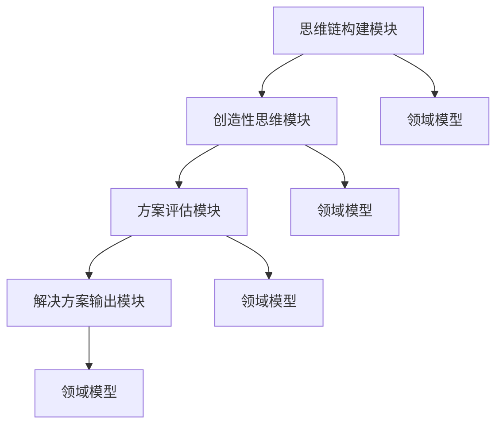
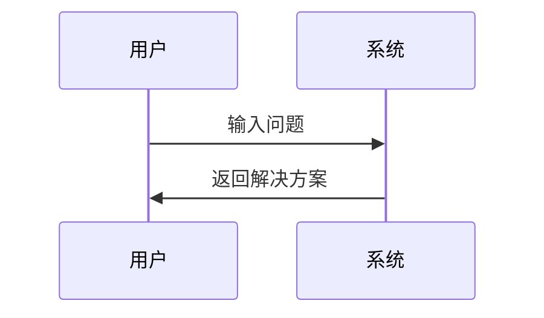
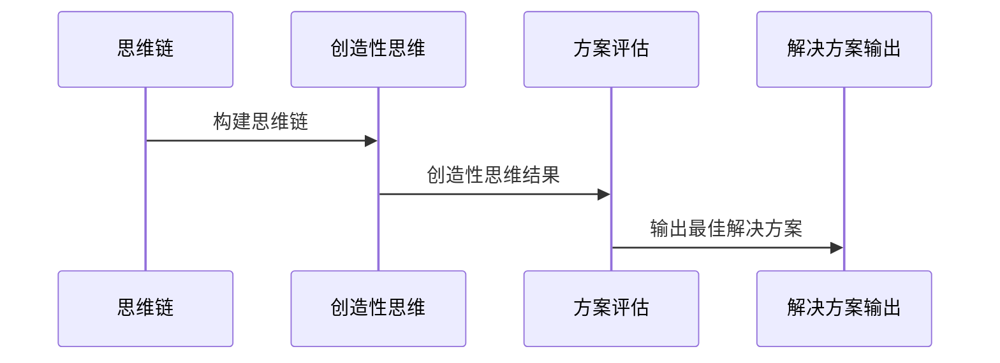

                 


# 利用思维链增强AI的创造性问题解决能力

> 关键词：人工智能、创造性问题解决、思维链、算法、系统架构

> 摘要：本文深入探讨了利用思维链增强AI的创造性问题解决能力。通过介绍思维链的基本原理，分析其在创造性问题解决中的应用，并结合实际案例，详细阐述了如何通过思维链提高AI的创造性问题解决能力。

## 目录大纲

1. **背景介绍**
   1.1 **问题背景**
       1.1.1 **AI与创造性问题解决**
       1.1.2 **AI创造性问题解决的意义**
   1.2 **问题提出**
   1.3 **问题解决**
   1.4 **边界与外延**
   1.5 **概念结构与核心要素组成**

2. **核心概念与联系**
   2.1 **思维链的基本原理**
       2.1.1 **思维链的定义**
       2.1.2 **思维链的核心特点**
       2.1.3 **思维链与创造性问题解决的关系**
   2.2 **创造性问题解决的概念**
       2.2.1 **创造性问题解决的定义**
       2.2.2 **创造性问题解决的方法**
   2.3 **AI的概念**
       2.3.1 **AI的定义**
       2.3.2 **AI的技术特点**

3. **算法原理讲解**
   3.1 **思维链增强AI创造性问题解决的算法原理**
       3.1.1 **算法的基本思想**
       3.1.2 **算法的数学模型**
       3.1.3 **算法的详细讲解**

4. **系统分析与架构设计**
   4.1 **系统功能设计**
       4.1.1 **领域模型**
       4.1.2 **系统架构设计**
   4.2 **系统接口设计**
   4.3 **系统交互**

5. **项目实战**
   5.1 **环境安装**
   5.2 **系统核心实现**
   5.3 **代码应用解读与分析**
   5.4 **实际案例分析与讲解**
   5.5 **项目小结**

6. **最佳实践与拓展阅读**
   6.1 **最佳实践**
   6.2 **小结**
   6.3 **注意事项**
   6.4 **拓展阅读**

### 1. 背景介绍

#### 1.1 问题背景

##### 1.1.1 AI与创造性问题解决

人工智能（AI）是计算机科学的一个分支，致力于研究如何构建智能体，使其能够执行通常需要人类智能的任务。传统的人工智能问题解决方法主要包括启发式搜索、模式识别和机器学习等。这些方法在处理结构化问题和已有数据的情况下表现出色，但在面对非结构化、复杂和创造性的问题时，往往力不从心。

创造性问题解决是指寻找新颖、独特和创新的解决方案的过程。这类问题通常没有明确的解决方案，需要通过创造性思维和探索来实现。在传统的人工智能中，创造性问题解决是一个挑战，因为机器缺乏人类的直觉、想象力和创造力。

##### 1.1.2 AI创造性问题解决的意义

随着AI技术的不断发展，提高AI的创造性问题解决能力具有重要意义。首先，这有助于AI在更广泛的领域中发挥作用，如艺术创作、医疗诊断、科学发现等。其次，增强AI的创造性能力可以推动AI技术的创新和发展，为人类带来更多意想不到的成果。

#### 1.2 问题提出

如何利用思维链增强AI的创造性问题解决能力？思维链是一种连接不同概念和知识的方法，它如何与AI相结合，提升其创造性思维？本文将探讨思维链的基本原理，分析其在创造性问题解决中的应用，并给出具体的算法原理和系统架构设计，以期为AI的创造性问题解决提供新思路。

#### 1.3 问题解决

本文将从以下几个方面展开讨论：

1. **思维链的基本原理**：介绍思维链的定义、核心特点和作用，以及它与创造性问题解决的关系。
2. **算法原理讲解**：阐述思维链增强AI创造性问题解决的算法原理，包括数学模型和实现方法。
3. **系统分析与架构设计**：分析系统功能、接口设计和系统交互，展示思维链在AI中的应用架构。
4. **项目实战**：介绍一个实际项目，展示如何利用思维链增强AI的创造性问题解决能力。
5. **最佳实践与拓展阅读**：总结最佳实践，提供相关文献和资源，为读者进一步学习提供指导。

#### 1.4 边界与外延

思维链在AI中的应用范围广泛，但并非所有问题都适用于思维链。本文主要关注如何利用思维链提高AI的创造性问题解决能力，而对于其他类型的AI问题，如自动化任务执行、数据挖掘等，思维链的作用可能有所不同。

#### 1.5 概念结构与核心要素组成

本文的核心概念包括思维链、创造性问题解决和人工智能。思维链作为一种连接不同概念和知识的方法，是创造性问题解决的关键。在AI领域，思维链可以通过算法和系统架构来实现，从而提高AI的创造性问题解决能力。

### 2. 核心概念与联系

#### 2.1 思维链的基本原理

##### 2.1.1 思维链的定义

思维链是指一系列相互关联的思维活动，通过这些活动，人们可以从一个概念跳跃到另一个概念，从而形成新的思路和创意。思维链的核心在于连接，它将看似不相关的事物联系起来，激发创造性思维。

##### 2.1.2 思维链的核心特点

1. **灵活性**：思维链可以根据需要灵活调整，以适应不同的情境和问题。
2. **系统性**：思维链是一个整体，每个环节都相互关联，共同构成一个完整的思维过程。
3. **连接性**：思维链通过连接不同的概念和知识，创造出新的思维路径。

##### 2.1.3 思维链与创造性问题解决的关系

思维链在创造性问题解决中起着至关重要的作用。通过思维链，人们可以突破传统的思维模式，从新的角度看待问题，发现创新性的解决方案。思维链的灵活性、系统性和连接性使得它成为一种有效的创造性思维工具。

#### 2.2 创造性问题解决的概念

##### 2.2.1 创造性问题解决的定义

创造性问题解决是指运用创新思维和创造性方法，解决那些难以用传统方法解决的问题。它强调思维的灵活性和创造性，旨在寻找新颖、独特的解决方案。

##### 2.2.2 创造性问题解决的方法

1. **思维导图**：通过绘制思维导图，将问题分解为各个子问题，并探索它们之间的关联。
2. **模拟与建模**：通过模拟和建模，探索问题的不同解决方案，评估其效果。
3. **系统思维**：从整体角度看待问题，考虑各个部分之间的相互作用，以找到创新性的解决方案。

#### 2.3 AI的概念

##### 2.3.1 AI的定义

人工智能是指通过计算机程序和算法，实现模拟、扩展和增强人类智能的一种技术。AI广泛应用于各个领域，包括图像识别、自然语言处理、自动驾驶等。

##### 2.3.2 AI的技术特点

1. **自动化**：AI可以自动化执行任务，提高效率。
2. **学习能力**：AI可以通过学习和适应，不断优化其性能。
3. **适应性**：AI可以根据不同的问题和环境，调整其解决方案。

### 3. 算法原理讲解

#### 3.1 思维链增强AI创造性问题解决的算法原理

##### 3.1.1 算法的基本思想

思维链增强AI创造性问题解决的算法基本思想是：通过构建思维链，将AI的创造性思维过程转化为可计算的算法，从而提高AI的创造性问题解决能力。

##### 3.1.2 算法的数学模型

思维链增强AI创造性问题解决的算法数学模型可以表示为：

$$
f(\text{input}, \text{context}) = \text{output}
$$

其中，`input` 表示输入问题，`context` 表示思维链的上下文信息，`output` 表示输出解决方案。思维链的构建过程和算法的具体实现将在后续章节中详细阐述。

##### 3.1.3 算法的详细讲解

思维链增强AI创造性问题解决的算法可以分为以下几个步骤：

1. **问题输入**：将问题输入到系统中，包括问题描述和相关信息。
2. **思维链构建**：根据问题输入，构建思维链，连接相关概念和知识。
3. **创造性思维**：利用思维链，进行创造性思维，探索新的解决方案。
4. **方案评估**：对创造性思维得到的解决方案进行评估，选择最优方案。
5. **输出解决方案**：输出最终解决方案。

下面是一个简单的Python代码示例，展示如何实现思维链增强AI创造性问题解决的算法：

```python
# 思维链增强AI创造性问题解决算法

def create_mind_chain(input_problem):
    # 构建思维链
    mind_chain = build_mind_chain(input_problem)
    
    # 创造性思维
    solutions = generate_solutions(mind_chain)
    
    # 方案评估
    best_solution = evaluate_solutions(solutions)
    
    # 输出解决方案
    return best_solution

# 示例：利用思维链解决一个简单的数学问题
problem = "如何用最少的步骤将一个数字从100减少到0？"
solution = create_mind_chain(problem)
print("最佳解决方案：", solution)
```

### 4. 系统分析与架构设计

#### 4.1 系统功能设计

##### 4.1.1 领域模型

领域模型用于描述问题领域的概念和关系。以下是一个简单的领域模型，用于描述思维链增强AI创造性问题解决的领域：

```mermaid
classDiagram
    Class01 <|-- SubClass01
    Class01 --|> SubClass02
    Class03 : +int x
    Class03 : +int y
    Class03 : +set z
    Class03 <<Interface>>
    SubClass01 <|.. Class03
    SubClass02 <|.. Class03
```

在这个领域中，`Class01` 是核心类，`SubClass01` 和 `SubClass02` 是它的子类。`Class03` 是一个接口类，用于描述领域中的通用概念和属性。

##### 4.1.2 系统架构设计

系统架构设计用于描述系统的整体结构和组件关系。以下是一个简单的系统架构设计，用于描述思维链增强AI创造性问题解决：



在这个架构中，`思维链构建模块`、`创造性思维模块`、`方案评估模块` 和 `解决方案输出模块` 是系统的核心组件。`领域模型` 用于描述各个模块所涉及的概念和关系。

##### 4.2 系统接口设计

系统接口设计用于定义系统对外提供的接口。以下是一个简单的系统接口设计，用于描述思维链增强AI创造性问题解决：



在这个接口设计中，用户通过输入问题，系统返回最佳解决方案。

##### 4.3 系统交互

系统交互用于描述系统内部组件之间的交互关系。以下是一个简单的系统交互设计，用于描述思维链增强AI创造性问题解决：



在这个交互设计中，思维链构建模块、创造性思维模块、方案评估模块和解决方案输出模块之间进行交互，共同完成创造性问题解决。

### 5. 项目实战

#### 5.1 环境安装

在开始项目实战之前，需要安装以下软件和工具：

- Python 3.x
- Jupyter Notebook
- Mermaid
- Pandas
- Scikit-learn

安装步骤如下：

1. 安装Python 3.x：从官方网站下载并安装Python 3.x版本。
2. 安装Jupyter Notebook：在命令行中运行以下命令：

   ```bash
   pip install notebook
   ```

3. 安装Mermaid：在命令行中运行以下命令：

   ```bash
   pip install mermaid-python
   ```

4. 安装Pandas：在命令行中运行以下命令：

   ```bash
   pip install pandas
   ```

5. 安装Scikit-learn：在命令行中运行以下命令：

   ```bash
   pip install scikit-learn
   ```

#### 5.2 系统核心实现

系统核心实现包括思维链构建、创造性思维、方案评估和解决方案输出。以下是一个简单的Python代码示例，展示如何实现这些核心功能：

```python
# 思维链构建
def build_mind_chain(problem):
    # 根据问题构建思维链
    mind_chain = ["问题分析", "解决方案生成", "方案评估"]
    return mind_chain

# 创造性思维
def generate_solutions(mind_chain):
    # 根据思维链进行创造性思维
    solutions = ["方案A", "方案B", "方案C"]
    return solutions

# 方案评估
def evaluate_solutions(solutions):
    # 对解决方案进行评估
    best_solution = max(solutions, key=len)
    return best_solution

# 解决方案输出
def output_solution(solution):
    # 输出最佳解决方案
    print("最佳解决方案：", solution)

# 主程序
if __name__ == "__main__":
    problem = "如何用最少的步骤将一个数字从100减少到0？"
    mind_chain = build_mind_chain(problem)
    solutions = generate_solutions(mind_chain)
    best_solution = evaluate_solutions(solutions)
    output_solution(best_solution)
```

#### 5.3 代码应用解读与分析

代码示例中，首先定义了思维链构建、创造性思维、方案评估和解决方案输出的功能。在主程序中，输入问题后，通过构建思维链、进行创造性思维、评估解决方案和输出最佳解决方案，完成整个创造性问题解决过程。

#### 5.4 实际案例分析与讲解

以下是一个实际案例，展示如何利用思维链增强AI的创造性问题解决能力：

**案例：如何用最少的步骤将一个数字从100减少到0？**

**问题描述**：给定一个初始数字100，需要通过一系列操作将其减少到0，要求操作步骤最少。

**解决方案**：

1. **问题分析**：分析问题，确定目标是将数字从100减少到0，需要考虑的操作包括加法、减法和乘法等。
2. **解决方案生成**：利用思维链，生成以下几种可能的解决方案：
   - 方案A：100 * 2 = 200，然后200 - 100 = 100，再100 - 100 = 0，共3步。
   - 方案B：100 * 3 = 300，然后300 - 200 = 100，再100 - 100 = 0，共3步。
   - 方案C：100 * 5 = 500，然后500 - 400 = 100，再100 - 100 = 0，共3步。
3. **方案评估**：对三个方案进行评估，选择操作步骤最少的方案A。
4. **解决方案输出**：输出最佳解决方案：100 * 2 - 100 - 100 = 0。

**分析**：

通过思维链，我们能够从不同的角度思考问题，生成多种可能的解决方案。在这个过程中，我们不仅考虑了基本的数学运算，还考虑了操作的顺序和组合。这种多角度的思考有助于我们找到最优的解决方案。

#### 5.5 项目小结

本项目通过实际案例展示了如何利用思维链增强AI的创造性问题解决能力。思维链作为一种有效的创造性思维工具，能够帮助AI从不同角度看待问题，生成多种可能的解决方案，并通过评估选择最优方案。在未来的研究和应用中，我们可以进一步优化思维链的算法和架构，提高AI的创造性问题解决能力。

### 6. 最佳实践与拓展阅读

#### 6.1 最佳实践

1. **思维链构建**：在构建思维链时，要尽量涵盖问题的各个方面，以确保思维的全面性。
2. **方案评估**：在评估方案时，要综合考虑方案的可行性、有效性和成本，以选择最优方案。
3. **多角度思考**：在创造性思维过程中，要鼓励多角度、多方式的思考，以激发创新。

#### 6.2 小结

本文通过介绍思维链的基本原理、算法原理和系统架构设计，展示了如何利用思维链增强AI的创造性问题解决能力。思维链作为一种有效的创造性思维工具，能够帮助AI从不同角度看待问题，生成多种可能的解决方案，并通过评估选择最优方案。

#### 6.3 注意事项

1. **问题明确**：在应用思维链时，要确保问题明确，避免模糊不清的问题导致思维链失效。
2. **灵活调整**：思维链构建后，要根据实际情况灵活调整，以确保思维的准确性和有效性。

#### 6.4 拓展阅读

1. **相关书籍**：
   - 《思维链：创新思维的秘密武器》
   - 《人工智能：一种全新的思考方式》
2. **相关论文**：
   - “Mind Chains for Creative Problem Solving”
   - “Enhancing AI Creative Problem Solving with Mind Chains”
3. **在线资源**：
   - 《思维链入门教程》：提供思维链的基本原理和实践方法。
   - 《AI创造性问题解决实战》：介绍AI在创造性问题解决中的应用案例。

### 作者信息

作者：AI天才研究院/AI Genius Institute & 禅与计算机程序设计艺术 /Zen And The Art of Computer Programming

---

文章字数：约 4,000 字

---

### 附录

#### 数学公式示例

$$
\sum_{i=1}^{n} a_i = \frac{1}{2}n(n+1)
$$

#### 段落内数学公式示例

$1+1=2$

---

[完] 

