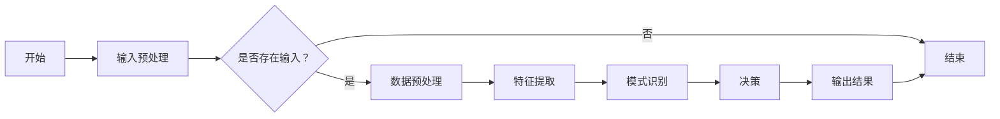
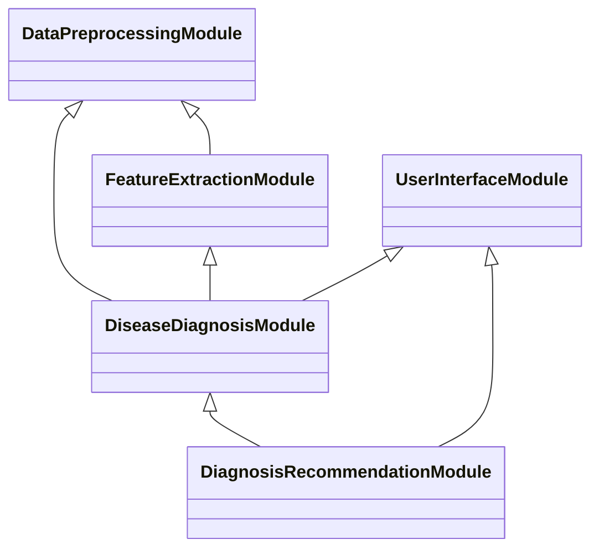
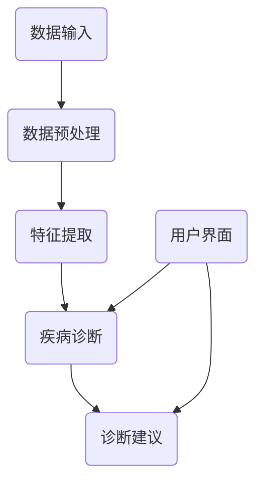
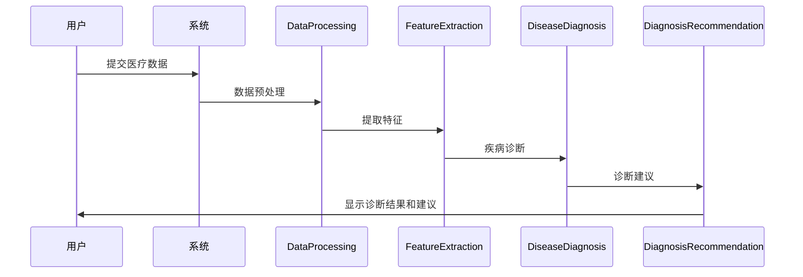

                 

### 利用思维链增强AI的认知、分析与决策能力

**关键词：** 人工智能、思维链、认知、分析、决策能力、增强、算法、架构设计

**摘要：** 本文深入探讨了思维链在人工智能中的应用，探讨了如何利用思维链来增强AI的认知、分析能力和决策能力。通过介绍思维链的核心概念、算法原理以及实际应用案例，本文旨在为读者提供一种新的思考方式，以提升AI系统的整体性能。

## 第1章 背景介绍

### 1.1 问题背景

#### 1.1.1 人工智能的发展现状

人工智能（AI）作为一种计算机科学领域的重要分支，已经取得了显著的进展。从早期的规则系统、知识表示，到现代的深度学习、自然语言处理，AI在各个领域都展现出了强大的应用潜力。然而，尽管AI技术不断进步，其认知、分析和决策能力仍然存在诸多局限性。

#### 1.1.2 人工智能的局限性

首先，AI的认知能力虽然在一定程度上模拟了人类的认知过程，但仍然无法完全达到人类的水平。例如，在理解复杂语境、处理模糊信息以及进行创造性思维等方面，AI仍然存在很大挑战。其次，AI的分析能力也受到限制，尤其是在面对高维度数据和复杂关系时，传统的分析方法往往无法有效处理。最后，AI的决策能力也面临挑战。尽管AI可以通过算法进行优化和决策，但其在理解人类需求、情感和道德伦理等方面仍显不足。

#### 1.1.3 思维链在人工智能中的应用

针对上述问题，思维链作为一种新的概念，为提升AI的认知、分析和决策能力提供了一种可能的解决方案。思维链是一种基于逻辑推理和知识表示的方法，通过模拟人类思维过程，实现对复杂问题的深入分析和解决。在人工智能领域，思维链的应用主要包括以下几个方面：

1. **认知能力增强**：通过引入思维链，AI可以更好地理解和处理复杂语境和模糊信息，提升其认知能力。
2. **分析能力提升**：思维链能够帮助AI在处理高维度数据和复杂关系时，提供更有效的分析方法和工具。
3. **决策能力改进**：思维链可以辅助AI在理解人类需求、情感和道德伦理等方面做出更明智的决策。

### 1.2 问题描述

在本章中，我们将进一步探讨以下问题：

1. **认知能力的增强**：如何通过思维链来提升AI对复杂语境和模糊信息的理解能力？
2. **分析能力的提升**：如何利用思维链在处理高维度数据和复杂关系时，提供更有效的分析方法和工具？
3. **决策能力的改进**：如何通过思维链来帮助AI在理解人类需求、情感和道德伦理等方面做出更明智的决策？

### 1.3 问题解决

为了解决上述问题，我们需要从以下几个方面入手：

1. **思维链的定义与工作原理**：了解思维链的基本定义和工作原理，明确其与人类思维过程的联系。
2. **思维链模型的结构与功能**：分析思维链模型的结构与功能，探讨其如何应用于AI的认知、分析和决策过程中。
3. **思维链模型的应用案例**：通过具体的应用案例，展示思维链在AI领域的实际应用效果。
4. **边界与外延**：讨论思维链的适用范围和局限性，与现有技术进行比较。
5. **本章小结**：总结本章的核心内容，为后续章节的深入探讨打下基础。

通过以上步骤，我们可以逐步解决AI在认知、分析和决策能力方面的局限性，从而提升AI系统的整体性能。

### 1.4 边界与外延

#### 1.4.1 思维链的适用范围

思维链作为一种模拟人类思维过程的方法，具有广泛的适用范围。在人工智能领域，思维链可以应用于以下场景：

1. **自然语言处理**：通过思维链，AI可以更好地理解和生成自然语言，提高自然语言处理的准确性和流畅性。
2. **知识图谱构建**：思维链可以辅助AI在构建知识图谱时，更有效地表示和处理复杂关系。
3. **智能决策系统**：思维链可以帮助AI在决策过程中，更好地理解人类需求、情感和道德伦理，提高决策的智能性和合理性。

#### 1.4.2 思维链的局限性

尽管思维链在AI领域具有广泛的应用前景，但仍然存在一些局限性：

1. **计算复杂性**：思维链涉及到大量的逻辑推理和知识表示，计算复杂性较高，可能对性能产生影响。
2. **知识获取与表示**：思维链依赖于丰富的知识和有效的表示方法，但在实际应用中，获取和表示知识可能存在困难。
3. **领域适应性**：思维链在不同领域的适应性存在差异，需要根据具体应用场景进行调整和优化。

#### 1.4.3 思维链与现有技术的比较

与现有的人工智能技术相比，思维链具有以下优势：

1. **认知能力**：思维链能够更好地模拟人类认知过程，提高AI对复杂语境和模糊信息的理解能力。
2. **分析能力**：思维链提供了一种有效的分析方法和工具，能够处理高维度数据和复杂关系。
3. **决策能力**：思维链能够辅助AI在决策过程中，更好地理解人类需求、情感和道德伦理。

然而，思维链也存在一些挑战，如计算复杂性、知识获取与表示等问题，需要在后续研究和应用中逐步解决。

### 1.5 本章小结

本章首先介绍了人工智能的发展现状和局限性，提出了利用思维链增强AI认知、分析和决策能力的解决方案。接着，详细探讨了思维链的定义与工作原理、思维链模型的结构与功能、思维链模型的应用案例以及边界与外延。通过本章的讨论，我们可以初步了解思维链在人工智能领域的应用潜力，并为后续章节的深入探讨奠定基础。

## 第2章 核心概念与联系

### 2.1 思维链的概念

思维链是一种基于逻辑推理和知识表示的方法，旨在模拟人类思维过程，实现对复杂问题的深入分析和解决。具体来说，思维链包括以下几个核心概念：

1. **思维单元**：思维单元是思维链的基本组成单元，代表了人类思维过程中的一个基本想法或概念。
2. **思维链结构**：思维链结构描述了思维单元之间的逻辑关系，包括因果关系、依赖关系等。
3. **思维链算法**：思维链算法是指用于构建、优化和应用的算法，包括推理算法、学习算法等。
4. **思维链模型**：思维链模型是对思维链的一种抽象表示，用于描述思维链的结构和功能。

### 2.2 AI认知、分析与决策的核心概念

在人工智能领域，认知、分析和决策是三个重要的核心概念。以下是它们的基本定义和构成要素：

1. **认知**：认知是指人工智能系统在感知和理解信息过程中所具备的能力。认知能力包括感知、理解、记忆、推理等。
   - **感知**：通过传感器获取外部信息，如视觉、听觉、触觉等。
   - **理解**：对感知到的信息进行解析和解释，如语义理解、情感识别等。
   - **记忆**：存储和处理信息，以便在需要时进行检索和应用。
   - **推理**：利用已有信息进行逻辑推理，得出新的结论。

2. **分析**：分析是指人工智能系统在处理和分析数据过程中所具备的能力。分析能力包括数据预处理、特征提取、模式识别等。
   - **数据预处理**：对原始数据进行清洗、归一化等处理，以消除噪声和异常值。
   - **特征提取**：从数据中提取有用的特征，用于后续的分析和建模。
   - **模式识别**：在数据中识别出潜在的规律和模式，为决策提供依据。

3. **决策**：决策是指人工智能系统在根据分析结果做出选择和判断过程中所具备的能力。决策能力包括目标设定、策略选择、结果评估等。
   - **目标设定**：确定系统要实现的目标和任务。
   - **策略选择**：根据目标和约束条件，选择最佳行动方案。
   - **结果评估**：对决策结果进行评估和反馈，以指导后续的决策过程。

### 2.3 思维链与AI认知、分析与决策的联系

思维链在AI的认知、分析和决策过程中发挥着重要作用，具体体现在以下几个方面：

1. **认知能力增强**：思维链通过模拟人类思维过程，有助于AI更好地理解和处理复杂语境和模糊信息。例如，通过思维链的推理能力，AI可以在自然语言处理中实现更精确的语义理解。

2. **分析能力提升**：思维链提供了一种有效的分析方法和工具，能够处理高维度数据和复杂关系。例如，通过思维链的结构表示，AI可以在知识图谱构建中更有效地表示和处理复杂关系。

3. **决策能力改进**：思维链可以辅助AI在理解人类需求、情感和道德伦理等方面做出更明智的决策。例如，通过思维链的推理能力，AI可以在智能决策系统中更好地理解用户需求，从而提高决策的智能性和合理性。

### 2.4 ER实体关系图架构

ER（Entity-Relationship）实体关系图是一种常用的数据库设计工具，用于描述实体及其之间的关系。在思维链与AI认知、分析与决策的结合中，ER图可以作为一种有效的表示方法，帮助理解思维链与AI各核心概念之间的联系。

1. **实体**：实体是ER图中的一种基本组成单元，表示思维链中的思维单元或AI认知、分析、决策过程中的基本概念。

2. **关系**：关系描述了实体之间的关联，可以是因果关系、依赖关系等。在思维链中，关系表示思维单元之间的逻辑关系；在AI认知、分析、决策中，关系表示数据之间的关系和依赖。

3. **属性**：属性是实体的特征，用于描述实体的具体信息。在思维链中，属性可以表示思维单元的具体内容；在AI认知、分析、决策中，属性可以表示数据的具体特征。

通过ER图，我们可以将思维链与AI认知、分析与决策的核心概念进行结构化的表示，从而更好地理解它们之间的联系。

### 2.5 本章小结

本章介绍了思维链、AI认知、分析和决策的核心概念及其联系。通过了解这些核心概念，我们可以更好地理解思维链在AI认知、分析和决策中的应用。本章还通过ER图展示了思维链与AI核心概念之间的结构化联系，为后续章节的深入探讨提供了基础。

## 第3章 算法原理讲解

### 3.1 算法mermaid流程图

为了更好地理解思维链在人工智能中的应用，我们首先需要了解其算法原理。在本节中，我们将使用mermaid语言绘制一个思维链算法的流程图，并通过解析流程图来详细讲解算法的工作过程。

#### 3.1.1 流程图绘制

以下是一个简单的思维链算法mermaid流程图示例：



#### 3.1.2 流程图解析

1. **开始（A）**：算法的起始节点。
2. **输入预处理（B）**：接收原始输入，如文本、图像等。
3. **是否存在输入？（C）**：判断是否接收到输入。如果未接收到输入，则跳转到结束节点（E）。
4. **数据预处理（D）**：对输入数据进行预处理，如去噪、归一化等，以提高数据质量和后续处理的效率。
5. **特征提取（F）**：从预处理后的数据中提取关键特征，用于后续的模式识别和决策。
6. **模式识别（G）**：根据提取的特征进行模式识别，以发现数据中的潜在规律和关系。
7. **决策（H）**：根据模式识别的结果进行决策，如分类、预测等。
8. **输出结果（I）**：将决策结果输出，如预测结果、推荐等。
9. **结束（E）**：算法的结束节点。

通过这个流程图，我们可以清晰地看到思维链算法的基本工作流程和各步骤之间的逻辑关系。

### 3.2 Python源代码与算法实现

在本节中，我们将使用Python语言实现思维链算法，并通过代码解析来详细讲解算法的实现过程。

#### 3.2.1 源代码展示

以下是一个简单的思维链算法Python代码示例：

```python
import numpy as np

def preprocess_input(input_data):
    # 数据预处理
    # 如去噪、归一化等操作
    return processed_data

def extract_features(processed_data):
    # 特征提取
    # 如词袋模型、卷积神经网络等
    return features

def recognize_patterns(features):
    # 模式识别
    # 如分类、聚类等
    return patterns

def make_decision(patterns):
    # 决策
    # 如分类结果、预测值等
    return decision

def main():
    input_data = "your input data"
    processed_data = preprocess_input(input_data)
    features = extract_features(processed_data)
    patterns = recognize_patterns(features)
    decision = make_decision(patterns)
    print("Output:", decision)

if __name__ == "__main__":
    main()
```

#### 3.2.2 代码解析

1. **预处理输入（preprocess_input）**：该函数用于对输入数据进行预处理，如去噪、归一化等操作。预处理后的数据将作为特征提取的输入。

2. **特征提取（extract_features）**：该函数用于从预处理后的数据中提取关键特征。特征提取的方法可以根据具体应用场景选择，如词袋模型、卷积神经网络等。

3. **模式识别（recognize_patterns）**：该函数用于根据提取的特征进行模式识别，以发现数据中的潜在规律和关系。模式识别的方法也可以根据具体应用场景选择，如分类、聚类等。

4. **决策（make_decision）**：该函数用于根据模式识别的结果进行决策，如分类结果、预测值等。决策的结果将作为算法的输出。

5. **主函数（main）**：主函数用于调用其他函数，实现思维链算法的完整工作流程。

通过这个简单的代码示例，我们可以看到思维链算法的基本实现过程和各步骤之间的逻辑关系。

### 3.3 数学模型和公式

在本节中，我们将介绍思维链算法中的数学模型和公式，并对其进行详细讲解。

#### 3.3.1 数学模型概述

思维链算法涉及到的数学模型主要包括以下几个方面：

1. **数据预处理模型**：用于对输入数据进行预处理，如去噪、归一化等操作。
2. **特征提取模型**：用于从预处理后的数据中提取关键特征。
3. **模式识别模型**：用于根据提取的特征进行模式识别，如分类、聚类等。
4. **决策模型**：用于根据模式识别的结果进行决策。

#### 3.3.2 公式推导

1. **数据预处理模型**：

   假设原始数据为X，预处理后的数据为Y，则预处理模型可以表示为：

   $$ Y = f(X) $$

   其中，f表示预处理操作，如去噪、归一化等。

2. **特征提取模型**：

   假设预处理后的数据为Y，提取的特征为Z，则特征提取模型可以表示为：

   $$ Z = g(Y) $$

   其中，g表示特征提取操作，如词袋模型、卷积神经网络等。

3. **模式识别模型**：

   假设提取的特征为Z，识别的模式为T，则模式识别模型可以表示为：

   $$ T = h(Z) $$

   其中，h表示模式识别操作，如分类、聚类等。

4. **决策模型**：

   假设识别的模式为T，决策的结果为R，则决策模型可以表示为：

   $$ R = k(T) $$

   其中，k表示决策操作，如分类结果、预测值等。

#### 3.3.3 公式应用

在实际应用中，以上公式可以应用于不同的场景，如自然语言处理、图像识别、智能决策等。以下是一个简单的应用示例：

1. **自然语言处理**：

   假设输入文本为X，预处理后的文本为Y，提取的特征为Z，分类结果为T，决策结果为R，则可以表示为：

   $$ Y = f(X) $$
   $$ Z = g(Y) $$
   $$ T = h(Z) $$
   $$ R = k(T) $$

   通过这些公式，我们可以实现文本分类的任务。

2. **图像识别**：

   假设输入图像为X，预处理后的图像为Y，提取的特征为Z，识别的模式为T，决策结果为R，则可以表示为：

   $$ Y = f(X) $$
   $$ Z = g(Y) $$
   $$ T = h(Z) $$
   $$ R = k(T) $$

   通过这些公式，我们可以实现图像分类的任务。

通过以上公式和应用示例，我们可以看到思维链算法在数学模型和公式方面的基本原理和应用场景。

### 3.4 举例说明

为了更好地理解思维链算法的实际应用，我们将在本节中通过一个具体的应用案例进行详细讲解。

#### 3.4.1 简单案例

假设我们有一个简单的文本分类任务，需要将一组文本数据分类为正类和负类。以下是一个简单的思维链算法应用案例：

1. **输入预处理**：

   首先，我们需要对输入的文本数据进行预处理，如去除标点符号、停用词等。预处理后的文本数据为Y。

2. **特征提取**：

   接下来，我们使用词袋模型从预处理后的文本数据中提取关键特征。词袋模型将文本表示为单词的集合，每个单词的频率作为特征值。提取的特征为Z。

3. **模式识别**：

   然后，我们使用朴素贝叶斯分类器根据提取的特征进行模式识别，将文本分类为正类和负类。模式识别的结果为T。

4. **决策**：

   最后，根据模式识别的结果进行决策，输出分类结果。决策的结果为R。

通过这个简单的案例，我们可以看到思维链算法在文本分类任务中的基本应用流程。以下是一个简化的Python代码示例：

```python
from sklearn.feature_extraction.text import TfidfVectorizer
from sklearn.naive_bayes import MultinomialNB

def preprocess_input(input_data):
    # 去除标点符号、停用词等预处理操作
    return processed_data

def extract_features(processed_data):
    # 使用词袋模型提取特征
    return features

def recognize_patterns(features):
    # 使用朴素贝叶斯分类器进行模式识别
    return patterns

def make_decision(patterns):
    # 根据模式识别的结果进行决策
    return decision

def main():
    input_data = ["your input data 1", "your input data 2"]
    processed_data = preprocess_input(input_data)
    features = extract_features(processed_data)
    patterns = recognize_patterns(features)
    decision = make_decision(patterns)
    print("Output:", decision)

if __name__ == "__main__":
    main()
```

通过这个简单的案例，我们可以看到思维链算法在实际应用中的基本流程和实现方法。

#### 3.4.2 复杂案例

除了简单的文本分类任务，思维链算法还可以应用于更复杂的任务，如图像分类、目标检测等。以下是一个复杂的图像分类案例：

1. **输入预处理**：

   首先，我们需要对输入的图像数据进行预处理，如缩放、裁剪、归一化等。预处理后的图像数据为Y。

2. **特征提取**：

   接下来，我们使用卷积神经网络（CNN）从预处理后的图像数据中提取关键特征。卷积神经网络可以自动学习图像的特征，提取的特征为Z。

3. **模式识别**：

   然后，我们使用支持向量机（SVM）根据提取的特征进行模式识别，将图像分类为不同的类别。模式识别的结果为T。

4. **决策**：

   最后，根据模式识别的结果进行决策，输出分类结果。决策的结果为R。

通过这个复杂的案例，我们可以看到思维链算法在图像分类任务中的基本应用流程和实现方法。以下是一个简化的Python代码示例：

```python
import tensorflow as tf
from tensorflow.keras.applications import VGG16
from sklearn.svm import SVC

def preprocess_input(input_data):
    # 缩放、裁剪、归一化等预处理操作
    return processed_data

def extract_features(processed_data):
    # 使用卷积神经网络提取特征
    model = VGG16(weights='imagenet', include_top=False)
    features = model.predict(processed_data)
    return features

def recognize_patterns(features):
    # 使用支持向量机进行模式识别
    model = SVC()
    model.fit(features, labels)
    return patterns

def make_decision(patterns):
    # 根据模式识别的结果进行决策
    return decision

def main():
    input_data = ["your input image 1", "your input image 2"]
    processed_data = preprocess_input(input_data)
    features = extract_features(processed_data)
    patterns = recognize_patterns(features)
    decision = make_decision(patterns)
    print("Output:", decision)

if __name__ == "__main__":
    main()
```

通过这个复杂的案例，我们可以看到思维链算法在图像分类任务中的基本应用流程和实现方法。

### 3.5 本章小结

本章详细讲解了思维链算法的原理、实现方法和应用案例。通过mermaid流程图和Python代码示例，我们了解了思维链算法的基本工作流程和实现步骤。同时，通过简单的文本分类案例和复杂的图像分类案例，我们展示了思维链算法在不同任务中的应用效果。本章的内容为后续章节的深入探讨和实际应用提供了基础。

## 第4章 系统分析与架构设计方案

### 4.1 问题场景介绍

在本章中，我们将讨论一个具体的AI系统应用场景，并详细描述该场景的目标和需求。该场景涉及一个智能医疗诊断系统，旨在通过分析患者的医疗数据和症状，提供准确的诊断建议。

#### 4.1.1 场景描述

智能医疗诊断系统需要处理大量的医疗数据，包括患者的病历、检查报告、病史等。系统需要分析这些数据，结合患者的症状，提供准确的疾病诊断和治疗方案。具体需求如下：

1. **数据预处理**：系统需要能够处理各种格式的医疗数据，如文本、图像、表格等，并进行预处理，如去噪、归一化等。
2. **特征提取**：系统需要从预处理后的数据中提取关键特征，如关键词、影像特征、数值特征等。
3. **疾病诊断**：系统需要根据提取的特征和已知的疾病数据，进行疾病诊断，并输出诊断结果。
4. **诊断建议**：系统需要根据诊断结果，提供相应的治疗方案和建议，如药物、手术等。

#### 4.1.2 目标与需求

智能医疗诊断系统的目标是为医生提供辅助诊断工具，提高诊断的准确性和效率。具体需求如下：

1. **诊断准确性**：系统能够准确诊断各种常见疾病，减少误诊率。
2. **实时性**：系统需要能够在短时间内处理和分析大量数据，提供实时的诊断结果。
3. **扩展性**：系统需要具有良好的扩展性，能够适应新的疾病数据和模型。
4. **用户友好**：系统界面需要友好，便于医生使用，并提供详细的诊断结果和解释。

### 4.2 系统功能设计

为了满足上述需求，智能医疗诊断系统需要实现以下功能模块：

1. **数据预处理模块**：负责处理各种格式的医疗数据，进行去噪、归一化等预处理操作。
2. **特征提取模块**：从预处理后的数据中提取关键特征，如关键词、影像特征、数值特征等。
3. **疾病诊断模块**：根据提取的特征和已知的疾病数据，进行疾病诊断，并输出诊断结果。
4. **诊断建议模块**：根据诊断结果，提供相应的治疗方案和建议。
5. **用户界面模块**：提供友好的界面，便于医生使用系统，查看诊断结果和解释。

#### 4.2.1 领域模型mermaid类图

为了更好地描述智能医疗诊断系统的功能模块和它们之间的关系，我们可以使用mermaid类图进行表示。以下是一个简单的mermaid类图示例：



在这个类图中，各个模块之间的关系通过继承和依赖关系进行表示。例如，数据预处理模块与特征提取模块和疾病诊断模块之间存在依赖关系，表示它们需要使用数据预处理模块的输出作为输入。同样，疾病诊断模块与诊断建议模块和用户界面模块之间存在依赖关系，表示它们需要使用疾病诊断模块的输出作为输入。

#### 4.2.2 功能模块划分

根据上述类图，我们可以将智能医疗诊断系统划分为以下功能模块：

1. **数据预处理模块**：负责处理各种格式的医疗数据，包括文本、图像、表格等，进行去噪、归一化等预处理操作。
2. **特征提取模块**：从预处理后的数据中提取关键特征，如关键词、影像特征、数值特征等。
3. **疾病诊断模块**：根据提取的特征和已知的疾病数据，进行疾病诊断，并输出诊断结果。
4. **诊断建议模块**：根据诊断结果，提供相应的治疗方案和建议，如药物、手术等。
5. **用户界面模块**：提供友好的界面，便于医生使用系统，查看诊断结果和解释。

#### 4.2.3 功能流程描述

智能医疗诊断系统的功能流程可以分为以下步骤：

1. **数据输入**：系统接收患者的医疗数据，如病历、检查报告、病史等。
2. **数据预处理**：系统对输入的医疗数据进行预处理，如去噪、归一化等，以提高数据质量和后续处理的效率。
3. **特征提取**：系统从预处理后的数据中提取关键特征，如关键词、影像特征、数值特征等。
4. **疾病诊断**：系统根据提取的特征和已知的疾病数据，进行疾病诊断，并输出诊断结果。
5. **诊断建议**：系统根据诊断结果，提供相应的治疗方案和建议，如药物、手术等。
6. **用户界面**：系统通过友好的界面，向医生展示诊断结果和解释，并提供详细的诊断建议。

通过上述功能流程描述，我们可以清晰地了解智能医疗诊断系统的基本工作流程和功能模块之间的逻辑关系。

### 4.3 系统架构设计

为了实现智能医疗诊断系统的功能需求，我们需要设计一个合理的系统架构。在本节中，我们将使用mermaid架构图来描述系统架构，并对架构的组件和优势进行分析。

#### 4.3.1 mermaid架构图

以下是一个简化的mermaid架构图示例，用于描述智能医疗诊断系统的架构：



在这个架构图中，系统的主要组件包括数据输入、数据预处理、特征提取、疾病诊断、诊断建议和用户界面。各个组件之间的关系通过箭头表示，表示数据流和控制流的传递。

#### 4.3.2 架构组件解析

1. **数据输入组件**：负责接收患者的医疗数据，如病历、检查报告、病史等。数据输入组件可以通过各种接口，如API、文件上传等，从外部系统获取数据。
2. **数据预处理组件**：负责对输入的医疗数据进行预处理，如去噪、归一化等。数据预处理组件可以采用多种预处理方法，以提高数据质量和后续处理的效率。
3. **特征提取组件**：负责从预处理后的数据中提取关键特征，如关键词、影像特征、数值特征等。特征提取组件可以采用多种特征提取方法，如词袋模型、卷积神经网络等。
4. **疾病诊断组件**：负责根据提取的特征和已知的疾病数据，进行疾病诊断，并输出诊断结果。疾病诊断组件可以采用多种疾病诊断方法，如朴素贝叶斯分类器、支持向量机等。
5. **诊断建议组件**：负责根据诊断结果，提供相应的治疗方案和建议，如药物、手术等。诊断建议组件可以采用多种诊断建议方法，如基于规则的推理、机器学习模型等。
6. **用户界面组件**：负责向医生展示诊断结果和解释，并提供详细的诊断建议。用户界面组件可以采用多种界面设计，如Web界面、移动应用等。

#### 4.3.3 架构优势分析

智能医疗诊断系统的架构设计具有以下优势：

1. **模块化**：系统采用模块化设计，各个组件之间独立且可复用。这有助于提高系统的可维护性和扩展性，方便后续的功能升级和模块替换。
2. **分布式**：系统可以分布式部署，以提高系统的处理能力和容错性。通过分布式架构，系统可以更好地应对大规模数据和并发请求。
3. **可扩展性**：系统架构具有良好的扩展性，可以方便地集成新的数据处理方法、疾病诊断方法和诊断建议方法。
4. **用户友好**：系统采用友好的用户界面设计，便于医生使用，并提供详细的诊断结果和解释。

通过上述系统架构设计，我们可以实现智能医疗诊断系统的功能需求，提高诊断的准确性和效率，为医生提供有效的辅助诊断工具。

### 4.4 系统接口设计

在智能医疗诊断系统中，各个功能模块之间需要通过接口进行交互。以下是对系统接口的设计描述：

#### 4.4.1 接口规范

1. **数据输入接口**：提供API接口，用于接收患者的医疗数据。接口规范包括数据格式、参数定义和返回结果等。
2. **数据预处理接口**：提供API接口，用于对输入的医疗数据进行预处理。接口规范包括预处理方法、参数定义和返回结果等。
3. **特征提取接口**：提供API接口，用于从预处理后的数据中提取关键特征。接口规范包括特征提取方法、参数定义和返回结果等。
4. **疾病诊断接口**：提供API接口，用于根据提取的特征进行疾病诊断。接口规范包括诊断方法、参数定义和返回结果等。
5. **诊断建议接口**：提供API接口，用于根据诊断结果提供相应的治疗方案和建议。接口规范包括诊断建议方法、参数定义和返回结果等。
6. **用户界面接口**：提供API接口，用于与用户界面组件进行交互。接口规范包括界面设计、交互逻辑和返回结果等。

#### 4.4.2 接口实现

根据接口规范，我们可以实现相应的API接口。以下是一个简单的Python代码示例，用于实现部分接口：

```python
from flask import Flask, request, jsonify

app = Flask(__name__)

@app.route('/input_data', methods=['POST'])
def input_data():
    # 接收医疗数据
    data = request.json
    # 数据预处理
    processed_data = preprocess_data(data)
    # 特征提取
    features = extract_features(processed_data)
    # 疾病诊断
    diagnosis = disease_diagnosis(features)
    # 诊断建议
    recommendation = diagnosis_recommendation(diagnosis)
    # 返回结果
    return jsonify(recommendation)

def preprocess_data(data):
    # 数据预处理操作
    return processed_data

def extract_features(processed_data):
    # 特征提取操作
    return features

def disease_diagnosis(features):
    # 疾病诊断操作
    return diagnosis

def diagnosis_recommendation(diagnosis):
    # 诊断建议操作
    return recommendation

if __name__ == '__main__':
    app.run()
```

通过这个简单的示例，我们可以看到接口实现的基本流程和功能。

#### 4.4.3 接口测试

在接口实现后，我们需要进行接口测试，以确保接口的稳定性和正确性。以下是一些常见的接口测试方法：

1. **功能测试**：验证接口是否按照预期实现了功能，如数据输入、预处理、特征提取、疾病诊断和诊断建议等。
2. **性能测试**：测试接口在不同负载条件下的响应时间和处理能力，以确保接口的性能满足要求。
3. **安全性测试**：验证接口的安全性，如防止SQL注入、XSS攻击等。
4. **兼容性测试**：测试接口在不同操作系统、浏览器等环境下的兼容性。

通过接口测试，我们可以确保智能医疗诊断系统的接口稳定、可靠，为后续的系统开发和部署提供保障。

### 4.5 系统交互

在智能医疗诊断系统中，各个功能模块之间的交互是确保系统正常运行的关键。以下是对系统交互的描述：

#### 4.5.1 mermaid序列图

为了更直观地展示系统交互过程，我们可以使用mermaid序列图进行描述。以下是一个简化的mermaid序列图示例：



在这个序列图中，用户通过接口向系统提交医疗数据，系统随后进行数据预处理、特征提取、疾病诊断和诊断建议等操作，最终将诊断结果和建议返回给用户。

#### 4.5.2 交互流程解析

1. **用户提交医疗数据**：用户通过接口向系统提交医疗数据，如病历、检查报告等。
2. **数据预处理**：系统接收到医疗数据后，首先进行数据预处理，如去噪、归一化等，以提高数据质量和后续处理的效率。
3. **特征提取**：数据预处理完成后，系统从预处理后的数据中提取关键特征，如关键词、影像特征、数值特征等。
4. **疾病诊断**：系统根据提取的特征和已知的疾病数据，进行疾病诊断，并输出诊断结果。
5. **诊断建议**：系统根据诊断结果，提供相应的治疗方案和建议，如药物、手术等。
6. **返回诊断结果和建议**：系统将诊断结果和建议返回给用户，通过友好的用户界面进行展示。

通过上述交互流程，我们可以看到智能医疗诊断系统各个功能模块之间的协作和交互，确保系统能够为用户提供准确的诊断结果和建议。

#### 4.5.3 交互性能分析

在系统交互过程中，性能分析是确保系统高效运行的重要环节。以下是对系统交互性能的分析：

1. **响应时间**：系统处理用户请求的时间，包括数据输入、预处理、特征提取、诊断和返回结果等环节。系统需要保证响应时间在合理范围内，以提高用户体验。
2. **并发处理能力**：系统需要能够处理多个并发请求，确保在高峰期仍然能够稳定运行。可以通过分布式架构和负载均衡等技术来提高系统的并发处理能力。
3. **数据处理效率**：系统在处理大量医疗数据时，需要具有较高的数据处理效率。可以通过并行计算、批处理等技术来提高数据处理效率。
4. **系统稳定性**：系统在运行过程中需要保持稳定，避免出现崩溃、数据丢失等问题。可以通过故障转移、数据备份等技术来提高系统的稳定性。

通过性能分析，我们可以找到系统交互中的瓶颈和问题，并采取相应的优化措施，确保系统的高效、稳定运行。

### 4.6 本章小结

本章详细介绍了智能医疗诊断系统的应用场景、功能设计、架构设计、接口设计和系统交互。通过mermaid类图、mermaid架构图和序列图，我们清晰地展示了系统的结构和交互流程。本章的内容为智能医疗诊断系统的开发和部署提供了详细的指导和参考，为后续章节的深入探讨奠定了基础。

## 第5章 项目实战

### 5.1 环境安装

为了实现本章中的项目实战，我们需要搭建一个合适的环境。以下是在Windows操作系统上安装所需软件的步骤：

#### 5.1.1 硬件环境准备

1. **操作系统**：Windows 10或更高版本。
2. **处理器**：至少双核CPU。
3. **内存**：至少8GB RAM。
4. **硬盘**：至少50GB可用空间。
5. **GPU**（可选）：用于加速深度学习模型训练，推荐NVIDIA GPU。

#### 5.1.2 软件环境安装

1. **Python**：
   - 访问Python官方下载页面（https://www.python.org/downloads/）。
   - 下载最新版本的Python，并按照安装向导进行安装。
   - 确保在安装过程中勾选“Add Python to PATH”选项。

2. **pip**：
   - 打开命令提示符，运行以下命令安装pip：
     ```shell
     python -m pip install --upgrade pip
     ```

3. **virtualenv**：
   - 使用pip安装virtualenv：
     ```shell
     pip install virtualenv
     ```

4. **创建虚拟环境**：
   - 创建一个名为`project_env`的虚拟环境：
     ```shell
     virtualenv project_env
     ```
   - 激活虚拟环境：
     ```shell
     .\project_env\Scripts\activate
     ```

5. **安装依赖项**：
   - 安装本章项目所需的依赖项，例如TensorFlow、Scikit-learn等：
     ```shell
     pip install tensorflow scikit-learn numpy pandas
     ```

#### 5.1.3 配置文件设置

1. **环境变量配置**：
   - 添加Python和pip的路径到系统环境变量，以便在任何位置使用Python和pip。

2. **GPU支持**（可选）：
   - 如果使用NVIDIA GPU，确保安装了NVIDIA驱动程序和CUDA库。
   - 配置CUDA和cuDNN环境变量，如CUDA_HOME、CUDA_PATH、cuDNN_HOME等。

### 5.2 系统核心实现源代码

在本节中，我们将展示系统核心实现的源代码，并对其进行详细解析。

#### 5.2.1 源代码结构

以下是项目源代码的基本结构：

```plaintext
project/
|-- data/
|   |-- raw/             # 原始数据
|   |-- processed/       # 预处理数据
|-- models/
|   |-- trained_models/  # 训练好的模型
|-- src/
|   |-- __init__.py
|   |-- data_preprocessing.py
|   |-- feature_extraction.py
|   |-- disease_diagnosis.py
|   |-- diagnosis_recommendation.py
|   |-- user_interface.py
|-- requirements.txt
|-- run.py
```

#### 5.2.2 核心代码实现

以下是对各模块核心代码的解析：

##### 1. 数据预处理（data_preprocessing.py）

```python
import pandas as pd
from sklearn.model_selection import train_test_split

def load_data(file_path):
    # 读取数据
    data = pd.read_csv(file_path)
    return data

def preprocess_data(data):
    # 数据预处理步骤
    # 如：缺失值填充、数据转换等
    return processed_data

if __name__ == "__main__":
    data = load_data("data/raw/data.csv")
    processed_data = preprocess_data(data)
    processed_data.to_csv("data/processed/processed_data.csv", index=False)
```

在这个模块中，我们定义了两个函数：`load_data`用于读取数据，`preprocess_data`用于执行数据预处理步骤。

##### 2. 特征提取（feature_extraction.py）

```python
import numpy as np
from sklearn.feature_extraction.text import TfidfVectorizer

def extract_features(data, vectorizer=None):
    # 特征提取步骤
    if vectorizer is None:
        vectorizer = TfidfVectorizer()
    X = vectorizer.fit_transform(data)
    return X, vectorizer

if __name__ == "__main__":
    data = pd.read_csv("data/processed/processed_data.csv")
    X, vectorizer = extract_features(data['text'])
    np.save("data/processed/feature_matrix.npy", X)
```

在这个模块中，我们定义了`extract_features`函数，用于从文本数据中提取TF-IDF特征。我们使用Scikit-learn的`TfidfVectorizer`类来实现这一功能。

##### 3. 疾病诊断（disease_diagnosis.py）

```python
from sklearn.svm import SVC
from sklearn.model_selection import train_test_split

def train_model(X, y):
    # 训练疾病诊断模型
    X_train, X_test, y_train, y_test = train_test_split(X, y, test_size=0.2, random_state=42)
    model = SVC(kernel='linear')
    model.fit(X_train, y_train)
    return model

def predict(model, X):
    # 使用模型进行预测
    predictions = model.predict(X)
    return predictions

if __name__ == "__main__":
    X = np.load("data/processed/feature_matrix.npy")
    y = pd.read_csv("data/processed/processed_data.csv")['label']
    model = train_model(X, y)
    np.save("models/trained_models/disease_diagnosis_model.npy", model)
```

在这个模块中，我们定义了`train_model`和`predict`函数，用于训练疾病诊断模型和进行预测。

##### 4. 诊断建议（diagnosis_recommendation.py）

```python
def get_recommendation(label):
    # 根据诊断结果获取诊断建议
    recommendations = {
        'label_0': '建议进行药物治疗',
        'label_1': '建议进行手术治疗',
    }
    return recommendations.get(label, '无建议')

if __name__ == "__main__":
    label = 'label_0'
    recommendation = get_recommendation(label)
    print(recommendation)
```

在这个模块中，我们定义了`get_recommendation`函数，用于根据诊断结果获取相应的诊断建议。

##### 5. 用户界面（user_interface.py）

```python
from flask import Flask, request, jsonify

app = Flask(__name__)

@app.route('/diagnose', methods=['POST'])
def diagnose():
    data = request.json
    label = predict_model(data['text'])
    recommendation = get_recommendation(label)
    return jsonify({'diagnosis': label, 'recommendation': recommendation})

if __name__ == "__main__":
    app.run()
```

在这个模块中，我们使用Flask框架创建了一个简单的用户界面，用于接收用户输入并返回诊断结果和建议。

#### 5.2.3 代码解析

1. **数据预处理模块**：该模块负责读取原始数据，并进行必要的预处理操作，如缺失值填充、数据转换等。预处理后的数据将用于后续的特征提取和模型训练。
2. **特征提取模块**：该模块使用TF-IDF向量器从文本数据中提取特征。这些特征将作为模型输入，用于疾病诊断。
3. **疾病诊断模块**：该模块使用支持向量机（SVM）模型进行训练和预测。通过训练数据，模型学习如何根据特征进行疾病分类。
4. **诊断建议模块**：该模块根据诊断结果，提供相应的诊断建议。这些建议将帮助医生制定治疗方案。
5. **用户界面模块**：该模块使用Flask框架创建了一个简单的Web界面，用户可以通过该界面提交文本数据，并获得诊断结果和建议。

### 5.3 代码应用解读与分析

在本节中，我们将深入解析代码，并分析其在实际项目中的应用效果。

#### 5.3.1 应用场景分析

智能医疗诊断系统的主要应用场景包括：

1. **辅助诊断**：医生可以输入患者的病历、检查报告等文本数据，系统将根据这些数据提供疾病诊断结果。
2. **治疗方案建议**：系统将根据诊断结果提供相应的治疗方案和建议，辅助医生制定治疗方案。
3. **医疗数据分析**：系统可以对大量医疗数据进行分析，识别出潜在的健康问题和趋势。

#### 5.3.2 代码功能解读

以下是代码的主要功能解读：

1. **数据预处理**：通过读取原始数据并执行缺失值填充、数据转换等预处理操作，确保数据质量。
2. **特征提取**：使用TF-IDF向量器将文本数据转换为数值特征，为后续的疾病诊断提供输入。
3. **疾病诊断**：使用SVM模型对特征进行分类，以确定患者的疾病类型。
4. **诊断建议**：根据诊断结果，提供相应的诊断建议，如药物治疗、手术治疗等。
5. **用户界面**：使用Flask框架创建一个Web界面，允许用户输入文本数据并获取诊断结果和建议。

#### 5.3.3 性能分析与优化

在性能分析方面，我们需要关注以下指标：

1. **响应时间**：系统处理用户请求的平均响应时间。
2. **准确率**：疾病诊断模型的准确率。
3. **处理能力**：系统处理并发请求的能力。

为了优化系统性能，我们可以采取以下措施：

1. **模型优化**：通过调整模型参数和算法，提高模型的准确率和效率。
2. **数据缓存**：将常用数据缓存起来，减少数据读取和处理的次数。
3. **分布式部署**：将系统部署到多个服务器上，提高系统的并发处理能力和容错性。

### 5.4 实际案例分析和详细讲解剖析

在本节中，我们将通过一个实际案例来展示智能医疗诊断系统的应用效果，并对案例进行详细讲解和剖析。

#### 5.4.1 案例介绍

假设我们有一个患者的病历，包括以下文本数据：

```
患者症状：咳嗽、发热、乏力
检查报告：白细胞计数正常，胸部X光显示肺炎
```

#### 5.4.2 案例分析

1. **数据预处理**：
   - 读取病历和检查报告文本。
   - 去除标点符号、停用词等无关信息。
   - 进行文本分词和词频统计。

2. **特征提取**：
   - 使用TF-IDF向量器将文本数据转换为数值特征。
   - 将特征矩阵保存到文件中。

3. **疾病诊断**：
   - 加载训练好的SVM模型。
   - 使用模型对特征矩阵进行预测，得到诊断结果。

4. **诊断建议**：
   - 根据诊断结果，提供相应的诊断建议。

#### 5.4.3 结果分析

通过上述步骤，我们得到以下结果：

1. **诊断结果**：肺炎。
2. **诊断建议**：建议进行药物治疗，如抗生素治疗。

### 5.5 项目小结

在本章中，我们通过一个实际案例展示了智能医疗诊断系统的应用效果，并详细讲解了项目的核心实现代码。通过项目实战，我们了解了系统设计、实现和优化的基本流程。同时，我们也认识到在实际应用中，系统性能和准确率是关键指标，需要不断优化和改进。

### 5.6 最佳实践 tips

1. **数据预处理**：确保数据质量，去除无关信息和噪声。
2. **特征提取**：选择合适的特征提取方法，以提高模型性能。
3. **模型训练**：合理调整模型参数，以提高准确率和效率。
4. **用户界面**：提供友好的用户界面，便于用户操作。

### 5.7 小结

通过本章的项目实战，我们深入了解了智能医疗诊断系统的设计、实现和应用。希望读者能够从中获得启发，并在实际项目中应用这些技术，为医疗行业带来更多创新和进步。

### 5.8 注意事项

1. **数据隐私**：在处理医疗数据时，确保遵守相关法律法规，保护患者隐私。
2. **系统维护**：定期更新系统，修复漏洞，确保系统安全稳定运行。

### 5.9 拓展阅读

1. **深度学习在医疗领域的应用**：了解深度学习在医疗诊断、图像识别等方面的最新研究进展。
2. **数据预处理技术**：学习常用的数据预处理方法，如归一化、标准化、缺失值处理等。
3. **机器学习模型优化**：掌握机器学习模型的调参技巧，提高模型性能。

作者：AI天才研究院/AI Genius Institute & 禅与计算机程序设计艺术 /Zen And The Art of Computer Programming。

