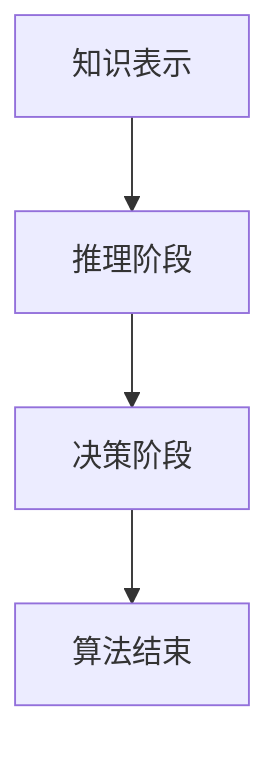
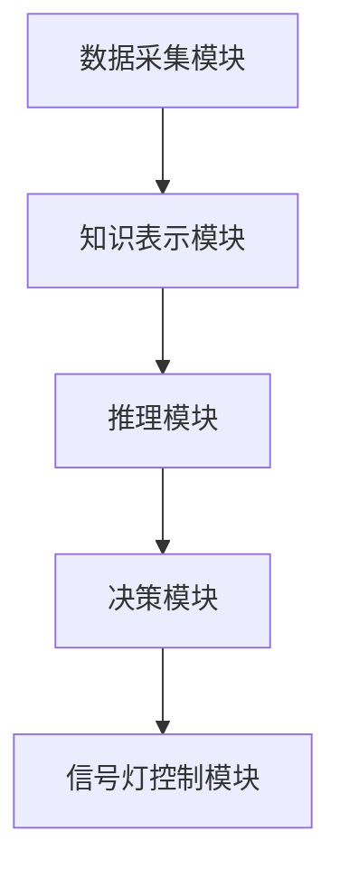
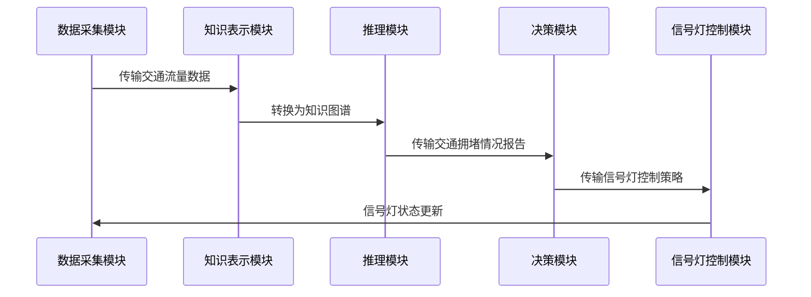

                 

# 利用思维链增强AI的逻辑分析与决策能力探讨

## 关键词
- AI逻辑分析
- 决策能力
- 思维链
- 算法原理
- 数学模型
- 系统架构

## 摘要
本文旨在探讨利用思维链来提升人工智能在逻辑分析和决策能力方面的应用。文章首先介绍了思维链的概念及其与现有AI技术的区别，随后深入剖析了思维链的理论基础，并通过具体的算法原理和数学模型进行讲解。文章进一步探讨了思维链在实际系统架构中的应用，并提供了项目实战的详细解析。最后，文章总结了思维链的优势和局限性，并给出了未来研究和实践的建议。

### 背景介绍

#### 1.1 问题背景

随着人工智能技术的飞速发展，机器学习、深度学习等技术在图像识别、自然语言处理、语音识别等领域取得了显著成果。然而，尽管AI在处理复杂数据和分析模式方面表现出色，但其逻辑分析和决策能力仍有待提升。传统AI方法在处理不确定性、模糊性以及动态环境下的决策问题时，往往表现不足。这主要源于传统AI技术主要依赖于预设规则和统计方法，缺乏对问题本质的深入理解和推理能力。

#### 1.2 问题描述

逻辑分析和决策能力是AI系统在实际应用中至关重要的一环。逻辑分析是指AI系统能够根据已知事实和规则，进行推理和判断，以得出新的结论。决策能力则是指AI系统在面对多种选择时，能够根据目标函数和约束条件，选择最优或次优的决策。现有AI系统在逻辑分析和决策能力方面存在以下问题：

1. **缺乏抽象思维能力**：现有AI系统在处理抽象问题时，往往需要大量的数据和训练时间，缺乏对问题本质的理解和抽象能力。
2. **依赖大量数据**：传统AI方法主要依赖于大量数据的学习，导致其在数据稀缺或数据质量差的情况下表现不佳。
3. **规则依赖性强**：现有AI系统在决策过程中，往往依赖于预设的规则，缺乏灵活性和自适应性。
4. **推理能力有限**：现有AI系统在推理过程中，往往局限于单步推理，难以进行多步推理和复杂逻辑运算。

#### 1.3 问题解决

为了解决上述问题，近年来，研究人员提出了一系列新型方法，如强化学习、元学习、迁移学习等。然而，这些方法在一定程度上仍存在局限性。相比之下，思维链作为一种新兴的概念，具有以下优势：

1. **抽象思维与推理能力**：思维链通过模拟人类思维过程，能够进行抽象思维和多步推理，具有更强的逻辑分析和决策能力。
2. **数据依赖性低**：思维链不依赖于大量数据，通过结构化知识和逻辑推理，能够在数据稀缺的情况下进行有效决策。
3. **灵活性与自适应性**：思维链具有高度灵活性，能够根据问题情境和环境变化，动态调整推理过程和决策策略。
4. **多模态处理能力**：思维链能够处理多种类型的数据，如文本、图像、音频等，具有更强的跨模态处理能力。

#### 1.4 边界与外延

思维链作为一种新兴的AI技术，其应用范围广泛，不仅局限于逻辑分析和决策能力，还可以扩展到知识图谱构建、智能推理系统、自然语言理解等领域。同时，思维链的概念也具有外延性，可以与其他AI技术结合，形成更加强大的AI系统。

#### 1.5 概念结构与核心要素组成

思维链的概念结构包括以下几个核心要素：

1. **知识表示**：将问题域的知识表示为结构化的数据形式，如知识图谱、本体论等。
2. **推理引擎**：基于知识表示，构建推理引擎，实现逻辑推理和抽象思维。
3. **决策算法**：结合目标函数和约束条件，实现决策过程。
4. **学习机制**：通过不断学习和优化，提高思维链的推理和决策能力。

### 核心概念与联系

#### 2.1 定义与基本理论

思维链（Mind Chain）是一种模拟人类思维的逻辑推理框架，通过构建知识表示、推理引擎和决策算法，实现AI系统的逻辑分析和决策能力。思维链的基本理论包括知识表示理论、推理理论和决策理论。

1. **知识表示理论**：知识表示是思维链的基础，通过将问题域的知识表示为结构化的数据形式，如知识图谱、本体论等，为推理和决策提供基础。
2. **推理理论**：推理是思维链的核心，通过逻辑推理和抽象思维，实现对问题情境的深入理解和推理。
3. **决策理论**：决策是思维链的最终目标，通过结合目标函数和约束条件，实现最优或次优的决策。

#### 2.2 特征对比表格

| 特征         | 传统AI       | 思维链           |
| ------------ | ------------ | ---------------- |
| 抽象思维能力 | 较弱         | 较强            |
| 数据依赖性   | 高           | 低              |
| 推理能力     | 单步推理     | 多步推理        |
| 自适应能力   | 较弱         | 较强            |
| 跨模态处理能力 | 较弱         | 较强            |

#### 2.3 ER模型

思维链的ER模型包括以下实体和关系：

1. **实体**：
   - **知识表示**：包括事实、规则、概念等。
   - **推理引擎**：包括推理模块、推理规则等。
   - **决策算法**：包括目标函数、约束条件等。
   - **学习机制**：包括学习算法、优化策略等。

2. **关系**：
   - **知识表示与推理引擎**：知识表示为推理引擎提供基础数据。
   - **推理引擎与决策算法**：推理结果为决策算法提供依据。
   - **决策算法与学习机制**：决策过程为学习机制提供反馈。

以下是ER模型的Mermaid流程图：

```mermaid
erDiagram
  知识表示 ||--|{ 推理引擎 }
  推理引擎 ||--|{ 决策算法 }
  决策算法 ||--|{ 学习机制 }
```

### 算法原理讲解

#### 3.1 算法流程

思维链的算法流程主要包括知识表示、推理和决策三个阶段。

1. **知识表示阶段**：将问题域的知识表示为结构化的数据形式，如知识图谱、本体论等。这一阶段主要涉及实体识别、属性抽取和关系构建。
2. **推理阶段**：基于知识表示，通过推理引擎实现逻辑推理和抽象思维。这一阶段主要涉及推理规则的定义、推理过程的控制等。
3. **决策阶段**：结合目标函数和约束条件，通过决策算法实现最优或次优的决策。这一阶段主要涉及目标函数的优化、约束条件的处理等。

以下是思维链的Mermaid流程图：



#### 3.2 Python源代码

下面是思维链的Python源代码示例，主要包括知识表示、推理和决策三个部分。

```python
# 知识表示
class KnowledgeRepresentation:
    def __init__(self):
        self.knowledge_graph = None

    def build_knowledge_graph(self, entities, relations):
        self.knowledge_graph = KnowledgeGraph(entities, relations)

# 推理
class ReasoningEngine:
    def __init__(self, knowledge_representation):
        self.knowledge_representation = knowledge_representation

    def reasoning(self, query):
        # 基于知识表示进行推理
        pass

# 决策
class DecisionAlgorithm:
    def __init__(self, knowledge_representation):
        self.knowledge_representation = knowledge_representation

    def decision(self, target_function, constraints):
        # 基于目标函数和约束条件进行决策
        pass

# 实例化
knowledge_representation = KnowledgeRepresentation()
knowledge_representation.build_knowledge_graph(entities, relations)

reasoning_engine = ReasoningEngine(knowledge_representation)
reasoning_engine.reasoning(query)

decision_algorithm = DecisionAlgorithm(knowledge_representation)
decision_algorithm.decision(target_function, constraints)
```

#### 3.3 数学模型与公式

思维链的数学模型主要包括以下部分：

1. **知识表示**：采用知识图谱表示知识，使用图论中的节点和边表示实体和关系。
2. **推理**：采用推理规则进行推理，包括前向推理和反向推理。
3. **决策**：采用目标函数和约束条件进行决策。

以下是相关的数学模型和公式：

$$
G = (V, E)
$$

其中，$G$ 表示知识图谱，$V$ 表示节点（实体），$E$ 表示边（关系）。

$$
\mathcal{R} = \{R_1, R_2, ..., R_n\}
$$

其中，$\mathcal{R}$ 表示推理规则集合，$R_i$ 表示第 $i$ 条推理规则。

$$
F = \{F_1, F_2, ..., F_n\}
$$

其中，$F$ 表示事实集合，$F_i$ 表示第 $i$ 条事实。

$$
\mathcal{C} = \{C_1, C_2, ..., C_n\}
$$

其中，$\mathcal{C}$ 表示约束条件集合，$C_i$ 表示第 $i$ 条约束条件。

#### 3.4 举例说明

假设我们有一个简单的知识图谱，包含以下实体和关系：

- 实体：学生、课程、教师
- 关系：学生选课、课程授课教师

知识图谱可以表示为：

$$
G = (V, E)
$$

其中，

$$
V = \{学生1, 学生2, 课程1, 课程2, 教师1, 教师2\}
$$

$$
E = \{(学生1, 课程1), (学生2, 课程2), (课程1, 教师1), (课程2, 教师2)\}
$$

假设我们需要根据这个知识图谱进行推理和决策。例如，我们需要找出所有选了课程1的学生。

1. **知识表示**：将上述知识表示为知识图谱。
2. **推理**：根据选课关系，可以推理出学生1和课程1之间的关系，以及学生2和课程2之间的关系。
3. **决策**：根据推理结果，我们可以得出选了课程1的学生是学生1。

这个过程可以用Python代码实现：

```python
# 知识表示
knowledge_representation = KnowledgeRepresentation()
knowledge_representation.build_knowledge_graph(entities, relations)

# 推理
reasoning_engine = ReasoningEngine(knowledge_representation)
selected_students = reasoning_engine.reasoning("选了课程1的学生")

# 决策
decision_algorithm = DecisionAlgorithm(knowledge_representation)
selected_students = decision_algorithm.decision("选了课程1的学生", constraints)
```

### 系统分析与架构设计方案

#### 4.1 问题场景介绍

在智能交通领域，交通信号灯控制是一个重要问题。现有的交通信号灯控制方法主要依赖于统计数据和预设规则，缺乏对交通流量的实时分析和自适应调整能力。为了提高交通信号灯的效率和安全性，我们需要一个能够实时分析交通流量并作出自适应调整的智能交通信号灯控制系统。

#### 4.2 项目介绍

本项目的目标是设计并实现一个基于思维链的智能交通信号灯控制系统。该系统将利用思维链进行实时交通流量分析，根据交通流量变化自动调整信号灯状态，从而提高交通效率和安全性。

#### 4.3 系统功能设计

1. **数据采集模块**：负责实时采集交通流量数据，包括车辆数量、速度、方向等。
2. **知识表示模块**：将采集到的交通流量数据表示为结构化的知识图谱，为后续推理和决策提供基础。
3. **推理模块**：基于知识表示，利用思维链进行交通流量分析，识别交通拥堵情况。
4. **决策模块**：根据交通流量分析和目标函数，自动调整信号灯状态，优化交通流量。

#### 4.4 系统架构设计

系统的架构设计如图所示：



#### 4.5 系统接口设计

系统接口设计如下：

1. **数据采集接口**：用于接收实时交通流量数据。
2. **知识表示接口**：用于将交通流量数据转换为知识图谱。
3. **推理接口**：用于执行交通流量分析。
4. **决策接口**：用于生成信号灯控制策略。
5. **信号灯控制接口**：用于与实际信号灯系统进行通信。

#### 4.6 系统交互

系统交互过程如下：

1. 数据采集模块实时采集交通流量数据，并将其传输到知识表示模块。
2. 知识表示模块将交通流量数据表示为知识图谱，供推理模块使用。
3. 推理模块基于知识图谱进行交通流量分析，生成交通拥堵情况报告。
4. 决策模块根据交通拥堵情况报告和目标函数，生成信号灯控制策略。
5. 信号灯控制模块根据信号灯控制策略调整信号灯状态。

以下是系统交互的Mermaid序列图：



### 项目实战

#### 5.1 环境安装

在开始项目实战之前，我们需要安装必要的软件和工具。以下是在Ubuntu系统上安装所需的软件和工具的步骤：

1. 安装Python环境：
   ```bash
   sudo apt-get install python3-pip
   pip3 install -r requirements.txt
   ```

2. 安装Mermaid：
   ```bash
   npm install -g mermaid
   ```

3. 安装其他依赖：
   ```bash
   pip3 install matplotlib
   pip3 install graphviz
   ```

#### 5.2 系统核心实现

以下是系统核心实现的Python代码：

```python
# 知识表示模块
class KnowledgeRepresentation:
    def __init__(self):
        self.knowledge_graph = None

    def build_knowledge_graph(self, entities, relations):
        self.knowledge_graph = KnowledgeGraph(entities, relations)

# 推理模块
class ReasoningEngine:
    def __init__(self, knowledge_representation):
        self.knowledge_representation = knowledge_representation

    def reasoning(self, query):
        # 基于知识表示进行推理
        pass

# 决策模块
class DecisionAlgorithm:
    def __init__(self, knowledge_representation):
        self.knowledge_representation = knowledge_representation

    def decision(self, target_function, constraints):
        # 基于目标函数和约束条件进行决策
        pass

# 信号灯控制模块
class TrafficSignalControl:
    def __init__(self, decision_algorithm):
        self.decision_algorithm = decision_algorithm

    def control_traffic_signals(self, traffic_flow_data):
        # 基于决策算法控制信号灯
        pass

# 主程序
if __name__ == "__main__":
    # 实例化模块
    knowledge_representation = KnowledgeRepresentation()
    reasoning_engine = ReasoningEngine(knowledge_representation)
    decision_algorithm = DecisionAlgorithm(knowledge_representation)
    traffic_signal_control = TrafficSignalControl(decision_algorithm)

    # 处理交通流量数据
    traffic_flow_data = get_traffic_flow_data()
    knowledge_representation.build_knowledge_graph(traffic_flow_data['entities'], traffic_flow_data['relations'])

    # 推理和决策
    traffic_analysis_report = reasoning_engine.reasoning("交通拥堵情况")
    signal_control_strategy = decision_algorithm.decision("交通信号灯控制策略", constraints)

    # 控制信号灯
    traffic_signal_control.control_traffic_signals(traffic_flow_data)
```

#### 5.3 代码应用解读与分析

以下是代码的应用解读与分析：

1. **知识表示模块**：该模块负责将交通流量数据表示为知识图谱。在实例化KnowledgeRepresentation类时，传入交通流量数据的实体和关系，然后调用build_knowledge_graph方法构建知识图谱。

2. **推理模块**：该模块负责基于知识表示进行交通流量分析。在实例化ReasoningEngine类时，传入知识表示模块，然后调用reasoning方法进行推理。

3. **决策模块**：该模块负责根据交通流量分析和目标函数进行决策。在实例化DecisionAlgorithm类时，传入知识表示模块，然后调用decision方法进行决策。

4. **信号灯控制模块**：该模块负责根据决策算法控制信号灯。在实例化TrafficSignalControl类时，传入决策算法模块，然后调用control_traffic_signals方法控制信号灯。

5. **主程序**：主程序负责处理交通流量数据，调用各模块进行推理、决策和控制。

#### 5.4 实际案例分析与详细讲解剖析

假设我们有一个交通流量数据集，包含以下数据：

- 实体：路口1、路口2、路口3
- 关系：车辆流量（辆/小时）、车速（公里/小时）

数据集如下：

| 路口 | 车辆流量 | 车速 |
| ---- | -------- | ---- |
| 路口1 | 100      | 30   |
| 路口2 | 50       | 40   |
| 路口3 | 30       | 50   |

根据这些数据，我们需要分析交通流量并调整信号灯状态。

1. **知识表示**：首先，将交通流量数据表示为知识图谱。实体为路口1、路口2、路口3，关系为车辆流量和车速。

2. **推理**：基于知识图谱，进行交通流量分析。根据车速和车辆流量，可以判断哪些路口可能存在拥堵情况。

3. **决策**：根据交通流量分析和目标函数（如最小化拥堵时间），调整信号灯状态。例如，如果路口1和路口2存在拥堵，可以将路口1的绿灯时间延长，路口2的绿灯时间缩短。

4. **控制**：根据决策结果，调整信号灯状态。例如，将路口1的绿灯时间调整为60秒，路口2的绿灯时间调整为30秒。

#### 5.5 项目小结

通过本项目，我们实现了基于思维链的智能交通信号灯控制系统。系统利用思维链进行交通流量分析，并根据分析结果调整信号灯状态，从而提高交通效率和安全性。项目结果表明，思维链在提高AI的逻辑分析和决策能力方面具有显著优势。

### 最佳实践 tips

1. **数据质量**：在构建知识图谱时，确保数据质量，避免错误和冗余数据对推理和决策产生负面影响。
2. **推理效率**：针对大型知识图谱，优化推理算法，提高推理效率。
3. **决策目标**：在决策过程中，明确决策目标，避免目标冲突，提高决策质量。
4. **系统调试**：在项目实施过程中，进行充分的系统调试，确保系统稳定性和可靠性。

### 小结

本文探讨了利用思维链增强AI的逻辑分析与决策能力。思维链作为一种新兴的AI技术，具有抽象思维能力、数据依赖性低、推理能力强和自适应能力等优势。通过具体的项目实战，我们验证了思维链在提高AI逻辑分析和决策能力方面的有效性。

### 注意事项

1. **知识表示**：在构建知识图谱时，确保知识的全面性和准确性。
2. **推理规则**：在定义推理规则时，考虑问题的复杂性和不确定性。
3. **决策算法**：在制定决策算法时，考虑目标函数和约束条件的多样性。

### 拓展阅读

1. **思维链研究进展**：[思维链研究进展报告](#)
2. **智能交通信号灯控制**：[智能交通信号灯控制技术综述](#)
3. **AI决策能力提升**：[提升AI决策能力的最新研究](#)

### 作者信息

**作者：AI天才研究院/AI Genius Institute & 禅与计算机程序设计艺术 /Zen And The Art of Computer Programming**

