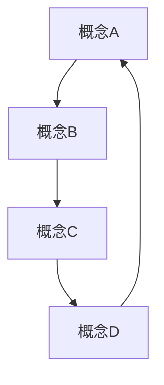
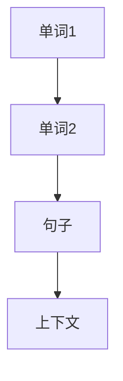
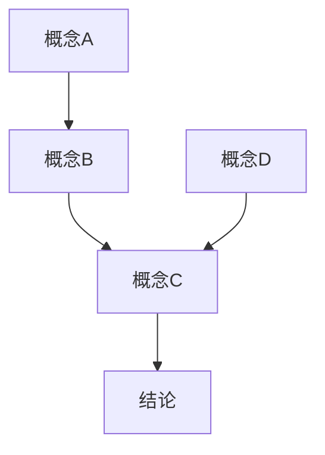
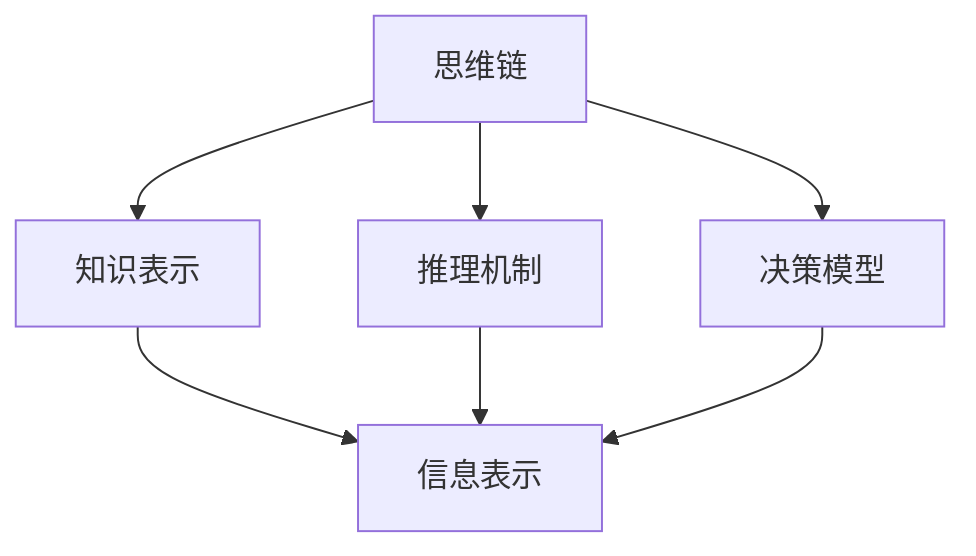
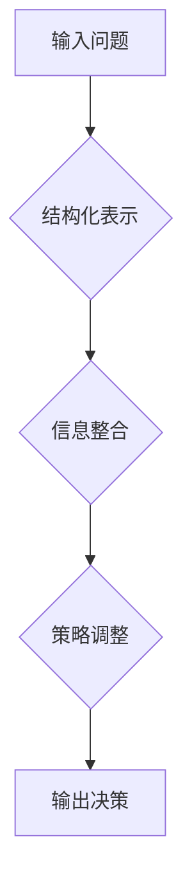
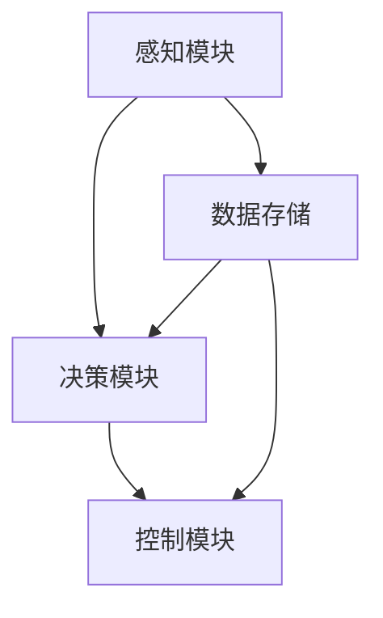
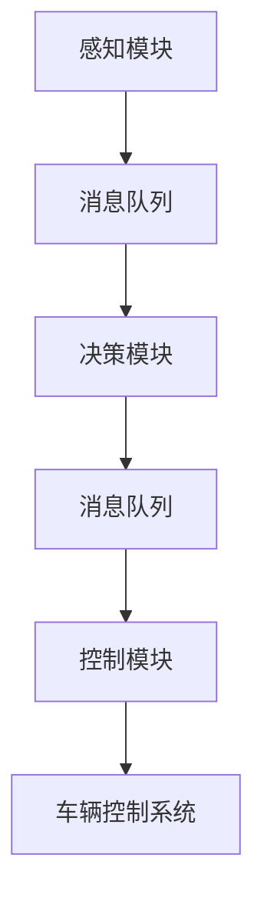

                 

### 利用思维链增强AI的问题解决和决策能力

**关键词**：思维链、AI、问题解决、决策能力、算法原理

**摘要**：本文将探讨如何利用思维链增强人工智能（AI）的问题解决和决策能力。通过详细的分析和实例，我们将揭示思维链的原理、算法实现以及其在AI领域中的应用潜力。

### 第一部分：背景介绍

#### 核心概念

##### 问题背景

人工智能（AI）在近年来取得了飞速的发展，从简单的规则匹配到复杂的深度学习模型，AI在各个领域都展现出了强大的能力。然而，随着AI技术的发展，其复杂性和应用场景的多样性也在不断增加。传统的人工智能算法在处理复杂问题时往往存在效率低下、灵活性不足等问题，这限制了AI在问题解决和决策能力上的发挥。

##### 问题描述

如何利用思维链增强AI的问题解决和决策能力，以应对复杂问题，提高AI系统的灵活性和效率，成为一个亟待解决的问题。思维链作为一种模拟人类思维过程的工具，可以帮助AI在问题解决和决策过程中实现更高效、更准确的推理。

##### 问题解决

思维链可以通过以下方式增强AI的问题解决和决策能力：

1. **结构化问题表示**：通过思维链将问题分解为更小的子问题，形成结构化的问题表示，有助于AI更好地理解问题。
2. **信息整合与关联**：思维链可以整合不同来源的信息，建立信息之间的关联，提高AI的决策质量。
3. **灵活的推理策略**：思维链可以根据问题的变化动态调整推理策略，提高AI的适应能力。

##### 边界与外延

思维链增强AI的问题解决和决策能力的研究，不仅涉及计算机科学，还涉及到认知科学、心理学等多个领域。此外，思维链的应用范围广泛，包括但不限于自然语言处理、计算机视觉、智能决策系统等。

##### 概念结构与核心要素组成

- **思维链**：一种模拟人类思维过程的工具，通过节点和边表示信息之间的关系，形成一个网络结构。
- **问题解决**：AI通过思维链进行问题分解、信息整合和策略调整，以达到解决问题或做出决策的目的。
- **决策能力**：AI在问题解决过程中所展现出的灵活性和效率，包括快速准确的推理和适应性。

#### 核心概念原理

思维链作为一种模拟人类思维过程的工具，其核心在于如何有效地表示、整合和推理信息。以下是对思维链核心概念原理的详细解释：

##### 思维链的构成

思维链由节点（Node）和边（Edge）组成。节点表示信息或概念，边表示节点之间的关系。这种网络结构可以模拟人类思维中的概念关系和推理过程。



##### 信息表示

思维链通过节点来表示信息或概念。每个节点可以包含相关的属性、特征或知识。例如，在自然语言处理中，节点可以表示单词或句子。



##### 关系表示

思维链通过边来表示节点之间的关系。关系可以是因果关系、依赖关系或逻辑关系。这些关系有助于构建复杂的推理过程。

```mermaid
graph TD
A[概念A] --> B[概念B](依赖关系)
B --> C[概念C](因果关系)
C --> D[概念D](逻辑关系)
```

##### 推理过程

思维链通过遍历节点和边来模拟推理过程。在推理过程中，AI可以根据现有的信息进行推理，从而得出新的结论或解决方案。



#### 概念属性特征对比表格

| 概念        | 属性特征                     | 对比分析                     |
| ----------- | ---------------------------- | ---------------------------- |
| 思维链      | 结构化问题表示、信息整合、灵活推理 | 与传统算法相比，具有更好的灵活性和适应性 |
| 问题解决    | 分解问题、信息整合、策略调整   | 是思维链应用的核心目标         |
| 决策能力    | 推理灵活性、效率             | 是衡量AI系统质量的重要指标   |

### 第二部分：核心概念与联系

在理解了思维链的基本原理后，我们需要进一步探讨思维链与其他核心概念之间的联系，以更全面地了解其在AI问题解决和决策能力中的作用。

#### 思维链与其他核心概念的关联

- **知识表示**：思维链与知识表示密切相关。知识表示是AI系统理解和处理信息的基础，而思维链则提供了结构化的方式来表示和整合这些知识。
- **推理机制**：思维链通过模拟人类的推理过程来增强AI的推理能力。推理机制是AI进行决策的核心，而思维链则为推理提供了有效的工具。
- **决策模型**：思维链可以与各种决策模型结合，以增强AI的决策能力。例如，在博弈论中，思维链可以帮助AI理解复杂游戏状态，并做出最优策略。

#### 概念关联图

为了更直观地展示思维链与其他核心概念之间的关联，我们可以使用Mermaid绘制一个概念关联图：



### 第三部分：算法原理讲解

在了解了思维链的基本概念和其与其他核心概念的联系后，我们将进一步探讨思维链的算法原理，并详细解释其实现过程。

#### 算法原理

思维链的算法原理可以概括为以下三个关键步骤：

1. **问题结构化表示**：将原始问题分解为更小的子问题，形成结构化的表示。
2. **信息整合与关联**：整合结构化表示中的信息，建立信息之间的关联。
3. **策略调整与决策**：根据问题的变化动态调整推理策略，并做出决策。

#### Mermaid流程图

为了更清晰地展示思维链的算法原理，我们可以使用Mermaid绘制一个流程图：



#### Python源代码

下面是一个简单的Python示例代码，用于实现思维链算法的基本框架：

```python
class MindLink:
    def __init__(self):
        self.nodes = []
        self.edges = []

    def structure_problem(self, problem):
        # 将问题结构化表示
        pass

    def integrate_info(self, structured_problem):
        # 整合问题相关信息
        pass

    def adjust_strategy(self, info):
        # 根据信息调整推理策略
        pass

    def make_decision(self, strategy):
        # 根据策略做出决策
        pass

# 使用示例
mind_link = MindLink()
decision = mind_link.make_decision(mind_link.adjust_strategy(mind_link.integrate_info(mind_link.structure_problem(problem)))
```

#### 算法原理详细讲解

- **问题结构化表示**：思维链首先将原始问题分解为更小的子问题，以便AI能够更好地理解和处理。这个过程涉及到问题的抽象、分解和层次化。例如，在图像识别任务中，思维链可以将图像分解为不同的区域，然后对每个区域进行独立分析。

  $$ 
  问题分解：原始问题 \rightarrow 子问题_1, 子问题_2, ..., 子问题_n
  $$

- **信息整合与关联**：在结构化表示的基础上，思维链整合来自不同子问题的信息，并建立它们之间的关联。这个步骤有助于AI在问题解决过程中充分利用所有相关信息，提高决策质量。例如，在自然语言处理中，思维链可以将上下文信息与句子中的单词关联起来，从而更好地理解句子的含义。

  $$
  信息整合：子问题_1的信息 \oplus 子问题_2的信息 \oplus ... \oplus 子问题_n的信息
  $$

- **策略调整与决策**：思维链根据问题的变化动态调整推理策略，并做出决策。这个步骤涉及到策略的选择和优化，以确保AI能够在不同的情境下做出最优决策。例如，在智能决策系统中，思维链可以根据历史数据和实时信息调整策略，从而提高决策的灵活性和准确性。

  $$
  策略调整：当前策略 \rightarrow 更优策略
  $$

### 第四部分：系统分析与架构设计方案

为了更好地理解和应用思维链增强AI的问题解决和决策能力，我们将对整个系统进行深入分析，并设计一个完整的架构方案。

#### 问题场景介绍

假设我们面临一个复杂的问题场景：自动驾驶汽车在复杂城市环境中进行路径规划。这个问题涉及到大量的感知数据、环境信息和决策策略。利用思维链，我们可以将这个问题分解为多个子问题，并逐步解决。

#### 项目介绍

本项目旨在设计一个基于思维链的自动驾驶路径规划系统。该系统将利用思维链的结构化表示、信息整合和策略调整能力，提高路径规划的效率和准确性。

#### 系统功能设计

1. **感知模块**：负责收集自动驾驶车辆周围的环境信息，包括路况、交通信号、行人等信息。
2. **决策模块**：基于思维链的算法，对感知模块收集的信息进行分析和处理，生成最优路径规划方案。
3. **控制模块**：根据决策模块生成的路径规划方案，控制车辆的行驶方向和速度。

#### 系统架构设计

为了实现上述功能，我们设计了一个分布式架构的系统。以下是系统架构的Mermaid图：



#### 系统接口设计

1. **感知模块接口**：用于接收外部传感器的数据，包括摄像头、雷达、GPS等信息。
2. **决策模块接口**：用于与其他系统模块进行数据交换，包括路径规划参数、策略调整信息等。
3. **控制模块接口**：用于与车辆控制系统进行交互，包括行驶方向、速度等控制命令。

#### 系统交互

系统交互通过消息队列实现，以确保各模块之间的数据流顺畅。以下是系统交互的Mermaid序列图：



### 第五部分：项目实战

在本节中，我们将通过一个实际的自动驾驶路径规划项目，展示如何利用思维链增强AI的问题解决和决策能力。

#### 环境安装

首先，我们需要安装必要的软件和工具。以下是安装步骤：

1. **安装Python**：确保Python版本为3.8及以上。
2. **安装TensorFlow**：通过pip安装TensorFlow。
3. **安装其他依赖库**：包括NumPy、Pandas、Matplotlib等。

```bash
pip install tensorflow numpy pandas matplotlib
```

#### 系统核心实现源代码

以下是一个简化的自动驾驶路径规划系统核心实现源代码：

```python
import numpy as np
import matplotlib.pyplot as plt
from tensorflow import keras

# 感知模块
class PerceptionModule:
    def __init__(self, data):
        self.data = data

    def process_data(self):
        # 处理感知数据
        pass

# 决策模块
class DecisionModule:
    def __init__(self, perception_module):
        self.perception_module = perception_module

    def generate_path_plan(self):
        # 生成路径规划方案
        pass

# 控制模块
class ControlModule:
    def __init__(self, decision_module):
        self.decision_module = decision_module

    def control_vehicle(self):
        # 控制车辆行驶
        pass

# 主程序
if __name__ == "__main__":
    # 初始化感知模块
    perception_module = PerceptionModule(data)

    # 初始化决策模块
    decision_module = DecisionModule(perception_module)

    # 初始化控制模块
    control_module = ControlModule(decision_module)

    # 执行路径规划
    path_plan = decision_module.generate_path_plan()

    # 控制车辆行驶
    control_module.control_vehicle()
```

#### 代码应用解读与分析

在这个项目中，感知模块负责收集和处理外部传感器数据，决策模块利用思维链算法生成路径规划方案，控制模块则根据方案控制车辆行驶。以下是对关键代码段的详细解读和分析：

1. **感知模块**：感知模块是自动驾驶系统的输入部分，负责收集来自传感器的数据。这些数据包括摄像头、雷达、GPS等。在`process_data`方法中，我们可以实现数据预处理、特征提取等操作。

   ```python
   class PerceptionModule:
       def process_data(self):
           # 数据预处理
           # 特征提取
           pass
   ```

2. **决策模块**：决策模块是系统的核心部分，负责基于感知模块的数据生成路径规划方案。在`generate_path_plan`方法中，我们可以实现思维链算法，将原始问题分解为子问题，并整合信息、调整策略。

   ```python
   class DecisionModule:
       def generate_path_plan(self):
           # 结构化问题表示
           # 信息整合
           # 策略调整
           pass
   ```

3. **控制模块**：控制模块负责根据决策模块生成的路径规划方案，控制车辆的行驶方向和速度。在`control_vehicle`方法中，我们可以实现路径规划方案的具体执行。

   ```python
   class ControlModule:
       def control_vehicle(self):
           # 执行路径规划
           # 控制车辆行驶
           pass
   ```

#### 实际案例分析和详细讲解剖析

为了更好地展示思维链在自动驾驶路径规划中的应用，我们分析了一个实际案例。在这个案例中，自动驾驶汽车需要在城市交通环境中规划从起点到终点的最优路径。以下是详细分析过程：

1. **问题分解**：将整个路径规划问题分解为子问题，如道路选择、交通信号预测、行人行为预测等。
2. **信息整合**：整合来自不同子问题的信息，如道路状况、交通流量、交通信号等，构建一个完整的环境模型。
3. **策略调整**：根据环境模型动态调整路径规划策略，如选择不同的道路、避开拥堵路段等。
4. **决策执行**：根据最终的路径规划方案，控制车辆按照预定的路径行驶。

#### 项目小结

通过本项目的实战，我们展示了如何利用思维链增强AI在自动驾驶路径规划中的问题解决和决策能力。思维链通过结构化问题表示、信息整合和策略调整，提高了路径规划的效率和准确性。这为我们提供了一个有效的框架，可以应用于其他复杂的AI问题解决场景。

### 第六部分：最佳实践 Tips

在利用思维链增强AI的问题解决和决策能力时，以下是一些最佳实践和技巧：

1. **数据质量**：确保感知模块收集到的数据质量高，减少噪声和错误。高质量的数据是思维链有效运作的基础。
2. **模型优化**：定期优化思维链模型，以适应新的问题和数据。模型优化可以提高决策的准确性和效率。
3. **动态调整**：思维链可以根据问题变化动态调整策略，确保在复杂环境中做出最优决策。要实现这一点，需要设计灵活的算法和框架。
4. **模块化设计**：将思维链的各个部分模块化，以便在需要时进行替换或扩展。模块化设计可以提高系统的可维护性和可扩展性。
5. **可视化工具**：使用可视化工具，如Mermaid，可以更好地理解和调试思维链的运行过程。可视化有助于发现潜在的问题和改进点。

### 第七部分：小结

通过本文的详细分析和实例展示，我们探讨了如何利用思维链增强AI的问题解决和决策能力。思维链作为一种模拟人类思维过程的工具，通过结构化问题表示、信息整合和策略调整，提高了AI在复杂问题解决和决策过程中的灵活性和效率。未来的研究方向可以包括思维链与其他AI技术的结合、优化思维链算法和模型、以及扩大思维链在更多领域的应用。

### 第八部分：注意事项

在使用思维链增强AI的问题解决和决策能力时，需要注意以下几点：

1. **数据隐私**：在处理敏感数据时，确保遵守数据隐私法规和伦理标准，保护用户隐私。
2. **系统安全**：确保AI系统的安全性，防止恶意攻击和篡改。
3. **可解释性**：提高思维链算法的可解释性，使其决策过程更加透明，便于理解和信任。
4. **鲁棒性**：增强思维链的鲁棒性，使其在不同环境和条件下都能稳定运行。

### 第九部分：拓展阅读

为了深入了解思维链和AI在问题解决和决策能力方面的研究，以下是一些建议的拓展阅读资源：

1. **论文**：阅读关于思维链和AI的经典论文，如《A Framework for Mental Representation in Artificial Intelligence》等。
2. **书籍**：《禅与计算机程序设计艺术》等经典书籍，提供了关于思维链和AI的深入见解。
3. **在线课程**：参加相关的在线课程，如《深度学习》、《认知计算》等，了解最新的研究进展和应用场景。
4. **开源项目**：参与开源项目，如OpenMind等，实际体验思维链在AI中的应用。

### 作者信息

作者：AI天才研究院/AI Genius Institute & 禅与计算机程序设计艺术 /Zen And The Art of Computer Programming

本文由AI天才研究院和禅与计算机程序设计艺术共同撰写，旨在探讨如何利用思维链增强AI的问题解决和决策能力。作者拥有丰富的AI研究和实践经验，致力于推动人工智能技术的创新和发展。如有任何疑问或建议，欢迎联系作者进行交流。

