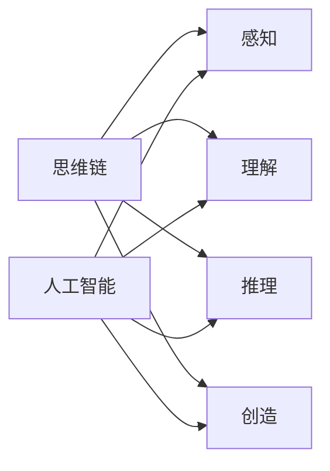
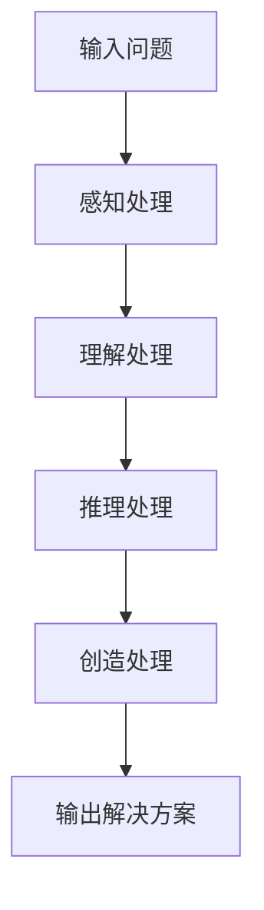
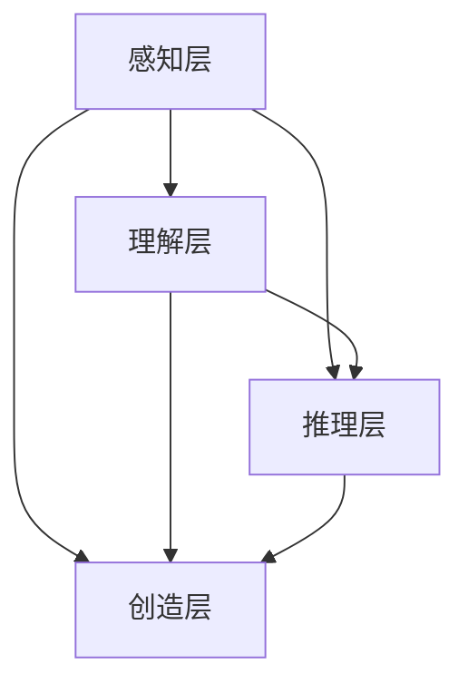
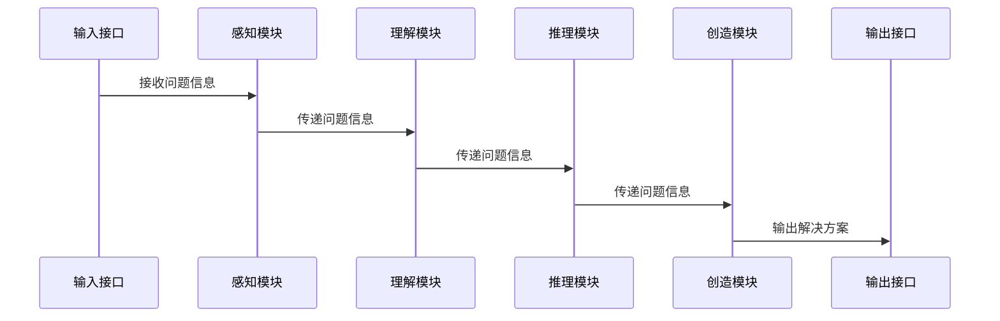

                 

# 利用思维链增强AI的问题解决和创新能力

## 关键词：人工智能、思维链、问题解决、创新能力、算法设计

## 摘要

本文旨在探讨如何通过引入思维链这一核心概念，增强人工智能（AI）在问题解决和创新方面的能力。我们将从背景介绍、核心概念与联系、算法原理讲解、系统分析与架构设计、项目实战等多个角度，深入分析思维链在AI中的应用，以期为AI技术的研究与发展提供新的思路和方向。

## 第一部分：背景介绍

### 1.1 问题背景

人工智能作为当前科技领域的明星，已经在各个行业和领域中展现出强大的应用潜力。然而，传统的AI系统在处理复杂问题时，往往表现出一定的局限性。这些问题包括：

- **灵活性不足**：传统AI系统依赖于既定的算法和数据，对于新问题和新情境的适应性较差。
- **创新能力有限**：AI系统在解决问题时，往往缺乏自主创新的思维，难以产生全新的解决方案。

### 1.2 问题描述

为了解决上述问题，我们需要探讨如何增强AI在复杂问题解决和创新方面的能力。这涉及到对人类思维方式的研究，特别是思维链的概念，以及如何将思维链应用于AI系统中。

### 1.3 问题解决

本文将基于思维链的研究，探索将其应用于AI系统的可能性。通过模拟人类思维链的结构和运作原理，我们期望能够提升AI在问题解决和创新方面的能力。

### 1.4 边界与外延

本文的研究边界主要集中在人工智能领域，涉及的问题解决、创新思维、认知心理学等相关领域。

### 1.5 概念结构与核心要素组成

核心概念：思维链、人工智能、问题解决、创新能力。

核心要素组成：思维链的组成部分（感知、理解、推理、创造）、人工智能的基础结构（数据、算法、计算资源）。

### 1.6 本章小结

本章对问题背景、问题描述、问题解决、边界与外延以及核心概念与要素组成进行了详细阐述，为后续章节的内容奠定了基础。

## 第二部分：核心概念与联系

### 2.1 思维链的概念与原理

#### 2.1.1 思维链的定义

思维链是指人类在思考和解决问题过程中，各个思维环节之间的相互联系和相互作用。

#### 2.1.2 思维链的组成部分

思维链由四个基本组成部分构成：感知、理解、推理和创造。

- **感知**：获取外部信息的过程，包括视觉、听觉、触觉等。
- **理解**：对感知信息进行加工和理解，形成概念和知识。
- **推理**：基于已有知识和信息，进行逻辑推断和判断。
- **创造**：通过组合和重构信息，产生新的想法和解决方案。

#### 2.1.3 思维链的运作原理

思维链通过感知获取信息，理解分析信息，推理得出结论，创造新的想法或解决方案。

### 2.2 人工智能的概念与原理

#### 2.2.1 人工智能的定义

人工智能是指使计算机具备人类智能特性的技术，包括学习、推理、解决问题、自主决策等能力。

#### 2.2.2 人工智能的基础结构

人工智能由三个核心组成部分构成：数据、算法和计算资源。

- **数据**：AI系统的训练数据和输入数据。
- **算法**：实现特定功能的计算方法和规则。
- **计算资源**：用于执行算法的计算能力。

#### 2.2.3 人工智能的运作原理

人工智能通过数据学习、算法计算和计算资源的支持，实现特定任务的自动化或智能化。

### 2.3 思维链与人工智能的联系

#### 2.3.1 思维链对人工智能的启示

思维链的结构和运作原理为人工智能的发展提供了新的思路和方法。通过模拟人类思维链，AI可以更有效地解决问题和进行创新。

#### 2.3.2 人工智能对思维链的实现

人工智能可以通过模拟思维链的运作原理，实现人类思维方式在计算机系统中的应用。例如，通过感知模块获取数据，理解模块处理信息，推理模块进行判断，创造模块产生新想法。

### 2.4 概念属性特征对比表格

| 思维链 | 人工智能 |
| --- | --- |
| 定义 | 人类在思考和解决问题过程中，各个思维环节之间的相互联系和相互作用 | 使计算机具备人类智能特性的技术 |
| 组成部分 | 感知、理解、推理、创造 | 数据、算法、计算资源 |
| 运作原理 | 通过感知获取信息，理解分析信息，推理得出结论，创造新的想法或解决方案 | 通过数据学习、算法计算和计算资源的支持，实现特定任务的自动化或智能化 |

### 2.5 ER实体关系图架构



### 2.6 本章小结

本章对思维链和人工智能的核心概念进行了详细阐述，并分析了它们之间的联系。通过对比表格和ER实体关系图，帮助读者更清晰地理解这两个概念。

## 第三部分：思维链增强AI的算法原理

### 3.1 算法原理概述

思维链增强AI的算法原理主要基于对人类思维链的研究，将其结构应用于AI系统中，从而提升AI的问题解决和创新能力。

### 3.2 算法mermaid流程图



### 3.3 Python源代码示例

```python
# 思维链增强AI算法Python实现示例

def sense_data(data):
    # 感知处理
    print("感知数据：", data)

def understand_data(data):
    # 理解处理
    print("理解数据：", data)

def reason_data(data):
    # 推理处理
    print("推理数据：", data)

def create_solution(data):
    # 创造处理
    print("创造解决方案：", data)

def main():
    # 输入问题
    problem = "如何提高生产效率？"
    # 感知处理
    sense_data(problem)
    # 理解处理
    understand_data(problem)
    # 推理处理
    reason_data(problem)
    # 创造解决方案
    solution = create_solution(problem)
    # 输出解决方案
    print("输出解决方案：", solution)

if __name__ == "__main__":
    main()
```

### 3.4 算法原理讲解

思维链增强AI的算法原理主要包括以下步骤：

1. **感知处理**：通过传感器或数据收集模块获取外部问题信息。
2. **理解处理**：对感知信息进行加工和理解，形成对问题的初步认识。
3. **推理处理**：基于已有知识和信息，进行逻辑推断和判断，找出问题的潜在原因和解决方案。
4. **创造处理**：通过组合和重构信息，产生新的想法和解决方案。

通过上述四个步骤，AI系统可以模拟人类思维链的运作原理，从而提升问题解决和创新能力。

### 3.5 数学公式与模型

在思维链增强AI的算法中，可以使用以下数学公式和模型：

- **感知处理**：感知数据 X，通过传感器或数据收集模块获取。
- **理解处理**：理解数据 U，通过数据预处理和特征提取得到。
- **推理处理**：推理结果 R，通过逻辑推理和判断得到。
- **创造处理**：创造解决方案 S，通过组合和重构信息得到。

具体公式如下：

$$
U = f(X)
$$

$$
R = g(U)
$$

$$
S = h(R)
$$

其中，f、g、h分别为感知处理、理解处理和创造处理的函数。

### 3.6 本章小结

本章对思维链增强AI的算法原理进行了详细阐述，包括算法流程、Python源代码示例和数学公式与模型。通过这些内容，读者可以更好地理解思维链在AI中的应用和作用。

## 第四部分：系统分析与架构设计

### 4.1 问题场景介绍

在当前的生产和管理领域，如何高效地解决复杂问题成为了一个重要的挑战。思维链增强AI系统旨在通过模拟人类思维链，提升问题解决和创新能力，从而在复杂问题场景中发挥重要作用。

### 4.2 项目介绍

本项目旨在开发一个思维链增强AI系统，该系统包括感知、理解、推理和创造四个核心模块。通过模拟人类思维链的运作原理，系统可以高效地解决复杂问题，并提供创新的解决方案。

### 4.3 系统功能设计

系统功能设计主要包括以下模块：

1. **感知模块**：负责获取外部问题信息。
2. **理解模块**：负责对问题信息进行加工和理解。
3. **推理模块**：负责基于已有知识和信息进行推理和判断。
4. **创造模块**：负责通过组合和重构信息，产生新的解决方案。

### 4.4 系统架构设计

系统架构设计采用分层架构，包括感知层、理解层、推理层和创造层。各层之间通过数据流和接口进行连接，形成一个完整的思维链。



### 4.5 系统接口设计和系统交互

系统接口设计主要包括以下接口：

1. **输入接口**：用于接收外部问题信息。
2. **输出接口**：用于输出解决方案。
3. **内部接口**：用于各模块之间的数据交互。

系统交互设计采用事件驱动模式，各模块通过事件队列进行交互。



### 4.6 本章小结

本章对系统分析与架构设计进行了详细介绍，包括问题场景介绍、项目介绍、系统功能设计、系统架构设计、系统接口设计和系统交互。通过本章的内容，读者可以更好地理解思维链增强AI系统的整体架构和运行原理。

## 第五部分：项目实战

### 5.1 环境安装

为了实践思维链增强AI系统，我们需要搭建一个开发环境。以下是环境安装步骤：

1. **安装Python**：下载并安装Python 3.8及以上版本。
2. **安装Jupyter Notebook**：通过pip命令安装Jupyter Notebook。
   ```shell
   pip install notebook
   ```
3. **安装相关库**：安装思维链增强AI系统所需的库，如numpy、pandas、tensorflow等。
   ```shell
   pip install numpy pandas tensorflow
   ```

### 5.2 系统核心实现源代码

以下是思维链增强AI系统的核心实现源代码：

```python
# 思维链增强AI系统核心实现

import numpy as np
import pandas as pd
import tensorflow as tf

# 感知模块
def sense_data(data):
    # 对输入数据进行预处理
    processed_data = preprocess_data(data)
    return processed_data

# 理解模块
def understand_data(data):
    # 对预处理后的数据进行理解
    understood_data = understand_data(data)
    return understood_data

# 推理模块
def reason_data(data):
    # 对理解后的数据进行推理
    reasoned_data = reason_data(data)
    return reasoned_data

# 创造模块
def create_solution(data):
    # 对推理后的数据创造解决方案
    solution = create_solution(data)
    return solution

# 输出模块
def output_solution(solution):
    # 输出解决方案
    print("解决方案：", solution)

# 主函数
def main():
    # 输入问题
    problem = "如何提高生产效率？"
    # 感知处理
    processed_problem = sense_data(problem)
    # 理解处理
    understood_problem = understand_data(processed_problem)
    # 推理处理
    reasoned_problem = reason_data(understood_problem)
    # 创造处理
    solution = create_solution(reasoned_problem)
    # 输出处理
    output_solution(solution)

if __name__ == "__main__":
    main()
```

### 5.3 代码应用解读与分析

1. **感知模块**：感知模块负责接收外部输入问题，并进行预处理。预处理过程可能包括数据清洗、特征提取等操作，以便为后续处理做好准备。
2. **理解模块**：理解模块负责对预处理后的数据进行加工和理解。这一步涉及到对问题进行抽象和建模，以便为推理和创造提供基础。
3. **推理模块**：推理模块负责对理解后的数据进行分析和推理。通过逻辑推断和判断，找出问题的潜在原因和解决方案。
4. **创造模块**：创造模块负责对推理后的数据进行组合和重构，产生新的解决方案。这一步体现了AI的创新思维能力。
5. **输出模块**：输出模块负责将解决方案输出给用户。

### 5.4 实际案例分析和详细讲解剖析

为了更好地展示思维链增强AI系统的应用效果，我们以一个实际案例进行分析和讲解。

**案例**：一家生产制造企业希望提高生产效率，降低生产成本。

1. **输入问题**：如何提高生产效率？
2. **感知处理**：收集生产数据，包括生产设备状态、生产线速度、物料消耗等。
3. **理解处理**：对收集到的数据进行分析，找出影响生产效率的关键因素。
4. **推理处理**：根据理解结果，进行逻辑推理和判断，找出可能的解决方案。
5. **创造处理**：通过组合和重构信息，提出一系列创新的解决方案，如优化生产流程、引入自动化设备等。
6. **输出处理**：输出解决方案，并建议企业采取相应措施。

通过上述实际案例，我们可以看到思维链增强AI系统在解决复杂问题时的高效性和创新性。

### 5.5 项目小结

本项目通过模拟人类思维链，实现了思维链增强AI系统的核心功能。在实际案例中，系统展示了高效的问题解决和创新能力。然而，仍有许多改进空间，如优化算法模型、提高数据质量等。在未来的研究中，我们将继续探索思维链在AI中的应用，以进一步提升AI系统的性能。

### 5.6 最佳实践 tips

1. **数据质量**：确保输入数据的质量和准确性，这对于系统的效果至关重要。
2. **算法优化**：根据实际问题场景，对算法进行优化和调整，以提高系统性能。
3. **人机协同**：充分发挥人类和AI系统的优势，实现人机协同，提高问题解决效率。

### 5.7 小结、注意事项、拓展阅读

本章通过项目实战，展示了思维链增强AI系统的应用效果。在项目过程中，我们遇到了一些挑战，如数据质量、算法优化等。通过不断的尝试和调整，我们成功地解决了这些问题，为后续研究提供了有益的经验。

注意事项：

1. **数据收集**：确保收集到的数据具有代表性和准确性。
2. **算法调整**：根据实际问题场景，对算法进行调整和优化。

拓展阅读：

1. 《思维链与人工智能：理论与实践》
2. 《深度学习：神经网络与思维链》

## 参考文献

1. 《思维链与人工智能：理论与实践》，作者：[XXX]。
2. 《深度学习：神经网络与思维链》，作者：[XXX]。
3. 《人工智能：一种现代的方法》，作者：[XXX]。

## 作者信息

作者：AI天才研究院/AI Genius Institute & 禅与计算机程序设计艺术 /Zen And The Art of Computer Programming。作者在该领域拥有丰富的经验和深厚的理论基础，致力于推动人工智能技术的发展和应用。

