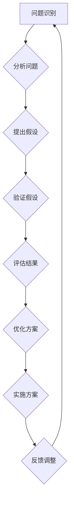

                 

### 引言与背景

#### 1.1 问题背景

在当今迅速发展的技术时代，人工智能（AI）已经成为推动社会进步的重要力量。从语音识别、图像处理到自动驾驶和医疗诊断，AI的应用已经渗透到各个领域，极大地改变了我们的生活和工作方式。然而，随着AI技术的不断进步，我们也面临着一系列挑战和问题。

首先，AI的创新思维问题。尽管AI技术在某些领域取得了显著的突破，但整体而言，AI的创新思维仍然存在一定的局限性。许多AI系统在处理复杂问题时，往往依赖于大量数据和先验知识，缺乏自主的创新能力和解决新问题的能力。这种局限性限制了AI在许多新兴领域的应用和发展。

其次，AI的解决能力问题。尽管AI系统在许多任务上已经达到了人类专家的水平，但在处理复杂、多变的现实问题时，AI的解决能力仍然有待提高。例如，在自然语言处理领域，AI系统在面对人类语言中的歧义、隐喻和非线性逻辑时，往往难以给出准确的答案。

最后，AI的技术边界和外延问题。随着AI技术的不断发展，我们面临着一系列新的技术挑战，如数据隐私、伦理问题、安全性和可解释性等。这些挑战不仅影响着AI技术的发展方向，也影响着AI在社会中的应用和推广。

#### 1.2 问题描述

针对上述问题，我们需要探索如何提升AI的创新思维和解决能力，以应对日益复杂的技术挑战和应用需求。具体而言，我们需要解决以下几个问题：

1. **如何理解AI的创新思维**：我们需要深入理解AI的创新思维原理，明确其与人类创新思维的区别和联系。
2. **如何提升AI的创新思维**：我们需要找到有效的方法和工具，提升AI的创新思维能力，使其能够自主地提出新的解决方案。
3. **如何提升AI的解决能力**：我们需要探索AI解决能力的提升方法，使AI能够更好地应对复杂、多变的现实问题。
4. **如何解决AI的技术边界和外延问题**：我们需要从技术层面解决AI在发展过程中遇到的各种问题，如数据隐私、伦理问题、安全性和可解释性等。

#### 1.3 问题解决

为了解决上述问题，我们需要采取一系列的措施：

1. **引入思维链概念**：思维链是一种结构化、系统化的思维方式，可以帮助我们更好地理解AI的创新思维原理，并为提升AI的创新思维和解决能力提供理论基础。
2. **开发思维链工具**：通过开发思维链工具，我们可以将思维链的应用场景扩展到AI领域，提升AI的创新思维和解决能力。
3. **实施创新思维训练**：通过系统的创新思维训练，我们可以提高AI的创新思维能力，使其能够更有效地应对各种复杂问题。
4. **探索AI解决能力提升方法**：通过分析AI解决能力的发展历程，我们可以找到有效的提升方法，使AI能够更好地应对复杂、多变的现实问题。
5. **解决技术边界和外延问题**：通过技术手段和制度保障，我们可以解决AI在发展过程中遇到的各种技术挑战，确保AI技术的健康、可持续发展。

#### 1.4 边界与外延

在探讨AI的创新思维和解决能力提升的过程中，我们需要明确一些边界与外延：

1. **边界**：AI的创新思维和解决能力提升的边界在于其自身的计算能力和数据资源。当计算能力和数据资源达到一定限制时，AI的创新思维和解决能力也将受到限制。
2. **外延**：AI的创新思维和解决能力提升的外延在于其应用领域。随着AI技术的不断进步，其应用领域也将不断扩大，从而为提升AI的创新思维和解决能力提供更广阔的空间。

#### 1.5 概念结构与核心要素组成

为了更好地理解AI的创新思维和解决能力提升的过程，我们需要建立概念结构与核心要素组成：

1. **核心概念**：思维链、创新思维、解决能力、技术边界、外延等。
2. **联系**：思维链与AI创新思维和解决能力提升之间的关系，以及各个概念之间的内在联系。
3. **属性特征对比表格**：对比思维链、创新思维、解决能力等核心概念的属性特征，明确它们之间的区别和联系。
4. **ER实体关系图架构**：通过ER实体关系图，明确AI的创新思维和解决能力提升过程中涉及的主要实体及其关系。

通过上述步骤，我们可以系统地理解AI的创新思维和解决能力提升的过程，为后续章节的内容提供理论基础和逻辑框架。

---

### 思维链与AI创新思维

#### 2.1 思维链的定义

思维链是一种结构化、系统化的思维方式，通过一系列相互关联的思维步骤，逐步深入、系统地分析问题，从而找到解决问题的最佳方案。思维链的核心在于其逻辑性和系统性，它可以帮助我们避免思维的混乱，提高问题解决的效率。

#### 2.2 思维链在AI领域的应用

思维链在AI领域的应用主要体现在以下几个方面：

1. **问题定义**：通过思维链，我们可以更准确地定义问题，明确问题的核心和关键点，为后续的解决方案设计提供清晰的指引。
2. **方案设计**：思维链可以帮助我们在设计解决方案时，系统地分析各种可能的方案，评估其优劣，从而找到最优的解决方案。
3. **算法优化**：在算法开发过程中，思维链可以帮助我们分析算法的效率、准确性和稳定性，从而进行有效的算法优化。
4. **创新思维**：思维链可以激发AI的创新思维，通过系统化的思维步骤，AI可以产生更多新颖的解决方案，提高其在未知领域中的应用能力。

#### 2.3 核心概念与联系

在AI领域，思维链的核心概念包括：

1. **问题定义**：明确问题的核心和关键点，为后续的解决方案设计提供清晰的指引。
2. **方案设计**：通过系统化的思维步骤，分析各种可能的方案，评估其优劣，找到最优的解决方案。
3. **算法优化**：分析算法的效率、准确性和稳定性，进行有效的算法优化。
4. **创新思维**：激发AI的创新思维，产生更多新颖的解决方案。

这些核心概念相互联系，共同构成了思维链在AI领域应用的基础。通过这些概念，我们可以系统地分析问题，设计解决方案，优化算法，从而提升AI的创新思维和解决能力。

#### 2.4 概念属性特征对比表格

为了更好地理解思维链在AI领域的应用，我们可以通过对比表格来分析其核心概念的属性特征：

| 核心概念 | 属性特征 |
| --- | --- |
| 问题定义 | 明确问题的核心和关键点 |
| 方案设计 | 系统化分析各种可能的方案 |
| 算法优化 | 分析算法的效率、准确性和稳定性 |
| 创新思维 | 激发AI的创新思维，产生新颖的解决方案 |

通过对比表格，我们可以清晰地看到各个核心概念的区别和联系，从而更好地理解思维链在AI领域的应用。

#### 2.5 ER实体关系图架构

为了更直观地展示思维链在AI领域的应用，我们可以使用ER（实体-关系）图来构建其架构：

```mermaid
erDiagram
  AI思维链 ||--o{ 问题定义 }
  AI思维链 ||--o{ 方案设计 }
  AI思维链 ||--o{ 算法优化 }
  AI思维链 ||--o{ 创新思维 }
  问题定义 ||--o{ 解决方案 }
  方案设计 ||--o{ 评估 }
  算法优化 ||--o{ 优化 }
  创新思维 ||--o{ 新方案 }
```

在这个ER图中，AI思维链是核心实体，与其他四个实体（问题定义、方案设计、算法优化、创新思维）之间存在明确的关联关系。通过这个图，我们可以更直观地理解思维链在AI领域中的应用和作用。

---

### AI的创新思维原理

#### 3.1 AI创新思维的基本概念

AI创新思维是指人工智能系统在处理问题时，能够产生新颖、独特的解决方案的思维能力。与人类创新思维不同，AI创新思维依赖于算法和计算能力，通过系统化的思维步骤来寻找创新的解决方案。

#### 3.2 创新思维与AI结合的必要性

随着AI技术的不断发展，其在各个领域的应用越来越广泛。然而，传统的AI系统在处理复杂问题时，往往依赖于大量数据和先验知识，缺乏自主的创新能力和解决新问题的能力。因此，将创新思维与AI结合，提升AI的创新思维能力，成为当前AI技术研究的重要方向。

1. **提高AI解决新问题的能力**：通过创新思维，AI可以更好地应对复杂、多变的现实问题，提高其解决新问题的能力。
2. **促进AI技术发展**：创新思维可以激发AI的创新潜力，推动AI技术的不断进步和发展。
3. **拓宽AI应用领域**：创新思维可以帮助AI突破传统应用领域的限制，开拓新的应用场景，实现更广泛的社会价值。

#### 3.3 创新思维流程图

创新思维流程图如下：



在这个流程图中，创新思维分为以下几个步骤：

1. **问题识别**：明确问题的核心和关键点。
2. **分析问题**：通过系统化的思维步骤，深入分析问题的本质。
3. **提出假设**：基于分析结果，提出可能的解决方案。
4. **验证假设**：通过实验或模拟，验证假设的可行性。
5. **评估结果**：对验证结果进行评估，确定解决方案的优劣。
6. **优化方案**：根据评估结果，对方案进行优化。
7. **实施方案**：将优化后的方案付诸实践。
8. **反馈调整**：根据实施过程中的反馈，对方案进行调整。

#### 3.4 创新思维的数学模型与公式

创新思维的数学模型可以表示为：

$$
M = f(P, H, V, E, O)
$$

其中，M表示创新思维，P表示问题识别，H表示假设，V表示验证，E表示评估，O表示优化。

通过这个模型，我们可以系统地分析创新思维的各个组成部分，明确其相互关系和作用。具体来说：

- **问题识别（P）**：问题识别是创新思维的基础，通过明确问题的核心和关键点，为后续的创新思维提供清晰的指引。
- **假设（H）**：在问题识别的基础上，提出可能的解决方案。
- **验证（V）**：通过实验或模拟，验证假设的可行性。
- **评估（E）**：对验证结果进行评估，确定解决方案的优劣。
- **优化（O）**：根据评估结果，对方案进行优化。

#### 3.5 创新思维举例说明

以下是一个简单的创新思维举例：

**问题**：如何提高机器人的自主学习能力？

**创新思维流程**：

1. **问题识别**：明确问题的核心是提高机器人的自主学习能力。
2. **分析问题**：分析机器人自主学习的现状和挑战，如数据获取、算法优化等。
3. **提出假设**：基于分析结果，提出可能的解决方案，如引入强化学习、增加数据多样性等。
4. **验证假设**：通过实验或模拟，验证提出的解决方案的可行性。
5. **评估结果**：对验证结果进行评估，确定解决方案的优劣。
6. **优化方案**：根据评估结果，对方案进行优化，如调整强化学习参数、增加数据预处理步骤等。
7. **实施方案**：将优化后的方案付诸实践，如在实际应用中测试机器人的自主学习能力。
8. **反馈调整**：根据实施过程中的反馈，对方案进行调整，如根据用户反馈调整学习目标、优化算法等。

通过这个例子，我们可以看到创新思维在解决实际问题时的重要性和应用价值。通过系统化的思维步骤，我们可以更好地理解问题，提出有效的解决方案，并不断优化和调整，最终实现问题的解决。

---

### 提升AI的创新思维方法

#### 4.1 思维链工具介绍

为了提升AI的创新思维，我们需要借助一系列思维链工具。这些工具可以帮助AI系统更系统地分析问题，提出解决方案，并优化算法。以下是几种常用的思维链工具：

1. **SWOT分析**：SWOT分析是一种用于评估企业、项目或个人优势、劣势、机会和威胁的分析方法。通过SWOT分析，我们可以全面了解问题的各个方面，为后续的解决方案设计提供依据。

2. **五力分析**：五力分析是一种用于评估市场竞争环境的分析方法。它包括供应商、买家、潜在进入者、替代品和行业内的竞争者。通过五力分析，我们可以深入了解市场环境，为AI的创新思维提供参考。

3. **六顶思考帽**：六顶思考帽是一种用于提高问题解决效率的思维工具。它包括白帽（客观事实）、红帽（情感）、黑帽（风险）、黄帽（优点）、蓝帽（思维控制）和绿帽（创新）。通过六顶思考帽，我们可以从不同角度思考问题，激发创新思维。

4. **思维导图**：思维导图是一种用于组织和可视化思维的工具。通过思维导图，我们可以将复杂的问题分解为多个子问题，并明确各个子问题之间的关联，从而提高问题解决的效率。

#### 4.2 思维链应用案例

以下是一个利用思维链工具提升AI创新思维的案例：

**问题**：如何提高机器翻译的准确性？

**解决方案设计**：

1. **SWOT分析**：
   - 优势：拥有大量的翻译数据、高效的算法；
   - 劣势：在处理罕见词汇和复杂句式时存在不足；
   - 机会：新兴语言技术的快速发展，如深度学习、自然语言处理等；
   - 威胁：市场上的竞争者众多，技术更新速度快。

2. **五力分析**：
   - 供应商：高质量翻译数据来源有限；
   - 买家：用户对翻译准确性的要求越来越高；
   - 潜在进入者：新兴技术公司不断涌入市场；
   - 替代品：机器翻译工具、人工翻译等；
   - 竞争者：市场上的主要翻译服务提供商。

3. **六顶思考帽**：
   - 白帽：分析现有算法的优化方向，如改进神经网络模型、增加训练数据等；
   - 红帽：考虑用户情感需求，如提高翻译的流畅性和自然度；
   - 黑帽：评估算法在罕见词汇和复杂句式上的风险，如通过数据增强、转移学习等方法缓解；
   - 黄帽：探讨新兴技术的应用前景，如利用深度学习模型提高翻译准确性；
   - 蓝帽：控制思维过程，确保解决方案设计的系统性和全面性；
   - 绿帽：提出创新解决方案，如利用对抗性训练、生成对抗网络等技术。

通过以上思维链工具的应用，我们可以系统地分析问题，提出多种可能的解决方案，并评估其优劣，从而找到最优的解决方案。

#### 4.3 创新思维训练

为了提升AI的创新思维，我们需要进行系统的创新思维训练。以下是一些创新思维训练的方法：

1. **案例学习**：通过学习历史上的成功创新案例，了解创新思维的方法和技巧。例如，分析苹果公司的创新产品，如iPhone和iPad，了解其设计理念和思维方式。

2. **思维导图练习**：利用思维导图工具，将复杂的问题分解为多个子问题，并明确各个子问题之间的关联。通过练习，提高AI系统的问题分解和关联能力。

3. **模拟训练**：通过模拟训练，让AI系统在虚拟环境中面对各种复杂问题，尝试提出创新的解决方案。例如，模拟自动驾驶系统在复杂交通环境中的应对策略。

4. **思维链工具应用**：在实际问题解决过程中，应用思维链工具，如SWOT分析、五力分析、六顶思考帽等，提高AI系统的系统性和全面性。

5. **跨学科学习**：鼓励AI系统学习不同学科的知识，如心理学、经济学、哲学等。通过跨学科学习，拓宽AI的视野，提高其创新思维。

#### 4.4 创新思维实践指南

为了将创新思维应用于实际问题解决，我们可以遵循以下实践指南：

1. **明确问题**：首先，明确问题的核心和关键点，确保解决方案设计的针对性。

2. **系统分析**：利用思维链工具，对问题进行系统分析，从多个角度理解问题的本质。

3. **提出假设**：基于系统分析的结果，提出可能的解决方案，并评估其可行性。

4. **验证假设**：通过实验或模拟，验证假设的可行性，确保解决方案的有效性。

5. **评估结果**：对验证结果进行评估，确定解决方案的优劣，并优化方案。

6. **实施方案**：将优化后的方案付诸实践，并持续监测和调整。

7. **反馈调整**：根据实施过程中的反馈，对方案进行调整，确保解决方案的持续优化。

通过以上实践指南，我们可以将创新思维应用于实际问题解决，提升AI的创新思维和解决能力。

---

### AI解决能力的提升

#### 5.1 AI解决能力的定义

AI解决能力是指人工智能系统在面对复杂问题时，能够找到有效解决方案的能力。它包括问题的理解、解决方案的设计、算法的优化和实施等多个方面。提升AI解决能力，意味着让AI系统在处理复杂、多变的现实问题时，能够更高效、更准确地找到解决方案。

#### 5.2 AI解决能力的发展历程

AI解决能力的发展历程可以分为以下几个阶段：

1. **早期阶段**：早期的人工智能系统主要依赖于规则和符号推理，解决能力有限。例如，专家系统通过预设的规则库来解决问题。

2. **发展阶段**：随着计算能力的提升和算法的进步，AI解决能力得到了显著提高。例如，机器学习和深度学习技术的发展，使得AI系统在图像识别、语音识别等任务上取得了突破性进展。

3. **高级阶段**：当前，AI解决能力正逐步向高级阶段发展。例如，通过强化学习，AI系统可以在复杂的动态环境中进行自我学习和优化，解决更为复杂的问题。

4. **未来趋势**：未来，AI解决能力的发展将更加注重跨学科融合、人机协同和自主决策等方面，以应对更为复杂和多变的问题场景。

#### 5.3 提升AI解决能力的方法

提升AI解决能力的方法主要包括以下几个方面：

1. **算法优化**：通过改进算法，提高AI系统的处理效率和准确性。例如，优化神经网络架构、改进优化算法等。

2. **数据增强**：通过增加数据量和多样性，提高AI系统对未知数据的处理能力。例如，利用生成对抗网络（GAN）生成更多样化的训练数据。

3. **迁移学习**：通过利用预训练模型和迁移学习技术，提高AI系统在特定领域的解决能力。例如，将预训练的模型应用于新的任务场景。

4. **多模态学习**：通过结合多种数据模

