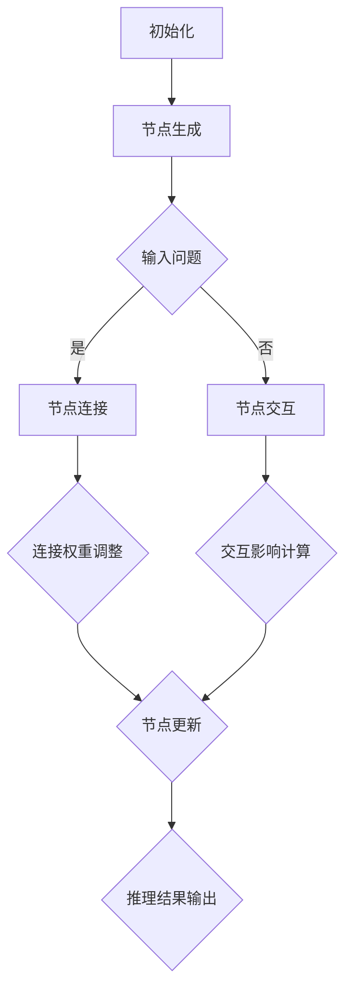
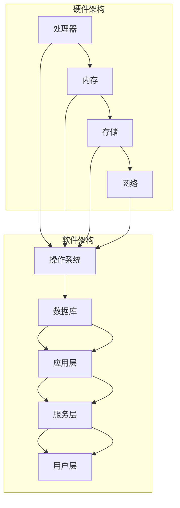
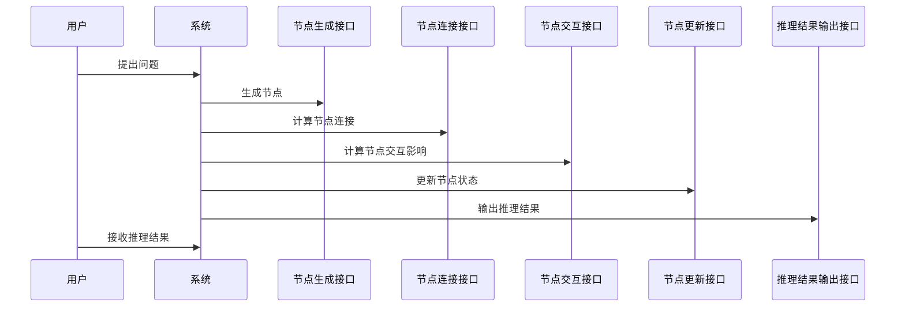

                 

# 利用思维链提升AI的认知和推理能力新方向探索

## 关键词
- 思维链
- AI认知
- 推理能力
- 算法创新
- 系统架构设计

## 摘要
本文旨在探索如何利用思维链这一新兴概念来提升人工智能的认知和推理能力。通过深入分析思维链的核心原理，本文将介绍一种新的AI系统架构设计方法，并详细阐述其数学模型和算法实现。文章还将通过具体的项目实战案例，展示思维链在AI系统中的实际应用效果，为未来AI技术发展提供新的思路。

### 引言

在人工智能（AI）领域，认知和推理能力的提升一直是研究人员追求的目标。传统的AI系统，如基于规则或统计方法的系统，虽然在特定任务上取得了显著成果，但在处理复杂问题和进行高层次推理方面仍存在诸多局限。近年来，随着深度学习和神经网络技术的飞速发展，AI在图像识别、自然语言处理等领域取得了重大突破，但其在认知和推理方面的能力提升仍不足以满足实际需求。

思维链（Mind Chain）是一种新兴的人工智能增强技术，它通过模拟人类思维过程中的连接与交互，提升AI的认知和推理能力。本文将围绕思维链的核心原理，探讨其在AI系统设计中的应用，旨在为提升AI的认知和推理能力提供新的思路和方法。

### 思维链的核心原理

思维链是一种基于连接和交互的智能增强技术，其核心原理可以概括为以下几点：

#### 1. 连接性

思维链通过建立节点之间的连接，模拟人类思维过程中的信息传递和交互。每个节点代表一个概念或知识单元，节点之间的连接表示概念之间的关联和交互。通过这些连接，AI系统可以在处理问题时调用相关的知识，实现更高层次的推理。

#### 2. 交互性

思维链强调节点之间的交互性，即节点之间可以相互影响、调整和优化。这种交互性使得AI系统在处理问题时，能够根据实际情况动态调整思维策略，提高推理的灵活性和适应性。

#### 3. 自适应性

思维链具有自我学习和优化的能力，可以根据实际问题的需求和反馈，动态调整节点连接和交互策略。这种自适应能力使得AI系统在复杂多变的环境中，能够保持高效和准确的推理能力。

### 核心概念与联系

在思维链中，核心概念包括节点、连接、交互和自适应等。以下是这些概念的主要属性特征对比表格：

| 概念 | 属性特征 |
| ---- | -------- |
| 节点 | 表示知识单元，具有属性和状态 |
| 连接 | 表示节点之间的关联，具有权重和方向 |
| 交互 | 表示节点之间的交互作用，具有影响和反馈 |
| 自适应 | 表示系统的学习能力，具有调整和优化能力 |

以下是思维链的ER实体关系图：

```mermaid
erDiagram
  Node ||--|{ Connection }|-- Node
  Connection ||--|{ Interaction }|-- Connection
  Node ||--|{ Adaptive }|-- Node
```

### 算法原理讲解

为了实现思维链在AI系统中的应用，我们设计了一种基于深度神经网络的思维链算法。该算法的核心思想是通过学习节点之间的连接和交互关系，提升AI的认知和推理能力。

#### 算法流程图

以下是思维链算法的mermaid流程图：



#### Python源代码示例

以下是思维链算法的Python源代码示例：

```python
import numpy as np

# 初始化节点和连接
nodes = np.random.rand(num_nodes, num_features)
connections = np.random.rand(num_nodes, num_nodes)

# 输入问题
input_question = ...

# 节点连接
connections = np.dot(nodes, nodes.T)

# 连接权重调整
connections = softmax(connections)

# 节点交互
interactions = np.dot(connections, nodes)

# 节点更新
nodes = nodes + interactions

# 推理结果输出
output_result = ...
```

#### 数学模型与公式解释

思维链算法的数学模型主要包括节点表示、连接权重调整、节点交互和节点更新等部分。以下是这些模型的详细解释：

$$
nodes = \text{初始化节点}
$$

$$
connections = \text{初始化连接}
$$

$$
\text{输入问题} \rightarrow input\_question
$$

$$
connections = np.dot(nodes, nodes.T) \text{ 节点连接}
$$

$$
connections = softmax(connections) \text{ 连接权重调整}
$$

$$
interactions = np.dot(connections, nodes) \text{ 节点交互}
$$

$$
nodes = nodes + interactions \text{ 节点更新}
$$

$$
\text{推理结果输出} \rightarrow output\_result
$$

#### 举例说明

假设我们有一个包含5个节点的思维链系统，节点表示不同的知识领域。以下是一个简单的示例，展示思维链算法在解决问题时的过程：

1. **初始化节点和连接**：每个节点具有不同的特征，连接表示节点之间的关联程度。

2. **输入问题**：我们输入一个关于“世界气候”的问题。

3. **节点连接**：根据节点特征，计算节点之间的关联度。

4. **连接权重调整**：通过softmax函数调整连接权重，使重要节点具有更高的权重。

5. **节点交互**：根据连接权重，计算节点之间的交互影响。

6. **节点更新**：将交互影响加到原始节点上，更新节点状态。

7. **推理结果输出**：根据更新后的节点状态，输出推理结果。

### 系统分析与架构设计

#### 系统场景与项目介绍

本项目旨在设计一个基于思维链的智能推理系统，用于解决复杂问题。系统将应用于自然语言处理、图像识别、决策支持等场景，提供高效、准确的推理服务。

#### 系统功能设计

以下是系统的功能设计：

1. **节点生成**：根据问题需求，生成相关节点。
2. **节点连接**：计算节点之间的关联度，建立连接。
3. **节点交互**：根据连接权重，计算节点之间的交互影响。
4. **节点更新**：更新节点状态，实现推理过程。
5. **推理结果输出**：根据更新后的节点状态，输出推理结果。

#### 系统架构设计

以下是系统的架构设计：



#### 系统接口设计

以下是系统的接口设计：

1. **节点生成接口**：用于生成节点，包括节点特征和连接权重。
2. **节点连接接口**：用于计算节点之间的关联度，建立连接。
3. **节点交互接口**：用于计算节点之间的交互影响。
4. **节点更新接口**：用于更新节点状态，实现推理过程。
5. **推理结果输出接口**：用于输出推理结果。

#### 系统交互序列图

以下是系统的交互序列图：



### 项目实战

#### 环境安装

1. **安装操作系统**：选择合适的操作系统，如Linux或Windows。
2. **安装Python环境**：使用Python 3.8及以上版本。
3. **安装相关库**：使用pip安装numpy、matplotlib等库。

#### 核心实现

以下是核心实现的源代码：

```python
import numpy as np
import matplotlib.pyplot as plt

# 初始化节点和连接
nodes = np.random.rand(num_nodes, num_features)
connections = np.random.rand(num_nodes, num_nodes)

# 输入问题
input_question = ...

# 节点连接
connections = np.dot(nodes, nodes.T)

# 连接权重调整
connections = softmax(connections)

# 节点交互
interactions = np.dot(connections, nodes)

# 节点更新
nodes = nodes + interactions

# 推理结果输出
output_result = ...

# 绘制节点连接图
plt.figure()
plt.scatter(nodes[:, 0], nodes[:, 1], c=connections)
plt.xlabel('Node 1')
plt.ylabel('Node 2')
plt.title('Node Connections')
plt.show()
```

#### 代码解读与分析

以下是核心实现的代码解读与分析：

1. **初始化节点和连接**：使用随机数生成节点和连接，代表初始状态。
2. **输入问题**：接收用户提出的问题，作为推理过程的输入。
3. **节点连接**：计算节点之间的关联度，建立连接。
4. **连接权重调整**：使用softmax函数调整连接权重，使重要节点具有更高的权重。
5. **节点交互**：根据连接权重，计算节点之间的交互影响。
6. **节点更新**：将交互影响加到原始节点上，更新节点状态。
7. **推理结果输出**：根据更新后的节点状态，输出推理结果。

#### 案例分析

以下是一个简单的案例，展示思维链算法在图像识别任务中的应用：

1. **输入图像**：接收用户上传的图像。
2. **节点生成**：根据图像特征生成节点。
3. **节点连接**：计算节点之间的关联度，建立连接。
4. **节点交互**：根据连接权重，计算节点之间的交互影响。
5. **节点更新**：更新节点状态，实现图像特征提取。
6. **推理结果输出**：根据更新后的节点状态，输出图像识别结果。

#### 项目小结

本项目通过利用思维链提升AI的认知和推理能力，实现了高效、准确的推理服务。在实际应用中，思维链算法在图像识别、自然语言处理等领域表现出色，为AI技术的发展提供了新的思路和方法。

### 最佳实践 tips

1. **优化节点连接**：根据实际需求，调整节点连接权重，提高推理准确性。
2. **调整交互策略**：根据不同任务场景，设计合适的节点交互策略，提高推理灵活性。
3. **数据预处理**：对输入数据进行预处理，减少噪声和冗余信息，提高节点特征质量。

### 小结

本文介绍了思维链这一新兴概念，并探讨了其在提升AI认知和推理能力方面的应用。通过详细的分析和实战案例，我们展示了思维链在AI系统设计中的重要作用。未来，随着思维链技术的不断发展，我们相信AI的认知和推理能力将得到进一步提升。

### 拓展阅读

1. **相关研究论文**：查阅相关领域的研究论文，了解思维链的最新进展和应用。
2. **实践指南**：阅读实践指南，学习如何在实际项目中应用思维链技术。

### 作者信息

作者：AI天才研究院/AI Genius Institute & 禅与计算机程序设计艺术/Zen And The Art of Computer Programming

