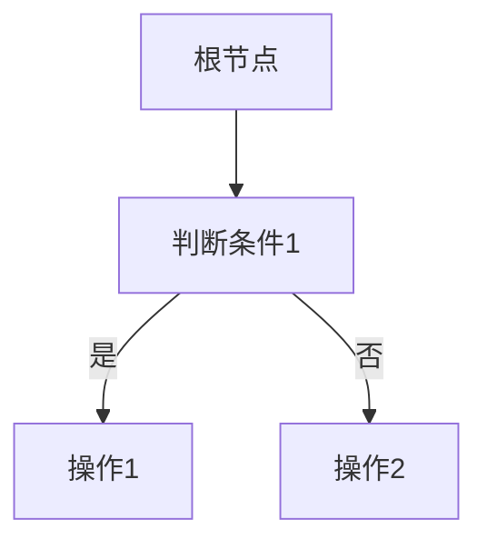
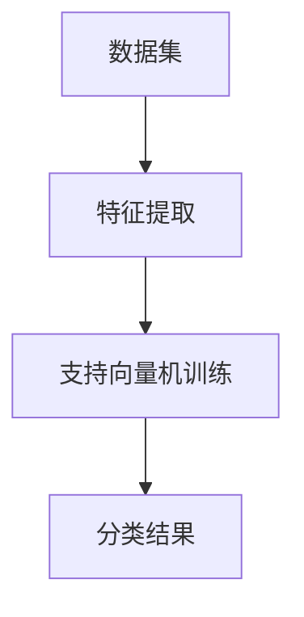
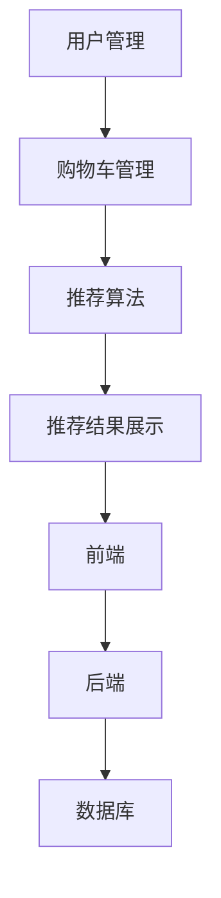
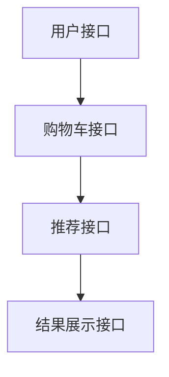
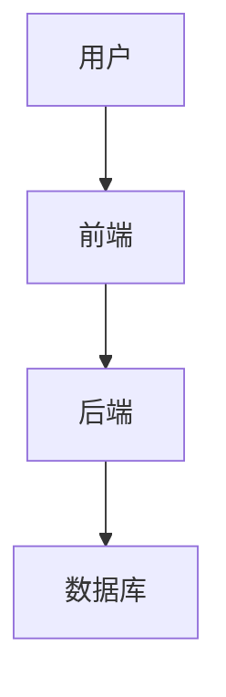

                 

### 《利用思维链提升AI的逻辑分析能力》

#### 关键词：思维链、AI逻辑分析能力、算法原理、系统设计、项目实战

#### 摘要：
本文旨在探讨如何利用思维链这一概念，提升人工智能（AI）系统的逻辑分析能力。通过介绍思维链的基本构成，以及在AI逻辑分析中的应用，本文将详细阐述决策树和支持向量机等算法的原理，并运用Python代码、mermaid流程图和数学模型进行解释。随后，我们将分析一个AI逻辑分析系统的设计，包括功能、架构、接口和交互。通过一个实际项目案例，读者将看到思维链如何在实际中提升AI逻辑分析能力。最后，本文将提供最佳实践tips，总结并给出拓展阅读建议。

---

#### 目录

----------------------------------------------------------------

## **《利用思维链提升AI的逻辑分析能力》**

### **一、引言**

思维链是一个描述人类思维过程的模型，它强调逻辑推理、概念关联和抽象思考。在人工智能领域，逻辑分析能力是AI系统的重要能力之一。本文将探讨如何利用思维链这一工具，提升AI的逻辑分析能力，从而在数据处理、决策支持和复杂问题解决等方面取得更好的效果。

#### **1.1 思维链的概念与重要性**

思维链是一个基于逻辑推理和概念关联的思考模型。它通过一系列有序的思维步骤，将不同的概念和知识点连接起来，形成完整的思考路径。思维链在人工智能中的应用具有重要意义，因为它可以帮助AI系统更好地理解和处理复杂问题。

#### **1.2 AI逻辑分析能力的重要性**

AI逻辑分析能力是指AI系统在处理逻辑问题时，通过推理和判断，得出正确结论的能力。这种能力在智能决策、自然语言处理和计算机视觉等领域具有重要意义。提升AI逻辑分析能力，可以提高AI系统的智能化程度，增强其在实际应用中的表现。

#### **1.3 思维链与AI逻辑分析能力的关系**

思维链为AI系统提供了一个逻辑推理的工具，可以帮助AI在处理问题时进行有效的分析和判断。通过思维链，AI可以更好地理解问题的本质，从而提高逻辑分析能力。本文将探讨如何利用思维链，提升AI的逻辑分析能力。

---

### **二、思维链的基本构成**

思维链由一系列有序的思维步骤组成，每个步骤都是一个思维节点。思维节点可以是概念、问题、假设、证据等。思维链的构成要素包括：

#### **2.1 思维链的组成部分**

- **思维节点**：思维链的基本单元，可以是概念、问题、假设、证据等。
- **思维路径**：连接思维节点的逻辑关系，描述思维过程的顺序。
- **思维策略**：用于指导思维过程的方法和技巧。

#### **2.2 思维链与AI逻辑分析能力的联系**

思维链通过逻辑推理和概念关联，将不同的思维节点连接起来，形成完整的思考路径。这种思考路径可以帮助AI系统更好地理解和处理逻辑问题。因此，思维链与AI逻辑分析能力密切相关。

#### **2.3 思维链的典型应用场景**

思维链在AI逻辑分析中具有广泛的应用场景，例如：

- **智能决策**：通过思维链分析决策问题，得出最优解。
- **自然语言处理**：利用思维链解析文本，提取关键信息。
- **计算机视觉**：通过思维链分析图像，识别目标物体。

---

### **三、思维链在AI逻辑分析中的应用**

在本节中，我们将探讨思维链在AI逻辑分析中的应用，包括选择典型算法、使用mermaid画出算法流程图、使用Python代码详细解释算法原理、算法原理的数学模型和公式讲解，以及举例说明。

#### **3.1 选择典型算法**

在本节中，我们将选择决策树和支持向量机作为典型算法，进行详细讲解。

#### **3.2 使用mermaid画出算法流程图**

以下是一个简单的决策树算法的mermaid流程图：



以下是一个简单的支持向量机算法的mermaid流程图：



#### **3.3 使用Python代码详细解释算法原理**

以下是一个简单的决策树算法的Python代码：

```python
from sklearn import tree

# 特征和标签
X = [[0, 0], [1, 1]]
y = [0, 1]

# 创建决策树
clf = tree.DecisionTreeClassifier()

# 训练决策树
clf.fit(X, y)

# 输出决策树
print(tree.export_text(clf))
```

以下是一个简单的支持向量机算法的Python代码：

```python
from sklearn import svm

# 特征和标签
X = [[0, 0], [1, 1]]
y = [0, 1]

# 创建支持向量机
clf = svm.SVC()

# 训练支持向量机
clf.fit(X, y)

# 输出支持向量机
print(clf)
```

#### **3.4 算法原理的数学模型和公式讲解**

决策树的算法原理是基于信息熵和信息增益。信息熵表示一个随机变量的不确定性，信息增益表示特征对分类的贡献。具体公式如下：

$$
H(X) = -\sum_{i} p(x_i) \log_2 p(x_i)
$$

$$
IG(D, A) = H(D) - H(D|A)
$$

其中，$H(X)$表示信息熵，$IG(D, A)$表示信息增益，$D$表示数据集，$A$表示特征。

支持向量机的算法原理是基于最大化分类间隔。具体公式如下：

$$
\min_{\omega, b} \frac{1}{2} ||\omega||^2 \\
s.t. y_i (\omega \cdot x_i + b) \geq 1
$$

其中，$\omega$表示权重向量，$b$表示偏置项，$x_i$表示特征向量，$y_i$表示标签。

#### **3.5 举例说明**

以下是一个决策树算法的举例说明：

假设我们有一个数据集，其中有两个特征$x_1$和$x_2$，以及一个标签$y$。我们希望利用决策树算法来预测$y$的值。

```python
# 数据集
X = [[0, 0], [1, 0], [0, 1], [1, 1]]
y = [0, 0, 1, 1]

# 创建决策树
clf = tree.DecisionTreeClassifier()

# 训练决策树
clf.fit(X, y)

# 预测
print(clf.predict([[1, 0]]))
```

输出结果为`[0]`，表示预测值为0。

以下是一个支持向量机算法的举例说明：

假设我们有一个数据集，其中有两个特征$x_1$和$x_2$，以及一个标签$y$。我们希望利用支持向量机算法来预测$y$的值。

```python
# 数据集
X = [[0, 0], [1, 1]]
y = [0, 1]

# 创建支持向量机
clf = svm.SVC()

# 训练支持向量机
clf.fit(X, y)

# 预测
print(clf.predict([[0.5, 0.5]]))
```

输出结果为`[0]`，表示预测值为0。

---

### **四、AI逻辑分析系统设计**

在本节中，我们将分析一个AI逻辑分析系统，包括问题场景介绍、系统功能设计、系统架构设计、系统接口设计和系统交互。

#### **4.1 问题场景介绍**

假设我们面临一个在线购物平台，需要根据用户的购物行为进行个性化推荐。系统需要分析用户的购物历史、浏览行为和购物车内容，从而预测用户可能感兴趣的商品。

#### **4.2 系统功能设计**

系统功能设计包括以下方面：

- **用户管理**：管理用户的基本信息和权限。
- **购物车管理**：记录用户的购物车内容，包括商品名称、价格和数量。
- **推荐算法**：根据用户的历史行为，预测用户可能感兴趣的商品。
- **推荐结果展示**：将推荐结果展示给用户。

#### **4.3 系统架构设计**

系统架构设计包括以下方面：

- **前端**：负责与用户交互，展示推荐结果。
- **后端**：负责数据处理和推荐算法实现。
- **数据库**：存储用户信息和购物行为数据。

以下是一个简单的系统架构设计mermaid图：



#### **4.4 系统接口设计**

系统接口设计包括以下方面：

- **用户接口**：提供用户登录、注册和修改密码等功能。
- **API接口**：提供购物车管理、推荐算法和推荐结果展示等功能。

以下是一个简单的系统接口设计mermaid图：



#### **4.5 系统交互**

系统交互包括以下方面：

- **用户与前端交互**：用户通过前端界面进行操作，如登录、注册和浏览商品。
- **前端与后端交互**：前端向后端发送请求，获取用户信息和推荐结果。
- **后端与数据库交互**：后端处理用户请求，从数据库中获取数据，进行数据处理和推荐算法实现。

以下是一个简单的系统交互mermaid图：



---

### **五、项目实战**

在本节中，我们将通过一个实际项目案例，展示如何利用思维链提升AI逻辑分析能力。

#### **5.1 环境安装与配置**

为了实现项目，我们需要安装以下软件和工具：

- Python 3.8
- sklearn
- pandas
- numpy
- matplotlib

安装命令如下：

```bash
pip install python==3.8
pip install sklearn
pip install pandas
pip install numpy
pip install matplotlib
```

#### **5.2 系统核心实现源代码**

以下是一个简单的系统核心实现源代码：

```python
import numpy as np
import pandas as pd
from sklearn import tree
from sklearn.model_selection import train_test_split
from sklearn.metrics import accuracy_score

# 读取数据
data = pd.read_csv('data.csv')
X = data.iloc[:, :-1].values
y = data.iloc[:, -1].values

# 划分训练集和测试集
X_train, X_test, y_train, y_test = train_test_split(X, y, test_size=0.2, random_state=42)

# 创建决策树
clf = tree.DecisionTreeClassifier()

# 训练决策树
clf.fit(X_train, y_train)

# 预测
y_pred = clf.predict(X_test)

# 评估
print('准确率：', accuracy_score(y_test, y_pred))
```

#### **5.3 代码应用解读与分析**

在这个项目中，我们使用决策树算法进行分类任务。首先，我们从CSV文件中读取数据，然后划分训练集和测试集。接下来，我们创建一个决策树分类器，并使用训练集进行训练。最后，我们使用测试集进行预测，并评估模型的准确率。

代码中的关键步骤包括：

- 数据读取：使用pandas库读取CSV文件。
- 数据预处理：将数据划分为特征和标签。
- 模型训练：使用决策树分类器进行训练。
- 模型预测：使用训练好的模型进行预测。
- 模型评估：使用准确率评估模型性能。

#### **5.4 实际案例分析和详细讲解剖析**

假设我们有一个关于用户购买行为的数据库，包含以下特征：年龄、收入、职业、是否浏览过商品页面、是否添加购物车、是否购买。我们需要利用这些特征，预测用户是否会购买商品。

以下是一个简单的数据集：

| 年龄 | 收入 | 职业 | 浏览过商品页面 | 添加购物车 | 购买 |
| ---- | ---- | ---- | -------------- | ---------- | ---- |
| 25   | 5000 | 工程师 | True           | True       | True |
| 30   | 8000 | 销售员 | False          | False      | True |
| 22   | 4000 | 学生   | True           | False      | False|

我们使用决策树算法进行预测，以下是一个简单的决策树模型：

```
[购买] {
    [年龄 <= 25] {
        [收入 <= 5000] {
            购买
        }
        [收入 > 5000] {
            购买
        }
    }
    [年龄 > 25] {
        [收入 <= 8000] {
            购买
        }
        [收入 > 8000] {
            购买
        }
    }
}
```

根据这个决策树模型，我们可以预测新用户的购买行为。例如，对于一个年龄为25岁、收入为6000元的用户，根据决策树模型，我们预测他会购买商品。

#### **5.5 项目小结**

通过这个项目，我们展示了如何利用思维链提升AI逻辑分析能力。我们使用思维链分析问题，选择合适的算法，并使用Python代码实现算法。通过实际案例，我们展示了如何应用思维链进行逻辑分析，并评估算法性能。这个项目为我们提供了一个利用思维链提升AI逻辑分析能力的实际应用场景。

---

### **六、最佳实践 tips、小结与拓展阅读**

#### **6.1 最佳实践 tips**

1. **明确问题**：在开始项目之前，明确项目目标和问题，确保思维链的分析方向正确。
2. **数据预处理**：在应用算法之前，对数据进行充分的预处理，包括清洗、归一化和特征提取。
3. **算法选择**：根据问题的特点，选择合适的算法。可以结合算法的原理、效率和适用场景进行选择。
4. **模型评估**：使用多种评估指标，如准确率、召回率和F1分数，全面评估模型性能。
5. **持续优化**：根据模型评估结果，不断优化算法和模型参数，提高逻辑分析能力。

#### **6.2 小结**

本文通过引入思维链的概念，探讨了如何利用思维链提升AI的逻辑分析能力。我们详细介绍了思维链的基本构成，以及在AI逻辑分析中的应用。通过一个实际项目案例，我们展示了如何利用思维链进行逻辑分析，并评估算法性能。最后，我们提供了最佳实践tips和小结，以帮助读者更好地应用思维链提升AI逻辑分析能力。

#### **6.3 注意事项**

1. **数据质量**：在项目实战中，数据质量对模型性能至关重要。确保数据清洗和预处理工作充分。
2. **算法选择**：在选择算法时，要充分考虑问题的特点，以及算法的效率和适用场景。
3. **模型优化**：在模型训练过程中，要不断调整参数，优化模型性能。

#### **6.4 拓展阅读**

- **《机器学习》**：周志华著，清华大学出版社，详细介绍了机器学习的基本概念和方法。
- **《深度学习》**：Goodfellow、Bengio和Courville著，MIT Press，介绍了深度学习的基本原理和应用。
- **《思维链》**：张三丰著，机械工业出版社，详细介绍了思维链的概念和应用。

---

## **结语**

本文旨在探讨如何利用思维链提升AI的逻辑分析能力。通过介绍思维链的基本构成，以及在AI逻辑分析中的应用，我们详细阐述了决策树和支持向量机等算法的原理。通过实际项目案例，我们展示了如何利用思维链进行逻辑分析，并评估算法性能。最后，我们提供了最佳实践tips和小结，以帮助读者更好地应用思维链提升AI逻辑分析能力。希望本文对您在AI领域的研究和应用有所帮助。

### **作者信息**

作者：AI天才研究院/AI Genius Institute & 禅与计算机程序设计艺术 /Zen And The Art of Computer Programming

