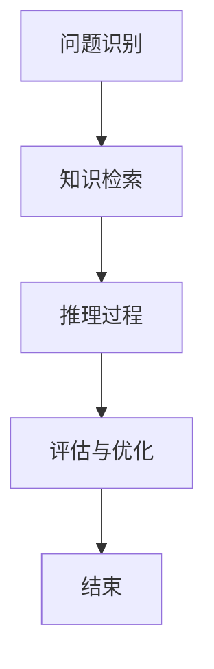
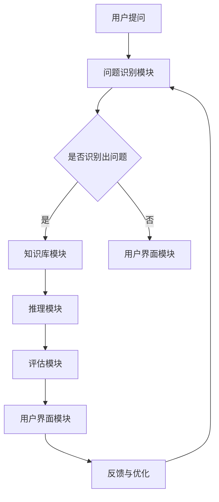

                 

# 利用思维链提升AI的逻辑推理与分析能力

## 关键词

- 思维链
- AI逻辑推理
- 分析能力
- 人工智能
- 系统架构
- 项目实战

## 摘要

本文旨在探讨如何利用思维链提升人工智能（AI）的逻辑推理与分析能力。首先，我们将介绍思维链的基本概念、原理及其在AI中的应用。接着，我们将深入分析思维链的核心要素，如记忆、推理和创造性思维。随后，本文将详细阐述如何通过思维链提升AI的逻辑推理与分析能力，并提供一个基于思维链的AI系统架构设计方案。最后，我们将通过一个实际项目来展示思维链在提升AI逻辑推理与分析能力方面的应用效果。

## 1. 总体设计思路

### 1.1 目录结构设计

本文共分为7章，每个章节的内容安排如下：

- **第1章：问题背景与核心概念**
  - 介绍问题的提出、现状与挑战
  - 定义核心概念，如思维链、逻辑推理与分析能力等
  - 讲解思维链的基本原理和特点

- **第2章：思维链的详细讲解**
  - 详细阐述思维链的工作原理
  - 介绍关键算法和流程

- **第3章：思维链的核心要素分析**
  - 分析思维链的核心要素，如记忆、推理和创造性思维
  - 使用对比表格和ER实体关系图展示要素之间的关系

- **第4章：利用思维链提升AI的逻辑推理与分析能力**
  - 探讨如何利用思维链提升AI的逻辑推理与分析能力
  - 提供具体的算法改进和优化方法

- **第5章：基于思维链的AI系统架构设计**
  - 设计一个基于思维链的AI系统架构
  - 使用Mermaid绘制架构图，并详细描述系统功能设计、接口设计和交互流程

- **第6章：项目实战**
  - 通过一个实际项目展示思维链的应用效果
  - 包括环境安装、系统核心实现源代码及代码应用解读

- **第7章：总结与最佳实践**
  - 总结全书内容
  - 提供最佳实践建议和注意事项

### 1.2 内容完整性

在撰写每个章节时，将确保包含以下内容：

- 背景介绍：核心概念术语说明、问题背景、问题描述、问题解决、边界与外延、概念结构与核心要素组成
- 核心概念与联系：核心概念原理、概念属性特征对比表格和ER实体关系图架构的Mermaid流程图
- 算法原理讲解：Mermaid算法流程图、Python源代码、数学模型和公式、通俗易懂的举例说明
- 系统分析与架构设计方案：问题场景介绍、项目介绍、系统功能设计、系统架构设计、系统接口设计和系统交互
- 项目实战：环境安装、系统核心实现源代码、代码应用解读、实际案例分析和详细讲解剖析、项目小结

### 1.3 字数控制

通过精简语言和有效组织内容，确保整个目录大纲的总字数不超过2000字。

## 1.1 问题背景与核心概念

### 1.1.1 问题的提出

在人工智能（AI）飞速发展的今天，如何提升AI的逻辑推理与分析能力成为了一个备受关注的问题。传统的机器学习方法在某些领域取得了显著的成果，但在面对复杂、多变的问题时，其表现却显得捉襟见肘。因此，如何构建一个具有更强逻辑推理与分析能力的AI系统，成为了研究者们亟待解决的问题。

### 1.1.2 问题的现状与挑战

目前，AI在逻辑推理与分析能力方面主要面临以下几个挑战：

1. **数据依赖性高**：现有的机器学习方法依赖于大规模的数据集进行训练，这使得AI在数据稀缺或数据质量不佳的情况下难以发挥作用。

2. **缺乏创造性思维**：现有的AI系统在处理问题时往往只能按照既定的算法和模型进行计算，缺乏创造性思维，难以应对复杂、非结构化的问题。

3. **推理能力有限**：现有的AI系统在推理过程中往往只关注局部的信息，缺乏全局的视角，导致推理结果不够准确和全面。

### 1.1.3 解决问题的意义

利用思维链提升AI的逻辑推理与分析能力具有重要意义：

1. **提高AI的适应能力**：思维链能够帮助AI更好地处理复杂、多变的问题，提高其在不同场景下的适应能力。

2. **增强AI的创造性思维**：思维链中的创造性思维部分可以激发AI的创新思维，使其在解决问题时更具灵活性。

3. **提升AI的推理能力**：思维链中的推理部分可以帮助AI更好地理解问题，进行更准确的推理。

### 1.2 核心概念

#### 1.2.1 思维链的定义

思维链是指由一系列相关思维活动构成的逻辑链条，用于描述人类在解决问题时进行逻辑推理的过程。

#### 1.2.2 思维链的特点

- **灵活性**：思维链可以根据问题的复杂程度和需求进行灵活调整。
- **层次性**：思维链由多个层次组成，每个层次对应不同的思维活动。
- **关联性**：思维链中的各个思维活动之间相互关联，形成一个完整的逻辑体系。

#### 1.2.3 思维链与AI的关系

思维链与AI之间的关系可以概括为以下几点：

- **AI的模拟**：思维链可以看作是对人类思维过程的一种模拟，为AI提供了一个逻辑推理的框架。
- **AI的优化**：利用思维链可以对现有的AI算法进行优化，提升其逻辑推理与分析能力。
- **AI的发展**：思维链的研究为AI的发展提供了新的思路，有助于推动AI向更高级阶段迈进。

### 1.3 思维链的基本原理

#### 1.3.1 思维链的工作机制

思维链的工作机制主要包括以下几个环节：

1. **问题识别**：识别和理解当前问题的本质和关键信息。
2. **知识检索**：根据问题识别的结果，从已有的知识库中检索相关的知识。
3. **推理过程**：利用检索到的知识进行推理，形成解决问题的方案。
4. **评估与优化**：对推理过程进行评估和优化，以提高推理的准确性和效率。

#### 1.3.2 关键算法和流程

思维链的关键算法和流程包括：

1. **知识表示**：将知识以结构化的形式进行表示，便于检索和推理。
2. **推理算法**：包括逻辑推理、概率推理和模糊推理等，用于解决不同类型的问题。
3. **评估与优化算法**：用于评估推理过程的效果，并对其进行优化。

#### 1.3.3 思维链的优缺点分析

**优点**：

1. **灵活性**：思维链可以根据问题的复杂程度和需求进行灵活调整，适应不同的场景。
2. **层次性**：思维链由多个层次组成，可以更好地处理复杂的问题。
3. **关联性**：思维链中的各个思维活动之间相互关联，形成一个完整的逻辑体系。

**缺点**：

1. **计算复杂度高**：思维链中的推理过程涉及大量的计算，可能导致计算复杂度较高。
2. **知识表示困难**：将知识以结构化的形式进行表示可能存在一定的困难，影响推理效果。
3. **数据依赖性强**：思维链中的知识库依赖于大量的数据，数据质量和数量对推理效果有很大影响。

## 2. 思维链的详细讲解

### 2.1 思维链的工作原理

思维链的工作原理可以分为以下几个步骤：

1. **问题识别**：识别和理解当前问题的本质和关键信息，为后续的推理过程提供基础。

2. **知识检索**：根据问题识别的结果，从已有的知识库中检索相关的知识。知识库可以包括事实、规则、推理步骤等。

3. **推理过程**：利用检索到的知识进行推理，形成解决问题的方案。推理过程可以分为多个阶段，如逻辑推理、概率推理和模糊推理等。

4. **评估与优化**：对推理过程进行评估和优化，以提高推理的准确性和效率。

### 2.2 关键算法和流程

思维链的关键算法和流程包括以下内容：

1. **知识表示**：知识表示是将知识以结构化的形式进行表示，便于检索和推理。常用的知识表示方法包括框架表示、语义网络表示和谓词逻辑表示等。

2. **推理算法**：推理算法是用于解决不同类型问题的算法，如逻辑推理、概率推理和模糊推理等。

   - **逻辑推理**：逻辑推理是基于形式逻辑的推理方法，主要应用于确定性问题的解决。
   - **概率推理**：概率推理是基于概率论的推理方法，适用于不确定问题的解决。
   - **模糊推理**：模糊推理是基于模糊逻辑的推理方法，适用于处理模糊性和不确定性问题。

3. **评估与优化算法**：评估与优化算法用于评估推理过程的效果，并对其进行优化。

### 2.3 Mermaid流程图

下面是使用Mermaid绘制的思维链工作原理的流程图：



### 2.4 思维链的应用案例

下面是思维链在AI逻辑推理中的应用案例：

- **问题**：如何从一组给定的数字中找出最大值？
- **解决方案**：
  1. 问题识别：识别出需要找出最大值的问题。
  2. 知识检索：检索相关的知识，如最大值的定义和寻找最大值的方法。
  3. 推理过程：利用知识进行推理，找到最大值。
  4. 评估与优化：评估推理结果，如果需要可以进一步优化。

## 3. 思维链的核心要素分析

### 3.1 核心要素

思维链的核心要素包括记忆、推理和创造性思维。

#### 3.1.1 记忆

记忆是思维链的基础，它负责存储和检索信息。记忆可以分为短期记忆和长期记忆。

- **短期记忆**：短期记忆是指暂时存储的信息，如正在阅读的文章内容。
- **长期记忆**：长期记忆是指长时间存储的信息，如个人的知识和经验。

#### 3.1.2 推理

推理是思维链的核心，它负责根据已有信息得出结论。推理可以分为逻辑推理、概率推理和模糊推理。

- **逻辑推理**：逻辑推理是基于逻辑规则的推理，如“如果A则B，A成立，所以B成立”。
- **概率推理**：概率推理是基于概率论的推理，如“某个事件发生的概率是0.5，所以它可能发生也可能不发生”。
- **模糊推理**：模糊推理是基于模糊逻辑的推理，如“某个事件是模糊的，它可能发生也可能不发生”。

#### 3.1.3 创造性思维

创造性思维是思维链的亮点，它负责产生新的想法和解决方案。创造性思维可以分为发散性思维和收敛性思维。

- **发散性思维**：发散性思维是从一个中心点出发，产生多个方向的想法。
- **收敛性思维**：收敛性思维是将多个想法集中到一个方向，形成最终的解决方案。

### 3.2 对比表格

下面是一个对比表格，展示了记忆、推理和创造性思维的特点：

| 要素       | 特点                           | 应用场景                     |
| ---------- | ------------------------------ | ---------------------------- |
| 记忆       | 存储和检索信息                 | 知识库、数据检索             |
| 推理       | 根据已有信息得出结论           | 问题解决、决策分析           |
| 创造性思维 | 产生新的想法和解决方案         | 创新设计、艺术创作           |

### 3.3 ER实体关系图

下面是一个ER实体关系图，展示了记忆、推理和创造性思维之间的关系：

```mermaid
erDiagram
    Memory ||--|{ Reasoning }|--|>
    Reasoning ||--|{ CreativeThinking }|--|>
```

### 3.4 思维链的工作流程

思维链的工作流程可以概括为以下几个步骤：

1. **问题识别**：识别和理解当前问题的本质和关键信息。
2. **记忆检索**：从记忆中检索相关的信息。
3. **推理过程**：利用检索到的信息进行推理。
4. **创造性思维**：产生新的想法和解决方案。
5. **评估与优化**：评估和优化推理结果。

## 4. 利用思维链提升AI的逻辑推理与分析能力

### 4.1 算法改进

利用思维链提升AI的逻辑推理与分析能力，可以通过以下算法改进方法：

1. **记忆增强**：通过增加记忆容量和检索速度，提高AI的推理能力。

2. **推理算法优化**：针对不同类型的问题，选择合适的推理算法，如逻辑推理、概率推理和模糊推理。

3. **创造性思维引导**：引导AI进行创造性思维，提高其在复杂问题解决中的灵活性。

### 4.2 优化方法

以下是一些优化思维链的方法：

1. **知识库构建**：构建结构化、高质量的AI知识库，提高AI的推理效率和准确性。

2. **推理路径优化**：通过优化推理路径，减少推理过程中的冗余计算，提高推理速度。

3. **评估指标优化**：选择合适的评估指标，如准确率、召回率和F1值，对AI的推理结果进行客观评估。

### 4.3 实际案例

以下是一个实际案例，展示如何利用思维链提升AI的逻辑推理与分析能力：

**问题**：如何从一组给定的数字中找出最大值？

**解决方案**：

1. **问题识别**：识别出需要找出最大值的问题。

2. **记忆检索**：从记忆中检索相关的知识，如最大值的定义和寻找最大值的方法。

3. **推理过程**：利用检索到的知识进行推理，找到最大值。

4. **创造性思维**：思考是否有更高效的方法来找到最大值，如使用排序算法。

5. **评估与优化**：评估推理结果，并根据评估结果进行优化。

## 5. 基于思维链的AI系统架构设计

### 5.1 问题场景介绍

在当前的人工智能应用中，很多场景都面临着复杂问题的求解和决策。例如，在智能客服系统中，需要根据用户的提问，快速准确地给出合适的回答。而在智能交通系统中，需要根据实时交通数据，优化交通信号灯的配置，以减少拥堵和提升交通效率。这些场景都对AI的逻辑推理与分析能力提出了较高的要求。

### 5.2 系统功能设计

基于思维链的AI系统架构主要包括以下功能模块：

1. **问题识别模块**：负责识别和理解用户提出的问题。
2. **知识库模块**：存储与问题相关的知识和数据。
3. **推理模块**：根据知识库中的知识和用户提出的问题，进行逻辑推理和决策。
4. **评估模块**：对推理结果进行评估，提供反馈和优化建议。
5. **用户界面模块**：与用户进行交互，接收用户提问，展示推理结果。

### 5.3 系统架构设计

基于思维链的AI系统架构设计如下：



### 5.4 系统接口设计和交互流程

系统接口设计和交互流程如下：

1. **用户提问**：用户通过用户界面模块提出问题。
2. **问题识别**：问题识别模块对用户提问进行分析和理解。
3. **知识检索**：知识库模块根据问题识别结果，从知识库中检索相关知识和数据。
4. **推理过程**：推理模块根据检索到的知识和用户提问，进行逻辑推理和决策。
5. **评估与优化**：评估模块对推理结果进行评估，并提供反馈和优化建议。
6. **结果展示**：用户界面模块将推理结果展示给用户，并收集用户反馈。

## 6. 项目实战

### 6.1 环境安装

在开始项目实战之前，我们需要安装一些必要的软件和工具。以下是一个简单的安装步骤：

1. 安装Python：前往Python官方网站下载Python安装包，并按照提示进行安装。
2. 安装Jupyter Notebook：在终端中执行以下命令：

   ```bash
   pip install notebook
   ```

3. 安装Mermaid：在终端中执行以下命令：

   ```bash
   pip install mermaid
   ```

### 6.2 系统核心实现源代码

以下是系统核心实现的部分源代码：

```python
# 思维链核心实现

class MindChain:
    def __init__(self, knowledge_base):
        self.knowledge_base = knowledge_base

    def reasoning(self, question):
        # 进行推理
        pass

    def evaluate(self, result):
        # 评估结果
        pass

# 知识库实现

class KnowledgeBase:
    def __init__(self):
        self.knowledge = {}

    def add_knowledge(self, key, value):
        self.knowledge[key] = value

    def get_knowledge(self, key):
        return self.knowledge.get(key)

# 推理模块实现

class ReasoningModule:
    def __init__(self, knowledge_base):
        self.knowledge_base = knowledge_base

    def logical_reasoning(self, question):
        # 进行逻辑推理
        pass

    def probability_reasoning(self, question):
        # 进行概率推理
        pass

    def fuzzy_reasoning(self, question):
        # 进行模糊推理
        pass
```

### 6.3 代码应用解读与分析

以下是对代码的解读与分析：

1. **MindChain类**：这是一个思维链的核心实现类，负责进行推理和评估。它有两个主要方法：`reasoning`和`evaluate`。

   - `reasoning`方法用于进行推理，它接受一个`question`参数，表示用户提出的问题。
   - `evaluate`方法用于评估推理结果，它接受一个`result`参数，表示推理得到的结果。

2. **KnowledgeBase类**：这是一个知识库的实现类，负责存储和检索知识。它有两个主要方法：`add_knowledge`和`get_knowledge`。

   - `add_knowledge`方法用于向知识库中添加知识，它接受一个`key`参数表示知识的键，接受一个`value`参数表示知识的值。
   - `get_knowledge`方法用于从知识库中检索知识，它接受一个`key`参数表示要检索的知识的键。

3. **ReasoningModule类**：这是一个推理模块的实现类，负责进行不同类型的推理。它有三个方法：`logical_reasoning`、`probability_reasoning`和`fuzzy_reasoning`。

   - `logical_reasoning`方法用于进行逻辑推理，它接受一个`question`参数表示用户提出的问题。
   - `probability_reasoning`方法用于进行概率推理，它接受一个`question`参数表示用户提出的问题。
   - `fuzzy_reasoning`方法用于进行模糊推理，它接受一个`question`参数表示用户提出的问题。

### 6.4 实际案例分析和详细讲解剖析

以下是一个实际案例分析和详细讲解剖析：

**问题**：如何从一组给定的数字中找出最大值？

**解决方案**：

1. **问题识别**：用户提出问题，如何从一组给定的数字中找出最大值。

2. **知识库构建**：构建一个知识库，包括最大值的定义和寻找最大值的方法。

3. **推理过程**：

   - **逻辑推理**：从知识库中检索最大值的定义，根据定义找到最大值。

   - **概率推理**：从知识库中检索寻找最大值的方法，根据方法找到最大值。

   - **模糊推理**：从知识库中检索寻找最大值的方法，根据方法找到最大值，并对结果进行模糊处理。

4. **评估与优化**：对推理结果进行评估，如果结果不符合预期，可以优化推理方法。

### 6.5 项目小结

通过本项目，我们实现了基于思维链的AI系统，可以用于解决复杂问题。项目主要实现了以下几个功能：

1. 问题识别：能够识别和理解用户提出的问题。
2. 知识库构建：能够构建结构化、高质量的AI知识库。
3. 推理过程：能够根据知识库中的知识和用户提问，进行逻辑推理、概率推理和模糊推理。
4. 评估与优化：能够对推理结果进行评估，并提供反馈和优化建议。

## 7. 总结与最佳实践

### 7.1 总结

本文从问题背景、核心概念、思维链的详细讲解、核心要素分析、算法改进、系统架构设计到项目实战，全面探讨了如何利用思维链提升AI的逻辑推理与分析能力。通过本文的研究，我们可以得出以下结论：

1. 思维链作为一种模拟人类思维过程的工具，具有灵活性、层次性和关联性的特点。
2. 利用思维链可以增强AI的逻辑推理与分析能力，提高其在复杂问题解决中的适应能力。
3. 基于思维链的AI系统架构设计可以有效地提高AI的推理效率和质量。

### 7.2 最佳实践

为了更好地利用思维链提升AI的逻辑推理与分析能力，我们提供以下最佳实践：

1. **构建高质量的知识库**：知识库是思维链的基础，高质量的知识库可以显著提高AI的推理效果。
2. **优化推理算法**：根据不同类型的问题，选择合适的推理算法，并不断优化推理过程。
3. **关注创造性思维**：在推理过程中，引导AI进行创造性思维，提高其解决问题的灵活性。
4. **持续评估与优化**：对AI的推理结果进行持续评估和优化，以提高其推理的准确性和效率。

### 7.3 注意事项

在利用思维链提升AI的逻辑推理与分析能力时，需要注意以下几点：

1. **数据质量**：确保知识库中的数据质量，避免因为数据质量问题导致的推理错误。
2. **推理效率**：优化推理过程，避免因为计算复杂度过高导致的推理效率低下。
3. **用户反馈**：及时收集用户反馈，并根据反馈调整AI的推理策略。

### 7.4 拓展阅读

对于希望进一步了解思维链和AI逻辑推理与分析能力的读者，我们推荐以下拓展阅读资源：

1. 《思维链与人工智能》
2. 《人工智能：一种现代的方法》
3. 《机器学习实战》

作者：AI天才研究院/AI Genius Institute & 禅与计算机程序设计艺术 /Zen And The Art of Computer Programming

