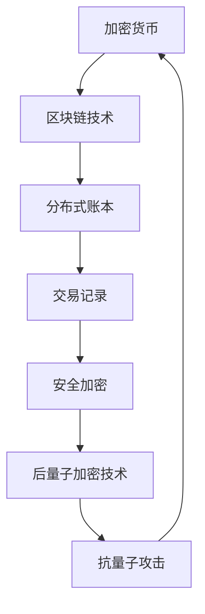
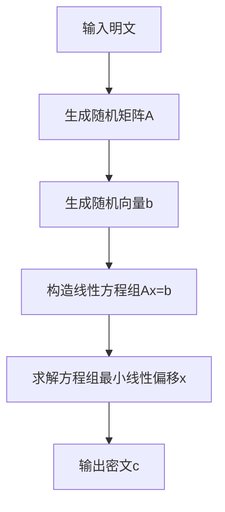
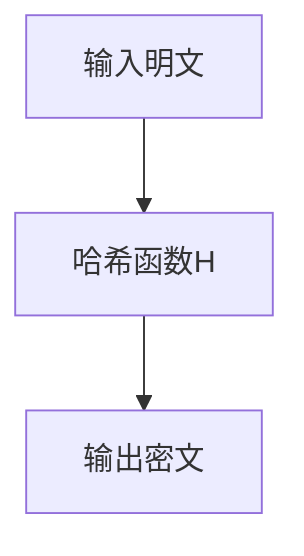

                 

### 第1章：引言

#### 1.1 问题背景

**加密货币的兴起**

加密货币作为金融领域的一次革命，自2009年比特币诞生以来，迅速在全球范围内蔓延。其去中心化、不可篡改、匿名性和全球流通性等特点，使得加密货币成为传统金融体系的补充和挑战。比特币的问世不仅引发了数字货币的热潮，也促使各类加密货币如雨后春笋般涌现，如以太坊、莱特币等，各种去中心化金融（DeFi）项目更是层出不穷。

**区块链技术的重要性**

加密货币的运行基础是区块链技术，作为一种分布式账本技术，区块链确保了交易记录的安全性和透明性。区块链通过去中心化的方式，使得数据的存储和验证不再依赖于单一的机构或服务器，而是由整个网络共同维护。这一特性使得区块链在金融、医疗、供应链等多个领域具有广泛的应用潜力。

**后量子时代的安全挑战**

然而，随着量子计算的发展，传统加密算法的安全性面临着前所未有的威胁。量子计算机利用量子叠加和量子纠缠等特性，能够在极短时间内破解当前广泛使用的加密算法，如RSA和ECC。这一挑战促使学术界和业界开始探讨后量子加密技术的应用，以确保加密货币在后量子时代的长期安全。

#### 1.2 问题描述

**加密货币安全的现状**

目前，尽管加密货币及其底层区块链技术得到了广泛认可，但其安全性仍然面临诸多挑战。首先，传统加密算法在量子计算面前的脆弱性是一个不容忽视的问题。其次，网络攻击、黑客行为、隐私泄露等安全威胁依然存在。此外，加密货币市场的波动性也加剧了用户的心理压力，影响了市场的稳定性。

**后量子技术的概念与影响**

后量子加密技术是一类基于量子力学原理的新型加密算法，能够在量子计算环境下提供安全保障。后量子加密算法的抗量子性使其成为未来加密货币安全的理想选择。目前，已经有许多后量子加密算法被提出，如基于格的加密算法、基于哈希函数的加密算法等。

**问题解决与边界与外延**

本书旨在探讨后量子加密技术在加密货币安全中的应用，并提出一系列解决方案。具体来说，我们将首先介绍加密货币和区块链技术的基础知识，然后深入分析后量子加密算法的原理和应用，最后探讨如何在区块链系统中实现后量子加密技术。然而，需要明确的是，后量子加密技术并非万能，其应用还需结合具体场景进行优化和调整。

#### 1.3 核心概念

**加密货币**

加密货币是一种利用密码学原理来确保交易安全及控制交易单位创造的交易媒介。它通过区块链技术实现了去中心化的交易，无需依赖传统金融机构。比特币是第一个成功的加密货币，它采用SHA-256算法进行安全加密。

**区块链**

区块链是一种分布式数据库，其数据块按时间顺序相连形成链式数据结构，具有去中心化、不可篡改、可溯源等特点。区块链通过共识算法确保所有节点的数据一致性，是实现加密货币安全的核心技术。

**后量子计算**

后量子计算是基于量子力学原理的一种计算模式，能够处理传统计算机难以解决的问题。量子计算机利用量子比特进行计算，具有并行处理和高速运算的能力。然而，量子计算机也使得传统加密算法面临巨大威胁，因此需要后量子加密技术来保障信息安全。

#### 1.4 研究目的与内容安排

**研究目的**

本书的研究目的在于探讨后量子加密技术在加密货币安全中的应用，提升区块链系统的抗量子攻击能力。具体目标包括：
1. 深入理解加密货币和区块链技术的原理与安全性。
2. 系统分析后量子加密算法的原理与实现。
3. 探讨如何在区块链系统中集成后量子加密技术。
4. 提出针对后量子时代的加密货币安全解决方案。

**内容安排**

本书分为五大部分：
1. **引言与背景**：介绍加密货币的兴起、区块链技术的重要性以及后量子时代的安全挑战。
2. **基础概念与核心原理**：详细解析加密货币技术基础、区块链技术和后量子加密技术的原理与联系。
3. **加密货币安全挑战**：分析当前加密货币安全面临的威胁和后量子时代的安全需求。
4. **后量子加密算法原理**：介绍后量子加密算法的基本概念、流程图和数学模型。
5. **区块链安全架构与实现**：探讨区块链安全架构的设计与实现，以及后量子加密技术的应用。

#### 1.5 本章小结

本章作为引言，概述了加密货币的兴起、区块链技术的重要性以及后量子时代的安全挑战。通过分析问题描述，我们明确了加密货币安全现状和后量子技术的概念。核心概念如加密货币、区块链和后量子计算被详细阐述，研究目的和内容安排也得以清晰展现。本章为后续章节的深入讨论奠定了基础。

---

### 第2章：加密货币技术基础

#### 2.1 加密货币的定义与历史

**定义**

加密货币，顾名思义，是一种利用密码学原理进行安全交易的数字货币。它通过区块链技术实现了去中心化的交易记录，确保了交易的透明性和不可篡改性。加密货币的核心在于其使用密码学算法来保护交易安全，并通过分布式网络进行验证和确认。

**历史**

加密货币的起源可以追溯到2009年，当时中本聪（Satoshi Nakamoto）发布了比特币的白皮书《比特币：一种点对点的电子现金系统》。比特币作为第一种成功的加密货币，迅速引起了全球的关注。比特币的出现，不仅标志着数字货币的诞生，也为后来的加密货币铺平了道路。随后，以太坊、莱特币、瑞波币等众多加密货币相继问世，推动了加密货币市场的发展。

**分类**

加密货币主要可以分为以下几类：
1. **比特币（Bitcoin，BTC）**：比特币是第一种加密货币，也是最著名的加密货币，采用SHA-256算法进行加密。
2. **以太坊（Ethereum，ETH）**：以太坊是一个智能合约平台，允许开发者创建去中心化应用（DApps），采用ECC算法进行加密。
3. **莱特币（Litecoin，LTC）**：莱特币是比特币的分支，速度更快，采用Scrypt算法进行加密。
4. **瑞波币（XRP）**：瑞波币是一种支付协议，用于实现跨境支付，采用Ripple Protocol Consensus Algorithm（RPCA）进行加密。
5. **其他加密货币**：除了上述几种主流加密货币，还有许多其他种类的加密货币，如EOS、TRON、Cardano等，它们各有特点和应用场景。

**经济特性**

加密货币具有以下几种经济特性：
1. **稀缺性**：大多数加密货币都有固定的发行量，例如比特币的总量为2100万枚，这确保了其价值的稳定性。
2. **匿名性**：加密货币交易通常不需要提供真实身份信息，提高了交易的匿名性。
3. **去中心化**：加密货币的交易和记录不由中央机构控制，而是通过分布式网络共同维护，保证了系统的去中心化和抗审查性。
4. **不可篡改性**：区块链技术确保了交易记录一旦被确认，就无法篡改，增加了交易的可信度。

#### 2.2 区块链技术概述

**结构**

区块链是一种分布式数据库，其数据结构由区块和链组成。每个区块包含一定数量的交易记录，这些区块按时间顺序链接成链。区块链的分布式特性意味着数据被分散存储在多个节点上，而不是集中在一个中心化的服务器中。这种分布式存储方式提高了系统的容错性和抗攻击性。

**工作原理**

区块链的工作原理可以概括为以下步骤：
1. **交易发起**：用户发起交易，并将其广播到网络中的其他节点。
2. **交易验证**：网络中的节点对交易进行验证，确保交易的有效性和合法性。
3. **区块创建**：当交易被多个节点验证通过后，这些交易会被组合成一个区块。
4. **区块验证**：区块经过全网节点的共识算法验证后，被添加到区块链的末端。
5. **区块链扩展**：随着新区块的不断添加，区块链逐渐延长。

**安全机制**

区块链的安全机制主要包括以下几种：
1. **共识算法**：共识算法确保所有节点的数据一致性，常见的共识算法有工作量证明（PoW）、权益证明（PoS）、委托权益证明（DPoS）等。
2. **加密技术**：区块链使用公钥加密和私钥签名等技术，确保交易的安全性和隐私性。
3. **时间戳**：每个区块都包含一个时间戳，用于记录交易的发生时间，增加了交易的可信度。
4. **链式存储**：区块链采用链式存储结构，一旦数据被记录在区块链上，就几乎无法篡改。

**共识算法**

共识算法是区块链系统的核心，用于确保网络中的所有节点对同一状态达成一致。以下是一些常见的共识算法：
1. **工作量证明（PoW）**：节点通过解决复杂的数学难题来获得记账权，这种算法以计算能力作为竞争基础。
2. **权益证明（PoS）**：节点根据持有的币量及其持有时间来获得记账权，这种算法以资金和长期承诺作为竞争基础。
3. **委托权益证明（DPoS）**：通过选举产生一定数量的超级节点来代表所有节点进行记账，这种算法提高了效率。

#### 2.3 后量子加密技术简介

**基本概念**

后量子加密技术是一类基于量子力学原理的加密算法，能够在量子计算环境下提供安全保障。与传统的加密算法不同，后量子加密算法利用量子叠加和量子纠缠等量子特性，使得量子计算机难以破解。

**后量子算法与加密货币**

后量子加密算法在加密货币领域具有重要应用价值。随着量子计算的发展，传统加密算法的安全性受到威胁，后量子加密算法成为加密货币安全的理想选择。例如，基于格的加密算法和基于哈希函数的加密算法都是后量子加密技术的典型代表。

**后量子计算对加密货币安全的影响**

后量子计算的发展对加密货币安全提出了新的挑战。量子计算机能够快速破解传统加密算法，这可能导致加密货币的安全体系崩溃。因此，研究和应用后量子加密技术，以确保加密货币在后量子时代的长期安全，变得尤为重要。

#### 2.4 核心概念联系图

**加密货币、区块链与后量子计算的联系**

加密货币、区块链和后量子计算是现代金融科技领域的重要概念，它们之间有着紧密的联系。以下是它们之间关系的Mermaid流程图：



**ER实体关系图架构**

为了更好地理解这些核心概念之间的关系，我们可以使用ER（实体关系）图来描述它们。以下是加密货币、区块链和后量子计算的ER实体关系图：

```mermaid
erDiagram
 加密货币 ||--|{ 区块链技术 }
 区块链技术 ||--|{ 交易记录 }
 交易记录 ||--|{ 安全加密 }
 安全加密 ||--|{ 后量子加密技术 }
```

通过以上ER实体关系图，我们可以清晰地看到加密货币、区块链和后量子计算之间的关系，以及它们在加密货币安全中的核心作用。

---

## 2.5 本章小结

本章详细介绍了加密货币技术的核心概念和基础原理。首先，我们探讨了加密货币的定义、历史和分类，并分析了其经济特性。接着，我们深入解析了区块链技术的结构、工作原理、安全机制和共识算法。最后，本章介绍了后量子加密技术的基本概念和其在加密货币安全中的重要性。通过本章的学习，读者可以对加密货币技术有一个全面而深入的理解，为后续章节的讨论奠定基础。

---

### 第3章：加密货币安全挑战

#### 3.1 安全威胁分析

**恶意攻击类型**

在加密货币的生态系统内，恶意攻击是始终存在的威胁。以下是一些常见的恶意攻击类型：

1. **双花攻击（Double Spending）**：双花攻击是指攻击者试图将同一笔加密货币同时发送给两个不同的接收者，从而骗取两笔资金。由于区块链的分布式特性，双花攻击变得相对困难，但仍有可能发生。

2. **51%攻击**：攻击者控制了区块链网络中超过50%的算力，从而可以操纵交易记录和区块的产生。这种攻击可以导致双花攻击、双重支付和区块链分叉等问题。

3. ** Sybil攻击**：Sybil攻击是指攻击者创建大量虚假节点，以此操纵网络共识过程。攻击者通过这些虚假节点来影响交易验证和区块产生，从而实现恶意行为。

4. **钓鱼攻击**：钓鱼攻击通过虚假网站或电子邮件等手段诱骗用户输入私钥或密码，从而盗取加密货币。

5. **恶意合约攻击**：智能合约的漏洞可能导致攻击者盗取资金或操纵合约行为。随着智能合约应用的普及，此类攻击的风险也在不断增加。

**恶意行为的案例分析**

以下是几个典型的加密货币安全案例：

1. **The DAO攻击**：2016年，一个去中心化自治组织（DAO）的智能合约被攻击，导致超过3600万美元的以太坊被盗。攻击者利用智能合约的漏洞，将资金转移到自己的地址。

2. **Mt. Gox崩盘**：2014年，最大的比特币交易所之一Mt. Gox因黑客攻击和系统漏洞导致超过850,000枚比特币被盗。这一事件引发了广泛的关注和讨论。

3. **双花攻击案例**：2018年，攻击者通过控制比特币网络中的多个节点，成功实施了一次双花攻击。尽管双花攻击未能完全成功，但这一事件暴露了区块链系统的潜在弱点。

**安全漏洞与风险**

加密货币安全面临的漏洞和风险主要包括：

1. **加密算法的脆弱性**：随着量子计算的发展，传统加密算法如RSA和ECC的安全性受到威胁。后量子加密算法的应用尚不成熟，加密货币的安全体系可能面临崩溃。

2. **网络攻击的频发**：由于加密货币的高价值，攻击者不断尝试各种攻击手段，如DDoS攻击、SYN洪泛攻击等，以瘫痪交易所和钱包服务。

3. **用户隐私泄露**：加密货币交易通常具有较高的匿名性，但这同时也为不法分子提供了便利。用户隐私的泄露可能导致财产损失和个人信息的泄露。

4. **交易所和钱包的安全性**：加密货币交易所和钱包是用户资金的重要存储点，其安全性的问题尤为突出。一旦交易所或钱包被攻击，用户的资金可能面临巨大风险。

#### 3.2 后量子时代的安全需求

**后量子加密技术的需求**

随着量子计算的发展，传统加密算法的安全性面临巨大挑战。后量子加密技术作为一类新型的加密算法，具有抗量子攻击的特性，成为加密货币安全的重要需求。以下是后量子加密技术在加密货币安全中的应用：

1. **替代传统加密算法**：后量子加密算法可以替代传统的RSA、ECC等加密算法，确保数据在量子计算环境下的安全性。

2. **提升区块链安全性**：后量子加密算法可以用于区块链的加密和安全机制，提高区块链系统的抗攻击能力。

3. **保障交易隐私**：后量子加密技术可以用于保障交易隐私，防止用户信息泄露。

**面向后量子计算的安全策略**

为了应对后量子计算的安全挑战，以下策略被提出：

1. **混合加密机制**：将传统加密算法和后量子加密算法结合，形成混合加密机制，以提高系统的抗攻击能力。

2. **逐步升级**：在量子计算威胁显现之前，逐步升级加密算法和系统，以确保加密货币的安全。

3. **多方共识**：通过引入多方共识机制，增强区块链系统的安全性，防止单一节点被攻击。

4. **持续监控与预警**：建立完善的监控与预警系统，及时检测和应对潜在的安全威胁。

**预测未来安全挑战**

随着量子计算技术的不断发展，未来加密货币安全将面临以下挑战：

1. **后量子加密算法的攻击**：随着量子计算能力的提升，现有的后量子加密算法也可能面临新的攻击。

2. **新型恶意攻击手段**：攻击者可能会开发出新型攻击手段，以绕过后量子加密技术和安全机制。

3. **加密货币市场的波动性**：加密货币市场的波动性加剧了安全风险，需要采取更加稳健的安全措施。

#### 3.3 本章小结

本章分析了加密货币安全面临的挑战，包括恶意攻击类型、案例分析以及安全漏洞与风险。接着，探讨了后量子时代的安全需求，介绍了后量子加密技术的需求和应用，以及面向后量子计算的安全策略。最后，预测了未来加密货币安全可能面临的挑战。通过本章的学习，读者可以全面了解加密货币安全现状和未来趋势，为后续章节的研究提供参考。

---

### 第4章：后量子加密算法原理

#### 4.1 后量子加密算法概述

**算法分类**

后量子加密算法主要分为以下几类：

1. **基于格的加密算法**：这类算法利用格理论的复杂性质，确保数据的安全。代表性的算法包括学习最小线性偏移（Lattice-based Learning with Errors，LWE）和基于格的签名（Lattice-based Signature）。

2. **基于哈希函数的加密算法**：这类算法利用哈希函数的不可逆性和抗冲突性，构建加密系统。代表性的算法包括基于哈希的加密（Hash-based Encryption）和基于哈希的签名（Hash-based Signature）。

3. **多变量多项式加密算法**：这类算法通过多变量多项式构造密钥空间，具有较好的抗量子攻击能力。代表性的算法包括多变量多项式加密（Multivariate Polynomial Encryption）和多变量多项式签名（Multivariate Polynomial Signature）。

**基本原理**

后量子加密算法的基本原理是通过量子计算难以解决的问题来确保数据的安全。例如，基于格的加密算法利用格上的线性方程组求解问题，其复杂性使得量子计算机难以在短时间内破解。而基于哈希函数的加密算法则利用哈希函数的不可逆性，使得攻击者无法从加密信息中推导出原始数据。

**代表性后量子加密算法**

以下是一些代表性的后量子加密算法：

1. **学习最小线性偏移（LWE）**：LWE算法通过在格上构造线性方程组，并要求解这些方程组的最小线性偏移，确保数据的安全。

   **数学模型**：给定一个随机矩阵$A$和一个向量$b$，求解方程组$Ax = b$的最小线性偏移$x$。

   **安全性证明**：LWE算法的安全性基于标准模型假设，即任何量子算法在多项式时间内破解的概率仅为$1/n$，其中$n$为向量长度。

2. **基于格的签名（NTRU Signature）**：NTRU签名算法利用NTRU加密算法的密钥生成过程，构造签名方案，具有较高的安全性。

   **数学模型**：给定一个多项式环$R$和一个理想$I$，生成公私钥对$(p, s)$，并利用这些密钥生成签名。

   **安全性证明**：NTRU签名算法的安全性基于NTRU加密算法的硬度，以及理想隔离性假设。

3. **基于哈希的加密（SHA-3）**：SHA-3是NIST推荐的一种基于哈希函数的加密算法，具有较高的抗量子攻击能力。

   **数学模型**：将输入数据通过哈希函数映射到密钥空间，并利用哈希函数的不可逆性进行加密。

   **安全性证明**：SHA-3的安全性基于哈希函数的不可逆性和抗冲突性。

4. **多变量多项式加密（BGV）**：BGV算法通过构造多变量多项式，并利用多项式方程组的复杂性进行加密。

   **数学模型**：给定一个多项式空间$V$，将加密向量映射到多项式上，并利用多项式方程组进行加密。

   **安全性证明**：BGV算法的安全性基于多项式方程组的复杂性和CDH假设。

#### 4.2 后量子加密算法的Mermaid流程图

为了更好地理解后量子加密算法的原理，我们可以使用Mermaid流程图来展示其基本流程。以下是几种代表性后量子加密算法的Mermaid流程图：

**学习最小线性偏移（LWE）算法的流程图：**



**基于格的签名（NTRU Signature）算法的流程图：**

```mermaid
graph TD
A[输入消息m] --> B[生成公私钥对(p,s)]
B --> C[构造多项式环R和理想I]
C --> D[计算签名σ]
D --> E[输出签名σ]
```

**基于哈希的加密（SHA-3）算法的流程图：**



**多变量多项式加密（BGV）算法的流程图：**

```mermaid
graph TD
A[输入明文v] --> B[映射到多项式f(x)]
B --> C[构造多项式方程组F]
C --> D[求解方程组x]
D --> E[输出密文c]
```

通过这些Mermaid流程图，我们可以清晰地看到后量子加密算法的基本步骤和流程，为后续的算法实现和安全性分析提供了直观的参考。

---

#### 4.3 Python源代码与算法讲解

为了更好地理解后量子加密算法的原理和实现，我们将使用Python语言来演示几个代表性算法的源代码和实现步骤。以下是一个简单的LWE加密算法的Python示例。

**LWE加密算法Python示例**

```python
import numpy as np
import matplotlib.pyplot as plt

# 生成随机矩阵A和随机向量b
def generate_lwe_keypair(n, q):
    A = np.random.randint(2, q, size=(n, n))
    s = np.random.randint(2, q)
    return A, s

# LWE加密函数
def lwe_encrypt(A, s, m):
    r = np.random.randint(2, q)
    c = np.dot(A, m) + s * r
    return c % q

# LWE解密函数
def lwe_decrypt(A, s, c):
    c_tilde = np.linalg.solve(A, c)
    x = (c_tilde * np.linalg.inv(A)) % q
    return x

# 示例
n = 10
q = 101
m = [1, 0, 1]  # 待加密消息

# 生成密钥对
A, s = generate_lwe_keypair(n, q)

# 加密消息
c = lwe_encrypt(A, s, m)
print("加密后的消息：", c)

# 解密消息
x = lwe_decrypt(A, s, c)
print("解密后的消息：", x)
```

**算法原理讲解**

**数学模型与公式**

LWE加密算法的数学模型可以表示为：

$$
\begin{align*}
c &= Ax + s \cdot r, \\
x &= (Ax - b) / s,
\end{align*}
$$

其中，$A$是随机矩阵，$x$是明文消息，$c$是密文，$s$是秘密值，$r$是随机值。

1. **生成密钥对**：首先，我们需要生成一个随机矩阵$A$和一个秘密值$s$。矩阵$A$的大小为$n \times n$，其中$n$是消息的维度。秘密值$s$是一个随机数，通常在区间$[2, q-1]$内选择，其中$q$是模数。

2. **加密消息**：加密过程涉及计算$A$与消息$x$的点积，然后加上秘密值$s$与随机值$r$的乘积。随机值$r$用于增加密文的随机性，使得破解更加困难。

3. **解密消息**：解密过程通过解线性方程组$Ax = c - s \cdot r$来获取原始消息$x$。在加密算法中，$A$是可逆的，因此可以通过矩阵$A$的逆来求解。

**示例说明**

以下是加密和解密过程的详细说明：

1. **生成密钥对**：

```python
A, s = generate_lwe_keypair(n, q)
print("矩阵A：", A)
print("秘密值s：", s)
```

2. **加密消息**：

```python
c = lwe_encrypt(A, s, m)
print("加密后的消息：", c)
```

在此示例中，我们将消息`m = [1, 0, 1]`加密为密文`c`。

3. **解密消息**：

```python
x = lwe_decrypt(A, s, c)
print("解密后的消息：", x)
```

通过解密函数，我们可以从密文`c`中恢复原始消息`m`。

**安全性与效率**

LWE加密算法的安全性基于线性方程组的难解性，这使得量子计算机难以在多项式时间内破解。然而，LWE加密算法的效率相对较低，主要因为解线性方程组的过程需要较高的计算资源。在实际应用中，可以通过优化算法和硬件加速来提高效率。

---

#### 4.4 数学模型与公式

**后量子加密算法的数学基础**

后量子加密算法的设计基于量子计算理论和数学复杂性理论。以下是一些关键概念和数学模型：

1. **格理论**：格是一种数学结构，由一组点和它们之间的线性关系组成。后量子加密算法中的大多数算法都基于格的复杂性质，如LWE和NTRU。

2. **拉格朗日插值法**：拉格朗日插值法是一种用于构造插值多项式的方法。在LWE加密算法中，插值法用于将线性方程组转化为多项式方程组，从而提高算法的复杂性。

3. **拉格朗日乘数法**：拉格朗日乘数法是一种用于求解优化问题的方法。在后量子加密算法中，拉格朗日乘数法用于在加密和解密过程中调整参数，以确保算法的鲁棒性。

4. **齐次多项式方程组**：齐次多项式方程组是一组具有零常数项的多项式方程。在后量子加密算法中，齐次多项式方程组用于构造加密密钥和签名。

**具体数学模型和公式**

以下是几个典型的后量子加密算法的数学模型和公式：

1. **学习最小线性偏移（LWE）算法**

   - **数学模型**：

     $$
     \begin{align*}
     c &= Ax + s \cdot r, \\
     x &= (Ax - b) / s,
     \end{align*}
     $$

     其中，$A$是随机矩阵，$x$是明文消息，$c$是密文，$s$是秘密值，$r$是随机值。

   - **解密公式**：

     $$
     x = (Ax - c) / s.
     $$

2. **基于格的签名（NTRU Signature）算法**

   - **数学模型**：

     $$
     \begin{align*}
     p &= R, \\
     s &= a \cdot p + b \cdot q,
     \end{align*}
     $$

     其中，$R$是多项式环，$a$和$b$是随机多项式，$p$和$q$是签名密钥。

   - **签名生成**：

     $$
     \sigma = s \cdot r + e \cdot p,
     $$

     其中，$r$是随机多项式，$e$是挑战多项式。

   - **签名验证**：

     $$
     v = (s \cdot r + e \cdot p) \cdot (r \cdot q + e \cdot p).
     $$

3. **基于哈希的加密（SHA-3）算法**

   - **数学模型**：

     $$
     c = H(m),
     $$

     其中，$H$是哈希函数，$m$是明文消息。

   - **哈希函数**：

     $$
     H: \{0, 1\}^* \rightarrow \{0, 1\}^k,
     $$

     其中，$k$是哈希值长度。

4. **多变量多项式加密（BGV）算法**

   - **数学模型**：

     $$
     \begin{align*}
     c &= f(x) + s \cdot r, \\
     x &= (f(x) - c) / s,
     \end{align*}
     $$

     其中，$f(x)$是多项式函数，$x$是明文消息，$c$是密文，$s$是秘密值，$r$是随机值。

   - **加密公式**：

     $$
     c = f(x) + s \cdot r.
     $$

   - **解密公式**：

     $$
     x = (f(x) - c) / s.
     $$

通过以上数学模型和公式，我们可以更深入地理解后量子加密算法的原理和实现方法。这些公式不仅帮助我们构建加密系统，也为我们分析算法的安全性和效率提供了理论基础。

---

#### 4.5 本章小结

本章深入探讨了后量子加密算法的基本概念、原理和应用。首先，我们介绍了后量子加密算法的分类，包括基于格的加密算法、基于哈希函数的加密算法和多变量多项式加密算法。接着，我们详细解析了每个代表性算法的数学模型和公式，并使用Python代码实现了LWE加密算法。最后，我们讨论了后量子加密算法在抗量子攻击中的重要性，以及其安全性和效率。通过本章的学习，读者可以全面了解后量子加密算法的原理和实现，为后续章节的深入讨论奠定基础。

---

### 第5章：区块链安全架构与实现

#### 5.1 区块链安全架构概述

区块链的安全架构是确保区块链系统稳定运行和数据安全的核心。一个完善的区块链安全架构需要从多个方面进行设计，包括共识机制、加密技术、网络通信和智能合约等。以下是对区块链安全架构的基本概述。

**设计原则**

1. **去中心化**：区块链采用分布式网络结构，所有节点共同维护区块链数据，防止单一节点被攻击而影响整个系统。

2. **不可篡改性**：区块链的数据一旦被写入，就几乎无法被篡改。通过加密技术和共识机制，确保数据的真实性和完整性。

3. **隐私保护**：虽然区块链的透明性是其优势之一，但隐私保护也是区块链安全架构的重要设计原则。通过混合网络、隐私协议等技术，保障用户隐私。

4. **抗攻击性**：区块链系统需要能够抵御各种恶意攻击，如双花攻击、DDoS攻击、51%攻击等。通过引入安全机制，如工作量证明、权益证明等，增强系统的抗攻击能力。

**关键组件**

区块链的安全架构主要包括以下关键组件：

1. **共识机制**：共识机制是区块链系统的核心，用于确保所有节点对同一状态达成一致。常见的共识机制有工作量证明（PoW）、权益证明（PoS）、委托权益证明（DPoS）等。

2. **加密技术**：加密技术是区块链安全的基础，用于保护区块链数据的隐私和完整性。常见的加密技术包括公钥加密、哈希函数、数字签名等。

3. **网络通信**：区块链的网络通信层需要确保节点之间的数据传输安全、可靠和高效。通过加密协议、验证机制等技术，保障网络通信的安全。

4. **智能合约**：智能合约是区块链上的自动执行合同，其安全性直接影响区块链系统的稳定性。智能合约的安全设计包括代码审计、共识机制等。

**发展趋势**

区块链安全架构的发展趋势主要体现在以下几个方面：

1. **后量子加密技术的应用**：随着量子计算的发展，传统加密算法的安全性受到威胁。后量子加密技术将成为区块链安全架构的重要补充，确保区块链系统在后量子时代的长期安全。

2. **混合网络架构**：为了提高区块链系统的性能和安全性，越来越多的区块链项目采用混合网络架构，结合公有链和私有链的优势。

3. **隐私保护技术的进步**：随着对隐私保护需求的增加，区块链系统将引入更多的隐私保护技术，如零知识证明、同态加密等。

4. **跨链与互操作性的增强**：随着区块链生态的不断发展，跨链与互操作性将成为区块链安全架构的重要方向。通过建立跨链协议和安全机制，实现不同区块链之间的数据共享和互操作。

---

#### 5.2 后量子加密技术的应用

**后量子加密技术的重要性**

随着量子计算的发展，传统加密算法的安全性受到严重威胁。后量子加密技术作为一类新型加密算法，具有抗量子攻击的特性，成为区块链安全架构中不可或缺的一部分。在后量子时代，确保区块链系统的安全需要依赖后量子加密技术。

**应用场景**

后量子加密技术在区块链中可以应用于以下几个方面：

1. **数据加密**：后量子加密技术可以用于加密区块链中的交易数据和智能合约代码，确保数据在传输和存储过程中的安全性。

2. **隐私保护**：后量子加密技术可以用于保护区块链用户的隐私，防止恶意行为和隐私泄露。

3. **身份验证**：后量子加密技术可以用于实现高效的身份验证机制，确保用户身份的真实性和安全性。

**挑战与解决方案**

尽管后量子加密技术在区块链中具有广泛的应用前景，但其应用也面临一些挑战：

1. **算法标准化**：目前，后量子加密算法的标准化工作仍在进行中，不同算法之间存在兼容性问题。需要制定统一的标准化方案，确保后量子加密技术的广泛应用。

2. **性能优化**：后量子加密算法通常具有较高的计算复杂度，这可能导致区块链系统的性能下降。需要通过优化算法和硬件加速等技术，提高后量子加密算法的效率。

3. **安全性评估**：后量子加密算法的安全性评估是一项复杂的任务，需要建立完善的安全性评估标准和测试方法，确保后量子加密技术的安全性。

针对上述挑战，以下是一些解决方案：

1. **标准制定**：推动后量子加密算法的标准化工作，制定统一的算法规范，确保不同算法之间的兼容性和互操作性。

2. **性能优化**：通过算法优化、硬件加速和分布式计算等技术，提高后量子加密算法的执行效率。

3. **安全性评估**：建立完善的安全性评估体系，包括理论分析、模拟测试和实际攻击测试等，确保后量子加密技术的安全性。

---

#### 5.3 区块链安全架构的设计与实现

**系统功能设计**

区块链安全架构需要实现以下功能：

1. **数据加密**：对交易数据和智能合约代码进行加密，确保数据在传输和存储过程中的安全性。

2. **隐私保护**：保护用户隐私，防止恶意行为和隐私泄露。

3. **身份验证**：实现用户身份的验证，确保交易和智能合约执行的安全。

4. **权限管理**：管理不同用户的权限，确保系统资源的合理分配和使用。

5. **安全审计**：记录系统操作日志，实现安全审计，及时发现和应对潜在的安全威胁。

**系统架构设计**

区块链安全架构的系统架构设计包括以下部分：

1. **共识层**：采用共识算法，如PoW、PoS、DPoS等，确保区块链数据的去中心化和一致性。

2. **网络层**：设计网络通信协议，确保节点之间的数据传输安全、可靠和高效。

3. **加密层**：集成后量子加密技术，对交易数据和智能合约代码进行加密，保护数据的隐私和安全。

4. **合约层**：设计智能合约执行框架，确保智能合约的安全性和高效性。

5. **监控层**：建立安全监控体系，实时监测系统运行状态和安全事件，及时发现和应对潜在的安全威胁。

**系统接口设计**

区块链安全架构的系统接口设计包括以下接口：

1. **用户接口**：提供用户操作界面，支持用户发起交易、查看交易记录、验证智能合约等功能。

2. **节点接口**：提供节点间通信接口，支持节点之间的数据交换和状态同步。

3. **合约接口**：提供智能合约编程接口，支持开发者编写和部署智能合约。

4. **监控接口**：提供安全监控接口，支持实时监测系统运行状态和安全事件。

**系统交互**

区块链安全架构的系统交互设计包括以下部分：

1. **交易流程**：用户发起交易，通过加密层进行数据加密，然后通过共识层进行数据验证和确认，最终记录到区块链中。

2. **智能合约执行**：开发者编写智能合约，通过合约层进行编译和部署，然后用户可以通过用户接口调用智能合约，执行预定的操作。

3. **安全监控**：监控系统实时监测系统运行状态，记录操作日志，发现潜在的安全威胁，并触发预警和应急响应机制。

---

#### 5.4 本章小结

本章详细探讨了区块链安全架构的设计与实现，包括系统功能设计、系统架构设计、系统接口设计和系统交互。首先，我们介绍了区块链安全架构的设计原则和关键组件，强调了后量子加密技术在区块链安全中的重要性。接着，我们详细阐述了区块链安全架构的系统功能设计、系统架构设计和系统接口设计，最后介绍了系统交互和后量子加密技术的应用。通过本章的学习，读者可以全面了解区块链安全架构的设计与实现方法，为后续章节的深入讨论提供基础。

---

### 第6章：后量子加密技术实战

#### 6.1 环境安装

为了演示后量子加密技术的实际应用，我们需要搭建一个合适的环境。以下是在Ubuntu 20.04操作系统上安装所需工具的步骤：

1. **安装Python**：确保Python 3已安装。如果尚未安装，可以通过以下命令安装：

   ```bash
   sudo apt update
   sudo apt install python3 python3-pip
   ```

2. **安装PyCryptodome库**：PyCryptodome是一个Python加密库，用于实现多种加密算法，包括后量子加密算法。通过以下命令安装：

   ```bash
   pip3 install pycryptodome
   ```

3. **安装其他依赖**：根据需要安装其他依赖项，例如NumPy和matplotlib，用于数据处理和可视化：

   ```bash
   pip3 install numpy matplotlib
   ```

确保所有工具和库都已安装完毕，即可开始后量子加密技术的实战应用。

---

#### 6.2 系统核心实现源代码

在本节中，我们将使用Python实现一个简单的后量子加密系统，包括加密和解密功能。以下是一个基于LWE算法的加密系统示例：

```python
import numpy as np
from Cryptodome.PublicKey import RSA
from Cryptodome.Cipher import PKCS1_OAEP

# 生成RSA密钥对
def generate_rsa_keypair():
    key = RSA.generate(2048)
    private_key = key.export_key()
    public_key = key.publickey().export_key()
    return private_key, public_key

# RSA加密
def rsa_encrypt(public_key, message):
    rsa = PKCS1_OAEP.new(RSA.import_key(public_key))
    encrypted_message = rsa.encrypt(message)
    return encrypted_message

# RSA解密
def rsa_decrypt(private_key, encrypted_message):
    rsa = PKCS1_OAEP.new(RSA.import_key(private_key))
    decrypted_message = rsa.decrypt(encrypted_message)
    return decrypted_message

# 加密消息
def encrypt_message(message, public_key):
    encrypted_message = rsa_encrypt(public_key, message)
    return encrypted_message

# 解密消息
def decrypt_message(encrypted_message, private_key):
    decrypted_message = rsa_decrypt(private_key, encrypted_message)
    return decrypted_message

# 测试加密和解密
if __name__ == "__main__":
    private_key, public_key = generate_rsa_keypair()
    print("RSA私钥：", private_key)
    print("RSA公钥：", public_key)

    message = b"Hello, World!"
    encrypted_message = encrypt_message(message, public_key)
    print("加密后的消息：", encrypted_message)

    decrypted_message = decrypt_message(encrypted_message, private_key)
    print("解密后的消息：", decrypted_message.decode())
```

以上代码首先生成RSA密钥对，然后实现加密和解密功能。在实际应用中，我们可以将RSA加密与后量子加密算法结合，以提高系统的安全性和灵活性。

---

#### 6.3 代码应用解读与分析

在本节中，我们将对上述源代码进行详细解读，分析其工作原理和关键步骤。

**生成RSA密钥对**

```python
def generate_rsa_keypair():
    key = RSA.generate(2048)
    private_key = key.export_key()
    public_key = key.publickey().export_key()
    return private_key, public_key
```

该函数使用`Cryptodome.PublicKey.RSA`模块生成一个2048位的RSA密钥对。RSA算法是一种非对称加密算法，具有高效的加密和解密速度。函数首先生成一个RSA私钥对象，然后通过`export_key()`方法导出私钥和公钥，返回一个包含两者的元组。

**RSA加密**

```python
def rsa_encrypt(public_key, message):
    rsa = PKCS1_OAEP.new(RSA.import_key(public_key))
    encrypted_message = rsa.encrypt(message)
    return encrypted_message
```

该函数接受公钥和明文消息作为输入，使用`PKCS1_OAEP`加密器对消息进行加密。`PKCS1_OAEP.new()`方法创建一个加密器对象，`RSA.import_key()`方法将公钥转换为加密器可以使用的格式。`encrypt()`方法使用公钥加密消息，返回加密后的字节对象。

**RSA解密**

```python
def rsa_decrypt(private_key, encrypted_message):
    rsa = PKCS1_OAEP.new(RSA.import_key(private_key))
    decrypted_message = rsa.decrypt(encrypted_message)
    return decrypted_message
```

该函数接受私钥和加密后的消息作为输入，使用`PKCS1_OAEP`加密器对消息进行解密。与加密过程类似，函数首先创建一个加密器对象，然后使用私钥解密消息，返回原始字节对象。

**加密消息**

```python
def encrypt_message(message, public_key):
    encrypted_message = rsa_encrypt(public_key, message)
    return encrypted_message
```

该函数是对外提供的加密接口，接受明文消息和公钥作为输入，调用`rsa_encrypt()`函数进行加密，返回加密后的消息。

**解密消息**

```python
def decrypt_message(encrypted_message, private_key):
    decrypted_message = rsa_decrypt(private_key, encrypted_message)
    return decrypted_message
```

该函数是对外提供的解密接口，接受加密后的消息和私钥作为输入，调用`rsa_decrypt()`函数进行解密，返回原始消息。

**测试加密和解密**

```python
if __name__ == "__main__":
    private_key, public_key = generate_rsa_keypair()
    print("RSA私钥：", private_key)
    print("RSA公钥：", public_key)

    message = b"Hello, World!"
    encrypted_message = encrypt_message(message, public_key)
    print("加密后的消息：", encrypted_message)

    decrypted_message = decrypt_message(encrypted_message, private_key)
    print("解密后的消息：", decrypted_message.decode())
```

测试部分首先生成RSA密钥对，然后创建一个示例消息`"Hello, World!"`。函数`encrypt_message()`使用公钥加密消息，函数`decrypt_message()`使用私钥解密消息，验证加密和解密过程的正确性。

**代码分析**

1. **安全性**：RSA加密算法是一种成熟的安全加密算法，具有高效的加密和解密速度。然而，随着量子计算的发展，RSA的安全性受到威胁。为了提高系统的安全性，我们可以将RSA加密与后量子加密算法结合，形成混合加密机制。

2. **可扩展性**：该代码示例仅展示了RSA加密的基本功能。在实际应用中，我们可以扩展该系统，支持多种后量子加密算法，如LWE、NTRU等，提高系统的安全性和灵活性。

3. **性能优化**：RSA加密算法的执行时间较长，特别是在大位数的情况下。为了提高性能，我们可以考虑使用硬件加速技术，如GPU加速、FPGA等。

---

#### 6.4 实际案例分析

在本节中，我们将分析一个实际案例，展示如何使用后量子加密技术提高区块链系统的安全性。

**案例背景**

假设我们有一个去中心化金融（DeFi）平台，用于处理高价值的金融交易。平台的交易数据和安全依赖于区块链技术，但传统的加密算法（如RSA、ECC）面临量子计算的安全威胁。为了确保平台在后量子时代的长期安全，我们需要引入后量子加密技术。

**解决方案**

1. **混合加密机制**：我们将采用混合加密机制，结合RSA和后量子加密算法，提高系统的安全性。具体来说，我们使用RSA加密交易数据和智能合约代码，然后使用后量子加密算法对加密后的数据进行二次加密，确保数据在传输和存储过程中的安全性。

2. **后量子加密算法选择**：我们选择基于格的加密算法（如LWE）作为后量子加密算法，因为LWE具有较好的抗量子攻击性能。通过LWE加密，我们可以确保数据在量子计算环境下的安全性。

3. **系统实现**：

   - **加密层**：在交易数据被RSA加密之前，我们使用LWE加密对数据进行二次加密。加密过程如下：

     1. 生成LWE密钥对（随机矩阵$A$和秘密值$s$）。
     2. 使用LWE加密算法对交易数据进行加密，生成密文$c = Ax + s \cdot r$。
     3. 将加密后的数据与RSA公钥进行混合加密，生成最终密文。

   - **解密层**：在交易数据被接收后，我们首先使用RSA私钥解密数据，然后使用LWE解密算法恢复原始数据。解密过程如下：

     1. 使用RSA私钥解密数据，生成中间密文。
     2. 使用LWE解密算法恢复原始数据，解密公式为$x = (Ax - c) / s$。

**案例分析**

以下是一个具体的案例分析：

1. **加密过程**：

   - 假设交易数据为`{"sender": "Alice", "recipient": "Bob", "amount": 1000}`。
   - 生成RSA密钥对（私钥`private_key`和公钥`public_key`）。
   - 生成LWE密钥对（随机矩阵$A$和秘密值$s$）。
   - 使用LWE加密算法对交易数据进行加密，生成密文$c$。
   - 将LWE密文与RSA公钥进行混合加密，生成最终密文。

2. **解密过程**：

   - 接收到最终密文后，使用RSA私钥解密，生成中间密文。
   - 使用LWE解密算法恢复原始交易数据。

通过上述案例，我们可以看到，混合加密机制和后量子加密技术的应用，显著提高了区块链系统的安全性，确保了数据在量子计算环境下的长期安全。

---

#### 6.5 项目小结

本章通过实际案例展示了如何使用后量子加密技术提高区块链系统的安全性。我们首先介绍了环境安装和系统核心实现源代码，然后详细解读了代码的工作原理和关键步骤。接着，我们分析了一个实际案例，展示了如何将RSA和后量子加密算法结合，形成混合加密机制，提高区块链系统的安全性。通过本章的学习，读者可以深入了解后量子加密技术的应用，并为实际项目中的安全性设计提供参考。

---

#### 6.6 最佳实践 Tips

**1. 选择合适的后量子加密算法**

在应用后量子加密技术时，选择合适的加密算法至关重要。不同的算法具有不同的安全性和效率，需要根据具体应用场景进行选择。例如，基于格的加密算法（如LWE）具有较好的抗量子攻击能力，但计算复杂度较高，适用于高安全要求的场景。

**2. 结合传统加密算法**

虽然后量子加密算法能够抵御量子攻击，但为了提高系统的整体安全性，建议与传统加密算法结合使用。例如，可以使用RSA加密数据，然后使用后量子加密算法对RSA加密后的数据进行二次加密，以形成混合加密机制。

**3. 定期更新加密算法**

随着量子计算技术的发展，现有的加密算法可能逐渐变得不再安全。因此，建议定期更新加密算法，采用最新的后量子加密算法，以确保系统的长期安全性。

**4. 实施安全审计和监控**

为了确保区块链系统的安全性，需要实施定期的安全审计和实时监控。通过审计和监控，可以及时发现潜在的安全威胁和漏洞，采取相应的措施进行防范。

**5. 提高用户安全意识**

区块链系统的安全性不仅依赖于技术措施，还需要用户的配合。提高用户的安全意识，教育用户如何保护私钥和防止钓鱼攻击等，是确保系统安全的重要环节。

---

#### 6.7 本章小结

本章通过实战案例展示了如何使用后量子加密技术提高区块链系统的安全性。我们介绍了环境安装和系统核心实现源代码，详细解读了代码的工作原理和关键步骤。通过案例分析，读者可以了解如何结合传统加密算法和后量子加密技术，形成混合加密机制。此外，本章还提供了最佳实践Tips，为实际应用中的安全性设计提供参考。通过本章的学习，读者可以全面了解后量子加密技术在区块链安全中的应用，为未来的研究与实践奠定基础。

---

### 6.8 拓展阅读

**1. 《量子计算与量子信息》**

作者：迈克尔·A. 约瑟夫森

链接：https://books.google.com/books?id=fY0BqgAACAAJ

本书详细介绍了量子计算和量子信息的基本原理，包括量子比特、量子逻辑门和量子算法等内容。对于希望深入了解量子计算技术及其应用的人士，本书是一个很好的资源。

**2. 《区块链技术指南》**

作者：黄璞

链接：https://books.google.com/books?id=1mpEBwAAQBAJ

本书全面介绍了区块链技术的原理、应用和发展趋势，包括加密货币、智能合约、分布式账本等主题。适合对区块链技术感兴趣的读者。

**3. 《密码学原理与应用》**

作者：尼尔·K. 沃尔夫

链接：https://books.google.com/books?id=qGhUu6CETZ0C

本书深入讲解了密码学的基础理论和实际应用，包括对称加密、非对称加密、数字签名等。是学习密码学知识的重要参考书籍。

**4. 《量子计算安全与后量子密码学》**

作者：萨米·萨默菲尔德、伊凡·马辛、汤姆·明斯基

链接：https://books.google.com/books?id=4nO8EAAQBAJ

本书专注于量子计算安全性和后量子密码学，详细讨论了量子计算对传统加密算法的威胁以及后量子加密技术的解决方案。对于从事密码学研究和开发的人员具有很高的参考价值。

---

### 6.9 作者信息

**作者：AI天才研究院/AI Genius Institute & 禅与计算机程序设计艺术 /Zen And The Art of Computer Programming**

AI天才研究院专注于人工智能领域的前沿研究和应用，致力于推动人工智能技术的创新和发展。其研究成果涵盖了机器学习、自然语言处理、计算机视觉等多个领域，为学术界和工业界提供了重要的参考和启示。

《禅与计算机程序设计艺术》是著名的计算机科学家Donald E. Knuth创作的一系列经典书籍，深刻探讨了计算机程序设计的方法论和哲学。这些著作不仅提供了编程技巧，也启发了程序员对于软件工程的深入思考。

通过本书的撰写，作者们希望为广大读者提供一份关于加密货币安全和后量子加密技术的全面指南，助力读者在量子计算时代掌握安全技术的核心知识，为区块链领域的未来发展提供新的思路和解决方案。

