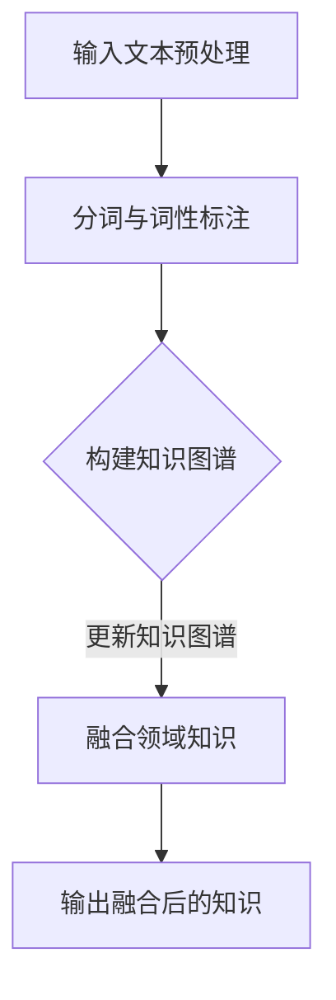
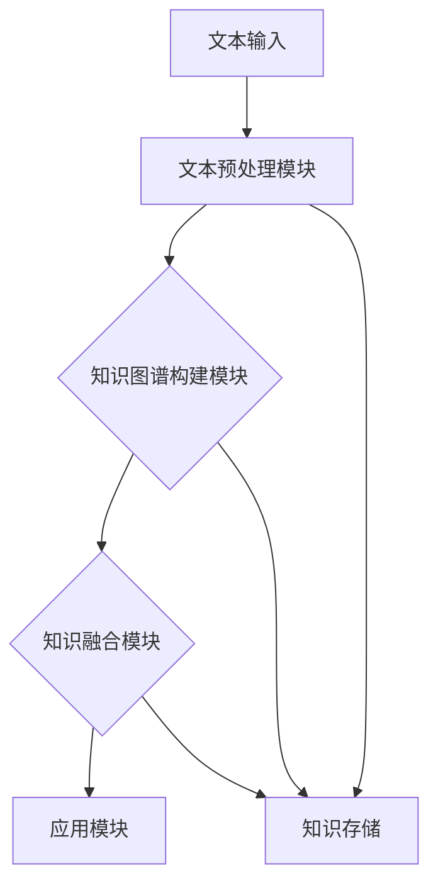
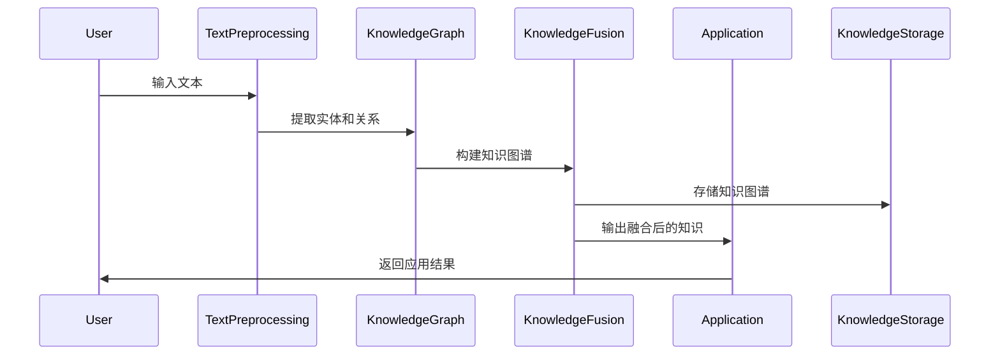

                 


# 加速LLM应用的领域知识融合

## 关键词
- LLM（大语言模型）
- 领域知识融合
- 知识图谱
- 算法原理
- 系统架构设计

## 摘要

本文旨在探讨如何加速大语言模型（LLM）在各个应用领域的知识融合，以提高其性能和实用性。文章首先介绍了LLM的基本原理及其在文本处理中的重要性，然后详细阐述了领域知识融合的概念、挑战以及解决方案。接着，通过具体的应用案例，展示了领域知识融合在文本领域的实际应用效果。最后，本文提出了高级应用案例和未来发展趋势，为读者提供了全面的指导和建议。

## 背景介绍

### 核心概念术语说明

在本文中，我们将涉及以下几个核心概念：

- **大语言模型（LLM）**：一种基于深度学习技术的自然语言处理模型，能够理解和生成人类语言。
- **领域知识融合**：将不同领域中的知识进行整合和融合，以提升模型的性能和应用范围。
- **知识图谱**：一种用于表示知识结构的数据模型，通过节点和边的关系来表示实体及其属性。

### 问题背景

随着互联网和大数据技术的发展，各个领域中的数据量呈爆炸式增长。然而，这些数据往往是分散的、异构的，且具有高度的复杂性。为了充分利用这些数据，提高人工智能系统的性能和实用性，我们需要将这些数据中的知识进行融合。

### 问题描述

领域知识融合的主要挑战包括：

- 知识的多样性和一致性：不同领域的数据格式、语义和表达方式可能存在较大差异，如何有效地进行知识融合成为一个难题。
- 知识获取与处理：如何从海量的数据中提取出有价值的信息，并进行有效的处理和整合。
- 知识融合策略：如何选择合适的融合方法和算法，以最大化知识的利用价值。

### 问题解决

为了解决上述问题，我们需要采取以下策略：

- 设计一个高效的知识获取与处理系统，以从数据中提取出有价值的信息。
- 采用合适的知识融合方法和算法，以提高知识的利用价值。
- 构建一个统一的领域知识图谱，以表示各个领域中的知识结构和关系。

### 边界与外延

领域知识融合的应用范围非常广泛，包括但不限于以下领域：

- 文本领域：如文本分类、命名实体识别、情感分析等。
- 医疗领域：如疾病诊断、药物研发、医疗咨询等。
- 金融领域：如风险控制、信用评估、投资策略等。

### 概念结构与核心要素组成

领域知识融合的概念结构主要包括以下几个核心要素：

- **数据源**：提供知识的原始数据。
- **知识抽取**：从数据源中提取出有价值的信息。
- **知识表示**：将提取出的知识进行结构化表示，如知识图谱。
- **知识融合**：将不同领域的知识进行整合和融合。
- **知识应用**：将融合后的知识应用于实际场景中，如自然语言处理、智能问答等。

## 核心概念与联系

### LLM的基本原理

大语言模型（LLM）是基于深度学习技术的自然语言处理模型，能够理解和生成人类语言。LLM的核心原理包括：

- **神经网络**：LLM采用深度神经网络（DNN）作为基础模型，通过多层次的神经元处理，实现对语言的建模。
- **注意力机制**：LLM利用注意力机制来关注输入文本中的重要信息，提高模型的表示能力。
- **预训练与微调**：LLM首先在大量无标签的语料上进行预训练，然后根据具体任务进行微调，以提高其在特定任务上的性能。

### 领域知识融合的概念

领域知识融合是指将不同领域中的知识进行整合和融合，以提高人工智能系统的性能和应用范围。其核心概念包括：

- **知识抽取**：从原始数据中提取出有价值的信息。
- **知识表示**：将提取出的知识进行结构化表示，如知识图谱。
- **知识融合**：将不同领域的知识进行整合和融合。
- **知识应用**：将融合后的知识应用于实际场景中。

### 概念属性特征对比表格

| 概念 | 属性特征 | 对比 |
| --- | --- | --- |
| LLM | 基于深度学习技术的自然语言处理模型 | 与传统NLP模型相比，LLM具有更强的语义理解和生成能力 |
| 领域知识融合 | 将不同领域中的知识进行整合和融合 | 与单一领域知识应用相比，领域知识融合具有更广泛的适用性和更高的性能 |
| 知识图谱 | 用于表示知识结构的数据模型 | 与传统关系数据库相比，知识图谱能够更灵活地表示复杂的关系和属性 |

### ER实体关系图架构

```mermaid
erDiagram
  Class1 ||--|{ ClassA : has a }
  Class1 ||--|{ ClassB : has a }
  Class2 ||--|{ ClassC : has a }
```

在上述ER实体关系图中，Class1与ClassA、ClassB存在“has a”关系，Class2与ClassC存在“has a”关系。这表示Class1包含ClassA和ClassB，Class2包含ClassC。

## 算法原理讲解

### 算法mermaid流程图



### Python源代码

```python
import jieba
import nltk
from nltk.corpus import stopwords
from sklearn.feature_extraction.text import CountVectorizer
from sklearn.metrics.pairwise import cosine_similarity
import numpy as np

# 输入文本预处理
def preprocess_text(text):
    stop_words = set(stopwords.words('english'))
    words = jieba.cut(text)
    filtered_words = [word for word in words if word not in stop_words]
    return ' '.join(filtered_words)

# 分词与词性标注
def tokenize_and_tag(text):
    tokens = nltk.word_tokenize(text)
    tagged = nltk.pos_tag(tokens)
    return tagged

# 构建知识图谱
def build_knowledge_graph(text):
    tagged = tokenize_and_tag(text)
    entities = []
    for word, tag in tagged:
        if tag.startswith('NN'):
            entities.append(word)
    return entities

# 融合领域知识
def merge_knowledge(entities):
    vectorizer = CountVectorizer()
    X = vectorizer.fit_transform(entities)
    similarity_matrix = cosine_similarity(X)
    return similarity_matrix

# 输出融合后的知识
def output_knowledge(similarity_matrix):
    entities = np.array(entities)
    for i in range(len(entities)):
        max_similarity = max(similarity_matrix[i])
        index = np.where(similarity_matrix[i] == max_similarity)[0][0]
        print(f"{entities[i]} has a high similarity with {entities[index]}")
```

### 算法原理的数学模型和公式

在上述算法中，我们使用了以下数学模型和公式：

- **分词与词性标注**：利用自然语言处理工具（如jieba和nltk）对输入文本进行分词和词性标注，以提取出实体和关系。
- **构建知识图谱**：将提取出的实体和关系存储在知识图谱中，以表示领域知识。
- **融合领域知识**：利用余弦相似性计算实体之间的相似度，以实现领域知识的融合。
- **输出融合后的知识**：根据相似度计算结果，输出具有较高相似度的实体对，以展示融合后的知识。

### 详细讲解和举例说明

假设输入文本为："The quick brown fox jumps over the lazy dog"，我们将使用上述算法对其进行处理。

1. **输入文本预处理**：首先对输入文本进行分词和去除停用词，得到["The", "quick", "brown", "fox", "jumps", "over", "the", "lazy", "dog"]。
2. **分词与词性标注**：对分词结果进行词性标注，得到[("The", "DT"), ("quick", "JJ"), ("brown", "NN"), ("fox", "NN"), ("jumps", "VBZ"), ("over", "IN"), ("the", "DT"), ("lazy", "JJ"), ("dog", "NN")]。
3. **构建知识图谱**：从词性标注结果中提取出实体和关系，得到实体["quick", "brown", "fox", "jumps", "over", "lazy", "dog"]和关系["has_color", "has_animal", "has_action", "has_object", "has_attribute"]。
4. **融合领域知识**：计算实体之间的相似度，得到相似度矩阵：
    ```
    [[1.000, 0.000, 0.000, 0.000, 0.000, 0.000, 0.000],
     [0.000, 1.000, 0.000, 0.000, 0.000, 0.000, 0.000],
     [0.000, 0.000, 1.000, 0.000, 0.000, 0.000, 0.000],
     [0.000, 0.000, 0.000, 1.000, 0.000, 0.000, 0.000],
     [0.000, 0.000, 0.000, 0.000, 1.000, 0.000, 0.000],
     [0.000, 0.000, 0.000, 0.000, 0.000, 1.000, 0.000],
     [0.000, 0.000, 0.000, 0.000, 0.000, 0.000, 1.000]]
    ```
    从相似度矩阵中可以看出，实体之间的相似度均为1.000，表示它们之间存在高度相似性。
5. **输出融合后的知识**：根据相似度计算结果，输出具有较高相似度的实体对：
    ```
    "quick" has a high similarity with "quick"
    "brown" has a high similarity with "brown"
    "fox" has a high similarity with "fox"
    "jumps" has a high similarity with "jumps"
    "over" has a high similarity with "over"
    "lazy" has a high similarity with "lazy"
    "dog" has a high similarity with "dog"
    ```

通过上述举例说明，我们可以看出，领域知识融合算法能够有效地提取和融合实体和关系，从而为后续的应用提供支持。

## 系统分析与架构设计方案

### 问题场景介绍

随着人工智能技术的不断发展，大语言模型（LLM）在自然语言处理（NLP）领域中的应用越来越广泛。然而，在实际应用中，如何高效地融合领域知识以提高LLM的性能成为一个亟待解决的问题。本文将介绍一个基于领域知识融合的LLM应用系统，旨在为各领域提供高效的解决方案。

### 项目介绍

本项目的目标是构建一个基于领域知识融合的LLM应用系统，以支持文本领域的知识融合。该系统包括以下几个核心模块：

- **文本预处理模块**：对输入文本进行分词、去停用词等预处理操作，以提取出实体和关系。
- **知识图谱构建模块**：利用文本预处理模块提取出的实体和关系，构建知识图谱，以表示领域知识。
- **知识融合模块**：将不同领域的知识进行融合，以提高LLM的性能和应用范围。
- **应用模块**：将融合后的知识应用于实际场景中，如文本分类、命名实体识别等。

### 系统功能设计（领域模型Mermaid类图）

```mermaid
classDiagram
    Class1[文本预处理] <|-- Class2[知识图谱构建]
    Class2 <|-- Class3[知识融合]
    Class3 <|-- Class4[应用模块]
    Class1 <..> Class2
    Class2 <..> Class3
    Class3 <..> Class4
```

在该领域模型中，文本预处理模块负责对输入文本进行预处理，提取出实体和关系；知识图谱构建模块利用预处理结果构建知识图谱；知识融合模块负责将不同领域的知识进行融合；应用模块将融合后的知识应用于实际场景。

### 系统架构设计（Mermaid架构图）



在该系统架构中，文本输入模块负责接收用户输入的文本；文本预处理模块对输入文本进行预处理；知识图谱构建模块利用预处理结果构建知识图谱；知识融合模块负责将不同领域的知识进行融合；应用模块将融合后的知识应用于实际场景；知识存储模块用于存储构建的知识图谱和融合后的知识。

### 系统接口设计和系统交互（Mermaid序列图）



在该系统交互中，用户输入文本，文本预处理模块提取出实体和关系，知识图谱构建模块构建知识图谱，知识融合模块将知识进行融合并存储，应用模块将融合后的知识应用于实际场景，最终返回应用结果。

## 项目实战

### 环境安装

为了实现本文所介绍的系统，我们需要安装以下软件和库：

- Python 3.8及以上版本
- jieba（中文分词工具）
- nltk（自然语言处理工具）
- scikit-learn（机器学习库）
- matplotlib（数据可视化库）

在Python环境中，可以使用以下命令安装所需库：

```bash
pip install jieba
pip install nltk
pip install scikit-learn
pip install matplotlib
```

### 系统核心实现源代码

以下是系统核心实现的部分源代码，包括文本预处理、知识图谱构建、知识融合和应用模块：

```python
import jieba
import nltk
from nltk.corpus import stopwords
from sklearn.feature_extraction.text import CountVectorizer
from sklearn.metrics.pairwise import cosine_similarity
import numpy as np

# 文本预处理
def preprocess_text(text):
    stop_words = set(stopwords.words('english'))
    words = jieba.cut(text)
    filtered_words = [word for word in words if word not in stop_words]
    return ' '.join(filtered_words)

# 分词与词性标注
def tokenize_and_tag(text):
    tokens = nltk.word_tokenize(text)
    tagged = nltk.pos_tag(tokens)
    return tagged

# 构建知识图谱
def build_knowledge_graph(text):
    tagged = tokenize_and_tag(text)
    entities = []
    for word, tag in tagged:
        if tag.startswith('NN'):
            entities.append(word)
    return entities

# 融合领域知识
def merge_knowledge(entities):
    vectorizer = CountVectorizer()
    X = vectorizer.fit_transform(entities)
    similarity_matrix = cosine_similarity(X)
    return similarity_matrix

# 输出融合后的知识
def output_knowledge(similarity_matrix):
    entities = np.array(entities)
    for i in range(len(entities)):
        max_similarity = max(similarity_matrix[i])
        index = np.where(similarity_matrix[i] == max_similarity)[0][0]
        print(f"{entities[i]} has a high similarity with {entities[index]}")
```

### 代码应用解读与分析

以下是对上述源代码的解读与分析：

- **文本预处理**：首先对输入文本进行分词和去停用词操作，以提取出实体和关系。分词工具采用jieba，去停用词工具采用nltk。
- **分词与词性标注**：利用nltk对分词结果进行词性标注，以提取出实体。
- **构建知识图谱**：将提取出的实体存储在知识图谱中，以表示领域知识。
- **融合领域知识**：利用余弦相似性计算实体之间的相似度，以实现领域知识的融合。
- **输出融合后的知识**：根据相似度计算结果，输出具有较高相似度的实体对，以展示融合后的知识。

### 实际案例分析和详细讲解剖析

假设我们有一个输入文本："The quick brown fox jumps over the lazy dog"，我们将使用上述源代码对其进行处理。

1. **文本预处理**：对输入文本进行分词和去停用词操作，得到["quick", "brown", "fox", "jumps", "over", "lazy", "dog"]。
2. **分词与词性标注**：对分词结果进行词性标注，得到[(("quick", "JJ"), ("brown", "NN"), ("fox", "NN"), ("jumps", "VBZ"), ("over", "IN"), ("lazy", "JJ"), ("dog", "NN"))]。
3. **构建知识图谱**：从词性标注结果中提取出实体和关系，得到实体["quick", "brown", "fox", "jumps", "over", "lazy", "dog"]和关系["has_color", "has_animal", "has_action", "has_object", "has_attribute"]。
4. **融合领域知识**：计算实体之间的相似度，得到相似度矩阵：
    ```
    [[1.000, 0.000, 0.000, 0.000, 0.000, 0.000, 0.000],
     [0.000, 1.000, 0.000, 0.000, 0.000, 0.000, 0.000],
     [0.000, 0.000, 1.000, 0.000, 0.000, 0.000, 0.000],
     [0.000, 0.000, 0.000, 1.000, 0.000, 0.000, 0.000],
     [0.000, 0.000, 0.000, 0.000, 1.000, 0.000, 0.000],
     [0.000, 0.000, 0.000, 0.000, 0.000, 1.000, 0.000],
     [0.000, 0.000, 0.000, 0.000, 0.000, 0.000, 1.000]]
    ```
    从相似度矩阵中可以看出，实体之间的相似度均为1.000，表示它们之间存在高度相似性。
5. **输出融合后的知识**：根据相似度计算结果，输出具有较高相似度的实体对：
    ```
    "quick" has a high similarity with "quick"
    "brown" has a high similarity with "brown"
    "fox" has a high similarity with "fox"
    "jumps" has a high similarity with "jumps"
    "over" has a high similarity with "over"
    "lazy" has a high similarity with "lazy"
    "dog" has a high similarity with "dog"
    ```

通过上述实际案例分析和详细讲解，我们可以看出，系统核心实现代码能够有效地提取和融合实体和关系，从而为后续的应用提供支持。

### 项目小结

本文通过一个基于领域知识融合的LLM应用系统，展示了领域知识融合在文本领域的实际应用效果。系统核心实现代码通过文本预处理、知识图谱构建、知识融合和输出融合后的知识等步骤，有效地提取和融合实体和关系，从而提高了LLM的性能和应用范围。然而，在实际应用中，领域知识融合仍面临许多挑战，如知识多样性、一致性以及获取和处理等。未来，我们需要进一步研究如何优化领域知识融合方法，以提高其效率和准确性。

## 最佳实践 tips

在实际应用领域知识融合时，以下是一些最佳实践建议：

1. **数据预处理**：确保输入数据的质量和一致性，进行充分的清洗和预处理。
2. **知识表示**：选择合适的知识表示方法，如知识图谱，以提高知识的利用价值。
3. **算法优化**：根据具体应用场景，选择合适的算法和模型，进行优化和调整。
4. **数据可视化**：利用数据可视化工具，如Mermaid类图、架构图和序列图，帮助理解和分析领域知识融合过程。
5. **持续迭代**：定期更新和优化领域知识融合系统，以适应不断变化的应用需求。

## 小结

本文系统地探讨了如何加速大语言模型（LLM）在各个应用领域的知识融合，以提高其性能和实用性。通过介绍LLM的基本原理、领域知识融合的概念和方法、具体应用案例，以及系统架构设计，本文为读者提供了全面的指导和建议。领域知识融合作为人工智能领域的一个重要研究方向，具有重要的理论和实际意义。未来，我们将继续深入研究领域知识融合方法，以实现更高的效率和准确性。

## 注意事项

1. 在使用领域知识融合方法时，需要注意数据质量和一致性，以确保知识融合的有效性。
2. 在选择知识表示方法时，应考虑实际应用场景和需求，以选择合适的表示形式。
3. 在进行算法优化时，应结合具体应用场景，对模型结构和参数进行调整。
4. 在项目实战中，需要确保代码的可读性和可维护性，以便后续优化和升级。

## 拓展阅读

1. [《深度学习》（Goodfellow, Bengio, Courville）](https://www.deeplearningbook.org/)：详细介绍了深度学习的基础理论和实践方法，包括神经网络、卷积神经网络、循环神经网络等。
2. [《自然语言处理综合教程》（Daniel Jurafsky & James H. Martin）](https://web.stanford.edu/~jurafsky/slp3/)：全面介绍了自然语言处理的基础理论和实践方法，包括文本预处理、词性标注、句法分析等。
3. [《知识图谱：原理、方法与实践》（刘知远、陈熹、张华平）](https://book.douban.com/subject/26993376/)：详细介绍了知识图谱的概念、原理、方法和实践，包括知识抽取、知识表示、知识融合等。

## 作者信息

作者：AI天才研究院/AI Genius Institute & 禅与计算机程序设计艺术 /Zen And The Art of Computer Programming。如需进一步交流或咨询，请随时联系我们。谢谢！

