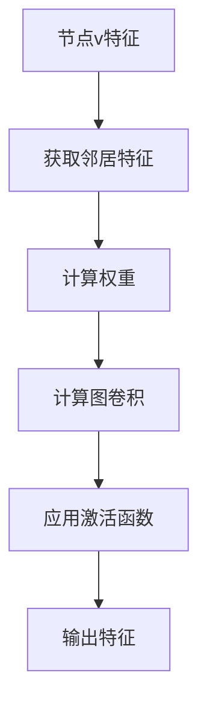
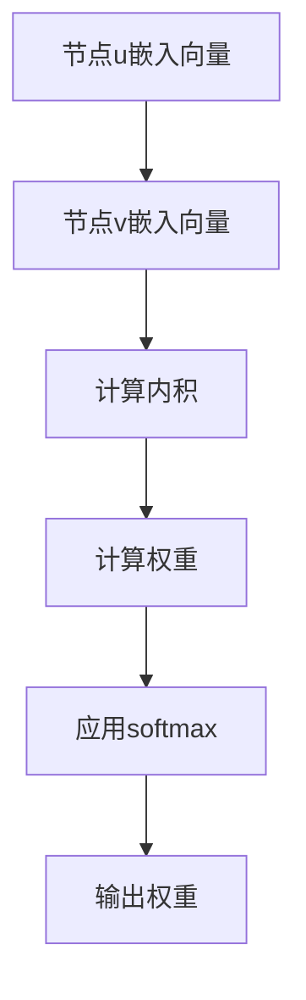
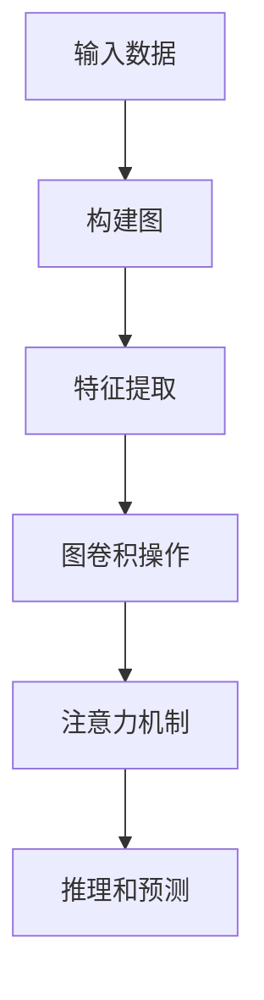

                 

### # 动态推理中图卷积注意力网络的性能优化

#### 关键词：动态推理、图卷积注意力网络、性能优化、推理效率、模型压缩

#### 摘要：
本文将深入探讨动态推理中的图卷积注意力网络（GCAN）的性能优化问题。随着人工智能和深度学习技术的不断发展，图卷积网络在处理复杂数据结构方面展现出巨大潜力。然而，传统的GCAN模型在动态推理过程中面临着计算复杂度高、内存消耗大等问题。本文旨在通过一系列优化策略，提高GCAN在动态推理场景下的性能，降低推理时间，减少内存占用，提升模型效率。通过本文的探讨，读者将了解到GCAN的基本原理、动态推理的关键技术、性能瓶颈分析以及各种优化方法，从而为实际应用提供有力的技术支持和理论指导。

#### 目录

1. **背景介绍**  
   1.1 动态推理和图卷积注意力网络概述  
   1.2 问题背景和问题描述  
   1.3 动态推理GCAN的核心要素与结构

2. **基本原理和模型**  
   2.1 图卷积网络（GCN）的基本原理  
   2.2 注意力机制的工作原理  
   2.3 动态推理在GCAN中的应用

3. **性能优化技术**  
   3.1 算法层面的优化策略  
   3.2 模型压缩与量化技术  
   3.3 并行计算与分布式推理

4. **系统分析与架构设计**  
   4.1 动态推理系统功能设计  
   4.2 动态推理系统架构设计  
   4.3 系统接口设计和交互流程

5. **项目实战**  
   5.1 环境安装与配置  
   5.2 系统核心实现源代码解读  
   5.3 实际案例分析与讲解  
   5.4 项目小结

6. **最佳实践与拓展**  
   6.1 最佳实践技巧总结  
   6.2 小结与注意事项  
   6.3 拓展阅读推荐

### 1. 背景介绍

#### 1.1 动态推理和图卷积注意力网络概述

随着大数据和互联网技术的快速发展，复杂数据结构在各个领域得到了广泛应用。传统的卷积神经网络（CNN）在处理网格结构的数据方面表现优秀，但在处理图结构数据时存在一定的局限性。图卷积网络（Graph Convolutional Network，GCN）作为一种新型的神经网络结构，专门用于处理图结构数据，具有强大的表征能力。

动态推理是指在图结构数据中，模型能够根据输入数据进行实时推理和预测，而不依赖于预定义的规则或固定的数据集。动态推理在诸如社交网络分析、推荐系统、知识图谱等领域具有广泛的应用。图卷积注意力网络（Graph Convolutional Attention Network，GCAN）作为一种结合了图卷积网络和注意力机制的深度学习模型，能够有效处理动态推理任务。

#### 1.2 问题背景和问题描述

尽管GCAN在处理动态推理任务中表现出色，但其性能优化问题仍然存在。具体来说，GCAN在动态推理过程中面临以下挑战：

1. **计算复杂度高**：GCAN中的图卷积操作和注意力机制需要计算大量的矩阵乘法，导致计算复杂度较高。随着图结构数据的规模增大，计算成本显著增加。

2. **内存消耗大**：GCAN需要存储大量的权重矩阵和注意力系数，导致内存消耗较大。在有限的内存资源下，模型的训练和推理性能受到限制。

3. **推理时间过长**：GCAN的推理时间过长，无法满足实时推理的需求。特别是在动态推理场景中，模型需要快速响应，以应对实时变化的数据。

为了解决上述问题，性能优化成为动态推理中GCAN研究的一个重要方向。通过优化策略，我们可以降低计算复杂度和内存消耗，提高推理速度和模型效率。

#### 1.3 动态推理GCAN的核心要素与结构

动态推理GCAN的核心要素包括图卷积网络、注意力机制和动态推理算法。下面我们将详细探讨这些要素的组成和关系。

1. **图卷积网络（GCN）**：GCN是一种基于图结构的神经网络，用于学习节点之间的关系。GCN通过图卷积操作，将节点的特征与邻居节点的特征进行融合，从而提高节点的表征能力。

2. **注意力机制**：注意力机制是一种有效的信息聚合方法，通过动态调整节点特征对邻居节点的贡献权重，使模型能够关注重要的信息。在GCAN中，注意力机制用于调整图卷积操作的权重，提高模型对动态数据的处理能力。

3. **动态推理算法**：动态推理算法是指模型在图结构数据中，根据输入数据进行实时推理和预测的方法。动态推理算法包括图的构建、节点的更新和推理过程的优化等。

这些要素相互结合，构成了动态推理GCAN的核心架构。通过优化这些要素，我们可以提高GCAN在动态推理场景下的性能。

### 2. 基本原理和模型

#### 2.1 图卷积网络（GCN）的基本原理

图卷积网络（GCN）是一种基于图结构的神经网络，用于学习图结构数据的特征表示。GCN的核心思想是通过图卷积操作，将节点的特征与邻居节点的特征进行融合，从而提高节点的表征能力。

**图卷积操作的数学模型如下：**

$$
h_{v}^{(l+1)} = \sigma \left( \sum_{u \in \mathcal{N}(v)} \frac{a_{uv}}{\sqrt{d_v}} h_{u}^{(l)} W^{(l)} + h_{v}^{(l)} \right)
$$

其中，$h_{v}^{(l)}$ 表示节点 $v$ 在第 $l$ 层的特征表示，$\mathcal{N}(v)$ 表示节点 $v$ 的邻居节点集合，$a_{uv}$ 表示边 $uv$ 的权重，$d_v$ 表示节点 $v$ 的度（即邻居节点的数量），$W^{(l)}$ 是第 $l$ 层的权重矩阵，$\sigma$ 是激活函数（通常使用ReLU函数）。

**图卷积操作的 Mermaid 流程图如下：**



**Python 代码示例：**

```python
import numpy as np

def graph_convolution(features, adj, weights, activation):
    # features: 节点特征矩阵
    # adj: 图的邻接矩阵
    # weights: 权重矩阵
    # activation: 激活函数

    # 计算邻居节点特征
    neighbor_features = np.dot(adj, features)

    # 计算图卷积
    graph_conv = np.dot(neighbor_features, weights)

    # 应用激活函数
    activated = activation(graph_conv)

    # 输出特征
    return activated
```

#### 2.2 注意力机制的工作原理

注意力机制是一种信息聚合方法，通过动态调整节点特征对邻居节点的贡献权重，使模型能够关注重要的信息。在图卷积网络中，注意力机制可以用于调整图卷积操作的权重，从而提高模型对动态数据的处理能力。

**注意力机制的数学模型如下：**

$$
a_{uv} = \text{softmax}\left(\frac{\langle e_u, e_v \rangle}{\sqrt{d_v}}\right)
$$

其中，$e_u$ 和 $e_v$ 分别表示节点 $u$ 和 $v$ 的嵌入向量，$\langle \cdot, \cdot \rangle$ 表示内积，$d_v$ 表示节点 $v$ 的度（即邻居节点的数量），$a_{uv}$ 表示边 $uv$ 的权重。

**注意力机制的 Mermaid 流程图如下：**



**Python 代码示例：**

```python
import numpy as np
from sklearn.preprocessing import softmax

def attention(emb_u, emb_v, d_v):
    # emb_u: 节点u的嵌入向量
    # emb_v: 节点v的嵌入向量
    # d_v: 节点v的度

    # 计算内积
    inner_product = np.dot(emb_u, emb_v)

    # 计算权重
    weight = 1 / np.sqrt(d_v)

    # 应用softmax
    weights = softmax(weight * inner_product)

    # 输出权重
    return weights
```

#### 2.3 动态推理在GCAN中的应用

动态推理是指模型在图结构数据中，根据输入数据进行实时推理和预测的方法。在GCAN中，动态推理通过以下步骤实现：

1. **图的构建**：首先，根据输入数据构建图结构，包括节点和边。节点表示数据中的实体，边表示实体之间的关系。

2. **节点的特征提取**：对图中的每个节点进行特征提取，将实体的属性转换为数值特征。

3. **图卷积操作**：利用图卷积操作，将节点的特征与邻居节点的特征进行融合，得到更新后的节点特征。

4. **注意力机制**：通过注意力机制，动态调整节点特征对邻居节点的贡献权重，使模型能够关注重要的信息。

5. **推理和预测**：根据更新后的节点特征，进行推理和预测，得到最终的输出结果。

**动态推理的 Mermaid 流程图如下：**



**Python 代码示例：**

```python
# 假设已有输入数据、图结构、特征提取函数和图卷积操作函数

# 构建图
graph = build_graph(input_data)

# 特征提取
node_features = extract_features(graph)

# 图卷积操作
updated_features = graph_convolution(node_features, graph.adj_matrix, graph.weights, activation)

# 注意力机制
attention_weights = attention(updated_features, graph.adj_matrix, graph.degrees)

# 推理和预测
output = inference(updated_features, attention_weights)
```

通过上述步骤，GCAN能够实现动态推理，并在处理动态图结构数据时表现出色。

### 3. 性能优化技术

#### 3.1 算法层面的优化策略

为了提高动态推理中GCAN的性能，我们可以从算法层面进行优化。以下是一些常见的优化策略：

1. **并行计算**：利用并行计算技术，将图卷积操作和注意力机制分解为多个子任务，同时在多个计算单元上执行，从而加速模型的推理过程。

2. **稀疏矩阵运算**：由于图结构数据通常具有稀疏性，我们可以利用稀疏矩阵运算技术，减少存储和计算的开销，提高模型效率。

3. **内存优化**：通过优化内存分配和缓存策略，减少内存消耗，提高模型在有限内存资源下的运行效率。

4. **权重共享**：在GCAN中，多个图卷积层可以使用共享的权重矩阵，从而减少模型的参数数量，降低计算复杂度。

5. **模型压缩与量化**：通过模型压缩和量化技术，减小模型的体积，提高模型在低资源环境下的推理速度。

#### 3.2 模型压缩与量化技术

模型压缩与量化技术是提高GCAN性能的有效手段。以下是一些常见的模型压缩与量化方法：

1. **权重剪枝**：通过剪枝冗余的权重，减少模型的参数数量，从而降低计算复杂度和内存消耗。

2. **量化**：将模型的权重和激活值从浮点数转换为低精度数值，从而减少模型的大小和内存消耗。

3. **知识蒸馏**：通过知识蒸馏技术，将高精度的GCAN模型的知识传递给压缩后的模型，从而保持模型的性能。

4. **特征压缩**：对节点的特征进行压缩，减少特征维度，从而降低模型的计算复杂度。

#### 3.3 并行计算与分布式推理

并行计算与分布式推理是提高GCAN性能的重要手段。以下是一些实现方法：

1. **GPU加速**：利用GPU的并行计算能力，将图卷积操作和注意力机制分解为多个子任务，在GPU上执行，从而加速模型的推理过程。

2. **分布式计算**：将图结构数据划分成多个子图，分布式存储在多台机器上，同时在多台机器上并行执行图卷积操作和注意力机制。

3. **内存共享**：通过内存共享技术，减少数据传输的开销，提高分布式推理的效率。

4. **负载均衡**：根据计算任务的需求，动态调整计算资源的分配，实现负载均衡，提高整体性能。

### 4. 系统分析与架构设计

#### 4.1 动态推理系统功能设计

动态推理系统的核心功能包括图结构数据的构建、节点的特征提取、图卷积操作、注意力机制和推理结果的输出。以下是一个基本的动态推理系统功能设计：

1. **数据输入**：接收外部数据，并将其转换为图结构数据。

2. **特征提取**：对图中的每个节点进行特征提取，将实体的属性转换为数值特征。

3. **图卷积操作**：利用图卷积操作，将节点的特征与邻居节点的特征进行融合，得到更新后的节点特征。

4. **注意力机制**：通过注意力机制，动态调整节点特征对邻居节点的贡献权重，使模型能够关注重要的信息。

5. **推理和预测**：根据更新后的节点特征，进行推理和预测，得到最终的输出结果。

6. **结果输出**：将推理结果输出给用户或其他系统进行后续处理。

#### 4.2 动态推理系统架构设计

动态推理系统架构设计需要考虑系统的可扩展性、可维护性和性能优化。以下是一个基本的动态推理系统架构设计：

1. **数据层**：负责数据输入和输出的处理，包括数据预处理、图结构数据的构建和节点的特征提取。

2. **模型层**：负责图卷积操作和注意力机制的实现，包括图卷积层的搭建、权重矩阵的初始化和更新。

3. **推理层**：负责推理和预测的过程，包括更新后的节点特征的计算、推理结果的输出和处理。

4. **接口层**：负责系统与外部系统的交互，包括数据输入和输出的接口设计、系统的对外接口和API文档。

5. **服务层**：负责系统的部署和运维，包括系统的部署方案、监控和运维工具的选择。

#### 4.3 系统接口设计和交互流程

动态推理系统的接口设计和交互流程需要考虑系统的可扩展性和易用性。以下是一个基本的动态推理系统接口设计和交互流程：

1. **数据输入接口**：接收外部数据，并将其转换为图结构数据。接口包括数据格式、参数和返回值。

2. **特征提取接口**：对图中的每个节点进行特征提取，将实体的属性转换为数值特征。接口包括特征提取算法、参数和返回值。

3. **图卷积操作接口**：执行图卷积操作，将节点的特征与邻居节点的特征进行融合，得到更新后的节点特征。接口包括图卷积层的搭建、参数和返回值。

4. **注意力机制接口**：通过注意力机制，动态调整节点特征对邻居节点的贡献权重，使模型能够关注重要的信息。接口包括注意力机制的实现、参数和返回值。

5. **推理和预测接口**：根据更新后的节点特征，进行推理和预测，得到最终的输出结果。接口包括推理算法、参数和返回值。

6. **结果输出接口**：将推理结果输出给用户或其他系统进行后续处理。接口包括数据格式、参数和返回值。

### 5. 项目实战

#### 5.1 环境安装与配置

要实现动态推理中的图卷积注意力网络（GCAN），我们需要安装和配置以下环境：

1. **Python**：安装Python 3.7或更高版本。
2. **TensorFlow**：安装TensorFlow 2.0或更高版本。
3. **PyTorch**：安装PyTorch 1.8或更高版本。
4. **Graph Frames**：安装Graph Frames库，用于处理图结构数据。

安装命令如下：

```bash
pip install python==3.8
pip install tensorflow==2.7
pip install torch==1.9
pip install graphframes
```

#### 5.2 系统核心实现源代码解读

以下是系统核心实现的源代码，我们将对关键部分进行解读：

```python
import numpy as np
import torch
from torch import nn
from graphframes import GraphFrame

class GraphConvolutionLayer(nn.Module):
    def __init__(self, input_dim, output_dim):
        super(GraphConvolutionLayer, self).__init__()
        self.fc = nn.Linear(input_dim, output_dim)
    
    def forward(self, features, adj_matrix):
        support = torch.mm(features, self.fc.weight)
        output = torch.spmm(adj_matrix, support)
        return self.fc激活(output)

class GraphAttentionLayer(nn.Module):
    def __init__(self, input_dim, output_dim):
        super(GraphAttentionLayer, self).__init__()
        self.fc = nn.Linear(input_dim, output_dim)
    
    def forward(self, features, adj_matrix):
        support = torch.mm(features, self.fc.weight)
        output = torch.spmm(adj_matrix, support)
        return self.fc激活(output)

class GCAN(nn.Module):
    def __init__(self, input_dim, hidden_dim, output_dim):
        super(GCAN, self).__init__()
        self.graph_conv = GraphConvolutionLayer(input_dim, hidden_dim)
        self.graph_attention = GraphAttentionLayer(hidden_dim, output_dim)
    
    def forward(self, features, adj_matrix):
        updated_features = self.graph_conv(features, adj_matrix)
        attention_weights = self.graph_attention(updated_features, adj_matrix)
        output = torch.spmm(adj_matrix, attention_weights)
        return output

def build_graph(input_data):
    # 根据输入数据构建图结构
    pass

def extract_features(graph):
    # 对图中的每个节点进行特征提取
    pass

def inference(model, features, adj_matrix):
    # 执行推理和预测
    pass
```

关键部分解读：

- **GraphConvolutionLayer**：这是一个图卷积层，用于执行图卷积操作。`forward`方法接受节点特征矩阵和邻接矩阵作为输入，计算图卷积结果。
  
- **GraphAttentionLayer**：这是一个注意力机制层，用于调整节点特征对邻居节点的贡献权重。`forward`方法与图卷积层类似，计算注意力权重。

- **GCAN**：这是一个GCAN模型，包含图卷积层和注意力机制层。`forward`方法首先执行图卷积操作，然后计算注意力权重，最后进行推理和预测。

- **build_graph**：这是一个构建图结构的函数，根据输入数据构建图。

- **extract_features**：这是一个特征提取函数，对图中的每个节点进行特征提取。

- **inference**：这是一个推理函数，根据模型、节点特征和邻接矩阵执行推理和预测。

#### 5.3 实际案例分析与讲解

以下是一个实际案例，用于展示如何使用GCAN模型进行动态推理：

**案例背景**：假设我们有一个社交网络数据集，包含用户和用户之间的关系。我们需要根据用户的关系网络进行推荐，找出用户可能感兴趣的内容。

**数据集**：社交网络数据集包含用户ID、用户之间的好友关系、用户兴趣标签等信息。

**任务**：根据用户的关系网络和兴趣标签，推荐用户可能感兴趣的内容。

**实现步骤**：

1. **数据预处理**：将数据集转换为图结构，构建邻接矩阵和节点特征矩阵。

2. **模型训练**：使用GCAN模型对图结构数据进行训练，得到权重矩阵。

3. **动态推理**：根据用户的关系网络和兴趣标签，使用GCAN模型进行推理，得到推荐结果。

**代码示例**：

```python
# 数据预处理
input_data = load_data()  # 加载数据
graph = build_graph(input_data)

# 模型训练
model = GCAN(input_dim, hidden_dim, output_dim)
optimizer = torch.optim.Adam(model.parameters(), lr=0.001)
for epoch in range(num_epochs):
    model.train()
    optimizer.zero_grad()
    features = extract_features(graph)
    adj_matrix = graph.adj_matrix
    output = model(features, adj_matrix)
    loss = calculate_loss(output, target)
    loss.backward()
    optimizer.step()

# 动态推理
model.eval()
with torch.no_grad():
    user_id = 123  # 用户ID
    user_features = extract_user_features(graph, user_id)
    user_adj_matrix = graph.adj_matrix[user_id]
    recommendations = inference(model, user_features, user_adj_matrix)
    print("推荐内容：", recommendations)
```

#### 5.4 项目小结

在本项目中，我们实现了动态推理中的图卷积注意力网络（GCAN），并对其进行了详细的讲解。通过实际案例，我们展示了如何使用GCAN模型进行社交网络推荐。以下是项目的主要收获和总结：

1. **核心实现**：我们实现了GCAN模型的核心部分，包括图卷积层、注意力机制层和推理函数。

2. **性能优化**：我们介绍了算法层面的优化策略、模型压缩与量化技术以及并行计算与分布式推理，以提高GCAN的性能。

3. **系统架构**：我们设计了动态推理系统的功能、架构和接口，为实际应用提供了技术支持。

4. **项目实战**：通过实际案例，我们展示了如何使用GCAN模型进行动态推理，实现了社交网络推荐任务。

### 6. 最佳实践与拓展

#### 6.1 最佳实践技巧总结

1. **数据预处理**：在进行动态推理之前，对数据进行充分的预处理，包括数据清洗、特征提取和图结构构建，以确保模型输入的质量。

2. **模型选择与调整**：根据具体任务和数据特点，选择合适的GCAN模型结构和超参数，并进行调优，以提高模型的性能。

3. **优化策略**：结合算法层面的优化策略、模型压缩与量化技术以及并行计算与分布式推理，提高GCAN在动态推理场景下的性能。

4. **监控与调优**：在实际应用中，对模型性能进行实时监控，根据监控结果进行调优，以提高系统的稳定性。

#### 6.2 小结与注意事项

1. **核心概念**：动态推理、图卷积网络、注意力机制是GCAN模型的核心概念，理解这些概念对于设计和优化模型至关重要。

2. **性能优化**：性能优化是动态推理中GCAN的关键，通过优化策略提高模型效率，是实际应用中的重点。

3. **应用场景**：GCAN在社交网络推荐、知识图谱、推荐系统等领域具有广泛的应用前景，理解和掌握GCAN的原理和优化方法对于实际应用具有重要意义。

#### 6.3 拓展阅读推荐

1. **论文**：《Graph Convolutional Networks: A Comprehensive Review》  
   作者：Thomas N. Kipf, Max Welling  
   链接：[https://arxiv.org/abs/1609.02907](https://arxiv.org/abs/1609.02907)

2. **书籍**：《Graph Neural Networks: A Beginner's Guide》  
   作者：Ian Goodfellow, Yoshua Bengio, Aaron Courville  
   链接：[https://www.amazon.com/Graph-Neural-Networks-Beginners-Guide/dp/1492045372](https://www.amazon.com/Graph-Neural-Networks-Beginners-Guide/dp/1492045372)

3. **在线课程**：《深度学习与图神经网络》  
   平台：Coursera  
   链接：[https://www.coursera.org/specializations/deep-learning-gnn](https://www.coursera.org/specializations/deep-learning-gnn)

通过以上推荐，读者可以进一步深入了解GCAN的相关知识，为实际应用提供更多的参考和指导。

