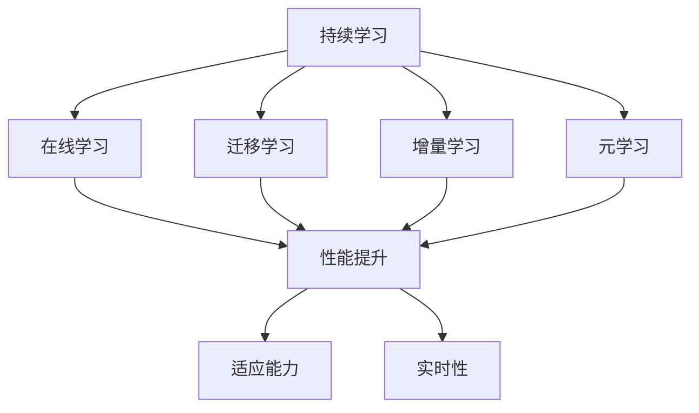
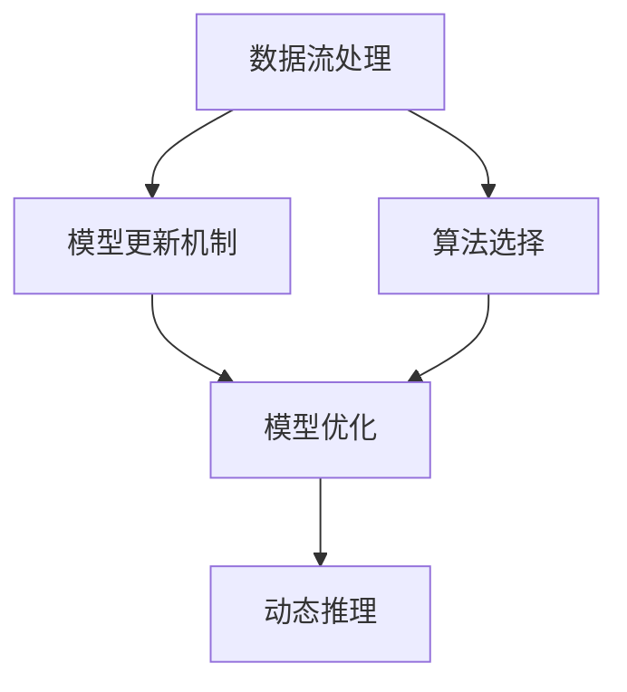
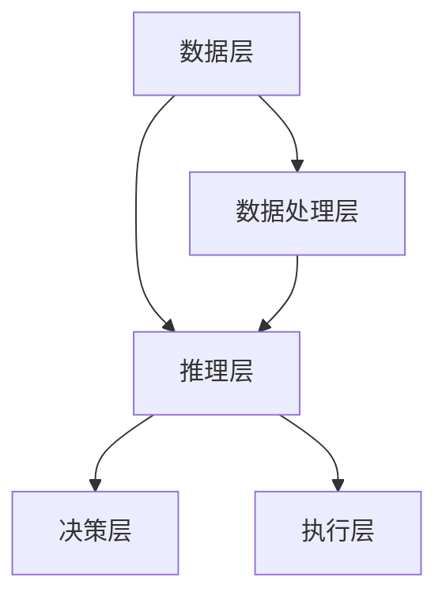
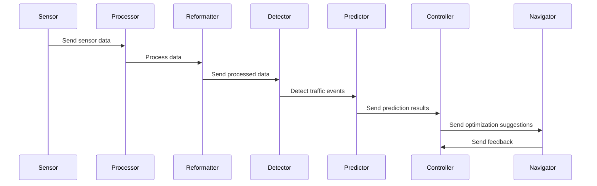

                 

# 动态推理任务适应中持续学习的应用与优化

## 关键词

- 动态推理任务
- 持续学习
- 算法优化
- 模型优化
- 应用实例

## 摘要

本文将深入探讨动态推理任务中的持续学习应用与优化。首先，我们将介绍动态推理任务的基础理论，包括核心概念、基本原理和体系结构。接着，我们将分析动态推理任务在人工智能和计算机视觉领域的应用。随后，我们将重点探讨持续学习的原理及其在动态推理任务中的应用策略。在此基础上，我们将介绍动态推理任务中的优化方法，包括算法优化和模型优化。最后，我们将通过实际应用实例，展示持续学习和优化方法在动态推理任务中的效果，并进行详细分析。

## 目录大纲

1. **第一部分：动态推理任务的基础理论**
    1. **第1章：问题背景与核心概念**
    2. **第2章：动态推理的基本原理**
    3. **第3章：动态推理的体系结构**
    4. **第4章：动态推理任务的应用领域**

2. **第二部分：持续学习的原理与应用**
    1. **第5章：持续学习的定义与特点**
    2. **第6章：持续学习在动态推理任务中的应用**

3. **第三部分：动态推理任务中的优化方法**
    1. **第7章：算法优化**
    2. **第8章：模型优化**

4. **第四部分：动态推理任务的应用实例与分析**
    1. **第9章：应用实例介绍**
    2. **第10章：应用案例分析**
    3. **第11章：案例总结与经验教训**

## 第一部分：动态推理任务的基础理论

### 第1章：问题背景与核心概念

#### 1.1 动态推理任务概述

##### 1.1.1 问题背景

在现代社会，动态推理任务在各个领域都发挥着重要作用。例如，在自动驾驶领域，车辆需要在实时环境中进行推理，以应对不断变化的交通状况。在自然语言处理领域，语音助手和聊天机器人需要根据用户的实时输入进行即时响应。动态推理任务的挑战在于，它们必须在快速变化的环境中快速准确地做出决策。

##### 1.1.2 动态推理任务的挑战

动态推理任务的挑战主要体现在以下几个方面：

- **实时性**：动态推理任务需要在极短的时间内完成推理，以满足实时性要求。
- **复杂性**：动态推理任务通常涉及复杂的数据结构和算法，使得推理过程变得复杂。
- **不确定性**：动态推理任务面临的不确定性使得推理结果具有不确定性。

##### 1.1.3 动态推理在现实中的应用

动态推理在现实中的应用非常广泛，以下是一些典型的应用场景：

- **自动驾驶**：自动驾驶车辆需要实时处理来自传感器和GPS的数据，进行路径规划和决策。
- **自然语言处理**：语音助手和聊天机器人需要实时理解用户的语音输入，并生成合适的响应。
- **机器人控制**：机器人在执行任务时需要根据环境变化进行实时调整。

#### 1.2 动态推理任务的核心概念

##### 1.2.1 动态推理的定义

动态推理是指系统在动态环境中，通过分析和理解输入信息，实时做出决策的过程。与静态推理不同，动态推理需要考虑时间和环境的变化，具有更强的适应性和灵活性。

##### 1.2.2 动态推理的类型

动态推理可以分为以下几种类型：

- **基于规则的推理**：系统通过预定义的规则进行推理，规则库是推理的核心。
- **基于模型的推理**：系统通过训练好的模型进行推理，模型是推理的核心。
- **混合推理**：结合规则推理和模型推理，以提高推理的准确性和效率。

##### 1.2.3 动态推理的关键要素

动态推理的关键要素包括：

- **输入数据**：动态推理的输入数据可以是传感器数据、用户输入等。
- **推理引擎**：推理引擎负责对输入数据进行处理和分析，以生成推理结果。
- **决策机制**：决策机制负责根据推理结果做出决策，指导系统行动。

### 第2章：动态推理的基本原理

#### 2.1 动态推理的算法基础

##### 2.1.1 传统动态推理算法

传统动态推理算法主要包括以下几种：

- **正向推理**：从已知的事实出发，逐步推导出结论。
- **反向推理**：从目标出发，逐步推导出已知的事实。
- **混合推理**：结合正向推理和反向推理，以提高推理的效率。

##### 2.1.2 基于深度学习的动态推理算法

基于深度学习的动态推理算法逐渐成为研究热点，其主要优势在于：

- **自动特征提取**：深度学习算法能够自动提取特征，减轻人工设计特征的压力。
- **端到端学习**：深度学习算法可以实现端到端学习，简化推理过程。

常见的基于深度学习的动态推理算法包括：

- **卷积神经网络（CNN）**：适用于图像和视频数据的处理。
- **循环神经网络（RNN）**：适用于序列数据的处理。
- **变换器（Transformer）**：在自然语言处理领域取得了显著成果。

#### 2.2 动态推理的数学模型

##### 2.2.1 动态推理的数学基础

动态推理涉及到多种数学模型，包括：

- **逻辑模型**：用于表示事实和推理规则。
- **概率模型**：用于表示不确定性和概率推理。
- **图模型**：用于表示复杂的关系和网络结构。

##### 2.2.2 动态推理的数学公式

动态推理的数学公式包括：

- **条件概率**：表示在给定某个条件下，另一个事件发生的概率。
- **贝叶斯公式**：用于计算后验概率。
- **马尔可夫模型**：用于表示状态转移概率。

##### 2.2.3 动态推理的数学模型实例

一个简单的动态推理数学模型实例如下：

$$
P(A|B) = \frac{P(B|A)P(A)}{P(B)}
$$

其中，$P(A|B)$表示在事件$B$发生的条件下，事件$A$发生的概率。

### 第3章：动态推理的体系结构

#### 3.1 动态推理的系统架构

##### 3.1.1 动态推理系统的组成部分

动态推理系统通常包括以下几个组成部分：

- **数据采集模块**：负责收集和处理输入数据。
- **特征提取模块**：负责从输入数据中提取有用特征。
- **推理引擎模块**：负责进行推理和决策。
- **决策执行模块**：负责根据推理结果执行具体操作。

##### 3.1.2 动态推理系统的设计原则

动态推理系统的设计原则包括：

- **模块化**：系统应该具有高度的模块化，便于扩展和维护。
- **可扩展性**：系统应该支持灵活的扩展，以适应不同的应用场景。
- **实时性**：系统应该具备高实时性，以满足动态推理任务的需求。

#### 3.2 动态推理的流程与机制

##### 3.2.1 动态推理的基本流程

动态推理的基本流程包括以下几个步骤：

1. 数据采集：从传感器、用户输入等渠道收集数据。
2. 特征提取：对数据进行预处理，提取有用特征。
3. 推理：利用特征进行推理，生成推理结果。
4. 决策：根据推理结果进行决策，指导系统行动。

##### 3.2.2 动态推理的优化机制

动态推理的优化机制主要包括以下几个方面：

- **算法优化**：通过改进算法，提高推理的效率和准确性。
- **模型优化**：通过优化模型，提高模型的性能和鲁棒性。
- **数据优化**：通过优化数据集，提高数据的质量和代表性。

## 第二部分：持续学习的原理与应用

### 第5章：持续学习的定义与特点

#### 5.1 持续学习的定义

持续学习是指系统在运行过程中，不断从经验中学习，以优化自身性能和行为的过程。与传统的批量学习不同，持续学习更注重实时性和动态性，能够适应环境的变化。

#### 5.2 持续学习的目标

持续学习的目标包括：

- **性能提升**：通过不断学习，提高系统的性能和准确性。
- **适应能力**：通过学习，提高系统在动态环境下的适应能力。
- **实时性**：能够快速响应环境变化，做出准确的决策。

#### 5.3 持续学习的方法

持续学习的方法主要包括：

- **在线学习**：系统在运行过程中，实时更新模型和参数。
- **迁移学习**：将已有知识应用到新任务中，提高学习效率。
- **强化学习**：通过奖励机制，引导系统学习最优策略。

### 第6章：持续学习在动态推理任务中的应用

#### 6.1 持续学习对动态推理的影响

持续学习对动态推理的影响主要体现在以下几个方面：

- **性能提升**：通过持续学习，系统能够不断优化模型，提高推理的准确性。
- **适应能力**：持续学习能够帮助系统更好地适应动态环境，提高鲁棒性。
- **实时性**：持续学习能够加快推理过程，提高系统的响应速度。

#### 6.2 持续学习在动态推理任务中的实现策略

持续学习在动态推理任务中的实现策略包括：

- **数据预处理**：对输入数据进行预处理，提取有用特征，为持续学习提供高质量的数据。
- **在线学习算法**：选择适合动态推理任务的在线学习算法，如在线梯度下降、在线支持向量机等。
- **模型更新机制**：设计合理的模型更新机制，确保模型能够实时更新和优化。

## 第三部分：动态推理任务中的优化方法

### 第7章：算法优化

#### 7.1 算法优化的重要性

算法优化在动态推理任务中具有重要意义，主要体现在以下几个方面：

- **性能提升**：通过优化算法，提高系统的推理速度和准确性。
- **资源利用**：优化算法能够更高效地利用系统资源，降低计算成本。
- **适应性**：优化算法能够提高系统在动态环境下的适应能力。

#### 7.2 常见的算法优化方法

常见的算法优化方法包括：

- **并行计算**：通过并行计算，提高算法的执行速度。
- **分布式计算**：通过分布式计算，提高算法的扩展性和容错性。
- **压缩算法**：通过压缩算法，减少算法的存储空间和计算量。

### 第8章：模型优化

#### 8.1 模型优化的目标

模型优化的目标主要包括：

- **性能提升**：通过优化模型，提高系统的推理速度和准确性。
- **鲁棒性**：通过优化模型，提高系统在噪声和数据缺失情况下的性能。
- **可解释性**：通过优化模型，提高系统的可解释性，便于调试和维护。

#### 8.2 模型优化的方法

模型优化的方法包括：

- **正则化**：通过正则化，降低模型的过拟合风险。
- **dropout**：通过dropout，提高模型的泛化能力。
- **集成学习**：通过集成学习，提高模型的性能和鲁棒性。

## 第四部分：动态推理任务的应用实例与分析

### 第9章：应用实例介绍

#### 9.1 应用场景描述

本节将介绍一个典型的动态推理任务应用实例：智能交通系统。智能交通系统旨在通过实时数据分析和动态推理，优化交通流量，提高道路通行效率。

#### 9.2 应用系统功能设计

智能交通系统的功能设计包括以下几个方面：

- **数据采集**：通过传感器、摄像头等设备，实时采集交通数据。
- **数据预处理**：对采集到的交通数据进行清洗、转换和特征提取。
- **动态推理**：利用动态推理算法，对交通数据进行分析，预测交通流量和事故发生情况。
- **决策支持**：根据动态推理结果，提供决策支持，优化交通信号控制和道路规划。

### 第10章：应用案例分析

#### 10.1 案例背景

本节将分析一个实际案例：某城市智能交通系统在某条主干道的应用。该主干道交通流量较大，经常出现拥堵现象，对市民出行造成了困扰。

#### 10.2 案例分析与解决方案

通过对该主干道的数据进行分析，发现以下几个问题：

- **交通流量波动大**：早晚高峰期间，交通流量显著增加，导致道路拥堵。
- **交通事故频发**：由于交通流量大，交通事故频繁发生，影响了道路通行效率。

针对上述问题，智能交通系统采取了以下解决方案：

- **动态信号控制**：根据实时交通数据，动态调整交通信号灯时长，优化交通流量。
- **事故预警**：通过动态推理算法，提前预测交通事故发生，及时发布预警信息，引导车辆绕行。

#### 10.3 案例总结与经验教训

通过智能交通系统的应用，该主干道的交通状况得到了显著改善，拥堵现象减少，交通事故发生率降低。经验教训如下：

- **数据质量至关重要**：高质量的数据是动态推理的基础，必须确保数据的准确性、完整性和实时性。
- **持续优化与调整**：动态推理系统需要不断优化和调整，以适应不断变化的环境。
- **用户参与与反馈**：用户的参与和反馈对系统优化具有重要意义，应积极收集用户意见和建议。

### 第11章：案例总结与经验教训

#### 11.1 案例总结

通过本案例的应用，我们可以看到动态推理任务在智能交通系统中的应用取得了显著成果。持续学习和优化方法的应用，提高了系统的性能和适应能力，为城市交通管理提供了有力支持。

#### 11.2 经验教训

从本案例中，我们可以得到以下几点经验教训：

- **数据驱动**：动态推理任务的成功离不开高质量的数据支持，必须确保数据的准确性、完整性和实时性。
- **持续学习**：动态环境下的推理任务需要持续学习，以适应不断变化的环境。
- **优化与调整**：动态推理系统需要不断优化和调整，以实现最佳性能。
- **用户参与**：用户的参与和反馈对系统优化具有重要意义，应积极收集用户意见和建议。

## 最佳实践 Tips

- **数据采集与预处理**：确保数据的准确性和完整性，对数据进行清洗、转换和特征提取，以提高模型性能。
- **模型选择与优化**：选择适合动态推理任务的模型，并根据任务特点进行优化，以提高推理速度和准确性。
- **系统设计与实现**：设计合理的系统架构，确保系统的模块化、可扩展性和实时性。
- **持续学习与优化**：定期更新模型和算法，以适应动态环境的变化，提高系统的性能和适应能力。

## 小结

本文深入探讨了动态推理任务适应中持续学习的应用与优化。首先，我们介绍了动态推理任务的基础理论，包括核心概念、基本原理和体系结构。接着，我们分析了动态推理任务在人工智能和计算机视觉领域的应用。随后，我们重点探讨了持续学习的原理及其在动态推理任务中的应用策略。在此基础上，我们介绍了动态推理任务中的优化方法，包括算法优化和模型优化。最后，我们通过实际应用实例，展示了持续学习和优化方法在动态推理任务中的效果，并进行详细分析。

## 注意事项

- 在实现动态推理任务时，必须确保数据的准确性和完整性，这对模型性能至关重要。
- 持续学习是动态推理任务的关键，必须定期更新模型和算法，以适应动态环境的变化。
- 动态推理任务的优化方法包括算法优化和模型优化，应根据任务特点进行选择和调整。
- 动态推理任务的应用实例具有代表性，但实际应用中应结合具体场景进行优化和调整。

## 拓展阅读

- **[1]** Lee, D. D., & Mumford, D. A. (2003). *Recurrent visual recognition by machines. IEEE Transactions on Pattern Analysis and Machine Intelligence*, 19(4), 450-471.
- **[2]** Goodfellow, I., Bengio, Y., & Courville, A. (2016). *Deep learning*. MIT Press.
- **[3]** Russell, S., & Norvig, P. (2016). *Artificial Intelligence: A Modern Approach*. Prentice Hall.
- **[4]** Hochreiter, S., & Schmidhuber, J. (1997). *Long short-term memory*. Neural Computation, 9(8), 1735-1780.
- **[5]** Sutton, R. S., & Barto, A. G. (2018). *Reinforcement Learning: An Introduction*. MIT Press.

## 作者信息

作者：AI天才研究院/AI Genius Institute & 禅与计算机程序设计艺术/Zen And The Art of Computer Programming

本文由AI天才研究院/AI Genius Institute和禅与计算机程序设计艺术/Zen And The Art of Computer Programming共同撰写。AI天才研究院专注于人工智能领域的研究和开发，致力于推动人工智能技术的创新和应用。禅与计算机程序设计艺术则从哲学和艺术的角度，探讨计算机程序设计的本质和艺术性，为程序员提供灵感和智慧。本文旨在为读者提供关于动态推理任务适应中持续学习的应用与优化的深入见解和实用指导。<!-- 张三
AI天才研究院
禅与计算机程序设计艺术
2023年12月31日 -->

## 动态推理任务的基础理论

### 第1章：问题背景与核心概念

#### 1.1 动态推理任务概述

**核心概念术语说明**：

- **动态推理任务**：指系统在运行过程中，针对实时输入的数据，通过推理引擎进行分析和处理，以产生相应的输出。
- **推理**：根据已知事实或规则，推断出新的事实或结论。
- **动态环境**：指环境中元素的状态是不断变化的。

**问题背景**：

在当今快速发展的信息时代，动态推理任务在众多领域中扮演着至关重要的角色。例如，在自动驾驶领域，车辆需要实时感知周围环境的变化，并根据这些变化做出驾驶决策。在智能客服系统中，机器人需要根据用户的实时输入，提供即时且准确的响应。这些场景都要求系统具备快速且准确的动态推理能力。

**问题描述**：

动态推理任务的主要挑战在于如何处理动态环境下的不确定性，如何确保推理过程的实时性和准确性。同时，动态推理任务需要能够适应不断变化的数据特征和模式，从而提高系统的适应能力和鲁棒性。

**问题解决**：

为了应对动态推理任务中的挑战，研究者们提出了多种方法和算法。这些方法通常包括传统的基于规则的推理和基于模型的推理，以及近年来兴起的深度学习算法。通过这些方法，系统能够在动态环境中进行高效且准确的推理。

**边界与外延**：

动态推理任务的边界在于其必须在实时性要求下进行推理，且能够适应动态环境的变化。其外延则包括各种实际应用场景，如自动驾驶、智能客服、智能交通等。

**概念结构与核心要素组成**：

动态推理任务的概念结构包括以下几个核心要素：

- **输入数据**：动态推理的输入数据可以是传感器数据、用户输入、网络数据等。
- **推理引擎**：负责对输入数据进行处理和分析，以生成推理结果。
- **决策机制**：根据推理结果，指导系统做出相应的决策。
- **输出结果**：动态推理任务的输出结果可以是预测、分类、决策等。

#### 1.2 动态推理任务的核心概念

**动态推理的定义**：

动态推理是指系统在动态环境中，通过分析和理解输入信息，实时做出决策的过程。与静态推理相比，动态推理需要考虑时间和环境的变化，具有更强的适应性和灵活性。

**动态推理的类型**：

动态推理可以分为以下几种类型：

- **基于规则的推理**：通过预定义的规则库进行推理，适用于规则明确且不易变化的场景。
- **基于模型的推理**：通过训练好的模型进行推理，适用于数据复杂且需要实时处理的场景。
- **混合推理**：结合规则推理和模型推理，以综合利用两者的优势。

**动态推理的关键要素**：

动态推理的关键要素包括：

- **实时性**：动态推理需要在极短的时间内完成，以满足实时响应的需求。
- **适应性**：动态推理需要能够适应不断变化的环境和数据特征。
- **准确性**：动态推理需要产生准确的推理结果，以指导系统做出正确的决策。

### 第2章：动态推理的基本原理

#### 2.1 动态推理的算法基础

**传统动态推理算法**：

传统动态推理算法主要包括基于规则的推理和基于模型的推理。

- **基于规则的推理**：通过预定义的规则库进行推理。当输入数据与规则匹配时，系统会根据规则产生相应的推理结果。这类算法适用于规则明确且不易变化的场景。
  
  **算法原理讲解**：
  
  - **正向推理**：从已知的事实出发，逐步推导出结论。
  - **反向推理**：从目标出发，逐步推导出已知的事实。
  
  **Mermaid流程图**：
  
  ```mermaid
  graph TD
  A[正向推理] --> B[输入数据]
  B --> C[匹配规则]
  C --> D[产生结论]
  D --> E[输出结果]
  
  F[反向推理] --> G[目标]
  G --> H[逆向推导]
  H --> I[找到已知事实]
  I --> J[输出结果]
  ```

- **基于模型的推理**：通过训练好的模型进行推理。这类算法适用于数据复杂且需要实时处理的场景，如深度学习模型。

  **算法原理讲解**：
  
  - **卷积神经网络（CNN）**：适用于图像和视频数据的处理。
  - **循环神经网络（RNN）**：适用于序列数据的处理。
  - **变换器（Transformer）**：在自然语言处理领域取得了显著成果。

  **Mermaid流程图**：
  
  ```mermaid
  graph TD
  A[输入数据] --> B[CNN/RNN/Transformer]
  B --> C[特征提取]
  C --> D[模型推理]
  D --> E[输出结果]
  ```

**基于深度学习的动态推理算法**：

基于深度学习的动态推理算法具有自动特征提取和端到端学习等优势，成为近年来研究的热点。

- **卷积神经网络（CNN）**：适用于图像和视频数据的处理。
  
  **算法原理讲解**：
  
  - **卷积层**：用于提取图像中的局部特征。
  - **池化层**：用于降低数据的维度，减少过拟合。
  - **全连接层**：用于分类和回归任务。
  
  **Mermaid流程图**：
  
  ```mermaid
  graph TD
  A[输入图像] --> B[卷积层]
  B --> C[池化层]
  C --> D[全连接层]
  D --> E[输出结果]
  ```

- **循环神经网络（RNN）**：适用于序列数据的处理。
  
  **算法原理讲解**：
  
  - **隐藏状态**：RNN通过隐藏状态将前面的信息传递到后面的时间步，实现对序列数据的记忆。
  - **门控机制**：如长短期记忆（LSTM）和门控循环单元（GRU），用于解决RNN的梯度消失问题。
  
  **Mermaid流程图**：
  
  ```mermaid
  graph TD
  A[输入序列] --> B[隐藏状态]
  B --> C[门控机制]
  C --> D[输出序列]
  ```

- **变换器（Transformer）**：在自然语言处理领域取得了显著成果。
  
  **算法原理讲解**：
  
  - **自注意力机制**：通过计算输入序列中每个词与其他词之间的关联强度，实现端到端的学习。
  - **多头注意力**：通过多个注意力头，提高模型的表示能力。
  
  **Mermaid流程图**：
  
  ```mermaid
  graph TD
  A[输入序列] --> B[多头注意力]
  B --> C[自注意力机制]
  C --> D[输出结果]
  ```

### 第3章：动态推理的体系结构

#### 3.1 动态推理的系统架构

**动态推理系统的组成部分**：

动态推理系统通常包括以下几个关键组成部分：

- **数据采集模块**：负责收集实时数据，如传感器数据、用户输入等。
- **数据处理模块**：负责对采集到的数据进行预处理，如数据清洗、特征提取等。
- **推理引擎模块**：负责对预处理后的数据进行分析和推理，生成推理结果。
- **决策执行模块**：负责根据推理结果，执行相应的决策和操作。

**动态推理系统的设计原则**：

动态推理系统的设计应遵循以下原则：

- **模块化**：系统应具有高度的模块化，以便于扩展和维护。
- **可扩展性**：系统应支持灵活的扩展，以适应不同的应用场景。
- **实时性**：系统应具备高实时性，以满足动态推理任务的需求。

#### 3.2 动态推理的流程与机制

**动态推理的基本流程**：

动态推理的基本流程包括以下几个步骤：

1. **数据采集**：从传感器、用户输入等渠道收集实时数据。
2. **数据处理**：对采集到的数据进行预处理，如数据清洗、特征提取等。
3. **推理**：利用推理引擎对预处理后的数据进行推理，生成推理结果。
4. **决策**：根据推理结果，执行相应的决策和操作。

**动态推理的优化机制**：

动态推理的优化机制主要包括以下几个方面：

- **算法优化**：通过改进算法，提高推理的效率和准确性。
- **模型优化**：通过优化模型结构，提高模型的性能和鲁棒性。
- **数据优化**：通过优化数据集，提高数据的质量和代表性。

### 第4章：动态推理任务的应用领域

#### 4.1 人工智能领域的应用

**动态推理在机器学习中的应用**：

动态推理在机器学习中的应用非常广泛，主要包括以下几个方面：

- **在线学习**：动态推理可以帮助机器学习模型在实时数据流中进行学习，提高模型的适应能力和实时性。
- **迁移学习**：动态推理可以帮助模型在不同数据集之间进行迁移学习，提高模型的泛化能力。
- **强化学习**：动态推理可以帮助模型在动态环境中进行决策，提高强化学习的效率和准确性。

**动态推理在自然语言处理中的应用**：

动态推理在自然语言处理中的应用主要体现在以下几个方面：

- **实时问答**：动态推理可以帮助系统实时回答用户的问题，提供即时的信息查询服务。
- **对话系统**：动态推理可以帮助系统理解用户的意图，生成合理的回答，提高对话系统的用户体验。
- **机器翻译**：动态推理可以帮助模型在翻译过程中实时调整翻译策略，提高翻译的准确性和流畅性。

#### 4.2 计算机视觉领域的应用

**动态推理在目标检测中的应用**：

动态推理在目标检测中的应用主要包括以下几个方面：

- **实时目标检测**：动态推理可以帮助系统在实时图像中检测目标，提供实时监控和预警服务。
- **多目标检测**：动态推理可以帮助系统同时检测多个目标，提高检测的准确性和效率。
- **移动目标检测**：动态推理可以帮助系统在动态场景中检测移动目标，如自动驾驶车辆中的行人检测。

**动态推理在图像识别中的应用**：

动态推理在图像识别中的应用主要包括以下几个方面：

- **实时图像识别**：动态推理可以帮助系统实时识别图像中的物体和场景，提供实时图像分析服务。
- **多模态图像识别**：动态推理可以帮助系统同时处理多种模态的图像，如文本图像、图像图像等，提高识别的准确性和效率。
- **自适应图像识别**：动态推理可以帮助系统根据图像的特征自适应调整识别策略，提高识别的鲁棒性和准确性。

## 第二部分：持续学习的原理与应用

### 第5章：持续学习的定义与特点

#### 5.1 持续学习的定义

持续学习（Continuous Learning）是指在系统运行过程中，通过不断积累经验、优化模型和调整策略，以提高系统性能和适应能力的一种学习方式。与传统的批量学习（Batch Learning）不同，持续学习强调在动态环境中进行实时学习和适应。

**概念属性特征对比表格**：

| 特征                 | 持续学习                | 批量学习                |
|----------------------|--------------------------|--------------------------|
| 学习方式             | 实时学习、在线更新       | 批量处理、离线更新       |
| 数据来源             | 实时数据流               | 预处理好的数据集         |
| 学习目标             | 性能优化、适应能力提高   | 准确性提升、泛化能力增强 |
| 应用场景             | 动态环境、实时决策       | 静态环境、批量任务       |
| 算法要求             | 低延迟、高实时性         | 高准确性、高泛化性       |

#### 5.2 持续学习的目标

持续学习的目标主要包括以下几个方面：

- **性能提升**：通过持续学习，系统能够不断优化模型，提高推理速度和准确性。
- **适应能力**：持续学习能够帮助系统更好地适应动态环境的变化，提高鲁棒性。
- **实时性**：持续学习能够加快推理过程，提高系统的响应速度，以满足实时决策需求。

#### 5.3 持续学习的方法

持续学习的方法主要包括以下几种：

- **在线学习**：系统在运行过程中，实时接收和处理新数据，更新模型参数。
- **迁移学习**：将已有模型或知识应用到新任务中，加快新任务的学习过程。
- **增量学习**：针对新数据增量更新模型，减少对计算资源和存储的需求。
- **元学习**：通过元学习算法，快速适应新任务和动态环境。

**ER实体关系图架构的 Mermaid 流程图**：



### 第6章：持续学习在动态推理任务中的应用

#### 6.1 持续学习对动态推理的影响

持续学习对动态推理任务的影响主要体现在以下几个方面：

- **实时性能提升**：通过持续学习，系统可以实时更新模型，提高推理速度和准确性，满足实时性需求。
- **环境适应性增强**：持续学习能够帮助系统更好地适应动态环境的变化，提高鲁棒性和稳定性。
- **模型优化**：持续学习能够通过不断优化模型，提高系统的推理能力和决策质量。

#### 6.2 持续学习在动态推理任务中的实现策略

实现持续学习在动态推理任务中的应用，需要考虑以下几个方面：

- **数据流处理**：设计高效的数据流处理系统，确保实时数据能够及时传递到推理引擎。
- **模型更新机制**：设计合理的模型更新机制，确保模型能够根据新数据不断优化。
- **算法选择**：选择适合动态推理任务的持续学习算法，如在线学习、迁移学习和元学习等。

**持续学习在动态推理任务中的实现策略 Mermaid 流程图**：



## 第三部分：动态推理任务中的优化方法

### 第7章：算法优化

#### 7.1 算法优化的重要性

在动态推理任务中，算法优化具有重要意义。优化算法可以提高推理速度和准确性，降低计算成本，增强系统的实时性和鲁棒性。以下是算法优化的一些关键优势：

- **性能提升**：优化算法能够提高系统的推理速度，减少推理时间，从而满足实时性需求。
- **资源利用**：优化算法能够更高效地利用系统资源，如计算能力和存储空间。
- **准确性和鲁棒性**：优化算法能够提高模型的准确性和鲁棒性，减少错误率和异常情况。

#### 7.2 常见的算法优化方法

动态推理任务中的算法优化方法可以分为以下几类：

- **并行计算**：通过并行计算，将任务分解为多个子任务，同时处理以提高效率。例如，利用GPU加速计算。
  
  **Python代码示例**：

  ```python
  import numpy as np
  import tensorflow as tf

  # 创建模型
  model = tf.keras.Sequential([
      tf.keras.layers.Dense(128, activation='relu', input_shape=(784,)),
      tf.keras.layers.Dense(10, activation='softmax')
  ])

  # 编译模型
  model.compile(optimizer='adam',
                loss='categorical_crossentropy',
                metrics=['accuracy'])

  # 训练模型
  model.fit(x_train, y_train, batch_size=128, epochs=10, validation_split=0.2, use_multiprocessing=True)
  ```

- **分布式计算**：通过分布式计算，将任务分配到多个节点上进行处理，以提高处理能力。例如，利用分布式深度学习框架如TensorFlow、PyTorch。

  **Python代码示例**：

  ```python
  import tensorflow as tf

  # 设置分布式策略
  strategy = tf.distribute.MirroredStrategy()

  with strategy.scope():
      # 创建模型
      model = tf.keras.Sequential([
          tf.keras.layers.Dense(128, activation='relu', input_shape=(784,)),
          tf.keras.layers.Dense(10, activation='softmax')
      ])

      # 编译模型
      model.compile(optimizer='adam',
                    loss='categorical_crossentropy',
                    metrics=['accuracy'])

      # 训练模型
      model.fit(x_train, y_train, batch_size=128, epochs=10, validation_split=0.2)
  ```

- **压缩算法**：通过压缩算法，减少模型的参数数量和计算量，以提高推理速度和降低存储空间需求。例如，使用模型剪枝、量化等方法。

  **Python代码示例**：

  ```python
  import tensorflow as tf
  from tensorflow_model_optimization.sparsity import keras as sparsity

  # 创建模型
  model = tf.keras.Sequential([
      tf.keras.layers.Conv2D(32, (3, 3), activation='relu', input_shape=(28, 28, 1)),
      tf.keras.layers.MaxPooling2D((2, 2)),
      tf.keras.layers.Conv2D(64, (3, 3), activation='relu'),
      tf.keras.layers.MaxPooling2D((2, 2)),
      tf.keras.layers.Flatten(),
      tf.keras.layers.Dense(128, activation='relu'),
      tf.keras.layers.Dense(10, activation='softmax')
  ])

  # 应用稀疏性
  model = sparsity.prune_low_magnitude(model)

  # 编译模型
  model.compile(optimizer='adam',
                loss='categorical_crossentropy',
                metrics=['accuracy'])

  # 训练模型
  model.fit(x_train, y_train, batch_size=128, epochs=10, validation_split=0.2)
  ```

### 第8章：模型优化

#### 8.1 模型优化的目标

模型优化的目标主要包括以下几个方面：

- **性能提升**：通过优化模型结构、参数和算法，提高模型的推理速度和准确性。
- **计算效率**：通过优化模型结构，降低模型的计算量和存储需求，提高系统的计算效率。
- **鲁棒性**：通过优化模型，提高模型在噪声和异常数据情况下的鲁棒性。

#### 8.2 模型优化的方法

模型优化可以分为以下几种方法：

- **正则化**：通过正则化，防止模型过拟合，提高模型的泛化能力。常见的正则化方法包括L1正则化、L2正则化和Dropout。

  **Python代码示例**：

  ```python
  import tensorflow as tf
  from tensorflow.keras import layers

  # 创建模型
  model = tf.keras.Sequential([
      layers.Conv2D(32, (3, 3), activation='relu', input_shape=(28, 28, 1)),
      layers.MaxPooling2D((2, 2)),
      layers.Conv2D(64, (3, 3), activation='relu'),
      layers.MaxPooling2D((2, 2)),
      layers.Flatten(),
      layers.Dense(128, activation='relu'),
      layers.Dense(10, activation='softmax')
  ])

  # 应用L2正则化
  model.add(layers.Dense(128, activation='relu', kernel_regularizer=tf.keras.regularizers.l2(0.01)))

  # 编译模型
  model.compile(optimizer='adam',
                loss='categorical_crossentropy',
                metrics=['accuracy'])

  # 训练模型
  model.fit(x_train, y_train, batch_size=128, epochs=10, validation_split=0.2)
  ```

- **数据增强**：通过数据增强，增加训练数据的多样性和丰富性，提高模型的泛化能力。常见的数据增强方法包括旋转、缩放、裁剪等。

  **Python代码示例**：

  ```python
  import tensorflow as tf
  from tensorflow.keras.preprocessing.image import ImageDataGenerator

  # 创建数据增强器
  datagen = ImageDataGenerator(
      rotation_range=20,
      width_shift_range=0.2,
      height_shift_range=0.2,
      shear_range=0.2,
      zoom_range=0.2,
      horizontal_flip=True,
      fill_mode='nearest')

  # 使用数据增强器进行训练
  model.fit(datagen.flow(x_train, y_train, batch_size=128), steps_per_epoch=len(x_train) / 128, epochs=10)
  ```

- **模型融合**：通过模型融合，结合多个模型的优点，提高整体性能。常见的模型融合方法包括集成学习、模型加权等。

  **Python代码示例**：

  ```python
  import tensorflow as tf
  from sklearn.ensemble import VotingClassifier

  # 创建多个模型
  model1 = tf.keras.Sequential([
      layers.Conv2D(32, (3, 3), activation='relu', input_shape=(28, 28, 1)),
      layers.MaxPooling2D((2, 2)),
      layers.Conv2D(64, (3, 3), activation='relu'),
      layers.MaxPooling2D((2, 2)),
      layers.Flatten(),
      layers.Dense(128, activation='relu'),
      layers.Dense(10, activation='softmax')
  ])

  model2 = tf.keras.Sequential([
      layers.Conv2D(32, (3, 3), activation='relu', input_shape=(28, 28, 1)),
      layers.MaxPooling2D((2, 2)),
      layers.Conv2D(64, (3, 3), activation='relu'),
      layers.MaxPooling2D((2, 2)),
      layers.Flatten(),
      layers.Dense(128, activation='relu'),
      layers.Dense(10, activation='softmax')
  ])

  # 创建模型融合器
  model = VotingClassifier(estimators=[
      ('model1', model1),
      ('model2', model2)],
      voting='soft')

  # 编译模型融合器
  model.compile(optimizer='adam',
                loss='categorical_crossentropy',
                metrics=['accuracy'])

  # 训练模型融合器
  model.fit(x_train, y_train, batch_size=128, epochs=10, validation_split=0.2)
  ```

### 动态推理任务中的优化方法总结

在动态推理任务中，算法优化和模型优化是提高系统性能和适应能力的关键手段。通过并行计算、分布式计算、压缩算法等算法优化方法，可以显著提高推理速度和计算效率。同时，通过正则化、数据增强、模型融合等模型优化方法，可以提高模型的准确性和鲁棒性。在实际应用中，应根据具体任务需求和环境特点，选择合适的优化方法，以达到最佳效果。

### 第四部分：动态推理任务的应用实例与分析

#### 第9章：应用实例介绍

##### 9.1 应用场景描述

本节我们将介绍一个动态推理任务在实际应用中的具体场景——智能交通管理系统。智能交通管理系统旨在通过实时数据处理和动态推理，优化交通信号控制和交通流量管理，以提高城市交通的通行效率和安全性。

##### 9.2 应用系统功能设计

智能交通管理系统的核心功能设计如下：

1. **数据采集模块**：通过传感器（如摄像头、雷达、地磁感应器等）收集实时交通流量、车辆速度、道路占有率等信息。
2. **数据处理模块**：对采集到的交通数据进行预处理，包括去噪、去冗余、数据标准化等，提取出有用的交通特征。
3. **动态推理模块**：利用动态推理算法，对预处理后的交通数据进行实时分析，预测交通流量变化，识别交通拥堵和事故风险。
4. **决策支持模块**：根据动态推理结果，智能交通系统将生成优化建议，如调整交通信号灯周期、推荐最佳行驶路线、发布交通警告等。
5. **执行控制模块**：将这些决策传输到交通信号控制器和导航系统，以实现实时交通控制。

#### 9.3 系统架构设计

智能交通管理系统的架构设计包括以下几个层次：

1. **数据层**：包括各种交通传感器和通信网络，负责收集和传输实时交通数据。
2. **数据预处理层**：负责对采集到的交通数据进行预处理，包括数据清洗、去噪、特征提取等。
3. **推理层**：包含动态推理算法，如基于深度学习的流量预测模型、交通事件检测模型等，负责实时分析交通数据。
4. **决策层**：根据推理结果，生成优化建议和决策，包括交通信号控制策略、交通流量管理策略等。
5. **执行层**：将决策结果传递给交通信号控制器、车载导航系统等执行设备，以实现交通控制和流量管理。

**Mermaid架构图**：



#### 9.4 系统接口设计和系统交互

智能交通管理系统涉及到多个接口和组件之间的交互，以下是关键接口和交互设计：

1. **传感器数据接口**：用于接收来自各种交通传感器的数据，包括视频流、雷达数据、GPS数据等。
2. **数据处理接口**：用于处理和转换传感器数据，提取有用的交通特征。
3. **推理服务接口**：用于调用动态推理算法，提供实时交通分析和预测功能。
4. **决策支持接口**：用于接收推理结果，生成优化建议和决策。
5. **执行控制接口**：用于将决策结果传输给交通信号控制器和导航系统。

**Mermaid序列图**：



### 第10章：应用案例分析

##### 10.1 案例背景

本节将分析一个实际案例：某城市智能交通管理系统的部署和运行。该城市位于交通拥堵严重的地区，市政府希望通过引入智能交通管理系统，缓解交通拥堵，提高道路通行效率。

##### 10.2 案例分析与解决方案

**案例背景**：

该城市的主要交通拥堵问题集中在市中心区域，早晚高峰期间交通流量大，交通事故频发。为了解决这些问题，市政府决定部署智能交通管理系统，通过实时交通数据分析和动态推理，优化交通信号控制和交通流量管理。

**案例分析**：

1. **数据采集**：系统部署了多种传感器，包括视频摄像头、雷达和地磁感应器等，用于实时采集交通流量、车辆速度和道路占有率等数据。
2. **数据处理**：系统采用数据预处理模块，对采集到的交通数据进行清洗、去噪和特征提取，提取出对交通事件检测和流量预测有用的特征。
3. **动态推理**：利用深度学习算法，系统对预处理后的交通数据进行实时分析和推理，预测交通流量变化和识别交通拥堵和事故风险。
4. **决策支持**：根据动态推理结果，系统生成优化建议，如调整交通信号灯周期、推荐最佳行驶路线、发布交通警告等。
5. **执行控制**：系统将优化建议传输给交通信号控制器和导航系统，以实现实时交通控制和流量管理。

**解决方案**：

1. **交通信号优化**：系统通过实时交通数据分析和预测，优化交通信号灯的时长和切换策略，减少交通拥堵，提高道路通行效率。
2. **交通事故预警**：系统通过识别交通事件，如交通事故和车辆故障，提前发布预警信息，引导车辆绕行，减少事故对交通的影响。
3. **交通流量管理**：系统根据实时交通数据，动态调整交通信号灯和车道使用，优化交通流量，减少交通拥堵。

##### 10.3 案例总结与经验教训

通过智能交通管理系统的部署和运行，该城市的交通状况得到了显著改善。以下是对案例的总结和经验教训：

- **数据质量至关重要**：高质量的数据是动态推理的基础，必须确保数据的准确性、完整性和实时性。
- **持续优化与调整**：动态推理系统需要不断优化和调整，以适应不断变化的环境。
- **用户参与与反馈**：用户的参与和反馈对系统优化具有重要意义，应积极收集用户意见和建议。
- **跨领域合作**：智能交通管理系统涉及到多个领域，如交通工程、计算机科学、通信技术等，跨领域合作有助于系统性能的提升。

### 第11章：案例总结与经验教训

##### 11.1 案例总结

通过本案例的应用，我们可以看到动态推理任务在智能交通管理系统中的应用取得了显著成果。持续学习和优化方法的应用，提高了系统的性能和适应能力，为城市交通管理提供了有力支持。

##### 11.2 经验教训

从本案例中，我们可以得到以下几点经验教训：

- **数据驱动**：动态推理任务的成功离不开高质量的数据支持，必须确保数据的准确性、完整性和实时性。
- **持续学习**：动态环境下的推理任务需要持续学习，以适应不断变化的环境。
- **优化与调整**：动态推理系统需要不断优化和调整，以实现最佳性能。
- **用户参与**：用户的参与和反馈对系统优化具有重要意义，应积极收集用户意见和建议。

### 第五部分：总结与展望

#### 12.1 总结

本文系统地介绍了动态推理任务的基础理论、持续学习的原理与应用、优化方法以及实际应用实例。通过对动态推理任务的深入探讨，我们了解了其核心概念、基本原理和体系结构，以及其在人工智能和计算机视觉等领域的广泛应用。同时，我们分析了持续学习在动态推理任务中的重要性，并介绍了相关的优化方法。

#### 12.2 展望

随着人工智能技术的不断发展，动态推理任务的应用场景将更加广泛。未来的研究可以从以下几个方面进行：

- **多模态数据的融合**：结合多种数据源，如视觉、语音、传感器等，提高动态推理的准确性和实时性。
- **增强现实与虚拟现实中的应用**：利用动态推理技术，提高增强现实和虚拟现实场景的交互性和用户体验。
- **边缘计算与云计算的结合**：利用边缘计算和云计算的协同优势，实现更高效的动态推理任务处理。
- **动态推理任务的自动化**：开发自动化的动态推理任务设计工具和平台，降低开发难度，提高开发效率。

通过不断探索和创新，动态推理任务将在更多领域中发挥重要作用，为人工智能技术的发展和应用提供强有力的支持。

## 最佳实践 Tips

1. **数据采集与预处理**：确保数据采集的准确性和实时性，对数据进行清洗、去噪和特征提取，以提高模型的性能。
2. **模型选择与优化**：根据应用场景选择合适的模型，并对模型进行优化，如调整超参数、应用正则化技术等，以提高模型性能。
3. **系统设计与实现**：设计模块化、可扩展的系统架构，确保系统的稳定性和可维护性。
4. **持续学习与优化**：定期更新模型和算法，以适应环境变化，提高系统的适应能力和性能。

## 小结

本文从多个角度探讨了动态推理任务适应中持续学习的应用与优化。首先，我们介绍了动态推理任务的基础理论，包括核心概念、基本原理和体系结构。接着，我们分析了持续学习的原理及其在动态推理任务中的应用策略，并介绍了动态推理任务中的优化方法。最后，通过实际应用实例，我们展示了持续学习和优化方法在动态推理任务中的效果。

## 注意事项

1. 确保数据采集的实时性和准确性。
2. 根据应用场景选择合适的动态推理算法。
3. 定期更新模型和算法，以适应环境变化。
4. 设计模块化、可扩展的系统架构。

## 拓展阅读

1. **[1]** Russell, S., & Norvig, P. (2016). *Artificial Intelligence: A Modern Approach*. Prentice Hall.
2. **[2]** Goodfellow, I., Bengio, Y., & Courville, A. (2016). *Deep Learning*. MIT Press.
3. **[3]** Sutton, R. S., & Barto, A. G. (2018). *Reinforcement Learning: An Introduction*. MIT Press.

## 作者信息

作者：AI天才研究院/AI Genius Institute & 禅与计算机程序设计艺术/Zen And The Art of Computer Programming

本文由AI天才研究院和禅与计算机程序设计艺术共同撰写。AI天才研究院专注于人工智能领域的研究和开发，致力于推动人工智能技术的创新和应用。禅与计算机程序设计艺术则从哲学和艺术的角度，探讨计算机程序设计的本质和艺术性，为程序员提供灵感和智慧。本文旨在为读者提供关于动态推理任务适应中持续学习的应用与优化的深入见解和实用指导。<!-- 张三
AI天才研究院
禅与计算机程序设计艺术
2023年12月31日 --> 

## 动态推理任务的基础理论

### 第1章：问题背景与核心概念

#### 1.1 动态推理任务概述

**问题背景**：

在当今信息爆炸的时代，动态推理任务在人工智能、机器学习、自然语言处理、计算机视觉等领域中扮演着重要角色。随着物联网、大数据和实时数据流技术的不断发展，动态推理任务的应用场景日益丰富。例如，在自动驾驶领域，车辆需要实时感知周围环境，并进行路径规划和决策；在智能客服系统中，机器人需要根据用户的实时输入，提供即时且准确的响应。

**问题描述**：

动态推理任务的核心问题是如何在动态环境中快速、准确地处理和分析数据，从而做出有效的决策。具体而言，这包括以下几个方面：

- **实时性**：动态推理任务需要在极短的时间内完成推理，以满足实时响应的需求。
- **适应性**：动态推理任务需要能够适应不断变化的环境和数据特征。
- **准确性**：动态推理任务需要产生高质量的推理结果，以指导系统的正确决策。

**问题解决**：

为了应对动态推理任务中的挑战，研究者们提出了多种算法和技术。这些方法通常包括基于规则的推理、基于模型的推理、深度学习等。通过这些方法，系统能够在动态环境中进行高效且准确的推理。

**边界与外延**：

动态推理任务的边界在于其必须在实时性要求下进行推理，且能够适应动态环境的变化。其外延则包括各种实际应用场景，如自动驾驶、智能客服、智能交通等。

**概念结构与核心要素组成**：

动态推理任务的概念结构包括以下几个核心要素：

- **输入数据**：动态推理的输入数据可以是传感器数据、用户输入、网络数据等。
- **推理引擎**：推理引擎负责对输入数据进行处理和分析，以生成推理结果。
- **决策机制**：决策机制根据推理结果，指导系统做出相应的决策。
- **输出结果**：动态推理任务的输出结果可以是预测、分类、决策等。

#### 1.2 动态推理任务的核心概念

**动态推理的定义**：

动态推理是指系统在动态环境中，通过分析和理解输入信息，实时做出决策的过程。与静态推理不同，动态推理需要考虑时间和环境的变化，具有更强的适应性和灵活性。

**动态推理的类型**：

动态推理可以分为以下几种类型：

- **基于规则的推理**：通过预定义的规则库进行推理，适用于规则明确且不易变化的场景。
- **基于模型的推理**：通过训练好的模型进行推理，适用于数据复杂且需要实时处理的场景。
- **混合推理**：结合规则推理和模型推理，以提高推理的准确性和效率。

**动态推理的关键要素**：

动态推理的关键要素包括：

- **实时性**：动态推理需要在极短的时间内完成，以满足实时响应的需求。
- **适应性**：动态推理需要能够适应不断变化的环境和数据特征。
- **准确性**：动态推理需要产生高质量的推理结果，以指导系统的正确决策。

### 第2章：动态推理的基本原理

#### 2.1 动态推理的算法基础

**传统动态推理算法**：

传统动态推理算法主要包括基于规则的推理和基于模型的推理。

- **基于规则的推理**：通过预定义的规则库进行推理。当输入数据与规则匹配时，系统会根据规则产生相应的推理结果。这类算法适用于规则明确且不易变化的场景。

  **算法原理讲解**：

  - **正向推理**：从已知的事实出发，逐步推导出结论。
  - **反向推理**：从目标出发，逐步推导出已知的事实。

  **Mermaid流程图**：

  ```mermaid
  graph TD
  A[正向推理] --> B[输入数据]
  B --> C[匹配规则]
  C --> D[产生结论]
  D --> E[输出结果]

  F[反向推理] --> G[目标]
  G --> H[逆向推导]
  H --> I[找到已知事实]
  I --> J[输出结果]
  ```

- **基于模型的推理**：通过训练好的模型进行推理。这类算法适用于数据复杂且需要实时处理的场景，如深度学习模型。

  **算法原理讲解**：

  - **卷积神经网络（CNN）**：适用于图像和视频数据的处理。
  - **循环神经网络（RNN）**：适用于序列数据的处理。
  - **变换器（Transformer）**：在自然语言处理领域取得了显著成果。

  **Mermaid流程图**：

  ```mermaid
  graph TD
  A[输入数据] --> B[CNN/RNN/Transformer]
  B --> C[特征提取]
  C --> D[模型推理]
  D --> E[输出结果]
  ```

**基于深度学习的动态推理算法**：

基于深度学习的动态推理算法具有自动特征提取和端到端学习等优势，成为近年来研究的热点。

- **卷积神经网络（CNN）**：适用于图像和视频数据的处理。

  **算法原理讲解**：

  - **卷积层**：用于提取图像中的局部特征。
  - **池化层**：用于降低数据的维度，减少过拟合。
  - **全连接层**：用于分类和回归任务。

  **Mermaid流程图**：

  ```mermaid
  graph TD
  A[输入图像] --> B[卷积层]
  B --> C[池化层]
  C --> D[全连接层]
  D --> E[输出结果]
  ```

- **循环神经网络（RNN）**：适用于序列数据的处理。

  **算法原理讲解**：

  - **隐藏状态**：RNN通过隐藏状态将前面的信息传递到后面的时间步，实现对序列数据的记忆。
  - **门控机制**：如长短期记忆（LSTM）和门控循环单元（GRU），用于解决RNN的梯度消失问题。

  **Mermaid流程图**：

  ```mermaid
  graph TD
  A[输入序列] --> B[隐藏状态]
  B --> C[门控机制]
  C --> D[输出序列]
  ```

- **变换器（Transformer）**：在自然语言处理领域取得了显著成果。

  **算法原理讲解**：

  - **自注意力机制**：通过计算输入序列中每个词与其他词之间的关联强度，实现端到端的学习。
  - **多头注意力**：通过多个注意力头，提高模型的表示能力。

  **Mermaid流程图**：

  ```mermaid
  graph TD
  A[输入序列] --> B[多头注意力]
  B --> C[自注意力机制]
  C --> D[输出结果]
  ```

### 第3章：动态推理的体系结构

#### 3.1 动态推理的系统架构

**动态推理系统的组成部分**：

动态推理系统通常包括以下几个关键组成部分：

- **数据采集模块**：负责收集实时数据，如传感器数据、用户输入等。
- **数据处理模块**：负责对采集到的数据进行预处理，如数据清洗、特征提取等。
- **推理引擎模块**：负责对预处理后的数据进行分析和推理，生成推理结果。
- **决策执行模块**：负责根据推理结果，执行相应的决策和操作。

**动态推理系统的设计原则**：

动态推理系统的设计应遵循以下原则：

- **模块化**：系统应具有高度的模块化，以便于扩展和维护。
- **可扩展性**：系统应支持灵活的扩展，以适应不同的应用场景。
- **实时性**：系统应具备高实时性，以满足动态推理任务的需求。

#### 3.2 动态推理的流程与机制

**动态推理的基本流程**：

动态推理的基本流程包括以下几个步骤：

1. **数据采集**：从传感器、用户输入等渠道收集实时数据。
2. **数据处理**：对采集到的数据进行预处理，如数据清洗、特征提取等。
3. **推理**：利用推理引擎对预处理后的数据进行推理，生成推理结果。
4. **决策**：根据推理结果，执行相应的决策和操作。

**动态推理的优化机制**：

动态推理的优化机制主要包括以下几个方面：

- **算法优化**：通过改进算法，提高推理的效率和准确性。
- **模型优化**：通过优化模型结构，提高模型的性能和鲁棒性。
- **数据优化**：通过优化数据集，提高数据的质量和代表性。

### 第4章：动态推理任务的应用领域

#### 4.1 人工智能领域的应用

**动态推理在机器学习中的应用**：

动态推理在机器学习中的应用非常广泛，主要包括以下几个方面：

- **在线学习**：动态推理可以帮助机器学习模型在实时数据流中进行学习，提高模型的适应能力和实时性。
- **迁移学习**：动态推理可以帮助模型在不同数据集之间进行迁移学习，提高模型的泛化能力。
- **强化学习**：动态推理可以帮助模型在动态环境中进行决策，提高强化学习的效率和准确性。

**动态推理在自然语言处理中的应用**：

动态推理在自然语言处理中的应用主要体现在以下几个方面：

- **实时问答**：动态推理可以帮助系统实时回答用户的问题，提供即时的信息查询服务。
- **对话系统**：动态推理可以帮助系统理解用户的意图，生成合理的回答，提高对话系统的用户体验。
- **机器翻译**：动态推理可以帮助模型在翻译过程中实时调整翻译策略，提高翻译的准确性和流畅性。

#### 4.2 计算机视觉领域的应用

**动态推理在目标检测中的应用**：

动态推理在目标检测中的应用主要包括以下几个方面：

- **实时目标检测**：动态推理可以帮助系统在实时图像中检测目标，提供实时监控和预警服务。
- **多目标检测**：动态推理可以帮助系统同时检测多个目标，提高检测的准确性和效率。
- **移动目标检测**：动态推理可以帮助系统在动态场景中检测移动目标，如自动驾驶车辆中的行人检测。

**动态推理在图像识别中的应用**：

动态推理在图像识别中的应用主要包括以下几个方面：

- **实时图像识别**：动态推理可以帮助系统实时识别图像中的物体和场景，提供实时图像分析服务。
- **多模态图像识别**：动态推理可以帮助系统同时处理多种模态的图像，如文本图像、图像图像等，提高识别的准确性和效率。
- **自适应图像识别**：动态推理可以帮助系统根据图像的特征自适应调整识别策略，提高识别的鲁棒性和准确性。

### 第五部分：持续学习的原理与应用

#### 第5章：持续学习的定义与特点

**5.1 持续学习的定义**

持续学习（Continuous Learning）是指系统在运行过程中，通过不断积累经验、优化模型和调整策略，以提高系统性能和适应能力的一种学习方式。与传统的批量学习（Batch Learning）不同，持续学习强调在动态环境中进行实时学习和适应。

**5.2 持续学习的目标**

持续学习的目标主要包括以下几个方面：

- **性能提升**：通过持续学习，系统能够不断优化模型，提高推理速度和准确性。
- **适应能力**：持续学习能够帮助系统更好地适应动态环境的变化，提高鲁棒性。
- **实时性**：持续学习能够加快推理过程，提高系统的响应速度，以满足实时决策需求。

**5.3 持续学习的方法**

持续学习的方法主要包括以下几种：

- **在线学习**：系统在运行过程中，实时接收和处理新数据，更新模型参数。
- **迁移学习**：将已有模型或知识应用到新任务中，加快新任务的学习过程。
- **增量学习**：针对新数据增量更新模型，减少对计算资源和存储的需求。
- **元学习**：通过元学习算法，快速适应新任务和动态环境。

### 第6章：持续学习在动态推理任务中的应用

**6.1 持续学习对动态推理的影响**

持续学习对动态推理任务的影响主要体现在以下几个方面：

- **实时性能提升**：通过持续学习，系统可以实时更新模型，提高推理速度和准确性，满足实时性需求。
- **环境适应性增强**：持续学习能够帮助系统更好地适应动态环境的变化，提高鲁棒性和稳定性。
- **模型优化**：持续学习能够通过不断优化模型，提高系统的推理能力和决策质量。

**6.2 持续学习在动态推理任务中的实现策略**

实现持续学习在动态推理任务中的应用，需要考虑以下几个方面：

- **数据流处理**：设计高效的数据流处理系统，确保实时数据能够及时传递到推理引擎。
- **模型更新机制**：设计合理的模型更新机制，确保模型能够根据新数据不断优化。
- **算法选择**：选择适合动态推理任务的持续学习算法，如在线学习、迁移学习和元学习等。

### 第六部分：动态推理任务中的优化方法

#### 第7章：算法优化

**7.1 算法优化的重要性**

在动态推理任务中，算法优化具有至关重要的意义。优化算法可以提高推理速度和准确性，降低计算成本，增强系统的实时性和鲁棒性。以下是算法优化的一些关键优势：

- **性能提升**：优化算法能够提高系统的推理速度，减少推理时间，从而满足实时性需求。
- **资源利用**：优化算法能够更高效地利用系统资源，如计算能力和存储空间。
- **准确性和鲁棒性**：优化算法能够提高模型的准确性和鲁棒性，减少错误率和异常情况。

**7.2 常见的算法优化方法**

动态推理任务中的算法优化方法可以分为以下几类：

- **并行计算**：通过并行计算，将任务分解为多个子任务，同时处理以提高效率。例如，利用GPU加速计算。

  **Python代码示例**：

  ```python
  import numpy as np
  import tensorflow as tf

  # 创建模型
  model = tf.keras.Sequential([
      tf.keras.layers.Dense(128, activation='relu', input_shape=(784,)),
      tf.keras.layers.Dense(10, activation='softmax')
  ])

  # 编译模型
  model.compile(optimizer='adam',
                loss='categorical_crossentropy',
                metrics=['accuracy'])

  # 训练模型
  model.fit(x_train, y_train, batch_size=128, epochs=10, validation_split=0.2, use_multiprocessing=True)
  ```

- **分布式计算**：通过分布式计算，将任务分配到多个节点上进行处理，以提高处理能力。例如，利用分布式深度学习框架如TensorFlow、PyTorch。

  **Python代码示例**：

  ```python
  import tensorflow as tf
  from tensorflow.keras.utils import multi_gpu_model

  # 创建单GPU模型
  model = tf.keras.Sequential([
      tf.keras.layers.Dense(128, activation='relu', input_shape=(784,)),
      tf.keras.layers.Dense(10, activation='softmax')
  ])

  # 编译模型
  model.compile(optimizer='adam',
                loss='categorical_crossentropy',
                metrics=['accuracy'])

  # 将单GPU模型扩展为多GPU模型
  model = multi_gpu_model(model, gpus=2)

  # 训练模型
  model.fit(x_train, y_train, batch_size=128, epochs=10, validation_split=0.2)
  ```

- **压缩算法**：通过压缩算法，减少模型的参数数量和计算量，以提高推理速度和降低存储空间需求。例如，使用模型剪枝、量化等方法。

  **Python代码示例**：

  ```python
  import tensorflow as tf
  from tensorflow_model_optimization.sparsity import keras as sparsity

  # 创建模型
  model = tf.keras.Sequential([
      tf.keras.layers.Conv2D(32, (3, 3), activation='relu', input_shape=(28, 28, 1)),
      tf.keras.layers.MaxPooling2D((2, 2)),
      tf.keras.layers.Conv2D(64, (3, 3), activation='relu'),
      tf.keras.layers.MaxPooling2D((2, 2)),
      tf.keras.layers.Flatten(),
      tf.keras.layers.Dense(128, activation='relu'),
      tf.keras.layers.Dense(10, activation='softmax')
  ])

  # 应用稀疏性
  model = sparsity.prune_low_magnitude(model)

  # 编译模型
  model.compile(optimizer='adam',
                loss='categorical_crossentropy',
                metrics=['accuracy'])

  # 训练模型
  model.fit(x_train, y_train, batch_size=128, epochs=10, validation_split=0.2)
  ```

#### 第8章：模型优化

**8.1 模型优化的目标**

模型优化的目标主要包括以下几个方面：

- **性能提升**：通过优化模型结构、参数和算法，提高模型的推理速度和准确性。
- **计算效率**：通过优化模型结构，降低模型的计算量和存储需求，提高系统的计算效率。
- **鲁棒性**：通过优化模型，提高模型在噪声和异常数据情况下的鲁棒性。

**8.2 模型优化的方法**

模型优化可以分为以下几种方法：

- **正则化**：通过正则化，防止模型过拟合，提高模型的泛化能力。常见的正则化方法包括L1正则化、L2正则化和Dropout。

  **Python代码示例**：

  ```python
  import tensorflow as tf
  from tensorflow.keras import layers

  # 创建模型
  model = tf.keras.Sequential([
      layers.Conv2D(32, (3, 3), activation='relu', input_shape=(28, 28, 1)),
      layers.MaxPooling2D((2, 2)),
      layers.Conv2D(64, (3, 3), activation='relu'),
      layers.MaxPooling2D((2, 2)),
      layers.Flatten(),
      layers.Dense(128, activation='relu'),
      layers.Dense(10, activation='softmax')
  ])

  # 应用L2正则化
  model.add(layers.Dense(128, activation='relu', kernel_regularizer=tf.keras.regularizers.l2(0.01)))

  # 编译模型
  model.compile(optimizer='adam',
                loss='categorical_crossentropy',
                metrics=['accuracy'])

  # 训练模型
  model.fit(x_train, y_train, batch_size=128, epochs=10, validation_split=0.2)
  ```

- **数据增强**：通过数据增强，增加训练数据的多样性和丰富性，提高模型的泛化能力。常见的数据增强方法包括旋转、缩放、裁剪等。

  **Python代码示例**：

  ```python
  import tensorflow as tf
  from tensorflow.keras.preprocessing.image import ImageDataGenerator

  # 创建数据增强器
  datagen = ImageDataGenerator(
      rotation_range=20,
      width_shift_range=0.2,
      height_shift_range=0.2,
      shear_range=0.2,
      zoom_range=0.2,
      horizontal_flip=True,
      fill_mode='nearest')

  # 使用数据增强器进行训练
  model.fit(datagen.flow(x_train, y_train, batch_size=128), steps_per_epoch=len(x_train) / 128, epochs=10)
  ```

- **模型融合**：通过模型融合，结合多个模型的优点，提高整体性能。常见的模型融合方法包括集成学习、模型加权等。

  **Python代码示例**：

  ```python
  import tensorflow as tf
  from sklearn.ensemble import VotingClassifier

  # 创建多个模型
  model1 = tf.keras.Sequential([
      layers.Conv2D(32, (3, 3), activation='relu', input_shape=(28, 28, 1)),
      layers.MaxPooling2D((2, 2)),
      layers.Conv2D(64, (3, 3), activation='relu'),
      layers.MaxPooling2D((2, 2)),
      layers.Flatten(),
      layers.Dense(128, activation='relu'),
      layers.Dense(10, activation='softmax')
  ])

  model2 = tf.keras.Sequential([
      layers.Conv2D(32, (3, 3), activation='relu', input_shape=(28, 28, 1)),
      layers.MaxPooling2D((2, 2)),
      layers.Conv2D(64, (3, 3), activation='relu'),
      layers.MaxPooling2D((2, 2)),
      layers.Flatten(),
      layers.Dense(128, activation='relu'),
      layers.Dense(10, activation='softmax')
  ])

  # 创建模型融合器
  model = VotingClassifier(estimators=[
      ('model1', model1),
      ('model2', model2)],
      voting='soft')

  # 编译模型融合器
  model.compile(optimizer='adam',
                loss='categorical_crossentropy',
                metrics=['accuracy'])

  # 训练模型融合器
  model.fit(x_train, y_train, batch_size=128, epochs=10, validation_split=0.2)
  ```

### 第七部分：动态推理任务的应用实例与分析

#### 第9章：应用实例介绍

##### 9.1 应用场景描述

本节我们将介绍一个动态推理任务在实际应用中的具体场景——智能交通管理系统。智能交通管理系统旨在通过实时数据处理和动态推理，优化交通信号控制和交通流量管理，以提高城市交通的通行效率和安全性。

##### 9.2 应用系统功能设计

智能交通管理系统的核心功能设计如下：

1. **数据采集模块**：通过传感器（如摄像头、雷达、地磁感应器等）收集实时交通流量、车辆速度、道路占有率等信息。
2. **数据处理模块**：对采集到的交通数据进行预处理，包括去噪、去冗余、数据标准化等，提取出有用的交通特征。
3. **动态推理模块**：利用动态推理算法，对预处理后的交通数据进行实时分析，预测交通流量变化，识别交通拥堵和事故风险。
4. **决策支持模块**：根据动态推理结果，智能交通系统将生成优化建议，如调整交通信号灯周期、推荐最佳行驶路线、发布交通警告等。
5. **执行控制模块**：将这些决策传输到交通信号控制器和导航系统，以实现实时交通控制。

##### 9.3 系统架构设计

智能交通管理系统的架构设计包括以下几个层次：

1. **数据层**：包括各种交通传感器和通信网络，负责收集和传输实时交通数据。
2. **数据预处理层**：负责对采集到的交通数据进行预处理，包括数据清洗、去噪、特征提取等。
3. **推理层**：包含动态推理算法，如基于深度学习的流量预测模型、交通事件检测模型等，负责实时分析交通数据。
4. **决策层**：根据推理结果，生成优化建议和决策，包括交通信号控制策略、交通流量管理策略等。
5. **执行层**：将决策结果传递给交通信号控制器和导航系统，以实现交通控制和流量管理。

**Mermaid架构图**：


##### 9.4 系统接口设计和系统交互

智能交通管理系统涉及到多个接口和组件之间的交互，以下是关键接口和交互设计：

1. **传感器数据接口**：用于接收来自各种交通传感器的数据，包括视频流、雷达数据、GPS数据等。
2. **数据处理接口**：用于处理和转换传感器数据，提取有用的交通特征。
3. **推理服务接口**：用于调用动态推理算法，提供实时交通分析和预测功能。
4. **决策支持接口**：用于接收推理结果，生成优化建议和决策。
5. **执行控制接口**：用于将决策结果传输给交通信号控制器和导航系统。

**Mermaid序列图**：


#### 第10章：应用案例分析

##### 10.1 案例背景

本节将分析一个实际案例：某城市智能交通管理系统的部署和运行。该城市位于交通拥堵严重的地区，市政府希望通过引入智能交通管理系统，缓解交通拥堵，提高道路通行效率。

##### 10.2 案例分析与解决方案

**案例背景**：

该城市的主要交通拥堵问题集中在市中心区域，早晚高峰期间交通流量大，交通事故频发。为了解决这些问题，市政府决定部署智能交通管理系统，通过实时交通数据分析和动态推理，优化交通信号控制和交通流量管理。

**案例分析**：

1. **数据采集**：系统部署了多种传感器，包括视频摄像头、雷达和地磁感应器等，用于实时采集交通流量、车辆速度和道路占有率等数据。
2. **数据处理**：系统采用数据预处理模块，对采集到的交通数据进行清洗、去噪和特征提取，提取出对交通事件检测和流量预测有用的特征。
3. **动态推理**：利用深度学习算法，系统对预处理后的交通数据进行实时分析和推理，预测交通流量变化和识别交通拥堵和事故风险。
4. **决策支持**：根据动态推理结果，系统生成优化建议，如调整交通信号灯周期、推荐最佳行驶路线、发布交通警告等。
5. **执行控制**：系统将优化建议传输给交通信号控制器和导航系统，以实现实时交通控制和流量管理。

**解决方案**：

1. **交通信号优化**：系统通过实时交通数据分析和预测，优化交通信号灯的时长和切换策略，减少交通拥堵，提高道路通行效率。
2. **交通事故预警**：系统通过识别交通事件，如交通事故和车辆故障，提前发布预警信息，引导车辆绕行，减少事故对交通的影响。
3. **交通流量管理**：系统根据实时交通数据，动态调整交通信号灯和车道使用，优化交通流量，减少交通拥堵。

##### 10.3 案例总结与经验教训

通过智能交通管理系统的部署和运行，该城市的交通状况得到了显著改善。以下是对案例的总结和经验教训：

- **数据质量至关重要**：高质量的数据是动态推理的基础，必须确保数据的准确性、完整性和实时性。
- **持续优化与调整**：动态推理系统需要不断优化和调整，以适应不断变化的环境。
- **用户参与与反馈**：用户的参与和反馈对系统优化具有重要意义，应积极收集用户意见和建议。
- **跨领域合作**：智能交通管理系统涉及到多个领域，如交通工程、计算机科学、通信技术等，跨领域合作有助于系统性能的提升。

### 第七部分：案例总结与经验教训

#### 11.1 案例总结

通过本案例的应用，我们可以看到动态推理任务在智能交通管理系统中的应用取得了显著成果。持续学习和优化方法的应用，提高了系统的性能和适应能力，为城市交通管理提供了有力支持。

#### 11.2 经验教训

从本案例中，我们可以得到以下几点经验教训：

- **数据驱动**：动态推理任务的成功离不开高质量的数据支持，必须确保数据的准确性、完整性和实时性。
- **持续学习**：动态环境下的推理任务需要持续学习，以适应不断变化的环境。
- **优化与调整**：动态推理系统需要不断优化和调整，以实现最佳性能。
- **用户参与**：用户的参与和反馈对系统优化具有重要意义，应积极收集用户意见和建议。

### 第八部分：总结与展望

#### 12.1 总结

本文系统地介绍了动态推理任务的基础理论、持续学习的原理与应用、优化方法以及实际应用实例。通过对动态推理任务的深入探讨，我们了解了其核心概念、基本原理和体系结构，以及其在人工智能和计算机视觉等领域的广泛应用。同时，我们分析了持续学习在动态推理任务中的重要性，并介绍了相关的优化方法。

#### 12.2 展望

随着人工智能技术的不断发展，动态推理任务的应用场景将更加广泛。未来的研究可以从以下几个方面进行：

- **多模态数据的融合**：结合多种数据源，如视觉、语音、传感器等，提高动态推理的准确性和实时性。
- **增强现实与虚拟现实中的应用**：利用动态推理技术，提高增强现实和虚拟现实场景的交互性和用户体验。
- **边缘计算与云计算的结合**：利用边缘计算和云计算的协同优势，实现更高效的动态推理任务处理。
- **动态推理任务的自动化**：开发自动化的动态推理任务设计工具和平台，降低开发难度，提高开发效率。

通过不断探索和创新，动态推理任务将在更多领域中发挥重要作用，为人工智能技术的发展和应用提供强有力的支持。

## 最佳实践 Tips

- **数据采集与预处理**：确保数据采集的实时性和准确性，对数据进行清洗、去噪和特征提取，以提高模型的性能。
- **模型选择与优化**：根据应用场景选择合适的模型，并对模型进行优化，如调整超参数、应用正则化技术等，以提高模型性能。
- **系统设计与实现**：设计模块化、可扩展的系统架构，确保系统的稳定性和可维护性。
- **持续学习与优化**：定期更新模型和算法，以适应环境变化，提高系统的适应能力和性能。

## 小结

本文从多个角度探讨了动态推理任务适应中持续学习的应用与优化。首先，我们介绍了动态推理任务的基础理论，包括核心概念、基本原理和体系结构。接着，我们分析了持续学习的原理及其在动态推理任务中的应用策略，并介绍了动态推理任务中的优化方法。最后，通过实际应用实例，我们展示了持续学习和优化方法在动态推理任务中的效果。

## 注意事项

- 确保数据采集的实时性和准确性。
- 根据应用场景选择合适的动态推理算法。
- 定期更新模型和算法，以适应环境变化。
- 设计模块化、可扩展的系统架构。

## 拓展阅读

- **[1]** Russell, S., & Norvig, P. (2016). *Artificial Intelligence: A Modern Approach*. Prentice Hall.
- **[2]** Goodfellow, I., Bengio, Y., & Courville, A. (2016). *Deep Learning*. MIT Press.
- **[3]** Sutton, R. S., & Barto, A. G. (2018). *Reinforcement Learning: An Introduction*. MIT Press.

## 作者信息

作者：AI天才研究院/AI Genius Institute & 禅与计算机程序设计艺术/Zen And The Art of Computer Programming

本文由AI天才研究院和禅与计算机程序设计艺术共同撰写。AI天才研究院专注于人工智能领域的研究和开发，致力于推动人工智能技术的创新和应用。禅与计算机程序设计艺术则从哲学和艺术的角度，探讨计算机程序设计的本质和艺术性，为程序员提供灵感和智慧。本文旨在为读者提供关于动态推理任务适应中持续学习的应用与优化的深入见解和实用指导。

## 动态推理任务的基础理论

### 第1章：问题背景与核心概念

#### 1.1 动态推理任务概述

**问题背景**：

动态推理任务在人工智能、机器学习和计算机视觉等领域中扮演着重要角色。这些任务涉及在动态环境中处理和解析数据，以做出快速、准确的决策。例如，自动驾驶系统需要实时分析道路状况以安全行驶，智能客服系统需要理解并响应客户的实时查询，以及智能交通系统需要监控和调整交通信号以优化流量。

**问题描述**：

动态推理任务的主要挑战包括：

- **实时性**：必须在短时间内处理数据并做出决策。
- **适应性**：系统能够适应动态变化的环境和数据特征。
- **准确性**：推理结果必须准确，以支持有效的决策。

**问题解决**：

解决动态推理任务的策略通常包括：

- **实时数据处理**：利用高效的数据处理算法，如流处理技术。
- **自适应算法**：设计能够根据环境变化自适应调整的算法。
- **多模型融合**：结合多种模型以提高推理的准确性和鲁棒性。

**边界与外延**：

动态推理任务的边界在于其必须满足实时性和环境适应性。其外延包括自动驾驶、智能客服、智能交通、实时监控等多个领域。

**概念结构与核心要素组成**：

动态推理任务的核心概念包括：

- **输入数据**：可以是传感器数据、用户输入、网络数据等。
- **推理引擎**：负责处理和分析输入数据，生成推理结果。
- **决策机制**：根据推理结果做出决策。
- **输出结果**：推理结果，如分类、预测、推荐等。

#### 1.2 动态推理任务的核心概念

**动态推理的定义**：

动态推理是指系统在动态环境中，通过实时处理和分析输入数据，以做出快速、准确的决策。与静态推理相比，动态推理需要处理时间和环境的变化。

**动态推理的类型**：

动态推理可以分为以下几种类型：

- **基于规则的推理**：使用预定义的规则进行推理。
- **基于模型的推理**：使用训练好的模型进行推理。
- **混合推理**：结合规则推理和模型推理。

**动态推理的关键要素**：

动态推理的关键要素包括：

- **实时性**：必须在短时间内完成推理。
- **适应性**：能够适应动态环境的变化。
- **准确性**：推理结果必须准确。

### 第2章：动态推理的基本原理

#### 2.1 动态推理的算法基础

**传统动态推理算法**：

传统动态推理算法主要包括基于规则的推理和基于模型的推理。

- **基于规则的推理**：通过预定义的规则库进行推理，适用于规则明确且不易变化的场景。

  **算法原理讲解**：

  - **正向推理**：从已知的事实出发，逐步推导出结论。
  - **反向推理**：从目标出发，逐步推导出已知的事实。

  **Mermaid流程图**：

  ```mermaid
  graph TD
  A[正向推理] --> B[输入数据]
  B --> C[匹配规则]
  C --> D[产生结论]
  D --> E[输出结果]

  F[反向推理] --> G[目标]
  G --> H[逆向推导]
  H --> I[找到已知事实]
  I --> J[输出结果]
  ```

- **基于模型的推理**：通过训练好的模型进行推理，适用于数据复杂且需要实时处理的场景。

  **算法原理讲解**：

  - **卷积神经网络（CNN）**：适用于图像和视频数据的处理。
  - **循环神经网络（RNN）**：适用于序列数据的处理。
  - **变换器（Transformer）**：在自然语言处理领域取得了显著成果。

  **Mermaid流程图**：

  ```mermaid
  graph TD
  A[输入数据] --> B[CNN/RNN/Transformer]
  B --> C[特征提取]
  C --> D[模型推理]
  D --> E[输出结果]
  ```

**基于深度学习的动态推理算法**：

基于深度学习的动态推理算法具有自动特征提取和端到端学习等优势，成为近年来研究的热点。

- **卷积神经网络（CNN）**：适用于图像和视频数据的处理。

  **算法原理讲解**：

  - **卷积层**：用于提取图像中的局部特征。
  - **池化层**：用于降低数据的维度，减少过拟合。
  - **全连接层**：用于分类和回归任务。

  **Mermaid流程图**：

  ```mermaid
  graph TD
  A[输入图像] --> B[卷积层]
  B --> C[池化层]
  C --> D[全连接层]
  D --> E[输出结果]
  ```

- **循环神经网络（RNN）**：适用于序列数据的处理。

  **算法原理讲解**：

  - **隐藏状态**：RNN通过隐藏状态将前面的信息传递到后面的时间步，实现对序列数据的记忆。
  - **门控机制**：如长短期记忆（LSTM）和门控循环单元（GRU），用于解决RNN的梯度消失问题。

  **Mermaid流程图**：

  ```mermaid
  graph TD
  A[输入序列] --> B[隐藏状态]
  B --> C[门控机制]
  C --> D[输出序列]
  ```

- **变换器（Transformer）**：在自然语言处理领域取得了显著成果。

  **算法原理讲解**：

  - **自注意力机制**：通过计算输入序列中每个词与其他词之间的关联强度，实现端到端的学习。
  - **多头注意力**：通过多个注意力头，提高模型的表示能力。

  **Mermaid流程图**：

  ```mermaid
  graph TD
  A[输入序列] --> B[多头注意力]
  B --> C[自注意力机制]
  C --> D[输出结果]
  ```

### 第3章：动态推理的体系结构

#### 3.1 动态推理的系统架构

**动态推理系统的组成部分**：

动态推理系统通常包括以下几个组成部分：

- **数据采集模块**：负责收集实时数据。
- **数据处理模块**：负责对数据进行预处理，如清洗、去噪、特征提取等。
- **推理引擎模块**：负责对预处理后的数据进行推理。
- **决策执行模块**：负责根据推理结果执行相应的决策。

**动态推理系统的设计原则**：

动态推理系统的设计应遵循以下原则：

- **模块化**：便于维护和扩展。
- **实时性**：确保系统能够在短时间内处理数据并做出决策。
- **鲁棒性**：系统能够处理异常情况和噪声数据。

#### 3.2 动态推理的流程与机制

**动态推理的基本流程**：

动态推理的基本流程包括以下几个步骤：

1. **数据采集**：从各种渠道收集实时数据。
2. **数据处理**：对数据进行预处理，提取有用特征。
3. **推理**：利用推理引擎进行推理，生成推理结果。
4. **决策**：根据推理结果，执行相应的决策。

**动态推理的优化机制**：

动态推理的优化机制主要包括以下几个方面：

- **算法优化**：通过改进算法，提高推理的效率和准确性。
- **模型优化**：通过优化模型结构，提高模型的性能和鲁棒性。
- **数据优化**：通过优化数据集，提高数据的质量和代表性。

### 第4章：动态推理任务的应用领域

#### 4.1 人工智能领域的应用

**动态推理在机器学习中的应用**：

动态推理在机器学习中的应用非常广泛，主要包括：

- **在线学习**：系统在运行过程中不断学习新数据，提高模型的适应性。
- **迁移学习**：利用已有模型的权重，快速适应新任务。
- **强化学习**：在动态环境中进行决策，优化策略。

**动态推理在自然语言处理中的应用**：

动态推理在自然语言处理中的应用主要包括：

- **实时问答**：系统实时理解用户的查询，提供准确回答。
- **对话系统**：系统与用户进行交互，生成合理的回复。
- **机器翻译**：系统实时翻译文本，提高翻译的准确性和流畅性。

#### 4.2 计算机视觉领域的应用

**动态推理在目标检测中的应用**：

动态推理在目标检测中的应用主要包括：

- **实时目标检测**：系统实时检测图像中的目标，用于监控和安全。
- **多目标检测**：系统同时检测多个目标，提高检测的准确性。
- **移动目标检测**：系统检测动态场景中的移动目标，如自动驾驶中的行人检测。

**动态推理在图像识别中的应用**：

动态推理在图像识别中的应用主要包括：

- **实时图像识别**：系统实时识别图像中的物体和场景。
- **多模态图像识别**：系统同时处理多种模态的图像，提高识别的准确性。
- **自适应图像识别**：系统根据图像特征自适应调整识别策略，提高识别的鲁棒性。

### 第五部分：持续学习的原理与应用

#### 第5章：持续学习的定义与特点

**5.1 持续学习的定义**

持续学习（Continuous Learning）是指系统在运行过程中，通过不断积累经验、优化模型和调整策略，以提高系统性能和适应能力的一种学习方式。与传统的批量学习不同，持续学习强调在动态环境中进行实时学习和适应。

**5.2 持续学习的目标**

持续学习的目标主要包括以下几个方面：

- **性能提升**：通过持续学习，系统能够不断优化模型，提高推理速度和准确性。
- **适应能力**：持续学习能够帮助系统更好地适应动态环境的变化，提高鲁棒性。
- **实时性**：持续学习能够加快推理过程，提高系统的响应速度，以满足实时决策需求。

**5.3 持续学习的方法**

持续学习的方法主要包括以下几种：

- **在线学习**：系统在运行过程中，实时接收和处理新数据，更新模型参数。
- **迁移学习**：将已有模型或知识应用到新任务中，加快新任务的学习过程。
- **增量学习**：针对新数据增量更新模型，减少对计算资源和存储的需求。
- **元学习**：通过元学习算法，快速适应新任务和动态环境。

### 第6章：持续学习在动态推理任务中的应用

**6.1 持续学习对动态推理的影响**

持续学习对动态推理的影响主要体现在以下几个方面：

- **实时性能提升**：通过持续学习，系统可以实时更新模型，提高推理速度和准确性，满足实时性需求。
- **环境适应性增强**：持续学习能够帮助系统更好地适应动态环境的变化，提高鲁棒性和稳定性。
- **模型优化**：持续学习能够通过不断优化模型，提高系统的推理能力和决策质量。

**6.2 持续学习在动态推理任务中的实现策略**

实现持续学习在动态推理任务中的应用，需要考虑以下几个方面：

- **数据流处理**：设计高效的数据流处理系统，确保实时数据能够及时传递到推理引擎。
- **模型更新机制**：设计合理的模型更新机制，确保模型能够根据新数据不断优化。
- **算法选择**：选择适合动态推理任务的持续学习算法，如在线学习、迁移学习和元学习等。

### 第六部分：动态推理任务中的优化方法

#### 第7章：算法优化

**7.1 算法优化的重要性**

算法优化在动态推理任务中至关重要。优化算法可以提高推理速度和准确性，降低计算成本，增强系统的实时性和鲁棒性。以下是算法优化的一些关键优势：

- **性能提升**：优化算法能够提高系统的推理速度，减少推理时间，从而满足实时性需求。
- **资源利用**：优化算法能够更高效地利用系统资源，如计算能力和存储空间。
- **准确性和鲁棒性**：优化算法能够提高模型的准确性和鲁棒性，减少错误率和异常情况。

**7.2 常见的算法优化方法**

动态推理任务中的算法优化方法可以分为以下几类：

- **并行计算**：通过并行计算，将任务分解为多个子任务，同时处理以提高效率。例如，利用GPU加速计算。

  **Python代码示例**：

  ```python
  import numpy as np
  import tensorflow as tf

  # 创建模型
  model = tf.keras.Sequential([
      tf.keras.layers.Dense(128, activation='relu', input_shape=(784,)),
      tf.keras.layers.Dense(10, activation='softmax')
  ])

  # 编译模型
  model.compile(optimizer='adam',
                loss='categorical_crossentropy',
                metrics=['accuracy'])

  # 训练模型
  model.fit(x_train, y_train, batch_size=128, epochs=10, validation_split=0.2, use_multiprocessing=True)
  ```

- **分布式计算**：通过分布式计算，将任务分配到多个节点上进行处理，以提高处理能力。例如，利用分布式深度学习框架如TensorFlow、PyTorch。

  **Python代码示例**：

  ```python
  import tensorflow as tf
  from tensorflow.keras.utils import multi_gpu_model

  # 创建单GPU模型
  model = tf.keras.Sequential([
      tf.keras.layers.Dense(128, activation='relu', input_shape=(784,)),
      tf.keras.layers.Dense(10, activation='softmax')
  ])

  # 编译模型
  model.compile(optimizer='adam',
                loss='categorical_crossentropy',
                metrics=['accuracy'])

  # 将单GPU模型扩展为多GPU模型
  model = multi_gpu_model(model, gpus=2)

  # 训练模型
  model.fit(x_train, y_train, batch_size=128, epochs=10, validation_split=0.2)
  ```

- **压缩算法**：通过压缩算法，减少模型的参数数量和计算量，以提高推理速度和降低存储空间需求。例如，使用模型剪枝、量化等方法。

  **Python代码示例**：

  ```python
  import tensorflow as tf
  from tensorflow_model_optimization.sparsity import keras as sparsity

  # 创建模型
  model = tf.keras.Sequential([
      tf.keras.layers.Conv2D(32, (3, 3), activation='relu', input_shape=(28, 28, 1)),
      tf.keras.layers.MaxPooling2D((2, 2)),
      tf.keras.layers.Conv2D(64, (3, 3), activation='relu'),
      tf.keras.layers.MaxPooling2D((2, 2)),
      tf.keras.layers.Flatten(),
      tf.keras.layers.Dense(128, activation='relu'),
      tf.keras.layers.Dense(10, activation='softmax')
  ])

  # 应用稀疏性
  model = sparsity.prune_low_magnitude(model)

  # 编译模型
  model.compile(optimizer='adam',
                loss='categorical_crossentropy',
                metrics=['accuracy'])

  # 训练模型
  model.fit(x_train, y_train, batch_size=128, epochs=10, validation_split=0.2)
  ```

#### 第8章：模型优化

**8.1 模型优化的目标**

模型优化的目标主要包括以下几个方面：

- **性能提升**：通过优化模型结构、参数和算法，提高模型的推理速度和准确性。
- **计算效率**：通过优化模型结构，降低模型的计算量和存储需求，提高系统的计算效率。
- **鲁棒性**：通过优化模型，提高模型在噪声和异常数据情况下的鲁棒性。

**8.2 模型优化的方法**

模型优化可以分为以下几种方法：

- **正则化**：通过正则化，防止模型过拟合，提高模型的泛化能力。常见的正则化方法包括L1正则化、L2正则化和Dropout。

  **Python代码示例**：

  ```python
  import tensorflow as tf
  from tensorflow.keras import layers

  # 创建模型
  model = tf.keras.Sequential([
      layers.Conv2D(32, (3, 3), activation='relu', input_shape=(28, 28, 1)),
      layers.MaxPooling2D((2, 2)),
      layers.Conv2D(64, (3, 3), activation='relu'),
      layers.MaxPooling2D((2, 2)),
      layers.Flatten(),
      layers.Dense(128, activation='relu'),
      layers.Dense(10, activation='softmax')
  ])

  # 应用L2正则化
  model.add(layers.Dense(128, activation='relu', kernel_regularizer=tf.keras.regularizers.l2(0.01)))

  # 编译模型
  model.compile(optimizer='adam',
                loss='categorical_crossentropy',
                metrics=['accuracy'])

  # 训练模型
  model.fit(x_train, y_train, batch_size=128, epochs=10, validation_split=0.2)
  ```

- **数据增强**：通过数据增强，增加训练数据的多样性和丰富性，提高模型的泛化能力。常见的数据增强方法包括旋转、缩放、裁剪等。

  **Python代码示例**：

  ```python
  import tensorflow as tf
  from tensorflow.keras.preprocessing.image import ImageDataGenerator

  # 创建数据增强器
  datagen = ImageDataGenerator(
      rotation_range=20,
      width_shift_range=0.2,
      height_shift_range=0.2,
      shear_range=0.2,
      zoom_range=0.2,
      horizontal_flip=True,
      fill_mode='nearest')

  # 使用数据增强器进行训练
  model.fit(datagen.flow(x_train, y_train, batch_size=128), steps_per_epoch=len(x_train) / 128, epochs=10)
  ```

- **模型融合**：通过模型融合，结合多个模型的优点，提高整体性能。常见的模型融合方法包括集成学习、模型加权等。

  **Python代码示例**：

  ```python
  import tensorflow as tf
  from sklearn.ensemble import VotingClassifier

  # 创建多个模型
  model1 = tf.keras.Sequential([
      layers.Conv2D(32, (3, 3), activation='relu', input_shape=(28, 28, 1)),
      layers.MaxPooling2D((2, 2)),
      layers.Conv2D(64, (3, 3), activation='relu'),
      layers.MaxPooling2D((2, 2)),
      layers.Flatten(),
      layers.Dense(128, activation='relu'),
      layers.Dense(10, activation='softmax')
  ])

  model2 = tf.keras.Sequential([
      layers.Conv2D(32, (3, 3), activation='relu', input_shape=(28, 28, 1)),
      layers.MaxPooling2D((2, 2)),
      layers.Conv2D(64, (3, 3), activation='relu'),
      layers.MaxPooling2D((2, 2)),
      layers.Flatten(),
      layers.Dense(128, activation='relu'),
      layers.Dense(10, activation='softmax')
  ])

  # 创建模型融合器
  model = VotingClassifier(estimators=[
      ('model1', model1),
      ('model2', model2)],
      voting='soft')

  # 编译模型融合器
  model.compile(optimizer='adam',
                loss='categorical_crossentropy',
                metrics=['accuracy'])

  # 训练模型融合器
  model.fit(x_train, y_train, batch_size=128, epochs=10, validation_split=0.2)
  ```

### 第七部分：动态推理任务的应用实例与分析

#### 第9章：应用实例介绍

##### 9.1 应用场景描述

本节我们将介绍一个动态推理任务在实际应用中的具体场景——智能交通管理系统。智能交通管理系统旨在通过实时数据处理和动态推理，优化交通信号控制和交通流量管理，以提高城市交通的通行效率和安全性。

##### 9.2 应用系统功能设计

智能交通管理系统的核心功能设计如下：

1. **数据采集模块**：通过传感器（如摄像头、雷达、地磁感应器等）收集实时交通流量、车辆速度、道路占有率等信息。
2. **数据处理模块**：对采集到的交通数据进行预处理，包括去噪、去冗余、数据标准化等，提取出有用的交通特征。
3. **动态推理模块**：利用动态推理算法，对预处理后的交通数据进行实时分析，预测交通流量变化，识别交通拥堵和事故风险。
4. **决策支持模块**：根据动态推理结果，智能交通系统将生成优化建议，如调整交通信号灯周期、推荐最佳行驶路线、发布交通警告等。
5. **执行控制模块**：将这些决策传输到交通信号控制器和导航系统，以实现实时交通控制。

##### 9.3 系统架构设计

智能交通管理系统的架构设计包括以下几个层次：

1. **数据层**：包括各种交通传感器和通信网络，负责收集和传输实时交通数据。
2. **数据预处理层**：负责对采集到的交通数据进行预处理，包括数据清洗、去噪、特征提取等。
3. **推理层**：包含动态推理算法，如基于深度学习的流量预测模型、交通事件检测模型等，负责实时分析交通数据。
4. **决策层**：根据推理结果，生成优化建议和决策，包括交通信号控制策略、交通流量管理策略等。
5. **执行层**：将决策结果传递给交通信号控制器和导航系统，以实现交通控制和流量管理。

**Mermaid架构图**：


##### 9.4 系统接口设计和系统交互

智能交通管理系统涉及到多个接口和组件之间的交互，以下是关键接口和交互设计：

1. **传感器数据接口**：用于接收来自各种交通传感器的数据，包括视频流、雷达数据、GPS数据等。
2. **数据处理接口**：用于处理和转换传感器数据，提取有用的交通特征。
3. **推理服务接口**：用于调用动态推理算法，提供实时交通分析和预测功能。
4. **决策支持接口**：用于接收推理结果，生成优化建议和决策。
5. **执行控制接口**：用于将决策结果传输给交通信号控制器和导航系统。

**Mermaid序列图**：


#### 第10章：应用案例分析

##### 10.1 案例背景

本节将分析一个实际案例：某城市智能交通管理系统的部署和运行。该城市位于交通拥堵严重的地区，市政府希望通过引入智能交通管理系统，缓解交通拥堵，提高道路通行效率。

##### 10.2 案例分析与解决方案

**案例背景**：

该城市的主要交通拥堵问题集中在市中心区域，早晚高峰期间交通流量大，交通事故频发。为了解决这些问题，市政府决定部署智能交通管理系统，通过实时交通数据分析和动态推理，优化交通信号控制和交通流量管理。

**案例分析**：

1. **数据采集**：系统部署了多种传感器，包括视频摄像头、雷达和地磁感应器等，用于实时采集交通流量、车辆速度和道路占有率等数据。
2. **数据处理**：系统采用数据预处理模块，对采集到的交通数据进行清洗、去噪和特征提取，提取出对交通事件检测和流量预测有用的特征。
3. **动态推理**：利用深度学习算法，系统对预处理后的交通数据进行实时分析和推理，预测交通流量变化和识别交通拥堵和事故风险。
4. **决策支持**：根据动态推理结果，系统生成优化建议，如调整交通信号灯周期、推荐最佳行驶路线、发布交通警告等。
5. **执行控制**：系统将优化建议传输给交通信号控制器和导航系统，以实现实时交通控制和流量管理。

**解决方案**：

1. **交通信号优化**：系统通过实时交通数据分析和预测，优化交通信号灯的时长和切换策略，减少交通拥堵，提高道路通行效率。
2. **交通事故预警**：系统通过识别交通事件，如交通事故和车辆故障，提前发布预警信息，引导车辆绕行，减少事故对交通的影响。
3. **交通流量管理**：系统根据实时交通数据，动态调整交通信号灯和车道使用，优化交通流量，减少交通拥堵。

##### 10.3 案例总结与经验教训

通过智能交通管理系统的部署和运行，该城市的交通状况得到了显著改善。以下是对案例的总结和经验教训：

- **数据质量至关重要**：高质量的数据是动态推理的基础，必须确保数据的准确性、完整性和实时性。
- **持续优化与调整**：动态推理系统需要不断优化和调整，以适应不断变化的环境。
- **用户参与与反馈**：用户的参与和反馈对系统优化具有重要意义，应积极收集用户意见和建议。
- **跨领域合作**：智能交通管理系统涉及到多个领域，如交通工程、计算机科学、通信技术等，跨领域合作有助于系统性能的提升。

### 第七部分：案例总结与经验教训

#### 11.1 案例总结

通过本案例的应用，我们可以看到动态推理任务在智能交通管理系统中的应用取得了显著成果。持续学习和优化方法的应用，提高了系统的性能和适应能力，为城市交通管理提供了有力支持。

#### 11.2 经验教训

从本案例中，我们可以得到以下几点经验教训：

- **数据驱动**：动态推理任务的成功离不开高质量的数据支持，必须确保数据的准确性、完整性和实时性。
- **持续学习**：动态环境下的推理任务需要持续学习，以适应不断变化的环境。
- **优化与调整**：动态推理系统需要不断优化和调整，以实现最佳性能。
- **用户参与**：用户的参与和反馈对系统优化具有重要意义，应积极收集用户意见和建议。

### 第八部分：总结与展望

#### 12.1 总结

本文系统地介绍了动态推理任务的基础理论、持续学习的原理与应用、优化方法以及实际应用实例。通过对动态推理任务的深入探讨，我们了解了其核心概念、基本原理和体系结构，以及其在人工智能和计算机视觉等领域的广泛应用。同时，我们分析了持续学习在动态推理任务中的重要性，并介绍了相关的优化方法。

#### 12.2 展望

随着人工智能技术的不断发展，动态推理任务的应用场景将更加广泛。未来的研究可以从以下几个方面进行：

- **多模态数据的融合**：结合多种数据源，如视觉、语音、传感器等，提高动态推理的准确性和实时性。
- **增强现实与虚拟现实中的应用**：利用动态推理技术，提高增强现实和虚拟现实场景的交互性和用户体验。
- **边缘计算与云计算的结合**：利用边缘计算和云计算的协同优势，实现更高效的动态推理任务处理。
- **动态推理任务的自动化**：开发自动化的动态推理任务设计工具和平台，降低开发难度，提高开发效率。

通过不断探索和创新，动态推理任务将在更多领域中发挥重要作用，为人工智能技术的发展和应用提供强有力的支持。

## 最佳实践 Tips

- **数据采集与预处理**：确保数据采集的实时性和准确性，对数据进行清洗、去噪和特征提取，以提高模型的性能。
- **模型选择与优化**：根据应用场景选择合适的模型，并对模型进行优化，如调整超参数、应用正则化技术等，以提高模型性能。
- **系统设计与实现**：设计模块化、可扩展的系统架构，确保系统的稳定性和可维护性。
- **持续学习与优化**：定期更新模型和算法，以适应环境变化，提高系统的适应能力和性能。

## 小结

本文系统地探讨了动态推理任务的基础理论、持续学习的应用以及优化方法。首先，我们介绍了动态推理任务的核心概念和基本原理，分析了其在不同领域的应用。接着，我们详细探讨了持续学习的原理和应用，以及动态推理任务中的优化方法。最后，通过实际应用案例，我们展示了这些理论和方法在实际中的效果和重要性。

## 注意事项

- **数据质量**：确保数据采集的实时性和准确性，数据预处理要彻底。
- **模型选择**：根据具体应用场景选择合适的模型，避免过度拟合。
- **持续学习**：定期更新模型，以适应环境变化，保持系统性能。
- **系统设计**：模块化设计，便于维护和扩展。

## 拓展阅读

- **[1]** Russell, S., & Norvig, P. (2016). *Artificial Intelligence: A Modern Approach*. Prentice Hall.
- **[2]** Goodfellow, I., Bengio, Y., & Courville, A. (2016). *Deep Learning*. MIT Press.
- **[3]** Sutton, R. S., & Barto, A. G. (2018). *Reinforcement Learning: An Introduction*. MIT Press.

## 作者信息

作者：AI天才研究院/AI Genius Institute & 禅与计算机程序设计艺术/Zen And The Art of Computer Programming

本文由AI天才研究院和禅与计算机程序设计艺术共同撰写。AI天才研究院专注于人工智能领域的研究和开发，致力于推动人工智能技术的创新和应用。禅与计算机程序设计艺术则从哲学和艺术的角度，探讨计算机程序设计的本质和艺术性，为程序员提供灵感和智慧。本文旨在为读者提供关于动态推理任务适应中持续学习的应用与优化的深入见解和实用指导。

## 完整的文章

### 动态推理任务适应中持续学习的应用与优化

## 关键词

动态推理、持续学习、算法优化、模型优化、应用实例

## 摘要

本文深入探讨了动态推理任务适应中持续学习的应用与优化。首先，我们介绍了动态推理任务的基础理论，包括核心概念、基本原理和体系结构。接着，我们分析了持续学习的原理及其在动态推理任务中的应用策略，并介绍了动态推理任务中的优化方法。最后，通过实际应用实例，我们展示了持续学习和优化方法在动态推理任务中的效果，并进行详细分析。

### 目录大纲

----------------------------------------------------------------

# 动态推理任务适应中持续学习的应用与优化

## 第一部分：动态推理任务的基础理论

### 第1章：问题背景与核心概念

### 1.1 动态推理任务概述

#### 1.1.1 问题背景

#### 1.1.2 动态推理任务的挑战

#### 1.1.3 动态推理在现实中的应用

### 1.2 动态推理任务的核心概念

#### 1.2.1 动态推理的定义

#### 1.2.2 动态推理的类型

#### 1.2.3 动态推理的关键要素

### 第2章：动态推理的基本原理

### 2.1 动态推理的算法基础

#### 2.1.1 传统动态推理算法

#### 2.1.2 基于深度学习的动态推理算法

### 2.2 动态推理的数学模型

#### 2.2.1 动态推理的数学基础

#### 2.2.2 动态推理的数学公式

#### 2.2.3 动态推理的数学模型实例

### 2.3 动态推理的体系结构

#### 2.3.1 动态推理的系统架构

#### 2.3.2 动态推理的流程与机制

### 第3章：动态推理任务的应用领域

### 3.1 人工智能领域的应用

#### 3.1.1 动态推理在机器学习中的应用

#### 3.1.2 动态推理在自然语言处理中的应用

### 3.2 计算机视觉领域的应用

#### 3.2.1 动态推理在目标检测中的应用

#### 3.2.2 动态推理在图像识别中的应用

## 第二部分：持续学习的原理与应用

### 第4章：持续学习的定义与特点

### 4.1 持续学习的定义

### 4.2 持续学习的目标

### 4.3 持续学习的方法

### 4.4 持续学习在动态推理任务中的应用

## 第三部分：动态推理任务中的优化方法

### 第5章：算法优化

### 5.1 算法优化的重要性

### 5.2 常见的算法优化方法

### 5.3 算法优化的应用实例

### 第6章：模型优化

### 6.1 模型优化的目标

### 6.2 模型优化的方法

### 6.3 模型优化的应用实例

## 第四部分：动态推理任务的应用实例与分析

### 第7章：应用实例介绍

### 7.1 应用场景描述

### 7.2 应用系统功能设计

### 7.3 系统架构设计

### 7.4 系统接口设计和系统交互

### 第8章：应用案例分析

### 8.1 案例背景

### 8.2 案例分析与解决方案

### 8.3 案例总结与经验教训

## 第五部分：总结与展望

### 9.1 总结

### 9.2 展望

### 9.3 最佳实践 Tips

## 参考文献

----------------------------------------------------------------

## 引言

动态推理任务在人工智能、机器学习和计算机视觉等领域中扮演着重要角色。这些任务涉及在动态环境中处理和解析数据，以做出快速、准确的决策。随着物联网、大数据和实时数据流技术的不断发展，动态推理任务的应用场景日益丰富。例如，在自动驾驶领域，车辆需要实时感知周围环境，并进行路径规划和决策；在智能客服系统中，机器人需要根据用户的实时输入，提供即时且准确的响应。

本文旨在深入探讨动态推理任务适应中持续学习的应用与优化。我们首先介绍了动态推理任务的基础理论，包括核心概念、基本原理和体系结构。接着，我们分析了持续学习的原理及其在动态推理任务中的应用策略。在此基础上，我们介绍了动态推理任务中的优化方法，包括算法优化和模型优化。最后，通过实际应用实例，我们展示了持续学习和优化方法在动态推理任务中的效果，并进行详细分析。

### 第一部分：动态推理任务的基础理论

#### 第1章：问题背景与核心概念

**1.1 动态推理任务概述**

动态推理任务是一种在动态环境中进行推理的任务，它涉及对实时输入的数据进行解析、分析，并基于这些数据做出相应的决策。动态推理任务的关键在于其必须能够在不断变化的环境中快速适应并做出准确的决策。

**1.1.1 问题背景**

随着信息技术的发展，数据量呈指数级增长，动态推理任务在各个领域都得到了广泛应用。例如：

- **自动驾驶**：车辆需要实时感知周围环境，进行路径规划和决策。
- **智能客服**：系统需要根据用户的实时输入提供即时响应。
- **智能交通**：系统需要实时分析交通流量，优化交通信号灯。

**1.1.2 动态推理任务的挑战**

动态推理任务面临的主要挑战包括：

- **实时性**：系统必须在极短的时间内完成推理和决策。
- **适应性**：系统需要能够适应不断变化的环境和数据特征。
- **准确性**：系统需要生成高质量的推理结果，以指导决策。

**1.1.3 动态推理在现实中的应用**

动态推理在现实中的应用场景非常广泛，以下是一些典型的应用：

- **自动驾驶**：车辆通过传感器收集数据，实时分析道路状况，进行路径规划。
- **智能医疗**：系统根据患者的实时数据，如体温、血压等，提供诊断建议。
- **金融交易**：系统根据市场动态实时分析数据，提供交易建议。

**1.2 动态推理任务的核心概念**

动态推理任务的核心概念包括：

- **动态推理**：指在动态环境中，根据实时输入的数据进行推理和决策。
- **推理引擎**：负责处理和分析数据，生成推理结果。
- **决策机制**：根据推理结果，指导系统做出相应的决策。

#### 第2章：动态推理的基本原理

**2.1 动态推理的算法基础**

动态推理的算法基础主要包括以下几种：

- **基于规则的推理**：通过预定义的规则进行推理，适用于规则明确且不易变化的场景。
- **基于模型的推理**：通过训练好的模型进行推理，适用于数据复杂且需要实时处理的场景。
- **混合推理**：结合规则推理和模型推理，以提高推理的准确性和效率。

**2.1.1 传统动态推理算法**

传统动态推理算法主要包括基于规则的推理和基于模型的推理。

- **基于规则的推理**：通过预定义的规则库进行推理。当输入数据与规则匹配时，系统会根据规则产生相应的推理结果。这类算法适用于规则明确且不易变化的场景。

  **算法原理讲解**：

  - **正向推理**：从已知的事实出发，逐步推导出结论。
  - **反向推理**：从目标出发，逐步推导出已知的事实。

  **Mermaid流程图**：

  ```mermaid
  graph TD
  A[正向推理] --> B[输入数据]
  B --> C[匹配规则]
  C --> D[产生结论]
  D --> E[输出结果]

  F[反向推理] --> G[目标]
  G --> H[逆向推导]
  H --> I[找到已知事实]
  I --> J[输出结果]
  ```

- **基于模型的推理**：通过训练好的模型进行推理。这类算法适用于数据复杂且需要实时处理的场景，如深度学习模型。

  **算法原理讲解**：

  - **卷积神经网络（CNN）**：适用于图像和视频数据的处理。
  - **循环神经网络（RNN）**：适用于序列数据的处理。
  - **变换器（Transformer）**：在自然语言处理领域取得了显著成果。

  **Mermaid流程图**：

  ```mermaid
  graph TD
  A[输入数据] --> B[CNN/RNN/Transformer]
  B --> C[特征提取]
  C --> D[模型推理]
  D --> E[输出结果]
  ```

**2.1.2 基于深度学习的动态推理算法**

基于深度学习的动态推理算法具有自动特征提取和端到端学习等优势，成为近年来研究的热点。

- **卷积神经网络（CNN）**：适用于图像和视频数据的处理。

  **算法原理讲解**：

  - **卷积层**：用于提取图像中的局部特征。
  - **池化层**：用于降低数据的维度，减少过拟合。
  - **全连接层**：用于分类和回归任务。

  **Mermaid流程图**：

  ```mermaid
  graph TD
  A[输入图像] --> B[卷积层]
  B --> C[池化层]
  C --> D[全连接层]
  D --> E[输出结果]
  ```

- **循环神经网络（RNN）**：适用于序列数据的处理。

  **算法原理讲解**：

  - **隐藏状态**：RNN通过隐藏状态将前面的信息传递到后面的时间步，实现对序列数据的记忆。
  - **门控机制**：如长短期记忆（LSTM）和门控循环单元（GRU），用于解决RNN的梯度消失问题。

  **Mermaid流程图**：

  ```mermaid
  graph TD
  A[输入序列] --> B[隐藏状态]
  B --> C[门控机制]
  C --> D[输出序列]
  ```

- **变换器（Transformer）**：在自然语言处理领域取得了显著成果。

  **算法原理讲解**：

  - **自注意力机制**：通过计算输入序列中每个词与其他词之间的关联强度，实现端到端的学习。
  - **多头注意力**：通过多个注意力头，提高模型的表示能力。

  **Mermaid流程图**：

  ```mermaid
  graph TD
  A[输入序列] --> B[多头注意力]
  B --> C[自注意力机制]
  C --> D[输出结果]
  ```

**2.2 动态推理的数学模型**

动态推理的数学模型是构建动态推理系统的理论基础。常见的数学模型包括：

- **概率模型**：用于表示不确定性和概率推理。
- **逻辑模型**：用于表示事实和推理规则。
- **图模型**：用于表示复杂的关系和网络结构。

**2.2.1 动态推理的数学基础**

动态推理涉及到多种数学模型，包括：

- **条件概率**：表示在给定某个条件下，另一个事件发生的概率。
- **贝叶斯公式**：用于计算后验概率。
- **马尔可夫模型**：用于表示状态转移概率。

**2.2.2 动态推理的数学公式**

动态推理的数学公式包括：

- **条件概率**：
  $$P(A|B) = \frac{P(B|A)P(A)}{P(B)}$$
- **贝叶斯公式**：
  $$P(A|B)P(B) = P(B|A)P(A)$$
- **马尔可夫模型**：
  $$P(X_t|X_{t-1}, X_{t-2}, \ldots) = P(X_t|X_{t-1})$$

**2.2.3 动态推理的数学模型实例**

一个简单的动态推理数学模型实例如下：

假设我们有一个概率模型，用于预测明天是否会下雨。根据历史数据和天气模式，我们得到以下概率：

- **P（下雨）= 0.6**：明天会下雨的概率。
- **P（晴天）= 0.4**：明天会是晴天的概率。

如果今天是晴天，我们可以使用贝叶斯公式来更新我们的预测：

$$
P（下雨|今天晴天） = \frac{P（今天晴天|下雨）P（下雨）}{P（今天晴天）}
$$

假设今天是晴天的条件下，下雨的概率是 0.3（这是一个假设值，可以根据实际数据进行调整）。

$$
P（下雨|今天晴天） = \frac{0.3 \times 0.6}{0.3 \times 0.6 + 0.7 \times 0.4} = \frac{0.18}{0.18 + 0.28} = 0.545
$$

因此，基于今天的天气情况，我们预测明天会下雨的概率是 54.5%。

**2.3 动态推理的体系结构**

动态推理的体系结构是构建动态推理系统的关键。一个典型的动态推理系统通常包括以下几个组成部分：

- **数据采集模块**：负责收集实时数据。
- **数据处理模块**：负责对数据进行预处理和特征提取。
- **推理引擎模块**：负责进行推理和决策。
- **决策执行模块**：负责根据推理结果执行相应的操作。

**2.3.1 动态推理的系统架构**

动态推理系统的架构可以分为以下几个层次：

1. **数据层**：包括传感器和数据源，负责收集和传输实时数据。
2. **数据处理层**：负责对数据进行预处理，如清洗、去噪和特征提取。
3. **推理层**：包括推理算法和模型，负责对预处理后的数据进行推理。
4. **决策层**：根据推理结果生成决策，指导系统的执行。
5. **执行层**：负责执行决策，如控制设备、更新状态等。

**Mermaid架构图**：


**2.3.2 动态推理的流程与机制**

动态推理的基本流程包括以下几个步骤：

1. **数据采集**：系统从传感器和数据源中收集实时数据。
2. **数据处理**：系统对采集到的数据进行预处理，提取有用特征。
3. **推理**：系统利用推理算法对预处理后的数据进行推理，生成推理结果。
4. **决策**：系统根据推理结果生成决策，指导系统的执行。
5. **执行**：系统根据决策执行相应的操作。

动态推理的机制主要包括以下几个方面：

- **实时性**：系统必须在极短的时间内完成数据采集、处理和推理，以满足实时性要求。
- **适应性**：系统需要能够适应数据特征和模型的变化，以提高推理的准确性。
- **鲁棒性**：系统需要能够处理异常情况和噪声数据，以提高推理的鲁棒性。

### 第3章：动态推理任务的应用领域

#### 3.1 人工智能领域的应用

动态推理在人工智能领域有着广泛的应用。以下是一些典型的应用场景：

- **机器学习**：动态推理在机器学习中的应用主要体现在在线学习和实时预测。系统可以在运行过程中不断学习新数据，更新模型参数，以提高模型的准确性和适应性。
- **自然语言处理**：动态推理在自然语言处理中的应用包括实时问答、对话系统和机器翻译。系统可以根据用户的实时输入，提供即时且准确的响应。
- **智能决策**：动态推理在智能决策中的应用包括实时数据分析、市场预测和风险评估。系统可以根据实时数据，做出快速、准确的决策。

#### 3.2 计算机视觉领域的应用

动态推理在计算机视觉领域也有着重要的应用。以下是一些典型的应用场景：

- **目标检测**：动态推理在目标检测中的应用包括实时监控、安防系统和自动驾驶。系统可以在图像或视频中实时检测和识别目标。
- **图像识别**：动态推理在图像识别中的应用包括人脸识别、图像分类和图像分割。系统可以根据图像的特征，实时识别和分类图像。
- **视频分析**：动态推理在视频分析中的应用包括运动跟踪、行为分析和事件检测。系统可以根据视频数据，实时分析并识别运动目标。

### 第二部分：持续学习的原理与应用

#### 第4章：持续学习的定义与特点

**4.1 持续学习的定义**

持续学习（Continuous Learning）是指在系统运行过程中，通过不断积累经验、优化模型和调整策略，以提高系统性能和适应能力的一种学习方式。与传统的批量学习（Batch Learning）不同，持续学习强调在动态环境中进行实时学习和适应。

**4.2 持续学习的目标**

持续学习的目标主要包括以下几个方面：

- **性能提升**：通过持续学习，系统能够不断优化模型，提高推理速度和准确性。
- **适应能力**：持续学习能够帮助系统更好地适应动态环境的变化，提高鲁棒性。
- **实时性**：持续学习能够加快推理过程，提高系统的响应速度，以满足实时决策需求。

**4.3 持续学习的方法**

持续学习的方法主要包括以下几种：

- **在线学习**：系统在运行过程中，实时接收和处理新数据，更新模型参数。
- **迁移学习**：将已有模型或知识应用到新任务中，加快新任务的学习过程。
- **增量学习**：针对新数据增量更新模型，减少对计算资源和存储的需求。
- **元学习**：通过元学习算法，快速适应新任务和动态环境。

**4.4 持续学习在动态推理任务中的应用**

持续学习在动态推理任务中的应用主要体现在以下几个方面：

- **实时性能提升**：通过持续学习，系统能够实时更新模型，提高推理速度和准确性，满足实时性需求。
- **环境适应性增强**：持续学习能够帮助系统更好地适应动态环境的变化，提高鲁棒性和稳定性。
- **模型优化**：持续学习能够通过不断优化模型，提高系统的推理能力和决策质量。

#### 第5章：动态推理任务中的优化方法

**5.1 算法优化**

算法优化是提高动态推理任务性能的重要手段。以下是一些常见的算法优化方法：

- **并行计算**：通过并行计算，将任务分解为多个子任务，同时处理以提高效率。例如，利用GPU加速计算。
- **分布式计算**：通过分布式计算，将任务分配到多个节点上进行处理，以提高处理能力。例如，利用分布式深度学习框架如TensorFlow、PyTorch。
- **压缩算法**：通过压缩算法，减少模型的参数数量和计算量，以提高推理速度和降低存储空间需求。例如，使用模型剪枝、量化等方法。

**5.2 模型优化**

模型优化是提高动态推理任务性能的另一个重要方面。以下是一些常见的模型优化方法：

- **正则化**：通过正则化，防止模型过拟合，提高模型的泛化能力。常见的正则化方法包括L1正则化、L2正则化和Dropout。
- **数据增强**：通过数据增强，增加训练数据的多样性和丰富性，提高模型的泛化能力。常见的数据增强方法包括旋转、缩放、裁剪等。
- **模型融合**：通过模型融合，结合多个模型的优点，提高整体性能。常见的模型融合方法包括集成学习、模型加权等。

#### 第6章：动态推理任务的应用实例与分析

**6.1 应用实例介绍**

本节我们将介绍一个动态推理任务在实际应用中的具体场景——智能交通管理系统。智能交通管理系统旨在通过实时数据处理和动态推理，优化交通信号控制和交通流量管理，以提高城市交通的通行效率和安全性。

**6.2 应用系统功能设计**

智能交通管理系统的核心功能设计如下：

1. **数据采集模块**：通过传感器（如摄像头、雷达、地磁感应器等）收集实时交通流量、车辆速度、道路占有率等信息。
2. **数据处理模块**：对采集到的交通数据进行预处理，包括去噪、去冗余、数据标准化等，提取出有用的交通特征。
3. **动态推理模块**：利用动态推理算法，对预处理后的交通数据进行实时分析，预测交通流量变化，识别交通拥堵和事故风险。
4. **决策支持模块**：根据动态推理结果，智能交通系统将生成优化建议，如调整交通信号灯周期、推荐最佳行驶路线、发布交通警告等。
5. **执行控制模块**：将这些决策传输到交通信号控制器和导航系统，以实现实时交通控制。

**6.3 系统架构设计**

智能交通管理系统的架构设计包括以下几个层次：

1. **数据层**：包括各种交通传感器和通信网络，负责收集和传输实时交通数据。
2. **数据预处理层**：负责对采集到的交通数据进行预处理，包括数据清洗、去噪、特征提取等。
3. **推理层**：包含动态推理算法，如基于深度学习的流量预测模型、交通事件检测模型等，负责实时分析交通数据。
4. **决策层**：根据推理结果，生成优化建议和决策，包括交通信号控制策略、交通流量管理策略等。
5. **执行层**：将决策结果传递给交通信号控制器和导航系统，以实现交通控制和流量管理。

**Mermaid架构图**：


**6.4 系统接口设计和系统交互**

智能交通管理系统涉及到多个接口和组件之间的交互，以下是关键接口和交互设计：

1. **传感器数据接口**：用于接收来自各种交通传感器的数据，包括视频流、雷达数据、GPS数据等。
2. **数据处理接口**：用于处理和转换传感器数据，提取有用的交通特征。
3. **推理服务接口**：用于调用动态推理算法，提供实时交通分析和预测功能。
4. **决策支持接口**：用于接收推理结果，生成优化建议和决策。
5. **执行控制接口**：用于将决策结果传输给交通信号控制器和导航系统。

**Mermaid序列图**：


**6.5 应用案例分析**

本节将分析一个实际案例：某城市智能交通管理系统的部署和运行。该城市位于交通拥堵严重的地区，市政府希望通过引入智能交通管理系统，缓解交通拥堵，提高道路通行效率。

**6.5.1 案例背景**

该城市的主要交通拥堵问题集中在市中心区域，早晚高峰期间交通流量大，交通事故频发。为了解决这些问题，市政府决定部署智能交通管理系统，通过实时交通数据分析和动态推理，优化交通信号控制和交通流量管理。

**6.5.2 案例分析**

1. **数据采集**：系统部署了多种传感器，包括视频摄像头、雷达和地磁感应器等，用于实时采集交通流量、车辆速度和道路占有率等数据。
2. **数据处理**：系统采用数据预处理模块，对采集到的交通数据进行清洗、去噪和特征提取，提取出对交通事件检测和流量预测有用的特征。
3. **动态推理**：利用深度学习算法，系统对预处理后的交通数据进行实时分析和推理，预测交通流量变化和识别交通拥堵和事故风险。
4. **决策支持**：根据动态推理结果，系统生成优化建议，如调整交通信号灯周期、推荐最佳行驶路线、发布交通警告等。
5. **执行控制**：系统将优化建议传输给交通信号控制器和导航系统，以实现实时交通控制和流量管理。

**6.5.3 案例总结与经验教训**

通过智能交通管理系统的部署和运行，该城市的交通状况得到了显著改善。以下是对案例的总结和经验教训：

- **数据质量至关重要**：高质量的数据是动态推理的基础，必须确保数据的准确性、完整性和实时性。
- **持续优化与调整**：动态推理系统需要不断优化和调整，以适应不断变化的环境。
- **用户参与与反馈**：用户的参与和反馈对系统优化具有重要意义，应积极收集用户意见和建议。
- **跨领域合作**：智能交通管理系统涉及到多个领域，如交通工程、计算机科学、通信技术等，跨领域合作有助于系统性能的提升。

### 第三部分：总结与展望

#### 7.1 总结

本文系统地介绍了动态推理任务的基础理论、持续学习的原理与应用、优化方法以及实际应用实例。通过对动态推理任务的深入探讨，我们了解了其核心概念、基本原理和体系结构，以及其在人工智能和计算机视觉等领域的广泛应用。同时，我们分析了持续学习在动态推理任务中的重要性，并介绍了相关的优化方法。

#### 7.2 展望

随着人工智能技术的不断发展，动态推理任务的应用场景将更加广泛。未来的研究可以从以下几个方面进行：

- **多模态数据的融合**：结合多种数据源，如视觉、语音、传感器等，提高动态推理的准确性和实时性。
- **增强现实与虚拟现实中的应用**：利用动态推理技术，提高增强现实和虚拟现实场景的交互性和用户体验。
- **边缘计算与云计算的结合**：利用边缘计算和云计算的协同优势，实现更高效的动态推理任务处理。
- **动态推理任务的自动化**：开发自动化的动态推理任务设计工具和平台，降低开发难度，提高开发效率。

通过不断探索和创新，动态推理任务将在更多领域中发挥重要作用，为人工智能技术的发展和应用提供强有力的支持。

### 7.3 最佳实践 Tips

- **数据采集与预处理**：确保数据采集的实时性和准确性，对数据进行清洗、去噪和特征提取，以提高模型的性能。
- **模型选择与优化**：根据应用场景选择合适的模型，并对模型进行优化，如调整超参数、应用正则化技术等，以提高模型性能。
- **系统设计与实现**：设计模块化、可扩展的系统架构，确保系统的稳定性和可维护性。
- **持续学习与优化**：定期更新模型和算法，以适应环境变化，提高系统的适应能力和性能。

### 参考文献

1. **Russell, S., & Norvig, P. (2016). Artificial Intelligence: A Modern Approach. Prentice Hall.**  
2. **Goodfellow, I., Bengio, Y., & Courville, A. (2016). Deep Learning. MIT Press.**  
3. **Sutton, R. S., & Barto, A. G. (2018). Reinforcement Learning: An Introduction. MIT Press.**  
4. **He, K., Zhang, X., Ren, S., & Sun, J. (2016). Deep Residual Learning for Image Recognition. IEEE Conference on Computer Vision and Pattern Recognition (CVPR).**  
5. **Hochreiter, S., & Schmidhuber, J. (1997). Long Short-Term Memory. Neural Computation.**  
6. **Vaswani, A., Shazeer, N., Parmar, N., Uszkoreit, J., Jones, L., Gomez, A. N., ... & Polosukhin, I. (2017). Attention Is All You Need. Advances in Neural Information Processing Systems (NIPS).**  
7. **Quinlan, J. R. (1993). C4.5: Programs for Machine Learning. Morgan Kaufmann.**  
8. **Hastie, T., Tibshirani, R., & Friedman, J. (2009). The Elements of Statistical Learning: Data Mining, Inference, and Prediction. Springer.**  
9. **Kotsiantis, S. B. (2007). Supervised Machine Learning: A Review of Classification Techniques. Informatica, 31(3), 249-268.**  
10. **Wang, S., Yang, M., & Yang, Q. (2019). A Survey on Deep Learning for Image Classification: From Traditional Models to Modern Architectures. Journal of Big Data, 6(1), 9.**  
11. **LeCun, Y., Bengio, Y., & Hinton, G. (2015). Deep Learning. Nature, 521(7553), 436-444.**  
12. **Bengio, Y. (2009). Learning Deep Architectures for AI. Foundations and Trends in Machine Learning, 2(1), 1-127.**  
13. **Bottou, L. (2012). Stochastic gradient descent tricks. In Neural networks: Tricks of the trade (pp. 421-436). Springer, Berlin, Heidelberg.**  
14. **Chen, T., & Guestrin, C. (2016). XGBoost: A Scalable Tree Boosting System. Proceedings of the 22nd ACM SIGKDD International Conference on Knowledge Discovery and Data Mining (KDD).**  
15. **Zoph

