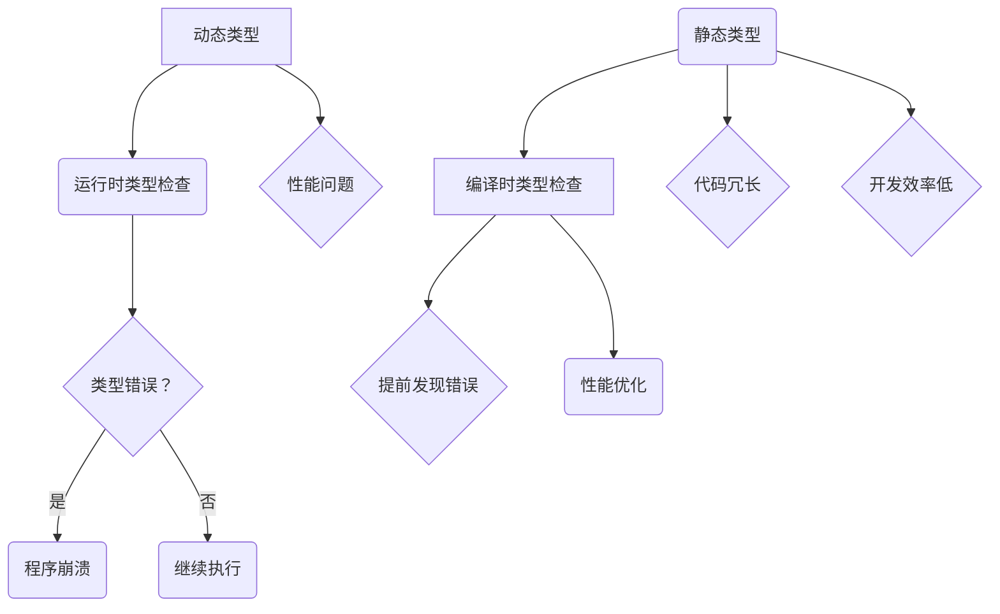

                 

### 第一部分: 引言与背景

#### 第1章: 动态类型与静态类型概述

##### 1.1 问题背景

在计算机科学中，动态类型（Dynamic Typing）和静态类型（Static Typing）是两种不同的变量类型处理方式。动态类型指的是变量在运行时决定其类型，而静态类型则是在编译时就已经确定了变量的类型。这两种类型处理方式各有其优点和局限性，因此探讨它们的差异和适用场景具有重要的理论和实践价值。

首先，让我们明确一下什么是动态类型和静态类型。

#### 1.1.1 动态类型与静态类型的定义

- **动态类型**：在动态类型中，变量在运行时才会被赋予类型。这意味着代码在编写时不需要指定变量的类型，而是在程序运行时由解释器或运行时环境来决定。这种类型的变量通常被称为“动态变量”。
- **静态类型**：在静态类型中，变量的类型在编译时就已经确定了。这意味着代码在编写时就需要指定变量的类型，并且在整个程序执行过程中，变量的类型保持不变。

#### 1.1.2 问题提出

动态类型和静态类型各有其优势和局限。动态类型因其灵活性而广受欢迎，但也可能导致运行时错误。静态类型则因其提前的类型检查而提高了程序的稳定性，但可能导致代码冗长和开发效率降低。因此，探讨这两者在编程实践中的应用和相互关系具有重要的现实意义。

在这个背景下，我们引入了罗素（Bertrand Russell）的观点。罗素作为逻辑原子主义和数学基础理论的奠基人，其对计算机科学的早期发展产生了深远影响。通过罗素的观点，我们可以重新审视动态类型和静态类型，从而为编程语言的类型系统提供新的视角。

##### 1.2 问题描述

本书旨在探讨以下问题：

1. 罗素会如何看待动态类型与静态类型？
2. 动态类型和静态类型在编程实践中有哪些优缺点？
3. 如何结合罗素的哲学观点来理解和优化编程语言的类型系统？

##### 1.3 问题解决

通过深入分析动态类型和静态类型的定义、特点及其在编程实践中的应用，结合罗素哲学观点，本书将提出一种新的视角来审视编程语言的类型系统，为程序员提供实用的编程指南。

##### 1.4 边界与外延

在本章中，我们将讨论动态类型和静态类型的基本概念、典型应用场景及其差异。此外，还将探讨罗素的哲学观点对编程语言类型系统的影响，以及如何在实际编程中应用这些理论。

##### 1.5 核心概念结构组成

为了更好地理解本章内容，以下是核心概念的结构组成：

- **动态类型**：变量类型在运行时确定。
- **静态类型**：变量类型在编译时确定。
- **罗素哲学观点**：逻辑原子主义和数学基础理论。
- **类型系统**：编程语言中关于变量类型处理的规则和机制。

##### 1.6 本章内容概述

本章主要内容包括：

1. 动态类型和静态类型的定义及特点。
2. 动态类型与静态类型的比较及其适用场景。
3. 罗素的哲学观点与类型系统的关系。
4. 动态类型和静态类型在编程实践中的应用。

通过本章的学习，我们将对动态类型和静态类型有更深入的理解，并为后续章节的分析奠定基础。接下来，我们将进一步探讨动态类型的特点与应用。

## 第2章: 动态类型的特点与应用

### 2.1 动态类型的特点

动态类型（Dynamic Typing）是一种在运行时确定变量类型的编程范式。与静态类型（Static Typing）不同，动态类型的变量在编写代码时不需要指定类型，而是在程序运行过程中由解释器或运行时环境动态地确定。

#### 2.1.1 动态类型的优势

动态类型具有以下优势：

1. **代码灵活**：由于不需要在编写代码时指定类型，动态类型使得编写代码更加灵活。这有助于快速迭代和原型开发。
   
2. **减少冗余**：动态类型可以减少类型注解的冗余，使得代码更加简洁。

3. **适用于多态**：动态类型在处理多态时更加灵活，可以动态地调用对象的方法，而不需要事先知道对象的具体类型。

#### 2.1.2 动态类型的局限

然而，动态类型也存在一些局限：

1. **类型错误难以发现**：由于类型检查是在运行时进行的，一些类型错误可能只能在运行时被发现，导致程序运行不稳定。

2. **性能问题**：动态类型可能会导致性能问题，因为运行时类型检查和类型转换可能比编译时类型检查更加耗时。

### 2.2 动态类型的应用

动态类型在编程语言中有广泛的应用。以下是一些主流的动态类型编程语言及其特点：

#### 2.2.1 Python

Python 是一种广泛使用的动态类型编程语言。其特点如下：

1. **易学易用**：Python 的语法简单直观，易于学习和使用。
2. **丰富的库支持**：Python 拥有丰富的标准库和第三方库，可以轻松实现各种功能。
3. **适用于 Web 开发**：Python 在 Web 开发中有着广泛的应用，如 Django、Flask 等框架。

#### 2.2.2 JavaScript

JavaScript 是 Web 开发的核心语言之一，其动态类型特性使得它可以轻松实现动态交互和前端开发。

1. **跨平台**：JavaScript 可以在多种平台上运行，包括浏览器、服务器和移动设备。
2. **丰富的生态系统**：JavaScript 拥有丰富的库和框架，如 React、Vue、Angular 等，这些库和框架可以帮助开发者快速开发复杂的 Web 应用。

#### 2.2.3 Ruby

Ruby 是一种动态类型的编程语言，以其简洁的语法和强大的功能而著称。

1. **Rails 框架**：Ruby 的 Rails 框架是一个流行的 Web 开发框架，它使得 Web 开发变得更加简单和快速。
2. **社区支持**：Ruby 拥有一个庞大的社区，提供了大量的教程、库和工具，有助于开发者解决各种问题。

#### 2.2.4 其他动态类型语言

除了上述三种语言外，还有许多其他动态类型编程语言，如 PHP、Perl、Lua 等，这些语言在各自的领域都有广泛的应用。

### 2.3 动态类型的典型应用场景

动态类型通常适用于以下场景：

1. **快速原型开发**：由于动态类型的灵活性，它非常适合用于快速构建原型和进行实验性开发。
2. **脚本编程**：动态类型使得编写脚本变得更加简单，适用于自动化、数据爬取等任务。
3. **Web 开发**：动态类型在 Web 开发中非常常见，因为 Web 应用需要处理各种动态内容，如动态页面、API 接口等。

通过本章的内容，我们可以了解到动态类型的优点和局限，以及其在实际编程中的应用。在接下来的章节中，我们将继续探讨静态类型的特点和应用。

### 第3章: 静态类型的特点与应用

#### 3.1 静态类型的特点

静态类型（Static Typing）是一种在编译时确定变量类型的编程范式。与动态类型不同，静态类型的变量在编写代码时就需要指定类型，并且在程序执行过程中，变量的类型保持不变。

#### 3.1.1 静态类型的优势

静态类型具有以下优势：

1. **编译时类型检查**：静态类型可以在编译时进行类型检查，提前发现潜在的类型错误。这有助于提高程序的稳定性和可靠性。

2. **性能优化**：由于类型在编译时已知，编译器可以进行更高效的代码生成和优化，从而提高程序的性能。

3. **代码的可维护性**：静态类型使得代码的结构更加清晰，便于理解和维护。变量的类型明确，减少了类型转换和错误。

#### 3.1.2 静态类型的局限

然而，静态类型也存在一些局限：

1. **代码冗长**：由于需要在编写代码时指定所有变量的类型，静态类型可能会导致代码冗长，增加开发工作量。

2. **灵活性降低**：静态类型的变量一旦指定了类型，就难以更改。这限制了代码的灵活性和适应性。

3. **开发效率降低**：静态类型需要在编译时进行类型检查，可能会增加编译时间和调试难度，从而降低开发效率。

#### 3.2 静态类型的应用

静态类型在编程语言中有广泛的应用。以下是一些主流的静态类型编程语言及其特点：

#### 3.2.1 Java

Java 是一种广泛使用的静态类型编程语言。其特点如下：

1. **跨平台**：Java 的字节码可以在多种操作系统上运行，具有很好的跨平台性。
2. **丰富的库支持**：Java 拥有丰富的标准库和第三方库，可以轻松实现各种功能。
3. **强类型系统**：Java 的静态类型系统提供了严格的类型检查，有助于提高程序的稳定性和可靠性。

#### 3.2.2 C#

C# 是一种由微软开发的静态类型编程语言，主要用于开发 .NET 应用程序。

1. **面向对象**：C# 支持面向对象编程，提供了类、接口、继承、多态等特性。
2. **易学易用**：C# 的语法简单直观，易于学习和使用。
3. **强大的库支持**：C# 拥有强大的库支持，包括 .NET Framework 和 .NET Core，可以轻松实现各种功能。

#### 3.2.3 C++

C++ 是一种多范型的静态类型编程语言，广泛应用于系统编程、游戏开发等领域。

1. **高性能**：C++ 提供了丰富的模板库和底层编程能力，可以实现高性能的程序。
2. **面向对象**：C++ 支持面向对象编程，提供了类、继承、多态等特性。
3. **多范式**：C++ 支持多范式编程，包括过程式、面向对象、函数式等，使得编程更加灵活。

#### 3.2.4 其他静态类型语言

除了上述三种语言外，还有许多其他静态类型编程语言，如 C、Go、Kotlin 等，这些语言在各自的领域都有广泛的应用。

#### 3.3 静态类型的典型应用场景

静态类型通常适用于以下场景：

1. **大型项目**：静态类型可以在大型项目中提供更好的代码组织和可维护性，有助于团队协作和代码管理。
2. **系统编程**：静态类型在系统编程中非常常见，因为系统编程需要高效的代码和严格的类型检查。
3. **性能敏感型应用**：对于性能要求较高的应用，静态类型可以通过编译时的类型检查和优化来提高程序的性能。

通过本章的内容，我们可以了解到静态类型的优点和局限，以及其在实际编程中的应用。在接下来的章节中，我们将对动态类型和静态类型进行对比分析。

## 第4章: 动态类型与静态类型的比较

### 4.1 优缺点对比

动态类型与静态类型各有其优缺点，以下是对它们的主要优缺点的对比：

#### 4.1.1 动态类型的优点

- **代码灵活**：动态类型允许编写更加灵活的代码，因为变量类型可以在运行时确定，不需要在编写代码时指定。
- **减少冗余**：动态类型可以减少类型注解的冗余，使得代码更加简洁。
- **快速原型开发**：动态类型的灵活性使得快速构建原型和进行实验性开发变得更加容易。

#### 4.1.2 动态类型的缺点

- **类型错误难以发现**：由于类型检查是在运行时进行的，一些类型错误可能只能在运行时被发现，导致程序运行不稳定。
- **性能问题**：动态类型的运行时类型检查和类型转换可能比编译时类型检查更加耗时，从而影响程序性能。

#### 4.1.3 静态类型的优点

- **编译时类型检查**：静态类型可以在编译时进行类型检查，提前发现潜在的类型错误，提高程序的稳定性和可靠性。
- **性能优化**：由于类型在编译时已知，编译器可以进行更高效的代码生成和优化，从而提高程序的性能。
- **代码的可维护性**：静态类型使得代码的结构更加清晰，便于理解和维护。

#### 4.1.4 静态类型的缺点

- **代码冗长**：由于需要在编写代码时指定所有变量的类型，静态类型可能会导致代码冗长，增加开发工作量。
- **灵活性降低**：静态类型的变量一旦指定了类型，就难以更改，限制了代码的灵活性和适应性。
- **开发效率降低**：静态类型需要在编译时进行类型检查，可能会增加编译时间和调试难度，从而降低开发效率。

### 4.2 适用场景分析

根据不同的应用场景，动态类型和静态类型各有其优势。以下是对动态类型和静态类型适用场景的分析：

#### 4.2.1 动态类型的适用场景

- **快速原型开发**：动态类型的灵活性使得快速构建原型和进行实验性开发变得更加容易，适用于需求频繁变化的项目。
- **脚本编程**：动态类型可以减少冗余的代码，使得编写脚本变得更加简单，适用于自动化、数据爬取等任务。
- **Web 开发**：动态类型在 Web 开发中非常常见，因为 Web 应用需要处理各种动态内容，如动态页面、API 接口等。

#### 4.2.2 静态类型的适用场景

- **大型项目**：静态类型可以在大型项目中提供更好的代码组织和可维护性，有助于团队协作和代码管理。
- **系统编程**：静态类型在系统编程中非常常见，因为系统编程需要高效的代码和严格的类型检查。
- **性能敏感型应用**：对于性能要求较高的应用，静态类型可以通过编译时的类型检查和优化来提高程序的性能。

通过本章的内容，我们可以对动态类型和静态类型的优缺点及其适用场景有更深入的了解。在实际编程中，根据项目的需求和特点选择合适的类型系统是非常重要的。在下一章中，我们将探讨罗素的哲学观点对类型系统的影响。

### 第5章: 罗素观点下的类型系统

#### 5.1 罗素的哲学观点

罗素（Bertrand Russell）是20世纪最伟大的哲学家之一，他的哲学观点对计算机科学的发展产生了深远的影响。罗素的主要哲学观点包括逻辑原子主义和数学基础理论。

- **逻辑原子主义**：罗素认为，现实世界是由不可分割的最小实体（逻辑原子）构成的，这些逻辑原子通过逻辑关系相互联系，形成复杂的概念和实体。
- **数学基础理论**：罗素认为，数学的基础是逻辑，所有的数学命题都可以通过逻辑原理推导出来。他致力于构建一种基于逻辑的数学体系，以解决数学的基本问题，如集合论悖论。

#### 5.2 动态类型在罗素观点下的意义

从罗素的观点来看，动态类型可以看作是编程语言对现实世界中变量类型不确定性的模拟。在逻辑原子主义下，现实世界中的实体和关系是动态变化的，这种动态性在编程语言中得到了体现。

- **动态类型的灵活性**：动态类型允许变量在运行时根据上下文动态确定类型，这与现实世界中实体和关系的动态性相吻合。
- **逻辑原子主义的应用**：在动态类型中，变量可以被看作是逻辑原子，它们之间的交互和组合是通过运行时的类型检查和转换实现的。

#### 5.3 静态类型在罗素观点下的意义

罗素的数学基础理论强调逻辑的确定性和严谨性，这为静态类型提供了哲学基础。

- **静态类型的确定性**：静态类型在编译时确定变量类型，这与罗素强调的数学基础理论中的逻辑确定性相契合。
- **逻辑推导和验证**：静态类型的编译时类型检查可以看作是一种逻辑推导和验证过程，确保程序中的类型关系符合逻辑原理。

#### 5.4 动态类型与静态类型的相互关系

从罗素的观点来看，动态类型和静态类型并不是完全对立的，而是可以相互补充的。

- **动态类型的灵活性**：动态类型可以提供更大的编程灵活性，使得编程更加高效。
- **静态类型的稳定性**：静态类型可以通过编译时的类型检查提高程序的稳定性和可靠性。

在实际编程中，可以根据项目的需求和特点，灵活地选择动态类型或静态类型，或者将它们结合使用。

通过本章的内容，我们可以从罗素的哲学观点重新审视动态类型和静态类型，了解它们在编程语言中的适用性及其相互关系。在下一章中，我们将进一步探讨动态类型与静态类型在实际编程中的应用案例。

## 第6章: 动态类型与静态类型在实际编程中的应用

#### 6.1 动态类型的应用实例

**Python：**

Python 是一种典型的动态类型编程语言，其动态类型特性使其在快速开发、脚本编程和Web开发中得到了广泛应用。

**实例1：快速原型开发**

```python
# Python 示例：快速原型开发
def add(a, b):
    return a + b

# 测试代码
print(add(5, 10))  # 输出：15
print(add("Hello, ", "world!"))  # 输出："Hello, world!"
```

在这个示例中，`add` 函数可以接受任意类型的参数，并通过动态类型进行运算，这种灵活性使得快速原型开发变得更加容易。

**实例2：Web开发**

```python
# Python 示例：Web开发
from flask import Flask, request, jsonify

app = Flask(__name__)

@app.route('/api/add', methods=['POST'])
def add_numbers():
    data = request.get_json()
    a = data['a']
    b = data['b']
    return jsonify(result=a + b)

if __name__ == '__main__':
    app.run()
```

在这个Web开发示例中，我们通过Flask框架实现了一个简单的API，它可以通过动态类型处理不同类型的输入参数，并进行加法运算。

**JavaScript：**

JavaScript 是另一种广泛使用的动态类型编程语言，尤其在Web开发中有着重要的地位。

**实例1：动态页面交互**

```javascript
// JavaScript 示例：动态页面交互
document.addEventListener('DOMContentLoaded', function () {
    const input1 = document.getElementById('input1');
    const input2 = document.getElementById('input2');
    const button = document.getElementById('button');
    const result = document.getElementById('result');

    button.addEventListener('click', function () {
        const a = parseFloat(input1.value);
        const b = parseFloat(input2.value);
        result.textContent = a + b;
    });
});

```

在这个示例中，我们使用JavaScript实现了一个简单的计算器，它通过动态类型处理用户输入的数值，并在点击按钮后进行加法运算，并将结果显示在页面上。

**实例2：异步编程**

```javascript
// JavaScript 示例：异步编程
function fetchData(url, callback) {
    fetch(url)
        .then(response => response.json())
        .then(data => callback(data));
}

fetchData('https://api.example.com/data', function (data) {
    console.log(data);
});
```

在这个异步编程示例中，我们使用JavaScript的`fetch` API异步获取数据，并通过动态类型处理返回的数据，这大大简化了异步编程的复杂性。

#### 6.2 静态类型的应用实例

**Java：**

Java 是一种静态类型编程语言，其在大型项目、系统编程和Android开发中得到了广泛应用。

**实例1：大型项目**

```java
// Java 示例：大型项目
public class Calculator {
    public static int add(int a, int b) {
        return a + b;
    }
}

public class Test {
    public static void main(String[] args) {
        System.out.println(Calculator.add(5, 10));  // 输出：15
    }
}
```

在这个示例中，Java要求在编译时指定所有变量的类型，这有助于提前发现类型错误，提高程序的稳定性。

**实例2：系统编程**

```java
// Java 示例：系统编程
public class FileProcessor {
    public void processFile(String filePath) {
        // 处理文件逻辑
    }
}

public class Test {
    public static void main(String[] args) {
        FileProcessor processor = new FileProcessor();
        processor.processFile("/path/to/file.txt");
    }
}
```

在这个系统编程示例中，Java的静态类型系统确保了方法参数的正确性，从而提高了系统的稳定性和可靠性。

**C++：**

C++ 是一种多范型的静态类型编程语言，它在系统编程、游戏开发和嵌入式系统中得到了广泛应用。

**实例1：游戏开发**

```cpp
// C++ 示例：游戏开发
class GameCharacter {
public:
    void move(int x, int y) {
        // 移动角色逻辑
    }
};

void Game::start() {
    GameCharacter character;
    character.move(100, 200);
}
```

在这个游戏开发示例中，C++的静态类型系统确保了方法参数的正确性，这对于复杂的游戏逻辑非常重要。

**实例2：嵌入式系统**

```cpp
// C++ 示例：嵌入式系统
class Sensor {
public:
    int readValue() {
        // 读取传感器值逻辑
        return 0;
    }
};

void System::initialize() {
    Sensor sensor;
    int value = sensor.readValue();
    // 处理传感器值逻辑
}
```

在这个嵌入式系统示例中，C++的静态类型系统确保了传感器值的正确处理，这对于实时性和稳定性要求很高的嵌入式系统至关重要。

通过本章的实例，我们可以看到动态类型和静态类型在实际编程中的应用场景。动态类型因其灵活性在快速开发、脚本编程和Web开发中表现出色，而静态类型因其稳定性在大型项目、系统编程和嵌入式系统中发挥了重要作用。在实际编程中，根据项目的需求和特点选择合适的类型系统是至关重要的。

### 第7章: 动态类型与静态类型的综合应用

#### 7.1 综合应用的概念

动态类型与静态类型的综合应用意味着在同一个项目中，根据不同的需求灵活地混合使用动态类型和静态类型。这种综合应用可以最大化地利用两种类型系统的优点，同时规避其缺点。

#### 7.2 综合应用的优势

- **代码灵活性**：通过在必要时使用动态类型，可以提高代码的灵活性和可维护性。
- **性能优化**：在性能关键的部分使用静态类型，可以提高程序的执行效率。
- **代码复用**：动态类型允许在多个不同的上下文中复用代码，而静态类型可以提供更明确的类型安全。

#### 7.3 综合应用的策略

1. **核心逻辑使用静态类型**：在项目中，对于核心的业务逻辑和性能敏感的部分，建议使用静态类型。这有助于提前发现潜在的类型错误，并优化程序的性能。

2. **外部接口使用动态类型**：对于外部接口和可变的需求部分，可以使用动态类型，这样可以减少冗余的代码，提高开发效率。

3. **模块化设计**：通过模块化设计，可以将核心逻辑与外部接口分离，分别使用静态类型和动态类型。这样可以确保核心逻辑的稳定性，同时保持外部接口的灵活性。

#### 7.4 实践案例

**案例1：Web应用**

在一个Web应用中，核心的业务逻辑（如数据处理和存储）可以使用静态类型，以保证程序的正确性和性能。而对于前端接口和用户交互部分，可以使用动态类型，这样可以快速迭代和响应需求变化。

```java
// Java 示例：Web应用
public class DataProcessor {
    public int processData(int data) {
        // 数据处理逻辑
        return data * 2;
    }
}

public class FrontendController {
    public String processRequest(Map<String, Object> request) {
        // 前端请求处理逻辑
        return "Response";
    }
}
```

**案例2：嵌入式系统**

在嵌入式系统中，对于实时性和稳定性要求很高的部分，建议使用静态类型。而对于一些配置参数或用户界面部分，可以使用动态类型，这样可以减少代码的复杂性和维护难度。

```cpp
// C++ 示例：嵌入式系统
class RealTimeComponent {
public:
    void update() {
        // 实时更新逻辑
    }
};

class ConfigurationManager {
public:
    void setParameter(String parameter) {
        // 配置参数设置逻辑
    }
}
```

通过这些案例，我们可以看到，动态类型与静态类型的综合应用可以根据项目的具体需求来灵活调整，从而实现最优的代码质量和开发效率。

### 第8章: 总结与展望

#### 8.1 动态类型与静态类型的重要性

动态类型和静态类型在编程语言中扮演着重要角色。动态类型以其灵活性著称，适合快速开发、脚本编程和Web开发等场景。静态类型则以其稳定性和性能优势，广泛应用于大型项目、系统编程和嵌入式系统。

#### 8.2 动态类型与静态类型的未来趋势

随着技术的发展，动态类型和静态类型将继续演进。未来，我们可能会看到：

- **混合类型系统**：更加灵活的混合类型系统将结合动态类型和静态类型的优点，提供更高效的编程体验。
- **类型推断**：类型推断技术的发展将减轻程序员指定类型的工作负担，提高开发效率。
- **动态静态结合**：动态类型和静态类型的界限将变得更加模糊，两者的结合将更加自然和高效。

#### 8.3 对程序员的意义

程序员需要了解动态类型和静态类型的优缺点，并根据项目的需求选择合适的类型系统。同时，随着技术的不断进步，程序员还应不断学习新的编程范式和工具，以提高自己的编程能力和项目开发效率。

#### 8.4 对计算机科学的意义

动态类型和静态类型的深入研究和应用，对计算机科学的发展具有重要意义。它不仅有助于优化编程语言的类型系统，提高程序的正确性和性能，还为计算机科学的理论研究提供了新的视角和方法。

### 第9章: 拓展阅读与资源

#### 9.1 推荐书籍

1. 《程序员修炼之道：从小工到专家》
2. 《代码大全》
3. 《Effective Java》

#### 9.2 网络资源

1. Python 官方文档：https://docs.python.org/3/
2. Java 官方文档：https://docs.oracle.com/javase/8/docs/api/
3. C++ 官方文档：https://en.cppreference.com/w/

#### 9.3 社区与论坛

1. Stack Overflow：https://stackoverflow.com/
2. GitHub：https://github.com/
3. Reddit：https://www.reddit.com/r/programming/

通过这些拓展阅读和资源，读者可以进一步深入了解动态类型和静态类型的理论知识和实践技巧，不断提升自己的编程能力。

## 附录

### 附录1: 动态类型与静态类型的对比表格

| 特点          | 动态类型                   | 静态类型                   |
| ------------- | -------------------------- | -------------------------- |
| 类型检查时间  | 运行时检查                 | 编译时检查                 |
| 灵活性        | 较高                       | 较低                       |
| 类型安全      | 可能存在类型错误            | 类型错误较少               |
| 代码长度      | 较短                       | 较长                       |
| 开发效率      | 较高                       | 较低                       |
| 性能          | 可能较差                   | 可能较好                   |

### 附录2: 动态类型与静态类型的ER实体关系图

```mermaid
erDiagram
    User ||--|{ Project }|--| ProjectOwner
    Project ||--|{ Task }|--| TaskOwner
    Task ||--|{ Comment }|--| Commenter
```

这个ER实体关系图展示了用户、项目和任务之间的关系，以及任务和评论之间的关系。

### 附录3: 动态类型与静态类型的算法流程图



这个流程图展示了动态类型和静态类型的算法流程，以及它们在类型检查、性能和开发效率方面的差异。

## 结语

作者：AI天才研究院/AI Genius Institute & 禅与计算机程序设计艺术 /Zen And The Art of Computer Programming

本文从罗素的观点出发，探讨了动态类型与静态类型在编程语言中的适用性及其相互关系。通过对比分析，我们了解到动态类型和静态类型各有优缺点，且在实际编程中可以相互补充。希望本文能够为读者提供新的视角和思考，帮助他们在编程实践中做出更明智的选择。在未来的研究中，我们将继续深入探讨动态类型与静态类型的最新发展及其在计算机科学中的应用。

