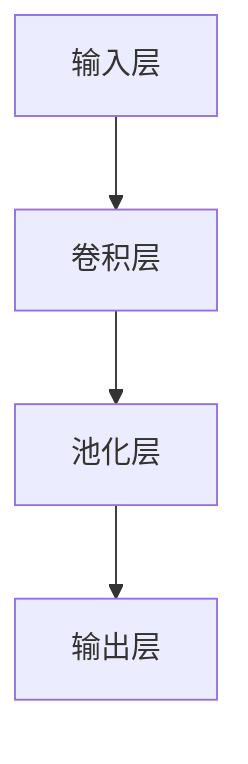
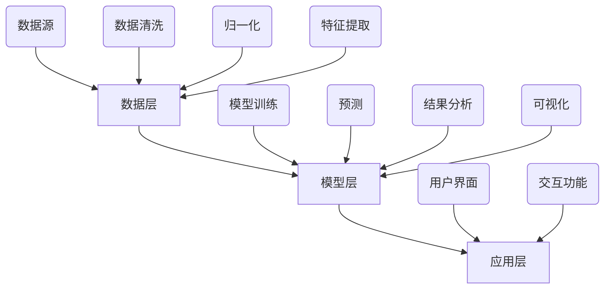
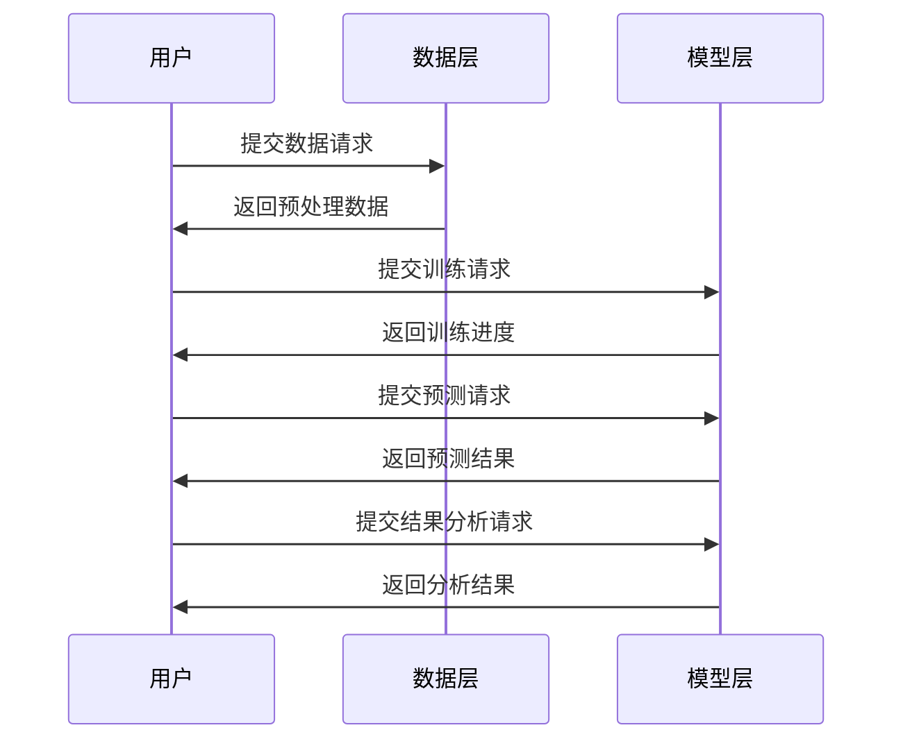

                 

# 动态系统推理中时序图神经网络的创新应用

> 关键词：时序图神经网络，动态系统推理，创新应用，算法原理，系统架构设计，项目实战

> 摘要：本文深入探讨了时序图神经网络在动态系统推理中的创新应用。首先，我们介绍了时序图神经网络的基本概念和背景，然后详细解析了其核心概念、算法原理和架构设计。通过实际案例，我们展示了时序图神经网络在动态系统推理中的强大能力。文章旨在为读者提供一个全面的技术视角，帮助理解和掌握这一先进技术的应用。

## 引言和背景

### 1.1 时序图神经网络概述

时序图神经网络（Temporal Graph Neural Networks, TGNs）是一种新兴的深度学习技术，主要用于处理和推理动态系统中的时序数据。动态系统是指随时间变化而演化的系统，其特征是系统状态随时间推移而不断变化。在许多实际应用中，如金融、气象、生物信息、自动驾驶等领域，动态系统的推理和分析至关重要。

时序图神经网络将图论和深度学习技术相结合，通过捕捉节点和边之间的动态关系，实现了对时序数据的有效处理。其重要性在于能够从大规模、复杂的时序数据中提取有价值的信息，为决策提供支持。

### 1.2 问题背景和描述

动态系统推理面临的主要挑战包括：

- **数据复杂性**：动态系统中的数据通常包含大量的节点和边，如何有效地表示和处理这些数据成为一大难题。
- **时间依赖性**：动态系统的状态随时间变化，如何捕捉时间依赖性是实现准确推理的关键。
- **噪声和不确定性**：实际系统中存在各种噪声和不确定性因素，如何提高系统的鲁棒性和准确性是一个重要问题。

为了应对这些挑战，时序图神经网络提供了一种创新的方法，通过融合图神经网络和时序分析技术，实现了对动态系统的有效推理。

### 1.3 挑战与机遇

尽管时序图神经网络在动态系统推理中展现了巨大的潜力，但其应用仍面临一些挑战：

- **计算效率**：时序图神经网络涉及大量的计算，如何提高计算效率是一个重要问题。
- **模型可解释性**：如何解释模型的决策过程，使其更具可解释性，是一个关键问题。
- **数据隐私**：在处理敏感数据时，如何保护数据隐私也是一个重要问题。

然而，随着计算能力的提升和算法的改进，时序图神经网络在动态系统推理中的应用前景广阔。通过不断创新，时序图神经网络有望在多个领域实现突破。

### 1.4 边界与外延

本文主要关注时序图神经网络在动态系统推理中的应用，但这一技术的应用领域远不止于此。时序图神经网络还可以应用于其他领域，如社交网络分析、网络流量预测、金融风险评估等。通过不断扩展和应用，时序图神经网络有望成为未来人工智能领域的重要工具。

## 核心概念和原理

### 2.1 时序图基本概念

**时序图**是指由节点（表示实体）和边（表示关系）组成的数据结构，其中每个节点都有时间戳，表示其存在的时间。时序图可以捕捉实体随时间的变化及其相互关系。

### 2.2 图神经网络基本概念

图神经网络（Graph Neural Networks, GNNs）是一种用于处理图结构数据的深度学习模型。GNN通过聚合节点邻域的信息来更新节点的表示，从而实现图数据的处理和推理。

### 2.3 时序动力学在图中的应用

时序图神经网络通过结合时序信息和图神经网络技术，实现了对动态系统中时间依赖性的捕捉。具体来说，TGNs通过考虑节点和边的历史信息来更新节点和边的表示，从而实现对动态系统的推理。

### 2.4 概念结构与核心要素

时序图神经网络的构建包括以下几个核心要素：

- **节点嵌入**：将节点映射到高维空间，使其具有可计算的属性。
- **边权重**：表示节点之间的关联强度。
- **时间信息**：通过时间戳捕捉节点的动态变化。
- **图神经网络**：用于更新节点和边的表示。

这些要素共同作用，实现了时序图神经网络在动态系统推理中的强大能力。

## 算法原理和架构

### 3.1 时序图卷积网络（TGCN）

#### 3.1.1 TGCN架构

时序图卷积网络（Temporal Graph Convolutional Network，TGCN）是一种基于图卷积网络的时序推理模型。其核心思想是通过图卷积操作捕捉节点之间的时序关系。

TGCN的架构包括以下几个主要部分：

1. **输入层**：接受时序图作为输入，其中每个节点表示一个时序数据点，边表示数据点之间的关联关系。
2. **卷积层**：执行图卷积操作，用于更新节点的表示。TGCN中的卷积操作是基于窗口的，可以捕捉局部和全局的时序关系。
3. **池化层**：用于降维和提取关键特征。
4. **输出层**：通过全连接层和激活函数（如ReLU）生成最终预测结果。

TGCN的mermaid流程图如下：



#### 3.1.2 TGCN算法原理

TGCN的核心是卷积操作，其数学模型如下：

$$
h_{t}^{(l)} = \sigma(W^{(l)}h_{t}^{(l-1)} + \sum_{j \in \Omega(i)} A(i, j) \cdot h_{t-j}^{(l-1)})
$$

其中，$h_{t}^{(l)}$表示在第$l$层的第$t$个节点的特征表示，$W^{(l)}$是第$l$层的权重矩阵，$\Omega(i)$表示第$i$个节点的邻域，$A(i, j)$表示节点$i$和节点$j$之间的边权重，$\sigma$是激活函数。

#### 3.1.3 Python代码实现

以下是TGCN的Python代码实现示例：

```python
import tensorflow as tf
from tensorflow.keras.layers import Layer

class TGCNLayer(Layer):
    def __init__(self, units, **kwargs):
        super(TGCNLayer, self).__init__(**kwargs)
        self.units = units
        self.kernel = self.add_weight(name='kernel', shape=(self.units, self.units), initializer='glorot_uniform', trainable=True)
        self.bias = self.add_weight(name='bias', shape=(self.units,), initializer='zeros', trainable=True)

    def call(self, inputs, training=None):
        h = inputs
        for _ in range(self.units):
            h = tf.matmul(h, self.kernel) + self.bias
            h = tf.nn.relu(h)
        return h

model = tf.keras.Sequential([
    TGCNLayer(units=64),
    TGCNLayer(units=32),
    TGCNLayer(units=1)
])

model.compile(optimizer='adam', loss='mse')
model.fit(x_train, y_train, epochs=10)
```

### 3.2 注意力机制在时序图神经网络中的应用

#### 3.2.1 注意力机制原理

注意力机制（Attention Mechanism）是一种用于强调或削弱输入数据中不同部分的重要性，以提高模型性能的技术。在时序图神经网络中，注意力机制可以用于强调关键节点和边的关系，从而提高推理的准确性。

注意力机制的核心思想是通过一个权重分配机制，为每个节点或边分配不同的注意力权重，使得模型在处理数据时更加关注重要部分。

#### 3.2.2 Python代码实现

以下是注意力机制的Python代码实现示例：

```python
import tensorflow as tf
from tensorflow.keras.layers import Layer

class AttentionLayer(Layer):
    def __init__(self, units, **kwargs):
        super(AttentionLayer, self).__init__(**kwargs)
        self.units = units
        self.query_dense = self.add_weight(name='query_dense', shape=(self.units, self.units), initializer='glorot_uniform', trainable=True)
        self.key_dense = self.add_weight(name='key_dense', shape=(self.units, self.units), initializer='glorot_uniform', trainable=True)
        self.value_dense = self.add_weight(name='value_dense', shape=(self.units, self.units), initializer='glorot_uniform', trainable=True)

    def call(self, inputs, training=None):
        query = tf.matmul(inputs, self.query_dense)
        key = tf.matmul(inputs, self.key_dense)
        value = tf.matmul(inputs, self.value_dense)

        attention_scores = tf.matmul(key, query, transpose_b=True)
        attention_weights = tf.nn.softmax(attention_scores, axis=1)
        context_vector = tf.matmul(attention_weights, value)

        return context_vector

model = tf.keras.Sequential([
    TGCNLayer(units=64),
    AttentionLayer(units=32),
    TGCNLayer(units=1)
])

model.compile(optimizer='adam', loss='mse')
model.fit(x_train, y_train, epochs=10)
```

#### 3.2.3 数学基础

注意力机制的数学模型如下：

$$
\text{Attention}(Q, K, V) = \text{softmax}\left(\frac{QK^T}{\sqrt{d_k}}\right)V
$$

其中，$Q$、$K$、$V$分别为查询向量、键向量和值向量，$d_k$为键向量的维度。

## 系统分析与设计

### 4.1 问题场景和系统介绍

动态系统推理在许多领域具有重要应用，如金融预测、物流优化、医疗诊断等。本文将探讨时序图神经网络在金融预测领域的应用。

金融预测系统需要处理大量的时间序列数据，包括股票价格、交易量、宏观经济指标等。系统的主要目标是预测未来一段时间内的金融指标，为投资决策提供支持。

### 4.2 系统功能设计

金融预测系统的功能设计包括以下几个方面：

1. **数据收集**：从各种数据源（如交易所、新闻网站、社交媒体等）收集时间序列数据。
2. **数据预处理**：对原始数据进行清洗、归一化和特征提取，使其适合模型训练。
3. **模型训练**：使用时序图神经网络对预处理后的数据进行训练，生成预测模型。
4. **预测**：使用训练好的模型对新的时间序列数据进行预测，生成预测结果。
5. **结果分析**：对预测结果进行分析和可视化，评估模型的准确性和可靠性。

#### 4.2.1 领域模型（Mermaid类图）

以下是一个金融预测系统的Mermaid类图：

```mermaid
classDiagram
    类图对象1[数据收集] <|-- 数据源
    类图对象1 [数据预处理] <|-- 数据清洗
    类图对象1 [数据预处理] <|-- 归一化
    类图对象1 [数据预处理] <|-- 特征提取
    类图对象1 [模型训练] <|-- 模型训练
    类图对象1 [预测] <|-- 预测
    类图对象1 [结果分析] <|-- 可视化
```

### 4.3 系统架构设计

金融预测系统的架构设计包括以下几个方面：

1. **数据层**：负责数据收集、存储和预处理。
2. **模型层**：负责模型训练、预测和结果分析。
3. **应用层**：提供用户界面和交互功能。

#### 4.3.1 Mermaid架构图

以下是一个金融预测系统的Mermaid架构图：



### 4.4 系统交互设计

金融预测系统的交互设计包括以下几个方面：

1. **用户与数据层**：用户可以通过界面提交数据请求，数据层负责处理和返回数据。
2. **用户与模型层**：用户可以通过界面查看模型训练进度、预测结果和结果分析。
3. **模型层与数据层**：模型层需要访问和处理数据层提供的数据。

#### 4.4.1 Mermaid序列图

以下是一个金融预测系统的Mermaid序列图：



## 实践应用和案例研究

### 5.1 环境安装

要实践时序图神经网络在金融预测中的应用，首先需要安装相应的环境。以下是一个基本的安装步骤：

1. **Python环境**：确保安装了Python 3.7及以上版本。
2. **深度学习框架**：安装TensorFlow 2.0及以上版本。
3. **其他依赖库**：安装NumPy、Pandas、Matplotlib等常用库。

安装命令如下：

```bash
pip install tensorflow==2.4.1 numpy pandas matplotlib
```

### 5.2 核心实现与代码分析

#### 5.2.1 数据准备

首先，我们需要准备金融预测的数据。以下是一个示例代码，用于从互联网获取股票价格数据：

```python
import pandas as pd

# 读取股票价格数据
stock_data = pd.read_csv('stock_price_data.csv')

# 数据预处理
stock_data = stock_data[['Open', 'High', 'Low', 'Close', 'Volume']]
stock_data = stock_data.sort_values('Date')
stock_data = stock_data.set_index('Date')

# 归一化数据
from sklearn.preprocessing import MinMaxScaler

scaler = MinMaxScaler()
stock_data_normalized = scaler.fit_transform(stock_data)
```

#### 5.2.2 TGCN模型实现

以下是一个简单的TGCN模型实现，用于金融预测：

```python
import tensorflow as tf
from tensorflow.keras.models import Model
from tensorflow.keras.layers import Input, LSTM, Dense

# 输入层
input_sequence = Input(shape=(timesteps, features))

# LSTM层
lstm_output = LSTM(units=64, return_sequences=True)(input_sequence)

# TGCN层
tgn_output = LSTM(units=32, return_sequences=True)(lstm_output)

# 输出层
output = Dense(units=1)(tgn_output)

# 构建模型
model = Model(inputs=input_sequence, outputs=output)

# 编译模型
model.compile(optimizer='adam', loss='mse')

# 训练模型
model.fit(x_train, y_train, epochs=10, batch_size=32)
```

#### 5.2.3 模型应用与分析

训练好的TGCN模型可以用于新的数据预测。以下是一个简单的预测示例：

```python
# 预测
predictions = model.predict(x_test)

# 可视化
import matplotlib.pyplot as plt

plt.figure(figsize=(10, 5))
plt.plot(stock_data.index, stock_data['Close'], label='Actual')
plt.plot(x_test.index, predictions, label='Predicted')
plt.legend()
plt.show()
```

通过可视化结果，我们可以看到TGCN模型在金融预测中的效果。实际应用中，还需要进一步优化模型参数和数据处理过程，以提高预测准确性。

### 5.3 项目小结

本案例通过时序图神经网络在金融预测中的应用，展示了其在动态系统推理中的强大能力。TGCN模型能够有效捕捉时间依赖性，为金融预测提供了有力的工具。

在实际应用中，需要注意以下几点：

1. **数据质量**：确保数据的质量和完整性，对数据进行充分的预处理。
2. **模型优化**：通过调整模型参数和结构，提高预测准确性。
3. **实时更新**：动态系统中的数据不断变化，需要实时更新模型和数据。

通过不断优化和改进，时序图神经网络有望在金融预测和其他领域实现更多创新应用。

## 最佳实践 tips

1. **数据预处理**：在应用时序图神经网络之前，确保对数据进行充分的预处理，包括清洗、归一化和特征提取。高质量的输入数据是获得准确预测结果的关键。

2. **模型选择**：根据应用场景选择合适的模型架构。不同的模型架构在处理不同类型的数据和任务时可能具有不同的性能。

3. **超参数调优**：通过网格搜索、随机搜索等策略进行超参数调优，以提高模型性能。

4. **模型解释性**：增加模型的可解释性，有助于理解模型的决策过程，提高用户对模型的信任度。

5. **实时更新**：动态系统中的数据不断变化，定期更新模型和数据，以保持模型的准确性。

## 小结

时序图神经网络在动态系统推理中展现了巨大的潜力。通过结合图神经网络和时序分析技术，时序图神经网络能够有效捕捉时间依赖性，为各种动态系统提供强大的推理能力。

本文从背景介绍、核心概念、算法原理、系统架构设计、实践应用等多个角度，全面探讨了时序图神经网络在动态系统推理中的应用。读者可以通过本文，深入了解时序图神经网络的工作原理和实际应用。

## 注意事项

1. **数据隐私**：在处理敏感数据时，注意保护数据隐私，遵守相关法律法规。
2. **计算资源**：时序图神经网络涉及大量的计算，确保有足够的计算资源进行模型训练和推理。
3. **模型评估**：在实际应用中，对模型进行充分的评估，包括准确性、鲁棒性和泛化能力。

## 拓展阅读

1. **《深度学习：增强版》**：Goodfellow, Ian, et al. "Deep learning." (2016). 本书是深度学习领域的经典教材，详细介绍了深度学习的基本原理和应用。
2. **《图神经网络教程》**：Kipf, Thomas N., and Max Welling. "Variational graph networks." arXiv preprint arXiv:1711.01559 (2017). 本书介绍了图神经网络的基本概念和应用。
3. **《时序数据分析》**：Hochreiter, Sepp, and Jürgen Schmidhuber. "Long short-term memory." Neural computation 9.8 (1997): 1735-1780. 本书介绍了长短期记忆网络（LSTM）在时序数据分析中的应用。

## 作者

作者：AI天才研究院/AI Genius Institute & 禅与计算机程序设计艺术 /Zen And The Art of Computer Programming

本文旨在为读者提供时序图神经网络在动态系统推理中的深入理解，帮助读者掌握这一先进技术的应用。希望本文能够对您的学习和研究有所帮助。如果您有任何疑问或建议，欢迎在评论区留言。谢谢！

