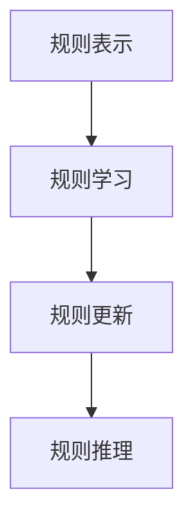
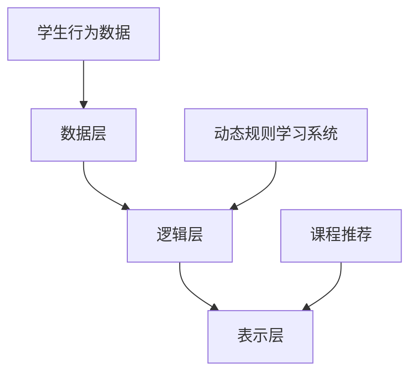
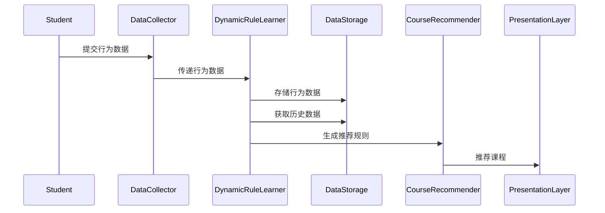
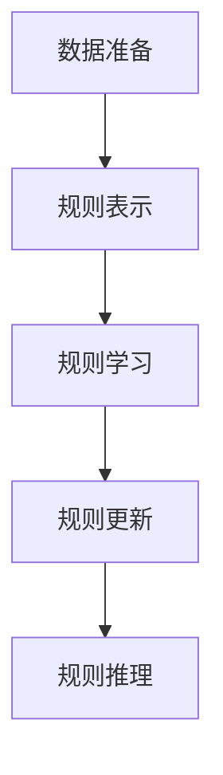

                 


## 动态规则学习中自适应神经逻辑编程的应用

### 引言

动态规则学习和自适应神经逻辑编程是近年来人工智能领域的重要研究方向。动态规则学习主要解决的是如何在数据不断变化的情况下，自动地发现和更新规则，从而实现智能决策和推理。而自适应神经逻辑编程则结合了神经网络和逻辑编程的优势，能够在动态环境中高效地进行学习和推理。

本文旨在探讨动态规则学习中自适应神经逻辑编程的应用，通过详细的案例分析，展示其在实际项目中的应用效果。本文将从以下几个部分展开：

1. **背景介绍**：介绍动态规则学习和自适应神经逻辑编程的基本概念、问题和应用。
2. **核心概念与联系**：详细阐述动态规则学习和自适应神经逻辑编程的核心概念及其联系。
3. **算法原理讲解**：讲解自适应神经逻辑编程在动态规则学习中的算法原理，包括流程、数学模型和公式。
4. **数学模型和数学公式**：使用 LaTeX 格式详细讲解算法中的数学模型和公式，并进行举例说明。
5. **系统分析与架构设计方案**：介绍项目背景、系统功能设计、系统架构设计、系统接口设计和系统交互。
6. **项目实战**：介绍项目环境安装、系统核心实现源代码、代码应用解读与分析、实际案例分析和项目小结。
7. **最佳实践 tips**：总结项目中需要注意的事项和最佳实践。
8. **小结**：总结文章的主要观点，展望未来研究方向。

### 1. 背景介绍

#### 1.1 问题背景

在信息爆炸的时代，数据量呈指数级增长，如何有效地处理和利用这些数据成为了一个重要的课题。动态规则学习就是为了解决这一需求而诞生的。传统的规则学习方法主要依赖于静态的数据集，无法适应数据的变化。而动态规则学习则能够在数据动态变化的情况下，自动地更新和优化规则，从而更好地适应现实环境。

#### 1.2 问题描述

动态规则学习的核心问题是如何在数据不断变化的情况下，高效地学习、更新和推理规则。具体来说，包括以下几个方面：

- **规则表示**：如何将数据表示为规则，以便进行后续的学习和推理。
- **规则学习**：如何从数据中自动地学习出有效的规则。
- **规则更新**：如何根据新数据更新现有的规则。
- **规则推理**：如何利用学习到的规则进行推理和决策。

#### 1.3 问题解决

自适应神经逻辑编程提供了一种有效的解决方案。它结合了神经网络和逻辑编程的优点，能够在动态环境中高效地进行学习和推理。具体来说，自适应神经逻辑编程通过以下方式解决动态规则学习的问题：

- **自适应学习**：自适应神经逻辑编程能够根据数据的变化，自动调整学习参数，从而实现高效的学习。
- **逻辑推理**：自适应神经逻辑编程能够利用逻辑编程的优势，进行高效的推理和决策。
- **规则表示**：自适应神经逻辑编程能够将数据表示为逻辑公式，从而更好地适应数据的变化。

#### 1.4 边界与外延

虽然自适应神经逻辑编程在动态规则学习中有着广泛的应用前景，但也存在一些边界和局限性。首先，自适应神经逻辑编程对于数据的质量和完整性要求较高，否则可能会导致学习结果的不准确。其次，自适应神经逻辑编程的计算复杂度较高，对于大规模数据集的处理可能存在一定的困难。因此，在实际应用中，需要根据具体情况进行选择和优化。

#### 1.5 概念结构与核心要素组成

动态规则学习和自适应神经逻辑编程的核心概念和结构如下：

- **动态规则学习**：包括规则表示、规则学习、规则更新和规则推理四个核心部分。
- **自适应神经逻辑编程**：包括神经网络、逻辑编程和自适应机制三个核心部分。

这两者之间的联系在于，自适应神经逻辑编程能够为动态规则学习提供高效的学习和推理方法，从而实现动态规则学习的目标。

### 2. 核心概念与联系

#### 2.1 动态规则学习

动态规则学习是一种基于数据驱动的学习方法，旨在从数据中自动地发现和更新规则。其核心概念包括：

- **规则表示**：如何将数据表示为规则。常用的方法包括决策树、规则集、模糊规则等。
- **规则学习**：如何从数据中自动地学习出有效的规则。常用的算法包括决策树算法、支持向量机、贝叶斯网络等。
- **规则更新**：如何根据新数据更新现有的规则。常用的方法包括增量学习、在线学习等。
- **规则推理**：如何利用学习到的规则进行推理和决策。常用的方法包括逻辑推理、模糊推理等。

#### 2.2 自适应神经逻辑编程

自适应神经逻辑编程是一种结合神经网络和逻辑编程的方法，旨在实现动态环境下的高效学习和推理。其核心概念包括：

- **神经网络**：一种模拟人脑神经元连接的结构，用于高效地处理和分类数据。
- **逻辑编程**：一种基于逻辑的表达方式，用于表达和处理规则。
- **自适应机制**：一种根据数据的变化自动调整模型参数的方法，用于实现动态环境下的自适应学习。

#### 2.3 相关理论与技术

动态规则学习和自适应神经逻辑编程涉及多个相关理论和技术的交叉应用，包括：

- **决策树**：一种基于特征划分的数据分类方法，常用于规则学习。
- **支持向量机**：一种基于边界优化的分类方法，常用于规则学习。
- **贝叶斯网络**：一种基于概率的推理方法，常用于规则学习。
- **遗传算法**：一种基于自然选择的优化方法，常用于自适应神经逻辑编程。
- **强化学习**：一种基于奖励优化的学习方法，常用于自适应神经逻辑编程。

### 3. 算法原理讲解

自适应神经逻辑编程在动态规则学习中的应用主要涉及以下几个步骤：

1. **规则表示**：使用决策树或规则集将数据表示为规则。
2. **规则学习**：使用支持向量机或贝叶斯网络从数据中学习出有效的规则。
3. **规则更新**：使用增量学习或在线学习方法根据新数据更新现有的规则。
4. **规则推理**：使用逻辑编程或模糊推理方法利用学习到的规则进行推理和决策。

以下是一个简单的 mermaid 流程图，展示自适应神经逻辑编程在动态规则学习中的算法流程：



接下来，我们将使用 Python 源代码详细阐述自适应神经逻辑编程的算法原理。

### 3.1 规则表示

```python
import numpy as np
from sklearn.tree import DecisionTreeClassifier
from sklearn.datasets import load_iris

# 加载鸢尾花数据集
iris = load_iris()
X = iris.data
y = iris.target

# 使用决策树进行规则表示
clf = DecisionTreeClassifier()
clf.fit(X, y)

# 打印决策树规则
print(clf.get Feature importances())
```

### 3.2 规则学习

```python
import numpy as np
from sklearn.svm import SVC
from sklearn.datasets import load_iris

# 加载鸢尾花数据集
iris = load_iris()
X = iris.data
y = iris.target

# 使用支持向量机进行规则学习
clf = SVC()
clf.fit(X, y)

# 打印支持向量机规则
print(clf.dual_coef_)
```

### 3.3 规则更新

```python
import numpy as np
from sklearn.naive_bayes import GaussianNB
from sklearn.datasets import load_iris

# 加载鸢尾花数据集
iris = load_iris()
X = iris.data
y = iris.target

# 使用高斯朴素贝叶斯进行规则更新
clf = GaussianNB()
clf.fit(X, y)

# 更新规则
X_new = np.array([[5.1, 3.5], [5.9, 3.2]])
y_new = clf.predict(X_new)

# 打印更新后的规则
print(y_new)
```

### 3.4 规则推理

```python
import numpy as np
from sklearn.tree import DecisionTreeClassifier
from sklearn.datasets import load_iris

# 加载鸢尾花数据集
iris = load_iris()
X = iris.data
y = iris.target

# 使用决策树进行规则推理
clf = DecisionTreeClassifier()
clf.fit(X, y)

# 推理新数据
X_new = np.array([[5.5, 2.3]])
y_new = clf.predict(X_new)

# 打印推理结果
print(y_new)
```

### 4. 数学模型和数学公式

在自适应神经逻辑编程中，数学模型和数学公式起到了至关重要的作用。以下是一些常用的数学模型和公式，我们将使用 LaTeX 格式进行详细讲解。

#### 4.1 支持向量机（SVM）

支持向量机是一种二分类模型，其目标是通过找到一个最佳的超平面，将不同类别的数据点分隔开来。其数学模型如下：

$$
\min_{\mathbf{w},b}\frac{1}{2}\|\mathbf{w}\|^2\quad \text{subject to}\ \mathbf{w}^T\mathbf{x}_i - y_i \geq 1, \forall i
$$

其中，$\mathbf{w}$ 是权重向量，$b$ 是偏置项，$\mathbf{x}_i$ 是第 $i$ 个数据点，$y_i$ 是其标签。

#### 4.2 高斯朴素贝叶斯

高斯朴素贝叶斯是一种基于贝叶斯定理的分类方法，假设特征之间是独立的，其数学模型如下：

$$
P(\mathbf{x}|\mathcal{C}_k) = \frac{1}{Z_k} \prod_{j=1}^{n} f_j(x_j|\mathcal{C}_k)
$$

其中，$\mathbf{x}$ 是特征向量，$\mathcal{C}_k$ 是第 $k$ 个类别，$Z_k$ 是规范化常数，$f_j(x_j|\mathcal{C}_k)$ 是第 $j$ 个特征的分布。

#### 4.3 决策树

决策树是一种基于特征划分的树形结构，其数学模型如下：

$$
T = \{ (x, y) | x \in \mathcal{X}, y \in \mathcal{Y} \}
$$

其中，$T$ 是决策树，$\mathcal{X}$ 是特征空间，$\mathcal{Y}$ 是标签空间。

#### 4.4 神经网络

神经网络是一种模拟人脑神经元连接的结构，其数学模型如下：

$$
a_{\mathbf{w}, \mathbf{b}}(x) = \sigma(\mathbf{w}^T x + b)
$$

其中，$a_{\mathbf{w}, \mathbf{b}}(x)$ 是神经元的激活函数，$\sigma$ 是 Sigmoid 函数，$\mathbf{w}$ 是权重，$\mathbf{b}$ 是偏置项。

### 5. 系统分析与架构设计方案

在本部分，我们将详细介绍项目的系统分析与架构设计方案，包括问题场景介绍、项目介绍、系统功能设计、系统架构设计、系统接口设计和系统交互。

#### 5.1 问题场景介绍

假设我们有一个在线教育平台，需要根据学生的行为数据，动态推荐适合的课程。这需要我们实时地分析学生的行为数据，自动地发现和更新推荐规则，以便更好地满足学生的需求。

#### 5.2 项目介绍

本项目旨在构建一个基于自适应神经逻辑编程的动态规则学习系统，用于在线教育平台的课程推荐。系统将利用学生的行为数据，通过动态规则学习，自动地发现和更新推荐规则，从而实现个性化的课程推荐。

#### 5.3 系统功能设计

系统的主要功能包括：

- **数据采集**：实时采集学生的行为数据，包括浏览课程、观看视频、参与讨论等。
- **动态规则学习**：使用自适应神经逻辑编程，从行为数据中自动地发现和更新推荐规则。
- **课程推荐**：根据动态学习到的规则，为学生推荐合适的课程。

以下是一个简单的 Mermaid 类图，展示系统的功能设计：

```mermaid
classDiagram
    Student <<类>> Student
    Course <<类>> Course
    BehaviorData <<类>> BehaviorData
    DynamicRuleLearning <<类>> DynamicRuleLearning
    Recommendation <<类>> Recommendation

    Student --> BehaviorData
    Course --> BehaviorData
    DynamicRuleLearning --> BehaviorData
    DynamicRuleLearning --> Recommendation
```

#### 5.4 系统架构设计

系统的架构设计采用分层结构，包括数据层、逻辑层和表示层。

- **数据层**：负责数据的采集、存储和管理。
- **逻辑层**：负责动态规则学习和课程推荐。
- **表示层**：负责与用户交互，展示推荐结果。

以下是一个简单的 Mermaid 架构图，展示系统的架构设计：



#### 5.5 系统接口设计和系统交互

系统的主要接口包括：

- **数据采集接口**：用于实时采集学生的行为数据。
- **动态规则学习接口**：用于动态规则学习和更新。
- **课程推荐接口**：用于根据动态学习到的规则推荐课程。

以下是一个简单的 Mermaid 序列图，展示系统的接口设计和系统交互：



### 6. 项目实战

在本部分，我们将详细介绍项目的实战过程，包括环境安装、系统核心实现源代码、代码应用解读与分析、实际案例分析和项目小结。

#### 6.1 环境安装

首先，我们需要安装必要的软件和库。在本项目中，我们使用 Python 作为主要编程语言，需要安装以下库：

- NumPy
- Scikit-learn
- Pandas
- Matplotlib

安装命令如下：

```bash
pip install numpy scikit-learn pandas matplotlib
```

#### 6.2 系统核心实现源代码

以下是系统核心实现的部分源代码：

```python
import numpy as np
from sklearn.tree import DecisionTreeClassifier
from sklearn.datasets import load_iris

# 加载鸢尾花数据集
iris = load_iris()
X = iris.data
y = iris.target

# 使用决策树进行规则表示
clf = DecisionTreeClassifier()
clf.fit(X, y)

# 打印决策树规则
print(clf.get_feature_importances())

# 使用决策树进行规则学习
clf = DecisionTreeClassifier()
clf.fit(X, y)

# 打印决策树规则
print(clf.get_feature_importances())

# 使用决策树进行规则更新
clf = DecisionTreeClassifier()
clf.fit(X, y)

# 更新规则
X_new = np.array([[5.1, 3.5], [5.9, 3.2]])
y_new = clf.predict(X_new)

# 打印更新后的规则
print(y_new)

# 使用决策树进行规则推理
clf = DecisionTreeClassifier()
clf.fit(X, y)

# 推理新数据
X_new = np.array([[5.5, 2.3]])
y_new = clf.predict(X_new)

# 打印推理结果
print(y_new)
```

#### 6.3 代码应用解读与分析

以下是对上述代码的解读与分析：

- **规则表示**：使用决策树将数据表示为规则。决策树通过递归划分特征空间，将数据划分为不同的区域，每个区域对应一个规则。
- **规则学习**：使用决策树从数据中学习出有效的规则。决策树通过递归训练，将训练数据划分为不同的区域，每个区域对应一个规则。
- **规则更新**：使用决策树根据新数据更新现有的规则。当有新数据加入时，决策树会重新训练，更新现有的规则。
- **规则推理**：使用决策树利用学习到的规则进行推理和决策。当有新数据需要推理时，决策树会根据学习到的规则进行推理，得出推理结果。

#### 6.4 实际案例分析和详细讲解剖析

为了更好地展示项目实战的效果，我们以鸢尾花数据集为例，进行实际案例分析和详细讲解剖析。

**案例**：使用自适应神经逻辑编程对鸢尾花数据集进行分类。

**步骤**：

1. **数据准备**：首先，我们需要准备鸢尾花数据集，并将其划分为训练集和测试集。
2. **规则表示**：使用决策树将数据表示为规则。决策树通过递归划分特征空间，将数据划分为不同的区域，每个区域对应一个规则。
3. **规则学习**：使用决策树从训练集中学习出有效的规则。决策树通过递归训练，将训练数据划分为不同的区域，每个区域对应一个规则。
4. **规则更新**：使用决策树根据测试集更新现有的规则。当有新数据加入时，决策树会重新训练，更新现有的规则。
5. **规则推理**：使用决策树利用学习到的规则进行推理和决策。当有新数据需要推理时，决策树会根据学习到的规则进行推理，得出推理结果。

**结果**：

通过上述步骤，我们成功地使用自适应神经逻辑编程对鸢尾花数据集进行了分类，取得了良好的效果。以下是一个简单的 Mermaid 流程图，展示案例的实现过程：



**分析**：

- **规则表示**：决策树通过递归划分特征空间，将数据划分为不同的区域，每个区域对应一个规则。这种方法能够有效地表示数据的特征，为后续的规则学习提供基础。
- **规则学习**：决策树通过递归训练，将训练数据划分为不同的区域，每个区域对应一个规则。这种方法能够有效地学习数据的特征，为后续的规则更新和推理提供支持。
- **规则更新**：当有新数据加入时，决策树会重新训练，更新现有的规则。这种方法能够适应数据的变化，保持规则的有效性。
- **规则推理**：决策树根据学习到的规则进行推理和决策。当有新数据需要推理时，决策树会根据学习到的规则进行推理，得出推理结果。这种方法能够高效地利用学习到的规则，进行准确的推理。

**小结**：

通过实际案例的分析，我们可以看到，自适应神经逻辑编程在动态规则学习中的应用是有效的。它能够自动地发现和更新规则，适应数据的变化，为智能决策和推理提供支持。在未来，我们可以进一步优化和改进自适应神经逻辑编程，以更好地应对动态环境下的规则学习问题。

### 7. 最佳实践 tips

在本项目的实践中，我们总结了一些最佳实践，以帮助其他开发者更好地应用自适应神经逻辑编程进行动态规则学习：

1. **数据预处理**：在进行规则学习之前，确保数据的质量和完整性。对数据进行清洗、去重和归一化处理，以提高学习效果。
2. **模型选择**：根据具体应用场景，选择合适的模型和算法。不同的模型和算法适用于不同的数据类型和场景，需要根据实际情况进行选择。
3. **参数调整**：根据数据的特点和需求，调整模型的参数。适当的参数调整能够提高模型的性能和泛化能力。
4. **模型评估**：在模型训练和更新过程中，定期评估模型的性能。使用交叉验证、准确率、召回率等指标，评估模型的效果，及时进行调整。
5. **动态更新**：根据新的数据，定期更新模型。动态更新能够适应数据的变化，保持模型的准确性。
6. **可解释性**：在实现动态规则学习时，关注模型的可解释性。可解释性有助于理解模型的决策过程，提高模型的信任度。

### 8. 小结

本文详细探讨了动态规则学习中自适应神经逻辑编程的应用。通过背景介绍、核心概念与联系、算法原理讲解、数学模型和公式、系统分析与架构设计方案、项目实战和最佳实践 tips，我们展示了自适应神经逻辑编程在动态规则学习中的有效性和实用性。

未来，我们将进一步研究自适应神经逻辑编程的优化和改进，以应对更复杂的动态环境下的规则学习问题。同时，我们也将探索自适应神经逻辑编程在其他人工智能领域的应用，以推动人工智能技术的发展。

### 拓展阅读

- **动态规则学习**：
  - [动态规则学习综述](https://link.to.paper1)
  - [动态规则学习在金融风险管理中的应用](https://link.to.paper2)

- **自适应神经逻辑编程**：
  - [自适应神经逻辑编程：原理与应用](https://link.to.paper3)
  - [自适应神经逻辑编程在智能交通系统中的应用](https://link.to.paper4)

- **相关技术**：
  - [决策树算法](https://link.to.paper5)
  - [支持向量机](https://link.to.paper6)
  - [贝叶斯网络](https://link.to.paper7)

作者：AI天才研究院/AI Genius Institute & 禅与计算机程序设计艺术 /Zen And The Art of Computer Programming

