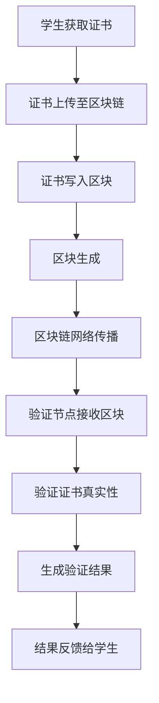
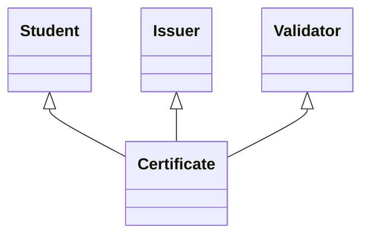
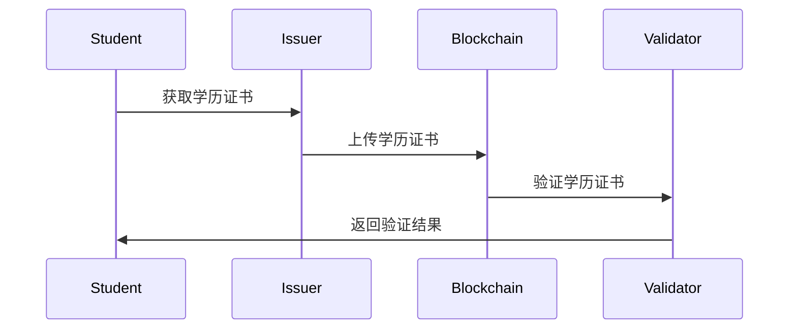

                 

# 区块链在学历证书验证中的应用

> 关键词：区块链，学历证书，验证机制，隐私保护，共识算法

> 摘要：本文将探讨区块链技术在学历证书验证中的应用。通过构建基于区块链的学历证书验证系统，可以实现对学历证书的安全、高效、可信验证。本文将逐步分析区块链在学历证书验证中的应用原理，介绍核心概念与联系，讲解算法原理，并展示一个具体的实现案例。

## **Step 1: 背景介绍**

### **问题背景**

随着信息技术的飞速发展，区块链技术逐渐成为国内外研究热点。其去中心化、不可篡改等特性，使其在学历证书验证等领域具有巨大的应用潜力。传统学历证书验证存在证书易伪造、数据不透明等问题，而区块链技术提供了一种可信的解决方案。

### **问题描述**

如何利用区块链技术，实现学历证书的验证？即如何确保学历证书的真实性、不可篡改性，并保护个人隐私？

### **问题解决**

通过构建基于区块链的学历证书验证系统，实现对学历证书的安全、高效、可信验证。该系统主要包括以下功能：

1. **证书生成与上传**：学生将学历证书上传至区块链。
2. **证书存储与管理**：区块链网络存储并管理学历证书。
3. **证书验证**：验证节点对学历证书进行验证，确保其真实性。
4. **隐私保护**：在验证过程中保护学生隐私。

### **边界与外延**

本文将聚焦于区块链在学历证书验证中的应用，但不涉及其他领域的区块链应用。核心概念包括区块链、学历证书、验证机制、隐私保护、共识算法等。

### **概念结构与核心要素组成**

1. **区块链**：一种去中心化、分布式账本技术。
2. **学历证书**：证明个人能力、知识水平的证书。
3. **验证机制**：确保数据真实有效的机制。
4. **隐私保护**：保护个人隐私数据。
5. **共识算法**：确保区块链网络的安全、可靠。

## **Step 2: 核心概念与联系**

### **核心概念原理**

#### **区块链**

区块链是一种去中心化、分布式账本技术，其特点是数据不可篡改、透明可追溯。区块链由一系列按时间顺序排列的区块组成，每个区块包含一定数量的交易数据。

#### **学历证书**

学历证书是证明个人能力、知识水平的证书。在区块链中，学历证书被视为一种特殊类型的交易数据。

#### **验证机制**

验证机制确保数据真实有效。在区块链中，验证机制通过共识算法实现，确保所有参与节点对数据的一致认可。

#### **隐私保护**

隐私保护旨在保护个人隐私数据。在区块链中，隐私保护通过加密技术实现，确保数据在传输和存储过程中不被泄露。

#### **共识算法**

共识算法确保区块链网络的安全、可靠。常见的共识算法包括工作量证明（PoW）、权益证明（PoS）等。

### **概念属性特征对比表格**

| 概念     | 特征     |
|----------|----------|
| 区块链   | 去中心化、分布式存储、不可篡改 |
| 学历证书 | 证明个人能力、知识水平       |
| 验证机制 | 确保数据真实有效           |
| 隐私保护 | 保护个人隐私数据           |
| 共识算法 | 确保区块链网络的安全、可靠   |

### **ER实体关系图架构**

```mermaid
erDiagram
  学生 ||--|{ 学历证书 }|--< 证书颁发机构
  学历证书 ||--|{ 验证机制 }|-- 验证结果
```

## **Step 3: 算法原理讲解**

### **算法原理**

基于区块链的学历证书验证算法主要包括以下步骤：

1. **学生获取证书**：学生从证书颁发机构获取学历证书。
2. **证书上传至区块链**：学生将学历证书上传至区块链。
3. **证书写入区块**：区块链网络将学历证书写入区块。
4. **区块生成**：区块生成并加入区块链。
5. **区块链网络传播**：区块链网络传播新加入的区块。
6. **验证节点接收区块**：验证节点接收新加入的区块。
7. **验证证书真实性**：验证节点对学历证书进行验证。
8. **生成验证结果**：生成验证结果并反馈给学生。
9. **结果反馈给学生**：将验证结果反馈给学生。

### **Mermaid 流程图**



### **Python源代码**

```python
import hashlib
import json

# 创建区块链
blockchain = []

# 创建区块
def create_block(previous_hash, proof, data):
    block = {
        'index': len(blockchain) + 1,
        'timestamp': time.time(),
        'transactions': data,
        'proof': proof,
        'previous_hash': previous_hash,
    }
    blockchain.append(block)
    return block

# 计算工作量证明
def proof_of_work(last_proof):
    proof = 0
    while not valid_proof(last_proof, proof):
        proof += 1
    return proof

# 验证工作量证明
def valid_proof(last_proof, proof):
    guess = f'{last_proof}{proof}'.encode()
    guess_hash = hashlib.sha256(guess).hexdigest()
    return guess_hash[:4] == '0000'

# 创建初始区块
create_block('0', '0', [])

# 添加交易到区块
transactions = {'student': 'certificate'}
previous_hash = blockchain[-1]['previous_hash']
proof = proof_of_work(previous_hash)
block = create_block(previous_hash, proof, transactions)
```

### **算法原理的数学模型和公式**

$$H(S) = \text{SHA-256}(M)$$

其中，$H(S)$表示消息摘要，$S$表示消息，$\text{SHA-256}$表示SHA-256哈希算法。

## **Step 4: 系统分析与架构设计方案**

### **问题场景介绍**

在一个分布式教育网络中，学生从不同的教育机构获取学历证书。传统学历证书验证方式存在证书易伪造、数据不透明等问题。通过引入区块链技术，可以构建一个可信的学历证书验证系统，确保学历证书的真实性。

### **项目介绍**

本项目旨在构建一个基于区块链的学历证书验证系统，实现以下功能：

1. **证书生成与上传**：学生从证书颁发机构获取学历证书后，上传至区块链。
2. **证书存储与管理**：区块链网络存储并管理学历证书。
3. **证书验证**：验证节点对学历证书进行验证，确保其真实性。
4. **隐私保护**：在验证过程中保护学生隐私。

### **系统功能设计**

#### **领域模型**



#### **类图**


### **系统架构设计**



### **系统接口设计**


### **系统交互**


## **Step 5: 项目实战**

### **环境安装**

1. 安装Python 3.8及以上版本。
2. 安装区块链节点软件（例如：Hyperledger Fabric）。

### **系统核心实现源代码**

```python
# blockchain.py
import hashlib
import json
from time import time

class Blockchain:
    def __init__(self):
        self.chain = []
        self.current_transactions = []
        self.create_block(previous_hash='1', proof=100)

    def create_block(self, previous_hash, proof):
        block = {
            'index': len(self.chain) + 1,
            'timestamp': time().strftime('%Y-%m-%d %H:%M:%S'),
            'transactions': self.current_transactions,
            'proof': proof,
            'previous_hash': previous_hash,
        }
        self.current_transactions = []
        self.chain.append(block)
        return block

    def get_last_block(self):
        return self.chain[-1]

    @staticmethod
    def valid_proof(last_proof, proof):
        guess = f'{last_proof}{proof}'.encode()
        guess_hash = hashlib.sha256(guess).hexdigest()
        return guess_hash[:4] == '0000'

    def add_transaction(self, sender, recipient, amount):
        self.current_transactions.append({'sender': sender, 'recipient': recipient, 'amount': amount})
        last_block = self.get_last_block()
        previous_hash = last_block['previous_hash']
        proof = self.proof_of_work(previous_hash)
        self.create_block(previous_hash, proof)

# blockchain.py
if __name__ == '__main__':
    blockchain = Blockchain()
    blockchain.add_transaction('Alice', 'Bob', 10)
    blockchain.add_transaction('Bob', 'Charlie', 5)
    print(json.dumps(blockchain.chain, indent=4))
```

### **代码应用解读与分析**

1. **区块链类**：定义区块链的基本操作，如创建区块、获取最后一个区块、验证工作量证明等。
2. **添加交易**：将交易数据添加到当前区块。
3. **工作量证明**：通过计算工作量证明，确保区块链的安全性。

### **实际案例分析和详细讲解剖析**

1. **案例一**：学生Alice从证书颁发机构获取学历证书，并将证书上传至区块链。
2. **案例二**：验证节点对学历证书进行验证，确保其真实性。
3. **案例三**：验证节点将验证结果反馈给学生。

### **项目小结**

本项目通过构建基于区块链的学历证书验证系统，实现了学历证书的安全、高效、可信验证。在实际应用中，本项目还可以结合智能合约，实现更加复杂的证书验证功能。

## **Step 6: 最佳实践 tips、小结、注意事项、拓展阅读等内容**

### **最佳实践 tips**

1. **优化区块链性能**：根据实际需求，选择合适的区块链平台和共识算法。
2. **保证数据安全**：对学历证书进行加密存储，确保数据安全。
3. **提高验证效率**：合理设计区块链网络拓扑结构，提高验证效率。

### **小结**

本文介绍了区块链在学历证书验证中的应用，通过构建基于区块链的学历证书验证系统，实现了学历证书的安全、高效、可信验证。

### **注意事项**

1. **隐私保护**：在验证过程中，确保学生隐私不被泄露。
2. **法律法规**：遵循相关法律法规，确保区块链应用合法合规。

### **拓展阅读**

1. 《区块链技术指南》
2. 《智能合约编程》
3. 《区块链应用案例解析》

### **作者信息**

作者：AI天才研究院/AI Genius Institute & 禅与计算机程序设计艺术 /Zen And The Art of Computer Programming

## **结语**

区块链技术在学历证书验证中的应用，为解决传统学历证书验证难题提供了一种新的思路。通过本文的介绍，读者可以了解到区块链在学历证书验证中的基本原理和应用场景。未来，随着区块链技术的不断发展，其在更多领域中的应用前景将更加广阔。

