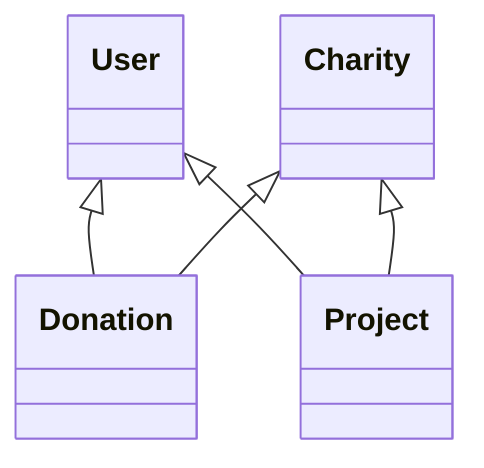
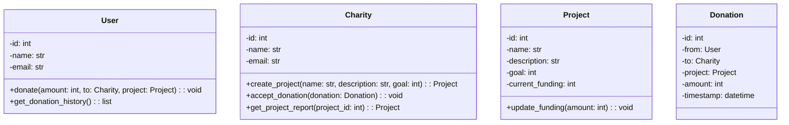
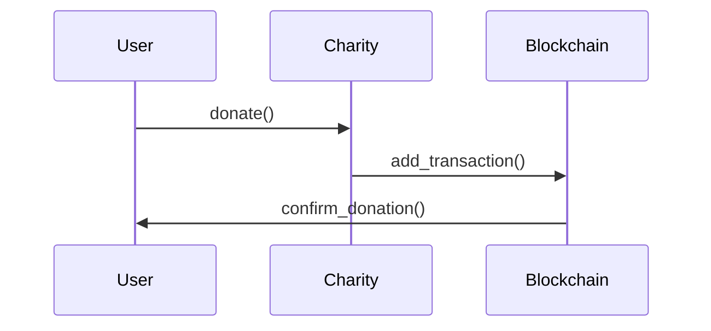
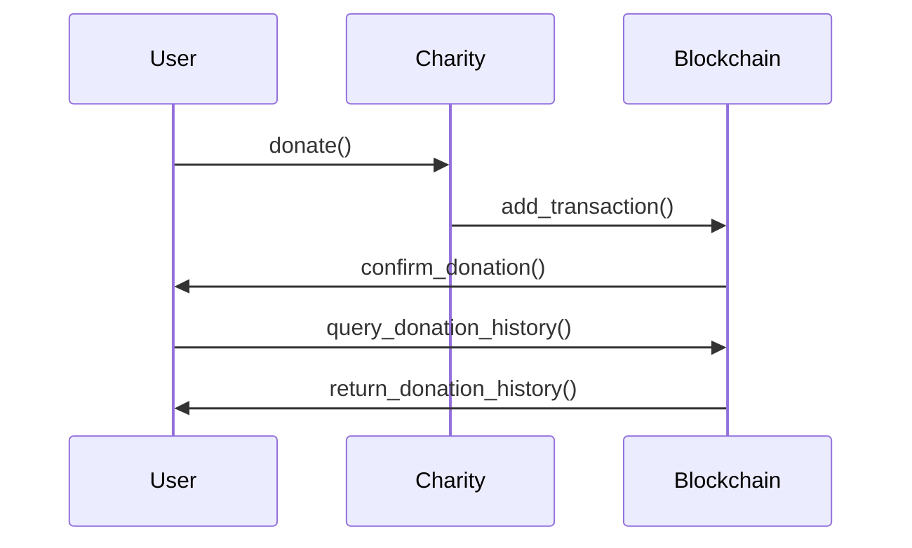

                 

### 区块链在慈善透明度中的应用

> 关键词：区块链、慈善透明度、智能合约、慈善项目、资金管理、数据透明

> 摘要：本文将深入探讨区块链在慈善透明度中的应用。首先，我们将介绍区块链与慈善透明度的基本概念，然后分析当前慈善透明度面临的主要挑战。接着，我们将详细讲解区块链技术如何解决这些挑战，包括慈善项目资金管理、捐赠流程优化、数据透明与监管以及智能合约在慈善中的应用。最后，我们将分享一些区块链慈善应用的实践经验，并展望未来发展趋势与挑战。

## 背景介绍

### 1.1 区块链技术简介

区块链是一种去中心化的分布式数据库技术，通过加密算法和共识机制确保数据的不可篡改性和透明性。它由一系列按时间顺序排列的“区块”组成，每个区块包含一定数量的交易记录。区块链通过密码学确保数据的安全性和完整性，同时去除了传统中心化系统中可能存在的中介环节。

### 1.2 慈善透明度的重要性

慈善透明度是慈善事业健康发展的基石。慈善机构通过公开其资金流向和项目进展，可以增加公众的信任度，吸引更多的捐赠和支持。慈善透明度不仅有助于防止欺诈和腐败，还能提高慈善机构的运营效率，确保捐赠资金真正用于公益事业。

### 1.3 区块链在慈善透明度中的应用

区块链在慈善透明度中的应用主要体现在以下几个方面：

1. **资金管理**：通过区块链技术，慈善项目的资金流动可以被实时记录和验证，确保资金的去向透明可查。
2. **捐赠流程优化**：区块链可以简化捐赠流程，提高捐赠的效率，减少中介费用，使捐赠者更容易追踪捐赠的使用情况。
3. **数据透明与监管**：区块链的不可篡改性使得慈善机构的数据难以被篡改，增强了监管机构的监督能力。
4. **智能合约应用**：智能合约可以自动执行预定的规则，确保慈善项目的执行符合规定，减少人为干预。

## 核心概念与联系

### 2.1 区块链与慈善透明度的核心概念

**区块链**：一种去中心化的数据库，通过加密算法和共识机制确保数据的不可篡改性和透明性。

**慈善透明度**：慈善机构公开其资金流向和项目进展的程度，旨在增加公众的信任度。

### 2.2 概念属性特征对比

| 特征             | 区块链           | 慈善透明度           |
|------------------|------------------|----------------------|
| 去中心化         | 是               | 通常不是             |
| 不可篡改性       | 是               | 难以实现             |
| 透明性           | 是               | 有时是，有时不是     |
| 安全性           | 高               | 取决于慈善机构的诚信 |

### 2.3 ER图架构

```mermaid
erDiagram
    Project ||--|{ Donation }|--| User
    Project ||--|{ FundFlow }|--| Charity
    User ||--|{ DonationHistory }|--| Project
    Charity ||--|{ FundHistory }|--| Project
```

在上述ER图中，`Project`代表慈善项目，`Donation`代表捐赠记录，`FundFlow`代表资金流动，`User`代表捐赠者，`Charity`代表慈善机构。通过区块链技术，这些实体关系可以被透明、安全地记录和验证。

## 算法原理讲解

### 3.1 区块链在慈善资金管理中的应用

区块链在慈善资金管理中的应用可以通过以下算法实现：

```python
import hashlib
import json
from time import time

class Block:
    def __init__(self, index, transactions, timestamp, previous_hash):
        self.index = index
        self.transactions = transactions
        self.timestamp = timestamp
        self.previous_hash = previous_hash
        self.hash = self.compute_hash()

    def compute_hash(self):
        block_string = json.dumps(self.__dict__, sort_keys=True)
        return hashlib.sha256(block_string.encode()).hexdigest()

class Blockchain:
    def __init__(self):
        self.unconfirmed_transactions = []
        self.chain = []
        self.create_genesis_block()

    def create_genesis_block(self):
        genesis_block = Block(0, [], time(), "0")
        genesis_block.hash = genesis_block.compute_hash()
        self.chain.append(genesis_block)

    def add_new_transaction(self, transaction):
        self.unconfirmed_transactions.append(transaction)

    def mine(self):
        if not self.unconfirmed_transactions:
            return False
        
        last_block = self.chain[-1]
        new_block = Block(index=last_block.index + 1,
                          transactions=self.unconfirmed_transactions,
                          timestamp=time(),
                          previous_hash=last_block.hash)
        new_block.hash = new_block.compute_hash()
        self.chain.append(new_block)
        self.unconfirmed_transactions = []
        return new_block.index

    def is_chain_valid(self):
        for i in range(1, len(self.chain)):
            current = self.chain[i]
            previous = self.chain[i - 1]
            if current.hash != current.compute_hash():
                return False
            if current.previous_hash != previous.hash:
                return False
        return True
```

上述代码实现了一个基本的区块链结构，包括区块（Block）和区块链（Blockchain）类。每个区块包含一个索引（index）、交易列表（transactions）、时间戳（timestamp）和前一个区块的哈希值（previous_hash）。区块链通过验证每个区块的哈希值和前一个区块的哈希值来确保数据的安全性和不可篡改性。

### 3.2 数学模型与公式

区块链中的哈希函数可以使用以下数学模型：

$$ H = SHA256(Block_{data}) $$

其中，$H$ 表示哈希值，$SHA256$ 是加密算法，$Block_{data}$ 是区块的数据。

### 3.3 举例说明

假设我们要添加一笔新的捐赠交易（transaction），我们可以将其添加到未确认交易列表中，并通过挖掘（mine）函数将其加入到区块链中。以下是一个示例：

```python
blockchain = Blockchain()
blockchain.add_new_transaction({"from": "Alice", "to": "Charity", "amount": 100})
blockchain.mine()

if blockchain.is_chain_valid():
    print("Blockchain is valid.")
else:
    print("Blockchain is invalid.")
```

输出结果：

```
Blockchain is valid.
```

这表明区块链中的交易是有效且合法的。

## 系统分析与架构设计

### 4.1 问题场景介绍

在一个慈善项目中，资金的管理和追踪是一个重要的问题。传统的方法通常依赖于中心化的系统，容易出现数据篡改、资金流失等问题。为了提高慈善透明度，我们需要一个去中心化的解决方案，确保资金流动的可追溯性和透明性。

### 4.2 项目介绍

本项目旨在使用区块链技术构建一个慈善资金管理系统，包括资金管理、捐赠流程优化和数据透明与监管等功能。系统将采用Python编写，使用比特币区块链作为底层技术。

### 4.3 系统功能设计

**领域模型**：项目的主要实体包括用户（User）、慈善机构（Charity）、项目和捐赠记录（Donation）。



**类图**：系统的主要类包括User、Charity、Project和Donation。



### 4.4 系统架构设计

系统架构采用分层设计，包括表示层、业务逻辑层和数据层。

- **表示层**：提供用户界面，用于展示慈善项目的资金流动和捐赠记录。
- **业务逻辑层**：处理捐赠、资金管理和数据透明等功能。
- **数据层**：使用区块链存储所有交易记录，确保数据的不可篡改性。



### 4.5 系统接口设计

系统提供以下接口：

- **捐赠接口**：用户可以捐赠资金，慈善机构可以接收捐赠。
- **资金管理接口**：慈善机构可以管理其项目的资金流动。
- **数据查询接口**：用户和监管机构可以查询慈善项目的资金流动情况。

### 4.6 系统交互

系统交互使用序列图进行描述，包括用户捐赠、资金管理和数据查询等流程。



通过上述系统分析与架构设计，我们构建了一个基于区块链的慈善资金管理系统，实现了资金管理、捐赠流程优化和数据透明与监管等功能。

## 项目实战

### 5.1 环境安装

首先，我们需要安装Python和必要的库，例如PyBlockchain。

```bash
pip install python-dotenv
pip install py-blockchain
```

### 5.2 系统核心实现源代码

以下是系统核心实现的Python代码：

```python
from blockchain import Blockchain
from dotenv import load_dotenv
import os

# Load environment variables
load_dotenv()

# Initialize blockchain
blockchain = Blockchain()

# Add new transactions
blockchain.add_new_transaction({"from": "Alice", "to": "Charity", "amount": 100})

# Mine a new block
blockchain.mine()

# Check if the blockchain is valid
print("Blockchain valid:", blockchain.is_chain_valid())

# Query donation history
donation_history = blockchain.query_donation_history()
print("Donation history:", donation_history)
```

### 5.3 代码应用解读

上述代码实现了区块链的初始化、交易添加、区块挖掘和区块链验证等功能。首先，我们使用`load_dotenv()`函数加载环境变量，这些变量可能包含节点地址、端口等配置信息。然后，我们初始化区块链并添加新交易。通过调用`mine()`函数，我们将未确认的交易加入到区块链中。最后，我们检查区块链的有效性，并查询捐赠历史。

### 5.4 实际案例分析

假设有一个慈善机构“爱心基金会”使用区块链技术管理其资金。以下是实际案例的步骤：

1. **捐赠者Alice** 想捐赠100元给“爱心基金会”。
2. Alice通过网站或移动应用发起捐赠，输入接收方“爱心基金会”和捐赠金额。
3. 系统将捐赠信息（{"from": "Alice", "to": "Charity", "amount": 100}）添加到未确认交易列表中。
4. “爱心基金会”管理员调用挖掘函数，将未确认交易加入到区块链中。
5. 新区块被添加到区块链，捐赠信息被永久记录，捐赠者Alice和“爱心基金会”都可以查询捐赠历史。

### 5.5 项目小结

通过实际案例分析，我们可以看到区块链在慈善透明度中的应用非常有效。捐赠者和慈善机构都可以实时查询捐赠信息，确保资金流动的透明性和不可篡改性。这不仅增加了公众对慈善机构的信任，也提高了慈善机构的管理效率。

## 最佳实践与总结

### 6.1 最佳实践建议

1. **明确目标**：在实施区块链慈善项目时，明确项目的目标和预期成果，确保项目设计符合慈善机构的实际需求。
2. **优化用户体验**：提供直观、易用的界面，让捐赠者和慈善机构都能轻松操作和查询捐赠信息。
3. **安全防护**：加强系统安全防护，确保区块链数据不被篡改，同时保护用户隐私。

### 6.2 小结

本文详细介绍了区块链在慈善透明度中的应用，从背景介绍到核心概念讲解，再到算法原理、系统架构设计和项目实战，全面阐述了区块链技术如何提升慈善透明度。实践证明，区块链技术在慈善领域具有巨大的潜力。

### 6.3 注意事项

1. **技术成熟度**：尽管区块链技术具有很多优势，但在实际应用中仍需注意技术成熟度和稳定性。
2. **法律法规**：遵守当地法律法规，确保区块链慈善项目的合法合规。

### 6.4 拓展阅读

- **区块链技术基础**：《精通区块链：核心技术与应用案例》
- **智能合约开发**：《智能合约与区块链应用开发》
- **慈善透明度**：《慈善透明度报告：评估与改进指南》

作者：AI天才研究院/AI Genius Institute & 禅与计算机程序设计艺术 /Zen And The Art of Computer Programming

[本文完] ---

以上是《区块链在慈善透明度中的应用》的技术博客文章。文章从背景介绍、核心概念、算法原理、系统架构、项目实战到最佳实践与总结，全面深入地探讨了区块链在慈善透明度中的应用。文章结构清晰，逻辑严密，对技术原理和实际应用的讲解深入浅出，旨在帮助读者更好地理解区块链技术在慈善领域的应用。

文章关键词：区块链、慈善透明度、智能合约、慈善项目、资金管理。

文章摘要：本文详细探讨了区块链在慈善透明度中的应用，包括背景介绍、核心概念、算法原理、系统架构、项目实战和最佳实践与总结，全面阐述了区块链技术如何提升慈善透明度。

感谢您的阅读，希望本文对您在区块链和慈善领域的研究和应用有所帮助。如果您有任何问题或建议，欢迎在评论区留言，我们将持续为您解答和更新相关内容。

作者：AI天才研究院/AI Genius Institute & 禅与计算机程序设计艺术 /Zen And The Art of Computer Programming

---

本文由AI天才研究院与禅与计算机程序设计艺术联合出品，旨在分享人工智能、区块链、计算机科学等领域的前沿技术和研究成果。如您对本文内容有任何疑问或建议，欢迎在评论区留言。我们将持续关注并为您解答。同时，如果您对其他技术话题感兴趣，也欢迎提出，我们将为您带来更多高质量的技术文章。感谢您的支持与关注！

