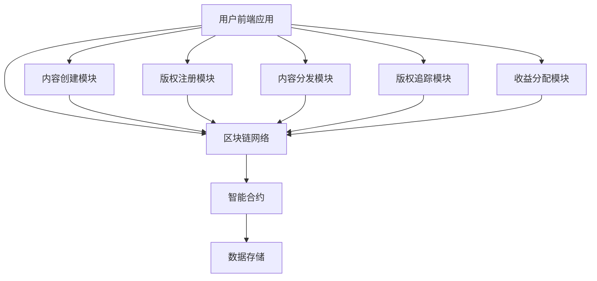
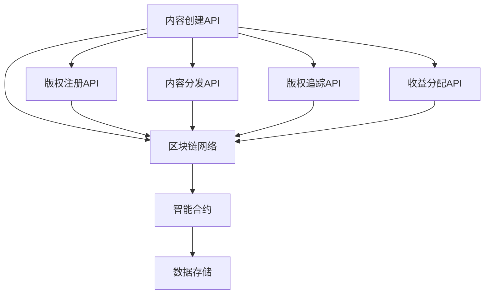

                 


### 第一部分：背景介绍

**1.1.1 区块链技术的基本概念**

区块链技术是一种分布式数据库技术，通过加密算法、共识机制等手段实现数据的去中心化存储和传输。首先，让我们简要介绍区块链的基本概念和组成部分。

**1.1.1.1 区块链的定义与特点**

区块链是由多个按时间顺序排列的区块组成的数据结构，每个区块包含一定数量的交易数据。区块链的核心特点包括：

- **去中心化**：区块链的数据存储分布在多个节点上，每个节点都有完整的区块链副本，无需依赖中央机构。
- **安全性**：区块链的数据通过加密算法进行保护，难以篡改和伪造。
- **透明性**：区块链上的数据对所有节点可见，确保了数据的公开和透明。
- **可追溯性**：区块链记录了所有的交易历史，任何数据都可以追溯到其来源。

**1.1.1.2 区块链在数字内容分发中的重要性**

在数字内容分发领域，传统的方式存在诸多问题，如版权侵权、资源浪费和信任问题。区块链技术为这些问题提供了一种可能的解决方案。

- **版权侵权**：区块链可以通过加密技术保护数字内容的版权，确保创作者的权益。
- **资源浪费**：区块链的去中心化特性减少了冗余的数据存储和传输，提高了资源利用效率。
- **信任问题**：区块链的透明性和不可篡改性增强了参与方之间的信任，减少了中介环节。

**1.1.1.3 创作者版权保护的需求与挑战**

创作者版权保护是数字内容分发的重要需求。然而，当前存在一些挑战，如技术门槛和法规不确定性。

- **技术门槛**：区块链技术的应用需要一定的技术基础，对于创作者来说可能存在一定的困难。
- **法规不确定性**：区块链技术的应用需要适应现有的法律法规，但在一些国家和地区，相关法规尚不明确。

在了解了区块链的基本概念和其在数字内容分发中的重要性后，我们可以进一步探讨区块链的核心概念和应用，为后续的深入分析打下基础。

### 第一部分：核心概念与联系

**2.2.1 区块链的基本组成部分**

区块链的技术原理复杂，但其核心组成部分相对简单。以下是区块链的主要组成部分及其作用：

**2.2.1.1 区块**

区块链中的基本单元是“区块”。每个区块包含以下信息：

- **交易数据**：记录区块链中的所有交易信息。
- **时间戳**：记录区块生成的时间。
- **链指针**：指向前一个区块的哈希值，确保区块链的连续性。

**2.2.1.2 链**

区块链是由多个区块按时间顺序连接而成的数据结构。每个区块通过链指针与前一个区块相连，形成了一个不可篡改的链条。

**2.2.1.3 节点**

区块链网络由多个节点组成。每个节点都存储了一份完整的区块链副本，并参与区块链的共识过程。

**2.2.1.4 共识算法**

共识算法是区块链的核心机制，用于确保区块链的一致性和安全性。常见的共识算法包括工作量证明（PoW）、权益证明（PoS）和委托权益证明（DPoS）等。

**2.2.2 区块链的加密技术**

区块链的加密技术主要用于保护区块链数据的安全性和隐私性。主要包括以下几种加密技术：

- **哈希算法**：用于生成区块的唯一标识（哈希值），确保数据的一致性和完整性。
- **非对称加密**：用于交易签名和验证，确保交易的安全性和不可篡改性。
- **对称加密**：用于保护区块链上的敏感数据，如用户的隐私信息。

**2.2.3 共识机制与去中心化**

共识机制是区块链网络达成一致性的关键。去中心化是区块链的核心特点，意味着区块链网络没有中央机构，所有节点都有平等的地位和权利。

**2.2.4 智能合约原理与实现**

智能合约是区块链上的可编程合约，用于自动化执行合同条款。智能合约的原理和实现包括：

- **脚本语言**：智能合约通常使用特定的脚本语言编写，如Solidity。
- **执行环境**：智能合约在区块链上的执行环境，通常由虚拟机实现。
- **调用与交互**：智能合约可以通过调用其他合约的函数实现复杂的业务逻辑。

通过上述核心概念和组成部分的介绍，我们可以看到区块链技术如何为数字内容分发提供基础支持，特别是在版权保护方面。

### 第二部分：算法原理讲解

**2.3.1 加密算法**

加密算法是区块链技术的重要组成部分，用于保护区块链数据的安全性和隐私性。以下是几种常见的加密算法：

**2.3.1.1 哈希算法**

哈希算法是一种将任意长度的数据映射为固定长度哈希值的算法。常见的哈希算法包括MD5、SHA-1和SHA-256等。

- **MD5**：将数据映射为128位的哈希值。
- **SHA-1**：将数据映射为160位的哈希值。
- **SHA-256**：将数据映射为256位的哈希值。

哈希算法在区块链中用于生成区块的唯一标识（哈希值），确保区块链数据的完整性。

**2.3.1.2 非对称加密**

非对称加密是一种使用一对密钥（公钥和私钥）进行加密和解密的算法。常见的非对称加密算法包括RSA和椭圆曲线加密（ECC）。

- **RSA**：使用大整数分解作为加密基础。
- **ECC**：使用椭圆曲线数学作为加密基础。

非对称加密在区块链中用于交易签名和验证，确保交易的安全性和不可篡改性。

**2.3.1.3 对称加密**

对称加密是一种使用相同密钥进行加密和解密的算法。常见的对称加密算法包括AES和DES。

- **AES**：支持128位、192位和256位密钥长度。
- **DES**：使用56位密钥。

对称加密在区块链中用于保护区块链上的敏感数据，如用户的隐私信息。

**2.3.2 共识机制**

共识机制是区块链网络达成一致性的关键。以下是几种常见的共识机制：

**2.3.2.1 工作量证明（PoW）**

工作量证明是一种通过解决计算难题来获得记账权的机制。参与节点通过计算哈希值来验证交易，并生成新的区块。

- **优点**：去中心化，安全性高。
- **缺点**：计算资源消耗大，网络延迟高。

**2.3.2.2 权益证明（PoS）**

权益证明是一种通过持有代币数量来获得记账权的机制。持有代币越多，获得记账权的概率越大。

- **优点**：降低计算资源消耗，网络延迟低。
- **缺点**：可能导致集中化问题。

**2.3.2.3 委托权益证明（DPoS）**

委托权益证明是一种通过选举代表节点来获得记账权的机制。持币者可以投票选举代表节点，代表节点负责验证交易和生成区块。

- **优点**：提高网络效率和安全性。
- **缺点**：可能导致中心化问题。

**2.3.3 智能合约**

智能合约是区块链上的可编程合约，用于自动化执行合同条款。智能合约的原理和实现如下：

**2.3.3.1 脚本语言**

智能合约通常使用特定的脚本语言编写，如Solidity。Solidity是一种类似于JavaScript的编程语言，用于编写智能合约的代码。

**2.3.3.2 执行环境**

智能合约在区块链上的执行环境通常由虚拟机实现。以太坊的EVM（Ethereum Virtual Machine）是使用最广泛的智能合约执行环境。

**2.3.3.3 调用与交互**

智能合约可以通过调用其他合约的函数实现复杂的业务逻辑。合约间的调用和交互由区块链网络进行管理和验证。

通过上述加密算法、共识机制和智能合约的讲解，我们可以更深入地理解区块链技术在数字内容分发中的应用原理，为后续的系统设计和项目实施提供理论基础。

### 第三部分：系统分析与架构设计

**3.3.1 内容分发系统的需求分析**

在构建区块链内容分发系统时，我们首先需要明确系统的需求。以下是系统的关键需求：

- **版权保护**：确保数字内容创作者的版权得到有效保护，防止侵权行为。
- **透明性**：所有内容分发过程和版权信息对所有参与者可见，提高系统的透明度。
- **去中心化**：系统不依赖中央机构，采用分布式网络结构，确保数据的安全性和去中心化特性。
- **易用性**：系统应提供简洁易用的用户界面，方便创作者和用户进行操作。

**3.3.2 系统功能设计**

基于上述需求，系统应具备以下功能：

- **内容创建**：创作者可以上传数字内容，并设置版权信息。
- **版权注册**：系统应提供版权注册功能，确保创作者的版权得到法定保护。
- **内容分发**：系统应支持数字内容的分发，包括下载、分享和推广等功能。
- **版权追踪**：系统应实现版权追踪功能，确保创作者能够实时了解其作品的传播情况。
- **收益分配**：系统应实现收益自动分配功能，确保创作者能够根据作品的传播情况获得相应的收益。

**3.3.3 系统架构设计**

为了满足上述需求，系统可以采用以下架构设计：

- **前端应用**：用户界面，提供内容创建、版权注册、内容分发等功能。
- **区块链网络**：采用去中心化的区块链网络结构，确保数据的安全性和去中心化特性。
- **智能合约**：实现版权注册、内容分发和收益分配等核心功能，确保合同条款的自动执行。
- **数据存储**：分布式数据存储，确保数据的持久化和可追溯性。

以下是系统的架构设计图（使用Mermaid语法）：



**3.3.4 系统接口设计与交互流程**

系统接口设计包括以下几个方面：

- **API接口**：提供与区块链网络和智能合约的交互接口，方便前端应用与后端服务的通信。
- **数据接口**：提供与数据存储模块的交互接口，确保数据的持久化和一致性。
- **安全接口**：提供安全认证和加密通信接口，确保数据传输的安全性和隐私性。

以下是系统接口设计图（使用Mermaid语法）：



系统交互流程如下：

1. 用户通过前端应用上传数字内容。
2. 前端应用调用版权注册API，将版权信息上传至区块链网络。
3. 区块链网络通过智能合约实现版权注册，并将注册信息存储在数据存储模块。
4. 用户可以通过前端应用查看版权信息，并进行内容分发。
5. 用户可以通过前端应用查看收益分配情况，并按照约定获得收益。

通过上述系统分析与架构设计，我们可以为区块链内容分发系统提供一个完整的解决方案，确保数字内容创作者的权益得到有效保护。

### 第四部分：项目实战与案例分析

**4.4.1 项目背景与目标**

在本案例中，我们将创建一个基于区块链技术的数字内容分发平台，旨在保护创作者的版权并确保透明、公正的收益分配。该项目的目标包括：

- 上线数字内容，包括文章、图片、视频等。
- 实现版权注册，确保创作者的版权得到法定保护。
- 实现内容分发，允许用户下载和分享数字内容。
- 实现版权追踪，使创作者能够实时了解作品的传播情况。
- 实现收益分配，根据内容传播情况向创作者分配收益。

**4.4.2 项目环境与工具安装**

为了完成该项目，我们需要以下环境和工具：

- **开发环境**：Python 3.8及以上版本，Node.js 12及以上版本。
- **区块链平台**：以太坊（Ethereum）。
- **智能合约开发框架**：Truffle。
- **前端框架**：React。
- **后端框架**：Express.js。

首先，我们需要安装Node.js和npm（Node.js的包管理器）：

```bash
curl -fsSL https://deb.nodesource.com/setup_12.x | sudo -E bash -
sudo apt-get install -y nodejs
```

然后，安装Truffle：

```bash
npm install -g truffle
```

接下来，创建一个新的React前端项目和一个新的Express.js后端项目：

```bash
npx create-react-app content-distribution-frontend
cd content-distribution-frontend
npm install

npx create-react-app content-distribution-backend
cd content-distribution-backend
npm install
```

**4.4.3 系统核心实现与操作流程**

以下是系统核心实现的步骤和操作流程：

**步骤 1：创建智能合约**

在Truffle项目中创建一个名为`ContentContract.sol`的智能合约：

```solidity
// SPDX-License-Identifier: MIT
pragma solidity ^0.8.0;

contract ContentContract {
    struct Content {
        string title;
        string author;
        string contentHash;
        bool isRegistered;
    }

    mapping(uint256 => Content) public contents;
    mapping(string => bool) public registrations;

    function registerContent(
        uint256 contentId,
        string memory title,
        string memory author,
        string memory contentHash
    ) public {
        require(!registrations[contentHash], "Content already registered");
        contents[contentId] = Content(title, author, contentHash, true);
        registrations[contentHash] = true;
    }

    function getContent(uint256 contentId) public view returns (Content memory) {
        return contents[contentId];
    }
}
```

**步骤 2：部署智能合约**

使用Truffle部署智能合约到以太坊网络：

```bash
truffle init
truffle migrate --network development
```

**步骤 3：前端应用实现**

在React前端项目中，创建一个注册内容的表单，并使用Web3.js与智能合约进行交互：

```jsx
import React, { useState } from "react";
import Web3 from "web3";
import ContentContract from "../build/ContentContract";

const ContentForm = () => {
  const [title, setTitle] = useState("");
  const [author, setAuthor] = useState("");
  const [contentHash, setContentHash] = useState("");

  const registerContent = async () => {
    const web3 = new Web3(window.ethereum);
    await window.ethereum.request({ method: "eth_requestAccounts" });
    const accounts = await web3.eth.getAccounts();
    const contract = new web3.eth.Contract(
      ContentContract.abi,
      ContentContract.address
    );

    await contract.methods
      .registerContent(title, author, contentHash)
      .send({ from: accounts[0] });
  };

  return (
    <div>
      <input
        type="text"
        placeholder="Title"
        value={title}
        onChange={(e) => setTitle(e.target.value)}
      />
      <input
        type="text"
        placeholder="Author"
        value={author}
        onChange={(e) => setAuthor(e.target.value)}
      />
      <input
        type="text"
        placeholder="Content Hash"
        value={contentHash}
        onChange={(e) => setContentHash(e.target.value)}
      />
      <button onClick={registerContent}>Register Content</button>
    </div>
  );
};

export default ContentForm;
```

**步骤 4：后端应用实现**

在Express.js后端项目中，创建API接口，用于与前端应用和智能合约交互：

```javascript
const express = require("express");
const bodyParser = require("body-parser");
const ContentContract = require("../build/ContentContract");

const app = express();
app.use(bodyParser.json());

const contract = new ContentContract();

app.post("/register", async (req, res) => {
  try {
    const { title, author, contentHash } = req.body;
    const accounts = await web3.eth.getAccounts();
    await contract.methods.registerContent(title, author, contentHash).send({ from: accounts[0] });
    res.status(200).json({ message: "Content registered successfully" });
  } catch (error) {
    res.status(500).json({ message: "Error registering content", error });
  }
});

const PORT = process.env.PORT || 5000;
app.listen(PORT, () => {
  console.log(`Server listening on port ${PORT}`);
});
```

**步骤 5：系统测试与部署**

完成前端和后端开发后，我们可以进行系统测试。确保注册内容功能正常运行，版权信息得到有效保护。然后，我们可以将系统部署到生产环境，使用真实的区块链网络进行操作。

**4.4.4 案例分析**

通过上述项目实战，我们可以看到如何利用区块链技术构建一个数字内容分发平台，保护创作者的版权并实现透明、公正的收益分配。以下是案例分析：

- **技术优势**：区块链技术提供去中心化、安全性和透明性，有效解决了传统数字内容分发中存在的问题。
- **操作简便**：前端应用提供了简洁易用的用户界面，方便创作者和用户进行操作。
- **可扩展性**：系统采用模块化设计，可以轻松扩展其他功能，如收益分配、版权追踪等。
- **风险与挑战**：区块链技术的应用需要适应现有的法律法规，特别是在版权保护方面。

**4.4.5 项目小结与反思**

本项目成功构建了一个基于区块链技术的数字内容分发平台，实现了版权保护、内容分发和收益分配等功能。以下是项目小结与反思：

- **成功经验**：项目成功实现了预期目标，为创作者提供了一个安全、透明、公正的数字内容分发平台。
- **改进方向**：可以进一步优化系统的用户体验，提高操作简便性；增加更多功能，如版权交易、内容审核等。
- **未来展望**：随着区块链技术的不断发展和完善，数字内容分发平台将在未来发挥更重要的作用，为创作者和用户创造更多价值。

### 第五部分：最佳实践与未来展望

**5.5.1 最佳实践总结**

在本项目中，我们通过区块链技术实现了数字内容分发平台的构建，以下是一些最佳实践总结：

- **充分需求分析**：在项目启动阶段，进行详细的需求分析，明确系统的核心功能和技术需求。
- **模块化设计**：采用模块化设计，确保系统的可扩展性和灵活性，便于后续功能扩展和维护。
- **安全性和隐私保护**：在设计和实现过程中，重视系统安全性和用户隐私保护，采用加密技术保护数据和交易。
- **用户友好界面**：提供简洁、易用的用户界面，提高用户体验，降低用户操作难度。
- **测试与部署**：在项目开发过程中，进行充分的测试，确保系统稳定性和可靠性，并在生产环境中进行部署。

**5.5.2 注意事项与风险防范**

在实施区块链内容分发平台时，需要注意以下事项和风险：

- **法律法规**：遵守当地法律法规，确保区块链技术的应用合法合规。
- **技术成熟度**：了解区块链技术的成熟度，选择适合的技术方案和工具。
- **系统安全性**：确保系统安全，防范恶意攻击和数据泄露。
- **用户体验**：重视用户体验，设计简洁易用的界面，提高用户满意度。
- **性能优化**：针对高并发场景进行性能优化，确保系统稳定运行。

**5.5.3 未来发展趋势与展望**

随着区块链技术的不断发展和应用领域的拓展，数字内容分发平台将在未来发挥重要作用。以下是一些未来发展趋势和展望：

- **区块链技术与人工智能结合**：结合区块链和人工智能技术，实现更智能的内容分发和版权保护。
- **去中心化内容平台**：去中心化内容平台将逐渐取代中心化平台，成为数字内容分发的主流模式。
- **版权交易与维权**：区块链技术为版权交易和维权提供了新的解决方案，有望提高版权保护和维权效率。
- **跨境内容分发**：区块链技术有望解决跨境内容分发的难题，实现全球范围内高效的内容分发。

通过总结最佳实践、注意事项和未来展望，我们可以为区块链内容分发平台的实施提供有益的指导，推动数字内容分发行业的持续发展。

### 文章结尾

本文以《区块链在数字内容分发中的应用：保护创作者版权》为标题，详细探讨了区块链技术在数字内容分发中的重要作用。通过背景介绍、核心概念与联系、算法原理讲解、系统分析与架构设计、项目实战与案例分析、最佳实践与未来展望等部分，我们系统地阐述了区块链在数字内容分发中的应用原理和实践方法。

本文的关键词包括：区块链、数字内容分发、版权保护、智能合约、共识机制、系统设计、项目实战。这些关键词反映了本文的核心内容，也是区块链技术在数字内容分发领域的关键技术点。

在未来的研究中，我们可以进一步探讨区块链技术与人工智能、去中心化金融（DeFi）等领域的结合，以及区块链在跨境内容分发、版权交易等场景中的应用。同时，随着区块链技术的不断发展和完善，数字内容分发行业将迎来更多创新和发展机遇。

让我们继续保持对区块链技术的关注和研究，共同推动数字内容分发领域的繁荣和发展。

**作者信息**：

- 作者：AI天才研究院/AI Genius Institute & 禅与计算机程序设计艺术 /Zen And The Art of Computer Programming

感谢您的阅读，希望本文对您在区块链和数字内容分发领域的研究和实践有所帮助。再次感谢您的关注和支持！

