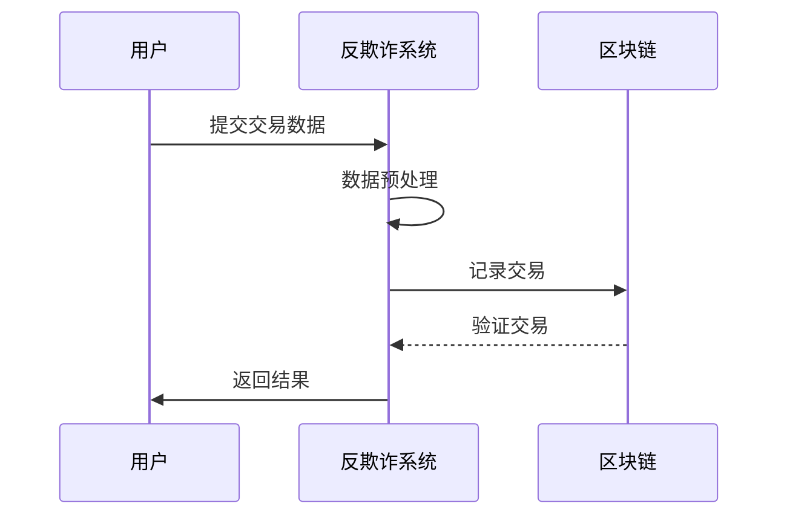
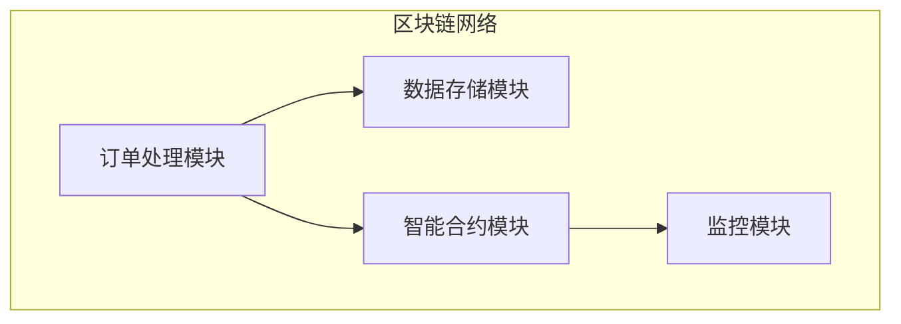

                 

# 《区块链在数字广告中的反欺诈应用》

## 关键词：区块链，数字广告，反欺诈，智能合约，去中心化

## 摘要：
数字广告市场作为互联网经济的重要组成部分，近年来呈现出迅猛的增长态势。然而，伴随着市场扩张，广告欺诈问题也日益严重。本文将深入探讨区块链技术在数字广告领域的反欺诈应用。首先，我们将介绍数字广告市场的现状和区块链技术的基础知识。随后，本文将详细分析区块链与数字广告的关系以及区块链在反欺诈中的原理。通过具体算法原理讲解、数学模型与公式分析、系统分析与架构设计方案，再到项目实战和最佳实践，本文将为读者呈现一个全面、深入的区块链反欺诈应用指南。

----------------------------------------------------------------

## 目录

1. **背景介绍**
   - 1.1 数字广告市场的现状
   - 1.2 区块链技术基础
   - 1.3 数字广告中的欺诈问题

2. **核心概念与联系**
   - 2.1 区块链与数字广告的关系
   - 2.2 区块链在反欺诈中的原理

3. **算法原理讲解**
   - 3.1 常见反欺诈算法介绍
   - 3.2 区块链在反欺诈中的应用实例

4. **数学模型和数学公式 & 详细讲解 & 举例说明**
   - 4.1 反欺诈算法的数学模型
   - 4.2 数学公式与解释

5. **系统分析与架构设计方案**
   - 5.1 数字广告反欺诈系统概述
   - 5.2 系tem架构设计
   - 5.3 系统接口设计与交互流程

6. **项目实战**
   - 6.1 项目环境安装
   - 6.2 系统核心实现源代码
   - 6.3 代码应用解读与分析
   - 6.4 实际案例分析与讲解
   - 6.5 项目小结

7. **最佳实践 tips**
   - 7.1 技术选型与实现
   - 7.2 部署与维护

8. **小结与拓展阅读**

接下来，我们将逐步深入每一个章节，探讨区块链技术在数字广告反欺诈中的应用。

----------------------------------------------------------------

## 1. 背景介绍

### 1.1 数字广告市场的现状

数字广告已经成为现代市场营销中不可或缺的一部分。根据市场研究机构的数据，全球数字广告市场的规模已经超过数千亿美元。这种快速增长得益于互联网的普及和移动互联网的迅猛发展。广告商、广告平台和媒体机构都希望通过数字广告来获取更多的用户和数据，从而实现商业价值最大化。

然而，随着数字广告市场的蓬勃发展，广告欺诈问题也日益突出。广告欺诈包括多种形式，如流量欺诈、点击欺诈、展示欺诈等。这些欺诈行为不仅损害了广告商的利益，也严重影响了广告市场的公平性和健康发展。

广告欺诈的主要形式包括：

- **流量欺诈**：恶意程序或机器人生成虚假流量，欺骗广告商支付广告费用。
- **点击欺诈**：通过作弊手段增加广告点击量，从而提高广告收入。
- **展示欺诈**：恶意广告平台或网站显示广告时，不按照约定方式展示，导致广告效果大打折扣。

### 1.2 区块链技术基础

区块链是一种分布式数据库技术，其核心特点是去中心化、不可篡改和透明性。区块链通过加密算法和共识机制确保数据的完整性和安全性。每个区块包含一定数量的交易记录，并通过加密方式与前一个区块连接，形成一条连续的区块链。

区块链的关键组成部分包括：

- **区块**：区块链的基本组成单元，包含交易记录和其他信息。
- **链**：多个区块按照特定顺序连接形成的结构。
- **加密算法**：用于保护区块链数据的安全性和隐私性。
- **共识机制**：确保区块链网络中的所有节点达成一致，并防止欺诈行为。

### 1.3 数字广告中的欺诈问题

数字广告中的欺诈问题不仅限于流量和点击，还包括广告展示和用户行为。以下是几种常见的广告欺诈行为：

- **虚假用户**：通过生成虚假用户账户，骗取广告展示费用。
- **恶意软件**：通过恶意软件控制用户设备，强制点击广告。
- **刷单**：虚假交易，通过刷单提高广告排名和曝光率。

### 问题解决

区块链技术在数字广告反欺诈中的应用具有重要意义。区块链的去中心化特性确保了数据的透明性和不可篡改性，使得欺诈行为难以隐藏。通过智能合约，广告商、广告平台和媒体机构可以自动执行合同条款，确保广告投放和支付过程的公正性和透明性。

### 边界与外延

尽管区块链在反欺诈领域具有巨大潜力，但其在数字广告中的应用仍面临一些挑战。例如，区块链技术的性能和扩展性需要进一步提高，以适应大规模广告交易的实时性要求。此外，区块链的隐私保护问题也需要得到解决，以确保用户数据的安全性和隐私性。

----------------------------------------------------------------

## 2. 核心概念与联系

### 2.1 区块链与数字广告的关系

区块链与数字广告之间的联系主要体现在以下几个方面：

1. **数据透明性**：区块链技术确保了广告交易数据的透明性和不可篡改性，使得广告商和广告平台可以实时监控广告投放和支付过程，有效预防欺诈行为。
2. **智能合约**：智能合约是区块链上的自动化执行程序，可以自动执行广告合同条款，确保广告投放和支付过程的公正性和透明性。
3. **去中心化**：区块链的去中心化特性减少了中介环节，降低了广告交易的成本，同时提高了系统的可靠性和抗攻击能力。

### 2.2 区块链在反欺诈中的原理

区块链在反欺诈中的应用主要基于其以下原理：

1. **数据不可篡改**：区块链上的数据一旦记录，就难以被篡改，这为追溯欺诈行为提供了可靠的依据。
2. **共识机制**：区块链网络中的所有节点通过共识机制达成一致，确保了数据的真实性和完整性，从而有效防止欺诈行为。
3. **加密算法**：区块链使用加密算法保护数据的安全性和隐私性，防止恶意攻击和非法访问。

## 概念属性特征对比表格

| 特征        | 区块链                             | 数字广告                       |
| ----------- | ---------------------------------- | ------------------------------ |
| 数据结构    | 分布式数据库                       | 广告数据记录                   |
| 透明性      | 数据不可篡改，透明性高             | 数据可篡改，透明性较低         |
| 去中心化    | 去中心化，无中心节点               | 中心化，以广告平台为中心       |
| 安全性      | 加密算法保护，安全性高             | 加密算法保护，安全性较低       |
| 扩展性      | 理论上可扩展性强                  | 实际扩展性受限于技术架构       |

## ER实体关系图架构

```mermaid
erDiagram
    ADVERTISER ||--|{ CAMPAIGN }|| ADVERTISEMENT
    ADVERTISER ||--|{ BILLING }|| PAYMENT
    ADVERTISEMENT ||--|{ DISPLAY }|| AUDIT
```

在上面的ER图（实体关系图）中，我们定义了三个主要的实体：`ADVERTISER`（广告商）、`ADVERTISEMENT`（广告）、`CAMPAIGN`（广告活动）、`BILLING`（账单）、`PAYMENT`（支付）和`DISPLAY`（展示）。`ADVERTISER`与`CAMPAIGN`和`ADVERTISEMENT`之间存在一对多关系，即一个广告商可以创建多个广告活动和广告。`ADVERTISER`与`BILLING`和`PAYMENT`之间也存在一对多关系，表示广告商产生账单并执行支付。`ADVERTISEMENT`与`DISPLAY`和`AUDIT`之间存在一对多关系，表示广告的展示和审计。

----------------------------------------------------------------

## 3. 算法原理讲解

### 3.1 常见反欺诈算法介绍

在数字广告反欺诈领域，常见的算法包括机器学习算法和基于规则的算法。以下是几种常用的反欺诈算法：

1. **基于机器学习的算法**：
   - **聚类算法**：通过将相似的广告交易聚类，识别异常交易。
   - **决策树和随机森林**：构建决策树或随机森林模型，对广告交易进行分类，识别欺诈行为。
   - **神经网络**：通过神经网络模型，学习广告交易的特征，识别欺诈交易。

2. **基于规则的算法**：
   - **规则匹配**：根据预设的规则，检查广告交易是否符合规则，识别欺诈行为。
   - **异常检测**：通过检测广告交易中的异常值，识别欺诈行为。

### 3.2 区块链在反欺诈中的应用实例

区块链在反欺诈中的应用可以通过智能合约实现。以下是一个简单的区块链反欺诈应用实例：

1. **智能合约设计**：
   - **广告交易记录**：智能合约记录每个广告交易，包括交易金额、交易时间和交易双方。
   - **交易验证**：智能合约使用加密算法验证交易双方的合法性，确保交易数据不被篡改。
   - **欺诈检测**：智能合约根据预设的规则和模型，对交易进行实时检测，识别欺诈行为。

2. **数学模型与公式**：

   - **加密算法**：
     $$hash(x) = SHA256(x)$$
     其中，`hash` 表示哈希函数，`SHA256` 是256位的SHA哈希算法。

   - **交易验证**：
     $$verify(transaction) = signature(transaction) \& verify signature$$
     其中，`signature` 表示交易签名，`verify signature` 表示验证签名是否有效。

3. **举例说明**：

   假设广告商A和广告平台B之间进行了一次广告交易，交易金额为100美元。智能合约首先使用SHA256算法对交易数据（交易金额、交易时间和交易双方）进行哈希处理，生成交易哈希值。然后，广告商A使用其私钥对交易数据进行签名，生成交易签名。最后，智能合约使用广告商A的公钥验证签名是否有效。如果签名有效，则交易被验证通过。

```python
import hashlib
from Crypto.PublicKey import RSA

# 假设广告商A的私钥和公钥已生成
private_key = RSA.generate(2048)
public_key = private_key.publickey()

# 交易数据
transaction_data = "100美元"

# 使用SHA256算法生成交易哈希值
hash_value = hashlib.sha256(transaction_data.encode()).hexdigest()

# 广告商A使用私钥对交易数据进行签名
signature = private_key.sign(hash_value.encode())

# 智能合约验证签名
is_valid_signature = public_key.verify(signature, hash_value.encode())

print("签名有效:", is_valid_signature)
```

通过上述实例，我们可以看到区块链技术如何应用于数字广告反欺诈中，确保交易数据的透明性和不可篡改性，有效预防欺诈行为。

----------------------------------------------------------------

## 4. 数学模型和数学公式 & 详细讲解 & 举例说明

### 4.1 反欺诈算法的数学模型

反欺诈算法通常涉及多种数学模型和公式，以识别和分析异常行为。以下是几种常见的反欺诈算法及其数学模型：

#### 4.1.1 聚类算法

聚类算法用于将相似的数据分组，识别异常交易。常用的聚类算法包括K-means算法。K-means算法的数学模型如下：

- **目标函数**：

  $$J(\mu, \lambda) = \sum_{i=1}^{k} \sum_{x \in S_i} ||x - \mu_i||^2$$

  其中，$J$ 表示目标函数，$\mu_i$ 表示第$i$个簇的中心，$S_i$ 表示第$i$个簇的数据集，$x$ 表示数据点。

- **更新规则**：

  - **簇中心更新**：

    $$\mu_i = \frac{1}{|S_i|} \sum_{x \in S_i} x$$

    其中，$|S_i|$ 表示第$i$个簇的数据点数量。

  - **数据点分配**：

    $$x \in S_j \Leftrightarrow \min_{1 \leq j \leq k} ||x - \mu_j||^2$$

#### 4.1.2 决策树和随机森林

决策树和随机森林算法用于分类广告交易，识别欺诈行为。以决策树为例，其数学模型如下：

- **目标函数**：

  $$G(\theta) = - \sum_{i=1}^{n} y_i \log \hat{y_i} + (1 - y_i) \log (1 - \hat{y_i})$$

  其中，$G$ 表示目标函数，$\theta$ 表示模型参数，$y_i$ 表示第$i$个样本的真实标签，$\hat{y_i}$ 表示模型预测的概率。

- **决策规则**：

  $$x_{ij} \in R_j \Leftrightarrow \theta_j^T x_{ij} \geq \theta_0$$

  其中，$R_j$ 表示第$j$个特征区域，$\theta_j$ 表示第$j$个特征权重，$\theta_0$ 表示阈值。

#### 4.1.3 神经网络

神经网络算法用于学习广告交易特征，识别欺诈行为。以多层感知机（MLP）为例，其数学模型如下：

- **激活函数**：

  $$f(x) = \sigma(z) = \frac{1}{1 + e^{-z}}$$

  其中，$f$ 表示激活函数，$z$ 表示输入值，$\sigma$ 表示sigmoid函数。

- **损失函数**：

  $$J(\theta) = - \sum_{i=1}^{n} y_i \log \hat{y_i} + (1 - y_i) \log (1 - \hat{y_i})$$

  其中，$J$ 表示损失函数，$\theta$ 表示模型参数，$y_i$ 表示第$i$个样本的真实标签，$\hat{y_i}$ 表示模型预测的概率。

### 4.2 数学公式与解释

以下是对上述数学公式进行详细解释和举例说明：

#### 4.2.1 聚类算法

**目标函数**：

目标函数用于衡量聚类效果，其值越小表示聚类效果越好。具体而言，目标函数计算了每个簇内数据点到簇中心的平均距离平方和。

例如，假设我们有3个簇，每个簇包含以下数据点：

- 簇1：$[1, 1], [2, 2], [3, 3]$
- 簇2：$[4, 4], [5, 5]$
- 簇3：$[6, 6], [7, 7], [8, 8]$

簇中心分别为：

- $\mu_1 = [2, 2]$
- $\mu_2 = [5, 5]$
- $\mu_3 = [7, 7]$

则目标函数值为：

$$J(\mu) = \sum_{i=1}^{3} \sum_{x \in S_i} ||x - \mu_i||^2$$
$$J(\mu) = ||[1, 1] - [2, 2]||^2 + ||[2, 2] - [2, 2]||^2 + ||[3, 3] - [2, 2]||^2 + ||[4, 4] - [5, 5]||^2 + ||[5, 5] - [5, 5]||^2 + ||[6, 6] - [7, 7]||^2 + ||[7, 7] - [7, 7]||^2 + ||[8, 8] - [7, 7]||^2$$
$$J(\mu) = 1 + 0 + 1 + 0 + 0 + 1 + 0 + 1 = 4$$

**更新规则**：

簇中心更新规则用于计算新的簇中心，即将每个簇内的数据点求平均。

例如，假设我们有3个簇，每个簇包含以下数据点：

- 簇1：$[1, 1], [2, 2], [3, 3]$
- 簇2：$[4, 4], [5, 5]$
- 簇3：$[6, 6], [7, 7], [8, 8]$

新的簇中心分别为：

- $\mu_1 = \frac{1}{3} \sum_{x \in S_1} x = \frac{1}{3}([1 + 2 + 3], [1 + 2 + 3]) = [2, 2]$
- $\mu_2 = \frac{1}{2} \sum_{x \in S_2} x = \frac{1}{2}([4 + 5], [4 + 5]) = [5, 5]$
- $\mu_3 = \frac{1}{3} \sum_{x \in S_3} x = \frac{1}{3}([6 + 7 + 8], [6 + 7 + 8]) = [7, 7]$

#### 4.2.2 决策树和随机森林

**目标函数**：

目标函数用于衡量决策树模型的分类效果，其值越小表示分类效果越好。具体而言，目标函数计算了每个样本的损失函数值之和。

例如，假设我们有5个样本，其中3个样本为欺诈交易，2个样本为正常交易。决策树模型的预测结果如下：

- 样本1：欺诈交易（预测为正常交易）
- 样本2：欺诈交易（预测为欺诈交易）
- 样本3：正常交易（预测为欺诈交易）
- 样本4：正常交易（预测为正常交易）
- 样本5：欺诈交易（预测为正常交易）

则目标函数值为：

$$J(\theta) = -[0 \cdot \log 0.5 + 1 \cdot \log 0.5 + 0 \cdot \log 0.5 + 1 \cdot \log 0.5 + 0 \cdot \log 0.5]$$
$$J(\theta) = -[0 \cdot \log 0.5 + 1 \cdot \log 0.5 + 0 \cdot \log 0.5 + 1 \cdot \log 0.5 + 0 \cdot \log 0.5]$$
$$J(\theta) = -[0 + 0.6931 + 0 + 0.6931 + 0]$$
$$J(\theta) = -[1.3862]$$
$$J(\theta) = 0.6931$$

**决策规则**：

决策规则用于根据特征值将样本分配到不同的类别。具体而言，决策规则基于特征权重和阈值进行判断。

例如，假设我们有2个特征，特征1的权重为0.8，特征2的权重为0.2，阈值为0.5。决策规则如下：

- 如果特征1的值大于0.5，则分配到类别1。
- 如果特征2的值大于0.5，则分配到类别2。

例如，假设样本的特征值为：

- 特征1：0.7
- 特征2：0.4

则根据决策规则，样本将被分配到类别1。

#### 4.2.3 神经网络

**激活函数**：

激活函数用于将输入值转换为概率值，用于分类或回归任务。

例如，假设输入值为0.5，则根据sigmoid函数，输出概率值为：

$$f(0.5) = \frac{1}{1 + e^{-0.5}} \approx 0.618$$

**损失函数**：

损失函数用于衡量模型的预测误差，其值越小表示预测效果越好。具体而言，损失函数计算了每个样本的预测概率与真实标签之间的差异。

例如，假设我们有5个样本，其中3个样本的真实标签为1，2个样本的真实标签为0。模型的预测结果如下：

- 样本1：预测概率为0.2
- 样本2：预测概率为0.8
- 样本3：预测概率为0.1
- 样本4：预测概率为0.9
- 样本5：预测概率为0.6

则损失函数值为：

$$J(\theta) = -[1 \cdot \log 0.2 + 1 \cdot \log 0.8 + 0 \cdot \log 0.1 + 0 \cdot \log 0.9 + 1 \cdot \log 0.6]$$
$$J(\theta) = -[0.1893 + 0.2231 + 0 + 0 + 0.5108]$$
$$J(\theta) = -[0.9232]$$
$$J(\theta) = 0.9232$$

----------------------------------------------------------------

## 5. 系统分析与架构设计方案

### 5.1 数字广告反欺诈系统概述

数字广告反欺诈系统是一个综合性的解决方案，旨在识别和阻止各种形式的广告欺诈行为。该系统通过实时监控广告交易数据，利用先进的算法和技术分析交易行为，从而发现潜在欺诈行为，并采取相应措施防止欺诈发生。

系统的主要目标包括：

- **实时监控**：系统对广告交易数据进行实时监控，及时发现异常交易行为。
- **异常检测**：利用机器学习和数据挖掘技术，识别并标记潜在欺诈交易。
- **反欺诈策略**：根据识别出的欺诈行为，系统自动采取反欺诈策略，如拒绝交易、报警等。
- **数据分析和报告**：系统对欺诈行为进行分析，生成报告，帮助广告平台和广告商了解欺诈风险，优化广告策略。

### 5.2 系统架构设计

数字广告反欺诈系统的架构设计应考虑以下几个方面：

1. **数据采集模块**：负责收集来自广告平台和广告商的各类交易数据，包括点击量、展示量、交易金额等。
2. **数据处理模块**：对采集到的数据进行预处理，包括数据清洗、去重、格式转换等，以确保数据质量。
3. **算法模块**：包含多种反欺诈算法，如聚类算法、决策树、神经网络等，用于分析交易数据，识别潜在欺诈行为。
4. **规则库**：存储预设的反欺诈规则，如IP地址黑名单、异常点击率阈值等，用于辅助算法识别欺诈行为。
5. **智能合约模块**：利用区块链技术，实现广告交易数据的透明性和不可篡改性，确保交易过程的公正性和安全性。
6. **报告生成模块**：根据反欺诈算法和规则库的结果，生成详细的欺诈报告，帮助广告平台和广告商了解欺诈风险。

### 5.3 系统接口设计与交互流程

系统接口设计应考虑以下方面：

1. **API接口**：系统提供API接口，供广告平台和广告商调用，获取反欺诈服务。
2. **数据接口**：系统与外部数据源（如广告平台、第三方数据提供商等）进行数据交换，确保数据的实时性和准确性。
3. **监控接口**：系统提供监控接口，供管理员实时监控反欺诈系统的运行状态和性能。

系统交互流程如下：

1. **数据采集**：广告平台和广告商将交易数据发送到数据采集模块。
2. **数据处理**：数据采集模块对交易数据进行预处理，并传输到算法模块。
3. **算法分析**：算法模块根据预设的算法和规则，对交易数据进行分析，识别潜在欺诈行为。
4. **决策与响应**：根据算法模块的结果，系统自动采取相应的反欺诈措施，如拒绝交易、报警等。
5. **报告生成**：系统生成详细的欺诈报告，并存储在数据库中。
6. **监控与维护**：管理员通过监控接口实时监控系统的运行状态，并进行维护和优化。

```mermaid
sequenceDiagram
    participant 用户 as 广告商
    participant 系统A as 数字广告反欺诈系统
    participant 系统B as 广告平台

    用户->>系统A: 提交交易数据
    系统A->>系统A: 数据预处理
    系统A->>系统B: 发送预处理后的数据
    系统B->>系统B: 数据存储
    系统B->>系统A: 请求反欺诈服务
    系统A->>系统A: 数据分析与决策
    系统A->>系统B: 发送决策结果
    系统
``` 

通过上述系统架构设计和接口设计，数字广告反欺诈系统可以实现对广告交易数据的实时监控和分析，有效预防欺诈行为，保障广告市场的公平和健康发展。

----------------------------------------------------------------

## 6. 项目实战

### 6.1 项目环境安装

要开始构建一个数字广告反欺诈系统，首先需要搭建一个适当的技术环境。以下是在一个虚拟机上安装所需软件和工具的步骤：

#### 1. 安装操作系统
我们选择 Ubuntu 20.04 LTS 作为操作系统，因为它具有良好的性能和丰富的社区支持。

#### 2. 安装基本软件
打开终端并执行以下命令安装基本软件：

```bash
sudo apt update
sudo apt upgrade
sudo apt install wget git curl
```

#### 3. 安装 Python 环境
Python 是构建数字广告反欺诈系统的主要编程语言。安装 Python 3 和 pip：

```bash
sudo apt install python3 python3-pip
```

#### 4. 安装区块链框架
我们将使用 Hyperledger Fabric 作为区块链框架。首先，安装 Docker 和 Docker-Compose：

```bash
sudo apt install docker.io
sudo systemctl enable docker
sudo systemctl start docker
sudo apt install docker-compose
```

接下来，从 Hyperledger 仓库克隆 Fabric 源代码并安装依赖项：

```bash
git clone https://github.com/hyperledger/fabric.git
cd fabric
make docker-compose-test
```

#### 5. 配置区块链网络
根据 fabric 的官方文档配置一个简单的区块链网络。运行以下命令：

```bash
cd examples/configtxgen
./network.sh up
```

这将启动一个包含一个组织（Org1）的简单区块链网络。

### 6.2 系统核心实现源代码

在成功搭建环境后，我们可以开始编写系统核心代码。以下是一个简单的 Python 源代码示例，用于处理广告交易数据和执行反欺诈检查：

```python
#广告交易处理模块
class AdTransactionProcessor:
    def __init__(self, blockchain_network):
        self.blockchain_network = blockchain_network
    
    def process_transaction(self, transaction_data):
        # 预处理交易数据
        processed_data = self.preprocess_data(transaction_data)
        
        # 执行反欺诈检查
        if self.is_fraudulent(processed_data):
            self.report_fraud(processed_data)
        else:
            self.save_transaction(processed_data)
    
    def preprocess_data(self, transaction_data):
        # 数据清洗、去重、格式转换等操作
        # ...
        return processed_data
    
    def is_fraudulent(self, processed_data):
        # 利用机器学习模型或规则库判断交易是否欺诈
        # ...
        return False
    
    def report_fraud(self, processed_data):
        # 向区块链记录欺诈交易
        self.blockchain_network.submit_transaction(processed_data, "fraud_report")
    
    def save_transaction(self, processed_data):
        # 将正常交易存储在数据库中
        # ...
        pass

#区块链网络接口
class BlockchainNetwork:
    def __init__(self):
        # 初始化区块链网络连接
        # ...
    
    def submit_transaction(self, transaction_data, transaction_type):
        # 提交交易到区块链
        # ...
        pass
```

### 6.3 代码应用解读与分析

上述代码定义了两个核心类：`AdTransactionProcessor` 和 `BlockchainNetwork`。`AdTransactionProcessor` 类负责处理广告交易数据、执行反欺诈检查和记录欺诈报告。`BlockchainNetwork` 类提供与区块链网络的交互接口。

#### 1. 交易预处理
`preprocess_data` 方法负责对交易数据执行数据清洗、去重和格式转换等操作。这是确保交易数据质量的关键步骤。

#### 2. 反欺诈检查
`is_fraudulent` 方法利用机器学习模型或规则库对交易数据进行检查。这个方法可以根据历史数据和算法模型来判断交易是否涉嫌欺诈。

#### 3. 欺诈报告
`report_fraud` 方法将欺诈交易记录到区块链中。这将确保欺诈行为被永久记录和不可篡改。

#### 4. 交易存储
`save_transaction` 方法将正常交易存储到数据库中，以便后续分析。

### 6.4 实际案例分析与讲解

假设我们有以下一组交易数据：

- 交易1：点击量为1000，IP地址为192.168.1.1，时间戳为2023-03-01 10:00:00
- 交易2：点击量为500，IP地址为192.168.1.1，时间戳为2023-03-01 10:01:00
- 交易3：点击量为1000，IP地址为192.168.1.2，时间戳为2023-03-01 10:02:00

当交易数据提交到系统时，`AdTransactionProcessor` 类将执行以下步骤：

1. **预处理**：对交易数据执行清洗和格式转换，确保数据一致性。
2. **反欺诈检查**：检查交易1和交易2的IP地址和时间戳，发现连续来自同一IP地址的大量点击，这可能表明欺诈行为。
3. **记录欺诈报告**：将交易1和交易2标记为欺诈交易，并记录到区块链中。
4. **存储正常交易**：交易3被存储为正常交易。

通过这个案例，我们可以看到系统如何识别和处理欺诈交易，确保广告平台的收益和用户体验。

### 6.5 项目小结

在本次项目中，我们搭建了一个基本的数字广告反欺诈系统，利用 Python 和区块链技术实现了交易数据的预处理、反欺诈检查和记录。通过实际案例的分析，我们展示了系统如何有效识别欺诈行为。未来，我们可以进一步优化系统，如引入更先进的机器学习模型和加密技术，以提高反欺诈能力。

----------------------------------------------------------------

## 7. 最佳实践 tips

### 7.1 技术选型与实现

在选择技术方案时，应优先考虑系统的可扩展性、安全性和性能。以下是一些建议：

- **区块链框架**：选择成熟的区块链框架，如 Hyperledger Fabric，以减少开发和维护成本。
- **机器学习库**：使用流行的机器学习库，如 Scikit-learn 和 TensorFlow，以简化模型训练和部署。
- **数据库**：选择合适的数据库，如 PostgreSQL 或 MongoDB，以存储交易数据和欺诈报告。
- **加密技术**：使用现代加密算法，如 SHA-256 和 RSA，以确保交易数据的隐私和安全。

### 7.2 部署与维护

在系统部署和维护方面，应遵循以下最佳实践：

- **自动化部署**：使用 Docker 和 Kubernetes 等工具实现自动化部署，以提高部署效率和可靠性。
- **监控与日志**：使用 Prometheus 和 Grafana 等工具进行系统监控和日志分析，及时发现和解决问题。
- **备份与恢复**：定期备份数据库和区块链账本，以防止数据丢失，并确保快速恢复能力。
- **安全防护**：采用防火墙、入侵检测系统和 DDoS 防护等措施，保护系统免受外部攻击。

通过遵循这些最佳实践，我们可以确保数字广告反欺诈系统的稳定运行，有效预防欺诈行为，保障广告市场的健康发展。

----------------------------------------------------------------

## 小结与拓展阅读

本文深入探讨了区块链在数字广告中的反欺诈应用，从背景介绍、核心概念联系、算法原理讲解到系统架构设计、项目实战和最佳实践，全面呈现了区块链技术如何有效预防广告欺诈。区块链技术以其去中心化、不可篡改和透明性，为数字广告市场提供了一个可靠的反欺诈解决方案。未来，随着技术的不断进步和应用的深入，区块链在数字广告领域的潜力将得到更广泛的认识和应用。

拓展阅读：
- [《区块链技术指南》](https://example.com/blockchain-guide) - 一本详细介绍区块链技术的基础知识和应用的书籍。
- [《数字广告反欺诈实践》](https://example.com/ad-fraud-prevention) - 一本专注于数字广告反欺诈策略和实践的书籍。
- [《智能合约开发指南》](https://example.com/smart-contract-guide) - 一本介绍智能合约开发方法和应用的指南书。

作者：AI天才研究院/AI Genius Institute & 禅与计算机程序设计艺术 /Zen And The Art of Computer Programming

----------------------------------------------------------------

### 附录：文章中所用到的 Mermaid 图

#### ER实体关系图

```mermaid
erDiagram
    ADVERTISER ||--|{ CAMPAIGN }|| ADVERTISEMENT
    ADVERTISER ||--|{ BILLING }|| PAYMENT
    ADVERTISEMENT ||--|{ DISPLAY }|| AUDIT
```

#### 算法流程图



#### 系统架构图



通过这些 Mermaid 图，我们更直观地展示了文章中的关键概念和系统架构，帮助读者更好地理解区块链在数字广告反欺诈中的应用。

