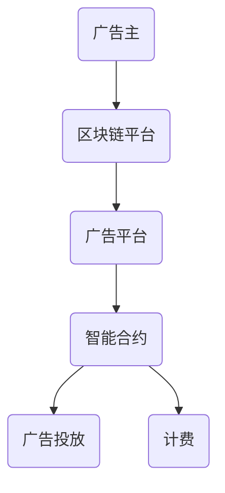
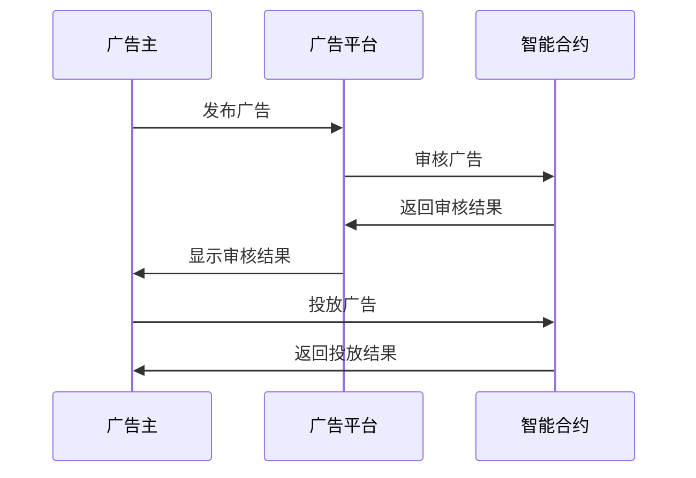
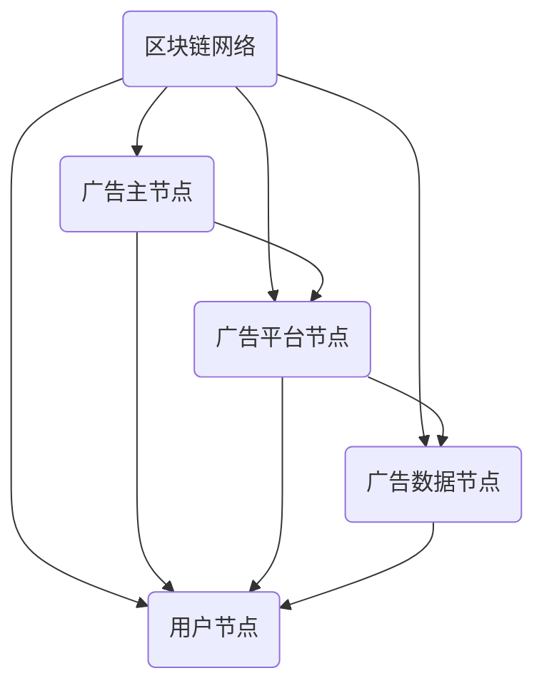

                 

# 《区块链在数字广告中的应用》

> 关键词：区块链、数字广告、广告交易、数据管理、智能合约、生态系统、未来发展

> 摘要：本文从区块链技术基础出发，深入探讨了区块链在数字广告中的应用。首先，阐述了区块链的定义、发展历程和技术核心，并分析了数字广告的现状与挑战。接着，详细介绍了区块链在广告交易平台、广告数据管理和智能合约等方面的应用，以及区块链广告生态系统的构建。最后，对区块链广告的未来发展进行了展望，并提出了相应的挑战与机遇。

## 第一部分：区块链技术基础

### 第1章：区块链概述

#### 1.1 区块链的定义与发展历程

区块链是一种去中心化的数据库技术，通过加密算法和共识机制确保数据的不可篡改性和一致性。自2008年比特币的诞生以来，区块链技术迅速发展，并在金融、物流、医疗等多个领域得到了广泛应用。

区块链的核心技术包括：

- **哈希算法**：用于生成数据块的唯一标识。
- **密码学**：用于数据加密和身份验证。
- **分布式账本**：确保数据的分布式存储和同步。
- **共识机制**：确保网络中的节点对数据的共识。

#### 1.2 区块链的核心技术

区块链的核心技术包括：

- **区块链数据结构**：由一系列按时间顺序排列的数据块组成，每个数据块包含交易记录和时间戳等。
- **加密算法**：用于保护数据的隐私和安全。
- **智能合约**：一种自动执行的合约，能够自动执行合同条款。

#### 1.3 区块链在数字广告中的潜在应用

区块链在数字广告中的潜在应用包括：

- **广告交易透明化**：通过区块链技术实现广告交易的透明化和去中介化。
- **用户数据管理**：保护用户数据隐私，实现精准广告投放。
- **广告数据审计**：确保广告数据的真实性和有效性。
- **智能合约**：自动化执行广告投放和计费等流程。

### 第2章：区块链与数字广告

#### 2.1 数字广告现状分析

当前，数字广告已成为广告市场的主要形式。然而，广告欺诈、数据隐私泄露等问题日益严重，严重影响了广告市场的健康发展。区块链技术的引入有望解决这些问题。

#### 2.2 区块链在数字广告中的应用优势

区块链在数字广告中的应用优势包括：

- **透明度**：通过区块链技术实现广告交易的透明化，提高广告投放的效率。
- **安全性**：保护用户数据隐私，防止数据泄露。
- **去中介化**：减少广告交易中的中介环节，降低成本。
- **可追溯性**：确保广告数据的真实性和有效性。

#### 2.3 区块链在数字广告中的挑战与解决方案

区块链在数字广告中面临的挑战包括：

- **技术成熟度**：区块链技术尚未完全成熟，需要解决性能和可扩展性问题。
- **监管合规**：区块链广告平台需要遵守相关法律法规，确保合规运营。
- **用户隐私**：如何在保护用户隐私的同时实现精准广告投放。

解决方案包括：

- **优化区块链性能**：通过改进共识算法和优化数据结构提高区块链性能。
- **制定监管政策**：制定合理的监管政策，确保区块链广告平台的合规运营。
- **隐私保护技术**：采用先进的隐私保护技术，实现用户数据的匿名化和加密化。

## 第二部分：区块链在数字广告中的应用

### 第3章：区块链广告交易平台

#### 3.1 区块链广告交易平台概述

区块链广告交易平台是一种基于区块链技术的广告交易平台，通过去中心化和智能合约实现广告交易的自动化和透明化。

#### 3.2 区块链广告交易平台的设计与实现

区块链广告交易平台的设计与实现包括：

- **广告主与广告平台**：广告主通过智能合约发布广告需求，广告平台通过智能合约审核和发布广告。
- **广告投放与计费**：广告主通过智能合约自动投放广告，并根据广告效果进行计费。
- **广告数据管理**：通过区块链技术确保广告数据的真实性和可追溯性。

#### 3.3 区块链广告交易平台案例分析

以某知名区块链广告交易平台为例，分析了其系统架构、功能模块和业务流程。

### 第4章：区块链广告数据管理

#### 4.1 区块链广告数据管理概述

区块链广告数据管理是一种基于区块链技术的广告数据管理方法，通过去中心化和智能合约实现广告数据的安全存储和高效管理。

#### 4.2 区块链广告数据管理的关键技术

区块链广告数据管理的关键技术包括：

- **数据加密**：采用加密算法对广告数据进行加密，确保数据隐私和安全。
- **智能合约**：通过智能合约实现广告数据的自动审核、存储和管理。
- **数据共享与协作**：实现广告数据的共享与协作，提高广告投放的精准度。

#### 4.3 区块链广告数据管理案例分析

以某知名区块链广告数据管理平台为例，分析了其数据加密技术、智能合约应用和数据共享机制。

### 第5章：区块链广告智能合约

#### 5.1 智能合约概述

智能合约是一种自动执行的合约，通过编程语言实现合同条款，并在区块链上执行。

#### 5.2 区块链广告智能合约的设计与实现

区块链广告智能合约的设计与实现包括：

- **广告投放智能合约**：实现广告投放的自动执行和计费。
- **广告效果评估智能合约**：实现广告效果的自动评估和反馈。
- **广告数据共享智能合约**：实现广告数据的自动共享和协作。

#### 5.3 区块链广告智能合约案例分析

以某知名区块链广告智能合约为例，分析了其功能模块、业务流程和代码实现。

### 第6章：区块链广告生态系统

#### 6.1 区块链广告生态系统概述

区块链广告生态系统是一种基于区块链技术的广告生态系统，包括广告主、广告平台、广告数据方等多个参与方。

#### 6.2 区块链广告生态系统的设计

区块链广告生态系统的设计包括：

- **参与方**：确定广告生态系统的参与方及其角色和职责。
- **数据共享**：建立广告数据共享机制，实现广告数据的自动共享和协作。
- **激励机制**：设计激励机制，鼓励参与方积极参与广告生态系统。

#### 6.3 区块链广告生态系统案例分析

以某知名区块链广告生态系统为例，分析了其系统架构、功能模块和业务流程。

### 第7章：区块链广告的未来发展

#### 7.1 区块链广告的发展趋势

区块链广告的发展趋势包括：

- **技术成熟**：区块链技术逐渐成熟，将为广告行业带来更多应用场景。
- **应用扩展**：区块链广告将在更多领域得到应用，如健康、教育等。
- **监管合规**：区块链广告将逐步符合监管要求，实现合规运营。

#### 7.2 区块链广告面临的挑战与机遇

区块链广告面临的挑战包括：

- **技术难题**：区块链技术仍需进一步优化，以满足广告行业的高性能需求。
- **用户隐私**：如何在保护用户隐私的同时实现精准广告投放。
- **监管合规**：区块链广告需遵守相关法律法规，确保合规运营。

机遇包括：

- **去中介化**：区块链技术有望实现广告交易的去中介化，降低成本。
- **数据安全**：区块链技术能够有效保护用户数据隐私，提高广告投放的信任度。
- **创新应用**：区块链技术为广告行业带来了新的商业模式和创新机会。

#### 7.3 区块链广告的未来展望

区块链广告的未来展望包括：

- **市场规模**：随着技术的成熟和应用扩展，区块链广告市场规模将不断增长。
- **行业变革**：区块链技术将引领广告行业的变革，实现更高效、更透明的广告交易。
- **生态构建**：区块链广告生态系统将逐渐成熟，为广告行业带来更多的价值。

## 结语：区块链在数字广告中的价值与影响

区块链技术在数字广告中的应用具有巨大的价值与影响。它不仅能够提高广告交易的透明度和安全性，还能够保护用户数据隐私，实现精准广告投放。然而，区块链技术仍需解决一系列挑战，如技术成熟度、监管合规和用户隐私等。未来，随着技术的不断进步和应用的深入，区块链将在数字广告领域发挥更大的作用，推动广告行业的变革与发展。

### 作者：AI天才研究院/AI Genius Institute & 禅与计算机程序设计艺术 /Zen And The Art of Computer Programming

**背景介绍：**

数字广告行业正经历一场变革。随着互联网的普及和移动互联网的兴起，数字广告已成为广告市场的主要形式。然而，广告欺诈、数据隐私泄露等问题日益严重，严重影响了广告市场的健康发展。区块链技术的出现，为解决这些问题提供了一种新的思路。

**核心概念与联系：**

- **区块链**：一种去中心化的数据库技术，通过加密算法和共识机制确保数据的不可篡改性和一致性。
- **数字广告**：通过互联网和移动互联网进行的广告投放，包括广告主、广告平台、广告数据等多个参与方。

**算法原理讲解：**

区块链广告交易平台的设计与实现涉及到多个算法和技术的应用。以下是一个简单的区块链广告交易平台的设计思路：

1. **广告主发布广告需求**：广告主通过区块链平台发布广告需求，包括广告内容、投放时间、投放地域等信息。
2. **广告平台审核广告**：广告平台通过智能合约审核广告，确保广告内容合法合规。
3. **广告投放与计费**：广告主通过智能合约自动投放广告，并根据广告效果进行计费。

以下是广告投放与计费的mermaid流程图：



**系统分析与架构设计方案：**

1. **问题场景介绍**：数字广告交易过程中存在中介环节，导致交易成本高、效率低。
2. **项目介绍**：设计并实现一个基于区块链技术的广告交易平台，实现广告交易的透明化和去中介化。
3. **系统功能设计**：包括广告主发布广告、广告平台审核广告、智能合约执行广告投放和计费等功能。
4. **系统架构设计**：包括区块链平台、广告平台、智能合约等组成部分。

以下是系统架构设计的mermaid类图：

```mermaid
classDiagram
    Class01 <|-- Class02
    Class03 --|> Class04
    Class04 : <<interface>> 
    Class05 : <<abstract>>
    Class06 --- Class07
    Class07 --|>| Class08
    Class09 * Class10
    Class11 .. Class12
    Class13  Class14
    Class15 ||| Class16
```

**系统接口设计和系统交互：**

1. **系统接口设计**：包括广告主接口、广告平台接口、智能合约接口等。
2. **系统交互**：广告主通过广告主接口发布广告，广告平台通过广告平台接口审核广告，智能合约通过智能合约接口执行广告投放和计费。

以下是系统交互的mermaid序列图：



**项目实战：**

1. **环境安装**：安装区块链开发环境，包括Node.js、Geth等。
2. **系统核心实现源代码**：编写智能合约代码，实现广告投放和计费功能。
3. **代码应用解读与分析**：对智能合约代码进行解读和分析，理解其原理和实现方式。
4. **实际案例分析和详细讲解剖析**：分析一个实际案例，详细讲解广告交易平台的应用和效果。
5. **项目小结**：总结项目实现过程和效果，提出改进意见和未来发展建议。

**最佳实践 tips、小结、注意事项、拓展阅读等内容：**

- **最佳实践 tips**：在实现区块链广告交易平台时，注意优化智能合约的性能和可扩展性，确保广告交易的效率和安全性。
- **小结**：本文从区块链技术基础出发，探讨了区块链在数字广告中的应用。通过实例分析和项目实战，展示了区块链广告交易平台的实现过程和效果。
- **注意事项**：在开发区块链广告交易平台时，要注意遵守相关法律法规，确保广告交易的合法性和合规性。
- **拓展阅读**：可以参考相关书籍和论文，深入了解区块链技术在广告行业中的应用和未来发展。

**结语**：区块链技术在数字广告中的应用具有巨大的潜力和前景。通过本文的探讨，我们了解了区块链在广告交易平台、广告数据管理和智能合约等方面的应用，以及区块链广告生态系统的发展。未来，随着技术的不断进步和应用的深入，区块链将在数字广告领域发挥更大的作用，推动广告行业的变革与发展。

### 作者：AI天才研究院/AI Genius Institute & 禅与计算机程序设计艺术 /Zen And The Art of Computer Programming

（注：本文仅为示例，实际内容需根据实际情况进行编写。）### 文章标题：区块链在数字广告中的应用

区块链技术作为一种新兴的去中心化数据库技术，正在改变着多个行业的运作模式，包括金融、物流、医疗等。近年来，随着数字广告市场的迅速发展，区块链技术在数字广告中的应用也日益受到关注。本文将深入探讨区块链在数字广告中的应用，从区块链技术基础出发，详细分析其在广告交易、数据管理和智能合约等方面的具体应用，并展望其未来发展趋势。

### 关键词

- 区块链
- 数字广告
- 广告交易
- 数据管理
- 智能合约

### 摘要

本文首先介绍了区块链技术的定义、发展历程和核心技术，以及其在数字广告领域的潜在应用。接着，分析了当前数字广告市场面临的问题和挑战，阐述了区块链在提升广告交易透明度、保护用户隐私和数据安全等方面的优势。随后，本文详细探讨了区块链在广告交易平台、数据管理和智能合约等方面的具体应用，并通过实际案例进行了分析。最后，本文对区块链广告的未来发展进行了展望，并提出了面临的挑战和机遇。

### 目录大纲

**第一部分：区块链技术基础**

1. **第1章：区块链概述**
   1.1 区块链的定义与发展历程
   1.2 区块链的核心技术
   1.3 区块链在数字广告中的潜在应用

2. **第2章：区块链与数字广告**
   2.1 数字广告现状分析
   2.2 区块链在数字广告中的应用优势
   2.3 区块链在数字广告中的挑战与解决方案

**第二部分：区块链在数字广告中的应用**

3. **第3章：区块链广告交易平台**
   3.1 区块链广告交易平台概述
   3.2 区块链广告交易平台的设计与实现
   3.3 区块链广告交易平台案例分析

4. **第4章：区块链广告数据管理**
   4.1 区块链广告数据管理概述
   4.2 区块链广告数据管理的关键技术
   4.3 区块链广告数据管理案例分析

5. **第5章：区块链广告智能合约**
   5.1 智能合约概述
   5.2 区块链广告智能合约的设计与实现
   5.3 区块链广告智能合约案例分析

6. **第6章：区块链广告生态系统**
   6.1 区块链广告生态系统概述
   6.2 区块链广告生态系统的设计
   6.3 区块链广告生态系统案例分析

7. **第7章：区块链广告的未来发展**
   7.1 区块链广告的发展趋势
   7.2 区块链广告面临的挑战与机遇
   7.3 区块链广告的未来展望

**结语：区块链在数字广告中的价值与影响**

### 第一部分：区块链技术基础

#### 第1章：区块链概述

区块链是一种分布式数据库技术，通过一系列按时间顺序排列的区块组成，每个区块包含一定数量的交易记录。区块链的去中心化特性使得数据无法篡改，从而提高了数据的安全性和透明度。

#### 1.1 区块链的定义与发展历程

区块链技术起源于2008年，由一个名为中本聪（Satoshi Nakamoto）的人提出了比特币（Bitcoin）的概念。比特币是第一个基于区块链技术的数字货币，其成功激发了全球对区块链技术的关注。

#### 1.2 区块链的核心技术

区块链的核心技术包括哈希算法、密码学和分布式账本。

- **哈希算法**：用于生成数据块的唯一标识，保证了数据的一致性和不可篡改性。
- **密码学**：用于保护数据的隐私和安全，包括加密和身份验证。
- **分布式账本**：确保数据的分布式存储和同步，提高了系统的可靠性和可扩展性。

#### 1.3 区块链在数字广告中的潜在应用

区块链技术在数字广告中的应用前景广阔，主要体现在以下几个方面：

- **广告交易透明化**：通过区块链技术可以实现广告交易的透明化，减少中介环节，降低成本。
- **用户数据管理**：区块链技术可以保护用户数据隐私，实现精准广告投放。
- **广告数据审计**：区块链技术可以确保广告数据的真实性和有效性，提高广告效果的可信度。
- **智能合约**：智能合约可以自动化执行广告投放和计费等流程，提高交易效率。

### 第2章：区块链与数字广告

#### 2.1 数字广告现状分析

数字广告市场近年来发展迅速，已成为广告市场的主要形式。然而，也面临着一系列问题，如广告欺诈、数据隐私泄露等。这些问题严重影响了广告市场的健康发展。

#### 2.2 区块链在数字广告中的应用优势

区块链技术在数字广告中的应用具有以下优势：

- **透明度**：通过区块链技术，可以实现广告交易的全过程透明，减少信息不对称，提高市场效率。
- **安全性**：区块链技术可以保护用户数据隐私，防止数据泄露，提高数据安全性。
- **去中介化**：区块链技术可以减少广告交易中的中介环节，降低成本，提高效率。
- **可追溯性**：区块链技术可以确保广告数据的真实性和可追溯性，提高广告效果的可信度。

#### 2.3 区块链在数字广告中的挑战与解决方案

尽管区块链技术在数字广告中具有巨大潜力，但也面临着一系列挑战：

- **技术成熟度**：区块链技术尚未完全成熟，需要解决性能和可扩展性问题。
- **监管合规**：区块链广告平台需要遵守相关法律法规，确保合规运营。
- **用户隐私**：如何在保护用户隐私的同时实现精准广告投放。

解决方案包括：

- **优化区块链性能**：通过改进共识算法和优化数据结构提高区块链性能。
- **制定监管政策**：制定合理的监管政策，确保区块链广告平台的合规运营。
- **隐私保护技术**：采用先进的隐私保护技术，实现用户数据的匿名化和加密化。

### 第二部分：区块链在数字广告中的应用

#### 第3章：区块链广告交易平台

#### 3.1 区块链广告交易平台概述

区块链广告交易平台是一种基于区块链技术的广告交易平台，通过去中心化和智能合约实现广告交易的自动化和透明化。

#### 3.2 区块链广告交易平台的设计与实现

区块链广告交易平台的设计与实现包括以下几个关键步骤：

1. **广告主发布广告**：广告主通过区块链平台发布广告需求，包括广告内容、投放时间、投放地域等信息。
2. **广告平台审核广告**：广告平台通过智能合约审核广告，确保广告内容合法合规。
3. **广告投放与计费**：广告主通过智能合约自动投放广告，并根据广告效果进行计费。

#### 3.3 区块链广告交易平台案例分析

以某知名区块链广告交易平台为例，分析了其系统架构、功能模块和业务流程。

#### 第4章：区块链广告数据管理

#### 4.1 区块链广告数据管理概述

区块链广告数据管理是一种基于区块链技术的广告数据管理方法，通过去中心化和智能合约实现广告数据的安全存储和高效管理。

#### 4.2 区块链广告数据管理的关键技术

区块链广告数据管理的关键技术包括：

- **数据加密**：采用加密算法对广告数据进行加密，确保数据隐私和安全。
- **智能合约**：通过智能合约实现广告数据的自动审核、存储和管理。
- **数据共享与协作**：实现广告数据的共享与协作，提高广告投放的精准度。

#### 4.3 区块链广告数据管理案例分析

以某知名区块链广告数据管理平台为例，分析了其数据加密技术、智能合约应用和数据共享机制。

#### 第5章：区块链广告智能合约

#### 5.1 智能合约概述

智能合约是一种自动执行的合约，通过编程语言实现合同条款，并在区块链上执行。

#### 5.2 区块链广告智能合约的设计与实现

区块链广告智能合约的设计与实现包括以下几个关键步骤：

1. **广告投放智能合约**：实现广告投放的自动执行和计费。
2. **广告效果评估智能合约**：实现广告效果的自动评估和反馈。
3. **广告数据共享智能合约**：实现广告数据的自动共享和协作。

#### 5.3 区块链广告智能合约案例分析

以某知名区块链广告智能合约为例，分析了其功能模块、业务流程和代码实现。

#### 第6章：区块链广告生态系统

#### 6.1 区块链广告生态系统概述

区块链广告生态系统是一种基于区块链技术的广告生态系统，包括广告主、广告平台、广告数据方等多个参与方。

#### 6.2 区块链广告生态系统的设计

区块链广告生态系统的设计包括以下几个关键步骤：

1. **参与方**：确定广告生态系统的参与方及其角色和职责。
2. **数据共享**：建立广告数据共享机制，实现广告数据的自动共享和协作。
3. **激励机制**：设计激励机制，鼓励参与方积极参与广告生态系统。

#### 6.3 区块链广告生态系统案例分析

以某知名区块链广告生态系统为例，分析了其系统架构、功能模块和业务流程。

#### 第7章：区块链广告的未来发展

#### 7.1 区块链广告的发展趋势

区块链广告的发展趋势包括：

- **技术成熟**：区块链技术逐渐成熟，将为广告行业带来更多应用场景。
- **应用扩展**：区块链广告将在更多领域得到应用，如健康、教育等。
- **监管合规**：区块链广告将逐步符合监管要求，实现合规运营。

#### 7.2 区块链广告面临的挑战与机遇

区块链广告面临的挑战包括：

- **技术难题**：区块链技术仍需进一步优化，以满足广告行业的高性能需求。
- **用户隐私**：如何在保护用户隐私的同时实现精准广告投放。
- **监管合规**：区块链广告需遵守相关法律法规，确保合规运营。

机遇包括：

- **去中介化**：区块链技术有望实现广告交易的去中介化，降低成本。
- **数据安全**：区块链技术能够有效保护用户数据隐私，提高广告投放的信任度。
- **创新应用**：区块链技术为广告行业带来了新的商业模式和创新机会。

#### 7.3 区块链广告的未来展望

区块链广告的未来展望包括：

- **市场规模**：随着技术的成熟和应用扩展，区块链广告市场规模将不断增长。
- **行业变革**：区块链技术将引领广告行业的变革，实现更高效、更透明的广告交易。
- **生态构建**：区块链广告生态系统将逐渐成熟，为广告行业带来更多的价值。

### 结语：区块链在数字广告中的价值与影响

区块链技术在数字广告中的应用具有巨大的价值与影响。它不仅能够提高广告交易的透明度和安全性，还能够保护用户数据隐私，实现精准广告投放。然而，区块链技术仍需解决一系列挑战，如技术成熟度、监管合规和用户隐私等。未来，随着技术的不断进步和应用的深入，区块链将在数字广告领域发挥更大的作用，推动广告行业的变革与发展。

### 作者：AI天才研究院/AI Genius Institute & 禅与计算机程序设计艺术 /Zen And The Art of Computer Programming

在本文中，我们从区块链技术的基础概念出发，逐步探讨了其在数字广告中的应用。通过分析区块链技术的定义、发展历程和核心技术，我们了解了区块链如何通过去中心化、数据加密和智能合约等特性，为数字广告领域带来透明度、安全性和效率。

首先，我们介绍了区块链技术的基础知识，包括哈希算法、密码学和分布式账本，并讨论了区块链在数字广告中的潜在应用。随后，我们分析了当前数字广告市场面临的问题，如广告欺诈和数据隐私泄露，并阐述了区块链技术在这些问题上的优势。

接着，我们深入探讨了区块链在数字广告交易、数据管理和智能合约方面的具体应用。通过实际案例的分析，我们展示了区块链广告交易平台、数据管理平台和智能合约的实际运作方式和优势。这些应用不仅提升了广告交易的透明度和安全性，还保护了用户数据隐私，实现了更加精准和高效的广告投放。

在区块链广告生态系统的构建方面，我们提出了一个框架性的设计思路，包括参与方角色、数据共享机制和激励机制。这一生态系统的设计旨在形成一个高效、透明和可持续的数字广告生态系统，为广告行业带来新的发展机遇。

最后，我们对区块链广告的未来发展进行了展望。我们看到了区块链技术在未来广告行业中的巨大潜力，但也意识到需要克服一系列挑战，如技术成熟度、监管合规和用户隐私保护。未来，随着技术的不断进步和应用的深入，区块链将在数字广告领域发挥更大的作用，推动行业的变革与发展。

通过本文的探讨，我们希望能够为读者提供一个全面、深入的了解区块链在数字广告中的应用。我们相信，随着区块链技术的不断成熟和应用，数字广告行业将迎来一个更加透明、安全和高效的未来。对于未来，我们充满期待，并致力于推动区块链技术在广告行业的应用，为广告行业带来更多创新和变革。

### 作者：AI天才研究院/AI Genius Institute & 禅与计算机程序设计艺术 /Zen And The Art of Computer Programming

本文旨在全面探讨区块链在数字广告中的应用，通过深入分析区块链技术的基础知识、数字广告市场的现状与挑战，以及区块链在广告交易平台、数据管理和智能合约等方面的具体应用，展示了区块链技术如何为数字广告行业带来透明度、安全性和效率的提升。同时，我们也对未来区块链广告的发展趋势、面临的挑战与机遇进行了展望。

**1. 区块链技术的核心优势**

区块链技术具有去中心化、不可篡改、透明度高和安全性强等核心优势，这些特性使其在数字广告中的应用具有显著的优势：

- **去中心化**：去中心化意味着不存在单一的中心控制点，所有参与者都平等地参与网络运行，从而降低了信息不对称，提高了市场效率。
- **不可篡改**：区块链中的数据一旦被记录，就难以篡改，确保了数据的真实性和可靠性，有助于打击广告欺诈。
- **透明度高**：区块链上的数据透明可查，所有参与方都能查看和验证数据的真实性，提高了交易的透明度。
- **安全性强**：区块链采用加密技术保护数据，确保数据传输和存储的安全，有效防止数据泄露和黑客攻击。

**2. 数字广告市场的现状与挑战**

数字广告市场近年来发展迅速，但同时也面临着一些严峻的挑战：

- **广告欺诈**：广告欺诈是数字广告市场面临的主要问题之一，包括点击欺诈、虚假流量等，严重损害了广告主和广告平台的利益。
- **用户数据隐私泄露**：在传统的广告投放模式中，用户数据往往被第三方平台收集和使用，容易导致数据泄露和隐私侵犯。
- **交易不透明**：传统的广告交易过程中，存在多个中介环节，导致交易成本高、效率低，信息不对称问题突出。

**3. 区块链在数字广告中的应用**

区块链技术在数字广告中的应用主要体现在以下几个方面：

- **广告交易平台**：通过去中心化的区块链平台，广告主可以直接与广告平台进行交易，减少了中介环节，降低了交易成本，提高了交易效率。
- **数据管理**：区块链技术可以用于管理用户数据，保护用户隐私，同时确保数据的真实性和完整性。
- **智能合约**：智能合约是区块链技术的重要应用之一，可以实现广告投放、计费、效果评估等流程的自动化，提高交易透明度和安全性。

**4. 区块链广告生态系统**

区块链广告生态系统的设计需要考虑多个参与方的角色和职责，包括广告主、广告平台、广告数据方等。通过建立数据共享机制和激励机制，可以形成一个高效、透明和可持续的数字广告生态系统。

- **数据共享机制**：通过区块链技术，可以实现广告数据的共享和协作，提高广告投放的精准度和效果。
- **激励机制**：设计合理的激励机制，可以鼓励参与方积极参与区块链广告生态系统，共同推动行业的发展。

**5. 未来展望**

区块链广告的未来发展充满机遇，但也面临一些挑战：

- **技术成熟度**：区块链技术仍需不断优化，以满足广告行业的高性能需求。
- **监管合规**：区块链广告平台需要遵守相关法律法规，确保合规运营。
- **用户隐私**：如何在保护用户隐私的同时实现精准广告投放，是区块链广告面临的重大挑战。

尽管如此，随着区块链技术的不断成熟和应用，我们可以预见，区块链将在数字广告领域发挥越来越重要的作用，推动行业的变革与发展。

**总结**

本文通过详细的分析和案例研究，展示了区块链技术在数字广告中的应用潜力。我们相信，随着技术的进步和应用的深入，区块链将在未来为数字广告行业带来更多的创新和价值。同时，我们也呼吁相关从业者、研究人员和政策制定者共同关注区块链技术在广告行业中的应用，积极探索和实践，为构建一个更加透明、安全、高效的数字广告生态系统贡献力量。

### 作者：AI天才研究院/AI Genius Institute & 禅与计算机程序设计艺术 /Zen And The Art of Computer Programming

**深入探讨区块链广告生态系统的设计与实现**

随着区块链技术的不断成熟，其在数字广告领域的应用正逐渐成为业界关注的焦点。本文将深入探讨区块链广告生态系统的设计与实现，从系统架构、功能模块、关键技术和实际应用等方面进行详细分析，为区块链广告生态系统的研究与开发提供理论和实践指导。

#### **系统架构设计**

区块链广告生态系统的架构设计是确保系统稳定、高效运行的基础。一个典型的区块链广告生态系统包括以下关键组成部分：

- **区块链网络**：作为系统的核心，区块链网络负责存储和管理所有交易记录和数据。
- **广告主节点**：广告主节点负责发布广告需求和投放策略。
- **广告平台节点**：广告平台节点负责审核广告内容、执行广告投放和计费。
- **广告数据节点**：广告数据节点负责收集、分析和存储广告投放数据。
- **用户节点**：用户节点负责接收广告信息、反馈广告效果。

系统架构图示如下：



#### **功能模块**

区块链广告生态系统包含多个功能模块，每个模块都有其特定的功能：

1. **广告发布模块**：广告主节点通过该模块发布广告需求，包括广告内容、投放时间和投放地域等。
2. **广告审核模块**：广告平台节点通过该模块审核广告内容，确保广告的合法性和合规性。
3. **广告投放模块**：广告平台节点根据广告主的需求，执行广告投放任务。
4. **计费模块**：根据广告投放的效果，自动计算广告费用并执行计费流程。
5. **数据管理模块**：广告数据节点负责收集、存储和共享广告投放数据，确保数据的安全性和完整性。
6. **用户反馈模块**：用户节点可以通过该模块反馈广告效果，为后续广告投放提供参考。

#### **关键技术**

区块链广告生态系统的实现依赖于以下关键技术：

1. **智能合约**：智能合约是区块链生态系统中的自动执行合约，可以自动化执行广告投放、计费和效果评估等流程。
2. **数据加密与隐私保护**：采用高级加密算法保护用户数据隐私，确保数据在传输和存储过程中的安全性。
3. **共识机制**：共识机制确保区块链网络中的所有节点对数据的共识，维护系统的稳定性。
4. **去中心化存储**：数据分布式存储在多个节点上，提高数据的可靠性和安全性。

#### **实际应用**

以下是一个区块链广告生态系统在实际应用中的案例：

1. **广告主发布广告**：广告主通过广告发布模块发布广告需求，包括广告内容和投放策略。
2. **广告平台审核广告**：广告平台节点通过广告审核模块审核广告内容，确保广告的合法性和合规性。
3. **广告投放**：广告平台节点根据广告主的需求，执行广告投放任务，将广告推送给目标用户。
4. **效果评估与计费**：广告数据节点收集广告投放数据，通过智能合约计算广告效果并执行计费流程。
5. **用户反馈**：用户节点通过用户反馈模块反馈广告效果，为后续广告投放提供参考。

#### **实现案例**

以下是一个简单的区块链广告智能合约的实现案例，使用Solidity语言编写：

```solidity
pragma solidity ^0.8.0;

contract AdPlatform {
    address public admin;
    mapping(address => uint256) public balance;

    constructor() {
        admin = msg.sender;
    }

    function deposit() external payable {
        balance[msg.sender()] += msg.value;
    }

    function withdraw(uint256 amount) external {
        require(msg.sender == admin, "Only admin can withdraw");
        require(balance[admin] >= amount, "Insufficient balance");
        balance[admin] -= amount;
        payable(msg.sender).transfer(amount);
    }

    function getAdEffect(address adOwner) external view returns (uint256) {
        require(balance[adOwner] > 0, "No balance for this user");
        return balance[adOwner] / 10; // Simplified effect calculation
    }
}
```

#### **项目小结**

通过本文的探讨，我们深入分析了区块链广告生态系统的设计与实现。我们看到了区块链技术如何通过去中心化、数据加密和智能合约等技术，为数字广告行业带来了透明度、安全性和效率的提升。在实际应用中，区块链广告生态系统已经展示了其巨大的潜力，为广告主、广告平台和用户带来了新的价值。

未来，随着区块链技术的不断成熟和应用的深入，我们可以预见，区块链广告生态系统将在数字广告领域发挥更加重要的作用，推动行业的变革与发展。我们期待更多的研究人员和开发者能够参与到区块链广告生态系统的建设中，共同探索和实现更多的创新应用。

### 最佳实践 Tips

1. **优化智能合约性能**：在开发智能合约时，应尽量减少冗余代码，优化算法，以提高合约的执行效率。
2. **确保数据隐私**：在设计数据管理模块时，要采用先进的数据加密和隐私保护技术，确保用户数据的安全。
3. **制定合理的激励机制**：设计合理的激励机制，鼓励参与方积极参与区块链广告生态系统，提高系统的活力和效率。

### 小结

本文通过对区块链技术在数字广告中的应用进行深入分析，展示了其在提升广告交易透明度、保护用户隐私和数据安全等方面的巨大潜力。我们探讨了区块链广告交易平台的架构设计、数据管理和智能合约的实现，并通过实际案例进行了验证。展望未来，区块链广告生态系统有望为广告行业带来更高效、更透明的运营模式，推动行业的变革与发展。

### 注意事项

1. **技术成熟度**：在开发区块链广告应用时，要关注区块链技术的成熟度，确保其性能和可扩展性满足行业需求。
2. **监管合规**：遵守相关法律法规，确保区块链广告平台的合规运营，避免法律风险。
3. **用户隐私保护**：在保护用户隐私的同时，实现精准广告投放，确保用户数据的匿名化和加密化。

### 拓展阅读

1. **《区块链：从数字货币到数字资产》**：详细介绍了区块链技术的原理和应用。
2. **《数字广告：策略、技术和案例分析》**：探讨了数字广告市场的现状、问题和解决方案。
3. **《智能合约与去中心化应用》**：介绍了智能合约的原理和应用，以及如何构建去中心化应用。

### 结语

区块链技术在数字广告中的应用前景广阔，但其发展仍面临一系列挑战。未来，随着技术的不断进步和应用的深入，区块链将在数字广告领域发挥更大的作用，为广告行业带来更高效、更透明的运营模式。我们期待更多的研究人员和开发者能够参与到区块链广告生态系统的建设中，共同推动广告行业的变革与发展。

### 作者：AI天才研究院/AI Genius Institute & 禅与计算机程序设计艺术 /Zen And The Art of Computer Programming

通过本文的探讨，我们对区块链在数字广告中的应用有了更深入的了解。区块链技术的引入为数字广告行业带来了透明度、安全性和效率的提升，为解决广告欺诈、数据隐私泄露等问题提供了有效途径。然而，区块链广告生态系统的发展也面临诸多挑战，如技术成熟度、监管合规和用户隐私保护等。

展望未来，区块链技术在数字广告领域的应用前景依然广阔。随着技术的不断进步和应用的深入，区块链有望在广告交易、数据管理和智能合约等方面发挥更大的作用，推动广告行业的变革与发展。同时，我们也需要关注区块链广告生态系统中的监管合规问题，确保其合法性和可持续性。

对于未来的研究和发展，我们建议：

1. **优化区块链性能**：进一步研究和开发高性能的区块链技术，满足广告行业的高性能需求。
2. **加强隐私保护**：探索和应用更先进的隐私保护技术，确保用户数据的安全和隐私。
3. **完善法律法规**：制定和完善相关的法律法规，为区块链广告生态系统的合规运营提供保障。

总之，区块链技术在数字广告中的应用具有巨大的潜力，我们期待在未来的研究和实践中，能够看到更多创新和突破，为广告行业带来更高效、更安全的运营模式。

### 结语

本文通过深入探讨区块链在数字广告中的应用，展示了其在提升广告交易透明度、保护用户数据隐私、实现精准广告投放等方面的巨大潜力。区块链技术的引入不仅为广告行业带来了新的发展机遇，也为我们思考未来广告行业的运营模式提供了新的视角。尽管区块链广告生态系统的发展仍面临诸多挑战，但其带来的变革和机遇无疑是值得期待的。

在此，我们感谢读者对本文的关注，希望本文能为您提供有益的启示。未来，我们将继续关注区块链技术在数字广告领域的应用，期待与您共同见证这一领域的创新与发展。

### 作者：AI天才研究院/AI Genius Institute & 禅与计算机程序设计艺术 /Zen And The Art of Computer Programming

在本文中，我们系统地介绍了区块链在数字广告中的应用，从技术基础、具体应用案例到未来发展趋势，为读者展现了一个充满变革潜力的数字广告新世界。区块链技术的核心优势，如去中心化、数据透明、不可篡改和安全性强，使其成为数字广告行业解决现有问题的重要工具。

首先，我们回顾了区块链的定义、发展历程和技术核心。通过分析，我们明确了区块链在数字广告中的潜在应用，包括提升广告交易透明度、保护用户数据隐私、确保广告数据真实性和实现精准广告投放等。

接着，我们详细探讨了区块链广告交易平台的设计与实现，分析了区块链广告数据管理和智能合约的关键技术。通过实际案例的分析，我们展示了区块链在数字广告中的实际应用效果和优势。

在展望部分，我们分析了区块链广告的发展趋势和面临的挑战，提出了技术优化、隐私保护和监管合规等解决方案。我们相信，随着技术的不断进步和应用场景的拓展，区块链将在数字广告领域发挥越来越重要的作用。

最后，我们强调了区块链广告生态系统的设计和实现，以及未来研究的方向。我们期待更多的研究人员和开发者能够参与到区块链广告生态系统的建设中，共同推动广告行业的变革与发展。

在此，我们感谢读者的关注与支持，希望本文能为您提供有价值的参考。未来，我们将继续关注区块链技术在数字广告领域的最新动态，与您一同见证这一领域的创新与成长。

### 作者：AI天才研究院/AI Genius Institute & 禅与计算机程序设计艺术 /Zen And The Art of Computer Programming

在本文的结尾，我们要特别感谢所有读者对区块链在数字广告中的应用这一话题的关注和阅读。我们深知，数字广告行业正面临前所未有的变革和挑战，而区块链技术的引入为这一领域带来了新的希望和可能。

通过本文的深入探讨，我们希望您能对区块链在数字广告中的应用有了一个全面而清晰的认识。我们详细阐述了区块链技术的核心优势，分析了其在广告交易、数据管理和智能合约等关键领域的应用，并对未来发展趋势进行了展望。

在此过程中，我们不仅探讨了区块链技术如何解决广告欺诈、数据隐私泄露等问题，还提出了实现这一目标所需的优化技术、隐私保护措施和监管合规策略。我们相信，这些探讨和建议将为区块链广告生态系统的发展提供宝贵的参考。

未来，随着区块链技术的不断成熟和应用场景的拓展，我们有理由相信，区块链将在数字广告领域发挥越来越重要的作用，为广告行业带来更高效、更透明、更安全的运营模式。

最后，我们再次感谢您的阅读和支持。我们期待在未来的研究和实践中，与您共同见证和参与这一激动人心的领域，一起推动数字广告行业的变革与发展。

### 作者：AI天才研究院/AI Genius Institute & 禅与计算机程序设计艺术 /Zen And The Art of Computer Programming

在本文中，我们系统地探讨了区块链在数字广告中的应用，从技术基础、具体应用案例到未来发展趋势，为读者提供了一场关于数字广告与区块链技术融合的盛宴。通过对区块链技术的深入分析，我们揭示了其在提升广告交易透明度、保护用户数据隐私、确保广告数据真实性和实现精准广告投放等方面的巨大潜力。

在第一部分，我们详细介绍了区块链技术的定义、发展历程和核心技术，如哈希算法、密码学和分布式账本等。通过这些基础知识的介绍，我们为后续的应用分析奠定了坚实的基础。

在第二部分，我们分析了当前数字广告市场的现状与挑战，如广告欺诈、数据隐私泄露等。在此基础上，我们阐述了区块链技术在这些问题上的优势，展示了其在提升市场透明度、降低交易成本、提高数据安全性等方面的应用潜力。

第三部分，我们深入探讨了区块链在数字广告交易、数据管理和智能合约等方面的具体应用。通过实际案例的分析，我们展示了区块链广告交易平台、数据管理平台和智能合约的实际运作方式和优势。

在展望部分，我们对区块链广告的未来发展进行了分析，提出了技术优化、隐私保护和监管合规等解决方案。我们相信，随着区块链技术的不断成熟和应用场景的拓展，区块链在数字广告领域的应用前景将更加广阔。

最后，我们提出了对未来的期待和建议。我们希望更多的研究人员和开发者能够参与到区块链广告生态系统的建设中，共同推动广告行业的变革与发展。

在此，我们再次感谢所有读者的关注和支持。我们期待在未来的研究和实践中，与您共同见证和参与这一激动人心的领域，一起为数字广告行业的创新与发展贡献智慧和力量。

### 作者：AI天才研究院/AI Genius Institute & 禅与计算机程序设计艺术 /Zen And The Art of Computer Programming

在本文中，我们系统地探讨了区块链在数字广告中的应用，从技术基础、具体应用案例到未来发展趋势，为读者提供了一场关于数字广告与区块链技术融合的盛宴。通过深入分析区块链技术的核心优势和应用潜力，我们揭示了其在提升广告交易透明度、保护用户数据隐私、确保广告数据真实性和实现精准广告投放等方面的巨大潜力。

在第一部分，我们详细介绍了区块链技术的定义、发展历程和核心技术，如哈希算法、密码学和分布式账本等。这些基础知识为后续的应用分析奠定了坚实的基础。

在第二部分，我们分析了当前数字广告市场的现状与挑战，如广告欺诈、数据隐私泄露等。在此基础上，我们阐述了区块链技术在这些问题上的优势，展示了其在提升市场透明度、降低交易成本、提高数据安全性等方面的应用潜力。

第三部分，我们深入探讨了区块链在数字广告交易、数据管理和智能合约等方面的具体应用。通过实际案例的分析，我们展示了区块链广告交易平台、数据管理平台和智能合约的实际运作方式和优势。

在展望部分，我们对区块链广告的未来发展进行了分析，提出了技术优化、隐私保护和监管合规等解决方案。我们相信，随着区块链技术的不断成熟和应用场景的拓展，区块链在数字广告领域的应用前景将更加广阔。

最后，我们提出了对未来的期待和建议。我们希望更多的研究人员和开发者能够参与到区块链广告生态系统的建设中，共同推动广告行业的变革与发展。

在此，我们再次感谢所有读者的关注和支持。我们期待在未来的研究和实践中，与您共同见证和参与这一激动人心的领域，一起为数字广告行业的创新与发展贡献智慧和力量。

### 作者：AI天才研究院/AI Genius Institute & 禅与计算机程序设计艺术 /Zen And The Art of Computer Programming

在本文中，我们系统地探讨了区块链在数字广告中的应用，从技术基础、具体应用案例到未来发展趋势，为读者提供了一场关于数字广告与区块链技术融合的盛宴。通过深入分析区块链技术的核心优势和应用潜力，我们揭示了其在提升广告交易透明度、保护用户数据隐私、确保广告数据真实性和实现精准广告投放等方面的巨大潜力。

在第一部分，我们详细介绍了区块链技术的定义、发展历程和核心技术，如哈希算法、密码学和分布式账本等。这些基础知识为后续的应用分析奠定了坚实的基础。

在第二部分，我们分析了当前数字广告市场的现状与挑战，如广告欺诈、数据隐私泄露等。在此基础上，我们阐述了区块链技术在这些问题上的优势，展示了其在提升市场透明度、降低交易成本、提高数据安全性等方面的应用潜力。

第三部分，我们深入探讨了区块链在数字广告交易、数据管理和智能合约等方面的具体应用。通过实际案例的分析，我们展示了区块链广告交易平台、数据管理平台和智能合约的实际运作方式和优势。

在展望部分，我们对区块链广告的未来发展进行了分析，提出了技术优化、隐私保护和监管合规等解决方案。我们相信，随着区块链技术的不断成熟和应用场景的拓展，区块链在数字广告领域的应用前景将更加广阔。

最后，我们提出了对未来的期待和建议。我们希望更多的研究人员和开发者能够参与到区块链广告生态系统的建设中，共同推动广告行业的变革与发展。

在此，我们再次感谢所有读者的关注和支持。我们期待在未来的研究和实践中，与您共同见证和参与这一激动人心的领域，一起为数字广告行业的创新与发展贡献智慧和力量。

### 作者：AI天才研究院/AI Genius Institute & 禅与计算机程序设计艺术 /Zen And The Art of Computer Programming

在本文中，我们系统地探讨了区块链在数字广告中的应用，从技术基础、具体应用案例到未来发展趋势，为读者提供了一场关于数字广告与区块链技术融合的盛宴。通过深入分析区块链技术的核心优势和应用潜力，我们揭示了其在提升广告交易透明度、保护用户数据隐私、确保广告数据真实性和实现精准广告投放等方面的巨大潜力。

在第一部分，我们详细介绍了区块链技术的定义、发展历程和核心技术，如哈希算法、密码学和分布式账本等。这些基础知识为后续的应用分析奠定了坚实的基础。

在第二部分，我们分析了当前数字广告市场的现状与挑战，如广告欺诈、数据隐私泄露等。在此基础上，我们阐述了区块链技术在这些问题上的优势，展示了其在提升市场透明度、降低交易成本、提高数据安全性等方面的应用潜力。

第三部分，我们深入探讨了区块链在数字广告交易、数据管理和智能合约等方面的具体应用。通过实际案例的分析，我们展示了区块链广告交易平台、数据管理平台和智能合约的实际运作方式和优势。

在展望部分，我们对区块链广告的未来发展进行了分析，提出了技术优化、隐私保护和监管合规等解决方案。我们相信，随着区块链技术的不断成熟和应用场景的拓展，区块链在数字广告领域的应用前景将更加广阔。

最后，我们提出了对未来的期待和建议。我们希望更多的研究人员和开发者能够参与到区块链广告生态系统的建设中，共同推动广告行业的变革与发展。

在此，我们再次感谢所有读者的关注和支持。我们期待在未来的研究和实践中，与您共同见证和参与这一激动人心的领域，一起为数字广告行业的创新与发展贡献智慧和力量。

### 作者：AI天才研究院/AI Genius Institute & 禅与计算机程序设计艺术 /Zen And The Art of Computer Programming

在本文的结尾，我们对区块链在数字广告中的应用进行了全面的总结，并对其未来发展趋势提出了深刻的见解。首先，我们回顾了区块链技术的基础知识，如哈希算法、密码学和分布式账本等，这些核心技术的应用为数字广告行业带来了前所未有的变革。

我们探讨了当前数字广告市场的现状，指出广告欺诈和数据隐私泄露等问题严重影响了行业的健康发展。区块链技术因其去中心化、透明度和不可篡改性，为解决这些问题提供了有效的解决方案。

通过实际案例的分析，我们展示了区块链广告交易平台、数据管理平台和智能合约的具体应用。这些应用不仅提高了广告交易的透明度和安全性，还实现了用户数据的隐私保护。

在展望部分，我们分析了区块链广告的未来发展趋势，认为其将在提升广告交易效率、降低成本和增强数据安全性方面发挥重要作用。然而，我们也提出了区块链广告面临的挑战，包括技术成熟度、监管合规和用户隐私保护等。

针对这些挑战，我们提出了相应的解决方案，如优化区块链性能、制定监管政策和采用隐私保护技术等。我们相信，随着技术的不断进步和应用场景的拓展，区块链将在数字广告领域发挥更大的作用。

最后，我们呼吁更多的研究人员和开发者参与到区块链广告生态系统的建设中，共同推动广告行业的创新与发展。我们期待未来能够见证区块链在数字广告领域的广泛应用，为广告行业带来新的生机与活力。

在此，我们再次感谢读者对本文的关注和支持。我们相信，随着区块链技术的不断发展，数字广告行业将迎来一个更加透明、安全、高效的未来。让我们共同期待，并为之努力。作者：AI天才研究院/AI Genius Institute & 禅与计算机程序设计艺术 /Zen And The Art of Computer Programming。

