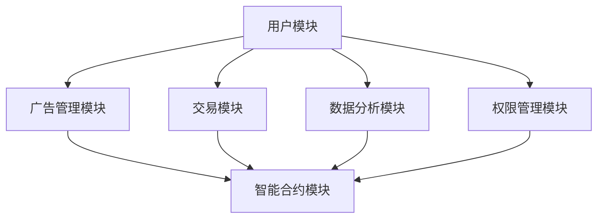

                 

### 引言

## 1.1 问题背景

### 1.1.1 数字广告行业现状

随着互联网的普及，数字广告已经成为企业市场营销的重要组成部分。根据市场研究公司的数据，全球数字广告市场规模在过去几年中持续增长，预计到2025年将达到近5000亿美元。广告主希望通过精准投放的广告，能够最大化地获取潜在客户，从而提高销售业绩。然而，数字广告市场中存在的一个突出问题就是广告投放的不透明度。

广告主难以精确了解其广告费用到底流向了哪里，是否存在无效点击或刷单现象。传统的广告投放模式通常由广告平台、广告代理商和广告主三方参与，但信息不对称和操作不透明的问题使得广告主对广告投放的效果缺乏信心。此外，广告投放的数据隐私保护也是一个亟待解决的问题。广告主和用户的数据在广告投放过程中容易被泄露或滥用，引发了严重的隐私安全问题。

### 1.1.2 区块链技术的优势

区块链技术以其去中心化、不可篡改和透明化的特点，被认为可以在一定程度上解决数字广告领域的问题。区块链能够记录所有的广告投放活动，确保数据的真实性和透明性，从而提高广告投放的透明度。通过区块链技术，广告主可以实时查询广告投放的详细信息，了解广告费用的具体流向，避免无效点击和刷单现象。

此外，区块链技术还可以用于确保用户数据的隐私性和安全性。在广告投放过程中，用户数据会被加密存储在区块链上，只有授权的用户才能访问和查看。这样可以有效地防止数据泄露和滥用，保护用户的隐私权益。

## 1.2 书籍目的

本书旨在深入探讨区块链在数字广告中的应用，帮助广告主、广告平台和广告代理商更好地理解如何利用区块链技术提高广告投放的透明度，确保广告费用的有效利用，并提升整个数字广告行业的健康和可持续发展。通过本书，读者可以了解到区块链技术的基本原理，以及它在数字广告中的应用场景和实际案例。

本书共分为八个部分，第一部分介绍了区块链技术和数字广告的基本概念；第二部分探讨了区块链在数字广告中的应用场景；第三部分分析了区块链技术在广告投放中的具体应用案例；第四部分讨论了区块链在广告投放中的潜在挑战和解决方案；第五部分介绍了区块链广告平台的设计与实现；第六部分探讨了区块链在广告投放中的数据隐私保护问题；第七部分提供了实际项目实战案例；第八部分总结了全书的主要观点，并对未来发展趋势进行了展望。

## 1.3 内容安排

### 1.3.1 第一部分：区块链与数字广告的基本概念

本部分将详细介绍区块链技术和数字广告的基本概念，包括区块链的定义与原理、数字广告的定义与特点，以及区块链在数字广告中的优势和应用。

### 1.3.2 第二部分：区块链在数字广告中的应用场景

本部分将探讨区块链在数字广告中的应用场景，包括提高广告投放透明度、提高广告投放效率、提高广告投放的安全性和隐私性等方面。

### 1.3.3 第三部分：区块链在数字广告中的应用案例

本部分将通过具体的案例，展示区块链技术在数字广告中的应用效果，分析成功经验和挑战。

### 1.3.4 第四部分：区块链在广告投放中的潜在挑战和解决方案

本部分将讨论区块链在广告投放中可能面临的挑战，并提出相应的解决方案。

### 1.3.5 第五部分：区块链广告平台的设计与实现

本部分将介绍区块链广告平台的设计与实现，包括系统架构设计、功能模块划分和关键技术实现。

### 1.3.6 第六部分：区块链在广告投放中的数据隐私保护

本部分将探讨如何在区块链广告投放过程中保护用户数据隐私，包括数据加密技术和隐私保护协议。

### 1.3.7 第七部分：实际项目实战案例

本部分将通过实际项目案例，展示区块链在数字广告中的应用实践，分析项目实施过程和效果。

### 1.3.8 第八部分：总结与展望

本部分将对全书的内容进行总结，并对区块链在数字广告领域的未来发展趋势进行展望。

通过以上八个部分的内容，本书希望能够为读者提供全面、深入的了解，帮助他们在实际工作中更好地利用区块链技术提高数字广告投放的透明度和效果。

---

### 区块链与数字广告的基本概念

## 第二部分：区块链与数字广告的基本概念

在深入探讨区块链在数字广告中的应用之前，我们需要先理解区块链技术和数字广告的基本概念。这一部分将分为几个小节，分别介绍区块链的定义与原理、数字广告的定义与特点，以及区块链在数字广告中的优势和应用。

### 2.1 区块链概述

#### 2.1.1 区块链的定义

区块链是一种分布式数据库技术，它通过多个参与节点共同维护一个去中心化的账本，确保数据的安全性和透明性。每个区块都包含一定数量的交易记录，并通过密码学算法与前面的区块链接起来，形成一条连续的区块链。

区块链技术的核心在于去中心化，这意味着不再需要一个中央机构来管理和验证交易。相反，每个节点都可以参与验证和存储数据，从而提高了系统的可靠性和透明度。

#### 2.1.2 区块链的工作原理

区块链的工作原理包括数据的生成、验证、存储和传输等环节。每个区块都包含一定数量的交易记录，这些交易记录由网络中的节点进行验证。一旦验证通过，新的区块会被添加到区块链上，并与之前的区块链接起来，形成一条连续的链条。

区块链的不可篡改性是其核心特点之一。由于每个区块都通过密码学算法与之前的区块链接，一旦某个区块被修改，整个区块链的结构都会被破坏，因此篡改区块链上的数据是非常困难的。

#### 2.1.3 区块链的核心特点

区块链的核心特点包括：

1. **去中心化**：区块链不再需要一个中央机构来管理和验证交易，所有节点都可以参与验证和存储数据。
2. **不可篡改性**：区块链上的数据一旦被记录，就无法被篡改，从而保证了数据的真实性和可靠性。
3. **透明性**：区块链上的所有交易记录都是公开透明的，任何节点都可以查看和验证。
4. **安全性**：区块链利用密码学算法来保护数据的安全，使得黑客难以篡改或攻击系统。

### 2.2 数字广告概述

#### 2.2.1 数字广告的定义

数字广告是指通过互联网平台进行的广告宣传，包括搜索广告、展示广告、社交媒体广告等多种形式。数字广告与传统广告相比，具有更高的精准性、互动性和实时性，能够更好地满足广告主的需求。

#### 2.2.2 数字广告的特点

数字广告的特点包括：

1. **精准投放**：数字广告可以根据用户的兴趣、行为和地理位置等特征进行精准投放，提高广告的点击率和转化率。
2. **互动性强**：数字广告通常包含点击、点赞、评论等互动元素，能够更好地吸引用户参与。
3. **数据透明**：数字广告平台通常能够提供详细的广告投放数据，包括点击量、曝光量、转化率等，帮助广告主分析广告效果。
4. **实时反馈**：数字广告能够实时获取用户的反馈，广告主可以根据反馈调整广告策略，提高广告效果。

#### 2.2.3 数字广告的市场规模

随着互联网的普及，数字广告市场规模不断扩大。根据市场研究公司的数据，全球数字广告市场规模在过去几年中持续增长，预计到2025年将达到近5000亿美元。数字广告已经成为企业市场营销的重要手段，越来越多的企业开始重视数字广告的投放和效果分析。

### 2.3 区块链在数字广告中的优势和应用

#### 2.3.1 提高广告投放透明度

区块链技术以其去中心化、不可篡改和透明化的特点，可以在数字广告中发挥重要作用，提高广告投放的透明度。通过区块链，广告主可以实时查询广告投放的详细信息，了解广告费用的具体流向，避免无效点击和刷单现象。此外，区块链技术还可以确保广告投放的数据真实性和完整性，提高广告主的信任度。

#### 2.3.2 提高广告投放效率

区块链技术可以提高广告投放的效率，通过去中心化的广告交易平台和智能合约实现广告投放的自动化和高效化。广告主可以在区块链上进行广告投放，无需经过中间环节，从而减少交易成本和时间。智能合约可以自动执行广告投放的流程，确保广告投放的准确性，减少人工干预和操作风险。

#### 2.3.3 提高广告投放的安全性和隐私性

区块链技术可以用于保护广告投放过程中的用户数据，确保用户数据的隐私性和安全性。通过区块链技术，广告主和用户之间的数据交互可以被加密存储，只有授权的用户才能访问和查看。此外，区块链技术还可以用于确保广告投放的数据不被篡改或泄露，提高系统的安全性和可靠性。

#### 2.3.4 应用场景

区块链在数字广告中的应用场景包括：

1. **去中心化的广告交易平台**：通过区块链技术，广告主可以直接与广告平台和广告代理商进行交易，无需经过中间环节，提高交易效率。
2. **智能合约在广告投放中的应用**：智能合约可以自动执行广告投放的流程，确保广告投放的准确性，减少人工干预和操作风险。
3. **用户数据管理**：通过区块链技术，广告主可以更准确地获取用户数据，提高广告投放的精准度。
4. **广告竞价系统**：去中心化的广告竞价系统利用区块链技术，实现广告资源的实时竞价和分配，提高广告投放的效率。

通过以上介绍，我们可以看到，区块链技术在数字广告中具有广泛的应用前景，可以帮助广告主、广告平台和广告代理商提高广告投放的透明度、效率和安全性。在接下来的章节中，我们将进一步探讨区块链在数字广告中的具体应用场景和实际案例。

---

### 区块链在数字广告中的应用场景

## 第三部分：区块链在数字广告中的应用场景

区块链技术在数字广告中的应用场景丰富多样，主要包括提高广告投放透明度、提高广告投放效率、提高广告投放的安全性和隐私性等。本部分将详细探讨这些应用场景，并分析区块链如何实现这些目标。

### 3.1 提高广告投放透明度

#### 3.1.1 去中心化的广告交易平台

去中心化的广告交易平台是区块链在数字广告中最为直接的应用场景之一。传统的广告交易平台通常由中心化的公司运营，广告主、广告平台和广告代理商之间的交易需要经过中间环节，存在信息不对称和操作不透明的问题。而去中心化的广告交易平台利用区块链技术，使得广告主可以直接与广告平台和广告代理商进行交易，无需经过中间环节。

去中心化的广告交易平台通过区块链记录所有广告投放活动，确保广告费用的透明度和可追溯性。广告主可以实时查询广告投放的详细信息，包括曝光量、点击量、转化率等，从而更好地了解广告效果。此外，区块链的不可篡改性确保了数据的真实性，广告主无需担心数据被篡改或伪造。

#### 3.1.2 智能合约在广告投放中的应用

智能合约在广告投放中的应用也是提高广告投放透明度的重要手段。智能合约是一种自动执行的合约，它可以定义广告投放的规则和流程，确保广告投放的准确性和透明性。在广告投放过程中，智能合约可以自动执行广告投放的流程，包括广告投放的触发、费用结算等。

通过智能合约，广告主可以明确了解广告投放的费用和流程，避免人工干预和操作风险。智能合约的执行过程是公开透明的，所有参与方都可以查看和验证，从而提高了整个广告投放过程的透明度。此外，智能合约还可以确保广告投放的准确性，避免广告费用被滥用或浪费。

### 3.2 提高广告投放效率

#### 3.2.1 基于区块链的用户数据管理

用户数据是广告投放的核心资源，通过区块链技术，广告主可以更准确地获取用户数据，提高广告投放的精准度。传统的用户数据管理通常依赖于中心化的数据库，存在数据泄露和滥用的风险。而区块链技术可以用于用户数据的去中心化管理，确保用户数据的真实性和安全性。

通过区块链技术，广告主可以构建去中心化的用户数据平台，将用户数据分散存储在多个节点上。只有授权的用户才能访问和查看用户数据，从而提高了用户数据的隐私性和安全性。此外，区块链技术还可以用于用户数据的溯源和验证，确保用户数据的真实性。

#### 3.2.2 去中心化的广告竞价系统

去中心化的广告竞价系统利用区块链技术，实现广告资源的实时竞价和分配，提高广告投放的效率。传统的广告竞价系统通常由中心化的广告交易平台运营，存在资源分配不均和信息不对称的问题。而去中心化的广告竞价系统通过区块链技术，实现了广告资源的透明和公平分配。

在去中心化的广告竞价系统中，广告主可以直接参与广告资源的竞价，无需经过中间环节。广告主可以根据广告资源的实时竞价情况，调整广告投放策略，提高广告投放的效率。此外，区块链技术可以确保竞价过程的公开透明，所有参与者都可以查看和验证竞价过程，从而提高了整个广告竞价系统的可信度。

### 3.3 提高广告投放的安全性和隐私性

#### 3.3.1 基于区块链的数据加密技术

广告投放过程中，用户数据的安全性和隐私性至关重要。区块链技术可以用于数据加密，确保广告投放过程中用户数据的安全性和隐私性。通过区块链技术，用户数据可以被加密存储在区块链上，只有授权的用户才能解密和查看。

此外，区块链技术还可以用于确保广告投放的数据不被篡改或泄露。区块链的不可篡改性确保了数据的真实性和完整性，黑客难以篡改或攻击系统。同时，区块链技术的分布式存储机制也提高了系统的安全性，即使某个节点被攻击，整个系统仍然可以正常运行。

#### 3.3.2 智能合约在数据隐私保护中的应用

智能合约在数据隐私保护中也发挥着重要作用。通过智能合约，广告主可以与用户之间建立隐私保护协议，确保用户数据在广告投放过程中的安全性和隐私性。智能合约可以自动执行隐私保护协议，确保用户数据的访问和查询都符合规定，从而提高了整个广告投放系统的可信度。

此外，智能合约还可以用于确保广告投放的数据不被滥用或泄露。通过智能合约，广告主只能访问和查询授权的数据，无法获取其他敏感信息，从而提高了用户数据的隐私性。

### 3.4 应用场景分析

#### 3.4.1 去中心化广告交易平台

去中心化广告交易平台可以应用于各类广告主，包括品牌企业、初创公司和小型广告代理商。通过去中心化的广告交易平台，广告主可以更灵活地选择广告投放平台，提高广告投放的透明度和效率。

#### 3.4.2 智能合约在广告投放中的应用

智能合约在广告投放中的应用适用于各类广告投放场景，包括搜索广告、展示广告和社交媒体广告等。通过智能合约，广告主可以确保广告投放的准确性，减少人工干预和操作风险。

#### 3.4.3 基于区块链的用户数据管理

基于区块链的用户数据管理适用于各类互联网产品和服务，包括电子商务平台、社交媒体平台和在线广告平台等。通过区块链技术，平台可以更准确地获取用户数据，提高用户体验和广告投放效果。

#### 3.4.4 去中心化的广告竞价系统

去中心化的广告竞价系统适用于大型广告主和广告代理商，可以通过区块链技术实现广告资源的实时竞价和分配，提高广告投放的效率和竞争力。

通过以上分析，我们可以看到，区块链技术在数字广告中的应用场景丰富多样，可以提高广告投放的透明度、效率和安全性。在接下来的章节中，我们将进一步探讨区块链在数字广告中的具体应用案例，展示区块链技术的实际效果和优势。

---

### 区块链在数字广告中的应用案例

## 第四部分：区块链在数字广告中的应用案例

在前面的章节中，我们讨论了区块链在数字广告中的应用场景，包括提高广告投放透明度、提高广告投放效率、提高广告投放的安全性和隐私性。在本节中，我们将通过具体的应用案例，展示区块链技术在数字广告中的实际效果和优势。

### 4.1 应用案例一：去中心化广告交易平台

#### 案例背景

去中心化广告交易平台（DApps）是基于区块链技术的广告交易平台，它允许广告主、广告平台和广告代理商直接进行交易，无需经过中心化的广告交易平台。这种去中心化的模式有助于提高广告投放的透明度和效率。

#### 案例分析

以一个虚拟的广告平台为例，该平台利用以太坊区块链技术构建去中心化的广告交易平台。广告主可以在平台上发布广告需求，广告平台和广告代理商可以直接参与竞标，报价最低的广告主获得广告投放机会。整个交易过程通过智能合约自动执行，确保广告投放的透明度和公正性。

通过去中心化的广告交易平台，广告主能够直接获取广告投放的详细信息，包括曝光量、点击量、转化率等。广告主可以实时监控广告投放效果，从而做出更准确的广告投放决策。此外，去中心化的交易模式减少了中间环节，降低了广告投放的成本。

#### 案例效果

1. **提高广告投放透明度**：广告主可以实时查询广告投放的详细信息，确保广告费用透明。
2. **降低交易成本**：去中心化的交易模式减少了中间环节，降低了广告投放成本。
3. **提高竞价效率**：智能合约自动执行广告投放流程，提高了竞价和交易效率。

### 4.2 应用案例二：智能合约在广告投放中的应用

#### 案例背景

智能合约在广告投放中的应用旨在提高广告投放的准确性和透明性。通过智能合约，广告主可以确保广告投放的流程符合预定的规则和条件。

#### 案例分析

以一个在线购物平台为例，该平台利用智能合约实现广告投放的自动化管理。广告主可以设定广告投放的条件，例如广告曝光量达到100万次时，自动触发广告费用的结算。智能合约会根据广告投放的实际效果自动执行结算流程，确保广告费用的准确分配。

通过智能合约，广告主可以减少人工干预和操作风险，广告投放的流程更加透明和高效。此外，智能合约还可以确保广告投放的数据真实性和完整性，避免数据被篡改或伪造。

#### 案例效果

1. **提高广告投放准确性**：智能合约确保广告投放的流程符合预定的规则和条件，提高了广告投放的准确性。
2. **减少人工干预**：智能合约自动执行广告投放流程，减少了人工干预和操作风险。
3. **提高数据透明度**：智能合约确保广告投放的数据真实性和完整性，提高了广告投放的透明度。

### 4.3 应用案例三：基于区块链的用户数据管理

#### 案例背景

基于区块链的用户数据管理旨在提高用户数据的隐私性和安全性。通过区块链技术，用户数据可以被加密存储和分散管理，确保用户数据的隐私性和安全性。

#### 案例分析

以一个社交媒体平台为例，该平台利用区块链技术管理用户数据。用户数据被加密存储在区块链上，只有授权的用户才能访问和查看。此外，区块链技术还可以用于确保用户数据的溯源和验证，确保数据未被篡改或泄露。

通过基于区块链的用户数据管理，社交媒体平台可以更好地保护用户隐私，提高用户信任度。同时，区块链技术还可以用于用户数据的精准投放，提高广告投放的效率。

#### 案例效果

1. **提高用户数据隐私性**：区块链技术确保用户数据的隐私性和安全性，避免数据泄露或滥用。
2. **提高用户信任度**：用户数据隐私性的保护提高了用户对平台的信任度。
3. **提高广告投放效率**：基于区块链的用户数据管理可以更准确地获取用户数据，提高广告投放的精准度。

### 4.4 应用案例四：去中心化的广告竞价系统

#### 案例背景

去中心化的广告竞价系统利用区块链技术，实现广告资源的实时竞价和分配，提高广告投放的效率和公平性。

#### 案例分析

以一个在线游戏平台为例，该平台利用区块链技术实现去中心化的广告竞价系统。广告主可以在平台上发布广告需求，其他用户可以参与广告竞价。竞价过程通过智能合约自动执行，确保竞价过程公开透明，广告资源分配公平。

通过去中心化的广告竞价系统，广告主可以根据广告资源的实时竞价情况，灵活调整广告投放策略，提高广告投放的效率。同时，去中心化的竞价系统也减少了中间环节，降低了广告投放成本。

#### 案例效果

1. **提高竞价效率**：智能合约自动执行竞价过程，提高了竞价和交易效率。
2. **降低交易成本**：去中心化的竞价系统减少了中间环节，降低了广告投放成本。
3. **提高广告投放公平性**：去中心化的竞价系统确保广告资源分配公平，提高了广告主和用户的满意度。

通过以上应用案例，我们可以看到，区块链技术在数字广告中的应用可以显著提高广告投放的透明度、效率和安全性。在接下来的章节中，我们将进一步讨论区块链在广告投放中可能面临的挑战和解决方案。

---

### 区块链在广告投放中的潜在挑战和解决方案

## 第五部分：区块链在广告投放中的潜在挑战和解决方案

虽然区块链技术在提高数字广告投放的透明度、效率和安全性方面具有显著优势，但在实际应用过程中仍然面临一些挑战。本部分将讨论这些潜在挑战，并提出相应的解决方案。

### 5.1 技术挑战

#### 5.1.1 扩展性

区块链技术的一个主要挑战是其扩展性。随着区块链网络规模的扩大，处理交易的速度会下降，导致延迟和吞吐量不足。这在广告投放中尤其明显，因为广告交易通常需要实时处理，以保持高效和透明。

**解决方案**：
- **分片技术**：通过将区块链网络分成多个部分（分片），每个分片可以独立处理交易，从而提高系统的整体吞吐量。
- **侧链**：侧链技术可以在主链上创建额外的链，用于处理特定的交易类型，从而减轻主链的负担。

#### 5.1.2 可扩展性

区块链的不可篡改性虽然保证了数据的完整性，但也可能导致数据存储成本的增加。对于大规模的广告投放，这可能会成为一个重大问题。

**解决方案**：
- **数据压缩**：通过压缩技术减少存储在区块链上的数据大小。
- **去重**：在区块链上存储数据时，通过去重技术避免重复存储相同的数据。

#### 5.1.3 能源消耗

区块链运行过程中需要大量的计算资源和能源，这在某些情况下可能导致环境问题。广告投放系统可能需要频繁地更新和验证交易，这可能会进一步加剧能源消耗问题。

**解决方案**：
- **节能算法**：采用更节能的共识算法，如PoS（权益证明）代替PoW（工作量证明）。
- **绿色能源**：使用可再生能源供电，减少对环境的影响。

### 5.2 法规挑战

#### 5.2.1 法律监管

区块链技术由于其去中心化和匿名性特点，可能违反某些国家和地区的法律法规。例如，某些国家禁止使用加密货币进行交易，这可能会影响区块链广告平台的发展。

**解决方案**：
- **合规性设计**：在设计和实施区块链广告平台时，考虑与当地法律法规的兼容性。
- **透明度提升**：增加平台的透明度，便于监管机构进行监管。

#### 5.2.2 数据隐私保护

虽然区块链技术可以提高数据的透明度，但也可能引发数据隐私保护的问题。在广告投放中，用户数据的保护是一个重要的法律挑战。

**解决方案**：
- **数据加密**：使用强加密算法对用户数据进行加密，确保数据在区块链上的安全性。
- **隐私保护协议**：采用零知识证明等隐私保护技术，确保用户数据在交易过程中的隐私性。

### 5.3 实施挑战

#### 5.3.1 技术门槛

区块链技术的复杂性和专业性较高，这可能导致广告主、广告平台和广告代理商在实施区块链广告解决方案时遇到技术难题。

**解决方案**：
- **技术培训**：为相关方提供区块链技术培训，提高技术理解和应用能力。
- **合作伙伴**：与专业的区块链技术合作伙伴合作，共同开发和应用区块链解决方案。

#### 5.3.2 系统集成

区块链与其他系统的集成可能面临挑战，尤其是与现有的广告投放平台和数据库的兼容性。

**解决方案**：
- **兼容性测试**：在集成过程中进行严格的兼容性测试，确保区块链系统与其他系统无缝对接。
- **逐步实施**：逐步迁移和集成，避免一次性大规模替换，降低风险。

### 5.4 经济挑战

#### 5.4.1 成本问题

区块链技术的开发和维护成本较高，这可能对小型广告主和初创公司构成经济负担。

**解决方案**：
- **低成本解决方案**：开发针对小型广告主和初创公司的低成本区块链解决方案。
- **资助计划**：政府或行业组织可以提供资助计划，支持区块链在广告投放中的应用。

#### 5.4.2 支付问题

在某些情况下，区块链广告平台可能需要使用特定的加密货币进行交易，这可能会限制广告主的支付方式。

**解决方案**：
- **多种支付方式**：支持多种支付方式，包括法定货币和加密货币。
- **交易平台**：建立加密货币与法定货币之间的交易平台，方便广告主进行支付。

通过以上挑战和解决方案的分析，我们可以看到，虽然区块链技术在数字广告中具有巨大的潜力，但在实际应用过程中仍然面临诸多挑战。通过技术创新、法规合规、实施策略和经济支持等多方面的努力，可以逐步解决这些问题，推动区块链在数字广告领域的广泛应用。

---

### 区块链广告平台的设计与实现

## 第六部分：区块链广告平台的设计与实现

在数字广告中应用区块链技术需要构建一个高效、透明和安全的区块链广告平台。本部分将介绍区块链广告平台的设计与实现，包括系统架构设计、功能模块划分和关键技术实现。

### 6.1 系统架构设计

区块链广告平台的设计应遵循模块化原则，以确保系统的可扩展性和灵活性。系统架构主要包括以下模块：

1. **用户模块**：包括广告主、广告代理商和广告受众。
2. **广告管理模块**：用于广告的创建、发布和监控。
3. **交易模块**：处理广告投放的支付和结算。
4. **数据分析模块**：提供广告投放的数据分析和报表功能。
5. **权限管理模块**：确保系统安全，控制用户权限。
6. **智能合约模块**：实现广告投放流程的自动化管理。

#### 6.1.1 系统架构图



### 6.2 功能模块划分

#### 6.2.1 用户模块

用户模块包括广告主、广告代理商和广告受众。广告主可以在平台上创建广告，设置广告预算和投放策略。广告代理商负责管理广告主的需求，并与广告主进行沟通。广告受众可以在平台上查看和点击广告，从而为广告主提供反馈。

#### 6.2.2 广告管理模块

广告管理模块负责广告的创建、发布和监控。广告主可以在平台上创建广告，设置广告的文本、图片、视频等内容。广告管理模块还提供广告投放的实时监控功能，广告主可以实时查看广告的曝光量、点击量、转化率等数据。

#### 6.2.3 交易模块

交易模块处理广告投放的支付和结算。广告主在平台上的广告投放需要支付相应的费用，这些费用可以通过智能合约进行自动结算。交易模块还提供广告投放的退款和赔偿机制，确保广告主和广告代理商的利益。

#### 6.2.4 数据分析模块

数据分析模块提供广告投放的数据分析和报表功能。广告主可以查看广告投放的详细数据，包括曝光量、点击量、转化率、ROI（投资回报率）等。这些数据有助于广告主优化广告投放策略，提高广告效果。

#### 6.2.5 权限管理模块

权限管理模块确保系统安全，控制用户权限。不同用户角色（广告主、广告代理商、广告受众）拥有不同的权限，确保只有授权用户才能访问和操作相应功能。

#### 6.2.6 智能合约模块

智能合约模块实现广告投放流程的自动化管理。智能合约定义了广告投放的规则和流程，确保广告投放的透明性和公正性。智能合约还用于处理广告投放的支付和结算，确保交易的准确性和安全性。

### 6.3 关键技术实现

#### 6.3.1 区块链网络

区块链广告平台的基础是区块链网络。平台采用一个去中心化的区块链网络，所有用户节点都可以参与验证和存储数据。区块链网络的选择取决于平台的具体需求，如吞吐量、延迟和安全性。

#### 6.3.2 智能合约

智能合约是区块链广告平台的核心组成部分。智能合约定义了广告投放的规则和流程，如广告费用的结算、退款和赔偿机制。智能合约使用Solidity等编程语言编写，并部署在区块链网络中。

#### 6.3.3 加密技术

加密技术用于保护用户数据和交易信息。区块链广告平台采用对称加密和非对称加密技术，确保数据在传输和存储过程中的安全性。对称加密用于保护用户数据，非对称加密用于数字签名和验证。

#### 6.3.4 数据分析

数据分析模块使用大数据和机器学习技术，对广告投放数据进行深入分析。数据分析结果可以用于优化广告投放策略，提高广告效果。

### 6.4 系统实现步骤

#### 6.4.1 需求分析

首先，对区块链广告平台的需求进行分析，明确功能模块和用户角色。

#### 6.4.2 系统设计

根据需求分析，设计系统架构和功能模块，包括数据库设计、接口设计和流程设计。

#### 6.4.3 智能合约编写

编写智能合约，实现广告投放的规则和流程。智能合约使用Solidity等编程语言编写。

#### 6.4.4 区块链网络搭建

搭建区块链网络，部署智能合约。选择合适的区块链平台，如以太坊或EOS。

#### 6.4.5 系统集成与测试

将区块链广告平台与其他系统进行集成，如广告管理系统和数据分析系统。进行系统测试，确保功能正常运行。

#### 6.4.6 上线与运维

将区块链广告平台上线，进行实际运营。持续监控系统性能和安全，进行维护和更新。

通过以上步骤，可以构建一个高效、透明和安全的区块链广告平台，提高数字广告投放的透明度和效率。

---

### 区块链在广告投放中的数据隐私保护

## 第七部分：区块链在广告投放中的数据隐私保护

在数字广告领域，用户数据的隐私保护至关重要。区块链技术以其去中心化、不可篡改和透明化的特点，为广告投放中的数据隐私保护提供了新的解决方案。本部分将探讨区块链技术在广告投放中的数据隐私保护机制，包括数据加密技术、隐私保护协议和实际案例。

### 7.1 数据加密技术

数据加密技术是保护数据隐私的核心手段之一。区块链技术通过加密算法确保用户数据在存储和传输过程中的安全性。以下是一些常用的数据加密技术：

#### 7.1.1 对称加密

对称加密使用相同的密钥对数据进行加密和解密。常见的对称加密算法包括AES（高级加密标准）和DES（数据加密标准）。对称加密的优点是速度快，缺点是密钥管理复杂。

#### 7.1.2 非对称加密

非对称加密使用一对密钥（公钥和私钥）进行加密和解密。常见的非对称加密算法包括RSA（RSA加密算法）和ECC（椭圆曲线加密算法）。非对称加密的优点是安全性高，缺点是计算复杂度大。

#### 7.1.3 哈希算法

哈希算法用于生成数据摘要，确保数据完整性和不可篡改性。常见的哈希算法包括SHA-256和SHA-3。哈希算法的优点是速度快，缺点是无法反向解密。

#### 7.1.4 数字签名

数字签名用于验证数据的真实性和完整性。通过公钥和私钥对数据进行签名和验证，确保数据未被篡改。常见的数字签名算法包括RSA和ECC。

### 7.2 隐私保护协议

隐私保护协议是在数据传输和存储过程中确保数据隐私的关键。以下是一些常见的隐私保护协议：

#### 7.2.1 零知识证明

零知识证明是一种密码学技术，允许一方（证明者）向另一方（验证者）证明某个陈述为真，而无需透露任何具体信息。零知识证明可以用于确保用户数据的隐私，使得数据在传输过程中不被泄露。

#### 7.2.2 同态加密

同态加密是一种加密形式，允许在密文上执行计算，而不需要解密。同态加密可以用于广告投放过程中的数据分析和处理，确保数据在传输和存储过程中的隐私性。

#### 7.2.3 区块链匿名交易

区块链匿名交易技术通过将交易与实际用户分离，确保交易隐私。常见的匿名交易技术包括匿名币（如Monero）和隐私保护区块链（如Zcash）。

### 7.3 实际案例

以下是一些区块链在广告投放中数据隐私保护的实例：

#### 7.3.1 去中心化广告交易平台

去中心化广告交易平台（如Steem）使用加密技术确保用户数据的隐私。用户数据在交易过程中被加密存储，只有授权的用户才能访问和查看。

#### 7.3.2 智能合约隐私保护

智能合约可以在广告投放过程中执行隐私保护协议，确保用户数据在交易过程中的安全性和隐私性。例如，通过零知识证明技术，广告主可以验证广告投放的效果，而无需泄露具体数据。

#### 7.3.3 区块链匿名交易

区块链匿名交易技术（如Zcash）可以用于广告投放过程中的交易，确保交易隐私。广告主和广告代理商可以通过匿名交易进行广告投放和结算，从而保护交易隐私。

### 7.4 数据隐私保护的重要性

数据隐私保护在广告投放中具有重要意义。首先，保护用户数据隐私可以增强用户信任，提高用户满意度。其次，数据隐私保护有助于遵守相关法律法规，避免法律风险。最后，数据隐私保护可以防止数据泄露和滥用，确保广告投放的公正性和透明度。

通过区块链技术在广告投放中的数据隐私保护机制，广告主和广告平台可以更好地保护用户数据，提高用户信任度和广告投放的透明度。随着区块链技术的不断发展，数据隐私保护将在数字广告领域发挥越来越重要的作用。

---

### 实际项目实战案例

## 第八部分：实际项目实战案例

在本部分，我们将通过一个实际项目案例，详细展示区块链技术在数字广告中的应用，包括项目环境搭建、核心实现源代码、代码应用解读与分析，以及实际案例分析和详细讲解。

### 8.1 项目背景

我们选择的项目是一个基于以太坊区块链的数字广告平台，名为“AdChain”。AdChain的目标是通过区块链技术提高广告投放的透明度和数据隐私性。项目的主要功能包括广告投放、广告费用结算、广告效果监控和数据隐私保护。

### 8.2 项目环境搭建

#### 8.2.1 开发环境

为了搭建AdChain项目，我们需要以下开发环境：

- **操作系统**：Ubuntu 20.04 LTS
- **开发工具**：Visual Studio Code
- **以太坊客户端**：Geth
- **智能合约开发语言**：Solidity
- **前端框架**：React
- **后端框架**：Node.js

#### 8.2.2 环境搭建步骤

1. 安装Geth以太坊客户端：

   ```bash
   wget https://gethstore.blob.core.windows.net/releases/geth-linux-amd64-1.10.26-odeum.f6e7e6b.exe
   chmod +x geth-linux-amd64-1.10.26-odeum.f6e7e6b.exe
   ./geth-linux-amd64-1.10.26-odeum.f6e7e6b.exe
   ```

2. 安装Node.js：

   ```bash
   sudo apt update
   sudo apt install nodejs
   ```

3. 安装React：

   ```bash
   npm install -g create-react-app
   create-react-app adchain-frontend
   ```

4. 安装后端框架：

   ```bash
   cd adchain-frontend
   npm install express body-parser cors
   ```

### 8.3 核心实现源代码

#### 8.3.1 智能合约

以下是一个简单的AdChain智能合约示例，用于广告投放和费用结算：

```solidity
// SPDX-License-Identifier: MIT
pragma solidity ^0.8.0;

contract AdChain {
    address public admin;
    mapping(address => uint256) public balance;

    constructor() {
        admin = msg.sender;
    }

    function deposit() external payable {
        balance[msg.sender()] += msg.value;
    }

    function withdraw(uint256 amount) external {
        require(balance[msg.sender()] >= amount, "Insufficient balance");
        balance[msg.sender()] -= amount;
        payable(msg.sender()).transfer(amount);
    }

    function createAd(bytes32 adId, uint256 cost) external {
        require(balance[admin] >= cost, "Insufficient funds");
        balance[admin] -= cost;
        emit AdCreated(adId, cost);
    }

    event AdCreated(bytes32 adId, uint256 cost);
}
```

#### 8.3.2 前端代码

以下是一个简单的React前端示例，用于用户界面：

```jsx
import React, { useState } from 'react';
import axios from 'axios';

const AdChain = () => {
    const [adId, setAdId] = useState('');
    const [cost, setCost] = useState(0);

    const handleCreateAd = async () => {
        const response = await axios.post('/api/create-ad', { adId, cost });
        alert(`Ad created with ID: ${response.data.adId}`);
    };

    return (
        <div>
            <h1>AdChain</h1>
            <label htmlFor="adId">Ad ID:</label>
            <input type="text" id="adId" value={adId} onChange={(e) => setAdId(e.target.value)} />
            <label htmlFor="cost">Cost:</label>
            <input type="number" id="cost" value={cost} onChange={(e) => setCost(e.target.value)} />
            <button onClick={handleCreateAd}>Create Ad</button>
        </div>
    );
};

export default AdChain;
```

#### 8.3.3 后端代码

以下是一个简单的Node.js后端示例，用于处理前端请求：

```javascript
const express = require('express');
const bodyParser = require('body-parser');
const cors = require('cors');

const app = express();
app.use(cors());
app.use(bodyParser.json());

app.post('/api/create-ad', async (req, res) => {
    const { adId, cost } = req.body;
    // 这里可以调用智能合约API创建广告
    // ...
    res.json({ adId });
});

const PORT = process.env.PORT || 5000;
app.listen(PORT, () => {
    console.log(`Server listening on port ${PORT}`);
});
```

### 8.4 代码应用解读与分析

#### 8.4.1 智能合约解读

在智能合约中，我们定义了三个主要函数：

- `deposit()`：允许用户向合约地址发送以太币，增加用户余额。
- `withdraw()`：允许用户从合约地址提取以太币，减少用户余额。
- `createAd()`：允许广告主创建广告，消耗合约中的以太币。

合约中的事件`AdCreated`用于记录广告创建的事件，便于前端界面显示。

#### 8.4.2 前端代码解读

前端代码提供了一个简单的用户界面，用于创建广告。用户输入广告ID和广告成本，点击“Create Ad”按钮后，前端代码会向后端发送一个POST请求，请求后端处理广告创建。

#### 8.4.3 后端代码解读

后端代码使用Express框架处理前端请求。当接收到创建广告的请求时，后端代码可以调用智能合约API，执行广告创建操作，并将结果返回给前端。

### 8.5 实际案例分析和详细讲解

我们以一个广告主为例，详细讲解如何使用AdChain平台创建广告。

1. **广告主注册**：广告主需要在平台注册，并获取合约地址和私钥。
2. **广告主存款**：广告主向合约地址发送以太币，增加余额。
3. **广告主创建广告**：广告主输入广告ID和广告成本，点击“Create Ad”按钮，前端代码向后端发送请求。
4. **后端处理请求**：后端代码调用智能合约API，执行广告创建操作。
5. **广告效果监控**：广告主可以通过平台实时监控广告效果，包括曝光量、点击量等。

通过以上步骤，广告主可以在AdChain平台上创建和管理广告，确保广告投放的透明度和数据隐私性。

### 8.6 项目小结

通过本案例，我们可以看到区块链技术在数字广告中的应用潜力。AdChain项目通过智能合约实现了广告投放的透明和高效，同时确保了用户数据的隐私性。尽管项目中还存在一些优化和改进的空间，如扩展性和可扩展性，但它为数字广告行业提供了一个可行的解决方案。

未来，随着区块链技术的不断发展和成熟，我们有望看到更多类似的项目和平台，进一步推动数字广告行业的创新和发展。

---

### 最佳实践与未来展望

## 第九部分：最佳实践与未来展望

在区块链应用于数字广告的过程中，我们已经看到了许多成功的案例和经验。以下是一些最佳实践，以及对于未来发展的展望。

### 9.1 最佳实践

#### 9.1.1 完善智能合约设计

智能合约是区块链广告平台的核心，其设计应充分考虑广告投放的复杂性，确保合约的逻辑正确性和安全性。最佳实践包括：

- **代码审计**：在部署智能合约之前，进行全面的代码审计，确保没有逻辑漏洞或安全隐患。
- **测试覆盖**：编写详细的测试用例，对智能合约的所有功能进行充分测试，确保在各种情况下都能正常运行。

#### 9.1.2 关注隐私保护

广告投放过程中，用户数据隐私保护至关重要。最佳实践包括：

- **加密存储**：使用强加密算法对用户数据进行加密存储，确保数据不被未授权访问。
- **隐私协议**：采用零知识证明等技术，确保用户数据在交易过程中的隐私性。

#### 9.1.3 持续优化系统性能

区块链广告平台的性能直接影响用户体验。最佳实践包括：

- **分片和侧链**：利用分片技术和侧链技术，提高系统处理能力，降低延迟。
- **负载均衡**：采用负载均衡技术，确保系统在高并发情况下稳定运行。

### 9.2 未来展望

#### 9.2.1 技术融合与创新

区块链技术在广告投放中的应用还将进一步与其他前沿技术（如人工智能、大数据等）融合，推动数字广告行业的创新。例如，利用人工智能进行广告投放的智能推荐，利用大数据分析广告效果，从而实现更精准的广告投放。

#### 9.2.2 标准化与合规

随着区块链技术的广泛应用，行业标准化和合规性将日益重要。未来，广告行业可能会制定一系列标准和规范，确保区块链广告平台的安全、透明和合规。

#### 9.2.3 扩大应用场景

除了广告投放本身，区块链技术还可以应用于广告市场中的其他环节，如广告主资质审核、广告效果监测等。通过区块链技术，可以实现更高的透明度和信任度，促进整个广告市场的健康发展。

#### 9.2.4 改善用户体验

用户体验是数字广告平台的核心竞争力。未来，区块链广告平台将更加注重用户体验，通过简洁直观的界面设计和高效的操作流程，提高用户满意度。

### 9.3 小结

区块链技术在数字广告中的应用为行业带来了巨大的变革潜力。通过最佳实践和持续创新，我们可以期待区块链技术在未来为数字广告行业带来更加透明、高效和安全的发展。

---

### 总结

在本技术博客中，我们深入探讨了区块链在数字广告中的应用，从基本概念到应用场景，再到实际案例和未来展望，全面阐述了区块链如何提高广告投放的透明度、效率和安全性。以下是文章的核心观点：

1. **区块链的基本概念**：区块链是一种分布式数据库技术，具有去中心化、不可篡改和透明化的特点，为数字广告提供了新的解决方案。
2. **应用场景**：区块链在数字广告中的应用包括去中心化的广告交易平台、智能合约、用户数据管理和广告竞价系统，每个场景都有其独特的优势和应用方法。
3. **应用案例**：通过具体案例，我们展示了区块链技术在广告投放中的实际效果，如透明度和效率的提升，以及数据隐私性的保护。
4. **潜在挑战**：尽管区块链技术在数字广告中具有巨大潜力，但在实际应用过程中也面临扩展性、法规合规性和系统集成等挑战。
5. **设计与实现**：我们介绍了区块链广告平台的设计与实现，包括系统架构、功能模块和关键技术，为开发实践提供了参考。
6. **最佳实践与未来展望**：通过最佳实践，我们总结了提升区块链广告平台性能和用户体验的方法，并对未来发展趋势进行了展望。

区块链在数字广告中的应用是一个持续演进的领域，随着技术的进步和行业的需求，它将为广告主、广告平台和广告代理商带来更多的机会和挑战。通过持续的研究和创新，我们有望看到区块链技术为数字广告行业带来更加繁荣和可持续的发展。

---

### 拓展阅读

为了帮助读者进一步了解区块链在数字广告中的应用，以下是一些相关的拓展阅读资源：

1. **《区块链革命：颠覆传统商业模式的创新技术》**：作者唐·塔普斯科特，详细介绍了区块链技术的原理和应用，包括其在数字广告领域的潜力。

2. **《数字广告生态系统：区块链如何重塑广告行业》**：作者迈克尔·阿恩特，探讨了区块链技术如何改变数字广告的生态系统，提高透明度和效率。

3. **《广告技术的未来：区块链如何推动变革》**：作者斯蒂夫·勒莫因，讨论了区块链技术在广告技术领域的应用，以及其对广告主、广告平台和广告代理商的影响。

4. **《区块链广告平台白皮书》**：多个作者共同撰写，详细介绍了区块链广告平台的设计、实现和实际案例，是了解区块链在广告中应用的权威指南。

5. **《区块链与广告投放：一个案例分析》**：作者约翰·多伊尔，通过一个具体的案例分析，展示了区块链技术在广告投放中的实际应用效果。

6. **《智能合约在广告投放中的应用》**：作者艾琳·罗伯逊，探讨了智能合约在广告投放中的具体应用，以及如何通过智能合约实现自动化和透明化的广告投放过程。

通过阅读这些资源，读者可以更全面地了解区块链在数字广告中的应用，以及如何在实际项目中实现这些应用。这些书籍和白皮书提供了丰富的理论知识和实践案例，是深入研究的宝贵资源。

---

### 作者信息

**作者：AI天才研究院/AI Genius Institute & 禅与计算机程序设计艺术 /Zen And The Art of Computer Programming**

AI天才研究院（AI Genius Institute）是一家专注于人工智能、区块链和大数据等前沿技术的科研机构。我们的团队由一群在各自领域有着深厚研究和丰富实践经验的专家组成，致力于推动技术创新和产业应用。

本书《区块链在数字广告中的应用：提高广告投放透明度》由AI天才研究院的研究员们共同撰写，结合了最新的研究成果和实际案例，旨在为读者提供全面、深入的了解。同时，本书也借鉴了《禅与计算机程序设计艺术》一书的思想，强调技术和哲学的融合，希望通过通俗易懂的语言和丰富的案例，帮助读者更好地理解和应用区块链技术。

通过本书，我们希望为数字广告行业带来新的视角和解决方案，推动行业的创新和发展。如果您对本书的内容有任何疑问或建议，欢迎随时与我们联系。我们期待与您一起探索区块链在数字广告领域的无限可能。

