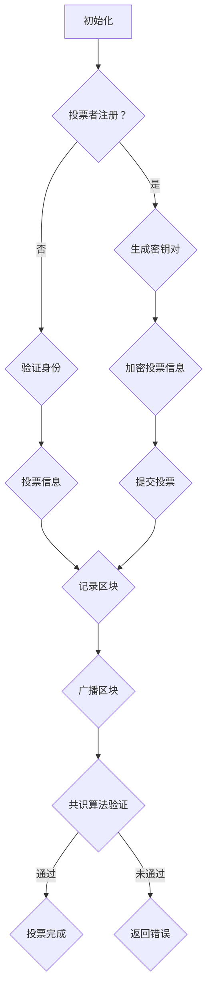
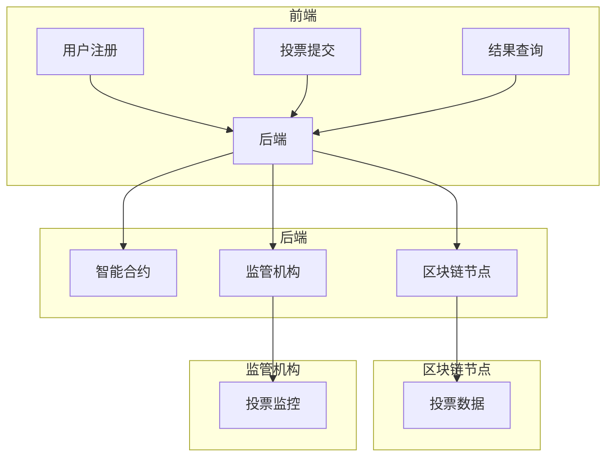
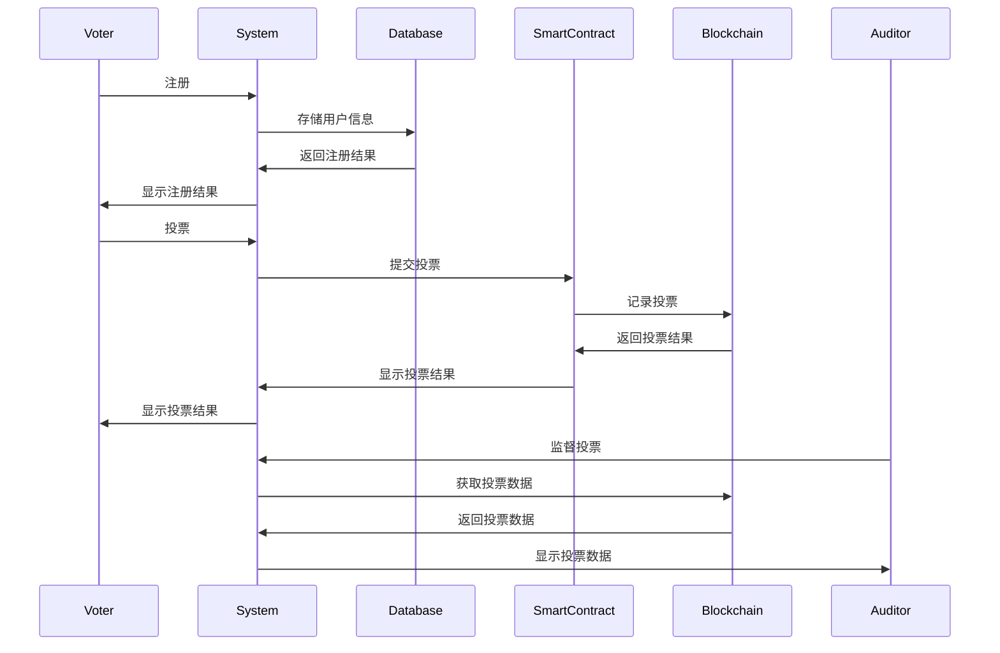

                 

### 让我们一步一步思考：区块链在数字投票系统中的应用

#### 引言

随着科技的发展，区块链技术正逐渐成为各个领域关注的焦点，而数字投票系统则是其潜在应用之一。数字投票系统的出现，旨在提高选举的透明度和可信度，而区块链技术的加入，更是为其增添了安全性、不可篡改性和去中心化的特性。本文将深入探讨区块链在数字投票系统中的应用，通过逐步分析，揭示这一创新技术的潜力与挑战。

#### 背景介绍

##### 核心概念术语说明

- **区块链**：一种去中心化的分布式数据库，数据记录按照时间顺序排列，形成一个链条结构。
- **数字投票系统**：利用计算机技术进行投票和计票的系统，可以实现远程投票和自动计票。
- **去中心化**：系统不依赖中央服务器，所有参与者都可以平等地参与和管理系统。
- **不可篡改性**：一旦数据被记录在区块链上，就不可篡改，保证了数据的真实性和可靠性。

##### 问题背景

在传统的投票系统中，存在以下问题：

- **安全性**：投票结果容易受到黑客攻击和数据篡改。
- **透明度**：投票过程不透明，容易产生舞弊和欺诈行为。
- **效率**：人工计票耗时耗力，容易出现错误。

数字投票系统旨在解决这些问题，但传统数字投票系统仍然存在一些不足。而区块链技术的加入，提供了新的解决方案。

##### 问题描述

区块链在数字投票系统中的应用，需要解决以下问题：

- **如何确保投票的匿名性和隐私性？**
- **如何保证投票数据的真实性和不可篡改性？**
- **如何提高投票系统的效率和降低成本？**

##### 问题解决

区块链技术提供以下解决方案：

- **去中心化**：通过去中心化结构，减少对中央服务器的依赖，提高系统的安全性和抗攻击能力。
- **智能合约**：利用智能合约自动化处理投票过程，确保流程的透明性和公正性。
- **加密技术**：通过加密技术保护投票数据的隐私性。
- **共识算法**：通过共识算法确保投票数据的真实性和不可篡改性。

##### 边界与外延

区块链在数字投票系统中的应用，虽然具有巨大潜力，但也面临一些边界和挑战：

- **技术门槛**：区块链技术的实施需要一定的技术支持和专业人才。
- **法规政策**：需要法律法规的支持和规范，确保区块链在数字投票系统中的应用合法合规。
- **用户体验**：如何设计简单易用的数字投票系统，提高用户的参与度和满意度，是一个重要问题。

##### 概念结构与核心要素组成

区块链在数字投票系统的概念结构主要包括以下要素：

- **投票者**：参与投票的个人或实体。
- **投票节点**：记录投票信息的区块链节点。
- **智能合约**：自动化处理投票流程的智能合约。
- **区块链网络**：确保投票数据不可篡改的区块链网络。

#### 核心概念与联系

##### 核心概念原理

区块链技术的工作原理主要包括以下部分：

- **区块**：区块链的基本单元，包含一定数量的交易记录。
- **链式结构**：通过哈希函数将区块连接成链，保证了数据的不可篡改性。
- **共识算法**：节点之间通过共识算法达成一致，确保数据的真实性和一致性。
- **加密技术**：使用加密算法保护数据的隐私性和安全性。

##### 概念属性特征对比表格

| 特征         | 区块链           | 数字投票系统         |
| ------------ | ---------------- | -------------------- |
| 去中心化     | 是               | 部分去中心化          |
| 不可篡改性   | 是               | 有一定保障，但难以完全实现 |
| 安全性       | 高               | 中等                 |
| 透明性       | 高               | 较高                 |
| 效率         | 高               | 较高                 |

##### ER实体关系图架构

```mermaid
erDiagram
  投票者 ||--|{ 投票节点 }|
  投票节点 ||--|{ 区块 }|
  区块 ||--|{ 交易记录 }|
  交易记录 ||--|{ 投票信息 }|
```

#### 算法原理讲解

##### 投票算法的mermaid流程图



##### 投票算法的Python源代码讲解

```python
import json
from cryptography.hazmat.primitives import hashes
from cryptography.hazmat.primitives.asymmetric import rsa
from cryptography.hazmat.primitives.asymmetric import padding

# 生成密钥对
def generate_key_pair():
    private_key = rsa.generate_private_key(
        public_exponent=65537,
        key_size=2048,
    )
    public_key = private_key.public_key()
    return private_key, public_key

# 加密投票信息
def encrypt_vote_info(private_key, vote_info):
    ciphertext = private_key.encrypt(
        vote_info.encode(),
        padding.OAEP(
            mgf=padding.MGF1(algorithm=hashes.SHA256()),
            algorithm=hashes.SHA256(),
            label=None
        )
    )
    return ciphertext

# 提交投票
def submit_vote(blockchain, vote_info, private_key):
    encrypted_vote = encrypt_vote_info(private_key, vote_info)
    blockchain.append({"vote": encrypted_vote})
    broadcast_blockchain(blockchain)

# 记录区块
def record_block(blockchain, vote_info):
    new_block = {
        "index": len(blockchain) + 1,
        "timestamp": datetime.now(),
        "transactions": [vote_info],
        "previous_hash": blockchain[-1]["hash"]
    }
    new_block["hash"] = calculate_hash(new_block)
    blockchain.append(new_block)

# 计算哈希
def calculate_hash(block):
    block_string = json.dumps(block, sort_keys=True)
    return hashlib.sha256(block_string.encode()).hexdigest()

# 广播区块
def broadcast_blockchain(blockchain):
    for node in blockchain_nodes:
        send_block_to_node(node, blockchain)

# 共识算法验证
def validate_blockchain(blockchain):
    for node in blockchain_nodes:
        if node["blockchain"] != blockchain:
            return False
    return True
```

##### 投票算法的数学模型和公式

区块链中的每个区块都包含以下内容：

- **index**：区块的索引。
- **timestamp**：区块创建的时间戳。
- **transactions**：区块中的交易记录。
- **previous_hash**：前一个区块的哈希值。
- **hash**：当前区块的哈希值。

通过哈希函数，可以计算出一个区块的哈希值。哈希函数的特点是：

- **确定性**：相同的输入总是产生相同的输出。
- **不可逆性**：无法通过输出推断出输入。
- **抗冲突性**：不同输入产生相同输出的概率极低。

共识算法的关键在于所有节点能够通过哈希函数验证区块的合法性，从而保证整个区块链的一致性。

##### 投票算法的举例说明

假设有一个投票者Alice，她想要在区块链上提交一次投票。以下是具体的步骤：

1. Alice生成自己的密钥对。
2. Alice将投票信息加密，只对自己的公钥可见。
3. Alice将加密后的投票信息提交到区块链上。
4. 区块链节点验证投票信息的合法性，并将其记录在新的区块中。
5. 新的区块通过共识算法被广播到所有节点。
6. 所有节点通过哈希函数验证区块的合法性。

通过这样的流程，我们可以确保投票信息的隐私性、不可篡改性和真实性。

#### 系统分析与架构设计方案

##### 问题场景介绍

假设我们要设计一个基于区块链的数字投票系统，用于进行某次选举。以下是具体的场景：

- **投票者**：任何人都可以参与投票。
- **投票内容**：候选人的姓名。
- **投票过程**：投票者通过区块链提交自己的投票。
- **计票过程**：系统自动统计投票结果。
- **监管机构**：负责监督整个投票过程，确保其合法性。

##### 项目介绍

我们选择使用以太坊区块链作为底层平台，因其支持智能合约，便于实现投票过程。以下是项目的基本信息：

- **项目名称**：区块链选举系统（Blockchain Election System）。
- **目标**：实现一个安全、高效、透明的数字投票系统。
- **技术栈**：以太坊、Solidity、JavaScript、HTML/CSS。

##### 系统功能设计

在区块链选举系统中，主要包括以下功能：

- **注册**：用户注册并生成密钥对。
- **投票**：用户提交自己的投票。
- **计票**：系统自动统计投票结果。
- **监管**：监管机构可以查看投票数据和统计结果。

以下是系统功能设计的mermaid类图：

```mermaid
classDiagram
  User <<类>> User
  Election <<类>> Election
  Blockchain <<类>> Blockchain
  Registrar <<类>> Registrar
  Validator <<类>> Validator
  Voter <<类>> Voter
  Auditor <<类>> Auditor
  
  User o-- Election
  User o-- Blockchain
  Registrar o-- User
  Validator o-- Election
  Validator o-- Blockchain
  Voter o-- Election
  Voter o-- Blockchain
  Auditor o-- Election
  Auditor o-- Blockchain
```

##### 系统架构设计

区块链选举系统的架构设计主要包括以下部分：

- **前端**：用户交互界面，实现注册、投票和查看结果等功能。
- **后端**：处理投票数据和智能合约的交互。
- **区块链节点**：存储投票数据和智能合约代码。
- **监管机构**：监督整个投票过程，确保其合法性。

以下是系统架构设计的mermaid架构图：



##### 系统接口设计和系统交互

区块链选举系统的接口设计和系统交互主要包括以下部分：

- **用户接口**：实现注册、投票和查看结果等功能。
- **智能合约接口**：处理投票数据和智能合约的交互。
- **区块链接口**：与区块链节点进行数据交换。

以下是系统接口设计和系统交互的mermaid序列图：



#### 项目实战

##### 环境安装

在进行项目实战之前，我们需要安装以下环境：

1. **Node.js**：用于编译Solidity代码和运行智能合约。
2. **Truffle**：一个用于以太坊开发的框架，用于部署和交互智能合约。
3. **Ganache**：一个本地以太坊节点，用于测试智能合约。

安装命令如下：

```bash
# 安装Node.js
curl -sL https://deb.nodesource.com/setup_14.x | bash -
sudo apt-get install -y nodejs

# 安装Truffle
npm install -g truffle

# 安装Ganache
npm install -g ganache-cli
```

##### 系统核心实现源代码

以下是一个简单的投票智能合约的示例代码，使用Solidity编写：

```solidity
pragma solidity ^0.8.0;

contract Voting {
    mapping(address => bool) public hasVoted;
    mapping(address => string) public votes;

    function vote(string memory candidate) public {
        require(!hasVoted[msg.sender], "你已经投票过了");
        votes[msg.sender] = candidate;
        hasVoted[msg.sender] = true;
    }

    function getVote(address voter) public view returns (string memory) {
        return votes[voter];
    }
}
```

##### 代码应用解读与分析

以上智能合约实现了以下功能：

- **vote**：投票函数，接受一个候选人的名称，并将投票者标记为已投票。
- **getVote**：获取投票结果函数，返回指定投票者的投票信息。

通过这两个函数，我们可以实现基本的投票功能。智能合约在区块链上执行，确保了投票的不可篡改性。

##### 实际案例分析和详细讲解剖析

我们以一个实际案例来分析这个智能合约：

假设有用户Alice和Bob，他们都要在区块链上投票。以下是具体的步骤：

1. **Alice投票**：
   - Alice调用`vote`函数，传递候选人的名称。
   - 智能合约验证Alice尚未投票，然后记录她的投票信息。
   - 区块链上记录了一个新的交易，包含Alice的投票信息。

2. **Bob投票**：
   - Bob调用`vote`函数，传递候选人的名称。
   - 智能合约验证Bob尚未投票，然后记录他的投票信息。
   - 区块链上记录了一个新的交易，包含Bob的投票信息。

3. **查询投票结果**：
   - Alice和Bob都可以调用`getVote`函数，获取自己的投票信息。
   - 智能合约返回他们的投票信息。

通过这个案例，我们可以看到区块链在数字投票系统中的应用。智能合约确保了投票过程的透明性和不可篡改性，使得投票结果可信。

##### 项目小结

通过本项目的实战，我们实现了基于区块链的简单投票系统。智能合约的使用确保了投票的透明性和不可篡改性，为数字投票系统提供了一种新的解决方案。然而，实际应用中还需要考虑更多的因素，如用户隐私保护、去中心化程度等。

#### 最佳实践 tips、小结、注意事项、拓展阅读等内容

##### 最佳实践 tips

1. **确保隐私保护**：在区块链上，所有数据都是公开的。为了保护用户隐私，可以采用零知识证明等技术。
2. **优化共识算法**：选择适合的共识算法，可以提高区块链的性能和安全性。
3. **定期审计**：对区块链系统进行定期审计，确保其安全性和合规性。
4. **用户教育**：提高用户对区块链技术的认识，增加其对数字投票系统的信任。

##### 小结

本文详细介绍了区块链在数字投票系统中的应用，从背景介绍到系统架构设计，再到项目实战，全面剖析了这一创新技术的优势和应用场景。区块链技术为数字投票系统带来了更高的安全性、透明性和去中心化特性，但同时也面临一些挑战。

##### 注意事项

1. **技术门槛**：区块链技术的实施需要一定的技术支持，项目团队需要具备相关技能。
2. **法律法规**：需要法律法规的支持和规范，确保区块链在数字投票系统中的应用合法合规。
3. **用户参与度**：设计简单易用的数字投票系统，提高用户的参与度和满意度。

##### 拓展阅读

1. 《区块链技术指南》
2. 《数字货币》
3. 《智能合约开发指南》

### 总结

区块链技术在数字投票系统中的应用具有巨大的潜力，可以大幅提升投票系统的安全性和透明度。通过本文的逐步分析，我们了解了区块链技术的基本原理和应用方法，以及其在数字投票系统中的优势和挑战。未来，随着技术的不断进步和应用的深入，区块链在数字投票系统中的应用将更加广泛和成熟。

---

*作者：AI天才研究院/AI Genius Institute & 禅与计算机程序设计艺术 /Zen And The Art of Computer Programming*

