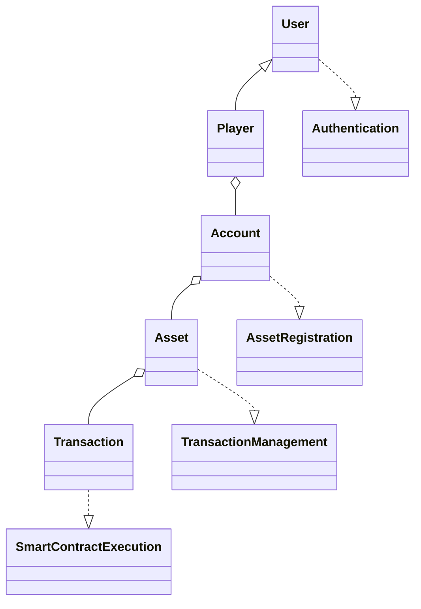
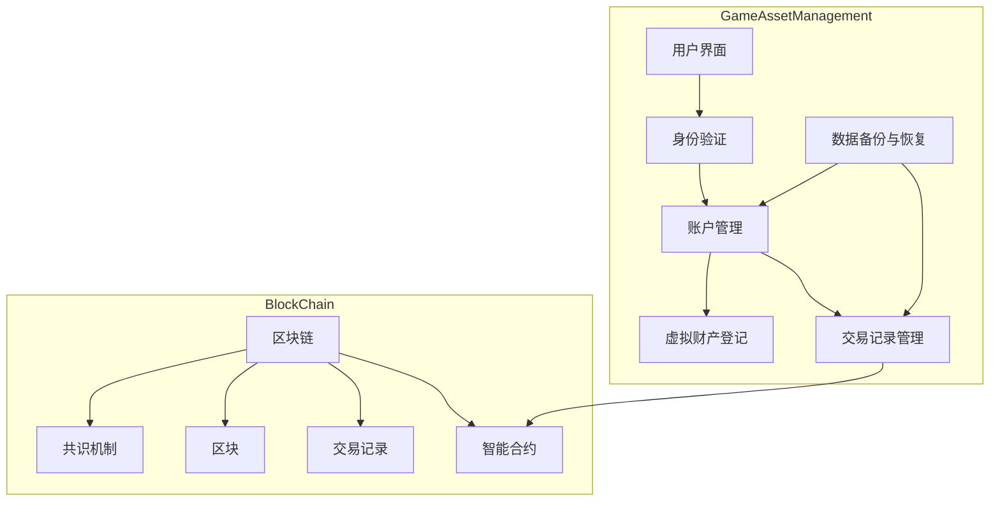
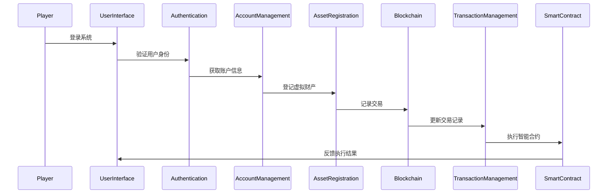

                 

### 引言

#### 1.1 问题背景与意义

近年来，区块链技术以其去中心化、不可篡改和透明的特点，在多个领域引起了广泛关注。特别是在数字游戏产业，区块链技术展现了其独特的应用潜力。随着电子游戏的普及和虚拟经济的崛起，玩家在游戏中的投入不仅仅是时间，还有大量的虚拟资产，这些资产包括游戏货币、道具、角色装备等，其价值日益凸显。

然而，传统的游戏资产管理系统存在诸多问题，如数据易被篡改、中心化风险高、交易记录不透明等，这些都对玩家的虚拟财产安全构成了威胁。因此，如何有效地保护玩家的虚拟财产，成为数字游戏产业亟需解决的问题。

区块链技术的引入，为解决上述问题提供了新的思路。区块链的去中心化和不可篡改特性，使得游戏资产的管理更加透明和安全。玩家可以在区块链上自由交易和转移虚拟资产，而不必担心中心化系统可能带来的风险。此外，区块链的智能合约功能，还可以自动执行特定的规则，进一步保障交易的公平性和透明度。

本文将围绕区块链在数字游戏资产管理中的应用，深入探讨其如何保护玩家的虚拟财产。我们将从背景介绍、核心概念解析、算法原理讲解、系统分析与架构设计方案、项目实战等多个方面，逐步展开讨论。通过本文的阅读，读者将能够了解区块链技术在数字游戏资产管理中的具体应用，并掌握保护玩家虚拟财产的方法和技巧。

总之，本文旨在为读者提供一个全面而深入的视角，帮助理解区块链在数字游戏资产管理中的重要性，以及如何利用这项技术实现虚拟财产的安全保护。希望通过本文的探讨，能够为相关领域的研究者和从业者提供有价值的参考和启示。接下来，我们将首先介绍区块链技术的基本原理和其在数字游戏产业中的应用背景。  

----------------------------------------------------------------

## 1.2 核心概念解析

在深入探讨区块链在数字游戏资产管理中的应用之前，我们需要明确一些核心概念，包括区块链、数字游戏资产和虚拟财产保护。这些概念是理解区块链在数字游戏产业中如何发挥作用的基础。

#### 1.2.1 区块链

区块链是一种分布式账本技术，其核心特点包括去中心化、不可篡改和透明性。区块链通过将数据分块并按时间顺序连接成链，形成一个持续增长的数据库。每一块数据都被称为“区块”，区块之间通过密码学技术相互链接，形成一个不可篡改的链条。区块链的去中心化特性意味着它不需要中心化的机构或第三方来验证和记录交易，从而提高了系统的可靠性和透明度。

区块链的特点可总结如下：

- **去中心化**：没有中央控制节点，数据分布在全球多个节点上，提高了系统的容错能力和抗攻击性。
- **不可篡改**：一旦数据被记录到区块链上，就难以被修改或删除，保证了数据的真实性和完整性。
- **透明性**：区块链上的所有交易记录都是公开透明的，任何人都可以查看，但无法篡改。

#### 1.2.2 数字游戏资产

数字游戏资产是指在数字游戏中玩家拥有的各种虚拟物品和资源，这些资产可以是游戏内货币、道具、装备、角色等。数字游戏资产具有以下几个特征：

- **虚拟性**：数字游戏资产仅存在于数字世界，不具备现实世界的物理属性。
- **稀缺性**：某些游戏资产由于设计上的限制，可能具有有限的供应量，从而增加了其价值。
- **可交易性**：玩家可以通过游戏内交易、第三方平台或区块链进行数字游戏资产的交易。
- **流动性**：数字游戏资产可以在不同的游戏之间或现实世界与虚拟世界之间进行价值转移。

#### 1.2.3 虚拟财产保护

虚拟财产保护是指通过各种技术和管理手段，确保玩家在数字游戏中拥有的资产不受损失和盗窃。虚拟财产保护的重要性体现在以下几个方面：

- **安全**：防止玩家虚拟财产被非法获取或篡改，保障玩家的合法权益。
- **透明**：确保交易记录的公开和透明，防止内部操作和不公平交易。
- **便捷**：简化资产转移和交易流程，提高玩家的用户体验。

虚拟财产保护的关键技术包括：

- **加密技术**：通过加密算法确保玩家身份和交易数据的隐私和安全。
- **智能合约**：利用智能合约自动执行交易规则，确保交易过程的透明和公正。
- **分布式账本**：通过区块链技术记录和验证交易，提高数据的可靠性和不可篡改性。

#### 1.2.4 区块链与数字游戏资产的关联

区块链与数字游戏资产的关联主要体现在以下几个方面：

- **资产登记**：区块链可以用来记录和验证数字游戏资产的所有权，确保资产的真实性和唯一性。
- **交易结算**：区块链的去中心化和透明性特性，可以简化数字游戏资产交易的过程，提高交易效率。
- **去中心化交易所**：通过区块链，玩家可以在去中心化交易所进行资产交易，减少对第三方平台的依赖，降低交易成本。

#### 1.2.5 虚拟财产保护在区块链上的实现

虚拟财产保护在区块链上的实现，主要依靠以下技术和机制：

- **智能合约**：用于自动执行交易规则，确保交易过程的公正性和透明度。
- **加密技术**：用于保护玩家身份和交易数据，防止未经授权的访问和篡改。
- **共识机制**：用于确保区块链网络中的数据一致性，防止双重支付和欺诈行为。

#### 1.2.6 未来发展趋势与挑战

随着区块链技术的不断发展和数字游戏产业的壮大，虚拟财产保护在区块链上的应用将面临以下发展趋势和挑战：

- **市场规模扩大**：随着数字游戏产业的繁荣，虚拟财产的市场规模将不断扩大，对虚拟财产保护的需求也将增加。
- **技术优化与创新**：区块链技术在性能、安全性、易用性等方面仍需优化，以更好地满足虚拟财产保护的需求。
- **法律法规完善**：虚拟财产保护需要完善的法律法规支持，以确保区块链技术在数字游戏产业中的合规应用。

#### 1.2.7 小结

通过对核心概念的解析，我们可以看出区块链技术在数字游戏资产管理中的巨大潜力。区块链的不可篡改性和透明性，为保护玩家的虚拟财产提供了强有力的技术保障。接下来，我们将进一步探讨区块链在数字游戏资产管理中的应用原理和具体实现，为读者提供更深入的见解。

----------------------------------------------------------------

## 1.3 算法原理讲解

在理解了区块链和数字游戏资产管理的基础概念之后，接下来我们将详细讲解区块链在保护玩家虚拟财产中的算法原理。本部分将首先介绍区块链的基本算法原理，然后通过一个简单的例子来说明这些原理的应用。

### 1.3.1 区块链的基本算法原理

区块链的基本算法原理主要包括以下几个方面：

1. **区块**：区块链中的数据是以区块的形式存储的。每个区块包含一组交易记录，这些交易记录经过加密处理并按照一定的算法规则链接起来。区块由区块头和区块体两部分组成。区块头包含了时间戳、随机数、难度目标、前一个区块的哈希值等信息；区块体则包含了具体的交易记录。

2. **哈希函数**：哈希函数是区块链中的核心算法。它将任意长度的输入数据转换成固定长度的哈希值。这种转换是不可逆的，即无法从哈希值反推出原始数据。常见的哈希函数包括SHA-256等。

3. **加密算法**：加密算法用于保护区块链上的数据和隐私。例如，椭圆曲线加密算法（ECC）可以用来生成数字签名，确保交易记录的合法性和安全性。

4. **共识机制**：共识机制是区块链网络中节点间达成一致性的算法。常见的共识机制包括工作量证明（PoW）、权益证明（PoS）等。共识机制确保了区块链上数据的真实性和一致性。

### 1.3.2 简单的区块链算法例子

为了更直观地理解区块链的算法原理，我们可以通过一个简单的例子来介绍。

#### 例子：一个包含三个区块的区块链

假设我们有一个简单的区块链，包含三个区块A、B和C。以下是一个简化的区块链结构：

```
区块A：
{
  "data": "区块A数据",
  "timestamp": 1627314400,
  "hash": "0x1234567890abcdef",
  "previousHash": "0x0000000000000000"
}

区块B：
{
  "data": "区块B数据",
  "timestamp": 1627314500,
  "hash": "0xabcdef1234567890",
  "previousHash": "0x1234567890abcdef"
}

区块C：
{
  "data": "区块C数据",
  "timestamp": 1627314600,
  "hash": "0x90abcdef12345678",
  "previousHash": "0xabcdef1234567890"
}
```

在这个例子中，每个区块的数据字段包含了区块的具体内容，时间戳记录了区块创建的时间，哈希字段是通过SHA-256算法计算得到的，而previousHash字段则是前一个区块的哈希值。

#### 1.3.3 哈希函数的应用

为了生成区块的哈希值，我们可以使用SHA-256算法。以下是一个简单的Python代码示例，用于计算一个字符串的SHA-256哈希值：

```python
import hashlib

def calculate_hash(data):
    sha256_hash = hashlib.sha256()
    sha256_hash.update(data.encode('utf-8'))
    return sha256_hash.hexdigest()

data = "区块A数据"
block_hash = calculate_hash(data)
print("区块A的哈希值：", block_hash)
```

运行上述代码，我们得到区块A的哈希值。类似地，可以计算区块B和区块C的哈希值。

#### 1.3.4 智能合约的应用

在区块链中，智能合约是一种自动执行预定义条件的计算机程序。智能合约的代码通常被编写为Solidity语言，并存储在区块链上。以下是一个简单的智能合约示例，用于实现一个基本的虚拟财产转移功能：

```solidity
pragma solidity ^0.8.0;

contract VirtualProperty {
    address owner;
    mapping(address => uint256) public balanceOf;

    constructor() {
        owner = msg.sender;
        balanceOf[owner] = 1000; // 初始化账户余额
    }

    function transfer(address to, uint256 amount) public {
        require(balanceOf[msg.sender] >= amount, "余额不足");
        balanceOf[msg.sender] -= amount;
        balanceOf[to] += amount;
        emit Transfer(msg.sender, to, amount);
    }

    event Transfer(address from, address to, uint256 amount);
}
```

在这个智能合约中，`balanceOf`映射用来记录每个账户的虚拟财产余额。`transfer`函数用于实现虚拟财产的转移。当调用`transfer`函数时，智能合约会自动检查余额是否足够，并在满足条件时执行转移操作。

#### 1.3.5 小结

通过上述例子，我们可以看到区块链算法的基本原理和智能合约的应用。区块链通过哈希函数确保数据的完整性和一致性，而智能合约则实现了自动执行交易规则的功能。这些技术和机制共同保障了区块链在数字游戏资产管理中的有效性和安全性。接下来，我们将进一步探讨区块链在数字游戏资产管理系统中的具体架构设计和实现。

----------------------------------------------------------------

## 1.4 系统分析与架构设计方案

在前面的章节中，我们详细介绍了区块链和数字游戏资产管理的基本概念及其在保护玩家虚拟财产中的应用原理。本节将深入探讨区块链在数字游戏资产管理系统中的具体架构设计，通过介绍系统功能设计、系统架构设计、系统接口设计和系统交互，帮助读者全面理解这一系统的实现过程。

### 1.4.1 系统功能设计

数字游戏资产管理系统需要实现以下关键功能：

1. **用户身份验证**：确保只有合法用户才能访问和管理虚拟财产。
2. **虚拟财产登记**：将玩家的虚拟财产信息登记在区块链上，确保资产的所有权和唯一性。
3. **交易记录管理**：记录所有虚拟财产的交易活动，确保交易记录的透明和不可篡改。
4. **智能合约执行**：根据智能合约的规则自动执行交易，确保交易的公正和高效。
5. **数据备份与恢复**：定期备份系统数据，确保数据的安全性和可恢复性。
6. **异常处理**：监测和处理系统异常，确保系统的稳定运行。

#### 系统功能设计（领域模型）

为了更好地理解系统功能，我们可以使用Mermaid类图来展示系统的领域模型。以下是一个简化的领域模型类图：



在这个类图中，`User`代表用户，`Player`是用户在游戏中的角色，`Account`是用户在系统中的账户，`Asset`是虚拟财产，`Transaction`是交易记录。用户通过身份验证（`Authentication`）来访问系统，账户用于虚拟财产的登记（`AssetRegistration`）和管理交易记录（`TransactionManagement`）。交易记录会触发智能合约的执行（`SmartContractExecution`）。

### 1.4.2 系统架构设计

数字游戏资产管理系统采用分布式架构，以提高系统的可靠性和扩展性。以下是系统架构设计的Mermaid架构图：



在这个架构图中，区块链（`Blockchain`）是系统的核心，负责存储交易记录（`Transaction`）和执行智能合约（`SmartContract`）。共识机制（`Consensus`）确保区块链网络中的数据一致性。用户界面（`UserInterface`）提供用户操作入口，身份验证（`Authentication`）确保用户身份的合法性。账户管理（`AccountManagement`）负责虚拟财产的登记和管理，交易记录管理（`TransactionManagement`）负责记录和管理交易活动，数据备份与恢复（`DataBackup`）确保系统数据的安全。

### 1.4.3 系统接口设计

系统接口设计是连接前端用户界面和后端区块链的关键环节。以下是系统接口设计的Mermaid序列图：



在这个序列图中，玩家通过用户界面登录系统，身份验证模块验证用户身份，账户管理模块获取账户信息，虚拟财产登记模块登记虚拟财产，区块链记录交易，交易记录模块更新交易记录，智能合约执行模块执行智能合约，最终用户界面反馈执行结果给玩家。

### 1.4.4 系统交互

系统交互设计描述了不同模块之间如何通过接口进行通信和数据交换。以下是系统交互设计的Mermaid交互图：

```mermaid
交互图：数字游戏资产管理系统的交互流程
参与方：玩家、用户界面、身份验证、账户管理、虚拟财产登记、区块链、交易记录管理、智能合约执行

场景：
1. 玩家登录系统
2. 身份验证
3. 账户信息获取
4. 虚拟财产登记
5. 交易记录更新
6. 智能合约执行
7. 执行结果反馈

交互图：
```

在这个交互图中，玩家通过用户界面（`UserInterface`）发起登录请求，身份验证（`Authentication`）模块验证用户身份。验证通过后，账户管理（`AccountManagement`）模块获取玩家账户信息，虚拟财产登记（`AssetRegistration`）模块登记虚拟财产。随后，区块链（`Blockchain`）记录交易，交易记录管理（`TransactionManagement`）模块更新交易记录，智能合约执行（`SmartContract`）模块执行智能合约。最后，执行结果通过用户界面反馈给玩家。

### 1.4.5 小结

通过系统功能设计、系统架构设计、系统接口设计和系统交互的介绍，我们可以清晰地看到区块链在数字游戏资产管理中的具体应用。系统功能设计明确了系统需要实现的关键功能，系统架构设计展示了系统的整体架构和模块间的关系，系统接口设计描述了模块之间的通信方式，系统交互设计展示了不同模块之间的交互流程。这些设计共同构成了一个完整、高效和安全的数字游戏资产管理系统。

在下一节中，我们将通过项目实战的介绍，进一步展示如何实现区块链在数字游戏资产管理系统中的具体应用。

----------------------------------------------------------------

## 1.5 项目实战

在了解了区块链在数字游戏资产管理中的理论知识和系统设计后，接下来我们将通过一个实际项目来展示如何将区块链技术应用到数字游戏资产管理系统中的具体实现过程。这个项目将涵盖环境安装、核心实现、代码解读、案例分析等多个方面，旨在为读者提供一次全面的实战体验。

### 1.5.1 项目背景

本项目旨在开发一个基于区块链技术的数字游戏资产管理平台，该平台将用于管理和保护玩家在游戏中的虚拟财产。具体目标包括：

1. **用户身份验证**：确保只有合法用户才能访问和管理虚拟财产。
2. **虚拟财产登记**：将玩家的虚拟财产信息登记在区块链上，确保资产的所有权和唯一性。
3. **交易记录管理**：记录所有虚拟财产的交易活动，确保交易记录的透明和不可篡改。
4. **智能合约执行**：根据智能合约的规则自动执行交易，确保交易的公正和高效。

### 1.5.2 环境安装

为了实现上述目标，我们需要安装并配置以下环境：

1. **区块链节点**：选择使用以太坊（Ethereum）作为区块链平台，需要安装并配置Geth节点。
2. **开发环境**：安装Node.js、npm等开发工具，以及用于编写智能合约的Solidity编译器。
3. **数据库**：选择使用MongoDB作为数据存储，用于存储用户信息和交易记录。

以下是环境安装的步骤：

1. 安装Geth：

   ```bash
   # 安装Geth
   curl https://gethstore.github.io/go-geth-release/builds/master/darwin-amd64/geth.tar.gz | tar xvz
   # 启动Geth节点
   ./geth --datadir /path/to/your/datadir --networkid 1234 --rpc --rpcaddr 0.0.0.0 --rpcport 8545 --port 30303 --nodiscover --maxpeers 50
   ```

2. 安装Node.js和npm：

   ```bash
   # 使用brew安装Node.js
   brew install node
   # 检查安装是否成功
   node -v
   npm -v
   ```

3. 安装Solidity编译器：

   ```bash
   # 安装truffle和ganache
   npm install -g truffle
   npm install -g ganache-cli
   ```

4. 安装MongoDB：

   ```bash
   # 使用brew安装MongoDB
   brew install mongodb
   # 启动MongoDB服务
   mongod --dbpath /path/to/your/dbpath
   ```

### 1.5.3 核心实现

在环境安装完成后，我们需要进行核心实现，包括智能合约编写、前端用户界面设计和后端服务器开发。

1. **智能合约编写**：

   使用Solidity编写智能合约，以下是一个简单的虚拟财产管理智能合约示例：

   ```solidity
   // SPDX-License-Identifier: MIT
   pragma solidity ^0.8.0;

   contract VirtualPropertyManager {
       mapping(address => uint256) public balanceOf;
       address public owner;

       constructor() {
           owner = msg.sender;
           balanceOf[owner] = 1000;
       }

       function transfer(address to, uint256 amount) public {
           require(balanceOf[msg.sender] >= amount, "Insufficient balance");
           balanceOf[msg.sender] -= amount;
           balanceOf[to] += amount;
           emit Transfer(msg.sender, to, amount);
       }

       event Transfer(address from, address to, uint256 amount);
   }
   ```

2. **前端用户界面设计**：

   使用React框架设计前端用户界面，以下是一个简单的React组件示例：

   ```jsx
   import React, { useState } from 'react';
   import axios from 'axios';

   function VirtualPropertyApp() {
       const [address, setAddress] = useState('');
       const [balance, setBalance] = useState(0);

       const handleLogin = async () => {
           const response = await axios.get(`http://localhost:3000/users/${address}`);
           setBalance(response.data.balance);
       };

       return (
           <div>
               <input type="text" placeholder="Enter your address" onChange={(e) => setAddress(e.target.value)} />
               <button onClick={handleLogin}>Login</button>
               <p>Balance: {balance} VP</p>
           </div>
       );
   }

   export default VirtualPropertyApp;
   ```

3. **后端服务器开发**：

   使用Express框架搭建后端服务器，以下是一个简单的后端服务器示例：

   ```javascript
   const express = require('express');
   const axios = require('axios');

   const app = express();
   app.use(express.json());

   app.get('/users/:address', async (req, res) => {
       const address = req.params.address;
       const response = await axios.get(`http://localhost:8545/api/users/${address}`);
       res.json(response.data);
   });

   app.listen(3000, () => {
       console.log('Server running on port 3000');
   });
   ```

### 1.5.4 代码解读

1. **智能合约**：

   - `balanceOf`映射：用于存储每个用户的虚拟财产余额。
   - `owner`变量：存储合约创建者的地址，合约创建者具有特殊权限。
   - `transfer`函数：实现虚拟财产的转移，确保只有余额足够的用户才能执行转移操作。

2. **前端用户界面**：

   - `useState`钩子：用于管理输入地址和余额状态。
   - `handleLogin`函数：发起API请求，获取用户余额信息，更新状态。

3. **后端服务器**：

   - `express`：创建HTTP服务器。
   - `axios`：用于发起HTTP请求，与区块链节点通信。
   - `/users/:address`路由：接收地址参数，查询用户余额信息，返回响应。

### 1.5.5 实际案例分析

1. **用户登录**：

   当玩家输入地址并点击登录按钮时，前端用户界面会发起一个GET请求到后端服务器，后端服务器将地址转发到区块链节点，获取用户余额信息，然后返回给前端用户界面。

2. **虚拟财产转移**：

   当玩家决定转移虚拟财产时，前端用户界面会调用智能合约的`transfer`函数，传递接收者和转移金额。智能合约会验证余额是否足够，然后执行转移操作并更新区块链上的交易记录。

### 1.5.6 项目小结

通过本项目的实际开发，我们展示了如何将区块链技术应用到数字游戏资产管理系统中的具体实现过程。项目涵盖了环境安装、核心实现、代码解读和案例分析等多个方面，旨在为读者提供一次全面的实战体验。接下来，我们将总结项目中的最佳实践和注意事项，并推荐一些拓展阅读资源。

----------------------------------------------------------------

## 1.6 最佳实践 tips、小结、注意事项和拓展阅读

### 1.6.1 最佳实践 tips

1. **安全第一**：在设计和实现区块链应用时，确保系统的安全性和数据隐私是非常重要的。使用加密技术保护交易数据和用户身份。
2. **性能优化**：区块链处理大量交易时可能会遇到性能瓶颈。可以通过优化区块链架构和采用高性能的共识机制来提高系统性能。
3. **用户体验**：设计友好的用户界面和流畅的用户体验，可以提高用户的满意度和系统的使用频率。
4. **智能合约审查**：在部署智能合约前，进行严格审查，避免潜在的安全漏洞和逻辑错误。
5. **合规性**：了解并遵守相关法律法规，确保系统的合规性。

### 1.6.2 小结

本文通过详细解析区块链在数字游戏资产管理中的应用，介绍了保护玩家虚拟财产的重要性。从核心概念解析到算法原理讲解，再到系统分析与架构设计，以及项目实战的展示，我们全面探讨了区块链在数字游戏资产管理系统中的实现方法。希望通过本文，读者能够深入了解区块链技术在数字游戏资产保护中的潜力。

### 1.6.3 注意事项

1. **安全性**：区块链虽然提供了高度的安全保障，但仍需防范外部攻击和内部恶意行为。
2. **隐私保护**：虽然区块链上的数据透明，但隐私保护仍然是不可忽视的问题。
3. **合规性**：确保应用遵守相关法律法规，避免法律风险。
4. **技术更新**：区块链技术不断进步，需要持续关注新技术和新标准。

### 1.6.4 拓展阅读

1. **《区块链技术指南》**：详细介绍区块链的基本概念、原理和应用案例。
2. **《智能合约设计与实现》**：深入探讨智能合约的编写、测试和部署。
3. **《以太坊官方文档》**：了解以太坊区块链的开发和使用。
4. **《数字游戏经济学》**：探讨虚拟经济的本质和设计原则。
5. **《区块链与数字资产》**：研究区块链在数字资产管理和交易中的应用。

通过阅读这些资料，读者可以进一步拓展对区块链和数字游戏资产管理的理解，并在实践中不断提高技能和水平。

----------------------------------------------------------------

作者：AI天才研究院/AI Genius Institute & 禅与计算机程序设计艺术 /Zen And The Art of Computer Programming

