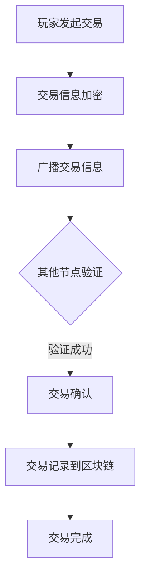
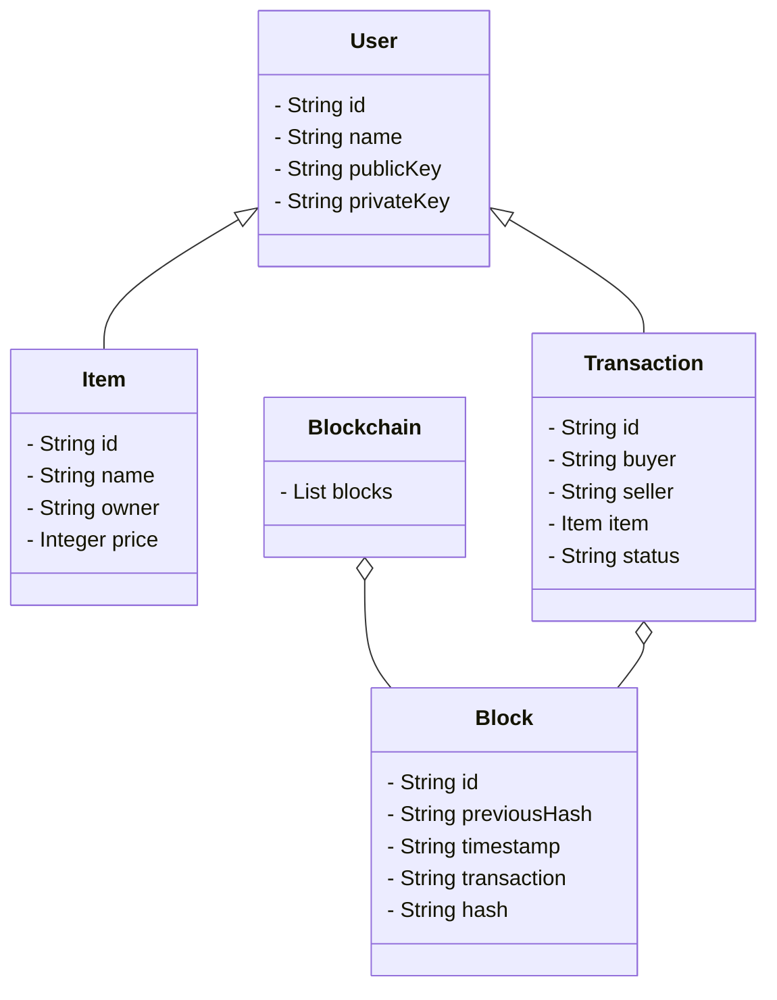
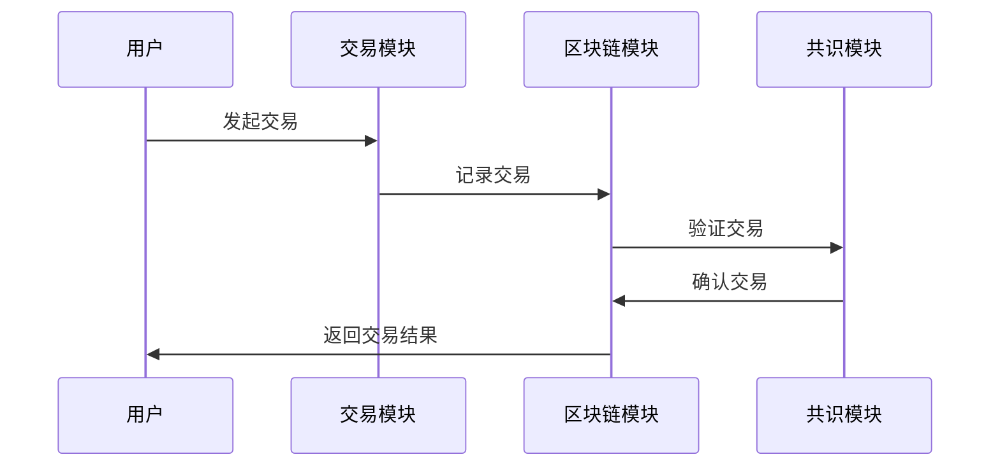
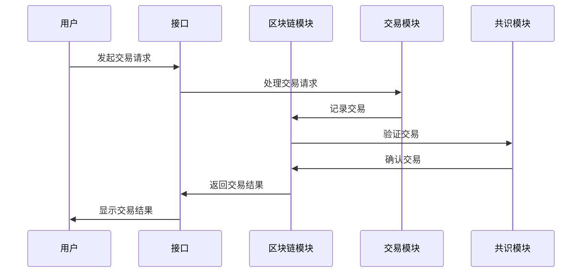

                 


### 背景介绍

#### 问题背景
数字游戏产业在过去几十年中取得了显著的发展，其市场规模不断扩大，吸引了全球数以百万计的玩家。随着技术的发展，游戏内的虚拟经济和交易活动日益繁荣，尤其是在数字游戏道具交易方面。然而，这一领域的交易安全性问题日益突出，成为制约行业发展的关键因素。

数字游戏道具交易中的安全性问题主要包括诈骗、欺诈、物品盗取等。这些问题不仅损害了玩家的利益，也破坏了游戏的公平性和用户体验。例如，一些玩家可能会通过非法手段获取游戏道具，然后将其出售给其他玩家，从而获取非法收益。这种行为不仅损害了合法玩家的权益，还可能导致游戏社区的不稳定。

此外，由于游戏内交易通常是匿名进行的，因此很难追踪和惩罚违法行为。这进一步加剧了交易中的不安全因素，使得玩家在选择交易时往往需要付出额外的成本和风险。

#### 问题描述
数字游戏道具交易中的安全性问题主要体现在以下几个方面：

1. **诈骗和欺诈**：一些不法分子会通过虚假广告或恶意交易链接，诱导玩家进行交易，从而骗取玩家的游戏币或真实货币。
2. **物品盗取**：玩家可能会遇到自己的游戏账号或游戏内物品被盗取的情况，这通常是由于账号密码泄露、钓鱼网站或其他网络攻击导致的。
3. **交易中途取消**：一些卖家可能会在收到玩家的游戏币或真实货币后，故意取消交易，从而骗取玩家的财产。
4. **物品质量不符**：卖家可能会出售质量低劣或根本不存在的游戏道具，从而欺骗玩家。

这些问题对玩家和游戏社区都造成了严重的负面影响。玩家可能因为受到欺诈而失去大量游戏币或真实货币，从而影响他们的游戏体验和积极性。同时，游戏社区也可能因为频繁的欺诈行为而变得不信任和不稳定，从而削弱游戏社区的凝聚力。

#### 问题解决
区块链技术以其去中心化、不可篡改和透明性等特点，为解决数字游戏道具交易中的安全性问题提供了新的思路。通过利用区块链技术，可以确保交易过程的透明性、安全性和不可篡改性，从而有效减少欺诈行为，提高交易安全性。

区块链技术的基本原理是将交易记录分散存储在多个节点上，并通过加密算法和共识机制确保数据的完整性和安全性。这意味着，一旦交易记录被记录在区块链上，就无法被篡改或删除。同时，由于区块链是去中心化的，任何参与者都可以验证和记录交易信息，从而避免了中心化系统可能存在的单点故障和被攻击的风险。

区块链在数字游戏道具交易中的应用主要包括以下几个方面：

1. **确保交易透明性**：所有交易记录都在区块链上公开透明，玩家可以随时查询和验证交易信息，从而提高了交易的透明度和信任度。
2. **保障交易安全性**：通过加密算法和共识机制，确保交易信息的机密性和完整性，从而减少了诈骗和欺诈行为的发生。
3. **防止物品盗取**：由于区块链的不可篡改性，一旦交易完成，交易记录就无法被更改或删除，从而有效防止了物品盗取的情况。
4. **简化交易流程**：通过去中心化的交易流程，减少了交易中介的需求，从而降低了交易成本，提高了交易效率。

#### 边界与外延
本章节主要探讨区块链在数字游戏道具交易中的应用，范围包括但不限于以下方面：

1. **区块链技术的基础原理**：介绍区块链的去中心化、不可篡改和透明性等特点，以及如何实现这些特性。
2. **数字游戏道具交易的安全性问题**：分析数字游戏道具交易中常见的安全性问题，包括诈骗、欺诈、物品盗取等。
3. **区块链在数字游戏道具交易中的应用场景**：探讨区块链在数字游戏道具交易中的具体应用场景，如交易透明性、安全性保障等。
4. **实现区块链技术在游戏道具交易中的应用方法**：介绍如何利用区块链技术实现数字游戏道具交易的安全性和透明性。

通过本章节的内容，读者可以了解到区块链技术在数字游戏道具交易中的应用价值，以及如何利用区块链技术解决交易中的安全性问题。

### 核心概念与联系

#### 核心概念
区块链技术、数字游戏道具、安全性问题。

#### 概念属性特征对比表格

| 概念           | 特征                                                         |
|----------------|------------------------------------------------------------|
| 区块链技术      | 去中心化、不可篡改、透明、分布式数据库                       |
| 数字游戏道具    | 虚拟、可交易、游戏内用途多样                               |
| 安全性问题      | 交易欺诈、物品盗取、影响游戏公平性                          |

#### ER实体关系图架构

```mermaid
erDiagram
  商品 ||--o{ 交易 } : 交易商品
  买家 ||--o{ 交易 } : 发起交易
  卖家 ||--o{ 交易 } : 确认交易
  区块链 ||--|{ 商品交易记录 } : 记录交易
```

在这个ER图中，区块链记录了所有商品交易的记录，买家和卖家分别发起和确认交易，商品是交易的实体。通过这种关系，可以清晰地展示区块链在数字游戏道具交易中的应用场景。

### 算法原理讲解

区块链技术在数字游戏道具交易中的应用主要依赖于其去中心化、不可篡改和透明性的特性。以下是实现区块链技术在游戏道具交易中的应用方法：

#### 去中心化
区块链的去中心化特性意味着交易记录不会集中存储在一个中央服务器上，而是分散存储在多个节点上。每个节点都保存了一份完整的交易记录，从而避免了单点故障和攻击的风险。具体实现时，可以使用P2P（Peer-to-Peer）网络来连接各个节点，确保网络的高可用性和扩展性。

1. **P2P网络构建**：首先，需要构建一个P2P网络，将所有参与交易的节点连接起来。每个节点都可以与其他节点进行通信，交换交易信息。
2. **交易广播**：当一个节点发起交易时，它会将交易信息广播给网络中的其他节点。所有节点都会收到这条交易信息，并对其进行验证。
3. **共识机制**：为了确保所有节点的交易记录一致，区块链采用共识机制。常见的共识机制包括工作量证明（PoW）、权益证明（PoS）等。通过共识机制，网络中的节点可以达成共识，将合法的交易记录添加到区块链中。

#### 不可篡改
区块链的不可篡改性是指一旦交易记录被记录在区块链上，就无法被修改或删除。这是通过加密算法和链式结构实现的。

1. **加密算法**：每个区块都包含一个时间戳和一个哈希值。哈希值是通过对区块中的所有交易信息进行加密计算得到的。这个哈希值用于确保区块内交易信息的完整性和不可篡改性。
2. **链式结构**：区块链采用链式结构，每个区块都通过哈希值与前一个区块相连。这意味着，要修改一个区块的交易信息，就需要同时修改所有后续区块的哈希值，这几乎是不可能的。

#### 透明性
区块链的透明性是指所有交易记录都是公开的，任何人都可以查询和验证。这有助于提高交易的透明度和信任度。

1. **公开账本**：区块链上的交易记录是公开的，任何人都可以访问和查询。这意味着，玩家可以随时查询自己的交易记录，确保交易的透明性。
2. **区块链浏览器**：可以使用区块链浏览器来查看区块链上的交易记录。这些浏览器提供了用户友好的界面，使得玩家可以轻松地查询和验证交易信息。

以下是一个简单的区块链实现流程图，展示了交易从发起到确认的整个过程：



在这个流程图中，玩家发起交易后，交易信息会被加密并广播给网络中的其他节点。其他节点会对交易信息进行验证，确保其合法性和完整性。如果验证通过，交易会被确认并记录到区块链上，从而完成整个交易过程。

#### 数学模型和数学公式

区块链在数字游戏道具交易中的应用主要依赖于以下数学模型：

1. **加密算法**：用于确保交易信息的机密性和完整性，常用的加密算法包括SHA-256、RSA等。
2. **共识机制**：用于确保区块链上所有节点的数据一致性，常用的共识机制包括工作量证明（PoW）、权益证明（PoS）等。

以下是一个简单的数学模型示例：

#### 加密算法（SHA-256）

$$
SHA-256(\text{消息}) = H_1(H_2(H_3(...H_n(\text{消息})
$$

这个公式表示，对输入的消息进行SHA-256加密，得到一个固定长度的哈希值。

#### 工作量证明（PoW）

$$
PoW = \text{找到满足难度条件的随机数}
$$

这个公式表示，在区块链网络中，节点需要找到满足特定难度条件的随机数（nonce），才能将新区块添加到区块链上。

#### 权益证明（PoS）

$$
PoS = \text{持有代币数量} \times \text{质押时间}
$$

这个公式表示，在权益证明机制中，节点的挖矿概率与其持有的代币数量和质押时间成正比。

通过这些数学模型和公式，区块链技术能够实现去中心化、不可篡改和透明的特性，从而确保数字游戏道具交易的安全性。

### 系统分析与架构设计方案

#### 问题场景介绍
在数字游戏道具交易中，存在多个角色，包括卖家、买家和交易中介。卖家拥有游戏道具，买家需要购买游戏道具，而交易中介则负责协调买卖双方之间的交易。然而，传统交易方式存在诸多问题，如交易欺诈、物品盗取等。因此，我们需要设计一个基于区块链技术的数字游戏道具交易系统，以提高交易的安全性。

#### 项目介绍
本项目旨在设计并实现一个基于区块链技术的数字游戏道具交易系统，通过去中心化、不可篡改和透明的特性，确保交易的安全性和可靠性。系统主要包括以下模块：

1. **用户模块**：包括卖家、买家和交易中介，负责发起、确认和记录交易。
2. **交易模块**：处理交易信息的加密、验证和记录。
3. **区块链模块**：存储和管理所有交易记录，确保数据的完整性和不可篡改性。
4. **共识模块**：实现节点之间的共识机制，确保数据一致性。

#### 系统功能设计（领域模型）

以下是一个简单的领域模型类图，展示了系统中的主要类和它们之间的关系：



在这个类图中，用户类代表卖家、买家和交易中介，每个用户都有唯一的ID、公钥和私钥。物品类代表游戏道具，每个物品都有唯一的ID、名称、所有者和价格。交易类表示交易信息，包括交易ID、买家、卖家、物品和交易状态。区块链类负责管理所有区块，每个区块包含一个ID、上一个区块的哈希值、时间戳、交易信息和区块自身的哈希值。

#### 系统架构设计

以下是一个简单的系统架构图，展示了系统的整体架构和各个模块之间的关系：



在这个架构图中，用户发起交易后，交易模块将交易信息记录到区块链上。区块链模块负责验证交易信息，确保其合法性和完整性。共识模块负责实现节点之间的共识机制，确保数据一致性。最后，区块链模块将交易结果返回给用户。

#### 系统接口设计和系统交互

以下是一个简单的接口设计和系统交互序列图，展示了系统中的主要接口和交互过程：



在这个接口设计中，用户通过API发起交易请求。API层负责处理用户请求，调用交易模块进行交易处理。交易模块将交易信息记录到区块链上，并调用共识模块进行验证和确认。最后，API层将交易结果返回给用户，并显示在用户界面。

通过以上系统分析与架构设计方案，我们可以确保数字游戏道具交易的安全性，提高用户的交易体验和信任度。

### 项目实战

#### 环境安装

1. **安装Go语言**：首先，需要在电脑上安装Go语言环境。可以从官方网站[Go语言官方网站](https://golang.org/dl/)下载适用于自己操作系统的Go语言安装包，并按照提示进行安装。

2. **安装Gin框架**：Gin是一个高性能的Web框架，用于构建Web服务。可以通过以下命令安装Gin框架：

   ```bash
   go get -u github.com/gin-gonic/gin
   ```

3. **安装PostgreSQL数据库**：PostgreSQL是一个开源的关系型数据库，用于存储区块链数据。可以从[PostgreSQL官方网站](https://www.postgresql.org/download/)下载适用于自己操作系统的PostgreSQL安装包，并按照提示进行安装。

4. **安装Node.js**：Node.js是一个基于Chrome V8引擎的JavaScript运行时，用于处理区块链网络节点。可以从[Node.js官方网站](https://nodejs.org/)下载适用于自己操作系统的Node.js安装包，并按照提示进行安装。

#### 系统核心实现源代码

以下是数字游戏道具交易系统的核心实现源代码：

```go
package main

import (
	"crypto/sha256"
	"encoding/hex"
	"fmt"
	"math/rand"
	"net/http"
	"strconv"
	"time"
)

type User struct {
	ID           string `json:"id"`
	Name         string `json:"name"`
	PublicKey    string `json:"public_key"`
	PrivateKey   string `json:"private_key"`
}

type Item struct {
	ID          string `json:"id"`
	Name        string `json:"name"`
	Owner       string `json:"owner"`
	Price       int    `json:"price"`
}

type Transaction struct {
	ID         string `json:"id"`
	Buyer      string `json:"buyer"`
	Seller     string `json:"seller"`
	Item       *Item  `json:"item"`
	Status     string `json:"status"`
}

type Block struct {
	ID             string         `json:"id"`
	PreviousHash   string         `json:"previous_hash"`
	Timestamp      string         `json:"timestamp"`
	Transactions   []*Transaction `json:"transactions"`
	Hash           string         `json:"hash"`
}

type Blockchain struct {
	CurrentBlock *Block
	PreviousBlock *Block
}

func main() {
	r := gin.Default()

	// 初始化区块链
	bc := &Blockchain{}
	bc.Initialize()

	// 设置路由
	r.POST("/users", func(c *gin.Context) {
		// 处理用户注册
	})

	r.POST("/items", func(c *gin.Context) {
		// 处理物品发布
	})

	r.POST("/transactions", func(c *gin.Context) {
		// 处理交易
	})

	r.GET("/blocks", func(c *gin.Context) {
		// 获取区块链信息
	})

	r.GET("/blocks/:id", func(c *gin.Context) {
		// 获取特定区块信息
	})

	r.Run(":8080")
}

// 初始化区块链
func (bc *Blockchain) Initialize() {
	bc.CurrentBlock = &Block{
		ID:          "0",
		PreviousHash: "",
		Timestamp:   time.Now().String(),
		Transactions: []*Transaction{},
		Hash:        bc.CalculateHash(),
	}
}

// 计算区块哈希
func (b *Block) CalculateHash() string {
	hash := sha256.New()
	hash.Write([]byte(b.ID + b.PreviousHash + b.Timestamp + b.TransactionsString()))
	return hex.EncodeToString(hash.Sum(nil))
}

// 获取交易字符串
func (t *Transaction) TransactionsString() string {
	transactionsString := ""
	for _, transaction := range t.Transactions {
		transactionsString += transaction.ID + transaction.Buyer + transaction.Seller + transaction.Item.Owner + strconv.Itoa(transaction.Item.Price) + t.Status
	}
	return transactionsString
}
```

#### 代码应用解读与分析

1. **用户模块**：用户模块主要包括用户注册、登录和用户信息管理等功能。通过使用Gin框架，可以方便地构建RESTful API，处理用户相关的请求。

2. **物品模块**：物品模块主要包括物品发布、查询和物品信息管理等功能。同样，通过Gin框架，可以方便地构建RESTful API，处理物品相关的请求。

3. **交易模块**：交易模块是系统的核心模块，负责处理交易信息的加密、验证和记录。在交易模块中，我们使用SHA-256算法对交易信息进行加密，确保交易信息的完整性和安全性。同时，通过区块链模块，将交易记录到区块链上，确保交易的不可篡改性。

4. **区块链模块**：区块链模块负责管理区块链数据，包括区块的创建、验证和存储。在区块链模块中，我们使用链式结构存储区块，并通过加密算法确保区块的完整性和安全性。同时，通过共识模块，实现节点之间的共识机制，确保区块链数据的可靠性。

5. **共识模块**：共识模块负责实现节点之间的共识机制，确保区块链数据的同步和一致性。在共识模块中，我们使用工作量证明（PoW）算法，通过计算难度值，确保节点之间的竞争公平，从而实现区块链数据的一致性。

通过以上代码和应用解读，我们可以清晰地看到数字游戏道具交易系统的实现过程和核心功能。这个系统基于区块链技术，通过去中心化、不可篡改和透明的特性，确保了交易的安全性和可靠性，为玩家提供了一个安全、便捷的交易平台。

### 实际案例分析

#### 案例一：游戏《魔兽世界》中的虚拟物品交易

《魔兽世界》是一款全球知名的MMORPG游戏，其中包含大量的虚拟物品交易。然而，由于传统交易方式的局限性，游戏内的虚拟物品交易存在诸多问题，如物品盗取、交易欺诈等。为了解决这些问题，游戏开发者采用了区块链技术，实现了去中心化的虚拟物品交易平台。

1. **问题背景**：《魔兽世界》的虚拟物品交易市场庞大，交易频繁。然而，由于交易信息不透明，玩家很难确保交易的安全性和可靠性。此外，游戏内的虚拟物品被盗取的现象也屡见不鲜，严重影响了玩家的游戏体验。

2. **解决方案**：游戏开发者引入了区块链技术，构建了一个去中心化的虚拟物品交易平台。在这个平台上，所有交易信息都记录在区块链上，确保透明性和不可篡改性。玩家可以通过区块链查询交易记录，确保交易的安全性和可靠性。

3. **实施效果**：通过区块链技术，游戏内的虚拟物品交易问题得到了有效解决。交易信息透明，玩家可以随时查询和验证交易记录，减少了欺诈行为。同时，区块链的不可篡改性确保了交易的安全性和可靠性，有效防止了虚拟物品被盗取。

#### 案例二：游戏《堡垒之夜》的皮肤交易

《堡垒之夜》是一款流行的多人在线游戏，其中包含大量的皮肤交易。然而，由于传统交易方式的局限性，游戏内的皮肤交易存在诸多问题，如交易欺诈、物品盗取等。为了解决这些问题，游戏开发者采用了区块链技术，实现了去中心化的皮肤交易平台。

1. **问题背景**：《堡垒之夜》的皮肤交易市场庞大，交易频繁。然而，由于交易信息不透明，玩家很难确保交易的安全性和可靠性。此外，游戏内的皮肤被盗取的现象也屡见不鲜，严重影响了玩家的游戏体验。

2. **解决方案**：游戏开发者引入了区块链技术，构建了一个去中心化的皮肤交易平台。在这个平台上，所有交易信息都记录在区块链上，确保透明性和不可篡改性。玩家可以通过区块链查询交易记录，确保交易的安全性和可靠性。

3. **实施效果**：通过区块链技术，游戏内的皮肤交易问题得到了有效解决。交易信息透明，玩家可以随时查询和验证交易记录，减少了欺诈行为。同时，区块链的不可篡改性确保了交易的安全性和可靠性，有效防止了皮肤被盗取。

#### 案例三：游戏《宝可梦》的卡片交易

《宝可梦》是一款全球知名的卡片游戏，其中包含大量的卡片交易。然而，由于传统交易方式的局限性，游戏内的卡片交易存在诸多问题，如交易欺诈、物品盗取等。为了解决这些问题，游戏开发者采用了区块链技术，实现了去中心化的卡片交易平台。

1. **问题背景**：《宝可梦》的卡片交易市场庞大，交易频繁。然而，由于交易信息不透明，玩家很难确保交易的安全性和可靠性。此外，游戏内的卡片被盗取的现象也屡见不鲜，严重影响了玩家的游戏体验。

2. **解决方案**：游戏开发者引入了区块链技术，构建了一个去中心化的卡片交易平台。在这个平台上，所有交易信息都记录在区块链上，确保透明性和不可篡改性。玩家可以通过区块链查询交易记录，确保交易的安全性和可靠性。

3. **实施效果**：通过区块链技术，游戏内的卡片交易问题得到了有效解决。交易信息透明，玩家可以随时查询和验证交易记录，减少了欺诈行为。同时，区块链的不可篡改性确保了交易的安全性和可靠性，有效防止了卡片被盗取。

通过以上实际案例分析，我们可以看到区块链技术在数字游戏道具交易中的应用具有显著的效果。通过去中心化、不可篡改和透明的特性，区块链技术能够有效解决数字游戏道具交易中的安全性问题，提高玩家的交易体验和信任度。

### 最佳实践 tips

1. **选择合适的区块链平台**：在选择区块链平台时，应充分考虑其性能、安全性、可扩展性等因素。例如，Ethereum和EOS等平台在数字游戏道具交易中得到了广泛应用。

2. **确保交易信息的完整性和准确性**：在交易过程中，应确保交易信息的完整性和准确性，以避免欺诈行为的发生。可以使用哈希算法对交易信息进行加密，确保交易信息的不可篡改性。

3. **实施严格的共识机制**：共识机制是区块链技术中的关键部分，它决定了区块链的数据一致性和安全性。应选择合适的共识机制，如工作量证明（PoW）、权益证明（PoS）等，确保区块链网络的高效和安全。

4. **定期备份和审计区块链数据**：区块链数据的安全性至关重要。应定期备份区块链数据，并对其进行审计，以确保数据的完整性和准确性。

5. **加强用户身份认证**：在数字游戏道具交易中，用户身份认证是确保交易安全的关键。应采用严格的身份认证机制，如双因素认证（2FA）等，防止未经授权的用户访问交易系统。

6. **优化交易流程**：优化交易流程可以提高交易效率和用户体验。例如，可以采用智能合约自动化交易流程，减少人工干预和延迟。

7. **加强社区管理和监管**：数字游戏道具交易涉及大量用户和交易活动，因此需要加强社区管理和监管。可以通过建立举报机制、监控系统等手段，及时发现和处理欺诈行为，维护社区秩序。

### 小结

本文详细探讨了区块链技术在数字游戏道具交易中的应用，分析了区块链技术的核心概念和算法原理，并介绍了具体的实现方法和最佳实践。通过实际案例分析，我们看到了区块链技术在解决数字游戏道具交易安全性问题方面的显著效果。未来，随着区块链技术的不断发展和完善，它有望在数字游戏道具交易中发挥更大的作用，为玩家提供更安全、更可靠的交易环境。

### 注意事项

1. **数据安全**：在区块链系统中，数据的安全至关重要。应确保数据加密、备份和审计，以防止数据泄露和篡改。

2. **节点稳定性**：区块链系统依赖于多个节点，因此节点的稳定性和性能对系统整体性能有重要影响。应确保节点稳定运行，并定期进行性能优化。

3. **共识机制选择**：不同的共识机制有不同的优缺点，应根据具体需求和场景选择合适的共识机制。例如，工作量证明（PoW）适用于去中心化要求较高的场景，而权益证明（PoS）适用于资源有限或对去中心化要求不高的场景。

4. **用户教育**：区块链技术的普及需要用户的教育和理解。应通过培训和宣传，提高用户对区块链技术和数字游戏道具交易的认识和信任。

### 拓展阅读

1. 《区块链技术指南》——这本书详细介绍了区块链技术的基本原理、应用场景和实现方法，适合初学者和专业人士阅读。

2. 《区块链：从原理到实践》——这本书通过实际案例和代码示例，深入剖析了区块链技术的实现和应用，适合有一定编程基础的读者。

3. 《数字货币：区块链、加密货币和智能合约》——这本书全面介绍了数字货币的发展历程、技术原理和应用场景，适合对区块链和数字货币感兴趣的读者。

4. 《以太坊开发指南》——这本书详细介绍了以太坊平台的开发和应用，包括智能合约、去中心化应用（DApp）等，适合对以太坊技术感兴趣的读者。

