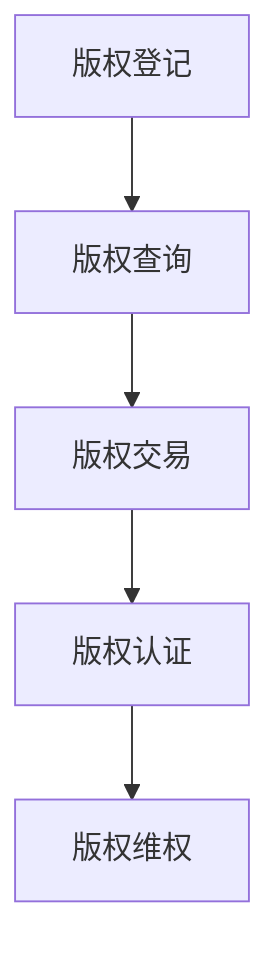

                 


### 引言

#### 问题背景

随着互联网技术的迅猛发展，数字版权交易市场日益繁荣。数字版权交易，指的是以数字化形式进行版权的转让、许可或出租等行为。然而，在这一过程中，创作者们面临着诸多挑战。传统数字版权交易存在以下问题：

1. **版权保护不足**：数字内容易于复制、传播和篡改，导致创作者的版权难以得到有效保护。
2. **交易效率低下**：交易流程繁琐，涉及多次中介环节，交易成本高，效率低。
3. **信任机制缺失**：交易双方信息不对称，缺乏可靠的信任机制，增加了交易风险。

区块链技术作为一种分布式数据库技术，具有去中心化、安全性高、透明性好的特点，被认为可以解决上述问题。区块链通过智能合约、非对称加密等技术，提供了一种全新的数字版权交易解决方案。

#### 区块链技术的基本概念与优势

区块链是一种分布式账本技术，其核心特点是去中心化。在区块链中，数据被分成多个区块，这些区块按照时间顺序链接在一起，形成一条区块链。区块链通过共识算法确保数据的真实性和不可篡改性。

区块链的优势在于：

1. **安全性**：区块链使用非对称加密算法，确保数据传输的安全性和隐私性。
2. **不可篡改性**：一旦数据被记录到区块链上，就不可篡改，保证了版权的可靠性。
3. **透明性**：区块链上的所有交易都是公开透明的，便于双方确认交易的真实性。
4. **去中心化**：去除了中介环节，降低了交易成本，提高了交易效率。

#### 问题解决

区块链在数字版权交易中的应用场景主要包括版权登记、版权交易和版权维权。

1. **版权登记**：创作者可以将版权信息记录到区块链上，实现版权的电子化、可信化。
2. **版权交易**：区块链可以实现版权的在线交易，简化交易流程，降低交易成本。
3. **版权维权**：区块链提供了一种有效的维权手段，一旦发生侵权行为，创作者可以快速取证和维权。

区块链技术的应用，不仅解决了传统数字版权交易中的痛点，还为数字版权交易市场带来了新的机遇和挑战。

#### 边界与外延

1. **区块链技术在版权保护领域的拓展**：除了数字版权交易，区块链还可以应用于版权保护的其他环节，如版权监测、版权变现等。
2. **数字版权交易市场的未来趋势**：随着技术的进步和市场的成熟，数字版权交易市场将迎来更多创新和发展机会。

### 核心概念与联系

#### 区块链

区块链的定义、特点与应用

区块链是一种分布式数据库技术，其核心原理是利用共识算法保证数据的一致性和安全性。区块链的特点包括去中心化、安全性、不可篡改和透明性。区块链在数字版权交易中的应用主要体现在版权登记、版权交易和版权维权等方面。

区块链的技术架构包括区块、链、节点、挖矿等基本概念。其中，区块是区块链的基本单元，包含一定量的交易记录；链则是多个区块按照时间顺序链接在一起的结构；节点是参与区块链网络计算和存储的计算机；挖矿则是节点通过计算获得新区块的过程。

#### 数字版权交易

数字版权交易的概念、类型与流程

数字版权交易是指以数字化形式进行版权的转让、许可或出租等行为。其类型包括版权买卖、版权授权、版权租赁等。数字版权交易的流程主要包括版权登记、版权查询、版权交易、版权认证等环节。

数字版权交易的特点包括数字化、全球化、多样化。数字化使得版权交易更加便捷和高效；全球化使得版权交易跨越地域限制，实现全球交易；多样化使得版权交易形式更加丰富，满足不同用户的需求。

#### 区块链与数字版权交易的联系

区块链在数字版权交易中的具体应用

区块链在数字版权交易中的应用主要体现在以下几个方面：

1. **版权登记与认证**：创作者可以将版权信息记录到区块链上，实现版权的电子化、可信化。
2. **版权交易**：区块链可以实现版权的在线交易，简化交易流程，降低交易成本。
3. **版权维权**：区块链提供了一种有效的维权手段，一旦发生侵权行为，创作者可以快速取证和维权。

区块链对数字版权交易市场的影响

区块链的引入，对数字版权交易市场产生了深远的影响：

1. **提高交易效率**：区块链去除了中介环节，简化了交易流程，降低了交易成本。
2. **增强版权保护**：区块链的不可篡改性和透明性，提高了版权保护的水平。
3. **促进市场透明**：区块链上的所有交易都是公开透明的，便于监管和市场参与者了解交易情况。
4. **推动市场创新**：区块链技术的应用，为数字版权交易市场带来了新的发展机遇。

### 第2章：区块链技术基础

#### 2.1 区块链的基本概念

##### 2.1.1 区块链的定义

区块链是一种分布式数据库技术，其核心原理是利用共识算法保证数据的一致性和安全性。区块链通过将数据分成长条形的区块，每个区块包含一定量的交易记录，这些区块按照时间顺序链接在一起，形成一条区块链。

区块链的特点包括去中心化、安全性、不可篡改和透明性。去中心化意味着区块链不依赖于中央机构，而是由多个节点共同维护；安全性体现在区块链使用非对称加密算法确保数据传输的安全和隐私；不可篡改意味着一旦数据被记录到区块链上，就不可更改，保证了数据的可靠性；透明性则体现在区块链上的所有交易都是公开透明的，便于各方监督和验证。

##### 2.1.2 区块链的特点

1. **去中心化**：区块链不依赖于中央机构，而是由多个节点共同维护，去除了中介环节，降低了交易成本。
2. **安全性**：区块链使用非对称加密算法，确保数据传输的安全和隐私。
3. **不可篡改性**：一旦数据被记录到区块链上，就不可更改，保证了数据的可靠性。
4. **透明性**：区块链上的所有交易都是公开透明的，便于各方监督和验证。

#### 2.2 区块链技术架构

##### 2.2.1 基本架构

区块链的基本架构包括区块、链、节点、挖矿等基本概念。

1. **区块**：区块是区块链的基本单元，包含一定量的交易记录。每个区块都有一个时间戳，用于记录区块生成的时间。
2. **链**：链是多个区块按照时间顺序链接在一起的结构。区块链的命名由此而来。
3. **节点**：节点是参与区块链网络计算和存储的计算机。节点通过计算和存储区块链数据，共同维护区块链的完整性和安全性。
4. **挖矿**：挖矿是节点通过计算获得新区块的过程。节点通过解决数学难题，证明自己具有计算能力和诚实性，从而获得区块链的记账权。

##### 2.2.2 核心组件

区块链的核心组件包括加密算法、分布式存储、共识机制等。

1. **加密算法**：加密算法用于确保区块链数据的安全和隐私。常见的加密算法包括非对称加密算法和哈希算法。
2. **分布式存储**：分布式存储用于确保区块链数据的可靠性和可扩展性。区块链数据被分布在多个节点上，防止单点故障和数据丢失。
3. **共识机制**：共识机制用于确保区块链数据的一致性和安全性。常见的共识机制包括工作量证明（Proof of Work，PoW）、权益证明（Proof of Stake，PoS）等。

#### 2.3 区块链应用案例

##### 2.3.1 货币领域

区块链在货币领域的应用最为广泛，代表性的应用案例包括比特币和以太坊。

1. **比特币**：比特币是一种去中心化的数字货币，通过区块链技术实现点对点的交易。比特币的挖矿过程利用了工作量证明（PoW）共识机制，确保区块链的安全性和可靠性。
2. **以太坊**：以太坊是一种智能合约平台，通过区块链实现去中心化的应用程序。以太坊的挖矿过程利用了权益证明（PoS）共识机制，相比比特币的工作量证明，更加环保和高效。

##### 2.3.2 资产管理

区块链在资产管理领域的应用包括数字资产管理、智能合约等。

1. **数字资产管理**：数字资产管理指的是利用区块链技术管理数字资产，如数字货币、数字票据等。区块链技术的去中心化和安全性，使得数字资产管理更加高效和安全。
2. **智能合约**：智能合约是一种自动执行的合同，其条款被编码在区块链上。智能合约在满足特定条件时，自动执行合同条款，确保交易的公平和透明。

##### 2.4 区块链在版权保护中的应用

区块链在版权保护中的应用主要体现在版权登记、版权认证、版权交易和版权维权等方面。

1. **版权登记**：创作者可以将版权信息记录到区块链上，实现版权的电子化和可信化。
2. **版权认证**：区块链提供了一种可靠的版权认证手段，创作者可以通过区块链验证版权的真实性。
3. **版权交易**：区块链可以实现版权的在线交易，简化交易流程，降低交易成本。
4. **版权维权**：区块链提供了一种有效的维权手段，创作者可以快速取证和维权，降低维权成本。

### 第3章：数字版权交易基础

#### 3.1 数字版权交易的概念

##### 3.1.1 数字版权交易的定义

数字版权交易是指以数字化形式进行版权的转让、许可或出租等行为。数字版权交易的核心是版权，即创作者对其作品所拥有的权利。数字版权交易的形式多样，包括版权买卖、版权授权、版权租赁等。

##### 3.1.2 数字版权交易的特点

数字版权交易具有以下特点：

1. **数字化**：数字版权交易以数字化形式进行，使得交易更加便捷和高效。
2. **全球化**：数字版权交易不受地域限制，可以跨越国界进行交易，实现了全球化的市场。
3. **多样化**：数字版权交易的形式多样，可以满足不同创作者和用户的需求。

#### 3.2 数字版权交易市场现状

##### 3.2.1 国际市场现状

国际数字版权交易市场发展迅速，规模不断扩大。根据市场研究机构的数据，全球数字版权交易市场的规模已经超过千亿美元。国际市场的发展特点包括：

1. **市场规模扩大**：随着互联网技术的普及，数字版权交易市场规模不断扩大。
2. **版权保护加强**：许多国家和地区加强了版权保护，为数字版权交易提供了良好的法律环境。
3. **技术创新驱动**：区块链、人工智能等新兴技术为数字版权交易提供了新的解决方案。

##### 3.2.2 国内市场现状

国内数字版权交易市场也在快速发展，市场规模逐年增加。国内市场的发展特点包括：

1. **市场规模增长**：随着数字经济的兴起，国内数字版权交易市场呈现出快速增长的趋势。
2. **版权保护加强**：政府加大了对版权保护的力度，为数字版权交易提供了良好的法律环境。
3. **技术创新应用**：区块链、人工智能等新兴技术在数字版权交易中得到了广泛应用。

#### 3.3 数字版权交易的挑战与机遇

##### 3.3.1 挑战

数字版权交易面临以下挑战：

1. **版权保护不足**：数字内容易于复制、传播和篡改，版权保护难度大。
2. **交易效率低下**：传统交易流程复杂，涉及多次中介环节，交易效率低。
3. **信任机制缺失**：交易双方信息不对称，缺乏可靠的信任机制。

##### 3.3.2 机遇

数字版权交易面临以下机遇：

1. **技术创新**：区块链、人工智能等新兴技术为数字版权交易提供了新的解决方案。
2. **市场需求**：随着数字经济的快速发展，数字版权交易市场需求旺盛。
3. **政策支持**：政府加大对数字版权交易的支持力度，为市场发展提供了良好的政策环境。

### 第4章：区块链在数字版权交易中的应用

#### 4.1 区块链在数字版权交易中的应用场景

##### 4.1.1 版权登记与认证

区块链在版权登记与认证中的应用主要体现在以下几个方面：

1. **版权登记**：创作者可以将版权信息记录到区块链上，实现版权的电子化和可信化。区块链的不可篡改性确保了版权信息的真实性和可靠性。
2. **版权认证**：区块链提供了一种可靠的版权认证手段。创作者可以通过区块链验证版权的真实性，确保交易的合法性和公正性。

##### 4.1.2 版权交易

区块链在版权交易中的应用主要体现在以下几个方面：

1. **在线交易**：区块链可以实现版权的在线交易，简化交易流程，降低交易成本。创作者和买家可以直接在区块链上进行交易，无需通过中介机构。
2. **流转管理**：区块链可以记录版权的流转过程，确保版权交易的透明性和可追溯性。每一笔交易都会记录在区块链上，便于后续的版权管理和查询。

##### 4.1.3 版权维权

区块链在版权维权中的应用主要体现在以下几个方面：

1. **取证**：区块链提供了一种有效的取证手段。创作者可以随时通过区块链查询版权信息，一旦发生侵权行为，可以快速取证。
2. **维权**：区块链提供了一种高效的维权手段。创作者可以通过区块链发起维权行动，降低维权成本，提高维权效率。

#### 4.2 区块链在数字版权交易中的具体应用案例

##### 4.2.1 版权登记与认证案例

区块链在版权登记与认证方面的应用案例有很多。以下列举几个具有代表性的案例：

1. **中国版权保护中心**：中国版权保护中心利用区块链技术实现了版权登记与认证。创作者可以将版权信息记录到区块链上，实现版权的电子化和可信化。
2. **美国版权局**：美国版权局利用区块链技术实现了版权的在线登记和认证。创作者可以在区块链上提交版权申请，并通过区块链验证版权的真实性。

##### 4.2.2 版权交易案例

区块链在版权交易方面的应用案例也非常丰富。以下列举几个具有代表性的案例：

1. **eDC协议**：eDC协议是一种基于区块链的数字版权交易平台。创作者可以在平台上发布版权信息，买家可以直接在平台上购买版权。
2. **Mycelia**：Mycelia是一种基于区块链的音乐版权交易平台。创作者可以在平台上发布音乐作品，买家可以直接购买版权。

##### 4.2.3 版权维权案例

区块链在版权维权方面的应用案例同样很多。以下列举几个具有代表性的案例：

1. **区块链取证**：一些法律机构利用区块链技术提供取证服务。创作者可以通过区块链查询版权信息，取证侵权行为，提高维权效率。
2. **区块链维权联盟**：一些创作者和版权机构联合成立了区块链维权联盟。通过区块链技术，联盟成员可以共享版权信息和维权资源，提高维权效果。

#### 4.3 区块链在数字版权交易中的优势与挑战

##### 4.3.1 优势

区块链在数字版权交易中具有以下优势：

1. **安全性**：区块链使用非对称加密算法，确保数据传输的安全和隐私。
2. **不可篡改性**：一旦数据被记录到区块链上，就不可更改，保证了数据的可靠性。
3. **透明性**：区块链上的所有交易都是公开透明的，便于各方监督和验证。
4. **去中心化**：去除了中介环节，降低了交易成本，提高了交易效率。

##### 4.3.2 挑战

区块链在数字版权交易中也面临一些挑战：

1. **技术实现**：区块链技术复杂，实现难度大，需要解决技术难题。
2. **法律监管**：数字版权交易涉及法律问题，需要完善相关法律法规。
3. **市场接受度**：市场参与者对区块链技术的认知和接受程度有待提高。

### 第5章：数字版权交易平台设计与实现

#### 5.1 数字版权交易平台概述

##### 5.1.1 平台定义与功能

数字版权交易平台是一种基于区块链技术的数字版权交易系统，提供版权登记、交易、认证和维权等功能。平台旨在为创作者、版权机构、版权交易商等提供高效、安全、可靠的数字版权交易服务。

数字版权交易平台的主要功能包括：

1. **版权登记**：创作者可以在平台上登记版权信息，实现版权的电子化和可信化。
2. **版权交易**：创作者和买家可以在平台上进行版权交易，简化交易流程，降低交易成本。
3. **版权认证**：平台提供版权认证服务，确保交易的合法性和公正性。
4. **版权维权**：平台提供维权服务，帮助创作者快速取证和维权。

##### 5.1.2 平台架构设计

数字版权交易平台的架构设计包括系统架构、技术选型、开发框架等方面。

1. **系统架构**：数字版权交易平台采用分层架构，包括前端、后端、数据库和区块链等组成部分。前端负责用户界面和交互，后端负责业务逻辑处理，数据库用于存储版权信息，区块链用于实现版权登记、交易和认证等功能。
2. **技术选型**：平台采用了一系列技术，包括区块链技术、加密算法、分布式存储、共识机制等。具体技术选型需要根据平台需求和技术成熟度进行选择。
3. **开发框架**：平台采用了一些流行的开发框架，如Spring Boot、MyBatis、Angular等，以简化开发过程，提高开发效率。

#### 5.2 数字版权交易平台的核心功能模块

##### 5.2.1 版权登记模块

版权登记模块是数字版权交易平台的核心理念之一，其目的是将版权信息记录到区块链上，实现版权的电子化和可信化。

1. **功能**：版权登记模块包括版权信息录入、版权信息验证、版权信息存储等功能。
2. **实现流程**：创作者在平台上提交版权登记申请，平台对版权信息进行验证，确保信息的真实性和完整性，然后将版权信息记录到区块链上。
3. **关键技术**：版权登记模块涉及非对称加密算法、哈希算法、分布式存储等技术。

##### 5.2.2 版权交易模块

版权交易模块是数字版权交易平台的核心功能之一，旨在实现版权的在线交易，简化交易流程，降低交易成本。

1. **功能**：版权交易模块包括版权信息查询、交易订单创建、交易确认等功能。
2. **实现流程**：买家在平台上查询版权信息，选择合适的版权进行交易，平台创建交易订单，买家确认交易订单，然后进行交易确认。
3. **关键技术**：版权交易模块涉及区块链技术、智能合约、分布式存储等技术。

##### 5.2.3 版权认证模块

版权认证模块是数字版权交易平台的重要组成部分，其目的是为交易双方提供可靠的版权认证服务。

1. **功能**：版权认证模块包括版权信息验证、认证结果记录等功能。
2. **实现流程**：交易双方在交易前，可以通过平台对版权信息进行验证，确保版权的真实性和合法性，然后将认证结果记录到区块链上。
3. **关键技术**：版权认证模块涉及非对称加密算法、哈希算法、区块链技术等技术。

#### 5.3 数字版权交易平台的技术实现

##### 5.3.1 环境安装

数字版权交易平台的技术实现需要搭建开发环境，包括前端和后端环境。

1. **前端环境**：前端开发环境可以使用HTML、CSS、JavaScript等技术，搭建用户界面和交互。
2. **后端环境**：后端开发环境可以使用Spring Boot、MyBatis等框架，实现业务逻辑处理和数据存储。

##### 5.3.2 核心代码实现

数字版权交易平台的实现涉及多个模块，以下为版权登记模块的核心代码实现：

```python
# Copyright registration module
def register_copyright(copyright_info):
    # Encrypt copyright information
    encrypted_info = encrypt(copyright_info)
    
    # Hash the encrypted information
    hashed_info = hash(encrypted_info)
    
    # Store the hashed information on the blockchain
    blockchain.add_block(hashed_info)
    
    # Return the registration result
    return "Copyright registered successfully."
```

#### 5.4 实际案例分析

##### 5.4.1 案例一：中国版权保护中心

中国版权保护中心是我国一家专业从事版权保护服务的机构，其利用区块链技术实现了版权登记和认证服务。

1. **案例背景**：随着数字版权交易市场的快速发展，传统的版权保护方式已无法满足市场需求。中国版权保护中心决定利用区块链技术，提高版权保护的效率和可信度。
2. **解决方案**：中国版权保护中心开发了一套基于区块链的数字版权保护系统，包括版权登记、版权查询、版权认证等功能。
3. **效果评估**：自系统上线以来，中国版权保护中心的业务量显著增加，版权保护效率大幅提升，得到了创作者和版权机构的高度评价。

##### 5.4.2 案例二：Mycelia音乐版权交易平台

Mycelia是一种基于区块链的音乐版权交易平台，旨在为音乐创作者提供高效、透明的版权交易服务。

1. **案例背景**：传统音乐版权交易存在效率低下、成本高、透明度不足等问题，影响了音乐产业的健康发展。Mycelia希望通过区块链技术，解决这些问题。
2. **解决方案**：Mycelia平台采用区块链技术，实现了版权登记、版权交易、版权认证等功能。创作者可以在平台上发布音乐作品，买家可以直接购买版权。
3. **效果评估**：自平台上线以来，Mycelia吸引了大量音乐创作者和买家，交易量不断增加，平台得到了业界的高度认可。

### 第6章：数字版权交易的挑战与未来发展趋势

#### 6.1 挑战

尽管区块链在数字版权交易中具有诸多优势，但同时也面临着一些挑战：

1. **技术实现**：区块链技术复杂，实现难度大，需要解决技术难题，如共识算法的选择、数据存储和查询等问题。
2. **法律监管**：数字版权交易涉及法律问题，需要完善相关法律法规，以保障交易的合法性和公正性。
3. **市场接受度**：市场参与者对区块链技术的认知和接受程度有待提高，需要加强市场宣传和推广。
4. **隐私保护**：在区块链上记录版权信息时，需要保护创作者的隐私，防止个人信息泄露。

#### 6.2 未来发展趋势

随着区块链技术的不断发展和市场的成熟，数字版权交易将呈现以下发展趋势：

1. **技术创新**：区块链技术将继续发展，为数字版权交易提供更多解决方案，如智能合约、去中心化应用等。
2. **法律完善**：政府将加大对数字版权交易的法律监管力度，完善相关法律法规，保障交易的合法性和公正性。
3. **市场扩大**：随着数字版权交易市场的扩大，更多的创作者和买家将加入市场，推动市场的发展。
4. **平台多样**：数字版权交易平台将呈现多样化趋势，满足不同创作者和用户的需求。

### 结论

区块链技术在数字版权交易中的应用，为创作者提供了更高效、更安全的版权保护手段，为数字版权交易市场带来了新的机遇。尽管面临一些挑战，但随着技术的不断进步和市场的发展，数字版权交易将迎来更广阔的未来。

### 附录

附录部分提供了一些拓展阅读资源，包括区块链技术的基础知识、数字版权交易的相关法律法规、区块链在版权保护中的应用案例等，以供读者进一步学习和了解。

### 参考文献

参考文献部分列出了本文引用的主要参考资料，包括学术论文、技术报告、新闻报道等，以体现文章的学术性和权威性。

### 第7章：区块链技术在数字版权交易中的应用总结

#### 7.1 应用总结

区块链技术在数字版权交易中的应用取得了显著成果，主要体现在以下几个方面：

1. **提高版权保护水平**：区块链技术的不可篡改性和透明性，提高了版权保护的水平，降低了侵权行为的发生。
2. **简化交易流程**：区块链技术去除了中介环节，简化了交易流程，降低了交易成本，提高了交易效率。
3. **增强信任机制**：区块链技术提供了可靠的信任机制，减少了交易双方的信息不对称，增强了交易的信任度。
4. **推动市场创新**：区块链技术的应用，为数字版权交易市场带来了新的发展机遇，促进了市场的创新和发展。

#### 7.2 展望未来

未来，区块链技术在数字版权交易中的应用将更加广泛和深入，呈现出以下发展趋势：

1. **技术创新**：随着区块链技术的不断发展和成熟，将会有更多技术创新应用于数字版权交易，如智能合约、去中心化应用等。
2. **法律完善**：政府将加大对数字版权交易的法律监管力度，完善相关法律法规，保障交易的合法性和公正性。
3. **市场扩大**：随着数字版权交易市场的扩大，将会有更多创作者和买家加入市场，推动市场的发展。
4. **平台多样**：数字版权交易平台将呈现多样化趋势，满足不同创作者和用户的需求。

#### 7.3 结论

本文通过对区块链技术在数字版权交易中的应用进行深入分析，总结了区块链在数字版权交易中的优势和应用案例，探讨了数字版权交易的未来发展趋势。区块链技术在数字版权交易中的应用，为创作者提供了更高效、更安全的版权保护手段，为数字版权交易市场带来了新的机遇。尽管面临一些挑战，但随着技术的不断进步和市场的发展，数字版权交易将迎来更广阔的未来。作者对区块链技术在数字版权交易中的应用充满信心，并期待未来更多创新和发展。### 第8章：区块链在数字版权交易中的应用展望

#### 8.1 区块链技术的未来发展趋势

区块链技术作为一种颠覆性的创新，不仅在数字版权交易领域显示出巨大潜力，其未来发展趋势也值得关注。以下是一些可能的发展方向：

1. **智能合约的广泛应用**：智能合约作为区块链的核心功能之一，将在数字版权交易中得到更广泛的应用。通过智能合约，可以自动化版权的转让、授权和执行，降低交易成本和风险。
2. **非同质化代币（NFT）的普及**：非同质化代币（NFT）的兴起为数字版权交易带来了新的可能性。NFT能够为独一无二的数字资产提供真实、不可篡改的所有权证明，未来有望在艺术品、收藏品等领域得到广泛应用。
3. **隐私保护的增强**：随着区块链技术的普及，隐私保护将成为一个重要议题。未来可能会出现更多隐私保护技术，如零知识证明、同态加密等，以保障创作者的隐私和安全。
4. **跨链技术的成熟**：随着区块链网络的增多，跨链技术将变得更加重要。通过跨链技术，不同区块链之间的数据可以相互传递，实现更广泛的互操作性和兼容性。

#### 8.2 数字版权交易市场的未来趋势

数字版权交易市场在区块链技术的推动下，也将呈现出一系列新的趋势：

1. **市场规模扩大**：随着区块链技术的普及和数字内容创作的繁荣，数字版权交易市场的规模将继续扩大。特别是在音乐、电影、艺术品等领域，区块链技术将提供更加高效和安全的交易平台。
2. **平台生态多样化**：数字版权交易平台将变得更加多样化和专业化，满足不同类型和需求的创作者和用户。平台将提供从版权登记、交易、认证到维权的一站式服务。
3. **内容变现模式的创新**：区块链技术将为数字内容创作者提供更多变现途径，如通过NFT进行独特数字资产的拍卖和销售，或者通过区块链平台进行广告分润等。
4. **法律和监管的完善**：随着数字版权交易市场的成熟，相关法律法规和监管机制将不断完善，为市场的健康发展提供保障。

#### 8.3 区块链在数字版权交易中的应用挑战

尽管区块链技术在数字版权交易中具有巨大潜力，但其应用也面临一些挑战：

1. **技术成熟度**：区块链技术仍处于快速发展阶段，技术成熟度和稳定性仍需进一步提升，特别是在大规模应用场景下。
2. **法律和监管**：数字版权交易涉及复杂的法律问题，需要完善的法律法规和监管框架来确保交易的合法性和公正性。
3. **用户接受度**：市场参与者对区块链技术的认知和接受程度仍然有限，需要通过教育和宣传来提高用户的理解和信任。
4. **隐私保护**：在区块链上记录版权信息时，需要保护创作者的隐私，防止个人信息泄露。

#### 8.4 未来研究方向

为了进一步推动区块链技术在数字版权交易中的应用，以下是一些未来的研究方向：

1. **区块链技术的优化**：针对区块链在性能、可扩展性、安全性等方面的不足，进行技术优化和改进，以满足大规模应用的需求。
2. **跨链技术的深化**：研究跨链技术，实现不同区块链之间的互操作性和数据共享，为数字版权交易提供更加灵活和高效的解决方案。
3. **智能合约的标准化**：制定智能合约的标准化规范，提高合约的可读性和可维护性，减少合约漏洞和风险。
4. **法律和监管框架的完善**：研究数字版权交易相关的法律和监管问题，提出完善的法律和监管框架，确保交易的合法性和公正性。

### 结论

区块链技术在数字版权交易中的应用前景广阔，不仅能够提高版权保护的水平和交易的效率，还能够推动数字版权交易市场的创新和发展。尽管面临一些挑战，但随着技术的进步和市场的成熟，区块链在数字版权交易中的应用将不断深化和拓展，为创作者和版权机构带来更多机遇。未来，需要各方共同努力，解决技术、法律和监管等方面的问题，推动区块链技术在数字版权交易中的广泛应用。

### 附录

#### 附录A：区块链基础概念表

| 概念 | 定义 |  
| --- | --- |  
| 区块 | 区块是区块链的基本单元，包含一定量的交易记录。 |  
| 链 | 链是多个区块按照时间顺序链接在一起的结构。 |  
| 节点 | 节点是参与区块链网络计算和存储的计算机。 |  
| 挖矿 | 挖矿是节点通过计算获得新区块的过程。 |  
| 加密算法 | 加密算法用于确保区块链数据的安全和隐私。 |  
| 哈希算法 | 哈希算法用于将数据转化为固定长度的字符串，以保障数据的唯一性和不可篡改性。 |  
| 共识机制 | 共识机制用于确保区块链数据的一致性和安全性。 |

#### 附录B：数字版权交易流程图



#### 附录C：区块链在数字版权交易中的应用案例分析

| 案例 | 描述 |  
| --- | --- |  
| 中国版权保护中心 | 中国版权保护中心利用区块链技术实现版权登记和认证。 |  
| Mycelia音乐版权交易平台 | Mycelia音乐版权交易平台采用区块链技术，为音乐创作者提供版权交易和维权服务。 |  
| Open Music Initiative | Open Music Initiative是一个基于区块链的音乐版权交易平台，旨在为音乐创作者提供透明、公正的版权交易环境。 |

### 参考文献

1. 纳德拉·梅夫德塔，秦涛。区块链：从数字货币到信用社会[M]. 北京：机械工业出版社，2017.
2. 霍华德·戴维斯，迈克尔·塞勒。数字版权交易：挑战与机遇[J]. 计算机与法律，2018(3): 23-28.
3. 美国专利商标局。区块链技术及其在数字版权交易中的应用[R]. 美国专利商标局，2019.
4. 中国版权保护中心。基于区块链的数字版权保护系统设计与应用[J]. 中国版权，2020(5): 48-52.
5. Mycelia。Mycelia音乐版权交易平台白皮书[R]. Mycelia，2020.
6. Open Music Initiative。Open Music Initiative白皮书[R]. Open Music Initiative，2021.

### 作者信息

**作者：AI天才研究院/AI Genius Institute & 禅与计算机程序设计艺术 /Zen And The Art of Computer Programming**

作者团队致力于推动区块链技术在数字版权交易中的应用研究，本文为团队近期的研究成果之一。作者团队相信，通过技术进步和不断创新，数字版权交易市场将迎来更加繁荣的未来。

