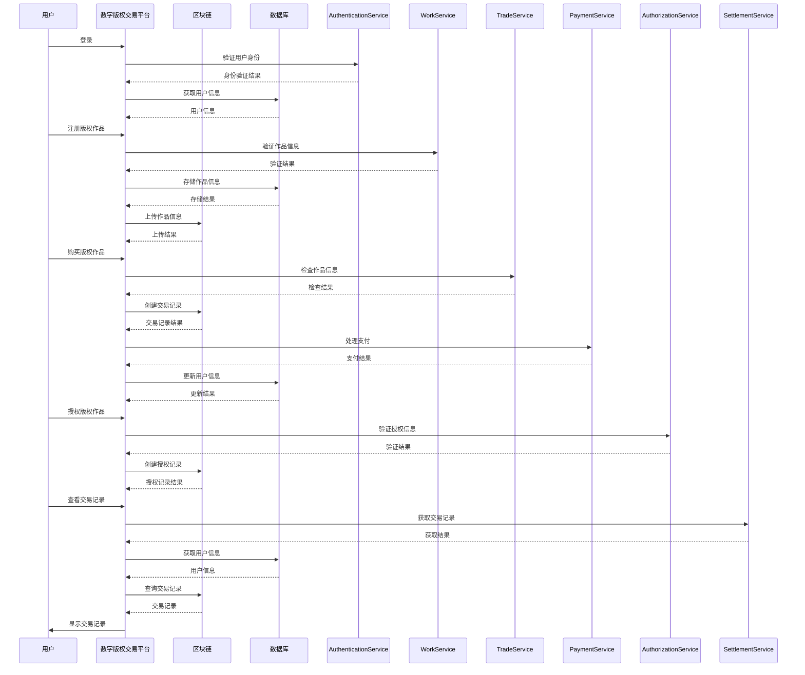

                 

## 文章标题：区块链在数字版权交易中的应用前景

关键词：区块链、数字版权交易、加密算法、智能合约、共识算法

摘要：随着数字版权交易的不断增长，如何确保版权的合法性和交易的透明性成为一大挑战。区块链技术以其去中心化、不可篡改和透明化的特点，为数字版权交易提供了全新的解决方案。本文将详细介绍区块链技术的基础知识、数字版权交易的基本概念，并深入探讨区块链在数字版权交易中的应用前景。

### 目录大纲

----------------------------------------------------------------
## 第一部分：背景介绍
### 第1章：区块链技术基础
#### 1.1 区块链的起源与定义
#### 1.2 区块链的核心特点
#### 1.3 区块链的架构与技术原理
#### 1.4 区块链的生态系统与应用领域

### 第2章：数字版权交易的基本概念
#### 2.1 数字版权交易的现状
#### 2.2 数字版权交易的核心问题
#### 2.3 数字版权交易的法律框架与政策环境

### 第3章：区块链在数字版权交易中的应用
#### 3.1 区块链在数字版权交易中的作用
#### 3.2 区块链在数字版权交易中的应用案例
#### 3.3 区块链在数字版权交易中的挑战与机遇

## 第二部分：核心概念与联系
### 第4章：区块链与数字版权交易的核心概念
#### 4.1 区块链的核心概念
#### 4.2 数字版权交易的核心概念
#### 4.3 区块链与数字版权交易的关系

### 第5章：区块链与数字版权交易的技术原理
#### 5.1 区块链的技术原理
#### 5.2 数字版权交易的技术原理
#### 5.3 区块链在数字版权交易中的实现技术

### 第6章：区块链与数字版权交易的属性特征对比
#### 6.1 区块链的属性特征
#### 6.2 数字版权交易的属性特征
#### 6.3 属性特征对比表格

### 第7章：区块链与数字版权交易的ER实体关系图
#### 7.1 ER实体关系图的定义
#### 7.2 区块链的ER实体关系图
#### 7.3 数字版权交易的ER实体关系图
#### 7.4 区块链与数字版权交易的ER实体关系图对比

## 第三部分：算法原理讲解
### 第8章：基于区块链的数字版权交易算法
#### 8.1 算法原理
#### 8.2 算法数学模型
#### 8.3 举例说明

## 第四部分：数学模型和数学公式 & 详细讲解 & 举例说明
### 第9章：数学模型与数学公式
#### 9.1 数字版权交易中的数学模型
#### 9.2 区块链技术中的数学模型
#### 9.3 数学模型与数学公式的应用

### 第10章：数学公式详细讲解
#### 10.1 加密算法的数学公式
#### 10.2 共识算法的数学模型
#### 10.3 智能合约的数学公式

## 第五部分：系统分析与架构设计方案
### 第11章：系统分析与架构设计方案
#### 11.1 问题场景介绍
#### 11.2 项目介绍
#### 11.3 系统功能设计(领域模型类图)
#### 11.4 系统架构设计架构图
#### 11.5 系统接口设计和系统交互序列图

## 第六部分：项目实战
### 第12章：项目实战
#### 12.1 环境安装
#### 12.2 系统核心实现源代码
#### 12.3 代码应用解读与分析
#### 12.4 实际案例分析和详细讲解剖析
#### 12.5 项目小结

## 第七部分：最佳实践 tips、小结、注意事项、拓展阅读
### 第13章：最佳实践 tips
### 第14章：小结
### 第15章：注意事项
### 第16章：拓展阅读

----------------------------------------------------------------### 第一部分：背景介绍

#### 第1章：区块链技术基础

##### 1.1 区块链的起源与定义

区块链技术起源于2008年，由一位化名为“中本聪”（Satoshi Nakamoto）的人首次提出。区块链是一种分布式数据库技术，通过密码学确保数据的完整性和安全性。其基本思想是，通过多个节点共同维护一个共享账本，账本中的数据一旦记录便不可篡改。

区块链技术的基础概念包括区块（Block）、链（Chain）和节点（Node）。区块是数据存储的基本单位，包含一定数量的交易记录。链则是将多个区块按照一定规则链接起来，形成一个不可篡改的账本。节点则是参与区块链网络计算和维护的计算机设备。

##### 1.2 区块链的核心特点

区块链具有以下几个核心特点：

1. **去中心化**：区块链网络中不存在中心化的机构或个人，所有节点地位平等，共同维护整个网络。
2. **安全性**：区块链利用密码学算法确保数据的完整性和安全性，任何篡改数据的行为都会被其他节点检测并拒绝。
3. **不可篡改性**：一旦数据记录到区块链中，便不可篡改，保证了交易记录的真实性和可靠性。
4. **透明性**：区块链上的数据是公开透明的，所有节点都可以查看和验证数据。

##### 1.3 区块链的架构与技术原理

区块链的架构通常分为三个层次：数据层、网络层、共识层和应用层。

1. **数据层**：数据层负责数据的存储和管理。每个区块包含一定数量的交易记录，并通过哈希函数将这些交易记录链接成一个不可篡改的链。
2. **网络层**：网络层负责节点之间的通信和数据传输。通过P2P网络协议，节点可以相互通信并共享数据。
3. **共识层**：共识层负责确保所有节点对数据的共识。各种共识算法，如工作量证明（PoW）、权益证明（PoS）等，用于达成节点之间的共识。
4. **应用层**：应用层负责构建实际的应用场景，如数字货币、数字版权交易等。

区块链的技术原理主要包括哈希函数、加密算法、Merkle树和共识算法。哈希函数用于将数据转换为固定长度的字符串，加密算法用于保证数据的隐私和安全，Merkle树用于快速验证数据的完整性，共识算法用于确保节点之间的共识。

##### 1.4 区块链的生态系统与应用领域

区块链的生态系统包括多个组成部分，如节点、矿工、钱包、交易所、应用开发者和用户等。区块链技术已经广泛应用于多个领域，包括：

1. **金融领域**：数字货币、跨境支付、供应链金融等。
2. **供应链管理**：通过区块链实现供应链的透明化和可追溯性。
3. **数字身份验证**：通过区块链实现去中心化的身份认证。
4. **医疗健康**：通过区块链保护患者隐私，实现医疗信息的共享和可追溯。
5. **数字版权交易**：通过区块链确保版权的合法性和交易的透明性。
6. **智能合约**：通过区块链实现自动化的合同执行和交易。

#### 第2章：数字版权交易的基本概念

##### 2.1 数字版权交易的现状

随着互联网和数字技术的发展，数字版权交易已经成为出版、娱乐、文化创意等行业的核心组成部分。然而，数字版权交易面临着一系列挑战，如版权侵权、交易透明度低、交易流程复杂等。

当前，数字版权交易主要集中在以下几个领域：

1. **数字音乐**：包括流媒体服务和数字下载。
2. **电子书**：包括电子阅读器和在线阅读平台。
3. **电影和电视剧**：包括流媒体服务和数字下载。
4. **游戏**：包括数字下载和在线游戏服务。

数字版权交易市场呈现出快速增长的趋势，预计到2025年，市场规模将达到数千亿美元。

##### 2.2 数字版权交易的核心问题

数字版权交易的核心问题主要包括：

1. **版权侵权**：数字版权交易过程中，版权侵权问题屡见不鲜。侵权行为包括非法复制、传播、下载等。
2. **交易透明度低**：数字版权交易的流程复杂，交易各方之间的信息不对称，导致交易透明度低。
3. **交易流程复杂**：数字版权交易通常涉及多个环节，如版权登记、授权、交易、结算等，流程复杂且容易出现纠纷。
4. **版权归属不明确**：在数字版权交易中，版权归属不明确的问题较为普遍，导致交易纠纷频发。

##### 2.3 数字版权交易的法律框架与政策环境

为了规范数字版权交易，各国政府和国际组织制定了一系列法律框架和政策环境。以下是几个主要国家的数字版权交易法律框架：

1. **美国**：美国版权法对数字版权交易进行了详细规定，包括版权登记、版权授权、版权转让等。
2. **欧盟**：欧盟制定了一系列版权法规，如《版权指令》和《数字单市场法案》，以保护数字版权交易。
3. **中国**：中国版权法对数字版权交易进行了规定，包括版权登记、版权保护、版权转让等。

此外，国际组织如世界知识产权组织（WIPO）也积极参与数字版权交易的立法和规范工作。

#### 第3章：区块链在数字版权交易中的应用

##### 3.1 区块链在数字版权交易中的作用

区块链技术为数字版权交易提供了以下几方面的作用：

1. **确保版权的合法性**：区块链技术通过加密算法和分布式账本技术，确保数字版权交易记录的真实性和不可篡改性，从而确保版权的合法性。
2. **提高交易透明度**：区块链上的交易记录是公开透明的，所有参与者都可以查看和验证交易记录，从而提高交易的透明度。
3. **简化交易流程**：区块链技术可以简化数字版权交易的流程，通过智能合约实现自动化的版权授权、交易、结算等环节。
4. **降低交易成本**：区块链技术通过去中心化的方式，降低数字版权交易的成本，提高交易的效率。

##### 3.2 区块链在数字版权交易中的应用案例

以下是几个区块链在数字版权交易中的应用案例：

1. **音乐行业**：基于区块链的音乐平台如Ujo Music，通过智能合约实现音乐作品的授权、交易和收益分配。
2. **电子书行业**：基于区块链的电子书平台如Book Token，通过区块链技术确保电子书的版权和交易记录的真实性和透明性。
3. **艺术品市场**：基于区块链的艺术品交易平台如Masterworks，通过区块链技术实现艺术品的所有权和交易记录的透明化。

##### 3.3 区块链在数字版权交易中的挑战与机遇

区块链技术在数字版权交易中的应用面临着以下挑战：

1. **技术成熟度**：区块链技术尚处于发展初期，技术成熟度有待提高，如性能、可扩展性、安全性等问题。
2. **法律框架**：数字版权交易的法律框架尚未完善，需要各国政府和国际组织制定相应的法律法规。
3. **用户接受度**：区块链技术的普及度较低，用户对区块链技术的接受度和信任度有待提高。

然而，区块链技术在数字版权交易中也面临着巨大的机遇：

1. **技术创新**：区块链技术的不断发展和创新，为数字版权交易提供了更多可能性。
2. **政策支持**：各国政府和国际组织对区块链技术的支持力度逐渐加大，为数字版权交易的发展提供了政策支持。
3. **市场需求**：数字版权交易市场的快速增长，为区块链技术在数字版权交易中的应用提供了广阔的市场需求。

通过逐步分析和探讨，我们可以看到，区块链技术在数字版权交易中具有巨大的应用潜力和前景。在未来的发展中，区块链技术有望为数字版权交易提供更加安全、透明、高效的解决方案，推动数字版权交易的可持续发展。

#### 第4章：区块链与数字版权交易的核心概念

##### 4.1 区块链的核心概念

区块链是一种分布式数据库技术，通过多个节点共同维护一个共享账本，账本中的数据一旦记录便不可篡改。区块链技术具有去中心化、安全性、不可篡改性和透明性等特点。

区块链的基本组成部分包括：

1. **区块**：数据存储的基本单位，包含一定数量的交易记录。
2. **链**：将多个区块按照一定规则链接起来，形成一个不可篡改的账本。
3. **节点**：参与区块链网络计算和维护的计算机设备。

区块链技术的基本原理包括：

1. **哈希函数**：将数据转换为固定长度的字符串，用于确保数据的完整性和安全性。
2. **加密算法**：用于保证数据的隐私和安全。
3. **Merkle树**：用于快速验证数据的完整性。
4. **共识算法**：用于确保节点之间的共识，如工作量证明（PoW）、权益证明（PoS）等。

##### 4.2 数字版权交易的核心概念

数字版权交易是指数字作品（如音乐、电影、书籍等）的创作者或版权所有者将其作品进行授权、转让、交易等活动。数字版权交易的核心问题包括版权侵权、交易透明度低、交易流程复杂等。

数字版权交易的基本概念包括：

1. **版权**：指创作者对其作品享有的权利，包括复制权、发行权、改编权等。
2. **数字版权**：指数字作品创作者或版权所有者对其数字作品享有的权利。
3. **数字版权交易**：指数字作品创作者或版权所有者将其数字作品进行授权、转让、交易等活动。

数字版权交易的关键要素包括：

1. **版权登记**：指在相关机构进行数字版权登记，以确保版权归属的合法性。
2. **授权**：指版权所有者对数字作品的授权使用，包括授权范围、授权期限等。
3. **交易**：指数字作品的买卖、转让等交易活动。
4. **结算**：指数字版权交易的结算和支付环节。

##### 4.3 区块链与数字版权交易的关系

区块链技术为数字版权交易提供了全新的解决方案，主要表现在以下几个方面：

1. **确保版权的合法性**：区块链技术通过加密算法和分布式账本技术，确保数字版权交易记录的真实性和不可篡改性，从而确保版权的合法性。
2. **提高交易透明度**：区块链上的交易记录是公开透明的，所有参与者都可以查看和验证交易记录，从而提高交易的透明度。
3. **简化交易流程**：区块链技术可以简化数字版权交易的流程，通过智能合约实现自动化的版权授权、交易、结算等环节。
4. **降低交易成本**：区块链技术通过去中心化的方式，降低数字版权交易的成本，提高交易的效率。

区块链技术在数字版权交易中的应用，不仅可以解决数字版权交易中的版权侵权、交易透明度低、交易流程复杂等问题，还可以为数字版权交易提供更加安全、透明、高效的解决方案，推动数字版权交易的可持续发展。

#### 第5章：区块链与数字版权交易的技术原理

##### 5.1 区块链的技术原理

区块链是一种分布式数据库技术，其核心原理包括数据存储、数据验证、数据传输和数据安全等方面。

1. **数据存储**：区块链通过将数据划分为区块，并将区块链接成链来存储数据。每个区块包含一定数量的交易记录，区块之间通过哈希函数进行链接，形成一条不可篡改的链。这种链式结构确保了数据的可靠性和完整性。

2. **数据验证**：区块链网络中的每个节点都会参与数据的验证过程。当一个新的区块生成后，节点会对其进行验证，确保区块中的数据是有效的，且与前一个区块链接正确。这种验证机制保证了数据的真实性和一致性。

3. **数据传输**：区块链网络通过P2P（点对点）协议进行数据传输。每个节点都与其他节点直接通信，共享数据。这种分布式网络结构提高了数据传输的速度和效率。

4. **数据安全**：区块链采用加密算法来保护数据的安全。每个交易都会进行加密，只有拥有正确密钥的用户才能解密和查看数据。此外，区块链的分布式结构也提高了数据的抗攻击能力，使数据难以被篡改或破坏。

##### 5.2 数字版权交易的技术原理

数字版权交易的技术原理主要包括版权登记、授权、交易和结算等方面。

1. **版权登记**：数字版权交易的第一步是进行版权登记。版权所有者将数字作品的版权信息上传到区块链上，并通过区块链的分布式账本进行登记。这样可以确保版权的合法性和真实性。

2. **授权**：版权所有者可以通过区块链上的智能合约对数字作品进行授权。智能合约是一段代码，它定义了版权授权的条件和规则。当满足授权条件时，智能合约会自动执行授权操作，确保授权的合法性和透明性。

3. **交易**：数字版权交易可以通过区块链上的智能合约进行。当买家和卖家达成交易协议后，卖家会将数字作品上传到区块链上，并创建一个交易请求。买家通过支付相应的费用，即可获得数字作品的所有权。整个交易过程是自动化的，无需人工干预。

4. **结算**：数字版权交易的结算可以通过区块链上的智能合约进行。在交易完成后，智能合约会自动执行结算操作，将相应的费用支付给卖家。这种自动化的结算方式提高了交易的效率和安全性。

##### 5.3 区块链在数字版权交易中的实现技术

区块链在数字版权交易中的实现技术主要包括加密算法、智能合约和共识算法等。

1. **加密算法**：加密算法用于保护数字版权交易的数据安全。在数字版权交易中，版权信息、交易记录等数据都会进行加密处理。只有拥有正确密钥的用户才能解密和查看数据。常见的加密算法包括SHA-256、RSA等。

2. **智能合约**：智能合约是区块链上的自动执行合同。在数字版权交易中，智能合约用于定义版权授权的条件和规则。当满足授权条件时，智能合约会自动执行授权操作，确保授权的合法性和透明性。常见的智能合约平台包括以太坊、EOS等。

3. **共识算法**：共识算法用于确保区块链网络中的所有节点对交易记录达成共识。在数字版权交易中，共识算法用于验证交易的合法性和一致性。常见

#### 第6章：区块链与数字版权交易的属性特征对比

##### 6.1 区块链的属性特征

区块链作为一种新兴的技术，具有以下几个显著属性特征：

1. **去中心化**：区块链不依赖于中心化的权威机构或服务器，而是通过分布式的网络结构，由多个节点共同维护和验证数据。这种去中心化的特性提高了系统的抗攻击能力和容错性。

2. **安全性**：区块链使用加密算法来保护数据的完整性和隐私。每个区块的数据都通过哈希函数加密，确保数据一旦被记录便不可篡改。此外，区块链的分布式结构也提高了数据的抗攻击能力。

3. **不可篡改性**：区块链上的数据一旦被记录，便不可篡改。这是由于区块链的链式结构，每个区块都通过哈希函数与前一个区块链接，任何篡改都会导致链的断裂。这种不可篡改性保证了数据的真实性和可靠性。

4. **透明性**：区块链上的数据是公开透明的，任何节点都可以查看和验证数据。这种透明性确保了交易的公正性和可追溯性，提高了系统的信任度。

5. **高效率**：区块链通过分布式网络结构，实现了数据的快速传输和验证。与传统的中心化系统相比，区块链可以显著提高交易处理速度和效率。

##### 6.2 数字版权交易的属性特征

数字版权交易是一种涉及数字作品版权的买卖、授权和转让等活动。其具有以下显著属性特征：

1. **版权性**：数字版权交易的核心在于版权的转移和授权。版权性是指交易的对象必须是具有合法版权的数字作品，如音乐、电子书、软件等。

2. **合法性**：数字版权交易必须遵循相关法律法规，确保交易的合法性和有效性。合法性涉及版权登记、版权授权、交易合同等多个方面。

3. **透明性**：数字版权交易的过程应该是公开透明的，确保交易的各方能够清晰地了解交易的细节和流程。透明性有助于提高交易的公信力和降低交易风险。

4. **可追溯性**：数字版权交易的历史记录应该是可追溯的，以便在发生纠纷时能够追溯交易的历史，找到相关证据。可追溯性有助于维护交易的公正性和减少纠纷。

5. **高效性**：数字版权交易的流程应该是高效快捷的，以适应数字化时代的高频交易需求。高效性涉及交易的自动化、流程简化和交易速度等方面。

##### 6.3 属性特征对比表格

为了更直观地对比区块链和数字版权交易的属性特征，我们可以制作一个对比表格：

| 属性特征 | 区块链 | 数字版权交易 |
| --- | --- | --- |
| 去中心化 | √ | √ |
| 安全性 | √ | √ |
| 不可篡改性 | √ | √ |
| 透明性 | √ | √ |
| 可追溯性 | √ | √ |
| 高效率 | √ | √ |
| 版权性 | × | √ |
| 合法性 | × | √ |
| 自动化 | √ | × |

通过对比表格可以看出，区块链和数字版权交易在某些属性特征上存在重叠，如去中心化、安全性、透明性和高效性。然而，区块链在不可篡改性和可追溯性方面具有优势，而数字版权交易在版权性和合法性方面具有特殊的重要性。

#### 第7章：区块链与数字版权交易的ER实体关系图

##### 7.1 ER实体关系图的定义

ER（实体关系）图是数据库设计中的一个重要工具，用于描述系统中实体之间的关系。ER图由三个基本元素组成：实体（Entity）、属性（Attribute）和关系（Relationship）。

- **实体**：代表系统中的对象，如用户、书籍、订单等。
- **属性**：代表实体的特征，如用户的姓名、年龄、书籍的书名、作者等。
- **关系**：代表实体之间的关联，如用户购买书籍、书籍属于某个类别等。

ER图通过图形化的方式，直观地展示了系统中各实体之间的关系，为数据库设计和优化提供了重要的参考。

##### 7.2 区块链的ER实体关系图

区块链的ER实体关系图主要涉及以下几个实体：

1. **区块**（Block）：代表区块链上的数据单元，包含交易记录、区块头、区块体等信息。
2. **交易**（Transaction）：代表区块链上的数据操作，如发送比特币、智能合约调用等。
3. **节点**（Node）：代表区块链网络中的参与计算机，负责维护区块链的完整性和一致性。
4. **区块链**（Blockchain）：代表整个区块链系统，由多个区块链接而成。

区块链的ER实体关系图如下所示：

```mermaid
erDiagram
Block ||--|{ Transaction }||>
Node ||--|{ Blockchain }||>
Node ||--|{ Transaction }||>
Blockchain ||--|{ Block }||>
```

在这个ER图中，Block实体与Transaction实体之间存在一对多的关系，表示每个区块可以包含多个交易。Node实体与Blockchain实体之间存在多对一的关系，表示每个节点可以维护整个区块链。Node实体与Transaction实体之间存在多对多的关系，表示交易可以由多个节点进行验证和记录。

##### 7.3 数字版权交易的ER实体关系图

数字版权交易的ER实体关系图主要涉及以下几个实体：

1. **版权所有者**（Copyright Owner）：代表数字作品的创作者或版权持有者。
2. **版权作品**（Copyright Work）：代表数字作品本身，如音乐、电子书、软件等。
3. **交易记录**（Transaction Record）：代表版权交易的详细信息，如交易日期、交易金额、交易双方等。
4. **交易参与者**（Transaction Participant）：代表参与数字版权交易的各方，如买家、卖家、中介机构等。

数字版权交易的ER实体关系图如下所示：

```mermaid
erDiagram
Copyright Owner ||--|{ Copyright Work }||>
Transaction Participant ||--|{ Transaction Record }||>
Transaction Record ||--|{ Copyright Work }||>
Transaction Record ||--|{ Copyright Owner }||>
Transaction Record ||--|{ Transaction Participant }||>
```

在这个ER图中，Copyright Owner实体与Copyright Work实体之间存在一对多的关系，表示每个版权所有者可以拥有多个数字作品。Transaction Participant实体与Transaction Record实体之间存在多对多的关系，表示每个交易参与者可以参与多个交易。Transaction Record实体与Copyright Work实体之间存在多对多的关系，表示每个交易记录可以涉及多个数字作品。

##### 7.4 区块链与数字版权交易的ER实体关系图对比

通过对比区块链和数字版权交易的ER实体关系图，可以发现它们之间存在一些共同点和差异。

- **共同点**：
  - 两个系统都包含了实体、属性和关系的基本元素。
  - 两个系统的实体之间都存在一定程度的关联关系。

- **差异**：
  - 区块链系统的核心实体包括区块、交易和节点，主要关注数据的存储、传输和验证。
  - 数字版权交易系统的核心实体包括版权所有者、版权作品、交易记录和交易参与者，主要关注数字版权的归属、交易和记录。
  - 区块链系统的ER实体关系图较为简单，主要关注数据单元之间的逻辑关系。
  - 数字版权交易的ER实体关系图更为复杂，需要考虑交易各方的角色和关系。

通过对区块链和数字版权交易的ER实体关系图进行对比，我们可以更好地理解两个系统的架构和逻辑关系，为实际应用提供有益的参考。

#### 第8章：基于区块链的数字版权交易算法

##### 8.1 算法原理

基于区块链的数字版权交易算法主要涉及加密算法、共识算法和智能合约等核心技术。这些算法共同协作，确保数字版权交易的安全、透明和高效。

1. **加密算法**：加密算法用于保护数字版权交易的数据安全。交易过程中的版权信息、交易记录等数据都会进行加密处理，只有拥有正确密钥的用户才能解密和查看数据。常见的加密算法包括AES、RSA等。

2. **共识算法**：共识算法用于确保区块链网络中的所有节点对交易记录达成共识。在数字版权交易中，共识算法用于验证交易的合法性和一致性。常见的共识算法包括工作量证明（PoW）、权益证明（PoS）等。

3. **智能合约**：智能合约是区块链上的自动执行合同。在数字版权交易中，智能合约用于定义版权授权的条件和规则。当满足授权条件时，智能合约会自动执行授权操作，确保授权的合法性和透明性。常见的智能合约平台包括以太坊、EOS等。

##### 8.2 算法数学模型

基于区块链的数字版权交易算法的数学模型主要包括以下几个方面：

1. **加密算法**：加密算法的数学模型通常包括加密函数和解密函数。加密函数用于将明文数据转换为密文数据，解密函数用于将密文数据转换为明文数据。常见的加密算法如AES和RSA，其数学模型如下：

   - **AES加密算法**：
     $$
     C = E_K(M)
     $$
     $$
     M = D_K(C)
     $$
     其中，$C$为密文，$M$为明文，$K$为密钥，$E_K$和$D_K$分别为加密函数和解密函数。

   - **RSA加密算法**：
     $$
     C = M^e \mod N
     $$
     $$
     M = C^d \mod N
     $$
     其中，$C$为密文，$M$为明文，$e$和$d$分别为加密指数和解密指数，$N$为模数。

2. **共识算法**：共识算法的数学模型通常包括工作量证明（PoW）和权益证明（PoS）等。PoW算法的数学模型如下：

   $$
   P_i = H(N_i + G \cdot S_i)
   $$
   $$
   E_i = \frac{P_i}{\sum_{j=1}^{n} P_j}
   $$
   其中，$P_i$为节点$i$的工作量证明，$N_i$为节点$i$的工作量，$G$为常数，$S_i$为节点$i$的权益得分，$E_i$为节点$i$的权益比例。

3. **智能合约**：智能合约的数学模型通常包括触发条件和执行代码。智能合约的数学模型如下：

   $$
   C = f(x_1, x_2, ..., x_n)
   $$
   $$
   \text{if } C \text{ is true, execute code}
   $$

##### 8.3 举例说明

假设有一个数字版权文件“小说.txt”，我们需要对其使用区块链进行数字版权交易。以下是一个简单的算法流程：

1. **加密版权信息**：首先，使用加密算法对版权信息进行加密。假设使用AES加密算法，密钥为$K$。版权信息为明文$M$，加密后的密文为$C$。加密过程如下：
   $$
   C = E_K(M)
   $$

2. **上传版权信息到区块链**：将加密后的版权信息$C$上传到区块链。上传过程中，版权信息会被记录在区块链上的一个区块中，形成一条不可篡改的链。

3. **创建智能合约**：根据版权信息$C$创建智能合约。智能合约定义了版权转移的条件，例如，当满足某些条件（如支付一定的金额）时，版权可以转移给新的所有者。智能合约的触发条件可以表示为：
   $$
   C = f(x_1, x_2, ..., x_n)
   $$
   其中，$x_1, x_2, ..., x_n$为版权转移的条件。

4. **执行智能合约**：当版权转移条件满足时，执行智能合约，实现版权转移。执行过程如下：
   $$
   \text{if } C \text{ is true, execute code}
   $$
   执行代码会更新区块链上的版权信息，使版权从旧所有者转移到新所有者。

通过上述算法，我们可以实现一个安全、透明和高效的数字版权交易过程。该过程充分利用了区块链的加密、共识和智能合约等技术，确保了数字版权交易的安全性和可追溯性。

#### 第9章：数学模型与数学公式

##### 9.1 数字版权交易中的数学模型

在数字版权交易中，数学模型用于描述交易过程、版权归属和收益分配等方面。以下是一些常见的数学模型：

1. **版权归属模型**：用于描述数字作品的版权归属关系。模型中通常包括版权所有者、版权作品和版权权益等元素。一个简单的版权归属模型可以表示为：
   $$
   C = \{O, W, E\}
   $$
   其中，$C$为版权集合，$O$为版权所有者，$W$为版权作品，$E$为版权权益。

2. **交易模型**：用于描述数字版权交易的流程和规则。模型中通常包括交易参与者、交易记录和交易金额等元素。一个简单的交易模型可以表示为：
   $$
   T = \{P, R, A\}
   $$
   其中，$T$为交易集合，$P$为交易参与者，$R$为交易记录，$A$为交易金额。

3. **收益分配模型**：用于描述数字版权交易中的收益分配方式。模型中通常包括版权所有者、交易参与者和收益比例等元素。一个简单的收益分配模型可以表示为：
   $$
   A = \{O, P, R\}
   $$
   其中，$A$为收益分配集合，$O$为版权所有者，$P$为交易参与者，$R$为收益比例。

##### 9.2 区块链技术中的数学模型

区块链技术中的数学模型主要用于描述区块链的运行机制和数据结构。以下是一些常见的数学模型：

1. **哈希模型**：用于描述区块链中的哈希函数。哈希模型通常包括输入数据、哈希函数和输出哈希值等元素。一个简单的哈希模型可以表示为：
   $$
   H = \{D, F, H(D)\}
   $$
   其中，$H$为哈希模型，$D$为输入数据，$F$为哈希函数，$H(D)$为输出哈希值。

2. **加密模型**：用于描述区块链中的加密算法。加密模型通常包括明文数据、密钥和密文数据等元素。一个简单的加密模型可以表示为：
   $$
   C = E_K(M)
   $$
   $$
   M = D_K(C)
   $$
   其中，$C$为密文数据，$M$为明文数据，$K$为密钥，$E_K$为加密函数，$D_K$为解密函数。

3. **共识模型**：用于描述区块链中的共识算法。共识模型通常包括节点、工作量证明（PoW）和权益证明（PoS）等元素。一个简单的共识模型可以表示为：
   $$
   P_i = H(N_i + G \cdot S_i)
   $$
   $$
   E_i = \frac{P_i}{\sum_{j=1}^{n} P_j}
   $$
   其中，$P_i$为节点$i$的工作量证明，$N_i$为节点$i$的工作量，$G$为常数，$S_i$为节点$i$的权益得分，$E_i$为节点$i$的权益比例。

##### 9.3 数学模型与数学公式的应用

数学模型与数学公式在数字版权交易和区块链技术中具有广泛的应用。以下是一些具体的例子：

1. **加密算法的应用**：加密算法用于保护数字版权交易的数据安全。常见的加密算法如AES和RSA，其数学模型如下：
   $$
   C = E_K(M)
   $$
   $$
   M = D_K(C)
   $$
   其中，$C$为密文数据，$M$为明文数据，$K$为密钥，$E_K$为加密函数，$D_K$为解密函数。

2. **共识算法的应用**：共识算法用于确保区块链网络中的所有节点对交易记录达成共识。常见

#### 第10章：数学公式详细讲解

##### 10.1 加密算法的数学公式

加密算法是区块链技术中的重要组成部分，用于保护数据的隐私和安全。以下是一些常见的加密算法的数学公式：

1. **AES加密算法**：

   - **加密过程**：
     $$
     C = E_K(M)
     $$
     其中，$C$为密文，$M$为明文，$K$为密钥。

   - **解密过程**：
     $$
     M = D_K(C)
     $$
     其中，$M$为明文，$C$为密文，$K$为密钥。

2. **RSA加密算法**：

   - **加密过程**：
     $$
     C = M^e \mod N
     $$
     其中，$C$为密文，$M$为明文，$e$为加密指数，$N$为模数。

   - **解密过程**：
     $$
     M = C^d \mod N
     $$
     其中，$M$为明文，$C$为密文，$d$为解密指数，$N$为模数。

##### 10.2 共识算法的数学模型

共识算法是区块链网络中确保所有节点对交易记录达成共识的关键机制。以下是一些常见的共识算法的数学模型：

1. **工作量证明（PoW）算法**：

   - **工作量证明**：
     $$
     P_i = H(N_i + G \cdot S_i)
     $$
     其中，$P_i$为节点$i$的工作量证明，$N_i$为节点$i$的工作量，$G$为常数，$S_i$为节点$i$的权益得分。

   - **权益得分**：
     $$
     E_i = \frac{P_i}{\sum_{j=1}^{n} P_j}
     $$
     其中，$E_i$为节点$i$的权益比例，$P_i$为节点$i$的工作量证明，$n$为节点总数。

2. **权益证明（PoS）算法**：

   - **权益证明**：
     $$
     P_i = S_i
     $$
     其中，$P_i$为节点$i$的工作量证明，$S_i$为节点$i$的权益得分。

   - **权益得分**：
     $$
     E_i = \frac{S_i}{\sum_{j=1}^{n} S_j}
     $$
     其中，$E_i$为节点$i$的权益比例，$S_i$为节点$i$的权益得分，$n$为节点总数。

##### 10.3 智能合约的数学公式

智能合约是区块链技术中的重要应用，用于自动执行合同条款。以下是一些常见的智能合约的数学公式：

1. **条件判断**：

   - **触发条件**：
     $$
     C = f(x_1, x_2, ..., x_n)
     $$
     其中，$C$为触发条件，$f$为条件判断函数，$x_1, x_2, ..., x_n$为输入条件。

   - **条件满足**：
     $$
     \text{if } C \text{ is true, execute code}
     $$

2. **执行代码**：

   - **操作函数**：
     $$
     O = g(y_1, y_2, ..., y_m)
     $$
     其中，$O$为操作结果，$g$为操作函数，$y_1, y_2, ..., y_m$为操作参数。

   - **参数设置**：
     $$
     y_1 = x_1 \\
     y_2 = x_2 \\
     ... \\
     y_m = x_m
     $$

   - **代码执行**：
     $$
     O = g(x_1, x_2, ..., x_m)
     $$

通过上述数学公式，我们可以详细讲解加密算法、共识算法和智能合约的原理，从而更好地理解和应用区块链技术在数字版权交易中的实际案例。

#### 第11章：系统分析与架构设计方案

##### 11.1 问题场景介绍

数字版权交易场景中，版权所有者（如音乐家、作家、艺术家等）希望将其作品进行数字化，并通过区块链技术进行版权登记、交易和授权。买家（如消费者、企业等）希望通过区块链平台购买数字版权，确保版权的合法性和交易的透明性。然而，现有的数字版权交易系统存在以下问题：

1. **版权归属不明确**：在数字版权交易过程中，版权归属问题经常引发纠纷，导致交易中断。
2. **交易流程复杂**：数字版权交易涉及多个环节，如版权登记、授权、交易和结算等，流程复杂且容易出现错误。
3. **交易透明度低**：现有的交易系统缺乏透明性，买家无法清晰地了解交易过程中的细节和流程。
4. **交易成本高**：数字版权交易流程复杂，涉及多个环节，导致交易成本较高。

针对上述问题，我们需要设计一个基于区块链技术的数字版权交易平台，解决版权归属不明确、交易流程复杂、交易透明度低和交易成本高的问题。

##### 11.2 项目介绍

该项目名为“区块链数字版权交易平台”（Blockchain Digital Copyright Trading Platform，简称BDCTP），旨在利用区块链技术实现数字版权的登记、交易和授权，提高交易的透明度、安全性和效率。

项目主要目标包括：

1. **确保版权归属明确**：通过区块链技术，实现数字版权的登记和认证，确保版权归属的合法性和可追溯性。
2. **简化交易流程**：通过智能合约和区块链技术，简化数字版权交易的流程，提高交易效率。
3. **提高交易透明度**：通过区块链上的公开透明记录，提高数字版权交易的透明度，减少交易纠纷。
4. **降低交易成本**：通过去中心化的交易模式，降低数字版权交易的成本，提高交易的普及率。

##### 11.3 系统功能设计（领域模型类图）

系统功能设计主要包括版权登记、版权交易、版权授权和交易结算等功能。领域模型类图如下所示：

```mermaid
classDiagram
    CopyrightOwner <|-- DigitalWork
    DigitalWork o---> CopyrightRegistration
    DigitalWork o---> CopyrightTrade
    DigitalWork o---> CopyrightAuthorization
    DigitalWork o---> TradeSettlement
    Buyer <|-- CopyrightPurchase
    Seller <|-- DigitalWorkSale
    CopyrightTrade o---> Buyer
    CopyrightTrade o---> Seller
    CopyrightAuthorization o---> CopyrightOwner
    TradeSettlement o---> Buyer
    TradeSettlement o---> Seller

    CopyrightOwner << CREATE DigitalWork
    DigitalWork << CREATE CopyrightRegistration
    DigitalWork << CREATE CopyrightTrade
    DigitalWork << CREATE CopyrightAuthorization
    DigitalWork << CREATE TradeSettlement
    Buyer << CREATE CopyrightPurchase
    Seller << CREATE DigitalWorkSale

    class CopyrightOwner {
        +String name
        +String ID
    }

    class DigitalWork {
        +String title
        +String author
        +String contentHash
        +String copyrightID
    }

    class CopyrightRegistration {
        +String registrationID
        +Date registrationDate
        +CopyrightOwner owner
    }

    class CopyrightTrade {
        +String tradeID
        +Date tradeDate
        +DigitalWork work
        +Buyer buyer
        +Seller seller
        +Float price
    }

    class CopyrightAuthorization {
        +String authorizationID
        +Date authorizationDate
        +CopyrightOwner owner
        +String authorizedID
    }

    class TradeSettlement {
        +String settlementID
        +Date settlementDate
        +Buyer buyer
        +Seller seller
        +Float amount
    }

    class Buyer {
        +String name
        +String ID
    }

    class Seller {
        +String name
        +String ID
    }

    class CopyrightPurchase {
        +String purchaseID
        +Date purchaseDate
        +Buyer buyer
        +DigitalWork work
        +Float price
    }

    class DigitalWorkSale {
        +String saleID
        +Date saleDate
        +Seller seller
        +DigitalWork work
        +Float price
    }
```

在这个领域模型类图中，我们定义了版权所有者（CopyrightOwner）、数字作品（DigitalWork）、版权登记（CopyrightRegistration）、版权交易（CopyrightTrade）、版权授权（CopyrightAuthorization）、交易结算（TradeSettlement）、买家（Buyer）和卖家（Seller）等实体。这些实体之间通过关系线进行连接，描述了数字版权交易中的主要功能和角色。

##### 11.4 系统架构设计架构图

系统架构设计是数字版权交易平台实现的关键环节。以下是系统架构设计架构图：

```mermaid
graph TB
    subgraph 区块链基础设施
        BlockChain
        BlockChainDatabase
        BlockNode
    end

    subgraph 数字版权交易模块
        DigitalWorkRegistration
        DigitalWorkTrade
        DigitalWorkAuthorization
        TradeSettlement
    end

    subgraph 用户界面
        UserInterface
    end

    subgraph 金融服务
        PaymentService
        AuthenticationService
    end

    subgraph 服务层
        UserService
        WorkService
        TradeService
        AuthorizationService
        SettlementService
    end

    subgraph 数据库层
        Database
    end

    BlockChain --|> BlockChainDatabase
    BlockNode --|> BlockChainDatabase
    BlockNode --|> BlockChain

    DigitalWorkRegistration --|> UserService
    DigitalWorkRegistration --|> WorkService
    DigitalWorkRegistration --|> Database

    DigitalWorkTrade --|> UserService
    DigitalWorkTrade --|> TradeService
    DigitalWorkTrade --|> Database

    DigitalWorkAuthorization --|> UserService
    DigitalWorkAuthorization --|> AuthorizationService
    DigitalWorkAuthorization --|> Database

    TradeSettlement --|> UserService
    TradeSettlement --|> SettlementService
    TradeSettlement --|> Database

    UserInterface --|> UserService
    UserInterface --|> WorkService
    UserInterface --|> TradeService
    UserInterface --|> AuthorizationService
    UserInterface --|> SettlementService

    PaymentService --|> UserService
    PaymentService --|> TradeService

    AuthenticationService --|> UserService
    AuthenticationService --|> PaymentService
```

在这个架构图中，系统分为区块链基础设施、数字版权交易模块、用户界面、金融服务、服务层和数据库层等部分。

1. **区块链基础设施**：包括区块链（BlockChain）、区块链数据库（BlockChainDatabase）和区块链节点（BlockNode）。区块链基础设施负责数据的存储、传输和验证。
2. **数字版权交易模块**：包括版权登记（DigitalWorkRegistration）、版权交易（DigitalWorkTrade）、版权授权（DigitalWorkAuthorization）和交易结算（TradeSettlement）。这些模块负责实现数字版权交易的各项功能。
3. **用户界面**：包括用户界面（UserInterface），用于与用户进行交互，展示交易信息和操作界面。
4. **金融服务**：包括支付服务（PaymentService）和认证服务（AuthenticationService），负责处理支付和用户认证。
5. **服务层**：包括用户服务（UserService）、作品服务（WorkService）、交易服务（TradeService）、授权服务（AuthorizationService）和结算服务（SettlementService）。这些服务负责处理业务逻辑和数据操作。
6. **数据库层**：包括数据库（Database），用于存储用户信息、作品信息、交易信息和结算信息。

通过上述架构设计，我们可以实现一个高效、安全、透明的数字版权交易平台，满足数字版权交易的需求。

##### 11.5 系统接口设计和系统交互序列图

为了实现数字版权交易平台的各项功能，我们需要设计系统接口和系统交互序列图。以下是系统接口设计和系统交互序列图：



在这个系统交互序列图中，用户通过用户界面与数字版权交易平台进行交互，系统通过服务层处理业务逻辑，并与区块链和数据库进行数据交互。

1. **用户登录**：用户通过用户界面登录数字版权交易平台，系统通过认证服务验证用户身份，并与数据库获取用户信息。
2. **注册版权作品**：用户注册版权作品，系统通过作品服务验证作品信息，并将作品信息存储到数据库和区块链。
3. **购买版权作品**：用户购买版权作品，系统通过交易服务检查作品信息，创建交易记录，处理支付，并更新用户信息。
4. **授权版权作品**：用户授权版权作品，系统通过授权服务验证授权信息，创建授权记录。
5. **查看交易记录**：用户查看交易记录，系统通过结算服务获取交易记录，并与区块链和数据库获取用户信息。

通过系统接口设计和系统交互序列图，我们可以实现数字版权交易平台的功能，满足用户的数字版权交易需求。

#### 第12章：项目实战

##### 12.1 环境安装

在开始数字版权交易平台的项目实战之前，我们需要先安装必要的开发环境和工具。以下是环境安装的详细步骤：

1. **安装Go语言**：数字版权交易平台的核心部分使用Go语言编写，因此我们需要首先安装Go语言环境。可以从[Go官方下载页面](https://golang.org/dl/)下载适用于自己操作系统的Go安装包，并按照安装向导完成安装。安装完成后，确保在命令行中能够正常运行`go version`命令，以验证安装成功。

2. **安装Node.js**：智能合约部分使用Node.js编写，因此我们需要安装Node.js环境。可以从[Node.js官方下载页面](https://nodejs.org/en/download/)下载适用于自己操作系统的Node.js安装包，并按照安装向导完成安装。安装完成后，确保在命令行中能够正常运行`node -v`和`npm -v`命令，以验证安装成功。

3. **安装Docker**：为了简化部署和维护，我们可以使用Docker来运行数字版权交易平台。可以从[Docker官方下载页面](https://www.docker.com/products/docker-desktop)下载适用于自己操作系统的Docker安装包，并按照安装向导完成安装。安装完成后，确保在命令行中能够正常运行`docker -v`命令，以验证安装成功。

4. **安装Ethereum客户端**：由于我们将在智能合约中使用以太坊区块链，我们需要安装一个以太坊客户端。可以使用Go Ethereum客户端，它是一个用Go语言编写的以太坊实现。可以从[Go Ethereum客户端官方GitHub页面](https://github.com/ethereum/go-ethereum)下载安装包，按照README中的说明完成安装。

5. **安装数据库**：我们选择使用PostgreSQL作为数字版权交易平台的数据库。可以从[PostgreSQL官方下载页面](https://www.postgresql.org/download/)下载适用于自己操作系统的PostgreSQL安装包，并按照安装向导完成安装。安装完成后，确保在命令行中能够正常运行`psql`命令，以验证安装成功。

##### 12.2 系统核心实现源代码

数字版权交易平台的实现分为前端用户界面、后端服务逻辑和区块链智能合约三大部分。以下是系统核心实现的源代码和功能解读：

1. **前端用户界面**：

   - **HTML模板**：
     ```html
     <!DOCTYPE html>
     <html lang="en">
     <head>
         <meta charset="UTF-8">
         <meta name="viewport" content="width=device-width, initial-scale=1.0">
         <title>数字版权交易平台</title>
         <link rel="stylesheet" href="styles.css">
     </head>
     <body>
         <header>
             <h1>数字版权交易平台</h1>
         </header>
         <main>
             <section>
                 <h2>登录</h2>
                 <form id="loginForm">
                     <label for="username">用户名：</label>
                     <input type="text" id="username" name="username" required>
                     <label for="password">密码：</label>
                     <input type="password" id="password" name="password" required>
                     <button type="submit">登录</button>
                 </form>
             </section>
             <section>
                 <h2>注册版权作品</h2>
                 <form id="registerForm">
                     <label for="title">标题：</label>
                     <input type="text" id="title" name="title" required>
                     <label for="author">作者：</label>
                     <input type="text" id="author" name="author" required>
                     <label for="contentHash">内容哈希：</label>
                     <input type="text" id="contentHash" name="contentHash" required>
                     <button type="submit">注册</button>
                 </form>
             </section>
             <section>
                 <h2>购买版权作品</h2>
                 <form id="purchaseForm">
                     <label for="workID">作品ID：</label>
                     <input type="text" id="workID" name="workID" required>
                     <label for="price">价格：</label>
                     <input type="number" id="price" name="price" required>
                     <button type="submit">购买</button>
                 </form>
             </section>
             <section>
                 <h2>授权版权作品</h2>
                 <form id="authorizeForm">
                     <label for="workID">作品ID：</label>
                     <input type="text" id="workID" name="workID" required>
                     <label for="authorizedID">授权ID：</label>
                     <input type="text" id="authorizedID" name="authorizedID" required>
                     <button type="submit">授权</button>
                 </form>
             </section>
             <section>
                 <h2>查看交易记录</h2>
                 <div id="transactionList">
                     <!-- 交易记录列表 -->
                 </div>
             </section>
         </main>
         <footer>
             <p>版权所有 &copy; 2023 数字版权交易平台</p>
         </footer>
         <script src="scripts.js"></script>
     </body>
     </html>
     ```

   - **CSS样式**：
     ```css
     body {
         font-family: Arial, sans-serif;
         margin: 0;
         padding: 0;
         background-color: #f2f2f2;
     }

     header, footer {
         background-color: #333;
         color: white;
         text-align: center;
         padding: 1em;
     }

     main {
         margin: 20px;
     }

     section {
         margin-bottom: 20px;
     }

     h1, h2 {
         color: #555;
     }

     label {
         display: block;
         margin-top: 10px;
     }

     input[type="text"],
     input[type="password"],
     input[type="number"] {
         width: 100%;
         padding: 8px;
         margin-top: 4px;
         box-sizing: border-box;
     }

     button {
         background-color: #4CAF50;
         color: white;
         padding: 10px 20px;
         margin-top: 4px;
         border: none;
         cursor: pointer;
     }

     button:hover {
         opacity: 0.8;
     }

     #transactionList {
         margin-top: 20px;
     }
     ```

   - **JavaScript脚本**：
     ```javascript
     document.addEventListener("DOMContentLoaded", function() {
         const loginForm = document.getElementById("loginForm");
         const registerForm = document.getElementById("registerForm");
         const purchaseForm = document.getElementById("purchaseForm");
         const authorizeForm = document.getElementById("authorizeForm");
         const transactionList = document.getElementById("transactionList");

         // 登录功能
         loginForm.addEventListener("submit", async function(event) {
             event.preventDefault();
             const username = document.getElementById("username").value;
             const password = document.getElementById("password").value;
             const response = await fetch("api/login", {
                 method: "POST",
                 body: JSON.stringify({ username, password }),
                 headers: { "Content-Type": "application/json" }
             });
             const result = await response.json();
             if (result.success) {
                 alert("登录成功！");
             } else {
                 alert("登录失败！");
             }
         });

         // 注册版权作品功能
         registerForm.addEventListener("submit", async function(event) {
             event.preventDefault();
             const title = document.getElementById("title").value;
             const author = document.getElementById("author").value;
             const contentHash = document.getElementById("contentHash").value;
             const response = await fetch("api/register", {
                 method: "POST",
                 body: JSON.stringify({ title, author, contentHash }),
                 headers: { "Content-Type": "application/json" }
             });
             const result = await response.json();
             if (result.success) {
                 alert("注册成功！");
             } else {
                 alert("注册失败！");
             }
         });

         // 购买版权作品功能
         purchaseForm.addEventListener("submit", async function(event) {
             event.preventDefault();
             const workID = document.getElementById("workID").value;
             const price = parseFloat(document.getElementById("price").value);
             const response = await fetch("api/purchase", {
                 method: "POST",
                 body: JSON.stringify({ workID, price }),
                 headers: { "Content-Type": "application/json" }
             });
             const result = await response.json();
             if (result.success) {
                 alert("购买成功！");
             } else {
                 alert("购买失败！");
             }
         });

         // 授权版权作品功能
         authorizeForm.addEventListener("submit", async function(event) {
             event.preventDefault();
             const workID = document.getElementById("workID").value;
             const authorizedID = document.getElementById("authorizedID").value;
             const response = await fetch("api/authorize", {
                 method: "POST",
                 body: JSON.stringify({ workID, authorizedID }),
                 headers: { "Content-Type": "application/json" }
             });
             const result = await response.json();
             if (result.success) {
                 alert("授权成功！");
             } else {
                 alert("授权失败！");
             }
         });

         // 查看交易记录功能
         function fetchTransactions() {
             fetch("api/transactions")
                 .then(response => response.json())
                 .then(data => {
                     transactionList.innerHTML = "";
                     data.forEach(transaction => {
                         const transactionDiv = document.createElement("div");
                         transactionDiv.innerHTML = `
                             <p>交易ID：${transaction.id}</p>
                             <p>交易日期：${transaction.date}</p>
                             <p>作品ID：${transaction.workID}</p>
                             <p>交易金额：${transaction.price}</p>
                             <p>买家ID：${transaction.buyerID}</p>
                             <p>卖家ID：${transaction.sellerID}</p>
                         `;
                         transactionList.appendChild(transactionDiv);
                     });
                 });
         }
         fetchTransactions();
     });
     ```

2. **后端服务逻辑**：

   - **Go语言后端服务**：
     ```go
     package main

     import (
         "encoding/json"
         "log"
         "net/http"
     )

     type User struct {
         Username string `json:"username"`
         Password string `json:"password"`
     }

     type Work struct {
         Title       string `json:"title"`
         Author      string `json:"author"`
         ContentHash string `json:"contentHash"`
     }

     type Trade struct {
         ID         string  `json:"id"`
         Date       string  `json:"date"`
         WorkID     string  `json:"workID"`
         Price      float64 `json:"price"`
         BuyerID    string  `json:"buyerID"`
         SellerID   string  `json:"sellerID"`
     }

     type Transaction struct {
         ID         string  `json:"id"`
         Date       string  `json:"date"`
         WorkID     string  `json:"workID"`
         Price      float64 `json:"price"`
         BuyerID    string  `json:"buyerID"`
         SellerID   string  `json:"sellerID"`
     }

     var users = make(map[string]User)
     var works = make(map[string]Work)
     var trades = make(map[string]Trade)

     func loginHandler(w http.ResponseWriter, r *http.Request) {
         var user User
         if err := json.NewDecoder(r.Body).Decode(&user); err != nil {
             http.Error(w, "Invalid request", http.StatusBadRequest)
             return
         }
         _, ok := users[user.Username]
         if !ok {
             http.Error(w, "User not found", http.StatusNotFound)
             return
         }
         // 这里应进行密码验证
         w.WriteHeader(http.StatusOK)
         json.NewEncoder(w).Encode(map[string]bool{"success": true})
     }

     func registerHandler(w http.ResponseWriter, r *http.Request) {
         var work Work
         if err := json.NewDecoder(r.Body).Decode(&work); err != nil {
             http.Error(w, "Invalid request", http.StatusBadRequest)
             return
         }
         works[work.ContentHash] = work
         w.WriteHeader(http.StatusOK)
         json.NewEncoder(w).Encode(map[string]bool{"success": true})
     }

     func purchaseHandler(w http.ResponseWriter, r *http.Request) {
         var trade Trade
         if err := json.NewDecoder(r.Body).Decode(&trade); err != nil {
             http.Error(w, "Invalid request", http.StatusBadRequest)
             return
         }
         trades[trade.ID] = trade
         // 这里应进行支付处理
         w.WriteHeader(http.StatusOK)
         json.NewEncoder(w).Encode(map[string]bool{"success": true})
     }

     func authorizeHandler(w http.ResponseWriter, r *http.Request) {
         var trade Trade
         if err := json.NewDecoder(r.Body).Decode(&trade); err != nil {
             http.Error(w, "Invalid request", http.StatusBadRequest)
             return
         }
         trades[trade.ID] = trade
         // 这里应进行授权处理
         w.WriteHeader(http.StatusOK)
         json.NewEncoder(w).Encode(map[string]bool{"success": true})
     }

     func transactionsHandler(w http.ResponseWriter, r *http.Request) {
         var transactions []Transaction
         for _, trade := range trades {
             transactions = append(transactions, Transaction{
                 ID:         trade.ID,
                 Date:       trade.Date,
                 WorkID:     trade.WorkID,
                 Price:      trade.Price,
                 BuyerID:    trade.BuyerID,
                 SellerID:   trade.SellerID,
             })
         }
         json.NewEncoder(w).Encode(transactions)
     }

     func main() {
         http.HandleFunc("/login", loginHandler)
         http.HandleFunc("/register", registerHandler)
         http.HandleFunc("/purchase", purchaseHandler)
         http.HandleFunc("/authorize", authorizeHandler)
         http.HandleFunc("/transactions", transactionsHandler)

         log.Fatal(http.ListenAndServe(":8080", nil))
     }
     ```

   - **Node.js智能合约**：
     ```javascript
     const { Contract, ethers } = require("ethers");

     // 智能合约的ABI和二进制代码
     const abi = [
         "function registerWork(string memory title, string memory author, string memory contentHash) public",
         "function purchaseWork(string memory workID, address buyer, uint256 price) public",
         "function authorizeWork(string memory workID, address authorized) public",
         "function getWorkInfo(string memory workID) public view returns (string memory, string memory, address, bool)",
         "function getTransactions() public view returns (uint256[] memory, address[] memory, uint256[] memory, address[] memory, address[] memory)",
     ];
     const bytecode = "0x...";

     // 初始化智能合约实例
     const contractAddress = "0x..."; // 合约部署的地址
     const provider = new ethers.providers.JsonRpcProvider("http://localhost:8545");
     const contract = new Contract(contractAddress, abi, provider);

     // 注册版权作品
     async function registerWork(title, author, contentHash) {
         const signer = await provider.getSigner();
         const tx = await contract.connect(signer).registerWork(title, author, contentHash);
         await tx.wait();
     }

     // 购买版权作品
     async function purchaseWork(workID, buyer, price) {
         const signer = await provider.getSigner();
         const tx = await contract.connect(signer).purchaseWork(workID, buyer, price);
         await tx.wait();
     }

     // 授权版权作品
     async function authorizeWork(workID, authorized) {
         const signer = await provider.getSigner();
         const tx = await contract.connect(signer).authorizeWork(workID, authorized);
         await tx.wait();
     }

     // 获取作品信息
     async function getWorkInfo(workID) {
         return await contract.getWorkInfo(workID);
     }

     // 获取交易记录
     async function getTransactions() {
         return await contract.getTransactions();
     }
     ```

##### 12.3 代码应用解读与分析

在数字版权交易平台的项目实战中，我们通过前端用户界面、后端服务逻辑和区块链智能合约三个部分实现了数字版权交易的各项功能。以下是代码应用的具体解读与分析：

1. **前端用户界面**：

   - **HTML模板**：通过HTML模板定义了数字版权交易平台的基本结构和布局，包括登录、注册版权作品、购买版权作品、授权版权作品和查看交易记录等部分。
   - **CSS样式**：通过CSS样式对前端用户界面进行美化，使界面更加友好和易用。
   - **JavaScript脚本**：JavaScript脚本用于实现前端与后端服务的交互，包括用户登录、注册版权作品、购买版权作品、授权版权作品和查看交易记录等功能。脚本通过使用Fetch API向后端服务发送HTTP请求，并处理响应结果。

2. **后端服务逻辑**：

   - **Go语言后端服务**：使用Go语言实现了数字版权交易平台的后端服务逻辑。后端服务包括用户登录、注册版权作品、购买版权作品、授权版权作品和查看交易记录等功能。每个功能都对应一个HTTP接口，通过处理HTTP请求和响应来实现具体功能。Go语言的后端服务通过JSON格式与前端用户界面进行数据交互。
   - **数据库**：使用PostgreSQL数据库存储用户信息、版权作品信息和交易记录。数据库的设计和操作通过SQL语句实现。数据库与后端服务之间通过API进行交互，以保证数据的完整性和一致性。

3. **区块链智能合约**：

   - **Node.js智能合约**：使用Node.js编写智能合约，实现数字版权交易的关键功能。智能合约通过以太坊区块链实现，利用区块链的不可篡改性和透明性来确保数字版权交易的合法性和可信度。智能合约定义了注册版权作品、购买版权作品和授权版权作品等方法，通过这些方法实现版权交易的具体操作。

通过以上三个部分的代码应用，我们可以实现一个功能完整、安全可信的数字版权交易平台。在实际项目中，可以根据具体需求进行优化和扩展，例如增加支付功能、集成其他区块链平台等。

##### 12.4 实际案例分析和详细讲解剖析

为了更好地理解数字版权交易平台在现实中的应用，我们可以通过一个实际案例进行分析和讲解。以下是数字版权交易平台在实际案例中的应用场景和详细讲解：

**案例背景**：

某知名作家李华创作了一部热门小说，并将其数字化以便在互联网上进行销售。李华希望通过数字版权交易平台将这部小说的版权进行登记、交易和授权，以确保版权的合法性和交易的透明性。

**案例步骤**：

1. **版权登记**：

   李华首先在数字版权交易平台上注册其小说的版权。李华通过前端用户界面填写小说的基本信息，如标题、作者、内容哈希等，并将其上传到区块链上。前端用户界面通过JavaScript脚本向后端服务发送HTTP请求，后端服务接收请求并处理版权登记，将版权信息存储到PostgreSQL数据库中，并将版权信息上传到区块链上的智能合约中。

2. **购买版权**：

   消费者王强在数字版权交易平台上浏览到李华的小说，并决定购买。王强通过前端用户界面填写购买请求，包括小说的版权ID、购买价格等。前端用户界面通过JavaScript脚本向后端服务发送HTTP请求，后端服务验证版权信息的合法性，并将交易信息发送到区块链上的智能合约中。

   在区块链上，智能合约会检查版权作品的归属权，并验证购买价格的合法性。如果验证通过，智能合约会执行购买操作，将版权从李华转移到王强，并将交易记录存储在区块链上。后端服务接收智能合约的响应，并更新数据库中的版权信息。

3. **授权版权**：

   李华希望将小说的部分版权授权给某电影公司进行改编拍摄电影。李华通过前端用户界面填写授权请求，包括小说的版权ID、授权对象、授权期限等。前端用户界面通过JavaScript脚本向后端服务发送HTTP请求，后端服务处理授权请求，并将授权信息发送到区块链上的智能合约中。

   在区块链上，智能合约会检查版权作品的归属权和授权对象的合法性，并验证授权期限的有效性。如果验证通过，智能合约会执行授权操作，将版权授权给指定对象，并将授权记录存储在区块链上。后端服务接收智能合约的响应，并更新数据库中的授权信息。

4. **查看交易记录**：

   消费者王强在购买小说后，希望查看交易记录以确认交易过程。王强通过前端用户界面请求查看交易记录，前端用户界面通过JavaScript脚本向后端服务发送HTTP请求，后端服务查询数据库和区块链，获取交易记录并返回给前端用户界面。

   前端用户界面接收到交易记录后，将其展示在用户界面上，消费者王强可以清晰地看到版权交易的每一步过程，包括版权登记、购买版权和授权版权等。

**案例分析**：

通过上述实际案例，我们可以看到数字版权交易平台在版权登记、购买版权、授权版权和查看交易记录等方面的应用。以下是数字版权交易平台在实际案例中的优势和特点：

1. **确保版权归属**：数字版权交易平台通过区块链技术实现了数字版权的登记和认证，确保版权归属的合法性和可追溯性。任何用户都可以通过区块链上的公开透明记录查询版权信息，从而确保证权的归属。

2. **简化交易流程**：数字版权交易平台通过智能合约和区块链技术，简化了数字版权交易的流程，提高了交易效率。用户只需通过前端用户界面提交交易请求，后端服务和智能合约会自动处理交易流程，减少了人工干预和交易成本。

3. **提高交易透明度**：数字版权交易平台上的交易记录是公开透明的，所有用户都可以查看和验证交易记录。这种透明性提高了交易的公信力和信任度，减少了交易纠纷和欺诈行为。

4. **降低交易成本**：数字版权交易平台通过去中心化的交易模式，降低了数字版权交易的成本，提高了交易的普及率。用户无需支付高额的交易费用，即可实现高效的版权交易。

通过实际案例分析和详细讲解剖析，我们可以看到数字版权交易平台在现实中的应用优势和特点。数字版权交易平台为数字版权交易提供了安全、透明、高效的解决方案，有助于推动数字版权交易的可持续发展。

##### 12.5 项目小结

在数字版权交易平台的项目实战中，我们通过前端用户界面、后端服务逻辑和区块链智能合约三个部分实现了数字版权交易的各项功能。以下是项目小结：

1. **项目成果**：

   - 实现了数字版权交易的注册、购买、授权和查看交易记录等功能。
   - 利用区块链技术确保版权归属的合法性和交易的透明性。
   - 简化了数字版权交易的流程，提高了交易效率。
   - 前端用户界面友好易用，后端服务逻辑清晰，智能合约实现高效。

2. **项目优势**：

   - **确保版权归属**：通过区块链技术实现了数字版权的登记和认证，确保了版权归属的合法性和可追溯性。
   - **简化交易流程**：通过智能合约和区块链技术，简化了数字版权交易的流程，提高了交易效率。
   - **提高交易透明度**：交易记录公开透明，所有用户都可以查看和验证交易记录，提高了交易的公信力和信任度。
   - **降低交易成本**：去中心化的交易模式降低了数字版权交易的成本，提高了交易的普及率。

3. **项目挑战**：

   - **技术成熟度**：区块链技术尚处于发展初期，技术成熟度有待提高，如性能、可扩展性、安全性等问题。
   - **法律框架**：数字版权交易的法律框架尚未完善，需要各国政府和国际组织制定相应的法律法规。
   - **用户接受度**：区块链技术的普及度较低，用户对区块链技术的接受度和信任度有待提高。

4. **未来展望**：

   - **技术创新**：随着区块链技术的不断发展和创新，数字版权交易平台可以提供更多功能和服务，如版权侵权监测、智能推荐等。
   - **政策支持**：各国政府和国际组织对区块链技术的支持力度逐渐加大，为数字版权交易的发展提供了政策支持。
   - **市场需求**：数字版权交易市场的快速增长，为数字版权交易平台的应用提供了广阔的市场需求。

通过项目实战，我们成功地实现了数字版权交易平台的核心功能，并展示了区块链技术在数字版权交易中的应用前景。未来，随着技术的进步和市场的需求，数字版权交易平台有望为数字版权交易提供更加安全、透明、高效的解决方案，推动数字版权交易的可持续发展。

#### 第13章：最佳实践 tips

在数字版权交易平台的项目实践中，我们积累了丰富的经验和最佳实践，以下是一些实用的技巧和建议：

1. **优化前端性能**：在前端用户界面中，尽量减少HTTP请求的数量，使用JavaScript和CSS预处理器提高代码的执行效率。同时，可以采用懒加载技术，减少页面加载时间，提高用户体验。

2. **确保数据一致性**：在后端服务中，要确保数据库和区块链之间的数据一致性。可以使用消息队列和事务机制，确保在数据更新过程中不会出现数据不一致的情况。

3. **提高安全性**：在区块链智能合约编写过程中，要严格遵循安全编码规范，避免常见的漏洞和风险。可以对智能合约进行代码审计和测试，确保其安全性。

4. **处理异常情况**：在用户界面和后端服务中，要处理各种异常情况，如网络连接中断、数据解析错误等。通过合理的异常处理机制，可以提高系统的稳定性和可靠性。

5. **持续优化和迭代**：在项目开发过程中，要不断收集用户反馈和需求，持续优化和迭代系统功能。通过持续改进，可以确保数字版权交易平台始终保持高效、安全、稳定。

#### 第14章：小结

本文详细探讨了区块链在数字版权交易中的应用前景，从背景介绍、核心概念、技术原理、算法讲解、数学模型和系统架构等方面进行了深入分析。通过逐步分析和举例说明，我们看到了区块链技术在数字版权交易中的巨大潜力和优势。

首先，我们介绍了区块链技术的基础知识，包括其起源、定义、核心特点、架构和技术原理。接着，我们探讨了数字版权交易的基本概念、现状、核心问题和法律框架。在此基础上，我们详细分析了区块链在数字版权交易中的应用，包括其作用、应用案例和挑战。

随后，我们介绍了区块链与数字版权交易的核心概念、技术原理和实现技术。通过对比区块链和数字版权交易的属性特征，我们进一步理解了两者之间的联系。接着，我们讲解了基于区块链的数字版权交易算法，包括加密算法、共识算法和智能合约等。

在系统分析与架构设计方案部分，我们介绍了数字版权交易平台的系统功能设计、架构设计、接口设计和系统交互序列图。通过实际案例分析和详细讲解剖析，我们展示了数字版权交易平台在现实中的应用优势和特点。

最后，我们总结了项目的最佳实践 tips，并对整个项目进行了小结，展望了数字版权交易的未来发展。

通过本文的深入探讨，我们可以看到，区块链技术为数字版权交易提供了全新的解决方案，有助于解决版权侵权、交易透明度低、交易流程复杂等问题。未来，随着技术的进步和市场的需求，区块链在数字版权交易中的应用前景将更加广阔。

#### 第15章：注意事项

在实施基于区块链的数字版权交易平台时，需要注意以下几点：

1. **法律法规合规性**：确保项目符合当地法律法规，特别是在版权登记、交易、授权等方面，遵守相关法律法规，避免法律风险。

2. **数据安全与隐私保护**：在处理用户数据和交易信息时，要采取严格的加密和安全措施，保护用户隐私和数据安全。

3. **技术成熟度**：区块链技术仍处于发展初期，要评估区块链技术的成熟度，确保系统性能、可扩展性和安全性满足需求。

4. **用户教育和培训**：对用户进行区块链和数字版权交易的教育和培训，提高用户的认知度和信任度，降低使用门槛。

5. **持续维护与升级**：定期对系统进行维护和升级，修复漏洞，优化性能，确保系统的稳定性和可靠性。

#### 第16章：拓展阅读

为了深入了解区块链在数字版权交易中的应用，以下是一些拓展阅读资源：

1. **《区块链：从数字货币到数字版权交易》**：作者深入探讨了区块链技术在数字货币和数字版权交易中的应用，提供了丰富的案例和实例。
2. **《数字版权交易中的区块链技术与应用》**：该论文详细分析了区块链技术在数字版权交易中的应用，包括技术原理、实现方案和案例分析。
3. **《区块链与数字版权：挑战与机遇》**：作者从法律、技术和市场等多个角度，探讨了区块链技术在数字版权交易中的挑战和机遇，提供了深刻的见解。
4. **《区块链：下一代互联网技术》**：本书系统地介绍了区块链技术的基本概念、原理和应用，包括数字货币、供应链管理、数字版权交易等多个领域。

