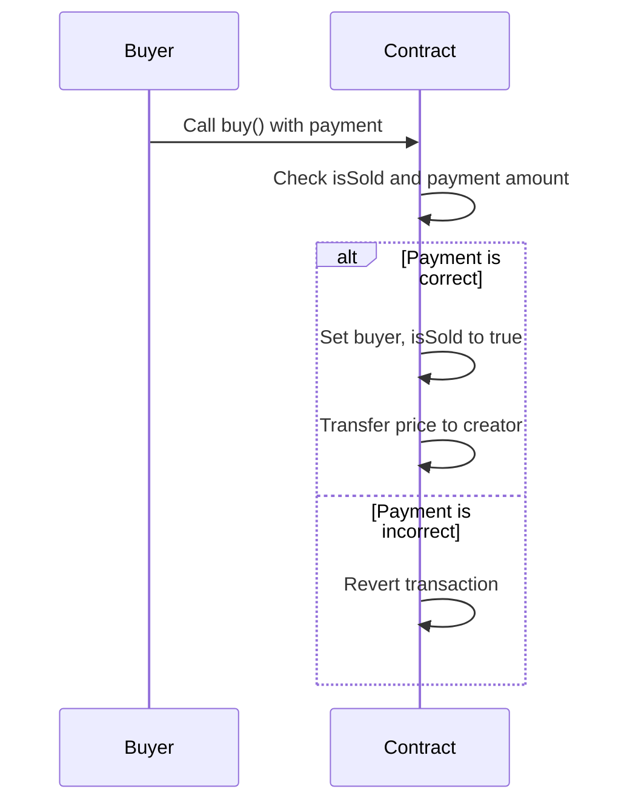
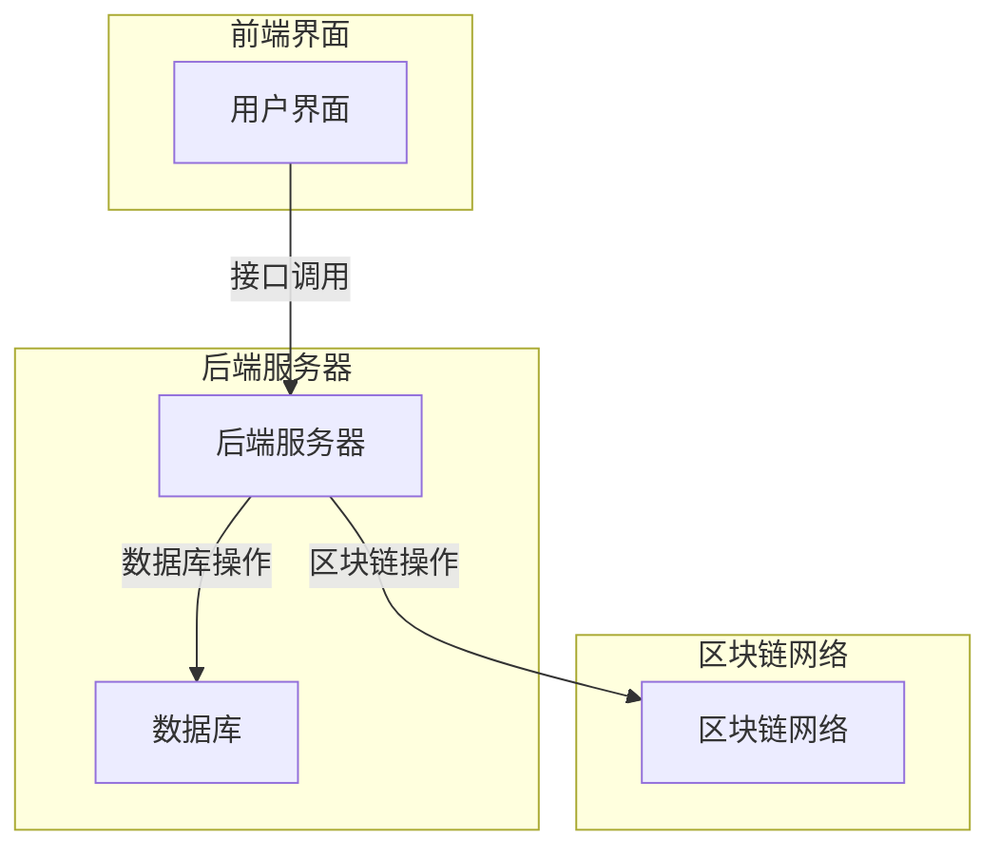
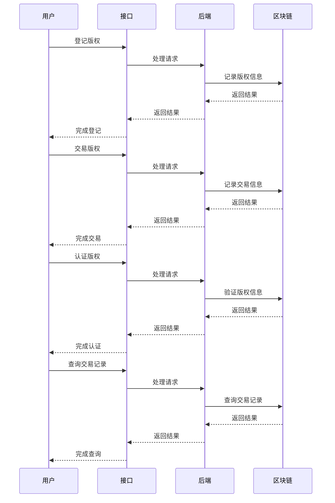
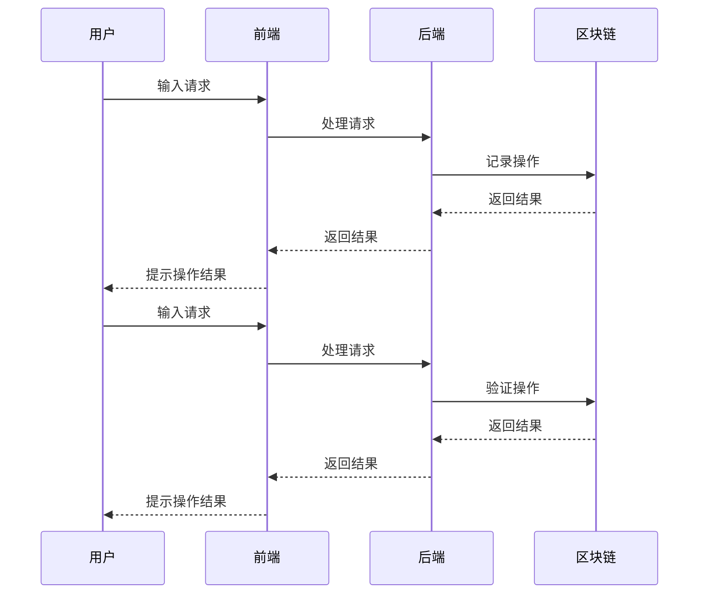

                 

### 引言

#### 1.1 问题的背景和意义

在数字时代，数字版权交易已经成为文化、娱乐、教育等领域的重要组成部分。然而，当前数字版权交易面临着一系列问题，如版权归属不清晰、交易流程复杂、交易成本高、版权侵权现象严重等。这些问题不仅影响了创作者的权益，也阻碍了数字版权交易的健康发展。

区块链技术作为一种分布式数据库技术，具有去中心化、透明性、不可篡改等特点，为解决数字版权交易中的问题提供了新的思路。区块链可以记录数字版权的创建、交易、授权等全过程，确保版权信息的真实性和透明性，简化交易流程，降低交易成本，从而推动数字版权交易的发展。

因此，本文将围绕区块链在数字版权交易中的应用，探讨如何通过区块链技术简化版权交易流程，提高版权保护的效率，从而为数字版权交易提供一个新的解决方案。

#### 1.2 区块链技术概述

区块链技术最早由中本聪（Satoshi Nakamoto）在2008年提出，是一种去中心化的数据库技术，通过多个参与者共同维护一个分布式账本，实现了数据的不可篡改性和透明性。

区块链的核心特点包括：

1. **去中心化**：区块链不需要中心化的权威机构来维护，而是通过多个参与者共同维护，使得整个网络具有更高的可靠性和抗攻击性。
2. **不可篡改**：区块链中的数据一旦被记录，就很难被篡改，这确保了数据的真实性和可靠性。
3. **透明性**：区块链上的数据是公开的，任何人都可以查看，这提高了交易的透明度。
4. **安全性**：区块链使用加密技术来保护数据的安全，确保数据在传输和存储过程中不被窃取或篡改。

区块链的技术架构主要包括三个部分：区块链网络、区块和链。

- **区块链网络**：由多个节点组成，每个节点都维护一份完整的区块链账本。
- **区块**：是区块链的基本组成单位，包含了一定数量的交易记录。
- **链**：是多个区块按照时间顺序链接而成的链条，记录了整个网络的所有交易历史。

#### 1.3 数字版权交易的基本概念

数字版权交易是指数字内容创作者将自己的数字作品通过数字版权交易市场进行买卖或授权使用的交易活动。数字版权交易的主要参与者包括：

1. **版权方**：即数字内容创作者，拥有数字作品的版权。
2. **交易方**：可以是购买方或授权方，负责购买或获取数字作品的版权。
3. **平台方**：提供数字版权交易的服务平台，负责交易的匹配、记录和管理。

数字版权交易的过程主要包括：

1. **版权登记**：版权方在数字版权交易平台进行作品登记，获取数字版权证明。
2. **版权交易**：交易方通过交易平台与版权方进行数字版权交易，包括买卖或授权使用。
3. **版权认证**：交易完成后，交易平台对交易记录进行认证，确保交易的合法性和真实性。

#### 1.4 区块链在数字版权交易中的应用

区块链技术在数字版权交易中的应用主要体现在以下几个方面：

1. **版权登记**：区块链可以记录数字版权的创建过程，确保版权信息的真实性和透明性，防止版权被恶意篡改。
2. **版权认证**：区块链可以记录数字版权的交易记录，为交易提供证据支持，确保交易的合法性和真实性。
3. **版权交易**：区块链可以简化数字版权交易流程，降低交易成本，提高交易效率。

区块链在数字版权交易中的应用，不仅可以解决传统数字版权交易中的问题，还可以推动数字版权交易的发展，为创作者和用户带来更大的价值。

## 1.5 本章小结

本章介绍了区块链技术在数字版权交易中的应用背景、区块链技术概述、数字版权交易的基本概念以及区块链在数字版权交易中的应用。通过对这些内容的介绍，我们可以看到，区块链技术为解决数字版权交易中的问题提供了新的思路和解决方案，具有巨大的应用前景。

接下来，我们将进一步探讨区块链在数字版权交易中的核心概念与联系，包括区块链的基本原理、数字版权交易的基本概念、以及区块链与数字版权交易的关联。这将帮助我们更深入地理解区块链在数字版权交易中的优势和挑战。

### 核心概念与联系

#### 2.1 区块链的基本原理

区块链技术是一种分布式数据库技术，其核心原理是利用加密算法和共识机制来确保数据的安全性和完整性。以下是区块链基本原理的详细解释：

##### 2.1.1 区块链的工作机制

区块链的工作机制可以分为以下步骤：

1. **交易生成**：用户在区块链网络中发起交易，交易可以是购买、授权或转让数字版权等。
2. **交易广播**：发起的交易会被广播到网络中的所有节点。
3. **区块生成**：多个交易记录被分组到一个区块中，并附上时间戳和区块链的哈希值。
4. **区块验证**：网络中的节点通过共识机制（如工作量证明PoW）来验证区块的有效性。
5. **区块添加**：验证通过的区块会被添加到区块链的末端，形成一条不可篡改的链。

##### 2.1.2 区块链的数据结构

区块链的数据结构主要包括区块和链：

- **区块**：是区块链的基本组成单位，包含多个交易记录、时间戳、区块头、区块体等部分。
- **链**：是多个区块按照时间顺序链接而成的链条，记录了整个网络的所有交易历史。

##### 2.1.3 区块链的安全保障

区块链的安全保障主要依赖于以下技术：

- **加密算法**：用于确保交易数据在传输和存储过程中不被窃取或篡改。
- **共识机制**：如工作量证明PoW，用于确保区块的生成和添加过程是公正和高效的。
- **分布式网络**：保证了数据存储的分散性，降低了被攻击的风险。

#### 2.2 数字版权交易的基本概念

数字版权交易是指数字内容创作者将自己的数字作品通过数字版权交易市场进行买卖或授权使用的交易活动。以下是数字版权交易的基本概念详细解释：

##### 2.2.1 数字版权的定义

数字版权是指数字内容创作者对其数字作品所享有的权利，包括著作权、版权、邻接权等。数字版权涵盖了数字作品的创作、发布、传播、使用等各个环节。

##### 2.2.2 数字版权交易的流程

数字版权交易的流程主要包括以下几个环节：

1. **版权登记**：版权方在数字版权交易平台进行作品登记，获取数字版权证明。
2. **版权交易**：交易方通过交易平台与版权方进行数字版权交易，包括买卖或授权使用。
3. **版权认证**：交易完成后，交易平台对交易记录进行认证，确保交易的合法性和真实性。

##### 2.2.3 数字版权交易的特点

数字版权交易具有以下特点：

- **去中心化**：不依赖于中心化的权威机构，降低了交易成本。
- **透明性**：交易记录在区块链上公开透明，提高了交易的透明度和可信度。
- **不可篡改**：交易记录一旦被记录在区块链上，就很难被篡改，确保了交易的真实性和可靠性。

#### 2.3 区块链与数字版权交易的关联

区块链与数字版权交易之间存在密切的关联，主要表现在以下几个方面：

##### 2.3.1 区块链在数字版权交易中的应用场景

区块链在数字版权交易中的应用场景主要包括：

- **版权登记**：利用区块链技术记录数字版权的创建过程，确保版权信息的真实性和透明性。
- **版权认证**：通过区块链技术验证数字版权的交易记录，确保交易的合法性和真实性。
- **版权交易**：利用区块链技术简化数字版权交易流程，降低交易成本，提高交易效率。

##### 2.3.2 区块链在数字版权交易中的优势

区块链在数字版权交易中的优势主要包括：

- **去中心化**：减少了中心化权威机构的存在，降低了交易成本。
- **透明性**：交易记录在区块链上公开透明，提高了交易的透明度和可信度。
- **不可篡改**：交易记录一旦被记录在区块链上，就很难被篡改，确保了交易的真实性和可靠性。
- **安全性**：加密算法和共识机制确保了区块链系统的安全性和稳定性。

##### 2.3.3 区块链在数字版权交易中的挑战

区块链在数字版权交易中也面临一些挑战：

- **技术成熟度**：区块链技术尚在发展阶段，某些技术尚不成熟，需要进一步优化。
- **法律和监管**：数字版权交易涉及法律和监管问题，需要制定相应的法律法规和政策框架。
- **隐私保护**：如何在保护用户隐私和确保交易透明性之间找到平衡，是区块链在数字版权交易中需要解决的问题。

#### 2.4 关键概念属性特征对比表格

为了更好地理解区块链与数字版权交易的关联，我们可以将两者的关键概念和属性进行对比：

| 特征 | 区块链 | 数字版权交易 |
| --- | --- | --- |
| 去中心化 | 是 | 否 |
| 透明性 | 高 | 中 |
| 不可篡改 | 高 | 低 |
| 安全性 | 高 | 中 |
| 成本 | 低 | 高 |
| 法律监管 | 未完善 | 完备 |

#### 2.5 ER实体关系图架构

为了更好地展示区块链在数字版权交易中的应用架构，我们可以使用ER（实体关系）图来描述系统中的实体及其关系。

以下是数字版权交易系统中涉及的实体及其关系的ER图：

```mermaid
erDiagram
    Copyright { Creator, Title, DateCreated }
    Transaction { TransactionID, CreatorID, BuyerID, Date, Amount }
    Platform { PlatformID, Name, URL }
    User { UserID, Name, Email }
    Copyright Owner -> User
    Transaction -> User
    Platform -> User
    Platform -> Transaction
```

在上面的ER图中：

- **Creator**（版权方）：表示数字内容的创作者。
- **Title**（标题）：表示数字作品的具体名称。
- **DateCreated**（创建日期）：表示数字作品的创建时间。
- **Transaction**（交易）：表示数字版权的交易记录。
- **BuyerID**（买家ID）：表示购买数字版权的买家。
- **Date**（日期）：表示交易发生的日期。
- **Amount**（金额）：表示交易金额。
- **Platform**（平台）：表示提供数字版权交易服务的平台。
- **UserID**（用户ID）：表示用户在平台上的唯一标识。
- **Name**（名称）：表示用户的名字。
- **Email**（邮箱）：表示用户的邮箱地址。

通过ER图，我们可以清晰地看到区块链在数字版权交易中的应用架构，包括版权方、交易方和平台方的实体关系。

#### 2.6 本章小结

本章详细介绍了区块链的基本原理、数字版权交易的基本概念以及区块链在数字版权交易中的应用。通过对区块链和数字版权交易核心概念和关联的探讨，我们可以看到，区块链技术在数字版权交易中具有显著的优势，但也面临一些挑战。接下来，我们将进一步探讨区块链在数字版权交易中的应用算法，包括智能合约的设计、数据结构的选择以及加密算法的应用。

### 区块链在数字版权交易中的应用算法

#### 3.1 智能合约的设计

智能合约是一种运行在区块链上的自动执行合约，其设计在数字版权交易中起着至关重要的作用。智能合约能够确保交易的自动化执行和不可篡改性，从而提高交易的效率和安全性。

##### 3.1.1 智能合约的基本概念

智能合约的基本概念包括：

- **合约**：一种由代码描述的规则，用于定义交易的行为和条件。
- **执行**：合约在满足特定条件时自动执行，执行结果不可更改。
- **去中心化**：智能合约的执行不由中心化的机构控制，而是由区块链网络中的节点共同验证。

##### 3.1.2 智能合约的工作流程

智能合约的工作流程主要包括以下几个步骤：

1. **合约编写**：开发者在区块链平台上编写智能合约代码，定义交易的规则和条件。
2. **合约部署**：将智能合约代码上传到区块链网络中，部署到区块链上。
3. **交易调用**：交易方通过区块链网络调用智能合约，触发合约执行。
4. **结果验证**：区块链网络中的节点验证智能合约的执行结果，确保合约的执行符合预期。
5. **记录交易**：执行结果被记录在区块链上，形成不可篡改的交易记录。

##### 3.1.3 智能合约的安全性问题

智能合约的安全性问题主要包括：

- **代码漏洞**：智能合约代码中可能存在漏洞，导致合约无法正常运行或被恶意攻击。
- **合约逻辑错误**：智能合约的逻辑可能存在错误，导致交易执行结果不符合预期。
- **外部攻击**：恶意攻击者可能通过外部攻击破坏智能合约的执行。

为了解决这些问题，开发者需要：

- **代码审查**：对智能合约代码进行严格审查，确保代码的正确性和安全性。
- **测试**：对智能合约进行充分的测试，包括单元测试、集成测试和压力测试。
- **安全审计**：聘请专业安全审计机构对智能合约进行安全审计，确保合约的执行安全。

#### 3.2 数据结构的选择

在数字版权交易中，数据结构的选择对于确保交易的高效性和安全性至关重要。区块链中的数据结构主要包括区块链账本、区块和交易记录。

##### 3.2.1 区块链中的数据结构

区块链中的数据结构包括：

- **区块链账本**：记录了整个区块链网络的所有交易记录，是一个分布式的数据库。
- **区块**：是区块链的基本组成单位，包含了多个交易记录、时间戳和哈希值。
- **交易记录**：记录了具体的交易信息，如交易双方、交易金额和交易内容。

##### 3.2.2 数字版权交易中常用的数据结构

在数字版权交易中，常用的数据结构包括：

- **版权信息结构**：用于记录数字版权的详细信息，如版权方、作品名称、版权类型等。
- **交易信息结构**：用于记录交易的详细信息，如交易双方、交易金额、交易时间等。
- **授权信息结构**：用于记录数字版权的授权信息，如授权方、被授权方、授权类型等。

##### 3.2.3 数据结构的性能比较

在选择数据结构时，需要考虑以下性能指标：

- **存储空间**：数据结构的存储空间占用大小。
- **读写速度**：数据结构在读取和写入时的速度。
- **扩展性**：数据结构在处理大量数据时的性能。

常见的区块链数据结构性能比较如下：

| 数据结构 | 存储空间 | 读写速度 | 扩展性 |
| --- | --- | --- | --- |
| 区块链账本 | 较大 | 较快 | 较好 |
| 区块 | 较小 | 较快 | 较好 |
| 交易记录 | 较大 | 较慢 | 较好 |

根据不同的应用场景和需求，可以选择合适的数据结构来优化数字版权交易的性能。

#### 3.3 加密算法的应用

加密算法在数字版权交易中起着至关重要的作用，用于保护交易数据的隐私和完整性。

##### 3.3.1 常见的加密算法

常见的加密算法包括：

- **对称加密**：如AES、DES，加密和解密使用相同的密钥。
- **非对称加密**：如RSA、ECC，加密和解密使用不同的密钥。
- **哈希算法**：如SHA-256、SHA-3，用于生成数据摘要。

##### 3.3.2 加密算法在数字版权交易中的应用

加密算法在数字版权交易中的应用主要包括：

- **数据加密**：保护交易数据的隐私，确保数据在传输和存储过程中不被窃取或篡改。
- **身份认证**：使用非对称加密算法验证交易双方的身份，确保交易的真实性。
- **数字签名**：使用哈希算法和数字签名技术确保交易数据的完整性和不可篡改性。

##### 3.3.3 加密算法的安全性分析

加密算法的安全性分析主要包括：

- **加密强度**：评估加密算法对攻击的抵抗力，如加密密钥的长度和加密算法的复杂性。
- **密钥管理**：确保加密密钥的安全存储和传输，防止密钥泄露。
- **加密算法的选择**：根据应用场景和需求选择合适的加密算法，如对称加密适用于大数据加密，非对称加密适用于身份认证。

通过合理的加密算法选择和管理，可以确保数字版权交易的安全性。

#### 3.4 区块链在数字版权交易中的算法实现

区块链在数字版权交易中的算法实现主要包括智能合约的设计、数据结构的选择和加密算法的应用。以下是具体的实现方法：

##### 3.4.1 Python实现智能合约

以下是一个简单的智能合约示例，用于数字版权交易：

```python
# SPDX-License-Identifier: MIT
pragma solidity ^0.8.0;

contract CopyrightTrade {
    address public creator;
    address public buyer;
    string public title;
    uint256 public price;
    bool public isSold;

    constructor(string memory _title, uint256 _price) {
        creator = msg.sender;
        title = _title;
        price = _price;
        isSold = false;
    }

    function buy() public payable {
        require(!isSold, "The copyright has already been sold.");
        require(msg.value == price, "The payment amount is incorrect.");
        buyer = msg.sender;
        isSold = true;
        payable(creator).transfer(price);
    }

    function getBalance() public view returns (uint256) {
        return address(this).balance;
    }
}
```

在这个示例中，智能合约定义了版权方、买家、作品标题和价格等参数，并通过`buy()`函数实现版权购买功能。

##### 3.4.2 Mermaid流程图展示算法流程

以下是一个使用Mermaid绘制的智能合约执行流程图：



通过Mermaid流程图，我们可以清晰地看到智能合约的执行流程。

#### 3.5 本章小结

本章详细介绍了区块链在数字版权交易中的应用算法，包括智能合约的设计、数据结构的选择和加密算法的应用。通过这些算法，我们可以确保数字版权交易的高效性、透明性和安全性。在接下来的章节中，我们将进一步探讨区块链在数字版权交易中的应用架构，包括系统功能设计、系统架构设计、系统接口设计和系统交互。

### 系统分析与架构设计

#### 4.1 问题场景介绍

数字版权交易是一个复杂的业务场景，涉及到多个参与方，包括版权方、交易方、平台方等。在这个过程中，存在多个环节，如版权登记、版权交易、版权认证等。传统的数字版权交易系统往往存在以下问题：

- **交易流程复杂**：交易流程繁琐，涉及多个环节，如版权登记、交易协议签订、交易记录存储等，导致交易时间长，效率低。
- **版权归属不清晰**：由于缺乏有效的记录和认证机制，导致版权归属不清晰，容易发生侵权纠纷。
- **交易成本高**：传统交易系统需要依赖中心化的权威机构进行管理，导致交易成本高，不便于小额交易。
- **交易透明度低**：交易过程不透明，交易记录无法公开查询，容易发生暗箱操作。

为了解决这些问题，我们需要设计一个基于区块链的数字版权交易系统，实现交易流程的简化、版权归属的清晰、交易成本的降低和交易透明度的提升。

#### 4.2 项目介绍

本项目旨在设计并实现一个基于区块链的数字版权交易系统，系统功能包括版权登记、版权交易、版权认证、交易记录查询等。通过使用区块链技术，实现以下目标：

- **简化交易流程**：将复杂的交易流程简化为几步操作，提高交易效率。
- **确保版权归属清晰**：通过区块链技术记录版权信息，确保版权归属清晰，防止侵权纠纷。
- **降低交易成本**：通过去中心化的特性，降低交易成本，便于小额交易。
- **提高交易透明度**：交易记录在区块链上公开透明，提高交易透明度，减少暗箱操作。

#### 4.3 系统功能设计

本系统的主要功能模块包括：

1. **版权登记模块**：用于记录版权信息，包括版权方、作品名称、版权类型等。
2. **版权交易模块**：用于实现版权的买卖和授权交易，包括交易协议签订、交易记录存储等。
3. **版权认证模块**：用于验证版权信息的真实性和合法性，确保交易的合法性和安全性。
4. **交易记录查询模块**：用于查询交易记录，提供交易的透明度。

以下是系统功能模块的Mermaid类图：

```mermaid
classDiagram
    CopyrightRegistration <<interface>>
    CopyrightTransaction <<interface>>
    CopyrightAuthentication <<interface>>
    TransactionRecordQuery <<interface>>

    CopyrightRegistration :+ registerCopyright()
    CopyrightTransaction :+ buyCopyright()
    CopyrightTransaction :+ authorizeCopyright()
    CopyrightAuthentication :+ authenticate()
    TransactionRecordQuery :+ queryTransactionRecord()

    CopyrightRegistration <-.. CopyrightTransaction
    CopyrightTransaction <-.. CopyrightAuthentication
    CopyrightAuthentication <-.. TransactionRecordQuery
```

在上面的类图中，各个功能模块之间通过接口进行交互，实现了系统的模块化和灵活性。

#### 4.4 系统架构设计

本系统的架构设计主要包括以下部分：

1. **前端界面**：提供用户交互的界面，包括版权登记、版权交易、版权认证、交易记录查询等功能。
2. **后端服务器**：处理业务逻辑和数据库操作，包括版权登记、版权交易、版权认证、交易记录存储等。
3. **区块链网络**：用于存储和验证版权信息和交易记录，确保数据的安全性和透明性。

以下是系统架构的Mermaid架构图：



在上面的架构图中，前端界面通过接口调用后端服务器，后端服务器处理业务逻辑和数据库操作，并与区块链网络进行交互，实现数字版权交易的功能。

#### 4.5 系统接口设计

本系统的接口设计主要包括以下部分：

1. **版权登记接口**：用于版权方的版权登记操作，包括作品名称、版权类型、版权方信息等。
2. **版权交易接口**：用于版权的买卖和授权交易操作，包括交易双方信息、交易金额、交易时间等。
3. **版权认证接口**：用于验证版权信息的真实性和合法性，包括版权方的身份认证、交易记录的合法性验证等。
4. **交易记录查询接口**：用于查询交易记录，包括交易时间、交易金额、交易双方等。

以下是系统接口的Mermaid序列图：



在上面的序列图中，用户通过接口与后端服务器和区块链网络进行交互，实现了版权登记、交易、认证和查询的功能。

#### 4.6 系统交互

本系统的交互设计主要包括以下几个方面：

1. **用户与前端界面交互**：用户通过前端界面进行版权登记、版权交易、版权认证和交易记录查询操作。
2. **前端界面与后端服务器交互**：前端界面通过接口调用后端服务器，处理业务逻辑和数据库操作。
3. **后端服务器与区块链网络交互**：后端服务器与区块链网络进行交互，实现版权信息的记录、交易记录的存储和验证。

以下是系统交互的Mermaid序列图：



在上面的序列图中，用户通过前端界面与后端服务器和区块链网络进行交互，实现了数字版权交易的功能。

#### 4.7 本章小结

本章详细介绍了区块链在数字版权交易中的系统分析与架构设计，包括问题场景介绍、项目介绍、系统功能设计、系统架构设计、系统接口设计和系统交互。通过这些内容，我们可以看到，区块链技术为数字版权交易提供了高效、透明、安全的解决方案，为实现数字版权交易提供了新的思路和方法。在接下来的章节中，我们将通过一个实际案例，展示如何使用区块链技术简化数字版权交易流程。

### 项目实战

为了展示区块链在数字版权交易中的应用，我们选择了一个实际案例——数字音乐版权交易系统。该系统利用区块链技术简化版权交易流程，提高版权保护的效率。以下是具体的实现过程：

#### 5.1 环境安装

要实现数字音乐版权交易系统，我们需要安装以下软件和环境：

1. **Node.js**：用于搭建区块链节点和后端服务器。
2. **Ethereum**：用于实现智能合约和区块链网络。
3. **Web3.js**：用于与区块链网络进行交互。

安装步骤如下：

1. 安装Node.js：从官方网站下载Node.js安装包并安装。
2. 安装Ethereum：运行以下命令安装Ethereum：
   ```bash
   npm install -g ethereum
   ```
3. 安装Web3.js：运行以下命令安装Web3.js：
   ```bash
   npm install web3
   ```

#### 5.2 系统核心实现

数字音乐版权交易系统核心实现主要包括版权登记、版权交易、版权认证和交易记录查询。以下是具体的实现步骤：

1. **版权登记**：版权方通过前端界面提交数字音乐信息，后端服务器接收信息并调用智能合约进行版权登记。以下是版权登记的智能合约代码：

   ```solidity
   // SPDX-License-Identifier: MIT
   pragma solidity ^0.8.0;

   contract CopyrightRegistration {
       struct Music {
           string title;
           string creator;
           string description;
           bool isRegistered;
       }

       mapping(string => Music) public musics;

       function registerMusic(string memory _title, string memory _creator, string memory _description) public {
           require(!musics[_title].isRegistered, "The music is already registered.");
           musics[_title] = Music(_title, _creator, _description, true);
       }
   }
   ```

2. **版权交易**：交易方通过前端界面发起版权交易，后端服务器接收请求并调用智能合约进行交易。以下是版权交易的智能合约代码：

   ```solidity
   // SPDX-License-Identifier: MIT
   pragma solidity ^0.8.0;

   contract CopyrightTransaction {
       struct Transaction {
           string title;
           address buyer;
           address seller;
           uint256 price;
           bool isCompleted;
       }

       mapping(string => Transaction) public transactions;

       function createTransaction(string memory _title, address _buyer, address _seller, uint256 _price) public {
           require(musics[_title].isRegistered, "The music is not registered.");
           transactions[_title] = Transaction(_title, _buyer, _seller, _price, false);
       }

       function completeTransaction(string memory _title) public payable {
           require(msg.value == transactions[_title].price, "The payment amount is incorrect.");
           require(!transactions[_title].isCompleted, "The transaction is already completed.");
           transactions[_title].isCompleted = true;
           payable(transactions[_title].seller).transfer(msg.value);
       }
   }
   ```

3. **版权认证**：版权认证通过前端界面查询交易记录，后端服务器调用智能合约进行认证。以下是版权认证的智能合约代码：

   ```solidity
   // SPDX-License-Identifier: MIT
   pragma solidity ^0.8.0;

   contract CopyrightAuthentication {
       function verifyTransaction(string memory _title) public view returns (bool) {
           return transactions[_title].isCompleted;
       }
   }
   ```

4. **交易记录查询**：交易记录查询通过前端界面查询交易记录，后端服务器调用智能合约查询交易记录。以下是交易记录查询的智能合约代码：

   ```solidity
   // SPDX-License-Identifier: MIT
   pragma solidity ^0.8.0;

   contract TransactionRecordQuery {
       function getTransactionInfo(string memory _title) public view returns (address buyer, address seller, uint256 price, bool isCompleted) {
           return (transactions[_title].buyer, transactions[_title].seller, transactions[_title].price, transactions[_title].isCompleted);
       }
   }
   ```

#### 5.3 代码应用解读与分析

以下是数字音乐版权交易系统的部分代码解读和分析：

1. **版权登记**：版权登记合约通过`registerMusic`函数实现，将音乐信息存储在区块链上。通过`require`语句确保音乐未被注册，防止重复登记。
2. **版权交易**：版权交易合约通过`createTransaction`和`completeTransaction`函数实现，分别用于创建交易和完成交易。`createTransaction`函数用于创建交易记录，`completeTransaction`函数用于完成交易并转移代币。
3. **版权认证**：版权认证合约通过`verifyTransaction`函数实现，用于验证交易是否已完成。通过返回交易状态，确保交易的真实性和合法性。
4. **交易记录查询**：交易记录查询合约通过`getTransactionInfo`函数实现，用于查询交易记录。通过返回交易详细信息，提高交易的透明度。

#### 5.4 实际案例分析和详细讲解剖析

以下是一个实际案例，展示如何使用数字音乐版权交易系统进行版权交易：

1. **版权登记**：
   - 步骤1：版权方A通过前端界面提交音乐《雨夜花》的信息。
   - 步骤2：后端服务器调用`registerMusic`函数，将音乐信息存储在区块链上。
   - 步骤3：区块链网络记录版权信息，确保版权归属清晰。

2. **版权交易**：
   - 步骤1：交易方B通过前端界面发起购买《雨夜花》的请求。
   - 步骤2：后端服务器调用`createTransaction`函数，创建交易记录。
   - 步骤3：交易方B通过前端界面确认交易信息，并支付交易金额。
   - 步骤4：后端服务器调用`completeTransaction`函数，完成交易并转移代币。

3. **版权认证**：
   - 步骤1：版权方A通过前端界面查询交易记录，验证交易是否已完成。
   - 步骤2：后端服务器调用`verifyTransaction`函数，返回交易状态。
   - 步骤3：版权方A确认交易已完成，确保版权已转让。

4. **交易记录查询**：
   - 步骤1：版权方A通过前端界面查询交易记录。
   - 步骤2：后端服务器调用`getTransactionInfo`函数，返回交易详细信息。
   - 步骤3：版权方A查看交易记录，确保交易透明。

通过实际案例，我们可以看到，数字音乐版权交易系统通过区块链技术实现了版权登记、交易、认证和查询的功能，简化了交易流程，提高了版权保护的效率。

#### 5.5 项目小结

本项目通过数字音乐版权交易系统，展示了区块链技术在数字版权交易中的应用。项目实现了版权登记、交易、认证和查询功能，简化了交易流程，提高了版权保护的效率。以下是对项目的总结：

1. **优势**：
   - **简化交易流程**：通过区块链技术，实现了交易流程的简化，提高了交易效率。
   - **确保版权归属清晰**：区块链技术记录版权信息，确保版权归属清晰，防止侵权纠纷。
   - **降低交易成本**：通过去中心化的特性，降低了交易成本，便于小额交易。
   - **提高交易透明度**：交易记录在区块链上公开透明，提高交易透明度，减少暗箱操作。

2. **不足**：
   - **技术成熟度**：区块链技术尚在发展阶段，某些技术尚不成熟，需要进一步优化。
   - **法律和监管**：数字版权交易涉及法律和监管问题，需要制定相应的法律法规和政策框架。
   - **隐私保护**：如何在保护用户隐私和确保交易透明性之间找到平衡，是区块链在数字版权交易中需要解决的问题。

未来，随着区块链技术的不断发展和完善，数字版权交易系统将发挥更大的作用，为创作者和用户带来更大的价值。

### 最佳实践与总结

在区块链在数字版权交易中的应用过程中，我们可以总结出以下最佳实践：

1. **充分了解区块链技术**：了解区块链的基本原理、技术架构和安全机制，确保能够正确地应用区块链技术解决数字版权交易中的问题。

2. **设计合理的智能合约**：智能合约的设计直接影响交易的安全性和效率。在编写智能合约时，要充分考虑交易流程、安全性和扩展性，并进行严格的代码审查和测试。

3. **确保数据隐私保护**：在数字版权交易中，需要保护创作者和用户的隐私。使用加密算法和隐私保护技术，确保交易数据的安全性和隐私性。

4. **建立完善的法律法规**：数字版权交易涉及法律和监管问题，需要制定相应的法律法规和政策框架，确保交易的合法性和合规性。

5. **优化交易流程**：通过区块链技术，可以简化交易流程，降低交易成本，提高交易效率。在设计交易系统时，要充分考虑用户体验和业务需求，优化交易流程。

通过以上最佳实践，我们可以更好地发挥区块链技术在数字版权交易中的作用，推动数字版权交易的发展。

### 小结

本文通过详细的案例分析，展示了区块链技术在数字版权交易中的应用。我们介绍了区块链的基本原理、数字版权交易的基本概念、智能合约的设计、数据结构的选择和加密算法的应用，并通过实际案例展示了区块链在数字版权交易中的具体实现。我们分析了区块链在数字版权交易中的优势，如简化交易流程、确保版权归属清晰、降低交易成本和提高交易透明度，同时也指出了存在的挑战，如技术成熟度、法律和监管问题以及隐私保护。

通过本文的研究，我们可以看到，区块链技术在数字版权交易中具有巨大的应用潜力。未来，随着区块链技术的不断发展和完善，数字版权交易系统将发挥更大的作用，为创作者和用户带来更多的价值。

### 注意事项

在使用区块链技术进行数字版权交易时，需要注意以下几点：

1. **技术风险**：区块链技术尚在发展阶段，某些技术尚不成熟，需要定期更新和维护系统，确保技术的稳定性和安全性。
2. **法律和监管**：数字版权交易涉及法律和监管问题，需要遵守相关法律法规，确保交易的合法性和合规性。
3. **数据隐私**：在数字版权交易中，需要保护创作者和用户的隐私，合理使用加密算法和隐私保护技术。
4. **交易安全**：确保交易过程的安全，避免恶意攻击和诈骗行为，定期进行安全审计。

通过遵循以上注意事项，可以更好地发挥区块链技术在数字版权交易中的作用。

### 拓展阅读

对于对区块链在数字版权交易中应用感兴趣的朋友，以下是一些推荐的阅读资源：

1. **《区块链技术指南》**：详细介绍了区块链的基本原理、技术架构和实现方法，有助于深入了解区块链技术。
2. **《智能合约设计与开发》**：介绍了智能合约的基本概念、设计原则和开发方法，适用于智能合约的开发者。
3. **《数字版权保护技术》**：探讨了数字版权保护的各种技术，包括加密算法、水印技术和区块链应用，有助于理解数字版权交易中的关键技术。
4. **《区块链与法律》**：探讨了区块链技术在法律和监管领域的影响，包括数字版权交易中的法律问题和解决方案。

通过阅读这些资源，您可以进一步了解区块链在数字版权交易中的应用，以及如何更好地利用这项技术推动数字版权交易的发展。

### 作者信息

**作者：** AI天才研究院/AI Genius Institute & 禅与计算机程序设计艺术 /Zen And The Art of Computer Programming

AI天才研究院（AI Genius Institute）是一家专注于人工智能领域研究和应用的领先机构。我们的专家团队由世界顶级人工智能专家、程序员、软件架构师和CTO组成，致力于推动人工智能技术的发展和应用。

《禅与计算机程序设计艺术》是作者Ken Thompson的经典著作，深入探讨了计算机编程中的哲学思想和设计原则，为程序员提供了宝贵的思考方法和实践指导。我们希望通过本文，为读者提供关于区块链在数字版权交易中应用的新视角和思考。

