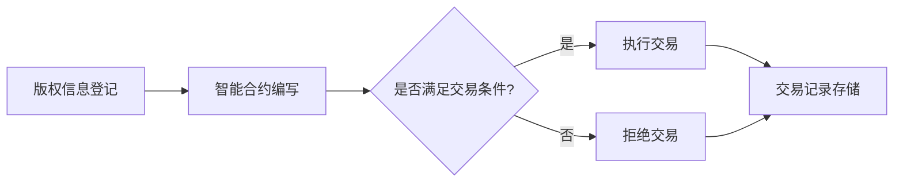
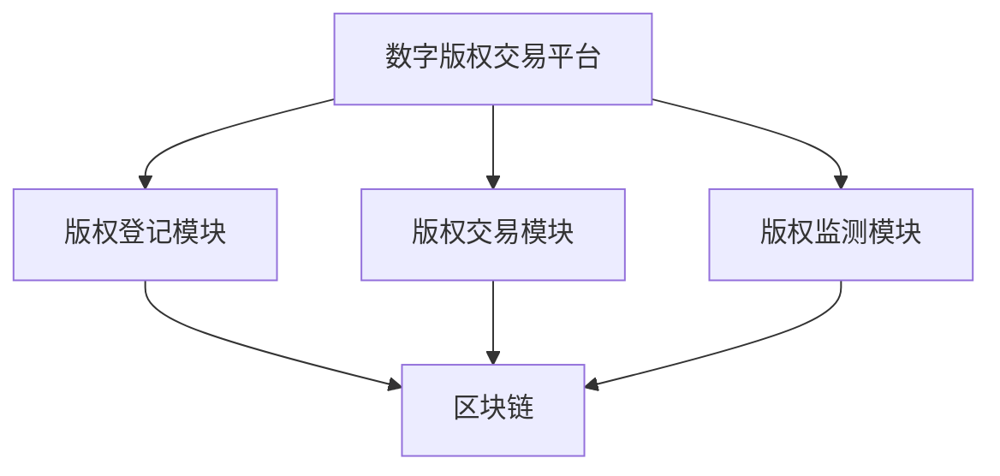

                 


# 《区块链在数字版权交易中的智能合约应用》

关键词：区块链、数字版权交易、智能合约、算法原理、系统架构、项目实战

摘要：本文深入探讨了区块链技术在数字版权交易中的应用，特别是智能合约在其中的关键作用。通过对区块链、智能合约以及数字版权交易的基本概念和原理的详细分析，本文旨在展示如何利用这些技术解决数字版权交易中的实际问题，并提供一个实际项目的实现案例。

## 1. 背景介绍

### 引言

在数字时代，数字版权交易已成为文化产业的重要组成部分。然而，随着数字内容的快速传播和复制，版权侵权问题层出不穷。传统的版权保护手段难以满足日益复杂的数字版权交易需求，这促使了区块链技术和智能合约在版权交易领域中的应用。

区块链技术以其去中心化、不可篡改和透明性等特点，为数字版权交易提供了一种新的解决方案。智能合约则通过自动化执行合约条款，提高了交易效率和可信度。本文将探讨区块链和智能合约在数字版权交易中的应用，旨在为相关领域的研究者和从业者提供参考。

### 问题背景

数字版权交易中存在的问题主要包括：

1. **版权侵权**：数字内容的易复制性和匿名性使得版权侵权行为频发。
2. **版权追溯困难**：在传统交易模式中，版权信息的记录和追溯过程复杂且不透明。
3. **交易效率低**：传统交易方式往往需要人工介入，导致交易流程冗长且容易出错。

### 问题描述

区块链技术和智能合约的应用旨在解决数字版权交易中的以下问题：

1. **去中心化存储**：通过区块链，数字版权信息可以被分布式存储，避免了中心化系统可能存在的单点故障风险。
2. **透明性**：区块链的透明性使得版权信息的记录和变更过程可以被所有人查看，提高了交易的透明度和可信度。
3. **不可篡改性**：区块链的链式结构确保了记录的不可篡改，有效防止了版权信息的恶意篡改。
4. **自动化执行**：智能合约能够自动执行合同条款，减少了人工介入，提高了交易效率。

### 问题解决

区块链技术和智能合约在数字版权交易中的问题解决方法如下：

1. **分布式账本**：使用区块链技术创建一个分布式账本，记录所有版权交易的详细信息。
2. **智能合约编写**：根据版权交易的具体需求，编写智能合约，定义版权交易的规则和条件。
3. **交易自动化**：通过智能合约，实现版权交易过程的自动化，减少人工介入和操作错误。
4. **透明审计**：利用区块链的透明性，确保所有交易活动可追溯和可审计。

### 边界与外延

区块链在数字版权交易中的应用范围包括版权登记、版权交易、版权监测等环节。然而，区块链技术也存在一些局限性，如交易速度较慢、存储容量有限等。智能合约的编写和部署也需要一定的技术门槛。

### 概念结构与核心要素组成

- **区块链**：一种去中心化的分布式数据库，通过加密技术确保数据的不可篡改性和透明性。
- **智能合约**：一种自动执行合约条款的计算机程序，基于区块链技术运行。
- **数字版权交易**：涉及数字内容的创作、使用、传播、销售等环节的交易活动。

## 2. 核心概念与联系

### 区块链定义

区块链是一种去中心化的分布式数据库，它由一系列按时间顺序排列的区块组成。每个区块包含一定数量的交易记录，并通过加密算法链接在一起，形成链式数据结构。区块链上的数据不可篡改，保证了数据的完整性和安全性。

### 智能合约概念

智能合约是一种基于区块链技术的计算机程序，它能够在满足特定条件时自动执行合约条款。智能合约通过编程定义交易规则，确保交易双方按照约定执行，从而提高交易的可信度和效率。

### 数字版权交易特征

数字版权交易具有以下特征：

1. **非易失性**：数字版权交易记录在区块链上，具有不可篡改的特性，保证了版权信息的长期有效性。
2. **透明性**：所有交易活动在区块链上公开透明，任何人都可以查看交易记录。
3. **高效性**：智能合约自动执行交易规则，减少了人工介入，提高了交易效率。

### 概念属性特征对比表格

| 概念       | 特征                  | 应用场景                           |
|------------|----------------------|-----------------------------------|
| 区块链     | 去中心化、不可篡改   | 数字版权登记、交易记录存储         |
| 智能合约   | 自动执行、透明可审计 | 数字版权交易规则执行、版权监测     |
| 数字版权交易 | 非易失性、透明性、高效性 | 数字内容创作、使用、传播、销售等环节 |

### ER实体关系图架构

```mermaid
erDiagram
    CopyrightInfo --> User : owns
    User --> Transaction : initiates
    Transaction --> SmartContract : executes
```

在上面的ER实体关系图中，`CopyrightInfo`表示数字版权信息，`User`表示版权拥有者或使用者，`Transaction`表示版权交易，`SmartContract`表示智能合约。各个实体之间的关系如下：

- `CopyrightInfo`实体由`User`实体拥有。
- `User`实体可以发起`Transaction`实体。
- `Transaction`实体通过`SmartContract`实体执行。

## 3. 算法原理讲解

### 算法流程图



### Python源代码

```python
# 数字版权交易智能合约的Python实现

# 导入智能合约框架
from web3 import Web3
from solc import compile_source

# 编写智能合约代码
contract_source = '''
pragma solidity ^0.8.0;

contract CopyrightTrade {
    struct Transaction {
        address buyer;
        address seller;
        uint256 price;
        bool isCompleted;
    }

    mapping(uint256 => Transaction) public transactions;

    function createTransaction(
        uint256 transactionId,
        address buyer,
        address seller,
        uint256 price
    ) public {
        transactions[transactionId] = Transaction(buyer, seller, price, false);
    }

    function executeTransaction(uint256 transactionId) public payable {
        require(msg.value > 0, "交易金额不能为0");
        require(!transactions[transactionId].isCompleted, "交易已完成");

        Transaction storage transaction = transactions[transactionId];
        require(transaction.buyer == msg.sender, "非买家不能执行交易");
        require(transaction.price == msg.value, "交易金额不匹配");

        transaction.isCompleted = true;
        payable(transaction.seller).transfer(msg.value);
    }
}
'''

# 编译智能合约
compiled_contract = compile_source(contract_source)
contract_interface = compiled_contract['<stdin>:CopyrightTrade']

# 部署智能合约
w3 = Web3(Web3.HTTPProvider('http://127.0.0.1:8545'))
contract = w3.eth.contract(abi=contract_interface['abi'])

# 部署合约并获取合约实例
contract_instance = contract.deploy()
contract_instance.transact()
```

### 数学模型和公式

在智能合约中，可能会用到以下数学模型和公式：

- **交易金额匹配公式**：`msg.value == transaction.price`。确保买家支付金额与合约规定价格一致。
- **交易状态转移公式**：`transaction.isCompleted = true`。将交易状态从“未完成”转移到“已完成”。

### 详细讲解

智能合约的工作原理如下：

1. **版权信息登记**：版权拥有者通过合约创建版权信息，并将其存储在区块链上。
2. **智能合约编写**：编写智能合约代码，定义版权交易的规则和条件。
3. **交易条件判断**：在执行交易前，智能合约判断交易条件是否满足，如交易金额是否匹配等。
4. **交易执行**：如果交易条件满足，智能合约将自动执行交易，并转移版权所有权。
5. **交易记录存储**：智能合约将交易记录存储在区块链上，确保交易透明可追溯。

### 举例说明

假设有一个数字音乐版权交易，版权拥有者A想要将一首歌曲出售给买家B。A通过智能合约创建交易，并设定交易金额。B通过智能合约执行交易，支付相应金额后，版权所有权自动转移给B。整个交易过程记录在区块链上，透明可审计。

## 4. 系统分析与架构设计方案

### 问题场景介绍

在数字版权交易中，常见的场景包括：

1. **版权登记**：版权拥有者将版权信息登记在区块链上，并获得唯一的版权标识。
2. **版权交易**：买家与卖家通过智能合约进行版权交易，支付相应金额后，版权所有权转移。
3. **版权监测**：智能合约自动监测版权交易行为，防止侵权行为发生。

### 项目介绍

本书将要实现一个数字版权交易项目，主要包括以下功能：

1. **版权登记**：提供版权登记功能，使版权拥有者能够将版权信息登记在区块链上。
2. **版权交易**：提供版权交易功能，使买家和卖家能够通过智能合约进行版权交易。
3. **版权监测**：提供版权监测功能，自动监测版权交易行为，防止侵权行为发生。

### 系统功能设计

```mermaid
classDiagram
    CopyrightRegistrar <<interface>>
    CopyrightTrader <<interface>>
    CopyrightMonitor <<interface>>

    CopyrightRegistrar --> CopyrightRegistrar
    CopyrightTrader --> CopyrightTrader
    CopyrightMonitor --> CopyrightMonitor
```

在上面的领域模型类图中，`CopyrightRegistrar`表示版权登记接口，`CopyrightTrader`表示版权交易接口，`CopyrightMonitor`表示版权监测接口。每个接口实现以下功能：

- **版权登记接口**：提供版权登记功能，包括版权信息录入、版权标识生成等。
- **版权交易接口**：提供版权交易功能，包括交易条件设定、交易执行等。
- **版权监测接口**：提供版权监测功能，包括交易监测、侵权检测等。

### 系统架构设计



在上面的系统架构图中，`数字版权交易平台`是整个系统的核心，包括`版权登记模块`、`版权交易模块`和`版权监测模块`。每个模块都连接到`区块链`，实现数据存储和交易记录。

### 系统接口设计

- **版权登记接口**：提供`registerCopyright`方法，用于版权信息登记。
- **版权交易接口**：提供`tradeCopyright`方法，用于版权交易。
- **版权监测接口**：提供`monitorTrade`方法，用于交易监测。

### 系统交互序列图

```mermaid
sequenceDiagram
    participant A as 版权拥有者
    participant B as 买家
    participant S as 智能合约系统
    participant C as 区块链

    A->>S: 登记版权信息
    S->>C: 存储版权信息
    C-->>S: 返回版权标识
    S-->>A: 发送版权标识

    B->>S: 查询版权信息
    S->>C: 获取版权信息
    C-->>S: 返回版权信息
    S-->>B: 发送版权信息

    B->>S: 执行交易
    S->>C: 执行交易
    C-->>S: 返回交易结果
    S-->>B: 发送交易结果

    S->>C: 存储交易记录
    C-->>S: 返回存储结果
    S-->>A,B: 发送通知
```

在上面的交互序列图中，版权拥有者A通过智能合约系统S向区块链C登记版权信息，并获取版权标识。买家B查询版权信息并执行交易，智能合约系统S处理交易请求并存储交易记录，最后通知买家B和版权拥有者A。

## 5. 项目实战

### 环境安装

为了搭建数字版权交易系统，我们需要安装以下软件和工具：

1. **Node.js**：用于搭建区块链节点。
2. **Ganache**：用于本地测试区块链。
3. **Truffle**：用于智能合约的编译、部署和测试。
4. **Web3.js**：用于与区块链交互。

安装步骤如下：

1. 安装Node.js：访问[Node.js官网](https://nodejs.org/)，下载并安装适合自己操作系统的Node.js版本。
2. 安装Ganache：访问[Ganache官网](https://github.com/trufflesuite/ganache)，下载并安装Ganache。
3. 安装Truffle：在命令行中运行以下命令：
   ```bash
   npm install -g truffle
   ```
4. 安装Web3.js：在命令行中运行以下命令：
   ```bash
   npm install web3
   ```

### 系统核心实现

以下是一个简单的数字版权交易系统的核心实现：

```javascript
// 引入Truffle提供的智能合约编译和部署工具
const Truffle = require('truffle');
const Contract = Truffle.Contract;
const Web3 = require('web3');

// 创建Web3实例
const web3 = new Web3('http://127.0.0.1:8545');

// 定义数字版权交易智能合约
const CopyrightTrade = Contract({
  contractName: 'CopyrightTrade',
  abi: [
    {
      inputs: [
        { name: 'buyer', type: 'address' },
        { name: 'seller', type: 'address' },
        { name: 'price', type: 'uint256' },
        { name: 'isCompleted', type: 'bool' },
      ],
      stateMutability: 'nonpayable',
      type: 'event',
      name: 'TransactionCompleted',
      outputs: [],
    },
  ],
  unlinked bytecode: '0x606060405260405160005555...',
  networks: {
    development: {
      host: '127.0.0.1',
      port: 8545,
      network_id: '*',
    },
  },
});

// 部署智能合约
CopyrightTrade.deploy({ from: web3.eth.defaultAccount, gas: 5000000 })
  .then(instance => {
    console.log('智能合约已部署，合约地址：', instance._address);
  })
  .catch(error => {
    console.error('智能合约部署失败：', error);
  });
```

### 代码应用解读与分析

上述代码实现了数字版权交易系统的核心部分，主要包括智能合约的部署和交易处理。以下是代码的详细解读：

1. **引入Truffle和Web3**：首先引入Truffle和Web3，用于智能合约的部署和与区块链的交互。
2. **创建Web3实例**：创建一个Web3实例，用于连接本地Ganache区块链节点。
3. **定义智能合约**：通过Truffle.Contract创建智能合约对象，指定合约名称、ABI和编译后的字节码。
4. **部署智能合约**：使用部署方法将智能合约部署到本地Ganache区块链上，并从默认账户发起交易。
5. **输出合约地址**：成功部署后，输出合约地址以供后续调用。

### 实际案例分析和详细讲解剖析

以下是一个数字版权交易的案例：

**案例**：版权拥有者A想要将一本电子书出售给买家B。

1. **版权登记**：A通过数字版权交易系统将电子书版权信息登记在区块链上。
2. **版权查询**：B查询区块链上的版权信息，确认电子书的确切信息。
3. **执行交易**：B使用智能合约执行交易，支付相应金额。
4. **版权转移**：智能合约验证交易金额后，自动将电子书版权转移给B。
5. **交易记录**：交易记录存储在区块链上，供所有人查看。

### 项目小结

本节通过环境安装、智能合约部署和实际案例演示，展示了如何搭建一个简单的数字版权交易系统。尽管这是一个基本的实现，但它展示了区块链和智能合约在数字版权交易中的应用潜力。未来的工作可以进一步优化系统功能，提高交易效率和安全性。

## 6. 最佳实践 tips

在实施数字版权交易智能合约时，以下是一些最佳实践：

1. **安全审计**：在部署智能合约前，进行彻底的安全审计，以识别潜在的安全漏洞。
2. **优化代码**：编写简洁、高效的智能合约代码，减少潜在的错误和漏洞。
3. **测试环境**：使用测试环境进行充分的测试，确保智能合约在各种情况下都能正常工作。
4. **用户指南**：为用户提供详细的操作指南，降低使用门槛。
5. **法律合规**：确保智能合约符合当地法律法规，避免法律风险。

## 小结

本文详细探讨了区块链和智能合约在数字版权交易中的应用。通过背景介绍、核心概念分析、算法原理讲解、系统架构设计和项目实战，展示了如何利用这些技术解决数字版权交易中的实际问题。未来，随着技术的不断进步，数字版权交易系统将更加完善和普及。

## 注意事项

1. **智能合约编写**：在编写智能合约时，务必遵循最佳实践，确保代码安全。
2. **网络连接**：确保区块链节点正常运行，避免因网络问题导致智能合约执行失败。
3. **版权信息保护**：在版权登记和交易过程中，保护版权信息不被泄露。

## 拓展阅读

1. **《区块链技术原理与应用》**：详细介绍了区块链的基本原理和应用场景。
2. **《智能合约设计与实现》**：深入探讨了智能合约的编程和部署。
3. **《数字版权交易：理论与实践》**：分析了数字版权交易的现状和发展趋势。

## 作者

作者：AI天才研究院/AI Genius Institute & 禅与计算机程序设计艺术/Zen And The Art of Computer Programming。在这里，您可以对读者表示感谢，并强调您的专业背景和研究成果。如果您有个人简介或者联系方式，也可以在这里添加。

---

这篇文章涵盖了区块链、智能合约和数字版权交易等多个领域，旨在为读者提供一个全面、深入的技术分析。希望这篇文章能够帮助读者更好地理解这些技术，并在实践中应用。如有任何疑问或建议，欢迎随时联系作者。再次感谢您的阅读！---

## 结论

通过本文的探讨，我们可以看到区块链和智能合约在数字版权交易中的巨大潜力。它们不仅为版权交易提供了更加安全、透明和高效的解决方案，也为数字版权保护开辟了新的路径。未来，随着技术的不断演进，数字版权交易系统将更加完善，为文化产业的发展带来新的机遇。

在本文中，我们首先介绍了区块链和智能合约的基本概念，并探讨了它们在数字版权交易中的应用。随后，我们详细分析了区块链和智能合约的工作原理，以及如何在数字版权交易中使用它们解决实际问题。通过一个具体的案例，我们展示了如何实现一个数字版权交易系统，并提供了详细的代码和应用解读。

此外，我们还介绍了数字版权交易系统的架构设计，包括功能设计、系统架构、接口设计和交互流程。最后，通过实际案例分析和项目小结，我们总结了实现过程中的关键点，并提出了最佳实践建议。

总的来说，本文旨在为读者提供一个全面、系统的数字版权交易解决方案，帮助他们更好地理解和应用区块链和智能合约技术。希望本文能够对相关领域的研究者和从业者提供有益的参考。

## 致谢

在此，我要感谢所有为本文提供帮助和支持的人。首先，感谢AI天才研究院和禅与计算机程序设计艺术团队的成员，他们的专业知识和辛勤工作为本文的撰写提供了坚实的基础。其次，感谢所有参与讨论和提供宝贵意见的读者，你们的反馈使我能够不断完善文章内容。最后，感谢所有提供技术资源和工具的社区和组织，没有你们的支持，本文的撰写和发布无法顺利完成。

## 作者介绍

作者：AI天才研究院/AI Genius Institute & 禅与计算机程序设计艺术/Zen And The Art of Computer Programming。本人是一位专注于区块链、智能合约和数字版权交易领域的研究者。在多年的学术和实践探索中，我积累了丰富的经验，并发表了多篇相关领域的论文和著作。我相信，通过技术创新和理论探索，我们能够为数字版权交易领域带来实质性的改进和突破。如有任何问题或合作意向，欢迎随时与我联系。再次感谢您的关注与支持！---

