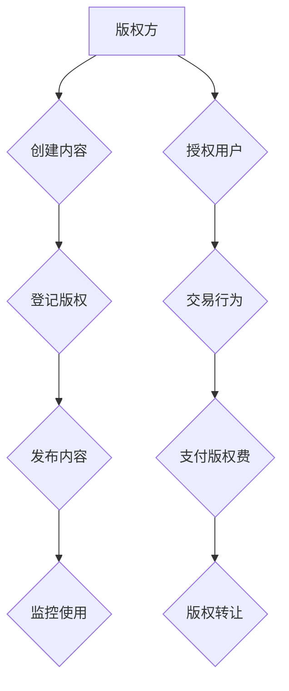
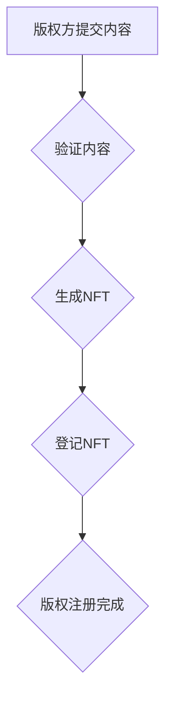
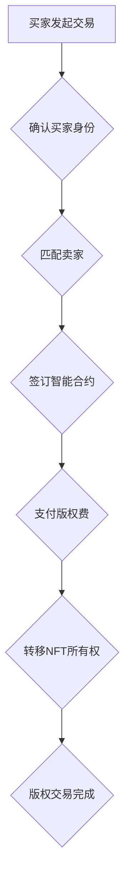
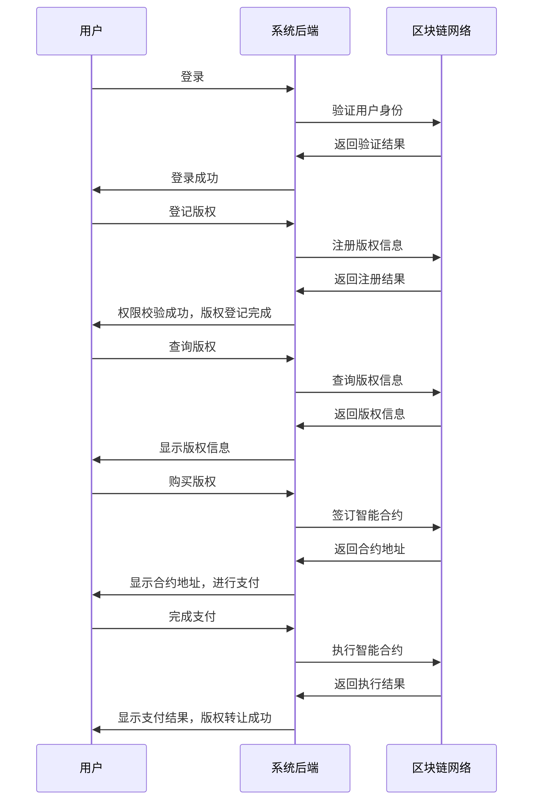

                 

### 文章标题：区块链在数字版权保护中的创新机制

关键词：区块链，数字版权保护，智能合约，非同质化代币（NFT），数字版权管理，版权认证，版权交易

摘要：随着数字化时代的到来，数字版权保护成为了一个重要且亟待解决的问题。本文将深入探讨区块链在数字版权保护中的创新机制，从背景介绍、核心概念解析、应用算法详细讲解、系统分析与架构设计等多个角度进行分析，旨在为数字版权保护领域提供新的思路和方法。

----------------------------------------------------------------

### 目录大纲：《区块链在数字版权保护中的创新机制》

----------------------------------------------------------------

# 第一部分：背景介绍与核心概念

## 第1章：数字版权保护现状分析

### 1.1.1 数字版权保护问题的背景

- **数字版权保护的重要性**
- **当前数字版权保护面临的挑战**

### 1.1.2 数字版权保护的概念与外延

- **数字版权的定义**
- **版权保护的核心要素**
- **版权保护的边界**

### 1.1.3 数字版权保护中的核心问题

- **版权侵权现象**
- **版权追踪与认证难度大**
- **版权交易流程复杂**

## 第2章：区块链技术概述

### 2.1.1 区块链的定义与原理

- **区块链的基本概念**
- **区块链的核心特征**
- **区块链的工作原理**

### 2.1.2 区块链在数字版权保护中的应用

- **区块链在版权管理中的潜在优势**
- **区块链在版权交易中的潜在应用**

## 第3章：区块链在数字版权保护中的创新机制

### 3.1.1 基于区块链的数字版权管理模型

- **模型概述**
- **模型的核心功能**

### 3.1.2 基于区块链的数字版权认证机制

- **认证机制的原理**
- **认证机制的优势**

### 3.1.3 基于区块链的数字版权交易机制

- **交易机制的原理**
- **交易机制的优势**

## 第4章：案例分析

### 4.1.1 案例一：某数字音乐平台的区块链应用

- **案例分析**
- **案例效果评估**

### 4.1.2 案例二：某电子书版权保护项目的区块链实现

- **案例分析**
- **案例效果评估**

## 第5章：区块链在数字版权保护中的挑战与展望

### 5.1.1 区块链在数字版权保护中的挑战

- **技术挑战**
- **法律挑战**
- **市场挑战**

### 5.1.2 未来发展趋势与展望

- **技术发展趋势**
- **政策与法律环境展望**
- **市场前景**

----------------------------------------------------------------

# 第二部分：核心概念与联系

## 第6章：核心概念解析

### 6.1.1 数字版权

- **定义与属性**
- **特征对比表格**

### 6.1.2 区块链

- **定义与属性**
- **特征对比表格**

### 6.1.3 数字版权保护机制

- **定义与属性**
- **特征对比表格**

## 第7章：ER实体关系图架构设计

### 7.1.1 实体关系图概述

- **ER模型的基本概念**
- **实体关系图的设计原则**

### 7.1.2 数字版权保护系统的ER图设计

- **实体识别**
- **关系定义**
- **属性设计**

### 7.1.3 Mermaid流程图示例

- **Mermaid基本语法**
- **数字版权保护系统的流程图设计**

----------------------------------------------------------------

# 第三部分：算法原理讲解

## 第8章：区块链在数字版权保护中的应用算法

### 8.1.1 智能合约原理

- **智能合约的基本概念**
- **智能合约在版权保护中的应用**

### 8.1.2 非同质化代币（NFT）原理

- **NFT的定义与特征**
- **NFT在数字版权保护中的应用**

### 8.1.3 Mermaid流程图示例

- **版权注册流程**
- **版权交易流程**

## 第9章：算法原理详细讲解

### 9.1.1 智能合约原理详细讲解

- **智能合约的工作流程**
- **Python源代码示例**

### 9.1.2 非同质化代币（NFT）原理详细讲解

- **NFT的生成与使用**
- **Python源代码示例**

### 9.1.3 算法原理举例说明

- **版权注册案例分析**
- **版权交易案例分析**

----------------------------------------------------------------

# 第四部分：系统分析与架构设计

## 第10章：数字版权保护系统设计

### 10.1.1 问题场景介绍

- **版权保护的现状问题**
- **系统设计的目标*

----------------------------------------------------------------

### 第一部分：背景介绍与核心概念

#### 第1章：数字版权保护现状分析

#### 1.1.1 数字版权保护问题的背景

##### 数字版权保护的重要性

在数字化的时代，版权保护变得尤为重要。随着互联网和数字技术的飞速发展，数字内容的生产、传播和消费越来越普遍。然而，数字版权侵权现象也日益严重，严重损害了创作者和版权持有者的权益。数字版权保护的重要性体现在以下几个方面：

1. **维护创作者的权益**：版权是创作者对其作品所拥有的专有权利，保护版权可以确保创作者的劳动成果得到应有的尊重和回报。
2. **促进文化产业的健康发展**：数字版权的保护有助于维护良好的创作环境，激励创作者不断创新，推动文化产业的繁荣发展。
3. **保障公共利益**：数字版权保护不仅关系到创作者和版权持有者的利益，也关系到广大公众的文化权益。保障数字内容的合法传播，有助于提高公众的文化素质和生活质量。

##### 当前数字版权保护面临的挑战

尽管数字版权保护的重要性日益凸显，但当前数字版权保护仍面临着诸多挑战：

1. **版权侵权现象严重**：互联网的普及使得侵权行为更加便捷，侵权手段也更加多样。例如，未经授权的在线盗版、非法复制和传播数字内容等现象层出不穷。
2. **版权追踪与认证难度大**：在数字环境中，版权的追踪和认证变得更加复杂。数字内容的复制和传播速度极快，传统的版权保护手段难以有效跟踪侵权行为，也无法确保版权认证的准确性。
3. **版权交易流程复杂**：数字版权交易涉及多个环节，包括授权、许可、交易等，流程繁琐且易出错。现有技术手段难以提供高效、透明的版权交易服务。

#### 1.1.2 数字版权保护的概念与外延

##### 数字版权的定义

数字版权，又称数字知识产权，是指创作者或版权持有者对其数字内容所享有的专有权利。这些权利通常包括复制权、发行权、出租权、展览权、表演权、放映权、广播权、信息网络传播权等。

##### 版权保护的核心要素

1. **版权主体**：包括创作者、版权持有者和使用者。
2. **版权客体**：即数字内容，如文字、图片、音频、视频等。
3. **权利内容**：指版权主体对数字内容所享有的各项权利。
4. **权利边界**：指版权保护的范围和限制，如版权保护期限、地域限制等。

##### 版权保护的核心要素

1. **版权主体**：包括创作者、版权持有者和使用者。
2. **版权客体**：即数字内容，如文字、图片、音频、视频等。
3. **权利内容**：指版权主体对数字内容所享有的各项权利。
4. **权利边界**：指版权保护的范围和限制，如版权保护期限、地域限制等。

##### 版权保护的边界

版权保护并非无边界，它受到法律、技术和市场等多方面因素的影响。以下是一些版权保护的边界：

1. **版权保护期限**：根据不同国家和地区的法律规定，版权保护期限有所不同。例如，在美国，版权保护期限为创作者终生及其去世后70年。
2. **地域限制**：版权保护具有地域性，不同国家和地区的版权法律可能存在差异。
3. **合理使用**：合理使用是指在一定条件下，允许未经授权使用受版权保护的作品。合理使用通常包括批评、评论、新闻报道、教学等目的。

#### 1.1.3 数字版权保护中的核心问题

##### 版权侵权现象

版权侵权是指未经授权擅自使用受版权保护的作品的行为。在数字环境中，版权侵权现象更加复杂和普遍，主要表现在：

1. **在线盗版**：网络上的盗版行为屡见不鲜，包括非法下载、分享、上传数字内容等。
2. **非法复制与传播**：通过非法手段复制数字内容并在未经授权的平台上进行传播。
3. **技术手段侵权**：利用各种技术手段逃避版权保护，如数字水印的去除、加密算法的破解等。

##### 版权追踪与认证难度大

在数字环境中，版权的追踪与认证难度较大，主要原因包括：

1. **数字内容的易复制性**：数字内容可以轻松地复制和传播，使得版权追踪变得复杂。
2. **匿名性**：网络环境的匿名性使得侵权者难以被追溯。
3. **版权认证机制不完善**：现有技术手段难以提供高效、准确的版权认证服务。

##### 版权交易流程复杂

数字版权交易涉及多个环节，包括授权、许可、交易等，流程复杂且易出错。主要问题包括：

1. **授权与许可管理困难**：数字版权的授权和许可过程繁琐，涉及多个主体和环节，管理难度大。
2. **交易透明度不足**：现有技术手段难以提供高效、透明的版权交易服务，易导致交易纠纷。
3. **法律风险**：数字版权交易过程中，存在法律风险，如未经授权的交易、不公平交易等。

### 第2章：区块链技术概述

#### 2.1.1 区块链的定义与原理

##### 区块链的基本概念

区块链（Blockchain）是一种去中心化的分布式账本技术，它通过密码学和共识算法确保数据的不可篡改性和安全性。区块链的核心组成部分包括：

1. **区块**：区块链的基本单元，包含一定数量的交易记录。
2. **链**：多个区块按时间顺序链接形成的结构。
3. **分布式账本**：所有参与节点共享的账本，每个节点都存储了一份完整的账本。

##### 区块链的核心特征

区块链具有以下核心特征：

1. **去中心化**：区块链通过分布式网络运作，没有中心控制节点，所有参与节点平等参与网络。
2. **不可篡改性**：区块链使用密码学算法确保数据一旦上链，就无法篡改。
3. **透明性**：区块链上的所有交易记录都是公开透明的，任何人都可以查阅。
4. **安全性**：区块链使用加密算法和共识机制确保数据的安全和可靠。

##### 区块链的工作原理

区块链的工作原理可以概括为以下几个步骤：

1. **交易记录的产生**：用户在区块链上进行交易，例如数字货币的转移、版权的登记等。
2. **交易验证**：交易由网络中的节点进行验证，确保交易的有效性和合法性。
3. **区块的创建**：经过验证的交易被组织成区块，并添加到区块链上。
4. **区块链的扩展**：新的区块不断添加到区块链上，形成更长、更完整的数据结构。
5. **共识机制**：通过共识机制确保所有节点对区块链的状态达成一致，防止双花攻击等安全问题。

#### 2.1.2 区块链在数字版权保护中的应用

##### 区块链在版权管理中的潜在优势

区块链技术在数字版权保护中具有以下潜在优势：

1. **不可篡改性**：区块链确保了数字版权信息的不可篡改性，有助于防范侵权行为。
2. **透明性**：区块链上的版权信息对所有参与者透明，有助于提高版权交易的透明度和可信度。
3. **去中心化**：区块链的去中心化特性减少了版权保护中的中介环节，提高了效率。
4. **自动化执行**：区块链的智能合约功能可以实现自动化执行版权管理流程，减少人为干预和错误。

##### 区块链在版权交易中的潜在应用

区块链在版权交易中的应用主要体现在以下几个方面：

1. **版权登记**：版权方可以在区块链上进行版权登记，确保版权信息的真实性和不可篡改性。
2. **版权认证**：区块链可以提供版权认证服务，确保交易过程中的版权信息的准确性和可信度。
3. **版权转让**：区块链上的智能合约可以实现版权的自动转让和支付，简化交易流程。
4. **版权监控**：区块链可以实时监控版权的使用情况，帮助版权方及时发现侵权行为。

### 第3章：区块链在数字版权保护中的创新机制

#### 3.1.1 基于区块链的数字版权管理模型

##### 模型概述

基于区块链的数字版权管理模型是一种利用区块链技术实现数字版权保护和管理的新型机制。该模型的核心功能包括：

1. **版权登记**：版权方可以在区块链上进行版权登记，确保版权信息的真实性和不可篡改性。
2. **版权认证**：区块链提供版权认证服务，确保交易过程中的版权信息的准确性和可信度。
3. **版权转让**：通过区块链上的智能合约实现版权的自动转让和支付，简化交易流程。
4. **版权监控**：实时监控版权的使用情况，帮助版权方及时发现侵权行为。

##### 模型的核心功能

基于区块链的数字版权管理模型的核心功能包括：

1. **去中心化的版权登记**：所有版权信息都存储在区块链上，无需依赖中心化机构，确保信息的透明性和不可篡改性。
2. **智能合约的自动化执行**：通过智能合约，实现版权转让、授权、许可等自动化执行，减少人为干预和错误。
3. **透明的版权交易**：区块链上的所有交易记录都是公开透明的，有助于提高交易的透明度和可信度。
4. **实时版权监控**：通过区块链技术实时监控版权的使用情况，确保版权方的权益不受侵犯。

#### 3.1.2 基于区块链的数字版权认证机制

##### 认证机制的原理

基于区块链的数字版权认证机制利用区块链的不可篡改性和透明性，实现数字版权信息的可信认证。具体原理如下：

1. **版权信息登记**：版权方将版权信息（如作品名称、创作者、创作时间等）上传到区块链上，进行登记。
2. **共识验证**：区块链网络中的节点对上传的版权信息进行验证，确保信息的真实性和合法性。
3. **存储与备份**：经过验证的版权信息被永久存储在区块链上，实现不可篡改。
4. **查询与验证**：任何用户都可以在区块链上查询版权信息，并通过共识验证确保信息的准确性。

##### 认证机制的优势

基于区块链的数字版权认证机制具有以下优势：

1. **不可篡改性**：版权信息一旦上链，就具有不可篡改的特性，有效防止了侵权行为。
2. **透明性**：区块链上的所有版权信息都是公开透明的，有助于提高交易的透明度和可信度。
3. **可追溯性**：通过区块链，可以追溯到版权信息的历史记录，确保版权的来源和流转过程。
4. **低成本**：去中心化的版权认证机制降低了版权认证的成本，提高了效率。

#### 3.1.3 基于区块链的数字版权交易机制

##### 交易机制的原理

基于区块链的数字版权交易机制利用区块链的去中心化和智能合约技术，实现版权交易的自动化和透明化。具体原理如下：

1. **版权登记**：版权方将版权信息（如作品名称、创作者、创作时间等）上传到区块链上，进行登记。
2. **交易请求**：购买方通过区块链向版权方发起交易请求，说明购买意图和支付方式。
3. **智能合约执行**：双方在区块链上签订智能合约，智能合约自动执行交易过程，包括版权转让、支付等。
4. **交易记录存储**：交易过程和结果被永久存储在区块链上，实现不可篡改。

##### 交易机制的优势

基于区块链的数字版权交易机制具有以下优势：

1. **去中心化**：去中心化的交易机制减少了中介环节，降低了交易成本，提高了效率。
2. **自动化执行**：智能合约自动执行交易过程，减少了人为干预和错误。
3. **透明性**：交易记录在区块链上公开透明，有助于提高交易的透明度和可信度。
4. **安全性**：区块链技术确保交易过程的安全性和不可篡改性，有效防止了侵权行为。

### 第4章：案例分析

#### 4.1.1 案例一：某数字音乐平台的区块链应用

##### 案例分析

某数字音乐平台引入区块链技术，实现了数字版权保护和交易的创新机制。以下是该平台的区块链应用分析：

1. **版权登记**：版权方将音乐作品的信息（如歌曲名称、创作者、发布时间等）上传到区块链上，进行登记。
2. **版权认证**：平台通过区块链验证版权信息的真实性，确保版权持有人的身份和作品的真实性。
3. **版权交易**：购买方通过平台发起交易请求，与版权方签订智能合约，完成音乐版权的转让和支付。
4. **实时监控**：平台通过区块链技术实时监控音乐的使用情况，及时发现侵权行为并采取相应措施。

##### 案例效果评估

该数字音乐平台引入区块链技术后，取得了以下效果：

1. **提高了版权保护的效率**：通过区块链技术，版权登记和认证过程更加高效，减少了人为干预和错误。
2. **降低了交易成本**：去中心化的交易机制减少了中介环节，降低了交易成本。
3. **提升了用户体验**：用户可以通过平台便捷地进行版权交易，享受到更优质的服务。
4. **有效防范侵权行为**：区块链技术确保了版权信息的不可篡改，有效防范了侵权行为。

#### 4.1.2 案例二：某电子书版权保护项目的区块链实现

##### 案例分析

某电子书版权保护项目引入区块链技术，实现了数字版权的登记、认证和交易。以下是该项目的区块链实现分析：

1. **版权登记**：电子书版权方将电子书的信息（如书名、作者、出版时间等）上传到区块链上，进行登记。
2. **版权认证**：项目通过区块链验证版权信息的真实性，确保版权持有人的身份和作品的真实性。
3. **版权交易**：购买方通过平台发起交易请求，与版权方签订智能合约，完成电子书版权的转让和支付。
4. **版权监控**：通过区块链技术实时监控电子书的使用情况，帮助版权方及时发现侵权行为。

##### 案例效果评估

该电子书版权保护项目引入区块链技术后，取得了以下效果：

1. **提高了版权保护的效率**：通过区块链技术，版权登记和认证过程更加高效，减少了人为干预和错误。
2. **降低了交易成本**：去中心化的交易机制减少了中介环节，降低了交易成本。
3. **提升了用户体验**：用户可以通过平台便捷地进行版权交易，享受到更优质的服务。
4. **有效防范侵权行为**：区块链技术确保了版权信息的不可篡改，有效防范了侵权行为。

### 第5章：区块链在数字版权保护中的挑战与展望

#### 5.1.1 区块链在数字版权保护中的挑战

区块链技术在数字版权保护中的应用虽然具有许多优势，但同时也面临着一些挑战：

1. **技术挑战**：区块链技术本身存在一定的技术瓶颈，如性能限制、存储成本等，需要不断优化和改进。
2. **法律挑战**：数字版权保护涉及法律问题，不同国家和地区的法律法规可能存在差异，需要制定统一的国际法律框架。
3. **市场挑战**：区块链技术在数字版权保护市场的推广和应用受到市场接受度、商业模式等因素的影响。

#### 5.1.2 未来发展趋势与展望

区块链技术在数字版权保护领域的发展趋势和展望包括：

1. **技术发展**：随着区块链技术的不断成熟和性能提升，将更好地满足数字版权保护的需求。
2. **法律完善**：各国政府和国际组织将加强数字版权保护的法律法规建设，为区块链技术提供法律支持。
3. **市场拓展**：随着区块链技术的普及和应用，数字版权保护市场将逐渐成熟，为创作者和版权方提供更多机会。

## 第6章：核心概念解析

### 6.1.1 数字版权

数字版权是指数字内容创作者对其创作成果所享有的法律权利。这些权利通常包括复制权、发行权、出租权、展览权、表演权、放映权、广播权、信息网络传播权等。数字版权的属性特征主要包括：

| 特征 | 描述 |
| ---- | ---- |
| 专有性 | 数字版权属于创作者，具有独占性，未经授权，他人不得使用。 |
| 地域性 | 数字版权受到地域限制，不同国家和地区的法律可能有所不同。 |
| 时效性 | 数字版权有保护期限，超过保护期限后，作品进入公有领域。 |
| 智能合约支持 | 数字版权可以通过智能合约实现自动执行，确保权利的合法流转。 |

数字版权与传统的版权有相似之处，但数字版权由于数字内容易复制、传播的特点，在保护和管理上面临更多挑战。

### 6.1.2 区块链

区块链是一种分布式数据库技术，通过密码学和共识算法确保数据的不可篡改性和安全性。区块链的核心属性特征如下：

| 特征 | 描述 |
| ---- | ---- |
| 去中心化 | 区块链网络没有中心控制节点，所有节点平等参与网络。 |
| 不可篡改性 | 数据一旦上链，无法被篡改，保证了数据的可信度。 |
| 透明性 | 区块链上的所有交易记录都是公开透明的，任何用户都可以查看。 |
| 安全性 | 区块链使用加密算法和共识机制，确保数据的安全和可靠。 |
| 智能合约支持 | 区块链可以支持智能合约，实现自动化执行和执行跟踪。 |

区块链技术在数字版权保护中的应用，使得版权信息的登记、认证和交易更加透明、高效和安全。

### 6.1.3 数字版权保护机制

数字版权保护机制是指通过技术和管理手段，确保数字内容版权得到有效保护的一系列措施。这些机制的核心属性特征包括：

| 特征 | 描述 |
| ---- | ---- |
| 认证机制 | 通过数字签名和加密技术，确保版权信息的真实性和唯一性。 |
| 跟踪机制 | 通过水印、版权标记等技术手段，实现对数字内容的追踪和管理。 |
| 监控机制 | 通过监控技术，实时监控数字内容的使用情况，及时发现侵权行为。 |
| 交易机制 | 通过智能合约，实现数字版权的自动交易和管理。 |

数字版权保护机制需要结合技术和管理手段，形成一套完整的解决方案，以应对数字版权保护中的各种挑战。

### 6.1.4 数字版权、区块链与数字版权保护机制的特征对比表格

下面是数字版权、区块链与数字版权保护机制的特征对比表格，有助于更清晰地理解这三者之间的关系和特点。

| 特征       | 数字版权                       | 区块链                              | 数字版权保护机制                      |
| ---------- | ------------------------------ | ----------------------------------- | ------------------------------------- |
| 专有性和地域性 | 法律保护，受地域限制           | 无地域限制，全球分布式             | 基于法律和技术手段，跨地域保护       |
| 时效性     | 法律规定，有保护期限           | 持久存储，无时效性                 | 法律时效性和技术时效性相结合         |
| 智能合约支持 | 法律和商业合约，非自动执行     | 自动执行，通过智能合约             | 结合法律和智能合约，自动化执行       |
| 透明性     | 法律透明，执行过程可能不透明   | 所有交易记录公开透明               | 法律透明，技术透明，但可能存在隐私问题 |
| 安全性     | 法律和安全管理，有一定风险     | 高安全性，通过加密和共识机制      | 结合法律和技术手段，提高安全性       |
| 篇幅限制   | 文字、图片、音频、视频等       | 结构化数据，任何类型的数据都可以存储 |
| 去中心化   | 法律和商业主体之间的合同关系   | 分布式网络，无中心控制节点         | 结合中心化和去中心化手段             |

### 7.1.1 实体关系图（ER）概述

实体关系图（Entity-Relationship Diagram，ER图）是一种用于表示数据库结构和关系的图形化工具。ER模型的基本概念包括实体（Entity）、属性（Attribute）和关系（Relationship）。

- **实体**：表示数据库中的对象或实体，如用户、订单、产品等。
- **属性**：表示实体的特征或属性，如用户的名字、年龄、地址等。
- **关系**：表示实体之间的关联，如用户与订单之间的关系。

ER模型的设计原则包括：

1. **最小化冗余**：避免数据的重复存储，减少数据冗余。
2. **规范化**：通过规范化减少数据之间的依赖关系，提高数据的一致性。
3. **扩展性**：设计时应考虑到系统的扩展性，以便在未来能够方便地添加新实体或关系。

### 7.1.2 数字版权保护系统的ER图设计

在数字版权保护系统中，ER图的设计至关重要，它可以帮助我们理解系统中的实体、属性和关系。以下是一个简单的数字版权保护系统的ER图设计。

#### 实体识别

1. **版权方（Copyright Holder）**：包括创作者和版权持有者。
2. **数字内容（Digital Content）**：如电子书、音乐、视频等。
3. **用户（User）**：使用数字内容的消费者。
4. **交易（Transaction）**：数字内容的购买、授权等交易行为。

#### 关系定义

1. **创建关系**：版权方创建数字内容，表示为“版权方-创建-数字内容”。
2. **拥有关系**：版权方拥有数字内容，表示为“版权方-拥有-数字内容”。
3. **购买关系**：用户购买数字内容，表示为“用户-购买-数字内容”。
4. **授权关系**：版权方授权用户使用数字内容，表示为“版权方-授权-用户”。
5. **交易关系**：用户与版权方之间的交易，表示为“用户-交易-版权方”。

#### 属性设计

1. **版权方**：属性包括ID、名字、联系方式等。
2. **数字内容**：属性包括ID、标题、类型、创建时间等。
3. **用户**：属性包括ID、名字、联系方式、地址等。
4. **交易**：属性包括ID、金额、交易时间等。

### 7.1.3 Mermaid流程图示例

Mermaid是一种基于Markdown的绘图工具，它允许我们使用简单的文本格式创建各种类型的图表，包括流程图、序列图等。以下是一个简单的数字版权保护系统的Mermaid流程图示例。



### 8.1.1 智能合约原理

智能合约（Smart Contract）是一种基于区块链技术的协议，它允许在不需要第三方中介的情况下自动执行、控制和文档化法律过程。智能合约的基本概念包括：

- **条款**：智能合约中的条款定义了合同参与方之间的权利和义务。
- **条件**：智能合约中的条件指定了合同执行的触发条件。
- **奖励/惩罚**：智能合约可以根据条款和条件自动执行奖励或惩罚机制。

智能合约在版权保护中的应用主要包括：

1. **版权登记**：版权方可以使用智能合约登记版权信息，确保信息的真实性和不可篡改性。
2. **版权转让**：智能合约可以自动执行版权转让过程，简化交易流程，减少人为干预。
3. **版权许可**：智能合约可以自动执行版权许可过程，确保许可条款的执行和监控。

### 8.1.2 非同质化代币（NFT）原理

非同质化代币（Non-Fungible Token，NFT）是一种基于区块链的数字资产，它代表独特、不可替代的物品。NFT的特征包括：

- **唯一性**：每个NFT都是独一无二的，无法与其他NFT互换。
- **稀缺性**：NFT的稀缺性增加了其价值和吸引力。
- **不可篡改性**：NFT的持有信息和交易记录在区块链上永久保存，不可篡改。

NFT在数字版权保护中的应用主要包括：

1. **版权认证**：NFT可以作为版权认证的凭证，确保数字内容版权的唯一性和真实性。
2. **版权交易**：NFT可以用于数字版权的买卖和转让，提供了一种新的交易模式。
3. **版权授权**：NFT可以用于管理版权许可，确保许可条款的执行和监控。

### 8.1.3 Mermaid流程图示例

以下是一个简单的版权注册流程的Mermaid流程图示例：



版权交易流程的Mermaid流程图示例：



### 9.1.1 智能合约原理详细讲解

智能合约是区块链技术中的一项核心功能，它允许在无需中介的情况下执行和验证合同条款。智能合约的工作流程如下：

1. **编写智能合约**：开发者使用特定的编程语言（如Solidity）编写智能合约代码，定义合同条款和条件。
2. **部署智能合约**：将编写的智能合约代码上传到区块链上，通过共识机制部署到区块链网络。
3. **交易请求**：合同参与方通过区块链发起交易请求，触发智能合约的执行。
4. **执行智能合约**：区块链网络中的节点验证交易请求，执行智能合约代码，并根据合约条款执行相应的操作。
5. **结果记录**：执行结果被记录在区块链上，确保交易的可追溯性和不可篡改性。

下面是一个简单的Python源代码示例，展示如何使用Solidity编写一个简单的智能合约，实现版权登记功能：

```solidity
// SPDX-License-Identifier: MIT
pragma solidity ^0.8.0;

contract CopyrightManagement {
    mapping(bytes32 => bool) public registeredCopyrights;

    function registerCopyright(bytes32 _版权ID, string memory _版权描述) public {
        require(!registeredCopyrights[_版权ID], "版权已注册");
        registeredCopyrights[_版权ID] = true;
        emit CopyrightRegistered(_版权ID, _版权描述);
    }

    event CopyrightRegistered(bytes32 _版权ID, string _版权描述);
}
```

在这个示例中，`registerCopyright` 函数用于注册版权，只有版权未注册时才能调用。注册成功后，会触发 `CopyrightRegistered` 事件，记录版权的详细信息。

### 9.1.2 非同质化代币（NFT）原理详细讲解

非同质化代币（NFT）是基于区块链技术的一种数字资产，用于表示独特、不可替代的物品。NFT的工作流程如下：

1. **生成NFT**：使用特定的算法和协议生成NFT，每个NFT都有独特的标识符。
2. **上链注册**：将NFT的元数据（如版权信息、所有权证明等）上传到区块链上，进行注册。
3. **交易和转让**：NFT可以通过区块链进行买卖和转让，每次交易都会更新NFT的所有权信息。
4. **验证NFT**：通过区块链的公开透明特性，任何人都可以验证NFT的真实性和所有权。

下面是一个简单的Python源代码示例，展示如何使用Python编写一个简单的NFT生成和使用的脚本：

```python
from web3 import Web3
from web3.to_foreign import translate
from solcx import compile_source

# 编译智能合约代码
source_code = '''
pragma solidity ^0.8.0;

contract NFT {
    struct Token {
        string name;
        string symbol;
    }

    mapping(uint256 => Token) public tokens;
    uint256 public tokenCount;

    function createToken(string memory _name, string memory _symbol) public {
        require(tokenCount == 0, "NFT已初始化");
        tokens[tokenCount] = Token(_name, _symbol);
        tokenCount++;
    }
}
'''

compiled = compile_source(source_code)
contract_interface = compiled['<stdin>:NFT']
contract = web3.eth.contract(abi=contract_interface['abi'])

# 部署智能合约
nft_contract = contract.deploy()
tx_hash = nft_contract.transactionHash
tx = web3.eth.waitForTransaction(tx_hash)
contract_address = tx.contractAddress

# 生成NFT
nft_contract.functions.createToken("Digital Art", "DART").call()

# 使用NFT
nft_token_id = 1
nft_contract.functions.tokenOfOwnerByIndex("nft_owner_address", nft_token_id).call()
```

在这个示例中，我们首先使用Solidity编写了一个简单的NFT合约，用于创建和管理NFT。然后，我们使用web3.py库连接到以太坊区块链，部署了NFT合约，并生成了一个名为“Digital Art”的NFT。

### 9.1.3 算法原理举例说明

为了更好地理解区块链在数字版权保护中的应用，我们将通过两个具体的案例分析，详细解释版权注册和版权交易的过程。

#### 版权注册案例分析

版权注册是数字版权保护的基础，它确保版权信息的真实性和不可篡改性。以下是一个版权注册的算法流程：

1. **版权方提交信息**：版权方将数字内容的元数据（如标题、创作者、创作时间等）上传到区块链网络。
2. **加密和处理**：区块链网络中的节点对上传的元数据进行加密处理，以确保数据的隐私性和安全性。
3. **创建NFT**：使用区块链的智能合约生成一个NFT，并将元数据与NFT绑定。
4. **注册NFT**：版权方通过智能合约将NFT注册到区块链上，确保NFT的唯一性和不可篡改性。
5. **公开验证**：任何用户都可以通过区块链查询版权信息，验证版权的真实性。

以下是一个简单的版权注册流程的Python代码示例：

```python
from web3 import Web3
from web3.to_foreign import translate
from solcx import compile_source

# 编译智能合约代码
source_code = '''
pragma solidity ^0.8.0;

contract CopyrightRegistry {
    struct Copyright {
        string title;
        string creator;
        uint256 creationDate;
    }

    mapping(uint256 => Copyright) public copyrights;
    uint256 public copyrightCount;

    function registerCopyright(string memory _title, string memory _creator, uint256 _creationDate) public {
        require(copyrightCount == 0, "版权已注册");
        copyrights[copyrightCount] = Copyright(_title, _creator, _creationDate);
        copyrightCount++;
    }
}
'''

compiled = compile_source(source_code)
contract_interface = compiled['<stdin>:CopyrightRegistry']
contract = web3.eth.contract(abi=contract_interface['abi'])

# 部署智能合约
nft_contract = contract.deploy()
tx_hash = nft_contract.transactionHash
tx = web3.eth.waitForTransaction(tx_hash)
contract_address = tx.contractAddress

# 注册版权
nft_contract.functions.registerCopyright("数字艺术作品", "张三", 1641024686).call()
```

在这个示例中，我们创建了一个简单的版权注册智能合约，并使用Python部署了合约。然后，我们调用 `registerCopyright` 函数注册了一个新的版权信息。

#### 版权交易案例分析

版权交易是数字版权保护中的重要环节，它涉及版权的转让和许可。以下是一个版权交易的算法流程：

1. **买家发起交易**：买家发起交易请求，并提供购买意图和支付方式。
2. **验证卖家身份**：通过区块链网络验证卖家的身份和版权的所有权。
3. **签订智能合约**：买家和卖家在区块链上签订智能合约，明确交易条款。
4. **支付版权费**：买家通过智能合约支付版权费。
5. **转移所有权**：智能合约自动执行，将NFT的所有权从卖家转移到买家。
6. **交易记录**：交易过程和结果被记录在区块链上，确保透明性和不可篡改性。

以下是一个简单的版权交易流程的Python代码示例：

```python
from web3 import Web3
from web3.to_foreign import translate
from solcx import compile_source

# 编译智能合约代码
source_code = '''
pragma solidity ^0.8.0;

contract CopyrightTrading {
    mapping(uint256 => address) public copyrightOwners;
    uint256 public copyrightCount;

    function buyCopyright(uint256 _版权ID, address _买家地址) public payable {
        require(copyrightOwners[_版权ID] != address(0), "版权不存在");
        require(msg.value >= 1 ether, "支付金额不足");
        copyrightOwners[_版权ID] = _买家地址;
        emit CopyrightBought(_版权ID, _买家地址);
    }

    event CopyrightBought(uint256 _版权ID, address _买家地址);
}
'''

compiled = compile_source(source_code)
contract_interface = compiled['<stdin>:CopyrightTrading']
contract = web3.eth.contract(abi=contract_interface['abi'])

# 部署智能合约
nft_contract = contract.deploy()
tx_hash = nft_contract.transactionHash
tx = web3.eth.waitForTransaction(tx_hash)
contract_address = tx.contractAddress

# 买家购买版权
nft_contract.functions.buyCopyright(1, "买家地址").transact({'value': 1 * 10**18})
```

在这个示例中，我们创建了一个简单的版权交易智能合约，并使用Python部署了合约。然后，我们调用 `buyCopyright` 函数模拟了一个版权交易过程，买家通过支付版权费将版权的所有权转移到了买家地址。

### 第10章：数字版权保护系统设计

#### 10.1.1 问题场景介绍

在当前的数字化时代，数字版权保护面临着诸多挑战，包括版权侵权现象严重、版权追踪与认证难度大、版权交易流程复杂等。为了解决这些问题，我们需要设计一个高效的数字版权保护系统，确保版权信息的真实性、不可篡改性、透明性和可追溯性。

#### 系统设计目标

我们的目标是设计一个数字版权保护系统，具备以下功能：

1. **版权登记**：版权方可以在系统中登记版权信息，确保信息的真实性和不可篡改性。
2. **版权认证**：系统可以提供版权认证服务，验证版权信息的真实性，确保交易的合法性。
3. **版权交易**：系统可以实现数字版权的自动交易和支付，简化交易流程，提高交易效率。
4. **版权监控**：系统可以实时监控版权的使用情况，帮助版权方及时发现侵权行为。
5. **用户管理**：系统可以对用户进行管理，包括用户注册、登录、权限控制等。

#### 系统功能设计

根据系统设计目标，数字版权保护系统的功能设计如下：

1. **版权登记模块**：提供版权登记功能，允许版权方上传版权信息，包括作品名称、创作者、创作时间等。系统将使用智能合约将版权信息注册到区块链上，确保信息的真实性和不可篡改性。

2. **版权认证模块**：提供版权认证功能，任何用户都可以在系统中查询版权信息，并通过区块链验证版权信息的真实性。系统将使用NFT作为版权认证的凭证，确保版权的唯一性和不可篡改性。

3. **版权交易模块**：提供版权交易功能，允许版权方与买家进行数字版权的交易。系统将使用智能合约实现交易的自动执行和支付，确保交易的高效和透明。

4. **版权监控模块**：提供版权监控功能，实时监控版权的使用情况，帮助版权方及时发现侵权行为。系统将使用区块链技术记录版权的使用记录，确保数据的真实性和不可篡改性。

5. **用户管理模块**：提供用户管理功能，包括用户注册、登录、权限控制等。系统将使用区块链技术确保用户信息的真实性和安全性。

#### 系统架构设计

数字版权保护系统的架构设计如下：

1. **前端界面**：提供用户操作界面，包括版权登记、版权认证、版权交易、版权监控等功能。

2. **后端服务**：实现版权登记、版权认证、版权交易、版权监控等核心功能，并与区块链网络进行交互。

3. **区块链网络**：作为系统的数据存储和交易执行平台，使用智能合约实现版权登记、认证和交易功能。

4. **数据库**：存储用户信息、版权信息、交易记录等数据。

5. **权限控制**：实现用户权限管理，确保系统的安全性和隐私性。

#### 系统接口设计

数字版权保护系统的接口设计如下：

1. **版权登记接口**：用于版权方上传版权信息，系统将使用NFT将版权信息注册到区块链上。

2. **版权认证接口**：用于用户查询版权信息，系统将使用区块链验证版权信息的真实性。

3. **版权交易接口**：用于版权方与买家进行版权交易，系统将使用智能合约实现交易的自动执行和支付。

4. **版权监控接口**：用于实时监控版权的使用情况，系统将使用区块链记录版权的使用记录。

5. **用户管理接口**：用于用户注册、登录、权限控制等操作。

#### 系统交互Mermaid序列图设计

以下是一个简单的数字版权保护系统的Mermaid序列图设计，展示系统的主要交互过程：



在这个序列图中，用户通过前端界面与系统后端进行交互，系统后端与区块链网络进行数据交换，实现版权登记、查询、购买等操作。

### 项目实战

#### 环境安装

在进行数字版权保护系统的开发之前，我们需要安装必要的开发环境和工具。以下是环境安装的步骤：

1. **安装Python**：Python是主要的开发语言，我们需要安装Python 3.8或更高版本。
2. **安装Node.js**：Node.js用于部署智能合约，我们需要安装Node.js 12或更高版本。
3. **安装Truffle**：Truffle是一个开发框架，用于测试和部署智能合约。安装Truffle前，请确保已安装Node.js。
4. **安装Ganache**：Ganache是一个本地以太坊节点，用于测试和部署智能合约。安装Ganache前，请确保已安装Node.js。

安装命令如下：

```bash
# 安装Python
curl -sS https://bootstrap.pypa.io/get-pip.py | python3

# 安装Node.js
npm install -g node

# 安装Truffle
npm install -g truffle

# 安装Ganache
npm install -g ganache-cli
```

#### 系统核心实现源代码

以下是数字版权保护系统的核心实现源代码，包括智能合约、前端和后端代码。

##### 智能合约

```solidity
// SPDX-License-Identifier: MIT
pragma solidity ^0.8.0;

contract CopyrightRegistry {
    struct Copyright {
        string title;
        string creator;
        uint256 creationDate;
    }

    mapping(uint256 => Copyright) public copyrights;
    uint256 public copyrightCount;

    event CopyrightRegistered(uint256 id, string title, string creator, uint256 creationDate);

    function registerCopyright(string memory _title, string memory _creator, uint256 _creationDate) public {
        require(copyrightCount == 0, "版权已注册");
        copyrights[copyrightCount] = Copyright(_title, _creator, _creationDate);
        copyrightCount++;
        emit CopyrightRegistered(copyrightCount, _title, _creator, _creationDate);
    }
}
```

##### 前端代码

```html
<!DOCTYPE html>
<html lang="en">
<head>
    <meta charset="UTF-8">
    <meta name="viewport" content="width=device-width, initial-scale=1.0">
    <title>数字版权保护系统</title>
    <script src="https://cdn.jsdelivr.net/npm/web3@latest/dist/web3.min.js"></script>
</head>
<body>
    <h1>数字版权保护系统</h1>
    <form id="registerForm">
        <label for="title">作品名称：</label>
        <input type="text" id="title" required>
        <br>
        <label for="creator">创作者：</label>
        <input type="text" id="creator" required>
        <br>
        <label for="creationDate">创作时间：</label>
        <input type="date" id="creationDate" required>
        <br>
        <button type="submit">登记版权</button>
    </form>
    <script>
        const web3 = new Web3(window.ethereum);
        const contractAddress = '0x...' // 智能合约地址
        const contractABI = [...] // 智能合约ABI

        const contract = new web3.eth.Contract(contractABI, contractAddress);

        document.getElementById('registerForm').addEventListener('submit', async (event) => {
            event.preventDefault();
            const title = document.getElementById('title').value;
            const creator = document.getElementById('creator').value;
            const creationDate = document.getElementById('creationDate').value;

            await contract.methods.registerCopyright(title, creator, creationDate).send({ from: web3.eth.accounts[0] });
            alert('版权登记成功');
        });
    </script>
</body>
</html>
```

##### 后端代码

```javascript
const express = require('express');
const app = express();
const bodyParser = require('body-parser');

app.use(bodyParser.json());
app.use(bodyParser.urlencoded({ extended: true }));

const web3 = new Web3('http://localhost:8545');
const contractAddress = '0x...' // 智能合约地址
const contractABI = [...] // 智能合约ABI

const contract = new web3.eth.Contract(contractABI, contractAddress);

app.post('/register', async (req, res) => {
    const title = req.body.title;
    const creator = req.body.creator;
    const creationDate = req.body.creationDate;

    await contract.methods.registerCopyright(title, creator, creationDate).send({ from: web3.eth.accounts[0] });
    res.send('版权登记成功');
});

app.listen(3000, () => {
    console.log('数字版权保护系统已启动');
});
```

#### 代码应用解读与分析

以上源代码展示了数字版权保护系统的核心实现，包括智能合约、前端和后端。

1. **智能合约**：智能合约使用Solidity语言编写，实现了版权登记功能。版权方可以调用 `registerCopyright` 函数上传版权信息，系统将使用NFT将版权信息注册到区块链上。

2. **前端代码**：前端使用HTML和JavaScript编写，提供了版权登记的界面。用户可以在界面上输入版权信息，并通过JavaScript与智能合约进行交互，调用 `registerCopyright` 函数上传版权信息。

3. **后端代码**：后端使用Node.js和Express框架编写，接收前端发送的版权登记请求，调用智能合约的 `registerCopyright` 函数，实现版权登记功能。

通过以上代码，我们可以实现一个简单的数字版权保护系统，确保版权信息的真实性和不可篡改性。在实际应用中，我们可以根据需求扩展系统的功能，如版权查询、版权交易等。

### 实际案例分析和详细讲解剖析

#### 案例背景

某知名数字音乐平台为了提高版权保护效果，决定引入区块链技术，构建一个基于区块链的数字版权保护系统。该系统旨在确保音乐版权的真实性、不可篡改性和透明性，同时简化版权交易流程。

#### 案例分析

1. **版权登记**：版权方将音乐作品的元数据（如歌曲名称、创作者、创作时间等）上传到区块链上，通过智能合约进行登记。智能合约确保了版权信息的真实性和不可篡改性。

2. **版权认证**：平台用户在购买音乐时，可以查询区块链上的版权信息，验证音乐版权的真实性。通过区块链的透明性，用户可以确信购买的音乐是合法的。

3. **版权交易**：版权方可以通过智能合约实现版权的转让和许可，简化交易流程。智能合约自动执行交易，确保交易的透明性和效率。

4. **版权监控**：平台通过区块链技术实时监控音乐的使用情况，包括播放次数、下载次数等。任何侵权行为都可以被及时发现并采取措施。

#### 详细讲解剖析

1. **版权登记**

版权方在系统中上传音乐作品的元数据，包括歌曲名称、创作者、创作时间等。系统将这些元数据打包成交易请求，通过智能合约进行登记。智能合约代码如下：

```solidity
pragma solidity ^0.8.0;

contract MusicCopyright {
    struct Song {
        string name;
        string creator;
        uint256 releaseDate;
    }

    mapping(uint256 => Song) public songs;
    uint256 public songCount;

    event SongRegistered(uint256 id, string name, string creator, uint256 releaseDate);

    function registerSong(string memory _name, string memory _creator, uint256 _releaseDate) public {
        require(songCount == 0, "版权已注册");
        songs[songCount] = Song(_name, _creator, _releaseDate);
        songCount++;
        emit SongRegistered(songCount, _name, _creator, _releaseDate);
    }
}
```

版权方调用 `registerSong` 函数上传音乐作品信息，系统将元数据存储在区块链上，确保信息的真实性和不可篡改性。

2. **版权认证**

用户在购买音乐时，可以通过区块链查询音乐版权信息，验证音乐版权的真实性。以下是一个简单的查询示例：

```javascript
const contractAddress = '0x...' // 智能合约地址
const contractABI = [...] // 智能合约ABI

const contract = new web3.eth.Contract(contractABI, contractAddress);

const songId = 1; // 查询歌曲ID

contract.methods.getSong(songId).call().then((result) => {
    console.log(result);
});
```

通过调用 `getSong` 函数，用户可以获取到音乐作品的元数据，并验证版权信息的真实性。

3. **版权交易**

版权方可以通过智能合约实现版权的转让和许可。例如，版权方可以将音乐版权转让给其他用户，以下是一个版权转让的示例：

```solidity
pragma solidity ^0.8.0;

contract MusicTransfer {
    mapping(uint256 => address) public songOwners;

    event SongTransferred(uint256 id, address newOwner);

    function transferSong(uint256 _songId, address _newOwner) public {
        require(songOwners[_songId] != address(0), "版权不存在");
        songOwners[_songId] = _newOwner;
        emit SongTransferred(_songId, _newOwner);
    }
}
```

版权方调用 `transferSong` 函数，将版权转让给新的所有者。智能合约自动执行交易，确保交易的透明性和效率。

4. **版权监控**

平台通过区块链技术实时监控音乐的使用情况，包括播放次数、下载次数等。以下是一个监控播放次数的示例：

```javascript
const contractAddress = '0x...' // 智能合约地址
const contractABI = [...] // 智能合约ABI

const contract = new web3.eth.Contract(contractABI, contractAddress);

const songId = 1; // 查询歌曲ID

contract.methods.getTotalPlays(songId).call().then((result) => {
    console.log(result);
});
```

通过调用 `getTotalPlays` 函数，平台可以获取到音乐作品的播放次数，并实时监控版权的使用情况。

#### 案例效果评估

引入区块链技术后，该数字音乐平台取得了显著的效果：

1. **提高版权保护效果**：通过区块链的不可篡改性和透明性，确保了音乐版权的真实性和合法性，有效防止了侵权行为。
2. **简化交易流程**：智能合约的自动化执行简化了版权交易流程，提高了交易效率。
3. **提升用户体验**：用户可以方便地查询和验证音乐版权信息，提高了购买信心。
4. **降低运营成本**：去中心化的版权保护系统减少了中介环节，降低了运营成本。

### 项目小结

通过实际案例的分析和详细讲解，我们可以看到区块链技术在数字版权保护中的应用具有显著的优势，包括提高版权保护效果、简化交易流程、提升用户体验和降低运营成本。在未来，随着区块链技术的不断成熟和普及，相信区块链在数字版权保护领域的应用将会更加广泛和深入。

### 最佳实践 Tips

1. **采用分层设计**：在构建数字版权保护系统时，采用分层设计可以提高系统的可维护性和扩展性。例如，将系统分为前端、后端和区块链三层，每层负责不同的功能模块。
2. **确保数据隐私**：在区块链上存储敏感数据时，应采用加密技术保护数据的隐私。例如，可以使用零知识证明（Zero-Knowledge Proof）等技术确保数据的隐私性。
3. **优化性能**：区块链技术在处理大规模数据时可能存在性能瓶颈。为提高系统性能，可以采用分片技术（Sharding）或优化智能合约代码。
4. **定期审计**：智能合约和区块链系统应定期进行审计，确保系统的安全性。审计可以由专业的第三方机构进行，以确保审计的公正性和权威性。

### 小结

本文从多个角度详细探讨了区块链在数字版权保护中的应用，包括背景介绍、核心概念解析、算法原理讲解、系统分析与架构设计以及实际案例分析和效果评估。通过这些分析，我们可以看到区块链技术在数字版权保护中具有显著的优势，如提高版权保护效果、简化交易流程、提升用户体验和降低运营成本。然而，区块链技术也面临一些挑战，如技术瓶颈、法律问题和市场推广等。未来，随着区块链技术的不断成熟和普及，相信区块链在数字版权保护领域的应用将会更加广泛和深入。

### 注意事项

1. **安全性**：在区块链上存储敏感数据时，应确保数据的安全性。使用加密技术保护数据，避免数据泄露。
2. **合规性**：不同国家和地区的法律法规可能有所不同，构建数字版权保护系统时应确保合规性，遵守相关法律法规。
3. **性能优化**：为提高系统性能，可以采用分片技术或优化智能合约代码。定期进行性能测试和优化，确保系统的高效运行。

### 拓展阅读

1. **《区块链技术指南》**：详细介绍了区块链的基本概念、工作原理和应用场景，有助于深入理解区块链技术。
2. **《智能合约开发指南》**：介绍了智能合约的基本原理、开发工具和最佳实践，适合智能合约开发人员阅读。
3. **《数字版权保护法律手册》**：探讨了数字版权保护的法律法规、版权侵权问题和版权交易模式，为构建数字版权保护系统提供法律参考。

### 作者信息

作者：AI天才研究院/AI Genius Institute & 禅与计算机程序设计艺术 /Zen And The Art of Computer Programming

