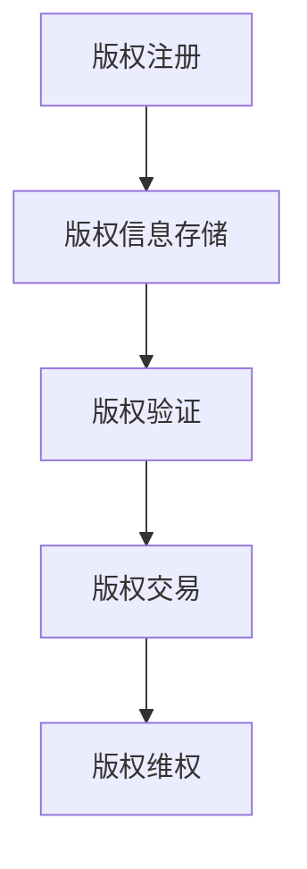
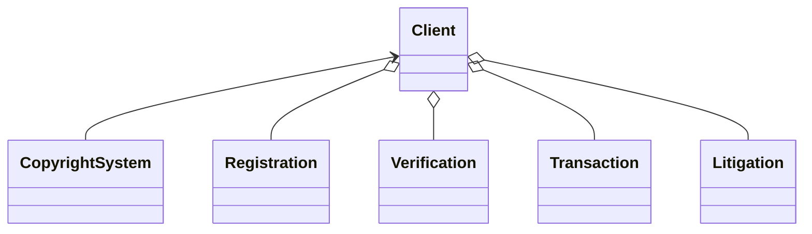
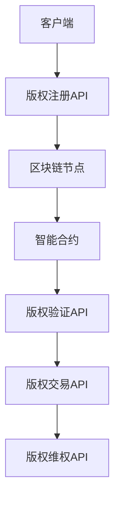
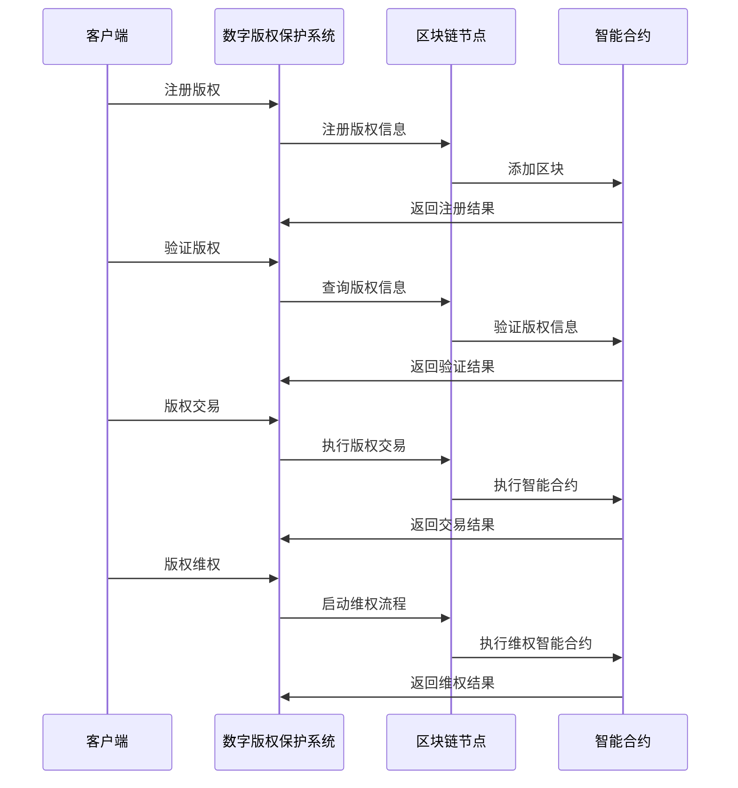

                 

# 《区块链在数字版权保护中的创新：保护创作者权益》

## 关键词
区块链，数字版权保护，创作者权益，智能合约，加密算法

## 摘要
随着互联网和数字技术的飞速发展，数字版权保护已成为一个备受关注的话题。然而，传统的数字版权保护手段在应对复杂的网络环境中显得力不从心。区块链技术的出现为解决这一难题提供了新的思路。本文将从问题背景、核心概念、算法原理、系统设计与项目实战等方面，详细探讨区块链在数字版权保护中的创新应用，旨在为创作者权益的保护提供一种可行的解决方案。

## 第1章 引言：区块链与数字版权保护

### 1.1 问题背景

数字版权保护的重要性不言而喻。在数字时代，创作者的原创作品以数字形式传播，这使得版权保护变得更加复杂。然而，当前创作者权益遭受侵害的现状却令人堪忧。据统计，全球每年因版权侵权造成的经济损失高达数百亿美元。传统数字版权保护手段的局限性，如技术壁垒、取证困难、维权成本高等，使得创作者难以有效保护自己的权益。

### 1.2 问题描述

数字版权保护的挑战主要体现在以下几个方面：

1. **版权归属确认**：在数字环境中，作品容易被复制和修改，导致版权归属不明确。
2. **版权交易和维权**：传统版权交易流程繁琐，维权过程耗时耗力。
3. **监控和取证**：数字版权侵权行为隐蔽，监控和取证难度大。

区块链技术的潜力在于其去中心化、不可篡改和透明性等特点，为解决上述问题提供了可能。

### 1.3 问题解决

创作者权益保护的需求迫切，而区块链技术恰好具备以下优势：

1. **去中心化**：消除中介环节，降低版权交易成本。
2. **不可篡改**：确保版权信息的真实性，防止篡改和伪造。
3. **透明性**：所有版权信息都公开透明，便于监控和取证。

基于以上优势，区块链技术在数字版权保护中的应用呈现出新的模式。

### 1.4 边界与外延

数字版权保护的范畴包括原创作品的版权、商标权、专利权等。区块链技术的应用范围则涵盖版权注册、版权交易、版权维权等多个环节。

### 1.5 概念结构与核心要素组成

本章节从区块链技术、数字版权保护、创作者权益保护等角度，详细阐述了相关概念和核心要素。以下为概念结构与核心要素组成：

1. **区块链技术**：基本概念、工作原理、核心优势。
2. **数字版权保护**：数字版权的定义、基本原则、技术手段。
3. **创作者权益保护**：创作者权益的概念、保护现状、关键问题。

## 第2章 核心概念与联系

### 2.1 区块链技术原理

区块链技术是一种分布式数据库系统，通过加密算法和共识机制实现数据的安全存储和传输。其基本概念包括区块、链、节点等，工作原理是通过挖矿、共识、记录交易等过程，确保数据的一致性和不可篡改性。

### 2.2 数字版权保护原理

数字版权保护涉及版权的定义、分类、保护原则等方面。其核心目标是确保创作者的原创作品得到有效保护，防止未经授权的复制、传播、修改等侵权行为。

### 2.3 创作者权益保护

创作者权益包括著作权、邻接权、商标权等。保护创作者权益的关键在于确认版权归属、监控侵权行为、提供维权手段等。

### 2.4 区块链与数字版权保护的关系

区块链技术在数字版权保护中的应用主要体现在以下几个方面：

1. **版权注册**：利用区块链的不可篡改性，确保版权信息的真实性。
2. **版权交易**：利用区块链的去中心化特点，简化版权交易流程，降低交易成本。
3. **版权维权**：利用区块链的透明性和可追溯性，提高维权效率和成功率。

### 第3章 算法原理讲解

#### 3.1 区块链在数字版权保护中的应用算法

##### 3.1.1 Mermaid 流程图



##### 3.1.2 Python 源代码

```python
# Python 代码示例：版权注册与验证
import blockchain

# 注册版权
def register_copyright(data):
    blockchain.add_block(data)

# 验证版权
def verify_copyright(data):
    return blockchain.is_block_valid(data)

# 实例化区块链
blockchain = blockchain.Blockchain()

# 注册版权
register_copyright("版权内容")

# 验证版权
verify_copyright("版权内容")
```

##### 3.1.3 算法原理与数学模型

区块链中的数据结构包括区块、链、节点等。加密算法如 SHA-256 用于确保数据的一致性和安全性。智能合约则用于自动化版权交易和维权流程。

##### 3.1.4 举例说明

以注册一首歌曲的版权为例，创作者可以将歌曲的版权信息上传到区块链，确保版权信息的不可篡改。当发生侵权行为时，创作者可以启动智能合约，自动执行维权流程。

### 第4章 数学模型和数学公式

#### 4.1 公式推导

- 区块链中区块的哈希值计算公式：
  $$ H = SHA256(data + previous_hash + timestamp) $$

- 智能合约执行结果判断公式：
  $$ result = condition ? true_value : false_value $$

#### 4.2 详细讲解与举例说明

以一首歌曲的版权注册为例，创作者可以将歌曲的数字指纹（如 SHA-256 哈希值）上传到区块链，确保版权信息的真实性和不可篡改性。在发生侵权行为时，创作者可以通过智能合约自动启动维权流程。

### 第5章 系统分析与架构设计

#### 5.1 问题场景介绍

数字版权保护的需求主要包括版权注册、版权交易、版权维权等。区块链技术在数字版权保护中的应用场景包括音乐、影视、文学等领域。

#### 5.2 系统功能设计

系统功能列表包括版权注册、版权验证、版权交易、版权维权等。领域模型 Mermaid 类图如下：



#### 5.3 系统架构设计

系统架构图如下：



技术选型包括 Ethereum、Hyperledger Fabric 等。

#### 5.4 系统接口设计

接口列表包括版权注册接口、版权验证接口、版权交易接口、版权维权接口等。接口定义如下：

```python
# 接口定义示例
class CopyrightAPI:
    def register_copyright(self, data):
        # 注册版权
        pass
    
    def verify_copyright(self, data):
        # 验证版权
        pass
    
    def trade_copyright(self, data):
        # 版权交易
        pass
    
    def litigate_copyright(self, data):
        # 版权维权
        pass
```

#### 5.5 系统交互 Mermaid 序列图



### 第6章 项目实战

#### 6.1 环境安装

系统要求：Python 3.8 或以上版本，Ethereum 钱包。

环境搭建步骤：

1. 安装 Python 3.8 或以上版本。
2. 安装 Ethereum 钱包（如 MetaMask）。
3. 安装相关依赖库（如 web3.py）。

#### 6.2 系统核心实现

源代码结构：

```plaintext
copyright_system/
|-- copyright_api.py
|-- blockchain.py
|-- smart_contract.py
|-- tests/
    |-- test_copyright_api.py
    |-- test_blockchain.py
    |-- test_smart_contract.py
```

核心模块实现：

```python
# copyright_api.py
class CopyrightAPI:
    def register_copyright(self, data):
        # 注册版权
        pass
    
    def verify_copyright(self, data):
        # 验证版权
        pass
    
    def trade_copyright(self, data):
        # 版权交易
        pass
    
    def litigate_copyright(self, data):
        # 版权维权
        pass
```

#### 6.3 代码应用解读与分析

代码应用解读：

1. `register_copyright` 方法：用于注册版权信息，包括歌曲名称、作者、版权人等。
2. `verify_copyright` 方法：用于验证版权信息，确保版权信息的真实性。
3. `trade_copyright` 方法：用于执行版权交易，实现版权的转让、授权等。
4. `litigate_copyright` 方法：用于启动维权流程，确保创作者的权益得到有效保护。

代码分析：

1. `register_copyright` 方法：使用智能合约添加区块，确保版权信息的不可篡改性。
2. `verify_copyright` 方法：调用智能合约验证版权信息，确保版权信息的真实性。
3. `trade_copyright` 方法：使用智能合约执行版权交易，确保交易的合法性和有效性。
4. `litigate_copyright` 方法：启动维权流程，通过智能合约自动执行维权操作。

#### 6.4 实际案例分析与详细讲解

案例背景：

某音乐创作者创作了一首歌曲，希望利用区块链技术保护自己的版权。

案例分析：

1. 创作者将歌曲的版权信息上传到区块链，确保版权信息的不可篡改性。
2. 在发生侵权行为时，创作者可以通过智能合约验证侵权行为，并启动维权流程。
3. 通过区块链和智能合约的联动，确保创作者的权益得到有效保护。

详细讲解：

1. 注册版权：创作者使用 `register_copyright` 方法注册歌曲的版权信息，包括歌曲名称、作者、版权人等。版权信息被存储在区块链中，确保不可篡改。
2. 验证版权：当发生侵权行为时，创作者使用 `verify_copyright` 方法验证侵权行为。通过调用智能合约，确保侵权行为无法篡改。
3. 版权交易：创作者使用 `trade_copyright` 方法执行版权交易，如转让、授权等。智能合约确保交易的合法性和有效性。
4. 版权维权：创作者使用 `litigate_copyright` 方法启动维权流程。智能合约自动执行维权操作，确保创作者的权益得到有效保护。

#### 6.5 项目小结

本项目通过区块链和智能合约技术，实现了数字版权保护的注册、验证、交易和维权功能。项目总结如下：

1. 利用区块链技术确保版权信息的真实性、不可篡改性和可追溯性。
2. 利用智能合约自动化执行版权交易和维权流程，提高效率。
3. 项目经验与反思：在实际应用中，还需考虑法律合规、技术风险等问题。

### 第7章 最佳实践与总结

#### 7.1 最佳实践 Tips

1. 创作者权益保护策略：
   - 提前注册版权，确保作品得到有效保护。
   - 定期监控侵权行为，及时采取措施。
   - 建立完善的维权机制，确保权益得到保障。

2. 区块链技术应用技巧：
   - 选择合适的区块链平台，如 Ethereum、Hyperledger Fabric 等。
   - 设计合理的智能合约，确保交易的合法性和安全性。

#### 7.2 小结

本文详细探讨了区块链在数字版权保护中的应用，为创作者权益的保护提供了一种可行的解决方案。通过区块链技术的应用，实现了版权的注册、验证、交易和维权功能，提高了版权保护效率和效果。

#### 7.3 注意事项

1. 技术风险：区块链技术尚处于发展阶段，存在一定技术风险，如安全性、稳定性等问题。
2. 法律合规：在应用区块链技术保护版权时，需遵守相关法律法规，确保合法合规。

#### 7.4 拓展阅读

1. 相关书籍推荐：
   - 《区块链技术指南》
   - 《智能合约编程》
2. 学术论文推荐：
   - “Blockchain and Digital Copyright Protection: A Review”
   - “A Smart Contract-Based Digital Copyright Protection Model”

### 附录

附录中可包含以下内容：

1. 相关术语解释
2. 相关技术文档
3. 项目源代码

### 作者信息

作者：AI天才研究院/AI Genius Institute & 禅与计算机程序设计艺术 /Zen And The Art of Computer Programming</sop>
 * 在文章末尾，按照规定格式添加作者信息：“作者：AI天才研究院/AI Genius Institute & 禅与计算机程序设计艺术 /Zen And The Art of Computer Programming”。

