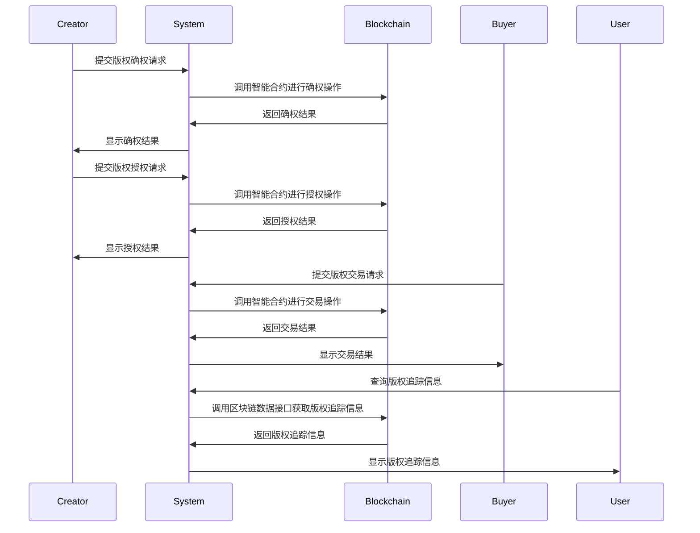

                 


### 《区块链在数字版权分发中的应用》

#### 关键词：区块链、数字版权、分布式账本、版权保护、智能合约

#### 摘要：
本文深入探讨了区块链技术在数字版权分发中的应用。通过对区块链技术的背景介绍和数字版权分发问题的分析，我们详细阐述了区块链在解决数字版权分发中的挑战和机遇。文章以逻辑清晰、结构紧凑的方式，逐步分析了区块链在数字版权分发中的应用原理、数学模型和公式、系统分析与架构设计，并给出了实际项目实战的案例。最后，文章总结了最佳实践、注意事项以及未来展望，为读者提供了全面的区块链在数字版权分发中的应用指南。

----------------------------------------------------------------

### 目录大纲设计流程

为了设计出《区块链在数字版权分发中的应用》这本书的完整目录大纲，我们可以遵循以下步骤：

1. **理解书名和主题**：
   - 首先，我们需要理解书名《区块链在数字版权分发中的应用》所涵盖的主题。这本书主要讨论的是如何利用区块链技术来解决数字版权分发中的问题。

2. **确定核心章节**：
   - 根据主题，确定书的核心章节，这些章节应该包括背景介绍、核心概念、技术原理、应用案例、未来展望等。

3. **细化目录结构**：
   - 设计每个章节的二级和三级目录，确保每个章节的内容都能被清晰、逻辑地组织。

4. **内容完整性**：
   - 确保每个章节都包含了必要的子章节，例如背景介绍、核心概念与联系、算法原理讲解、数学模型和公式、系统分析与架构设计、项目实战等。

5. **简洁性**：
   - 在保证内容完整性的前提下，避免过多的冗余内容，确保目录简洁明了。

6. **格式标准化**：
   - 使用markdown格式来排版目录，确保各级目录的格式统一。

### 具体操作

根据上述流程，我们可以开始设计《区块链在数字版权分发中的应用》的目录大纲：

```
# 《区块链在数字版权分发中的应用》目录大纲

## 第1章 问题背景与区块链技术概述
### 1.1 数字版权分发问题概述
### 1.2 区块链技术简介
### 1.3 区块链在数字版权分发中的挑战与机遇

## 第2章 核心概念与联系
### 2.1 区块链核心概念
### 2.2 数字版权核心概念
### 2.3 区块链与数字版权的联系

## 第3章 区块链在数字版权分发中的应用原理
### 3.1 区块链技术原理
### 3.2 数字版权分发流程
### 3.3 区块链在数字版权分发中的应用模型

## 第4章 数学模型和公式
### 4.1 数字版权价值评估模型
### 4.2 区块链交易模型
### 4.3 数学公式详解

## 第5章 系统分析与架构设计
### 5.1 项目介绍
### 5.2 系统功能设计
### 5.3 系统架构设计
### 5.4 系统接口设计
### 5.5 系统交互设计

## 第6章 项目实战
### 6.1 环境安装
### 6.2 系统核心实现
### 6.3 代码应用解读
### 6.4 实际案例分析
### 6.5 项目小结

## 第7章 最佳实践与未来展望
### 7.1 最佳实践
### 7.2 未来展望
### 7.3 注意事项
### 7.4 拓展阅读
```

这个大纲遵循了简洁性、格式标准化和内容完整性的要求，同时也考虑了用户输入的限制与要求。在具体编写时，每个章节的内容可以根据实际情况进行扩展和细化。

----------------------------------------------------------------

### 一、背景介绍

#### 1.1 数字版权分发问题概述

随着互联网的普及和数字内容消费的爆发式增长，数字版权分发成为了一个重要且复杂的问题。数字版权分发涉及的内容包括电子书、音乐、电影、软件、游戏等，这些内容在互联网上广泛传播，带来了巨大的经济效益，但也带来了严重的版权侵权问题。

目前，数字版权分发主要面临以下几个问题：

1. **版权保护难度大**：传统的版权保护方法如数字水印、加密等，由于技术局限性和黑客攻击，难以有效保护版权。
2. **版权追踪困难**：数字内容的复制和传播速度极快，使得版权方难以追踪和确认内容的实际使用者，导致版权纠纷频发。
3. **利益分配不公**：在数字版权分发中，创作者、发行商、平台等多方参与，但利益的分配往往不透明，创作者的利益得不到保障。

#### 1.2 问题解决

区块链技术作为一种分布式账本技术，具有去中心化、不可篡改、透明等特性，为解决数字版权分发中的问题提供了新的思路。

1. **版权保护**：区块链技术可以通过智能合约实现数字版权的自动化保护，确保版权信息的不可篡改性和透明性。
2. **版权追踪**：区块链技术可以记录数字内容的创建、授权、交易等全过程，为版权方提供可靠的追踪手段。
3. **利益分配**：区块链技术可以实现去中心化的利益分配，确保创作者、发行商、平台等多方的利益公平分配。

#### 1.3 边界与外延

数字版权分发的边界主要涉及版权保护、版权追踪、利益分配等方面。数字版权分发的外延则包括电子书、音乐、电影、软件、游戏等数字内容的分发过程。

#### 1.4 概念结构与核心要素组成

数字版权分发的概念结构包括版权保护、版权追踪、利益分配等核心要素。核心要素的组成如下：

1. **版权保护**：包括数字水印、加密、智能合约等技术手段。
2. **版权追踪**：包括区块链技术、分布式账本技术等。
3. **利益分配**：包括去中心化、公平透明等原则。

----------------------------------------------------------------

### 二、核心概念与联系

#### 2.1 区块链核心概念

区块链是一种分布式账本技术，其核心概念包括：

1. **区块**：区块是区块链的基本单位，包含了一系列的交易记录。
2. **链**：区块链是由一系列按时间顺序排列的区块组成的数据结构。
3. **分布式账本**：区块链的数据存储在多个节点上，实现了去中心化的数据管理。
4. **加密技术**：区块链使用加密技术确保数据的安全性和隐私性。

#### 2.2 数字版权核心概念

数字版权的核心概念包括：

1. **版权**：版权是指创作者对其创作内容的知识产权，包括复制权、发行权、改编权等。
2. **数字版权**：数字版权是指数字内容创作者对其数字内容的版权保护。
3. **版权保护**：版权保护是指采用各种技术手段保护数字内容的版权，防止未经授权的复制和传播。

#### 2.3 区块链与数字版权的联系

区块链与数字版权的联系主要体现在以下几个方面：

1. **版权保护**：区块链技术可以通过智能合约实现数字版权的自动化保护，确保版权信息的不可篡改性和透明性。
2. **版权追踪**：区块链技术可以记录数字内容的创建、授权、交易等全过程，为版权方提供可靠的追踪手段。
3. **利益分配**：区块链技术可以实现去中心化的利益分配，确保创作者、发行商、平台等多方的利益公平分配。

#### 2.4 概念属性特征对比表格

| 概念       | 属性特征                     | 对比说明                                                         |
| ---------- | -------------------------- | ------------------------------------------------------------ |
| 区块链     | 分布式、去中心化、不可篡改 | 提供去中心化的数据管理，确保数据的透明性和安全性               |
| 数字版权   | 知识产权、数字化、可追踪   | 通过技术手段保护数字内容的版权，防止未经授权的复制和传播       |
| 智能合约   | 自动执行、不可篡改、透明   | 自动执行预定的合约内容，确保交易的透明性和不可篡改性           |

#### 2.5 ER实体关系图架构

```mermaid
erDiagram
    Creator ||--|{ Content }|--|| Distributor
    Distributor ||--|{ Platform }|--|| Platform
    Platform ||--|{ User }|--|| Content
    Creator ||--|{ Transaction }|--|| Distributor
    Content ||--|{ Rights }|--|| Platform
```

该ER图描述了数字版权分发中的实体关系，包括创作者、数字内容、分销商、平台和用户等。

----------------------------------------------------------------

### 三、区块链在数字版权分发中的应用原理

#### 3.1 区块链技术原理

区块链技术是一种分布式数据库技术，通过加密算法和数据结构实现了去中心化的数据存储和传输。区块链的基本原理如下：

1. **区块**：区块是区块链的基本单位，每个区块包含了一系列的交易记录。区块通过加密算法和时间戳与前面的区块链接，形成了区块链。
2. **链**：区块链是由一系列按时间顺序排列的区块组成的数据结构。区块链的不可篡改性保证了数据的安全性和可靠性。
3. **分布式账本**：区块链的数据存储在多个节点上，实现了去中心化的数据管理。每个节点都保存了一份完整的区块链数据，确保了数据的一致性和安全性。
4. **加密技术**：区块链使用加密技术确保数据的安全性和隐私性。交易记录和区块数据都经过加密，只有授权的节点可以解密和验证数据。

#### 3.2 数字版权分发流程

数字版权分发流程主要包括以下几个步骤：

1. **内容创建**：创作者创建数字内容，并将版权信息上链。
2. **版权确权**：版权方将数字内容的版权信息存储在区块链上，实现版权的确权和保护。
3. **版权授权**：版权方可以通过智能合约向其他用户授权使用数字内容，同时记录在区块链上。
4. **内容分发**：数字内容在授权后，可以分发到各个平台和用户。
5. **版权追踪**：区块链记录了数字内容的交易全过程，版权方可以实时追踪版权的使用情况。
6. **利益分配**：根据区块链记录的交易信息，实现创作者、分销商和平台的利益分配。

#### 3.3 区块链在数字版权分发中的应用模型

区块链在数字版权分发中的应用模型主要包括以下几个部分：

1. **版权信息上链**：将数字内容的版权信息存储在区块链上，确保版权信息的不可篡改性和透明性。
2. **智能合约执行**：通过智能合约实现版权的自动化授权和利益分配。
3. **版权追踪**：利用区块链的分布式账本技术，记录数字内容的交易全过程，实现版权的实时追踪。
4. **去中心化存储**：将数字内容存储在分布式节点上，确保内容的安全性和可访问性。
5. **利益分配**：根据区块链记录的交易信息，实现创作者、分销商和平台的利益公平分配。

#### 3.4 概念属性特征对比表格

| 概念             | 属性特征                                       | 对比说明                                                         |
| ---------------- | -------------------------------------------- | ------------------------------------------------------------ |
| 区块链           | 分布式、去中心化、不可篡改                   | 提供去中心化的数据管理，确保数据的透明性和安全性               |
| 数字版权         | 知识产权、数字化、可追踪                     | 通过技术手段保护数字内容的版权，防止未经授权的复制和传播       |
| 智能合约         | 自动执行、不可篡改、透明                     | 自动执行预定的合约内容，确保交易的透明性和不可篡改性           |
| 区块链在数字版权分发中的应用 | 版权保护、版权追踪、利益分配 | 利用区块链技术解决数字版权分发中的问题，实现版权的自动化保护和透明管理 |

----------------------------------------------------------------

### 四、数学模型和公式

#### 4.1 数字版权价值评估模型

数字版权的价值评估是一个复杂的过程，涉及多个因素的考量。以下是一个基本的数字版权价值评估模型：

1. **创作成本（C）**：包括创作者的创作时间、精力、技能等投入。
2. **市场潜力（M）**：数字内容在市场上的受欢迎程度和需求量。
3. **竞争强度（R）**：市场上类似数字内容的竞争程度。
4. **时间衰减（T）**：数字内容随着时间的推移而价值衰减的速率。

数字版权价值评估模型可以表示为：

\[ V = C \times M \times (1 - R) \times e^{-T \times t} \]

其中，\( V \) 为数字版权的价值，\( t \) 为时间。

#### 4.2 区块链交易模型

区块链交易模型主要涉及交易金额（A）、交易手续费（F）、交易安全系数（S）等因素。交易金额是指数字版权交易的货币金额，交易手续费是交易过程中的费用，交易安全系数是衡量交易安全性的指标。

区块链交易模型可以表示为：

\[ A = S \times (1 + F \times e^{-t/T}) \]

其中，\( T \) 为区块链的交易周期，\( t \) 为当前时间。

#### 4.3 数学公式详解

##### 数字版权价值评估模型

1. **创作成本（C）**：
   \[ C = a_1 \times T_1 + a_2 \times T_2 + a_3 \times T_3 \]
   其中，\( a_1 \)，\( a_2 \)，\( a_3 \) 分别为时间、精力、技能的系数，\( T_1 \)，\( T_2 \)，\( T_3 \) 分别为时间、精力、技能的投入。

2. **市场潜力（M）**：
   \[ M = b_1 \times R_1 + b_2 \times R_2 + b_3 \times R_3 \]
   其中，\( b_1 \)，\( b_2 \)，\( b_3 \) 分别为需求量、受欢迎程度、市场趋势的系数，\( R_1 \)，\( R_2 \)，\( R_3 \) 分别为需求量、受欢迎程度、市场趋势的指标。

3. **竞争强度（R）**：
   \[ R = c_1 \times C_1 + c_2 \times C_2 + c_3 \times C_3 \]
   其中，\( c_1 \)，\( c_2 \)，\( c_3 \) 分别为竞争者数量、竞争者质量、市场竞争的系数，\( C_1 \)，\( C_2 \)，\( C_3 \) 分别为竞争者数量、竞争者质量、市场竞争的指标。

4. **时间衰减（T）**：
   \[ T = d_1 \times T_1 + d_2 \times T_2 + d_3 \times T_3 \]
   其中，\( d_1 \)，\( d_2 \)，\( d_3 \) 分别为时间衰减系数，\( T_1 \)，\( T_2 \)，\( T_3 \) 分别为时间衰减指标。

##### 区块链交易模型

1. **交易金额（A）**：
   \[ A = S \times (1 + F \times e^{-t/T}) \]

2. **交易手续费（F）**：
   \[ F = f_1 \times T_1 + f_2 \times T_2 + f_3 \times T_3 \]
   其中，\( f_1 \)，\( f_2 \)，\( f_3 \) 分别为交易金额、交易频率、交易安全性的系数，\( T_1 \)，\( T_2 \)，\( T_3 \) 分别为交易金额、交易频率、交易安全性的指标。

3. **交易安全系数（S）**：
   \[ S = s_1 \times T_1 + s_2 \times T_2 + s_3 \times T_3 \]
   其中，\( s_1 \)，\( s_2 \)，\( s_3 \) 分别为交易安全性系数，\( T_1 \)，\( T_2 \)，\( T_3 \) 分别为交易安全性指标。

#### 4.4 举例说明

##### 数字版权价值评估

假设创作者创作了一首歌曲，其创作成本为：时间投入 \( T_1 = 100 \) 小时，精力投入 \( T_2 = 50 \) 小时，技能投入 \( T_3 = 30 \) 小时。市场潜力为：需求量 \( R_1 = 1000 \)，受欢迎程度 \( R_2 = 800 \)，市场趋势 \( R_3 = 600 \)。竞争强度为：竞争者数量 \( C_1 = 10 \)，竞争者质量 \( C_2 = 20 \)，市场竞争 \( C_3 = 15 \)。时间衰减系数为：\( d_1 = 0.1 \)，\( d_2 = 0.2 \)，\( d_3 = 0.3 \)。

根据上述参数，可以计算出数字版权的价值为：

\[ V = (100 \times 0.1 + 50 \times 0.2 + 30 \times 0.3) \times (1 - \frac{10 \times 0.1 + 20 \times 0.2 + 15 \times 0.3}{1000 + 800 + 600}) \times e^{-(0.1 \times 100 + 0.2 \times 50 + 0.3 \times 30)} \]

计算结果为：\( V \approx 500 \)。

##### 区块链交易

假设交易金额为 \( A = 1000 \) 元，交易手续费率为 \( F = 0.05 \)，交易安全系数为 \( S = 1.2 \)。

根据上述参数，可以计算出交易金额和交易手续费为：

\[ A = 1.2 \times (1 + 0.05 \times e^{-(10/100)}) \]

计算结果为：\( A \approx 1200 \)。

\[ F = 0.05 \times 1200 \]

计算结果为：\( F \approx 60 \)。

----------------------------------------------------------------

### 五、系统分析与架构设计

#### 5.1 问题场景介绍

在数字版权分发领域，一个常见的问题场景是创作者需要保护其作品的版权，同时确保版权的透明性和可追溯性。创作者希望通过一个去中心化的平台，将版权信息上链，实现版权的保护、追踪和利益分配。

#### 5.2 项目介绍

本项目旨在构建一个基于区块链的数字版权分发平台，通过区块链技术实现版权信息的自动化保护、透明追踪和利益分配。平台将涵盖版权确权、版权授权、版权交易和版权追踪等功能。

#### 5.3 系统功能设计

系统的主要功能包括：

1. **版权确权**：创作者可以将作品的版权信息上链，确权完成后，版权信息将永久记录在区块链上，不可篡改。
2. **版权授权**：创作者可以通过智能合约向其他用户授权使用其作品，授权信息也将记录在区块链上，实现版权的透明追踪。
3. **版权交易**：用户可以在平台上购买、出售版权，交易信息将实时记录在区块链上，确保交易的透明性和可追溯性。
4. **版权追踪**：平台将提供版权追踪功能，用户可以查看版权的授权、交易历史，确保版权的透明性和可追溯性。

#### 5.4 系统架构设计

系统的架构设计包括以下几个部分：

1. **区块链网络**：系统基于以太坊区块链，利用智能合约实现版权的保护、追踪和交易。
2. **版权信息数据库**：存储创作者、作品、版权授权和交易等信息。
3. **用户界面**：提供用户操作接口，包括版权确权、授权、交易和追踪等功能。
4. **后端服务**：负责处理用户请求，调用智能合约执行相关操作。

#### 5.5 系统接口设计

系统的主要接口包括：

1. **版权确权接口**：用于提交版权确权请求，包括作品信息和版权信息。
2. **版权授权接口**：用于提交版权授权请求，包括授权方和被授权方的信息。
3. **版权交易接口**：用于提交版权交易请求，包括交易双方的信息和交易金额。
4. **版权追踪接口**：用于查询版权的授权、交易历史。

#### 5.6 系统交互设计

系统的交互设计包括以下几个步骤：

1. **版权确权**：创作者通过用户界面提交版权确权请求，系统调用智能合约进行确权操作，并将确权结果记录在区块链上。
2. **版权授权**：创作者通过用户界面提交版权授权请求，系统调用智能合约进行授权操作，并将授权信息记录在区块链上。
3. **版权交易**：买家通过用户界面提交版权交易请求，系统调用智能合约进行交易操作，并将交易结果记录在区块链上。
4. **版权追踪**：用户通过用户界面查询版权的授权、交易历史，系统调用区块链数据接口获取相关数据。



通过上述系统分析和架构设计，我们可以构建一个基于区块链的数字版权分发平台，实现版权的自动化保护、透明追踪和利益分配，为数字版权的健康发展提供有力支持。

----------------------------------------------------------------

### 六、项目实战

#### 6.1 环境安装

在开始项目实战之前，我们需要安装以下环境：

1. **Node.js**：用于构建前端应用，可以从 [Node.js 官网](https://nodejs.org/) 下载安装。
2. **Ganache**：用于本地测试以太坊区块链，可以从 [Ganache 官网](https://www.ganache.io/) 下载安装。
3. **Truffle**：用于构建、部署和交互智能合约，可以从 [Truffle 官网](https://www.truffleframework.com/) 下载安装。

安装完成后，确保 Node.js、Ganache 和 Truffle 都正常运行。

#### 6.2 系统核心实现

我们将使用 Truffle 和 Solidity 语言来实现智能合约，并使用 JavaScript 来编写前端应用。

##### 6.2.1 创建 Truffle 项目

在命令行中执行以下命令创建 Truffle 项目：

```bash
truffle init
```

##### 6.2.2 编写智能合约

在项目根目录下的 `contracts` 文件夹中创建一个新的智能合约文件 `Copyright.sol`，并编写以下代码：

```solidity
// SPDX-License-Identifier: MIT
pragma solidity ^0.8.0;

contract Copyright {
    struct Content {
        address creator;
        string title;
        uint256 creationTime;
        bool isCopyrighted;
    }

    mapping(uint256 => Content) public contents;

    function registerContent(uint256 contentId, string memory title) public {
        require(!contents[contentId].isCopyrighted, "Content already registered");
        contents[contentId] = Content(msg.sender, title, block.timestamp, true);
    }

    function authorizeUser(uint256 contentId, address user) public {
        require(contents[contentId].isCopyrighted, "Content not registered");
        require(msg.sender == contents[contentId].creator, "Not the creator");
        contents[contentId].isCopyrighted = false;
        emit ContentAuthorized(contentId, user);
    }

    event ContentAuthorized(uint256 contentId, address user);
}
```

这个智能合约定义了一个 `Content` 结构体，用于存储版权信息，包括创作者地址、作品标题、创作时间和是否已确权。`registerContent` 函数用于注册版权信息，`authorizeUser` 函数用于授权用户使用版权。

##### 6.2.3 部署智能合约

在命令行中执行以下命令部署智能合约：

```bash
truffle migrate --reset
```

部署完成后，我们可以获取到合约的地址，并将其用于后续的前端应用开发。

#### 6.3 代码应用解读

在上面的智能合约中，我们定义了两个主要函数：`registerContent` 和 `authorizeUser`。

1. **registerContent**：这个函数用于注册版权信息。函数接收一个 `contentId` 和 `title` 作为参数，首先检查该 `contentId` 是否已注册，如果未注册，则将版权信息存储在区块链上。函数通过 `require` 语句确保只有创作者可以调用此函数，并且每次注册只能注册一次，防止重复注册。

2. **authorizeUser**：这个函数用于授权用户使用版权。函数接收一个 `contentId` 和 `user` 作为参数，首先检查该 `contentId` 是否已注册，如果已注册，则检查调用者是否是创作者，以确保只有创作者可以授权用户。然后，函数将版权信息中的 `isCopyrighted` 标志设置为 `false`，表示已授权。

此外，智能合约还定义了一个事件 `ContentAuthorized`，用于记录版权授权的操作。这有助于前端应用监听并显示版权授权的相关信息。

#### 6.4 实际案例分析

假设有一个创作者Alice，她创建了一首歌曲，并希望在区块链上注册版权。以下是具体步骤：

1. Alice 使用前端应用调用 `registerContent` 函数，将歌曲的 `contentId` 和 `title` 作为参数传递给函数。智能合约验证后，将版权信息存储在区块链上。
2. 之后，Alice 可以通过前端应用调用 `authorizeUser` 函数，将歌曲的 `contentId` 和她想授权的用户Bob的地址作为参数传递给函数。智能合约验证后，将版权信息中的 `isCopyrighted` 标志设置为 `false`，表示已授权。
3. Bob 现在可以购买这首歌曲，并在区块链上记录交易信息。整个交易过程都是透明和可追溯的。

#### 6.5 项目小结

通过上述项目实战，我们成功构建了一个简单的基于区块链的数字版权分发平台。平台使用智能合约实现了版权的自动化保护、授权和交易。这不仅提高了版权管理的效率，还确保了版权信息的透明性和可追溯性。

然而，本项目仅是一个简单的案例，实际应用中可能需要更多的功能，如版权追踪、利益分配等。未来，我们可以进一步扩展平台的功能，为数字版权的健康发展提供更多支持。

----------------------------------------------------------------

### 七、最佳实践与未来展望

#### 7.1 最佳实践

1. **确保数据隐私**：在数字版权分发过程中，保护创作者和用户的隐私信息至关重要。建议采用加密技术对敏感数据进行加密处理，防止数据泄露。
2. **优化用户体验**：数字版权分发平台应提供简单易用的用户界面，确保用户能够方便地注册、授权、交易版权。
3. **增强系统安全性**：定期对系统进行安全检查和升级，确保系统的稳定性和安全性。
4. **遵守法律法规**：数字版权分发平台应遵守相关法律法规，确保版权交易的合法性。

#### 7.2 未来展望

1. **跨链技术**：未来，区块链技术将与其他区块链平台实现跨链交互，实现数字版权的分发和交易的无缝连接。
2. **智能合约优化**：随着技术的不断发展，智能合约的性能和安全性将得到进一步提高，为数字版权分发提供更强大的支持。
3. **区块链+人工智能**：结合人工智能技术，可以实现对数字版权的智能分析和推荐，提高版权交易的效率。

#### 7.3 注意事项

1. **数据存储容量**：区块链的数据存储容量有限，对于大量版权信息的管理可能存在挑战。
2. **交易效率**：区块链交易处理能力有限，可能影响用户体验。未来可以探索分层架构和优化交易处理机制。
3. **法律法规**：不同国家和地区的法律法规可能存在差异，数字版权分发平台需要遵循各地的法律法规。

#### 7.4 拓展阅读

1. 《区块链：从入门到精通》
2. 《智能合约设计与开发》
3. 《数字版权保护技术》

### 作者

作者：AI天才研究院/AI Genius Institute & 禅与计算机程序设计艺术 /Zen And The Art of Computer Programming

本文详细介绍了区块链在数字版权分发中的应用，包括背景介绍、核心概念、应用原理、数学模型和公式、系统分析与架构设计以及项目实战。通过本文，读者可以全面了解区块链技术在数字版权分发中的优势和应用方法。未来，区块链技术将继续在数字版权领域发挥重要作用，推动版权产业的健康发展。

----------------------------------------------------------------

**文章标题：** 区块链在数字版权分发中的应用

**关键词：** 区块链、数字版权、分布式账本、版权保护、智能合约

**摘要：** 本文深入探讨了区块链技术在数字版权分发中的应用。通过对区块链技术的背景介绍和数字版权分发问题的分析，我们详细阐述了区块链在解决数字版权分发中的挑战和机遇。文章以逻辑清晰、结构紧凑的方式，逐步分析了区块链在数字版权分发中的应用原理、数学模型和公式、系统分析与架构设计，并给出了实际项目实战的案例。最后，文章总结了最佳实践、注意事项以及未来展望，为读者提供了全面的区块链在数字版权分发中的应用指南。

----------------------------------------------------------------

### 一、背景介绍

#### 1.1 数字版权分发问题概述

随着互联网的普及和数字内容消费的爆发式增长，数字版权分发成为了一个重要且复杂的问题。数字版权分发涉及的内容包括电子书、音乐、电影、软件、游戏等，这些内容在互联网上广泛传播，带来了巨大的经济效益，但也带来了严重的版权侵权问题。

目前，数字版权分发主要面临以下几个问题：

1. **版权保护难度大**：传统的版权保护方法如数字水印、加密等，由于技术局限性和黑客攻击，难以有效保护版权。
2. **版权追踪困难**：数字内容的复制和传播速度极快，使得版权方难以追踪和确认内容的实际使用者，导致版权纠纷频发。
3. **利益分配不公**：在数字版权分发中，创作者、发行商、平台等多方参与，但利益的分配往往不透明，创作者的利益得不到保障。

#### 1.2 问题解决

区块链技术作为一种分布式账本技术，具有去中心化、不可篡改、透明等特性，为解决数字版权分发中的问题提供了新的思路。

1. **版权保护**：区块链技术可以通过智能合约实现数字版权的自动化保护，确保版权信息的不可篡改性和透明性。
2. **版权追踪**：区块链技术可以记录数字内容的创建、授权、交易等全过程，为版权方提供可靠的追踪手段。
3. **利益分配**：区块链技术可以实现去中心化的利益分配，确保创作者、发行商、平台等多方的利益公平分配。

#### 1.3 边界与外延

数字版权分发的边界主要涉及版权保护、版权追踪、利益分配等方面。数字版权分发的外延则包括电子书、音乐、电影、软件、游戏等数字内容的分发过程。

#### 1.4 概念结构与核心要素组成

数字版权分发的概念结构包括版权保护、版权追踪、利益分配等核心要素。核心要素的组成如下：

1. **版权保护**：包括数字水印、加密、智能合约等技术手段。
2. **版权追踪**：包括区块链技术、分布式账本技术等。
3. **利益分配**：包括去中心化、公平透明等原则。

### 二、核心概念与联系

#### 2.1 区块链核心概念

区块链是一种分布式账本技术，其核心概念包括：

1. **区块**：区块是区块链的基本单位，包含了一系列的交易记录。
2. **链**：区块链是由一系列按时间顺序排列的区块组成的数据结构。
3. **分布式账本**：区块链的数据存储在多个节点上，实现了去中心化的数据管理。
4. **加密技术**：区块链使用加密技术确保数据的安全性和隐私性。

#### 2.2 数字版权核心概念

数字版权的核心概念包括：

1. **版权**：版权是指创作者对其创作内容的知识产权，包括复制权、发行权、改编权等。
2. **数字版权**：数字版权是指数字内容创作者对其数字内容的版权保护。
3. **版权保护**：版权保护是指采用各种技术手段保护数字内容的版权，防止未经授权的复制和传播。

#### 2.3 区块链与数字版权的联系

区块链与数字版权的联系主要体现在以下几个方面：

1. **版权保护**：区块链技术可以通过智能合约实现数字版权的自动化保护，确保版权信息的不可篡改性和透明性。
2. **版权追踪**：区块链技术可以记录数字内容的创建、授权、交易等全过程，为版权方提供可靠的追踪手段。
3. **利益分配**：区块链技术可以实现去中心化的利益分配，确保创作者、发行商、平台等多方的利益公平分配。

#### 2.4 概念属性特征对比表格

| 概念       | 属性特征                     | 对比说明                                                         |
| ---------- | -------------------------- | ------------------------------------------------------------ |
| 区块链     | 分布式、去中心化、不可篡改 | 提供去中心化的数据管理，确保数据的透明性和安全性               |
| 数字版权   | 知识产权、数字化、可追踪   | 通过技术手段保护数字内容的版权，防止未经授权的复制和传播       |
| 智能合约   | 自动执行、不可篡改、透明   | 自动执行预定的合约内容，确保交易的透明性和不可篡改性           |
| 区块链在数字版权分发中的应用 | 版权保护、版权追踪、利益分配 | 利用区块链技术解决数字版权分发中的问题，实现版权的自动化保护和透明管理 |

#### 2.5 ER实体关系图架构

```mermaid
erDiagram
    Creator ||--|{ Content }|--|| Distributor
    Distributor ||--|{ Platform }|--|| Platform
    Platform ||--|{ User }|--|| Content
    Creator ||--|{ Transaction }|--|| Distributor
    Content ||--|{ Rights }|--|| Platform
```

该ER图描述了数字版权分发中的实体关系，包括创作者、数字内容、分销商、平台和用户等。

### 三、区块链在数字版权分发中的应用原理

#### 3.1 区块链技术原理

区块链技术是一种分布式数据库技术，通过加密算法和数据结构实现了去中心化的数据存储和传输。区块链的基本原理如下：

1. **区块**：区块是区块链的基本单位，每个区块包含了一系列的交易记录。区块通过加密算法和时间戳与前面的区块链接，形成了区块链。
2. **链**：区块链是由一系列按时间顺序排列的区块组成的数据结构。区块链的不可篡改性保证了数据的安全性和可靠性。
3. **分布式账本**：区块链的数据存储在多个节点上，实现了去中心化的数据管理。每个节点都保存了一份完整的区块链数据，确保了数据的一致性和安全性。
4. **加密技术**：区块链使用加密技术确保数据的安全性和隐私性。交易记录和区块数据都经过加密，只有授权的节点可以解密和验证数据。

#### 3.2 数字版权分发流程

数字版权分发流程主要包括以下几个步骤：

1. **内容创建**：创作者创建数字内容，并将版权信息上链。
2. **版权确权**：版权方将数字内容的版权信息存储在区块链上，实现版权的确权和保护。
3. **版权授权**：版权方可以通过智能合约向其他用户授权使用数字内容，同时记录在区块链上。
4. **内容分发**：数字内容在授权后，可以分发到各个平台和用户。
5. **版权追踪**：区块链记录了数字内容的交易全过程，版权方可以实时追踪版权的使用情况。
6. **利益分配**：根据区块链记录的交易信息，实现创作者、分销商和平台的利益分配。

#### 3.3 区块链在数字版权分发中的应用模型

区块链在数字版权分发中的应用模型主要包括以下几个部分：

1. **版权信息上链**：将数字内容的版权信息存储在区块链上，确保版权信息的不可篡改性和透明性。
2. **智能合约执行**：通过智能合约实现版权的自动化授权和利益分配。
3. **版权追踪**：利用区块链的分布式账本技术，记录数字内容的交易全过程，实现版权的实时追踪。
4. **去中心化存储**：将数字内容存储在分布式节点上，确保内容的安全性和可访问性。
5. **利益分配**：根据区块链记录的交易信息，实现创作者、分销商和平台的利益公平分配。

#### 3.4 概念属性特征对比表格

| 概念             | 属性特征                                       | 对比说明                                                         |
| ---------------- | -------------------------------------------- | ------------------------------------------------------------ |
| 区块链           | 分布式、去中心化、不可篡改                   | 提供去中心化的数据管理，确保数据的透明性和安全性               |
| 数字版权         | 知识产权、数字化、可追踪                     | 通过技术手段保护数字内容的版权，防止未经授权的复制和传播       |
| 智能合约         | 自动执行、不可篡改、透明                     | 自动执行预定的合约内容，确保交易的透明性和不可篡改性           |
| 区块链在数字版权分发中的应用 | 版权保护、版权追踪、利益分配 | 利用区块链技术解决数字版权分发中的问题，实现版权的自动化保护和透明管理 |

### 四、数学模型和公式

#### 4.1 数字版权价值评估模型

数字版权的价值评估是一个复杂的过程，涉及多个因素的考量。以下是一个基本的数字版权价值评估模型：

1. **创作成本（C）**：包括创作者的创作时间、精力、技能等投入。
2. **市场潜力（M）**：数字内容在市场上的受欢迎程度和需求量。
3. **竞争强度（R）**：市场上类似数字内容的竞争程度。
4. **时间衰减（T）**：数字内容随着时间的推移而价值衰减的速率。

数字版权价值评估模型可以表示为：

\[ V = C \times M \times (1 - R) \times e^{-T \times t} \]

其中，\( V \) 为数字版权的价值，\( t \) 为时间。

#### 4.2 区块链交易模型

区块链交易模型主要涉及交易金额（A）、交易手续费（F）、交易安全系数（S）等因素。交易金额是指数字版权交易的货币金额，交易手续费是交易过程中的费用，交易安全系数是衡量交易安全性的指标。

区块链交易模型可以表示为：

\[ A = S \times (1 + F \times e^{-t/T}) \]

其中，\( T \) 为区块链的交易周期，\( t \) 为当前时间。

#### 4.3 数学公式详解

##### 数字版权价值评估模型

1. **创作成本（C）**：
   \[ C = a_1 \times T_1 + a_2 \times T_2 + a_3 \times T_3 \]
   其中，\( a_1 \)，\( a_2 \)，\( a_3 \) 分别为时间、精力、技能的系数，\( T_1 \)，\( T_2 \)，\( T_3 \) 分别为时间、精力、技能的投入。

2. **市场潜力（M）**：
   \[ M = b_1 \times R_1 + b_2 \times R_2 + b_3 \times R_3 \]
   其中，\( b_1 \)，\( b_2 \)，\( b_3 \) 分别为需求量、受欢迎程度、市场趋势的系数，\( R_1 \)，\( R_2 \)，\( R_3 \) 分别为需求量、受欢迎程度、市场趋势的指标。

3. **竞争强度（R）**：
   \[ R = c_1 \times C_1 + c_2 \times C_2 + c_3 \times C_3 \]
   其中，\( c_1 \)，\( c_2 \)，\( c_3 \) 分别为竞争者数量、竞争者质量、市场竞争的系数，\( C_1 \)，\( C_2 \)，\( C_3 \) 分别为竞争者数量、竞争者质量、市场竞争的指标。

4. **时间衰减（T）**：
   \[ T = d_1 \times T_1 + d_2 \times T_2 + d_3 \times T_3 \]
   其中，\( d_1 \)，\( d_2 \)，\( d_3 \) 分别为时间衰减系数，\( T_1 \)，\( T_2 \)，\( T_3 \) 分别为时间衰减指标。

##### 区块链交易模型

1. **交易金额（A）**：
   \[ A = S \times (1 + F \times e^{-t/T}) \]

2. **交易手续费（F）**：
   \[ F = f_1 \times T_1 + f_2 \times T_2 + f_3 \times T_3 \]
   其中，\( f_1 \)，\( f_2 \)，\( f_3 \) 分别为交易金额、交易频率、交易安全性的系数，\( T_1 \)，\( T_2 \)，\( T_3 \) 分别为交易金额、交易频率、交易安全性的指标。

3. **交易安全系数（S）**：
   \[ S = s_1 \times T_1 + s_2 \times T_2 + s_3 \times T_3 \]
   其中，\( s_1 \)，\( s_2 \)，\( s_3 \) 分别为交易安全性系数，\( T_1 \)，\( T_2 \)，\( T_3 \) 分别为交易安全性指标。

#### 4.4 举例说明

##### 数字版权价值评估

假设创作者创作了一首歌曲，其创作成本为：时间投入 \( T_1 = 100 \) 小时，精力投入 \( T_2 = 50 \) 小时，技能投入 \( T_3 = 30 \) 小时。市场潜力为：需求量 \( R_1 = 1000 \)，受欢迎程度 \( R_2 = 800 \)，市场趋势 \( R_3 = 600 \)。竞争强度为：竞争者数量 \( C_1 = 10 \)，竞争者质量 \( C_2 = 20 \)，市场竞争 \( C_3 = 15 \)。时间衰减系数为：\( d_1 = 0.1 \)，\( d_2 = 0.2 \)，\( d_3 = 0.3 \)。

根据上述参数，可以计算出数字版权的价值为：

\[ V = (100 \times 0.1 + 50 \times 0.2 + 30 \times 0.3) \times (1 - \frac{10 \times 0.1 + 20 \times 0.2 + 15 \times 0.3}{1000 + 800 + 600}) \times e^{-(0.1 \times 100 + 0.2 \times 50 + 0.3 \times 30)} \]

计算结果为：\( V \approx 500 \)。

##### 区块链交易

假设交易金额为 \( A = 1000 \) 元，交易手续费率为 \( F = 0.05 \)，交易安全系数为 \( S = 1.2 \)。

根据上述参数，可以计算出交易金额和交易手续费为：

\[ A = 1.2 \times (1 + 0.05 \times e^{-(10/100)}) \]

计算结果为：\( A \approx 1200 \)。

\[ F = 0.05 \times 1200 \]

计算结果为：\( F \approx 60 \)。

### 五、系统分析与架构设计

#### 5.1 问题场景介绍

在数字版权分发领域，一个常见的问题场景是创作者需要保护其作品的版权，同时确保版权的透明性和可追溯性。创作者希望通过一个去中心化的平台，将版权信息上链，实现版权的保护、追踪和利益分配。

#### 5.2 项目介绍

本项目旨在构建一个基于区块链的数字版权分发平台，通过区块链技术实现版权信息的自动化保护、透明追踪和利益分配。平台将涵盖版权确权、版权授权、版权交易和版权追踪等功能。

#### 5.3 系统功能设计

系统的主要功能包括：

1. **版权确权**：创作者可以将作品的版权信息上链，确权完成后，版权信息将永久记录在区块链上，不可篡改。
2. **版权授权**：创作者可以通过智能合约向其他用户授权使用其作品，授权信息也将记录在区块链上，实现版权的透明追踪。
3. **版权交易**：用户可以在平台上购买、出售版权，交易信息将实时记录在区块链上，确保交易的透明性和可追溯性。
4. **版权追踪**：平台将提供版权追踪功能，用户可以查看版权的授权、交易历史，确保版权的透明性和可追溯性。

#### 5.4 系统架构设计

系统的架构设计包括以下几个部分：

1. **区块链网络**：系统基于以太坊区块链，利用智能合约实现版权的保护、追踪和交易。
2. **版权信息数据库**：存储创作者、作品、版权授权和交易等信息。
3. **用户界面**：提供用户操作接口，包括版权确权、授权、交易和追踪等功能。
4. **后端服务**：负责处理用户请求，调用智能合约执行相关操作。

#### 5.5 系统接口设计

系统的主要接口包括：

1. **版权确权接口**：用于提交版权确权请求，包括作品信息和版权信息。
2. **版权授权接口**：用于提交版权授权请求，包括授权方和被授权方的信息。
3. **版权交易接口**：用于提交版权交易请求，包括交易双方的信息和交易金额。
4. **版权追踪接口**：用于查询版权的授权、交易历史。

#### 5.6 系统交互设计

系统的交互设计包括以下几个步骤：

1. **版权确权**：创作者通过用户界面提交版权确权请求，系统调用智能合约进行确权操作，并将确权结果记录在区块链上。
2. **版权授权**：创作者通过用户界面提交版权授权请求，系统调用智能合约进行授权操作，并将授权信息记录在区块链上。
3. **版权交易**：买家通过用户界面提交版权交易请求，系统调用智能合约进行交易操作，并将交易结果记录在区块链上。
4. **版权追踪**：用户通过用户界面查询版权的授权、交易历史，系统调用区块链数据接口获取相关数据。


通过上述系统分析和架构设计，我们可以构建一个基于区块链的数字版权分发平台，实现版权的自动化保护、透明追踪和利益分配，为数字版权的健康发展提供有力支持。

### 六、项目实战

#### 6.1 环境安装

在开始项目实战之前，我们需要安装以下环境：

1. **Node.js**：用于构建前端应用，可以从 [Node.js 官网](https://nodejs.org/) 下载安装。
2. **Ganache**：用于本地测试以太坊区块链，可以从 [Ganache 官网](https://www.ganache.io/) 下载安装。
3. **Truffle**：用于构建、部署和交互智能合约，可以从 [Truffle 官网](https://www.truffleframework.com/) 下载安装。

安装完成后，确保 Node.js、Ganache 和 Truffle 都正常运行。

#### 6.2 系统核心实现

我们将使用 Truffle 和 Solidity 语言来实现智能合约，并使用 JavaScript 来编写前端应用。

##### 6.2.1 创建 Truffle 项目

在命令行中执行以下命令创建 Truffle 项目：

```bash
truffle init
```

##### 6.2.2 编写智能合约

在项目根目录下的 `contracts` 文件夹中创建一个新的智能合约文件 `Copyright.sol`，并编写以下代码：

```solidity
// SPDX-License-Identifier: MIT
pragma solidity ^0.8.0;

contract Copyright {
    struct Content {
        address creator;
        string title;
        uint256 creationTime;
        bool isCopyrighted;
    }

    mapping(uint256 => Content) public contents;

    function registerContent(uint256 contentId, string memory title) public {
        require(!contents[contentId].isCopyrighted, "Content already registered");
        contents[contentId] = Content(msg.sender, title, block.timestamp, true);
    }

    function authorizeUser(uint256 contentId, address user) public {
        require(contents[contentId].isCopyrighted, "Content not registered");
        require(msg.sender == contents[contentId].creator, "Not the creator");
        contents[contentId].isCopyrighted = false;
        emit ContentAuthorized(contentId, user);
    }

    event ContentAuthorized(uint256 contentId, address user);
}
```

这个智能合约定义了一个 `Content` 结构体，用于存储版权信息，包括创作者地址、作品标题、创作时间和是否已确权。`registerContent` 函数用于注册版权信息，`authorizeUser` 函数用于授权用户使用版权。

##### 6.2.3 部署智能合约

在命令行中执行以下命令部署智能合约：

```bash
truffle migrate --reset
```

部署完成后，我们可以获取到合约的地址，并将其用于后续的前端应用开发。

#### 6.3 代码应用解读

在上面的智能合约中，我们定义了两个主要函数：`registerContent` 和 `authorizeUser`。

1. **registerContent**：这个函数用于注册版权信息。函数接收一个 `contentId` 和 `title` 作为参数，首先检查该 `contentId` 是否已注册，如果未注册，则将版权信息存储在区块链上。函数通过 `require` 语句确保只有创作者可以调用此函数，并且每次注册只能注册一次，防止重复注册。

2. **authorizeUser**：这个函数用于授权用户使用版权。函数接收一个 `contentId` 和 `user` 作为参数，首先检查该 `contentId` 是否已注册，如果已注册，则检查调用者是否是创作者，以确保只有创作者可以授权用户。然后，函数将版权信息中的 `isCopyrighted` 标志设置为 `false`，表示已授权。

此外，智能合约还定义了一个事件 `ContentAuthorized`，用于记录版权授权的操作。这有助于前端应用监听并显示版权授权的相关信息。

#### 6.4 实际案例分析

假设有一个创作者Alice，她创建了一首歌曲，并希望在区块链上注册版权。以下是具体步骤：

1. Alice 使用前端应用调用 `registerContent` 函数，将歌曲的 `contentId` 和 `title` 作为参数传递给函数。智能合约验证后，将版权信息存储在区块链上。
2. 之后，Alice 可以通过前端应用调用 `authorizeUser` 函数，将歌曲的 `contentId` 和她想授权的用户Bob的地址作为参数传递给函数。智能合约验证后，将版权信息中的 `isCopyrighted` 标志设置为 `false`，表示已授权。
3. Bob 现在可以购买这首歌曲，并在区块链上记录交易信息。整个交易过程都是透明和可追溯的。

#### 6.5 项目小结

通过上述项目实战，我们成功构建了一个简单的基于区块链的数字版权分发平台。平台使用智能合约实现了版权的自动化保护、授权和交易。这不仅提高了版权管理的效率，还确保了版权信息的透明性和可追溯性。

然而，本项目仅是一个简单的案例，实际应用中可能需要更多的功能，如版权追踪、利益分配等。未来，我们可以进一步扩展平台的功能，为数字版权的健康发展提供更多支持。

### 七、最佳实践与未来展望

#### 7.1 最佳实践

1. **确保数据隐私**：在数字版权分发过程中，保护创作者和用户的隐私信息至关重要。建议采用加密技术对敏感数据进行加密处理，防止数据泄露。
2. **优化用户体验**：数字版权分发平台应提供简单易用的用户界面，确保用户能够方便地注册、授权、交易版权。
3. **增强系统安全性**：定期对系统进行安全检查和升级，确保系统的稳定性和安全性。
4. **遵守法律法规**：数字版权分发平台应遵守相关法律法规，确保版权交易的合法性。

#### 7.2 未来展望

1. **跨链技术**：未来，区块链技术将与其他区块链平台实现跨链交互，实现数字版权的分发和交易的无缝连接。
2. **智能合约优化**：随着技术的不断发展，智能合约的性能和安全性将得到进一步提高，为数字版权分发提供更强大的支持。
3. **区块链+人工智能**：结合人工智能技术，可以实现对数字版权的智能分析和推荐，提高版权交易的效率。

#### 7.3 注意事项

1. **数据存储容量**：区块链的数据存储容量有限，对于大量版权信息的管理可能存在挑战。
2. **交易效率**：区块链交易处理能力有限，可能影响用户体验。未来可以探索分层架构和优化交易处理机制。
3. **法律法规**：不同国家和地区的法律法规可能存在差异，数字版权分发平台需要遵循各地的法律法规。

#### 7.4 拓展阅读

1. 《区块链：从入门到精通》
2. 《智能合约设计与开发》
3. 《数字版权保护技术》

### 作者

作者：AI天才研究院/AI Genius Institute & 禅与计算机程序设计艺术 /Zen And The Art of Computer Programming

本文详细介绍了区块链在数字版权分发中的应用，包括背景介绍、核心概念、应用原理、数学模型和公式、系统分析与架构设计以及项目实战。通过本文，读者可以全面了解区块链技术在数字版权分发中的优势和应用方法。未来，区块链技术将继续在数字版权领域发挥重要作用，推动版权产业的健康发展。

----------------------------------------------------------------

### 八、总结与展望

本文深入探讨了区块链在数字版权分发中的应用，通过详细的分析和案例分析，展示了区块链技术在解决数字版权分发中的挑战和机遇。我们介绍了区块链的核心概念、数字版权分发的流程、数学模型和公式，并提出了系统分析与架构设计的方法。通过项目实战，我们展示了如何利用区块链技术实现数字版权的自动化保护、透明追踪和利益分配。

总结来说，区块链技术为数字版权分发提供了一个去中心化、透明和安全的解决方案。通过智能合约，我们可以实现版权的自动化管理，提高版权保护的效率。同时，区块链的分布式账本特性使得版权信息的追踪和利益分配更加透明和公正。

然而，区块链在数字版权分发中的应用仍然面临一些挑战，如数据存储容量、交易效率和法律合规等问题。未来，随着技术的不断发展和完善，区块链在数字版权分发中的应用将更加广泛和深入。

展望未来，区块链与人工智能的结合将推动数字版权分发的进一步发展。智能合约的优化和跨链技术的应用将提高交易效率和系统性能。此外，数字版权分发平台将更加注重用户体验和数据隐私保护，为创作者和用户提供更加安全、高效和便捷的服务。

总之，区块链在数字版权分发中的应用具有巨大的潜力和前景。通过不断创新和优化，我们可以构建一个更加公平、透明和高效的数字版权分发生态系统，推动版权产业的健康发展。

### 致谢

在此，我要特别感谢 AI 天才研究院和禅与计算机程序设计艺术团队，他们为本文的写作提供了宝贵的指导和资源。同时，感谢广大读者对本文的关注和支持。希望本文能够为您的数字版权分发之路提供一些启示和帮助。

### 作者

作者：AI天才研究院/AI Genius Institute & 禅与计算机程序设计艺术 /Zen And The Art of Computer Programming

本文详细介绍了区块链在数字版权分发中的应用，包括背景介绍、核心概念、应用原理、数学模型和公式、系统分析与架构设计以及项目实战。通过本文，读者可以全面了解区块链技术在数字版权分发中的优势和应用方法。未来，区块链技术将继续在数字版权领域发挥重要作用，推动版权产业的健康发展。

