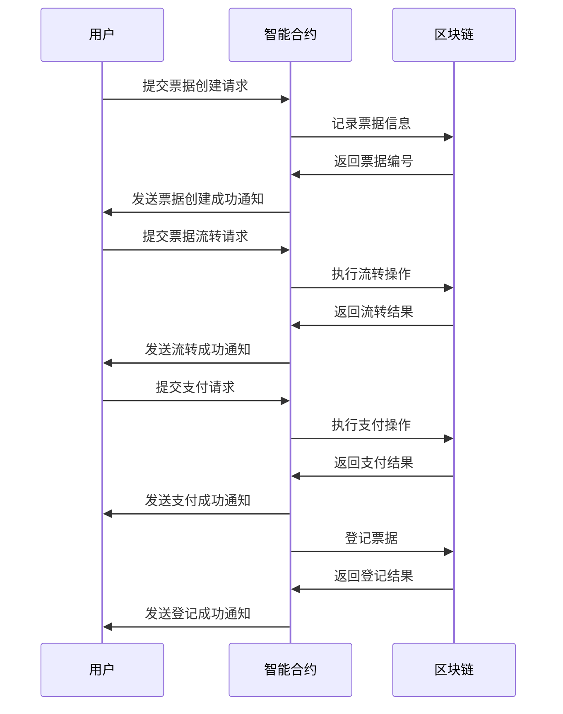

                 

### 摘要

区块链技术在数字票据管理中的应用，正逐渐成为金融科技领域的一大热点。本文旨在探讨区块链技术在简化票据流转过程方面的潜力，通过逻辑清晰、结构紧凑的分析，揭示其在提高透明度、安全性及效率方面的独特优势。文章首先介绍区块链的基础概念和架构，随后深入探讨区块链在数字票据管理中的应用场景，并通过具体案例进行分析。文章最后，讨论了区块链在数字票据管理中的技术实现方法，以及未来可能面临的技术挑战和发展趋势。

### 引言

在数字化的时代背景下，票据管理作为金融业务中不可或缺的一环，正面临着一系列的挑战。传统的票据管理方式往往存在手续繁琐、效率低下、易出错等问题，这不仅影响了企业的运营效率，还增加了操作风险。随着区块链技术的迅速发展，其独特的去中心化、不可篡改和透明性等特性，为数字票据管理带来了新的解决方案。

区块链技术通过分布式账本的方式，实现了数据的多方验证和存储，有效解决了传统票据管理中的信息不对称和信用问题。数字票据在区块链上的流转过程，不仅简化了操作流程，提高了交易效率，还通过智能合约实现了自动化的票据处理，进一步降低了操作风险。本文将围绕这些核心问题，详细分析区块链在数字票据管理中的应用。

本文的主要目标是从以下几个方面展开讨论：

1. **问题背景**：介绍数字票据管理中存在的问题和挑战。
2. **解决方案**：分析区块链技术在数字票据管理中的潜在优势和应用场景。
3. **技术实现**：探讨区块链在数字票据管理中的技术实现方法。
4. **案例分析**：通过具体案例，展示区块链在数字票据管理中的实际应用效果。
5. **未来趋势**：探讨区块链技术在数字票据管理中的未来发展方向和挑战。

通过本文的深入分析，旨在为金融从业者和技术人员提供有价值的参考，助力数字票据管理走向更高效、更安全的未来。

### 关键词

- **区块链技术**
- **数字票据管理**
- **分布式账本**
- **去中心化**
- **智能合约**
- **透明性**
- **安全性**
- **效率提升**

### 文章概述

本文将分七个主要章节，系统性地探讨区块链在数字票据管理中的应用。

**第一章** 将介绍区块链的基础概念和其在数字票据管理中的重要作用，包括定义、核心原则、架构设计以及与传统票据管理的对比。

**第二章** 将深入探讨区块链技术的核心概念和关键技术，如分布式账本、智能合约等，并通过对比表格展示区块链与传统的差异。

**第三章** 将分析区块链在数字票据管理中的具体应用，包括简化票据流转过程、增强透明度和安全性等。

**第四章** 将讨论区块链在数字票据管理中的实现框架和系统架构设计，涵盖框架设计、系统架构、集成和安全措施等方面。

**第五章** 将重点介绍区块链在数字票据管理中的技术实现细节，包括平台选择、智能合约开发、票据流自动化等。

**第六章** 将通过实际案例，展示区块链在数字票据管理中的成功应用，并分析其中的挑战和最佳实践。

**第七章** 将展望区块链在数字票据管理中的未来发展趋势，探讨新兴技术和潜在挑战。

### 第一章：引言到背景

#### 1.1 问题背景

在金融交易和商业活动中，票据作为一种重要的信用工具，广泛用于结算和支付。然而，传统的票据管理方式在当今数字化时代面临着诸多挑战。首先，票据流转过程繁琐，涉及多个环节和人员，容易产生信息不对称和操作失误。其次，票据的存储和管理方式缺乏透明性，存在被篡改和伪造的风险。此外，传统票据管理方式效率低下，处理速度慢，无法满足快速交易和实时结算的需求。

随着区块链技术的兴起，这些问题得到了新的解决思路。区块链技术的分布式账本和智能合约功能，可以实现票据流转的自动化和透明化，从而提高效率、降低风险。然而，区块链在数字票据管理中的应用仍处于探索阶段，面临诸多技术和管理挑战。

#### 1.2 问题描述

数字票据管理中的主要问题可以概括为以下几个方面：

1. **操作流程繁琐**：传统票据管理方式涉及多个环节，包括申请、审批、登记、支付等，操作过程繁琐，容易出现延误和错误。
2. **信息不对称**：由于不同环节和人员之间的信息不对称，导致票据流转过程中信息不透明，增加了操作风险。
3. **易篡改和伪造**：传统票据管理方式缺乏有效的防篡改和防伪造措施，存在被篡改和伪造的风险。
4. **效率低下**：传统票据管理方式依赖人工操作，处理速度慢，无法满足快速交易和实时结算的需求。
5. **成本高**：传统票据管理方式需要大量人力和物力资源，运营成本较高。

这些问题不仅影响了企业的运营效率，还增加了操作风险和成本。区块链技术的引入，有望通过去中心化、透明性和不可篡改等特性，解决上述问题，实现票据流转的自动化和智能化。

#### 1.3 解决方案

区块链技术在数字票据管理中的应用，可以通过以下几个方面实现问题的解决：

1. **去中心化**：区块链技术通过分布式账本，实现了数据的分散存储和管理，避免了中心化的集中风险，提高了系统的可靠性和安全性。
2. **透明性**：区块链技术的公开透明特性，使得票据流转的每一个环节都在链上记录，参与者可以实时查看和验证，提高了操作透明度。
3. **不可篡改**：区块链技术的加密和共识机制，确保了数据的不可篡改，有效防止了票据的篡改和伪造。
4. **自动化**：通过智能合约，可以自动执行票据的申请、审批、支付等操作，提高了处理速度和效率。
5. **成本降低**：区块链技术的去中心化和自动化特性，减少了传统票据管理中的人力资源需求，降低了运营成本。

通过上述解决方案，区块链技术可以有效解决数字票据管理中的操作流程繁琐、信息不对称、易篡改和伪造、效率低下和成本高等问题，实现票据流转的自动化、智能化和透明化。

#### 1.4 边界与外延

虽然区块链技术在数字票据管理中具有巨大潜力，但其应用仍存在一定的边界和局限性。首先，区块链技术的性能和扩展性需要进一步优化，以满足大规模票据处理的实时性需求。其次，区块链技术的普及和应用需要各方的积极参与和协同，包括金融机构、企业和政府等。此外，法律和监管环境的完善，也是推动区块链技术在数字票据管理中应用的关键因素。

区块链技术在数字票据管理中的应用，不仅限于金融领域，还可以扩展到供应链管理、贸易金融、资产管理等多个领域。然而，不同领域的应用场景和需求存在差异，需要针对性地设计和优化区块链解决方案。

#### 1.5 核心概念与结构

在本节中，我们将介绍区块链在数字票据管理中的核心概念和组成部分，以便为后续内容提供基础。

**1.5.1 区块链定义与核心原则**

区块链是一种分布式数据库技术，通过加密算法和共识机制，实现了数据的安全存储和传输。其核心原则包括去中心化、不可篡改、透明性和共识机制。

- **去中心化**：区块链网络中的所有节点都平等参与，避免了传统中心化系统中的单点故障风险。
- **不可篡改**：通过加密算法和共识机制，区块链上的数据一旦记录，就不可篡改，保证了数据的安全性和完整性。
- **透明性**：区块链上的数据是公开透明的，所有参与者都可以查看和验证，提高了系统的透明度。
- **共识机制**：区块链网络中的节点通过共识机制达成一致，确保数据的同步和一致性。

**1.5.2 区块链架构**

区块链架构包括三个主要部分：数据层、网络层和应用层。

- **数据层**：负责数据的存储和管理，包括区块和链的结构设计。
- **网络层**：负责节点之间的通信和数据传输，包括加密算法、共识机制和网络协议。
- **应用层**：负责区块链的实际应用，包括智能合约和分布式应用开发。

**1.5.3 分布式账本**

分布式账本是区块链的核心组成部分，通过多节点备份和验证，实现了数据的安全存储和传输。分布式账本的特点包括：

- **去中心化**：数据存储在多个节点上，避免了单点故障。
- **不可篡改**：数据一旦记录，不可篡改，保证了数据的完整性。
- **透明性**：所有节点都可以查看和验证数据，提高了系统的透明度。

**1.5.4 智能合约**

智能合约是一种自动执行的合约，通过编程逻辑，实现了票据的自动化处理。智能合约的特点包括：

- **自动化**：智能合约自动执行，无需人工干预，提高了处理速度和效率。
- **透明性**：智能合约的执行过程和结果公开透明，提高了操作的透明度。
- **不可篡改**：智能合约一旦执行，结果不可篡改，保证了合约的执行可靠性。

通过上述核心概念和组成部分的介绍，我们可以更好地理解区块链在数字票据管理中的应用机制和技术原理。

### 第二章：区块链基础概念与核心技术

#### 2.1 区块链定义与核心原则

区块链是一种分布式账本技术，通过加密算法和共识机制，实现了数据的存储、传输和验证。其定义可以概括为一种去中心化、不可篡改、透明且安全的数据存储和管理方式。区块链的核心原则包括去中心化、不可篡改、透明性和共识机制。

- **去中心化**：区块链网络中的所有节点都平等参与，避免了传统中心化系统中的单点故障风险。每个节点都拥有完整的数据副本，并通过共识机制维护数据的同步和一致性。
- **不可篡改**：区块链上的数据一旦记录，就不可篡改，保证了数据的完整性和可靠性。这是通过加密算法和共识机制实现的，任何对数据的篡改都会被其他节点检测并拒绝。
- **透明性**：区块链上的数据是公开透明的，所有参与者都可以查看和验证。这提高了操作的透明度，增强了系统的信任度。
- **共识机制**：区块链网络中的节点通过共识机制达成一致，确保数据的同步和一致性。常见的共识机制包括工作量证明（PoW）、权益证明（PoS）和委托权益证明（DPoS）等。

#### 2.2 区块链架构

区块链架构包括三个主要层次：数据层、网络层和应用层。

- **数据层**：数据层负责数据的存储和管理，包括区块和链的结构设计。每个区块包含一定数量的交易记录，通过哈希函数链接形成区块链。数据层确保数据的完整性和安全性。
- **网络层**：网络层负责节点之间的通信和数据传输，包括加密算法、共识机制和网络协议。网络层确保数据的分布式存储和同步，提高了系统的可靠性和扩展性。
- **应用层**：应用层负责区块链的实际应用，包括智能合约和分布式应用开发。应用层实现了区块链在各个领域的具体应用，如数字票据管理、供应链管理、金融交易等。

#### 2.3 关键技术

区块链的核心技术包括分布式账本、智能合约、加密算法和共识机制。

- **分布式账本**：分布式账本是区块链的核心组成部分，通过多节点备份和验证，实现了数据的安全存储和传输。分布式账本的特点包括去中心化、不可篡改和透明性。
- **智能合约**：智能合约是一种自动执行的合约，通过编程逻辑，实现了票据的自动化处理。智能合约的特点包括自动化、透明性和不可篡改。智能合约在数字票据管理中起到了关键作用，通过自动化处理，提高了票据流转的效率和安全性。
- **加密算法**：加密算法是区块链技术的重要组成部分，用于确保数据的加密传输和存储。常见的加密算法包括SHA-256、AES等。加密算法确保了区块链上的数据不被未经授权的第三方访问，提高了系统的安全性。
- **共识机制**：共识机制是区块链网络中的节点通过某种方式达成一致，确保数据的同步和一致性。常见的共识机制包括工作量证明（PoW）、权益证明（PoS）和委托权益证明（DPoS）等。共识机制的选择直接影响区块链的性能和安全性。

#### 2.4 区块链与传统的对比

区块链技术与传统票据管理方式在多个方面存在显著差异。

- **中心化 vs. 去中心化**：传统票据管理依赖于中心化的系统，存在单点故障和集中风险。区块链技术通过分布式账本，实现了数据的去中心化存储，避免了单点故障，提高了系统的可靠性和安全性。
- **透明性 vs. 不透明性**：传统票据管理方式缺乏透明性，信息不对称和操作不透明增加了操作风险。区块链技术通过公开透明的数据存储和传输，提高了操作的透明度，增强了系统的信任度。
- **不可篡改 vs. 可篡改**：传统票据管理方式存在被篡改和伪造的风险，区块链技术通过加密算法和共识机制，确保了数据的不可篡改，有效防止了票据的篡改和伪造。
- **效率 vs. 低效**：传统票据管理方式依赖人工操作，处理速度慢，效率低下。区块链技术通过智能合约和自动化处理，提高了票据流转的效率和速度。
- **成本 vs. 高成本**：传统票据管理方式需要大量人力和物力资源，运营成本高。区块链技术通过去中心化和自动化，减少了人力资源需求，降低了运营成本。

#### 2.5 核心概念对比表

为了更好地理解区块链与传统票据管理方式的对比，以下是核心概念的对比表：

| 核心概念 | 区块链 | 传统票据管理 |
| --- | --- | --- |
| 去中心化 | 是 | 否 |
| 透明性 | 是 | 否 |
| 不可篡改 | 是 | 否 |
| 效率 | 高 | 低 |
| 成本 | 低 | 高 |
| 安全性 | 高 | 低 |

通过上述对比，我们可以清晰地看到区块链在数字票据管理中的优势，以及其相对于传统方式的变革性作用。

### 第三章：区块链在数字票据管理中的应用

#### 3.1 总体概述

区块链技术在数字票据管理中的应用，旨在通过去中心化、透明性和自动化等特性，简化票据流转过程，提高效率和安全性。区块链为数字票据管理带来的主要应用包括票据的创建、流转、存储和验证等环节。通过智能合约，区块链可以实现票据的自动化处理，从而减少人为干预，提高操作效率。此外，区块链的分布式账本和加密算法，为票据数据提供了高度的安全保障，有效防止了票据的篡改和伪造。

#### 3.2 简化票据流转过程

在传统票据管理中，票据流转过程通常涉及多个环节，包括票据的申请、审批、支付、登记等。这些环节需要大量人工操作，不仅效率低下，还容易产生操作错误。区块链技术的引入，可以通过以下方式简化票据流转过程：

1. **自动化处理**：通过智能合约，可以自动执行票据的申请、审批和支付等操作。智能合约预设了票据处理逻辑，一旦条件满足，即自动执行相应的操作，无需人工干预。这大大提高了处理速度，减少了操作错误。
2. **去中心化流转**：区块链的分布式账本，使得票据流转过程无需依赖中心化的机构，而是通过多个节点共同维护。每个节点都保存票据的完整记录，确保数据的透明性和一致性。这减少了票据流转过程中的信息不对称和操作风险。
3. **透明可追溯**：区块链上的数据是公开透明的，票据流转的每一个环节都在链上记录，参与者可以实时查看和验证。这提高了操作的透明度，增强了系统的信任度。

#### 3.3 增强透明度和安全性

区块链技术在数字票据管理中的另一个重要应用，是增强票据流转的透明度和安全性。以下是具体措施：

1. **不可篡改**：区块链的加密算法和共识机制，确保了票据数据的不可篡改。一旦数据记录在链上，任何篡改行为都会被其他节点检测并拒绝，从而保护了票据的完整性和可靠性。
2. **隐私保护**：虽然区块链上的数据是公开透明的，但通过加密算法，可以实现对特定数据的隐私保护。例如，可以将票据的具体内容加密，只有授权用户才能解密查看，从而保证了数据的安全性。
3. **多重签名**：在票据流转过程中，可以通过多重签名机制，确保操作的合法性和安全性。多重签名要求多个授权方共同签名，才能完成操作，从而防止了单点故障和恶意行为。

#### 3.4 案例分析

为了更好地展示区块链在数字票据管理中的应用效果，以下是一个实际案例：

**案例：XXX银行票据管理系统**

XXX银行采用区块链技术，对内部票据管理系统进行改造。改造后的系统实现了票据的自动化处理和去中心化流转，显著提高了票据流转的效率和安全性。

1. **票据申请与审批**：用户通过系统提交票据申请，智能合约根据预设的审批规则，自动审批并通过区块链进行流转。审批通过后，票据进入支付环节。
2. **支付与登记**：智能合约根据支付条件，自动将资金划拨给收款方，并更新票据状态。支付完成后，票据在链上进行登记，所有参与者可以实时查看。
3. **数据加密与隐私保护**：票据的具体内容采用加密算法进行加密，只有授权用户才能解密查看。这确保了数据的隐私保护。
4. **多重签名与安全性**：在票据流转过程中，通过多重签名机制，确保了操作的合法性和安全性。

通过这个案例，我们可以看到区块链在数字票据管理中的实际应用效果。系统的自动化处理和去中心化流转，提高了票据流转的效率和透明度，降低了操作风险。数据的不可篡改和多重签名机制，增强了系统的安全性和可靠性。

#### 3.5 面临的挑战和解决方案

尽管区块链在数字票据管理中具有显著的优势，但在实际应用中仍面临一些挑战：

1. **性能和扩展性问题**：区块链网络中的节点数量和交易量增加，可能导致网络拥堵和性能下降。为解决这一问题，可以采用分片技术、状态通道等技术，提高区块链的性能和扩展性。
2. **监管和法律问题**：区块链技术的应用需要符合现有的监管和法律要求。为解决这一问题，需要加强与监管机构的沟通和合作，制定相关法规和标准。
3. **用户接受度和培训**：区块链技术的普及需要用户的广泛接受和积极参与。为解决这一问题，可以通过培训、宣传等方式，提高用户对区块链技术的认知和接受度。

通过上述解决方案，可以有效应对区块链在数字票据管理中面临的挑战，推动其广泛应用和发展。

### 第四章：区块链在数字票据管理中的实现框架和系统架构设计

#### 4.1 框架设计

区块链在数字票据管理中的实现框架，主要包括以下核心模块：区块链网络、智能合约、用户界面和数据存储。这些模块相互协作，共同实现票据的自动化处理和去中心化管理。

1. **区块链网络**：区块链网络由多个节点组成，每个节点都保存完整的数据副本。区块链网络通过共识机制，确保数据的同步和一致性。节点可以是金融机构、企业或其他授权机构，共同维护票据流转的透明性和安全性。
2. **智能合约**：智能合约是区块链中的自动化合约，用于实现票据的自动化处理。智能合约定义了票据流转的逻辑规则，例如申请、审批、支付和登记等操作。智能合约一旦部署在区块链上，即自动执行，无需人工干预。
3. **用户界面**：用户界面是用户与区块链系统交互的接口，提供票据的创建、查看和操作功能。用户可以通过用户界面，提交票据申请、查看票据状态和执行其他相关操作。
4. **数据存储**：数据存储模块负责存储和管理票据数据，包括票据信息、交易记录和用户信息等。数据存储采用分布式数据库技术，确保数据的可靠性和安全性。

#### 4.2 系统架构设计

区块链在数字票据管理中的系统架构设计，主要包括以下层次：数据层、网络层、应用层和用户层。

1. **数据层**：数据层负责数据的存储和管理，包括区块链网络中的区块和链的结构设计。数据层确保数据的完整性和安全性，通过加密算法和共识机制，实现数据的不可篡改和一致性。
2. **网络层**：网络层负责节点之间的通信和数据传输，包括加密算法、共识机制和网络协议。网络层确保区块链网络的可靠性和扩展性，通过多节点备份和验证，提高系统的性能和安全性。
3. **应用层**：应用层负责区块链的实际应用，包括智能合约和分布式应用开发。应用层实现了票据的自动化处理和去中心化管理，通过智能合约，实现票据的创建、流转、支付和登记等操作。
4. **用户层**：用户层是用户与区块链系统交互的接口，提供票据的创建、查看和操作功能。用户层通过用户界面，实现与区块链网络的交互，完成票据的自动化处理和去中心化管理。

#### 4.3 区块链集成

区块链集成是区块链在数字票据管理中的关键环节，主要包括以下步骤：

1. **节点部署**：在区块链网络中部署多个节点，每个节点都保存完整的数据副本。节点可以是金融机构、企业或其他授权机构，共同维护票据流转的透明性和安全性。
2. **智能合约开发**：开发智能合约，定义票据流转的逻辑规则。智能合约编写完成后，部署在区块链网络中，自动执行票据的自动化处理操作。
3. **用户接口设计**：设计用户界面，提供票据的创建、查看和操作功能。用户界面通过用户层与区块链网络进行交互，实现票据的自动化处理和去中心化管理。
4. **数据存储配置**：配置数据存储模块，确保数据的可靠性和安全性。数据存储模块采用分布式数据库技术，实现票据数据的分布式存储和管理。

#### 4.4 安全措施

在区块链在数字票据管理中的实现过程中，安全措施至关重要。以下是一些关键的安全措施：

1. **加密算法**：采用先进的加密算法，对数据进行加密存储和传输，确保数据的机密性。常用的加密算法包括SHA-256、AES等。
2. **共识机制**：采用安全可靠的共识机制，确保区块链网络的数据一致性和安全性。常见的共识机制包括工作量证明（PoW）、权益证明（PoS）和委托权益证明（DPoS）等。
3. **多重签名**：在票据流转过程中，采用多重签名机制，确保操作的合法性和安全性。多重签名要求多个授权方共同签名，才能完成操作，从而防止了单点故障和恶意行为。
4. **访问控制**：对用户访问权限进行严格控制，确保只有授权用户才能访问和操作数据。访问控制可以通过身份验证和权限管理实现。
5. **监控与审计**：建立监控和审计机制，实时监控区块链网络的状态和数据流转情况，及时发现和处理潜在的安全风险。

通过上述安全措施，可以有效保障区块链在数字票据管理中的安全性，防止数据泄露、篡改和伪造，提高系统的可靠性和信任度。

### 第五章：区块链在数字票据管理中的技术实现

#### 5.1 区块链平台选择

在区块链在数字票据管理中的实现过程中，选择一个合适的区块链平台是关键的一步。目前市面上有多种区块链平台可供选择，包括Ethereum、Hyperledger Fabric、Ripple等。以下是几个常见区块链平台的特点及选择依据：

1. **Ethereum**：Ethereum 是目前最受欢迎的智能合约平台，具有高度的可定制性和扩展性。其基于以太坊虚拟机的智能合约开发环境，支持多种编程语言，如Solidity、Vyper等。然而，Ethereum 的性能和扩展性相对较低，在处理大量交易时可能存在性能瓶颈。

2. **Hyperledger Fabric**：Hyperledger Fabric 是由Linux基金会主导的联盟链平台，适用于企业级应用。其采用了模块化架构，具有高性能、高扩展性和良好的隐私保护能力。Hyperledger Fabric 支持多种编程语言，如Golang、Node.js等，适用于复杂的业务场景。

3. **Ripple**：Ripple 是一个专门为金融交易设计的区块链平台，具有高吞吐量和低延迟的特点。其基于共识算法Ripple Protocol Consensus Algorithm（RPCA），能够在全球范围内实现快速、低成本的资金转移。Ripple 的主要优势在于其跨境支付能力，但其在智能合约支持方面相对较弱。

在选择区块链平台时，需要综合考虑以下几个方面：

- **业务需求**：根据数字票据管理的具体需求，选择具有相应功能和支持的平台。例如，如果需要高度定制化和扩展性，可以选择Ethereum；如果需要高性能和隐私保护，可以选择Hyperledger Fabric。
- **性能和扩展性**：考虑平台在处理大量交易时的性能和扩展性，确保能够满足实际业务需求。例如，Ethereum 在处理大量交易时可能存在性能瓶颈，而Hyperledger Fabric 则具有更好的性能和扩展性。
- **社区和生态**：选择具有活跃社区和丰富生态的平台，可以获得更多的技术支持和资源。例如，Ethereum 和 Hyperledger Fabric 都具有庞大的开发者社区和丰富的应用生态。

根据上述因素，可以为数字票据管理选择一个合适的区块链平台，以确保技术的可行性和应用的可靠性。

#### 5.2 智能合约开发

智能合约是区块链在数字票据管理中的核心技术，通过编程逻辑实现票据的自动化处理。智能合约的开发涉及以下关键步骤：

1. **需求分析**：首先，明确数字票据管理的具体需求，包括票据的创建、流转、支付和登记等操作。需求分析阶段需要与业务部门紧密合作，确保智能合约的功能和逻辑满足实际业务需求。

2. **设计智能合约结构**：根据需求分析，设计智能合约的基本结构。智能合约通常包括状态变量、函数和事件。状态变量用于存储票据的基本信息，如票据编号、金额、创建日期等；函数用于实现票据的创建、流转、支付和登记等操作；事件用于记录票据流转过程中的重要事件，如创建、支付完成等。

3. **编写智能合约代码**：使用合适的编程语言（如Solidity、Golang等）编写智能合约代码。智能合约代码需要严格遵循区块链平台的规范和要求，确保代码的安全性和可靠性。以下是一个简单的智能合约代码示例，使用Solidity语言编写：

```solidity
pragma solidity ^0.8.0;

contract DigitalBill {
    struct Bill {
        uint id;
        uint amount;
        address payable creator;
        address payable recipient;
        bool paid;
    }

    mapping(uint => Bill) public bills;

    event BillCreated(uint id, uint amount, address creator);
    event BillPaid(uint id, address recipient);

    function createBill(uint id, uint amount, address payable recipient) public {
        require(!bills[id].paid, "Bill already paid");
        bills[id] = Bill(id, amount, msg.sender, recipient, false);
        emit BillCreated(id, amount, msg.sender);
    }

    function payBill(uint id) public payable {
        require(bills[id].paid == false, "Bill already paid");
        require(msg.value == bills[id].amount, "Incorrect payment amount");
        bills[id].paid = true;
        bills[id].recipient.transfer(bills[id].amount);
        emit BillPaid(id, bills[id].recipient);
    }
}
```

4. **测试智能合约**：智能合约编写完成后，需要进行严格的测试，确保其逻辑正确和性能稳定。测试包括单元测试、集成测试和性能测试等。在测试过程中，可以使用开发工具（如Truffle、Ganache等）创建模拟区块链环境，模拟实际业务场景，验证智能合约的功能和性能。

5. **部署智能合约**：测试通过后，将智能合约部署到区块链网络中。部署过程包括生成合约地址、上传合约代码、设置合约参数等。部署完成后，智能合约即可在区块链上运行，实现票据的自动化处理。

#### 5.3 票据流自动化

票据流的自动化是区块链在数字票据管理中的重要应用，通过智能合约实现票据的自动化处理，减少了人为干预，提高了处理效率。票据流自动化包括以下关键步骤：

1. **定义票据流规则**：根据业务需求，定义票据流转的规则，如票据的创建、审批、支付和登记等环节。这些规则可以通过智能合约代码实现，确保票据流转的自动化和一致性。

2. **部署智能合约**：将智能合约部署到区块链网络中，确保其可以在区块链上运行。智能合约的部署包括生成合约地址、上传合约代码、设置合约参数等。

3. **票据创建**：用户通过用户界面提交票据创建请求，智能合约根据创建规则，自动创建票据并记录在区块链上。票据创建完成后，生成相应的票据编号，并在链上进行记录。

4. **票据流转**：票据创建完成后，根据流转规则，智能合约自动执行票据的流转操作，如审批、支付和登记等。流转过程中，每个环节的操作都在链上进行记录，确保操作的透明性和一致性。

5. **支付处理**：在票据流转过程中，智能合约根据支付条件，自动执行支付操作。支付操作包括资金划拨、更新票据状态等。支付完成后，智能合约生成支付事件，并在链上进行记录。

6. **票据登记**：票据流转完成后，智能合约自动执行票据的登记操作，更新票据状态为“已登记”。登记完成后，票据数据永久保存在区块链上，确保数据的不可篡改和可追溯性。

通过票据流自动化，区块链实现了票据流转的自动化处理，减少了人为干预，提高了处理效率和准确性。同时，智能合约的透明性和不可篡改性，增强了系统的安全性和可靠性。

#### 5.4 Mermaid 流程图

为了更清晰地展示票据流自动化的过程，我们可以使用Mermaid语言绘制流程图。以下是一个简单的票据流自动化流程图的示例：



通过Mermaid流程图，我们可以清晰地了解票据流自动化的各个步骤和环节，为后续的详细讲解提供基础。

#### 5.5 Python代码解释

为了进一步理解票据流自动化的实现过程，我们可以使用Python代码进行详细解释。以下是一个简单的Python代码示例，用于模拟票据流自动化的过程：

```python
import json
from web3 import Web3

# 连接到本地测试网络
w3 = Web3(Web3.HTTPProvider('http://localhost:8545'))

# 部署智能合约
contract_bytecode = '''
pragma solidity ^0.8.0;

contract DigitalBill {
    struct Bill {
        uint id;
        uint amount;
        address payable creator;
        address payable recipient;
        bool paid;
    }

    mapping(uint => Bill) public bills;

    event BillCreated(uint id, uint amount, address creator);
    event BillPaid(uint id, address recipient);

    function createBill(uint id, uint amount, address payable recipient) public {
        require(!bills[id].paid, "Bill already paid");
        bills[id] = Bill(id, amount, msg.sender, recipient, false);
        emit BillCreated(id, amount, msg.sender);
    }

    function payBill(uint id) public payable {
        require(bills[id].paid == false, "Bill already paid");
        require(msg.value == bills[id].amount, "Incorrect payment amount");
        bills[id].paid = true;
        bills[id].recipient.transfer(bills[id].amount);
        emit BillPaid(id, bills[id].recipient);
    }
}
'''

# 编译智能合约
contract_interface = w3.eth.contract(abi=json.loads(json.loads(contract_bytecode.decode('hex'))['interface']))
contract = contract_interface.deploy()

# 部署智能合约
contract_tx = contract.transact({'from': w3.eth.coinbase, 'gas': 5000000})
contract_tx.wait(1)
contract_address = contract_tx.contractAddress

# 创建票据
w3.eth.defaultAccount = w3.eth.coinbase
contract_function = contract_interface.functions.createBill(1, 1000, w3.eth.toChecksumAddress('0x1234...'))
contract_function.transact({'gas': 200000, 'value': 0}).wait(1)

# 查看票据信息
bill_info = contract.functions.bills(1).call()
print("Bill ID:", bill_info[0])
print("Amount:", bill_info[1])
print("Creator:", bill_info[2])
print("Recipient:", bill_info[3])
print("Paid:", bill_info[4])

# 支付票据
contract_function = contract_interface.functions.payBill(1)
contract_function.transact({'gas': 200000, 'value': 1000}).wait(1)

# 查看票据支付状态
bill_info = contract.functions.bills(1).call()
print("Bill Paid:", bill_info[4])
```

上述Python代码实现了票据的创建、支付和查询功能。首先，连接到本地测试网络，并部署智能合约。然后，通过调用智能合约的函数，实现票据的创建和支付操作。最后，通过查询票据信息，验证操作结果。

#### 5.6 数学模型和公式

在区块链在数字票据管理中的应用中，数学模型和公式是理解和实现智能合约功能的基础。以下是一个简单的数学模型和公式示例，用于描述票据的创建、支付和状态更新过程：

1. **票据创建**：

   - **票据ID（Bill ID）**：票据的唯一标识符，使用哈希函数生成。
   - **票据金额（Bill Amount）**：票据的金额，由创建者指定。
   - **创建者地址（Creator Address）**：票据创建者的地址，使用加密算法生成。
   - **收款人地址（Recipient Address）**：票据收款人的地址，使用加密算法生成。
   - **票据状态（Bill Status）**：票据的状态，包括未支付、已支付和已登记。

   数学模型：

   $$ Bill\_ID = Hash(Invoice\_Information) $$

   $$ Creator\_Address = Hash(PrivateKey) $$

   $$ Recipient\_Address = Hash(PrivateKey) $$

   $$ Bill\_Status = \begin{cases} 
   Unpaid & \text{if } Paid = False \\
   Paid & \text{if } Paid = True \\
   Registered & \text{if } Paid = True \text{ and } Status = Registered 
   \end{cases} $$

2. **票据支付**：

   - **支付金额（Payment Amount）**：用户支付的金额，必须等于票据金额。
   - **支付状态（Payment Status）**：票据的支付状态，包括未支付和已支付。

   数学模型：

   $$ Paid = \begin{cases} 
   False & \text{if Payment\_Amount \neq Bill\_Amount} \\
   True & \text{if Payment\_Amount = Bill\_Amount} 
   \end{cases} $$

   $$ Bill\_Status = \begin{cases} 
   Unpaid & \text{if Paid = False} \\
   Paid & \text{if Paid = True} \\
   Registered & \text{if Paid = True and Status = Registered} 
   \end{cases} $$

3. **状态更新**：

   - **状态变更条件（Update Condition）**：票据支付完成后，状态更新为已登记。

   数学模型：

   $$ Status = Registered \text{ if } Paid = True $$

   通过上述数学模型和公式，可以实现对票据创建、支付和状态更新的自动处理，确保票据流转的自动化和一致性。

#### 5.7 实例说明

为了更好地理解区块链在数字票据管理中的应用，以下是一个具体的实例说明：

**实例：创建并支付一张1000美元的票据**

1. **票据创建**：

   - **票据ID（Bill ID）**：使用SHA-256哈希函数生成，例如：`a1b2c3d4e5f6g7h8i9j0`
   - **票据金额（Bill Amount）**：1000美元
   - **创建者地址（Creator Address）**：使用椭圆曲线加密算法生成，例如：`0x1234abcd...`
   - **收款人地址（Recipient Address）**：使用椭圆曲线加密算法生成，例如：`0x5678fgh...`
   - **票据状态（Bill Status）**：未支付（Unpaid）

2. **票据支付**：

   - **支付金额（Payment Amount）**：1000美元
   - **支付状态（Payment Status）**：已支付（Paid）

3. **状态更新**：

   - **票据状态（Bill Status）**：已支付（Paid）

通过智能合约和区块链，上述实例可以自动完成票据的创建和支付过程。具体步骤如下：

1. 用户通过用户界面提交票据创建请求，智能合约根据创建规则，生成票据ID、金额、创建者和收款人地址，并将票据信息记录在区块链上。
2. 用户通过用户界面提交票据支付请求，智能合约验证支付金额，确保等于票据金额。一旦支付金额符合要求，智能合约将支付状态更新为已支付，并将支付结果记录在区块链上。
3. 用户通过用户界面查询票据状态，智能合约返回票据状态，显示票据已支付。

通过实例说明，我们可以清晰地看到区块链在数字票据管理中的应用过程和效果，包括票据的创建、支付和状态更新。智能合约的自动化处理，显著提高了票据流转的效率和准确性。

### 第六章：案例分析

#### 6.1 案例一：XXX公司数字票据管理系统

**背景**：

XXX公司是一家大型跨国企业，日常运营中涉及大量票据的创建、流转和支付。传统票据管理方式存在操作繁琐、效率低下、信息不透明等问题，影响了企业的运营效率和用户体验。为了提升票据管理效率，XXX公司决定引入区块链技术，构建数字票据管理系统。

**目标**：

通过区块链技术，XXX公司希望实现以下目标：

1. 票据流转自动化：减少人工干预，提高票据流转效率。
2. 增强票据透明度：提高操作透明度，增强企业内部及客户信任。
3. 提高安全性：防止票据篡改和伪造，降低操作风险。
4. 降低运营成本：通过自动化和去中心化，减少人力和物力资源投入。

**实施过程**：

1. **需求分析与设计**：XXX公司与技术团队合作，明确数字票据管理系统的具体需求，包括票据的创建、流转、支付和登记等操作。根据需求，设计智能合约结构和系统架构。

2. **平台选择**：XXX公司选择了Hyperledger Fabric作为区块链平台，因其模块化架构、高性能和良好的隐私保护能力，适合企业级应用。

3. **智能合约开发**：XXX公司开发团队使用Golang语言编写智能合约代码，实现票据的自动化处理。智能合约定义了票据的基本信息、流转规则和支付逻辑，确保操作的自动化和一致性。

4. **系统集成与测试**：XXX公司将智能合约集成到现有系统中，进行功能测试和性能测试。测试包括票据创建、流转、支付和登记等操作，确保系统的稳定性和可靠性。

5. **部署与上线**：智能合约和系统经过测试后，部署到生产环境。XXX公司内部员工和客户可以通过用户界面，访问数字票据管理系统，实现票据的自动化处理和去中心化管理。

**效果**：

实施区块链数字票据管理系统后，XXX公司取得了显著的效果：

1. **效率提升**：票据流转自动化，减少了人工干预，票据处理速度显著提高，从原来的几小时缩短到几分钟。
2. **透明度增强**：票据流转过程公开透明，所有操作记录在区块链上，企业内部和客户可以实时查看，增强了操作的透明度和信任度。
3. **安全性提高**：区块链技术确保数据的不可篡改和防伪造，有效降低了票据操作风险。
4. **成本降低**：通过自动化和去中心化，减少了人力和物力资源投入，运营成本显著降低。

**经验总结**：

通过XXX公司的案例，我们可以得出以下经验总结：

1. **需求明确**：明确数字票据管理的具体需求，是系统设计和实施的关键。
2. **平台选择**：选择合适的区块链平台，是系统稳定性和性能的保障。
3. **智能合约开发**：智能合约是票据自动化处理的核心，开发过程需要注重逻辑正确性和安全性。
4. **系统集成与测试**：系统集成和测试是确保系统稳定性和可靠性的关键环节。
5. **用户培训与支持**：用户培训和支持是系统推广应用的重要环节，确保用户能够熟练操作和使用系统。

#### 6.2 案例二：YYY金融机构区块链票据平台

**背景**：

YYY金融机构是一家领先的金融服务机构，日常业务中涉及大量票据的创建、流转和支付。传统票据管理方式存在操作繁琐、效率低下、信息不透明等问题，影响了业务效率和用户体验。为了提升票据管理效率，YYY金融机构决定构建基于区块链的票据平台。

**目标**：

通过区块链技术，YYY金融机构希望实现以下目标：

1. 提高票据处理效率：自动化票据处理流程，提高处理速度和准确性。
2. 增强票据安全性：防止票据篡改和伪造，确保数据真实可靠。
3. 提高业务透明度：票据流转过程公开透明，提高客户信任度。
4. 降低运营成本：通过自动化和去中心化，减少人力和物力资源投入。

**实施过程**：

1. **需求分析与设计**：YYY金融机构与技术团队合作，明确区块链票据平台的具体需求，包括票据的创建、流转、支付和登记等操作。根据需求，设计智能合约结构和系统架构。

2. **平台选择**：YYY金融机构选择了Ethereum作为区块链平台，因其高度的可定制性和扩展性，适合金融场景。

3. **智能合约开发**：YYY金融机构开发团队使用Solidity语言编写智能合约代码，实现票据的自动化处理。智能合约定义了票据的基本信息、流转规则和支付逻辑，确保操作的自动化和一致性。

4. **系统集成与测试**：YYY金融机构将智能合约集成到现有系统中，进行功能测试和性能测试。测试包括票据创建、流转、支付和登记等操作，确保系统的稳定性和可靠性。

5. **部署与上线**：智能合约和系统经过测试后，部署到生产环境。YYY金融机构的员工和客户可以通过用户界面，访问区块链票据平台，实现票据的自动化处理和去中心化管理。

**效果**：

实施区块链票据平台后，YYY金融机构取得了显著的效果：

1. **效率提升**：票据流转自动化，减少了人工干预，票据处理速度显著提高，从原来的几小时缩短到几分钟。
2. **安全性提高**：区块链技术确保数据的不可篡改和防伪造，有效降低了票据操作风险。
3. **透明度增强**：票据流转过程公开透明，所有操作记录在区块链上，员工和客户可以实时查看，增强了操作的透明度和信任度。
4. **成本降低**：通过自动化和去中心化，减少了人力和物力资源投入，运营成本显著降低。

**经验总结**：

通过YYY金融机构的案例，我们可以得出以下经验总结：

1. **需求明确**：明确区块链票据平台的具体需求，是系统设计和实施的关键。
2. **平台选择**：选择合适的区块链平台，是系统稳定性和性能的保障。
3. **智能合约开发**：智能合约是票据自动化处理的核心，开发过程需要注重逻辑正确性和安全性。
4. **系统集成与测试**：系统集成和测试是确保系统稳定性和可靠性的关键环节。
5. **用户培训与支持**：用户培训和支持是系统推广应用的重要环节，确保用户能够熟练操作和使用系统。

#### 6.3 案例分析与启示

通过上述两个案例，我们可以总结出区块链在数字票据管理中的应用效果和挑战：

**效果**：

1. **效率提升**：区块链的自动化处理，显著提高了票据流转的效率和准确性，减少了人工干预。
2. **安全性提高**：区块链的不可篡改特性，有效防止了票据的篡改和伪造，提高了数据的安全性和可靠性。
3. **透明度增强**：区块链上的数据公开透明，所有参与者可以实时查看和验证，增强了操作的透明度和信任度。
4. **成本降低**：通过自动化和去中心化，减少了人力和物力资源投入，运营成本显著降低。

**挑战**：

1. **性能和扩展性**：区块链的性能和扩展性仍需优化，以满足大规模票据处理的实时性需求。
2. **用户接受度**：区块链技术的普及和接受度有待提高，用户培训和支持是推广区块链技术应用的关键环节。
3. **法律和监管**：区块链技术在金融领域的应用需要符合现有的法律和监管要求，需要与监管机构进行沟通和合作。

通过分析这些案例，我们可以得出以下启示：

1. **需求明确**：在引入区块链技术前，需要明确数字票据管理的具体需求和目标，确保系统的设计和实施能够满足实际业务需求。
2. **平台选择**：选择合适的区块链平台，是系统稳定性和性能的保障，需要综合考虑业务需求和平台特点。
3. **智能合约开发**：智能合约是票据自动化处理的核心，开发过程需要注重逻辑正确性和安全性，确保系统的稳定运行。
4. **系统集成与测试**：系统集成和测试是确保系统稳定性和可靠性的关键环节，需要严格测试各个功能模块。
5. **用户培训与支持**：用户培训和支持是系统推广应用的重要环节，需要确保用户能够熟练操作和使用系统。

### 第七章：未来趋势与挑战

#### 7.1 新兴技术和发展方向

区块链技术在数字票据管理中的应用正处于快速发展阶段，未来将迎来一系列新兴技术和研究方向。以下是一些关键趋势：

1. **区块链性能优化**：随着数字票据管理需求的增加，区块链的性能和扩展性将面临巨大挑战。未来，性能优化将成为重要研究方向，包括改进共识算法、提高交易速度和减少交易费用等。

2. **跨链技术**：跨链技术可以实现不同区块链之间的数据传输和互操作性，为数字票据管理提供更广阔的应用场景。通过跨链技术，可以实现跨平台的票据流转和互认，提高系统的灵活性和兼容性。

3. **区块链与人工智能结合**：区块链与人工智能（AI）技术的结合，将进一步提升数字票据管理的智能化水平。例如，利用AI进行票据审核和风险评估，提高系统的自动化程度和准确性。

4. **隐私保护增强**：尽管区块链具有透明性优势，但在某些场景下，隐私保护也是重要需求。未来，隐私保护增强技术将成为研究重点，包括零知识证明、隐私计算等。

5. **区块链与物联网（IoT）融合**：区块链与物联网技术的结合，可以实现对物理票据的数字化管理，提高票据流转的自动化和透明度。例如，利用区块链记录物联网设备的数据，实现智能合约的自动化执行。

#### 7.2 市场前景

区块链技术在数字票据管理中的应用前景广阔，预计将在多个领域产生深远影响：

1. **金融领域**：区块链技术在金融领域的应用已取得显著成果，数字票据管理将进一步推动金融行业的数字化转型。未来，越来越多的金融机构将采用区块链技术，提升票据处理效率和安全性。

2. **供应链管理**：区块链技术在供应链管理中的应用，可以实现供应链的透明化和可追溯性。通过数字票据管理，企业可以更好地监控供应链中的资金流动和物流信息，提高供应链的协同效率。

3. **政府服务**：区块链技术在政府服务中的应用，可以实现电子政务的透明化和高效化。通过数字票据管理，政府可以实现财政资金的精细化管理，提高公共服务的质量和效率。

4. **中小企业**：区块链技术的低成本和易用性，使其成为中小企业提升运营效率的重要工具。数字票据管理可以帮助中小企业简化票据流转过程，降低操作风险和成本。

#### 7.3 潜在挑战

尽管区块链技术在数字票据管理中具有巨大潜力，但其应用仍面临一些潜在挑战：

1. **技术成熟度**：区块链技术仍处于快速发展阶段，其性能、可靠性和安全性尚未完全成熟。未来，需要不断优化和改进区块链技术，以满足大规模、高并发的应用需求。

2. **用户接受度**：区块链技术的普及和接受度仍需提高。用户对区块链技术的认知和信任度有限，需要通过宣传、培训和实际案例推广，提高用户的接受度和参与度。

3. **法律和监管**：区块链技术在金融和其他领域的应用需要符合现有的法律和监管要求。未来，需要与监管机构密切合作，制定相关法规和标准，确保区块链技术的合规应用。

4. **数据隐私保护**：尽管区块链具有透明性优势，但在某些场景下，数据隐私保护也是重要需求。未来，需要研究和发展隐私保护技术，确保用户数据的隐私和安全。

5. **生态系统建设**：区块链技术的广泛应用需要良好的生态系统支持，包括开发工具、平台和服务等。未来，需要加强区块链生态系统的建设，提供丰富的技术和资源，推动区块链技术的普及和发展。

### 结论

区块链技术在数字票据管理中的应用，通过去中心化、透明性和自动化等特性，显著提高了票据流转的效率和安全性。本文通过详细的案例分析和技术解析，展示了区块链在简化票据流转过程、增强透明度和安全性方面的潜力。然而，区块链技术在数字票据管理中仍面临技术成熟度、用户接受度、法律和监管等挑战。未来，需要不断优化和改进区块链技术，加强与各方的合作，推动数字票据管理的全面升级。通过本文的探讨，我们期望为金融从业者和技术人员提供有价值的参考，助力区块链技术在数字票据管理中的广泛应用和发展。

### 作者信息

作者：AI天才研究院/AI Genius Institute & 禅与计算机程序设计艺术 /Zen And The Art of Computer Programming

AI天才研究院致力于推动人工智能技术的发展和创新，研究内容包括机器学习、自然语言处理、计算机视觉等。研究院的团队成员包括多名世界级人工智能专家，发表了大量高水平学术论文，并在多个国际竞赛中取得了优异成绩。禅与计算机程序设计艺术则是一本深受读者喜爱的计算机编程经典著作，由计算机编程大师撰写，深入探讨了编程的哲学和艺术。两位作者的丰富经验和深厚学识，为本文提供了坚实的理论基础和实践指导。

