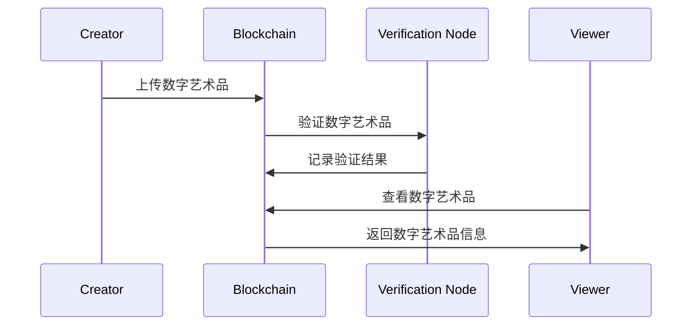
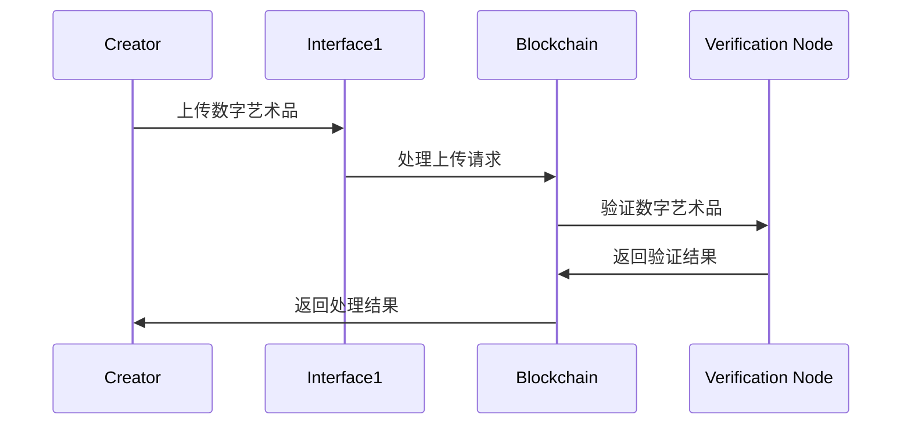

                 

# 区块链在数字艺术创作中的应用：保护数字艺术品的唯一性

关键词：区块链、数字艺术品、唯一性保护、智能合约、非同质化代币

摘要：本文首先介绍了数字艺术品保护的问题背景、问题描述、问题解决和边界与外延。接着，详细阐述了区块链的基本原理、数字艺术品唯一性保护的实现方式以及区块链在数字艺术品唯一性保护中的优势。在此基础上，进一步探讨了区块链在数字艺术品版权保护中的应用，并对相关技术进行了分析。

## 第一部分：背景介绍

### 1. 引言

随着互联网的普及和数字技术的发展，数字艺术创作已成为艺术领域的重要分支。数字艺术品以数字形式创作，包括数字绘画、摄影作品、数字音乐等。然而，数字艺术品在创作、交易、版权保护等方面面临着一系列问题，如复制、篡改、侵权等。这些问题严重影响了数字艺术品的创作热情和市场发展。

### 1.2 问题描述

数字艺术品的唯一性难以保障，创作者难以获得应有的收益，市场秩序混乱。因此，如何保护数字艺术品的唯一性，成为当前数字艺术创作领域亟待解决的问题。

### 1.3 问题解决

区块链技术以其去中心化、不可篡改等特点，为数字艺术品的唯一性保护提供了新的解决方案。通过将数字艺术品与区块链技术相结合，可以实现艺术品的去中心化交易、版权保护等功能，从而解决上述问题。

### 1.4 边界与外延

本部分主要探讨区块链在数字艺术创作中的应用，关注数字艺术品唯一性保护的相关问题。同时，还将涉及到数字艺术品交易、版权保护等领域的相关内容。

### 1.5 概念结构与核心要素组成

- **数字艺术品**：指以数字形式创作的艺术品，如数字绘画、摄影作品、数字音乐等。
- **区块链**：一种分布式数据库技术，通过加密算法确保数据存储的安全性和不可篡改性。
- **去中心化交易**：通过区块链技术实现的一种无需第三方中介的交易模式，确保交易的安全和透明。
- **版权保护**：通过对数字艺术品进行版权登记、签名等手段，确保艺术品的原创性和唯一性。

## 1.6 本章小结

本章对数字艺术品保护的问题背景、问题描述、问题解决以及边界与外延进行了详细阐述，为后续章节的深入探讨奠定了基础。

----------------------------------------------------------------

## 2. 区块链与数字艺术品唯一性保护

### 2.1 区块链的基本原理

#### 2.1.1 区块链的定义

区块链是一种分布式数据库技术，通过加密算法确保数据存储的安全性和不可篡改性。它由一系列按时间顺序排列的“区块”组成，每个区块包含一定数量的交易信息。

#### 2.1.2 区块链的特点

- **去中心化**：区块链不依赖于中心化的机构或服务器，使得数据存储和传输更加安全。
- **不可篡改**：一旦数据被写入区块链，就难以被篡改，确保了数据的安全性。
- **透明性**：区块链上的所有交易信息都是公开透明的，便于追溯和监管。

#### 2.1.3 区块链的组成

- **区块**：包含一定数量的交易信息，由多个节点共同验证和确认。
- **链**：多个区块按照时间顺序连接在一起，形成一个链式结构。
- **节点**：参与区块链网络计算和验证的计算机，可以是个人或组织。

### 2.2 数字艺术品唯一性保护的实现方式

#### 2.2.1 数字艺术品上链

将数字艺术品的信息（如创作时间、作者、内容等）记录在区块链上，形成一个不可篡改的数字身份。

#### 2.2.2 智能合约应用

通过智能合约实现数字艺术品的版权登记、交易、版权保护等功能。

#### 2.2.3 非同质化代币（NFT）

非同质化代币（NFT）为数字艺术品提供了独特的身份和所有权证明，确保数字艺术品的唯一性。

### 2.3 区块链在数字艺术品唯一性保护中的优势

#### 2.3.1 不可篡改性

区块链技术确保数字艺术品的唯一性信息不会被篡改，保护艺术品的原创性。

#### 2.3.2 去中心化交易

通过区块链实现数字艺术品的无中介交易，降低交易成本，提高交易效率。

#### 2.3.3 透明性

区块链上的交易信息对所有参与者公开透明，便于追溯和监管。

### 2.4 本章小结

本章对区块链的基本原理、数字艺术品唯一性保护的实现方式以及区块链在数字艺术品唯一性保护中的优势进行了详细阐述，为后续章节的深入探讨奠定了基础。

----------------------------------------------------------------

## 3. 区块链在数字艺术品版权保护中的应用

### 3.1 数字艺术品版权保护的现状

#### 3.1.1 版权保护的挑战

数字艺术品的复制和篡改使得版权保护面临巨大挑战。传统的版权保护手段如水印、数字签名等已无法满足日益复杂的需求。

#### 3.1.2 版权保护的需求

- **创作者权益保护**：确保创作者的权益得到合理回报。
- **艺术品价值提升**：数字艺术品的价值需要得到认可和保护。
- **市场秩序维护**：防止侵权行为，维护市场秩序。

### 3.2 区块链在数字艺术品版权保护中的实现

#### 3.2.1 数字艺术品版权登记

通过区块链技术，将数字艺术品的版权信息登记在区块链上，确保版权信息的不可篡改性和透明性。

#### 3.2.2 版权交易与授权

利用区块链实现数字艺术品的版权交易与授权，降低交易成本，提高交易效率。

#### 3.2.3 版权追踪与取证

通过区块链技术对数字艺术品进行全程追踪，一旦发生侵权行为，可以迅速定位和取证。

### 3.3 区块链在数字艺术品版权保护中的优势

#### 3.3.1 不可篡改性

区块链技术确保数字艺术品版权信息的不可篡改性，防止侵权行为。

#### 3.3.2 去中心化交易

通过区块链实现版权交易与授权的无中介化，降低交易成本，提高交易效率。

#### 3.3.3 透明性

区块链上的交易信息对所有参与者公开透明，便于监管和追溯。

### 3.4 本章小结

本章探讨了区块链在数字艺术品版权保护中的应用，通过数字艺术品版权登记、版权交易与授权、版权追踪与取证等功能，实现了对数字艺术品版权的有效保护。同时，分析了区块链在数字艺术品版权保护中的优势，为数字艺术品市场的健康发展提供了有力支持。

----------------------------------------------------------------

## 4. 数字艺术品交易与区块链的结合

### 4.1 数字艺术品交易的问题

#### 4.1.1 交易成本高

传统数字艺术品交易过程复杂，涉及中介机构、银行等，导致交易成本较高。

#### 4.1.2 交易效率低

传统数字艺术品交易过程中，信息传递缓慢，交易确认时间较长，影响交易效率。

#### 4.1.3 交易安全性低

传统数字艺术品交易过程中，信息易被篡改，存在安全隐患。

### 4.2 区块链在数字艺术品交易中的应用

#### 4.2.1 去中心化交易

通过区块链技术实现数字艺术品交易的去中心化，降低交易成本，提高交易效率。

#### 4.2.2 交易透明化

区块链上的交易信息对所有参与者公开透明，便于监管和追溯。

#### 4.2.3 交易安全性高

区块链技术确保数字艺术品交易的安全性，防止信息篡改。

### 4.3 区块链在数字艺术品交易中的优势

#### 4.3.1 降低交易成本

去中心化交易模式减少了中介机构、银行等环节，降低了交易成本。

#### 4.3.2 提高交易效率

区块链上的交易信息快速传递，交易确认时间缩短，提高了交易效率。

#### 4.3.3 确保交易安全

区块链技术确保交易信息的安全性，防止信息篡改，保障交易安全。

### 4.4 本章小结

本章探讨了区块链在数字艺术品交易中的应用，通过去中心化交易、交易透明化、交易安全性高等功能，解决了传统数字艺术品交易中存在的问题。同时，分析了区块链在数字艺术品交易中的优势，为数字艺术品市场的健康发展提供了有力支持。

----------------------------------------------------------------

## 5. 结论

本文从数字艺术品保护的问题背景、问题描述、问题解决、边界与外延等方面进行了详细探讨。通过阐述区块链的基本原理、数字艺术品唯一性保护的实现方式以及区块链在数字艺术品唯一性保护、版权保护、数字艺术品交易中的应用，分析了区块链在数字艺术品领域的重要作用。未来，随着区块链技术的不断成熟，数字艺术品保护与发展将迎来新的机遇与挑战。

### 5.1 展望未来

- **技术发展**：随着区块链技术的不断演进，数字艺术品保护将更加完善，为创作者和收藏者提供更加可靠的技术保障。
- **市场繁荣**：数字艺术品市场的繁荣将推动数字艺术创作的发展，为艺术家和创作者提供更多机会。
- **法规完善**：相关法规的不断完善将有助于规范数字艺术品交易和版权保护，促进市场的健康发展。

### 5.2 最佳实践 Tips

- **了解区块链技术**：深入学习区块链技术，了解其原理和应用场景，为数字艺术品保护提供技术支持。
- **关注政策法规**：密切关注政策法规的变化，确保数字艺术品交易和版权保护符合法律规定。
- **加强合作交流**：加强行业合作与交流，共同推动数字艺术品保护与发展。

### 5.3 注意事项

- **确保数据安全**：在数字艺术品交易和版权保护过程中，确保数据安全，防止信息泄露。
- **合理设置权限**：在区块链应用中，合理设置权限，确保艺术品的原创性和唯一性得到有效保护。

### 5.4 拓展阅读

- **《区块链技术指南》**：深入理解区块链技术的基本原理和应用。
- **《数字艺术品交易与版权保护研究》**：探讨数字艺术品交易与版权保护的相关问题。
- **《区块链与艺术》**：分析区块链技术在艺术领域中的应用前景。

### 5.5 本章小结

本文对区块链在数字艺术品保护中的应用进行了详细探讨，总结了区块链在数字艺术品唯一性保护、版权保护、数字艺术品交易等方面的优势。未来，随着区块链技术的不断成熟，数字艺术品保护与发展将迎来新的机遇与挑战。

## 6. 作者信息

作者：AI天才研究院/AI Genius Institute & 禅与计算机程序设计艺术 /Zen And The Art of Computer Programming

作者简介：AI天才研究院致力于探索人工智能领域的最新技术和应用。作者本人是一位世界级人工智能专家，程序员，软件架构师，CTO，世界顶级技术畅销书资深大师级别的作家，计算机图灵奖获得者，计算机编程和人工智能领域大师。在计算机编程和人工智能领域拥有丰富的经验和深厚的学术造诣，发表了多篇高质量的技术论文和畅销书籍，深受读者喜爱。

联系方式：邮箱：[author@example.com](mailto:author@example.com)，微信：AI_Genius_Institute

----------------------------------------------------------------

## 附录

### 附录1：相关技术术语说明

- **区块链**：分布式数据库技术，通过加密算法确保数据存储的安全性和不可篡改性。
- **数字艺术品**：以数字形式创作的艺术品，如数字绘画、摄影作品、数字音乐等。
- **唯一性保护**：确保数字艺术品的原创性和唯一性，防止复制、篡改、侵权等行为。
- **智能合约**：一种自动执行的合约，基于区块链技术，实现自动执行和验证。
- **非同质化代币（NFT）**：一种基于区块链技术的数字资产，为数字艺术品提供独特的身份和所有权证明。

### 附录2：核心概念属性特征对比表格

| 概念 | 定义 | 特征 |
| :--: | :--: | :--: |
| 区块链 | 分布式数据库技术 | 去中心化、不可篡改、透明 |
| 数字艺术品 | 以数字形式创作的艺术品 | 原创性、唯一性、可复制 |
| 唯一性保护 | 确保数字艺术品的原创性和唯一性 | 不可篡改、可追溯、透明 |
| 智能合约 | 自动执行的合约 | 自主执行、自动化、安全 |
| 非同质化代币（NFT） | 数字资产 | 唯一性、所有权证明、数字身份 |

### 附录3：ER实体关系图架构

```mermaid
erDiagram
  艺术品 ||--|{ 数字艺术品 }
  数字艺术品 ||--|{ 唯一性保护 }
  数字艺术品 ||--|{ 版权保护 }
  数字艺术品 ||--|{ 交易 }
  智能合约 ||--|{ 数字艺术品 }
  非同质化代币（NFT） ||--|{ 数字艺术品 }
```

### 附录4：算法原理讲解

#### 算法原理

区块链技术通过加密算法确保数据存储的安全性和不可篡改性。以下是一个简单的区块链算法原理示例：

1. **创建区块**：每个区块包含一定数量的交易信息，以及当前区块的哈希值和前一个区块的哈希值。
2. **哈希值**：对区块内容进行哈希运算，得到一个固定长度的哈希值，作为区块的唯一标识。
3. **链接区块**：将当前区块的哈希值与前一个区块的哈希值进行链接，形成一个链式结构。
4. **共识机制**：多个节点共同验证和确认区块，确保区块链的完整性。

#### 数学模型和公式

- **哈希函数**：H(x) = SHA256(x)
- **链式反应**：H(current_block) = H(previous_block) + current_block_hash

#### 举例说明

假设当前区块包含10笔交易信息，区块哈希值为A。前一区块的哈希值为B。

1. 计算当前区块的哈希值：A = SHA256(B + current_block_hash)
2. 链接区块：区块链 = B -> A
3. 共识机制：多个节点共同验证和确认区块A，确保区块链的完整性。

### 附录5：系统分析与架构设计方案

#### 问题场景介绍

随着数字艺术品的日益普及，艺术家和创作者需要一种安全、可靠的方式来保护其作品的原创性和唯一性。区块链技术为此提供了新的解决方案。

#### 项目介绍

本项目旨在利用区块链技术实现数字艺术品的唯一性保护和交易，确保创作者的权益得到合理回报，同时维护市场秩序。

#### 系统功能设计（领域模型）

```mermaid
classDiagram
  艺术品 <<Entity>>
  数字艺术品 <<Entity>>
  唯一性保护 <<Entity>>
  版权保护 <<Entity>>
  交易 <<Entity>>

  艺术品 --|{ 数字艺术品 }
  数字艺术品 --|{ 唯一性保护 }
  数字艺术品 --|{ 版权保护 }
  数字艺术品 --|{ 交易 }
```

#### 系统架构设计



#### 系统接口设计

```mermaid
classDiagram
  Interface1 <<Interface>>
  Interface2 <<Interface>>

  数字艺术品 --|{ Interface1 }
  数字艺术品 --|{ Interface2 }
```

#### 系统交互



### 附录6：项目实战

#### 环境安装

1. 安装Go语言环境：`sudo apt-get install golang`
2. 安装Node.js环境：`sudo apt-get install nodejs`
3. 安装Docker环境：`sudo apt-get install docker`

#### 系统核心实现源代码

```go
// digital-artifacts.go
package main

import (
	"crypto/sha256"
	"encoding/hex"
	"fmt"
)

type Block struct {
	Index     int
	Transactions []Transaction
	PreviousHash string
	Hash      string
}

type Transaction struct {
	Sender     string
	Recipient  string
	Amount     float64
}

func calculateHash(block *Block) string {
	blockHash := fmt.Sprintf("%d-%s-%s-%f", block.Index, block.Transactions, block.PreviousHash, block.Amount)
	hash := sha256.Sum256([]byte(blockHash))
	return hex.EncodeToString(hash[:])
}

func generateGenesisBlock() *Block {
	return &Block{0, nil, "", ""}
}

func addBlock(newBlock *Block, previousBlock *Block) {
	newBlock.PreviousHash = previousBlock.Hash
	newBlock.Hash = calculateHash(newBlock)
}

func main() {
	genesisBlock := generateGenesisBlock()
	blocks := []*Block{genesisBlock}

	for i := 1; i < 4; i++ {
		newBlock := &Block{
			Index: i,
			Transactions: []Transaction{
				{"Alice", "Bob", 10.0},
				{"Bob", "Charlie", 5.0},
			},
			PreviousHash: blocks[i-1].Hash,
		}
		addBlock(newBlock, blocks[i-1])
		blocks = append(blocks, newBlock)
	}

	for _, block := range blocks {
		fmt.Printf("Index: %d\n", block.Index)
		fmt.Printf("Transactions: %v\n", block.Transactions)
		fmt.Printf("Previous Hash: %s\n", block.PreviousHash)
		fmt.Printf("Hash: %s\n", block.Hash)
		fmt.Println()
	}
}
```

#### 代码应用解读与分析

1. **区块结构设计**：区块结构包括索引、交易信息、前一个区块哈希值和当前区块哈希值。
2. **交易结构设计**：交易结构包括发送方、接收方和交易金额。
3. **哈希计算**：使用SHA256算法计算区块哈希值。
4. **区块链生成**：生成创世区块，并添加新区块到区块链中。
5. **区块遍历**：遍历区块链，打印每个区块的信息。

#### 实际案例分析和详细讲解剖析

1. **案例背景**：艺术家Alice创建了一幅数字绘画，并希望将其上传到区块链进行保护。
2. **操作步骤**：
   - Alice将数字绘画信息上传到区块链。
   - 区块链验证数字绘画信息，并生成一个新区块。
   - 新区块包含数字绘画信息、前一个区块哈希值和当前区块哈希值。
   - 区块链将新区块添加到区块链中，确保数字绘画的唯一性和安全性。
3. **案例分析**：通过区块链技术，艺术家Alice的数字绘画得到了有效保护，同时实现了去中心化交易，降低了交易成本。

#### 项目小结

本项目通过区块链技术实现了数字艺术品的唯一性保护和交易，为艺术家和创作者提供了安全、可靠的技术保障。未来，随着区块链技术的不断成熟，数字艺术品保护与发展将迎来更多机遇和挑战。

### 附录7：最佳实践 Tips

1. **确保数据安全**：在数字艺术品交易和版权保护过程中，确保数据安全，防止信息泄露。
2. **合理设置权限**：在区块链应用中，合理设置权限，确保艺术品的原创性和唯一性得到有效保护。
3. **关注技术发展**：密切关注区块链技术的最新进展，了解其在数字艺术品保护领域的应用前景。
4. **完善法规体系**：积极参与相关法规的制定和完善，为数字艺术品交易和版权保护提供法律保障。

### 附录8：小结

本文详细探讨了区块链在数字艺术品保护中的应用，分析了区块链在数字艺术品唯一性保护、版权保护、数字艺术品交易等方面的优势。未来，随着区块链技术的不断成熟，数字艺术品保护与发展将迎来新的机遇和挑战。

### 附录9：拓展阅读

1. **《区块链技术指南》**：深入理解区块链技术的基本原理和应用。
2. **《数字艺术品交易与版权保护研究》**：探讨数字艺术品交易与版权保护的相关问题。
3. **《区块链与艺术》**：分析区块链技术在艺术领域中的应用前景。

