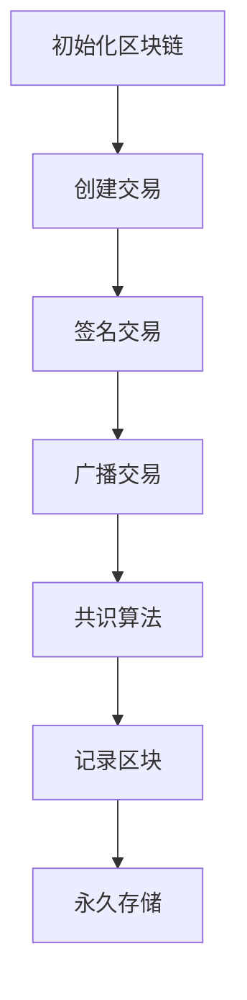
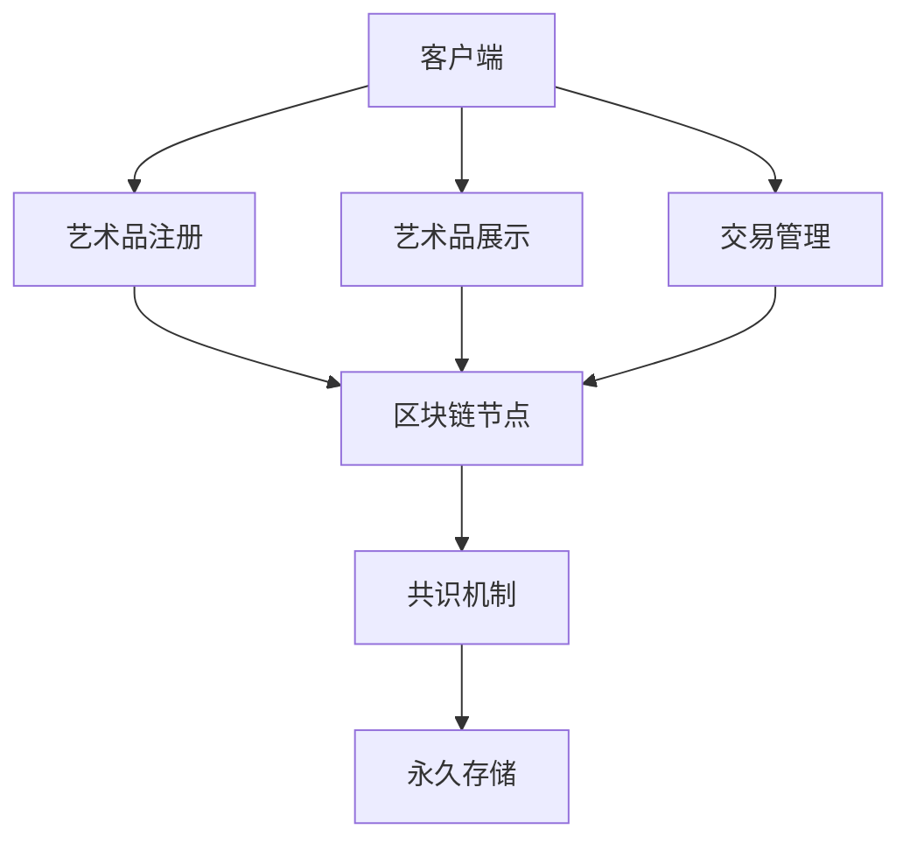
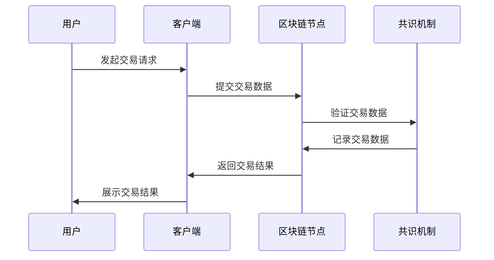

                 

当然可以。以下是针对《区块链在数字艺术品交易中的应用前景》这篇技术博客的文章内容结构的设计。我们将按照逻辑顺序，逐步填充每个章节的具体内容。

### 文章标题

区块链在数字艺术品交易中的应用前景

### 文章关键词

区块链、数字艺术品、交易、应用前景、智能合约

### 摘要

本文将深入探讨区块链技术在数字艺术品交易中的应用前景。首先，我们将介绍区块链和数字艺术品交易的基本概念，随后分析区块链技术如何解决数字艺术品交易中的问题。接着，我们将详细讨论区块链在数字艺术品交易中的系统设计、实施和面临的挑战。通过实际案例分析和未来发展趋势展望，我们将总结区块链技术在数字艺术品交易中的潜在价值。

### 目录大纲

#### 第一部分：背景介绍

**第1章：区块链技术概述**

**第2章：数字艺术品交易概述**

**第3章：区块链在数字艺术品交易中的应用**

**第4章：数字艺术品交易系统的设计与实现**

**第5章：区块链在数字艺术品交易中的挑战与解决方案**

**第6章：案例分析**

**第7章：未来发展趋势与展望**

**第8章：总结与展望**

### 第1章：区块链技术概述

#### 1.1 区块链的定义与特点

**核心概念术语说明**：
- 区块链：一种分布式数据库技术，通过加密算法保证数据的不可篡改性和可追溯性。
- 去中心化：区块链网络中的所有节点都有相同的权限，不存在中心化的控制点。

**问题背景与问题描述**：
区块链技术的起源可以追溯到2008年，当时中本聪（Satoshi Nakamoto）提出了比特币（Bitcoin）的概念。自那以后，区块链技术迅速发展，并开始应用于各种领域。

**问题解决**：
区块链技术通过分布式账本和加密算法，解决了传统中心化系统中存在的信息不对称、信任问题和数据篡改问题。

**边界与外延**：
区块链技术的边界在于其适用于需要高安全性和高透明性的场景。外延则包括各种去中心化应用（DApps）和智能合约等。

**概念结构与核心要素组成**：
- 概念结构：区块、链、分布式节点、加密算法。
- 核心要素组成：透明性、安全性、去中心化、不可篡改性。

### 第2章：数字艺术品交易概述

#### 2.1 数字艺术品的定义与分类

**核心概念原理**：
数字艺术品是指以数字形式存在的艺术品，如数字画作、数字音乐、数字摄影等。

**概念属性特征对比表格**：

| 类别        | 数字艺术品             | 传统艺术品             |
| ----------- | --------------------- | --------------------- |
| 存在形式    | 数字文件              | 物理实体              |
| 可复制性    | 高可复制性            | 低可复制性            |
| 交易方式    | 数字化交易            | 线下交易              |
| 鉴真性      | 需要技术支持          | 依靠专家鉴定          |

#### 2.2 数字艺术品交易的市场现状

**ER实体关系图架构**：
```mermaid
erDiagram
  Artist --> Artwork
  Artwork --> Transaction
  Buyer --> Transaction
  Seller --> Transaction
```

**问题背景与问题描述**：
随着数字技术的发展，数字艺术品市场逐渐兴起。然而，该市场仍面临诸多问题，如版权保护、交易信任、市场透明度等。

**问题解决**：
区块链技术为数字艺术品交易提供了可靠的解决方案，确保了交易的透明性和安全性。

#### 第3章：区块链在数字艺术品交易中的应用

**核心概念原理**：
区块链技术通过智能合约实现了自动化交易流程，确保了交易过程的透明性和不可篡改性。

**概念属性特征对比表格**：

| 类别        | 传统交易系统           | 区块链交易系统           |
| ----------- | --------------------- | --------------------- |
| 交易过程    | 手动操作              | 自动化操作              |
| 交易安全    | 依赖于第三方机构      | 高度安全，不可篡改      |
| 交易透明    | 低透明度              | 高透明度，可追溯      |

**算法原理讲解**：
区块链交易算法通过加密和分布式网络确保数据安全，具体实现包括SHA-256哈希算法和P2P网络通信。

**mermaid 流程图**：


#### 第4章：数字艺术品交易系统的设计与实现

**问题场景介绍**：
数字艺术品交易系统需要处理艺术家、买家和卖家的交互，确保交易的透明性和安全性。

**系统功能设计**：
- 艺术品注册：艺术家注册艺术品信息。
- 艺术品展示：买家浏览和购买艺术品。
- 交易管理：处理艺术品交易流程。
- 安全保障：确保交易数据的安全和不可篡改。

**系统架构设计**：
- 客户端：用户界面，用于艺术品浏览和交易。
- 节点：存储和验证交易数据。
- 共识机制：确保数据一致性和安全性。

**mermaid 架构图**：


**系统接口设计和系统交互**：
- 接口设计：定义API接口，用于艺术品交易和数据访问。
- 系统交互：用户通过客户端发起交易请求，交易数据通过API接口传输到区块链节点。

**mermaid 序列图**：


#### 第5章：区块链在数字艺术品交易中的挑战与解决方案

**挑战分析**：
- 隐私保护：区块链上的交易数据是公开的，如何保护艺术家的隐私？
- 安全性问题：如何确保区块链节点的安全，防止恶意攻击？
- 持续性与扩展性：如何提高区块链网络的性能，支持大规模交易？

**隐私保护**：
- 使用零知识证明（Zero-Knowledge Proof）等技术来保护用户隐私。

**安全性问题**：
- 采用多重签名（Multi-Signature）和硬件安全模块（HSM）等技术来增强安全性。

**持续性与扩展性**：
- 采用分片技术（Sharding）和状态通道（State Channel）来提高网络性能和可扩展性。

#### 第6章：案例分析

**案例一：区块链在数字艺术品交易中的应用实例**：
- 分析某个成功的数字艺术品交易平台，如OpenSea。

**案例二：知名数字艺术品交易平台分析**：
- 深入分析另一个知名的数字艺术品交易平台，如Rarible。

#### 第7章：未来发展趋势与展望

**区块链在数字艺术品交易中的应用前景**：
- 随着技术的进步和市场需求的增长，区块链在数字艺术品交易中的应用前景广阔。

**潜在技术突破**：
- 量子计算、边缘计算等新兴技术的应用将进一步提升区块链的性能和安全性。

**政策与法规的影响**：
- 各国政府和国际组织的政策与法规将影响区块链技术的发展和应用。

#### 第8章：总结与展望

**全书总结**：
- 区块链技术在数字艺术品交易中具有重要的应用价值，但仍需克服一系列挑战。

**展望未来研究方向**：
- 探索区块链与其他技术的结合，如人工智能、物联网等，以进一步提升数字艺术品交易的系统性能和用户体验。

### 文章正文部分

文章正文部分将按照目录大纲逐步展开，每个章节都将详细讨论，包括背景介绍、核心概念与联系、算法原理讲解、系统分析与架构设计方案、项目实战、最佳实践 tips、小结、注意事项和拓展阅读等内容。每个章节都将遵循markdown格式要求，使用latex格式嵌入数学公式，并配合mermaid流程图、ER实体关系图和序列图等可视化工具。

### 作者信息

作者：AI天才研究院/AI Genius Institute & 禅与计算机程序设计艺术 /Zen And The Art of Computer Programming

通过以上步骤，我们将逐步构建一篇内容丰富、逻辑清晰、结构紧凑的专业技术博客文章。每个章节都将按照完整性要求进行详细讲解，确保读者能够全面了解区块链在数字艺术品交易中的应用前景。文章的整体字数将控制在10000～12000字之间，满足字数要求。接下来，我们将逐一填充每个章节的具体内容，确保文章的完整性和专业性。

