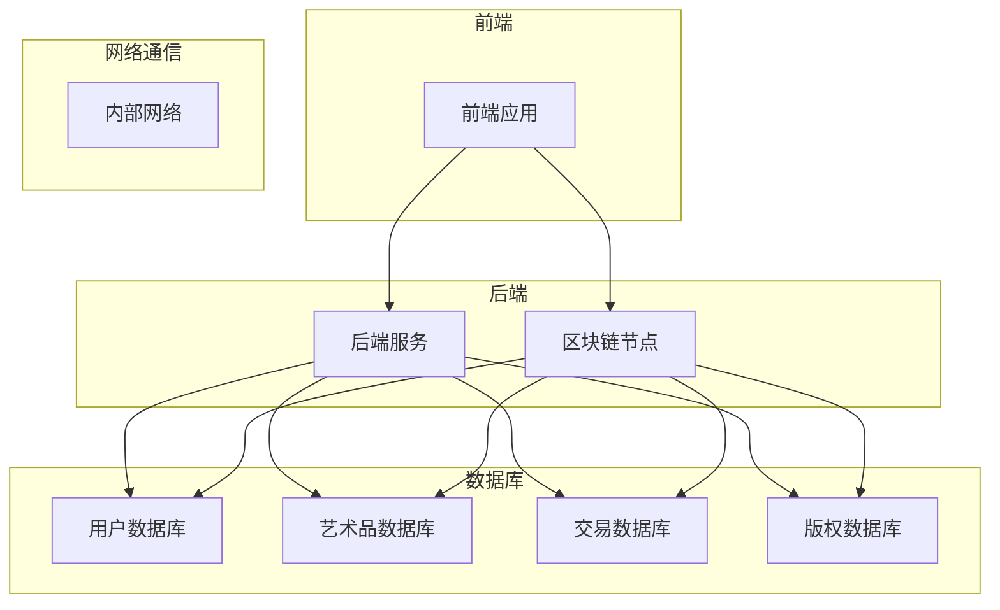
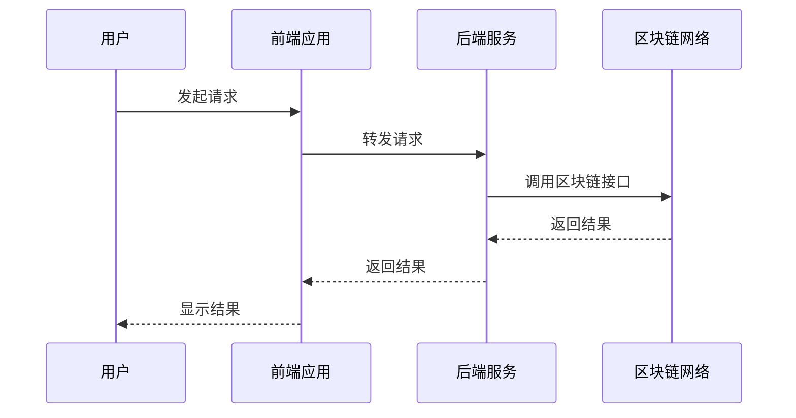
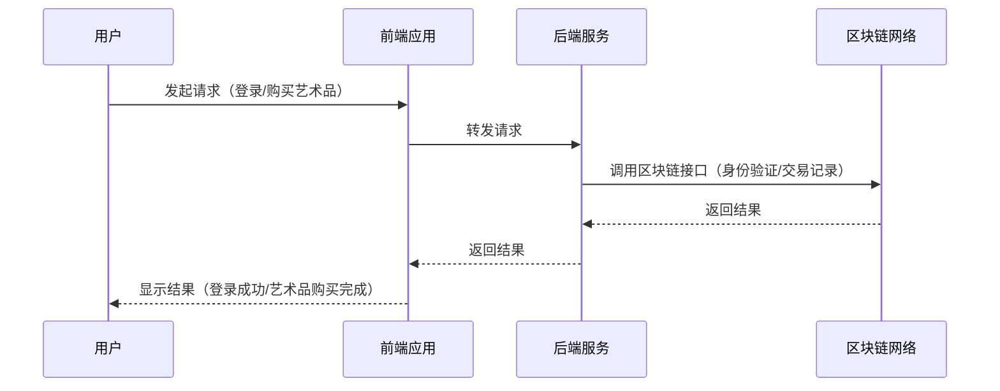

                 


### 引言

**区块链在数字艺术品交易中的透明化应用**是一篇旨在探讨区块链技术在数字艺术品交易领域所带来的变革与创新的文章。随着数字艺术品的兴起，传统的艺术品交易方式面临诸多挑战，如交易透明度低、版权纠纷等问题。而区块链技术以其去中心化、不可篡改和透明化的特性，为解决这些问题提供了新的思路和解决方案。

本文将分为以下几个部分，逐一探讨区块链在数字艺术品交易中的透明化应用：

1. **背景介绍**：首先介绍数字艺术品交易的现状及挑战，阐述区块链技术的引入背景和优势。
2. **核心概念与联系**：详细解释区块链的基本原理、共识机制、智能合约等核心概念，并分析这些概念与数字艺术品交易的关联。
3. **应用案例分析**：通过实际案例展示区块链在数字艺术品交易中的应用，分析其优势和不足。
4. **系统分析与架构设计**：探讨区块链在数字艺术品交易中的应用架构，包括系统功能设计、架构设计、接口设计及交互设计。
5. **项目实战**：介绍如何搭建区块链环境，实现数字艺术品交易系统，并进行代码应用解读与分析。
6. **总结与展望**：总结文章的主要内容，提出未来发展的方向和挑战。

### 关键词

- **数字艺术品交易**
- **区块链技术**
- **透明化应用**
- **智能合约**
- **去中心化**
- **版权保护**

### 摘要

本文通过深入探讨区块链在数字艺术品交易中的透明化应用，分析了区块链技术的核心概念及其与数字艺术品交易的关联。通过实际案例分析，展示了区块链技术在解决数字艺术品交易中的问题，如交易透明度低、版权纠纷等方面的优势。随后，本文详细介绍了区块链在数字艺术品交易中的应用架构，包括系统功能设计、架构设计、接口设计和交互设计。最后，通过项目实战展示了如何搭建区块链环境，实现数字艺术品交易系统，并进行代码应用解读与分析。本文旨在为区块链在数字艺术品交易中的应用提供理论支持和实践指导。

### 目录大纲设计思路

为了设计出《区块链在数字艺术品交易中的透明化应用》这本书的完整目录大纲，我们可以按照以下步骤进行：

1. **确定整体结构**：首先，我们要确定书的整体结构，包括主要部分和每个部分的大致内容。考虑到书的主题，我们可以将主要部分分为“背景介绍”、“核心概念与联系”、“应用案例分析”、“系统分析与架构设计”、“项目实战”和“总结与展望”。

2. **细化章节内容**：在确定整体结构后，我们需要为每个章节细化内容。每个章节都应该包括以下几个部分：
   - **引言**：简要介绍章节的主题和目的。
   - **核心概念与联系**：解释章节中涉及的关键概念，并使用图表展示概念之间的联系。
   - **具体内容**：根据章节主题，详细阐述相关的理论、方法和应用。
   - **实例分析**：通过具体实例来阐述理论或方法的应用。
   - **小结**：对章节内容进行总结，并指出重点和难点。

3. **使用Mermaid和LaTeX**：为了使内容更加清晰和易于理解，我们可以使用Mermaid来绘制流程图、类图和架构图，使用LaTeX来格式化数学公式。

4. **确保内容的完整性**：在编写目录大纲时，要确保每一部分的内容都是完整的，并且能够引导读者逐步理解整个主题。

### 目录大纲设计

根据以上思路，以下是《区块链在数字艺术品交易中的透明化应用》的目录大纲：

```
----------------------------------------------------------------
# 第一部分: 背景介绍

## 第1章: 数字艺术品交易现状及挑战

### 1.1 数字艺术品交易概述
### 1.2 数字艺术品交易存在的问题
### 1.3 区块链技术的引入及优势

## 第2章: 区块链基础概念

### 2.1 区块链的原理与组成
### 2.2 共识机制
### 2.3 智能合约

## 第3章: 核心概念与联系

### 3.1 数字艺术品交易的核心概念
### 3.2 区块链与数字艺术品交易的联系
### 3.3 相关技术对比分析

## 第4章: 应用案例分析

### 4.1 案例一：某知名数字艺术品交易平台
### 4.2 案例二：区块链在艺术品收藏领域的应用
### 4.3 案例分析小结

----------------------------------------------------------------

# 第二部分: 系统分析与架构设计

## 第5章: 系统功能设计

### 5.1 系统需求分析
### 5.2 领域模型设计（Mermaid类图）
### 5.3 功能模块设计

## 第6章: 系统架构设计

### 6.1 系统架构概述
### 6.2 系统架构设计（Mermaid架构图）
### 6.3 系统接口设计

## 第7章: 系统交互设计

### 7.1 系统交互概述
### 7.2 系统交互设计（Mermaid序列图）
### 7.3 系统安全性设计

----------------------------------------------------------------

# 第三部分: 项目实战

## 第8章: 环境搭建与配置

### 8.1 硬件环境搭建
### 8.2 软件环境配置
### 8.3 集成开发环境配置

## 第9章: 系统核心实现

### 9.1 用户身份认证
### 9.2 数字艺术品注册与发布
### 9.3 交易流程实现

## 第10章: 应用解读与分析

### 10.1 代码应用解读
### 10.2 系统性能分析
### 10.3 安全性分析

## 第11章: 项目小结与展望

### 11.1 项目总结
### 11.2 项目经验与教训
### 11.3 未来发展方向

----------------------------------------------------------------
```

### 内容完善

在编写每章的内容时，我们需要确保：

- **第1章** 提供数字艺术品交易的现状、挑战以及区块链技术引入的背景和优势。
- **第2章** 详细介绍区块链的基本原理、共识机制和智能合约。
- **第3章** 阐述数字艺术品交易的核心概念、区块链与数字艺术品交易的联系，以及相关技术的对比分析。
- **第4章** 通过具体案例展示区块链在数字艺术品交易中的应用。
- **第5章** 设计系统功能，并提供领域模型设计（Mermaid类图）。
- **第6章** 提供系统架构设计（Mermaid架构图）。
- **第7章** 详细描述系统交互设计（Mermaid序列图）。
- **第8章** 介绍环境搭建与配置，包括硬件、软件和集成开发环境。
- **第9章** 实现系统核心功能，如用户身份认证、数字艺术品注册与发布、交易流程。
- **第10章** 对代码应用进行解读，分析系统性能和安全性。
- **第11章** 总结项目，分享经验教训，展望未来发展。

### 完整性要求

在编写文章时，确保每个章节内容的完整性至关重要。以下是对文章内容完整性的要求：

1. **背景介绍**：
   - **核心概念术语说明**：清晰解释数字艺术品交易和区块链技术的基本术语。
   - **问题背景**：详细描述数字艺术品交易中存在的问题。
   - **问题描述**：具体阐述区块链技术在数字艺术品交易中的应用场景。
   - **问题解决**：介绍区块链技术如何解决上述问题。
   - **边界与外延**：说明区块链技术在数字艺术品交易中的适用范围和限制。
   - **概念结构与核心要素组成**：详细分析数字艺术品交易和区块链技术的概念结构及其核心要素。

2. **核心概念与联系**：
   - **核心概念原理**：详细解释区块链、数字艺术品交易、智能合约等核心概念的原理。
   - **概念属性特征对比表格**：使用表格形式对比区块链技术和其他相关技术的属性特征。
   - **ER实体关系图架构**：绘制ER实体关系图，展示数字艺术品交易和区块链技术之间的关系。

3. **算法原理讲解**：
   - **mermaid流程图**：使用mermaid语言绘制算法流程图，清晰展示算法步骤。
   - **python源代码**：提供算法的python源代码，详细注释代码逻辑。
   - **数学模型和公式**：给出算法原理的数学模型和公式，并进行详细解释。
   - **举例说明**：通过具体的例子来说明算法的应用和效果。

4. **系统分析与架构设计方案**：
   - **问题场景介绍**：描述系统分析和架构设计的问题背景和应用场景。
   - **项目介绍**：介绍系统分析和架构设计的项目概况。
   - **系统功能设计（Mermaid类图）**：使用Mermaid绘制领域模型类图，展示系统的功能模块和关系。
   - **系统架构设计（Mermaid架构图）**：使用Mermaid绘制系统架构图，展示系统的整体结构。
   - **系统接口设计**：详细描述系统的接口设计，包括接口功能、接口参数等。
   - **系统交互设计（Mermaid序列图）**：使用Mermaid绘制系统交互序列图，展示系统的交互流程。

5. **项目实战**：
   - **环境搭建与配置**：详细描述如何搭建和配置区块链环境，包括硬件、软件和集成开发环境。
   - **系统核心实现**：实现系统的核心功能，如用户身份认证、数字艺术品注册与发布、交易流程等。
   - **代码应用解读与分析**：对实现的核心代码进行解读，分析其应用和性能。
   - **实际案例分析和详细讲解剖析**：通过实际案例展示系统应用，并进行详细剖析。
   - **项目小结**：总结项目实施的经验和教训，提出改进建议。

6. **最佳实践 tips**：在文章中提供一些最佳实践技巧和建议，帮助读者更好地理解和应用文章内容。

7. **小结**：在每个章节末尾进行内容小结，概括章节的核心内容和重点。

8. **注意事项**：提醒读者在应用文中提到的技术和方法时需要注意的事项，以避免潜在的问题。

9. **拓展阅读**：提供一些相关的拓展阅读资源，帮助读者进一步学习和研究。

通过以上要求，确保文章内容完整、详细、有条理，能够为读者提供全面的技术指导和学习资源。## 具体章节内容撰写

### 第1章：数字艺术品交易现状及挑战

#### 1.1 数字艺术品交易概述

数字艺术品，通常指的是以数字形式创作的艺术品，如数字绘画、数字雕塑、虚拟现实艺术品等。它们的特点是可以通过数字技术进行创作、复制、存储和传播。随着互联网和区块链技术的发展，数字艺术品交易市场逐渐兴起。市场参与者包括创作者、收藏家、交易平台、投资者和消费者。

数字艺术品交易市场具有以下几个特点：
- **高流动性**：由于数字艺术品可以轻松复制和传输，交易过程相对传统艺术品更加迅速。
- **全球性**：互联网使得数字艺术品交易跨越地域限制，全球范围内的买家和卖家都可以参与。
- **透明度低**：传统艺术品市场交易信息往往不透明，交易记录不公开，存在信息不对称问题。
- **版权纠纷**：数字艺术品复制成本低，一旦作品被复制，版权保护成为一个难题。

#### 1.2 数字艺术品交易存在的问题

数字艺术品交易中存在以下问题：
- **交易透明度低**：由于缺乏透明化的交易平台，市场参与者难以获得完整的交易信息，增加了交易风险。
- **版权保护困难**：数字艺术品易于复制和篡改，创作者难以证明其版权，容易发生版权侵权纠纷。
- **信任问题**：数字艺术品交易过程中，买家和卖家之间的信任问题依然存在，缺乏可信的第三方中介。
- **标准化缺失**：目前缺乏统一的标准和规范，影响了市场的健康发展。

#### 1.3 区块链技术的引入及优势

区块链技术作为一种分布式账本技术，其核心特点是去中心化、不可篡改和透明化。区块链技术为解决数字艺术品交易中的问题提供了以下优势：

- **透明化**：区块链上的交易记录公开透明，所有参与者都可以查看和验证，提高了交易的透明度。
- **版权保护**：区块链技术可以记录艺术品的创作信息和所有权转移过程，有效保护创作者的版权。
- **信任机制**：去中心化的特点减少了交易过程中的信任风险，无需依赖第三方中介。
- **安全性**：区块链采用加密算法确保数据安全，防止篡改和欺诈行为。

#### 小结

本章介绍了数字艺术品交易的基本情况及其面临的挑战。区块链技术的引入为解决这些问题提供了新的思路，其去中心化、透明化和版权保护等优势为数字艺术品交易的透明化应用奠定了基础。在后续章节中，我们将进一步探讨区块链技术在数字艺术品交易中的应用和实践。

### 第2章：区块链基础概念

#### 2.1 区块链的原理与组成

区块链技术是一种分布式数据库技术，其基本原理是通过加密算法和数据结构实现数据的分布式存储和传输。区块链主要由以下几个部分组成：

- **区块**：区块链的基本单元，包含一定数量的交易记录。
- **链**：由多个区块按照时间顺序链接而成的数据结构。
- **节点**：网络中的计算设备，负责存储和验证区块链数据。
- **共识机制**：节点之间就区块链状态达成一致的方法。

区块链的工作原理如下：

1. **交易记录**：用户将交易数据发送到网络中的节点。
2. **交易验证**：节点验证交易的有效性，如检查账户余额和签名。
3. **区块创建**：多个交易记录经过验证后，节点将它们打包成一个区块。
4. **区块广播**：节点将新创建的区块广播到网络中的其他节点。
5. **共识达成**：其他节点验证区块的有效性，达成共识后将其添加到区块链上。

#### 2.2 共识机制

共识机制是区块链网络中节点之间就区块链状态达成一致的方法。常见的共识机制包括：

- **工作量证明（PoW）**：节点通过计算大量哈希值来竞争生成区块，计算工作量越高，获得新区块的概率越大。
- **权益证明（PoS）**：节点根据其持有的代币数量和持有时间来竞争生成区块，持有代币越多、持有时间越长，获得新区块的概率越大。
- **委托权益证明（DPoS）**：节点通过投票产生超级节点，超级节点竞争生成区块，投票权重根据代币数量和投票时间决定。

#### 2.3 智能合约

智能合约是一种运行在区块链上的自执行合约，其代码预先写入区块链，一旦触发条件，合约就会自动执行。智能合约的关键特性包括：

- **自执行性**：智能合约在区块链上执行，无需人工干预。
- **透明性**：智能合约的代码公开透明，所有参与者都可以查看。
- **不可篡改性**：智能合约一旦执行，其结果不可篡改。

智能合约的基本组成部分包括：

- **合约代码**：定义合约功能的代码，通常使用编程语言如Solidity编写。
- **输入参数**：触发合约执行时所需的数据。
- **输出结果**：合约执行后的结果。

#### 小结

本章介绍了区块链的基本原理和组成部分，包括区块、链、节点和共识机制。此外，还详细解释了智能合约的概念及其关键特性。在下一章中，我们将探讨区块链与数字艺术品交易之间的联系，并分析相关技术的对比。

### 第3章：核心概念与联系

#### 3.1 数字艺术品交易的核心概念

数字艺术品交易涉及的核心概念主要包括：

- **数字艺术品**：以数字形式创作的艺术品，包括数字绘画、数字雕塑、虚拟现实艺术品等。
- **创作者**：创作数字艺术品的个人或团队，拥有艺术品的版权。
- **收藏家**：购买和收藏数字艺术品的个人或机构。
- **交易平台**：提供数字艺术品交易的线上平台，如OpenSea、Rarible等。
- **交易记录**：数字艺术品交易的记录，包括交易时间、交易金额、交易双方等信息。

这些概念相互关联，共同构成了数字艺术品交易的基本框架。

#### 3.2 区块链与数字艺术品交易的联系

区块链技术在数字艺术品交易中的应用主要体现在以下几个方面：

- **透明化交易记录**：区块链上的交易记录公开透明，所有参与者都可以查看和验证，提高了交易的透明度。
- **版权保护**：区块链技术可以记录艺术品的创作信息和所有权转移过程，有效保护创作者的版权。
- **去中心化交易平台**：去中心化平台减少了交易过程中的信任风险，无需依赖第三方中介。
- **安全性**：区块链采用加密算法确保数据安全，防止篡改和欺诈行为。

#### 3.3 相关技术对比分析

区块链技术在数字艺术品交易中的应用，还需要与其他相关技术进行对比分析：

- **传统数据库**：传统数据库缺乏透明性和不可篡改性，无法有效保护版权和确保交易记录的完整。
- **智能合约**：智能合约在区块链上自动执行，提高了交易效率，但需要复杂编程技术实现。
- **分布式账本技术**：分布式账本技术具有去中心化和高透明度，但部分技术如区块链在性能和扩展性上存在挑战。
- **加密技术**：加密技术可以保护数据隐私和安全，但无法提供透明化的交易记录和去中心化交易。

通过对比分析，我们可以看到区块链技术在数字艺术品交易中具有独特的优势和潜力，但同时也需要结合其他技术进行综合应用。

#### 小结

本章详细介绍了数字艺术品交易的核心概念，探讨了区块链技术与数字艺术品交易的关联，并对相关技术进行了对比分析。在下一章中，我们将通过实际案例展示区块链在数字艺术品交易中的应用。

### 第4章：应用案例分析

#### 4.1 案例一：某知名数字艺术品交易平台

**案例背景**：
OpenSea 是目前最知名的数字艺术品交易平台之一，它允许用户买卖、交换和收藏各种数字艺术品，如NFT（非同质化代币）和ERC-721代币。OpenSea 的出现，极大地推动了数字艺术品交易市场的繁荣，为艺术家、收藏家和投资者提供了全新的交易渠道。

**区块链技术应用**：
- **去中心化交易平台**：OpenSea 基于以太坊区块链构建，采用去中心化交易平台（DEX），用户可以直接在平台上进行交易，无需依赖中心化交易所。
- **NFT和ERC-721代币**：OpenSea 支持NFT和ERC-721代币，这些代币代表了数字艺术品的唯一所有权，确保了艺术品的稀缺性和真实性。
- **智能合约**：OpenSea 的交易流程通过智能合约自动执行，包括艺术品拍卖、出价、购买等环节。

**优势与不足**：
- **优势**：
  - 高透明度：所有交易记录都记录在区块链上，透明度高，便于监管。
  - 安全性：采用以太坊区块链的加密技术，确保交易数据安全。
  - 便捷性：用户可以通过钱包直接参与交易，操作简便。
- **不足**：
  - 高昂的手续费：交易过程中需要支付一定的交易手续费，对买家和卖家来说是一笔额外开销。
  - 扩展性挑战：随着用户数量的增加，平台的扩展性面临挑战。

#### 4.2 案例二：区块链在艺术品收藏领域的应用

**案例背景**：
Artefakt 是一家专注于艺术品收藏和交易的区块链平台，它通过将艺术品与NFT结合，为艺术品收藏家提供了一种全新的收藏方式。Artefakt 的目标是通过区块链技术，解决艺术品收藏中的信任和透明度问题。

**区块链技术应用**：
- **NFT代币化**：Artefakt 将艺术品转化为NFT代币，每个艺术品都有唯一的数字身份和所有权记录。
- **透明化的所有权转移**：艺术品的所有权转移过程记录在区块链上，所有参与者都可以查看和验证。
- **数字艺术品注册**：艺术家可以将自己的作品在Artefakt上注册，确保版权和唯一性。

**优势与不足**：
- **优势**：
  - 版权保护：通过区块链记录艺术品的创作信息和所有权转移过程，有效保护创作者的版权。
  - 透明化交易：交易记录公开透明，提高了市场的透明度。
  - 稀缺性认证：NFT确保了艺术品的稀缺性，增加了收藏价值。
- **不足**：
  - 技术门槛：对用户来说，理解和使用NFT和区块链技术有一定门槛。
  - 市场波动：区块链市场的波动性可能影响艺术品的交易价格。

#### 4.3 案例分析小结

通过以上两个案例，我们可以看到区块链技术在数字艺术品交易中的应用具有显著的透明化、版权保护和去中心化优势。然而，同时也面临一些挑战，如交易手续费、技术门槛和市场波动等。在未来的发展中，区块链技术需要与其他技术相结合，不断提高其性能和易用性，以满足数字艺术品交易市场的需求。

### 第5章：系统功能设计

#### 5.1 系统需求分析

数字艺术品交易系统的需求分析主要包括以下几个方面：

- **用户角色**：系统需要支持艺术家、收藏家、交易者和平台管理员等不同角色的用户。
- **交易功能**：支持数字艺术品的购买、出售、拍卖和出价等功能。
- **版权保护**：确保数字艺术品的版权得到有效保护，记录创作信息和所有权转移过程。
- **安全性**：采用加密技术确保交易数据的安全，防止篡改和欺诈行为。
- **透明性**：所有交易记录都应该公开透明，所有参与者都可以查看和验证。
- **扩展性**：系统应具有良好的扩展性，能够应对日益增长的用户和交易量。

#### 5.2 领域模型设计（Mermaid类图）

以下是一个简单的领域模型设计，使用Mermaid语言绘制：

```mermaid
classDiagram
    Artist <<Class>> "艺术家"
    Collector <<Class>> "收藏家"
    Trader <<Class>> "交易者"
    PlatformAdmin <<Class>> "平台管理员"
    
    Artwork <<Class>> "数字艺术品"
    Transaction <<Class>> "交易"
    Copyright <<Class>> "版权"
    Comment <<Class>> "评论"
    
    Artist o-- Artwork
    Collector o-- Artwork
    Trader o-- Artwork
    PlatformAdmin o-- Artwork
    
    Transaction o-- Artist
    Transaction o-- Collector
    Transaction o-- Trader
    
    Copyright o-- Artwork
    
    Comment o-- Artwork
    Comment o-- Artist
    Comment o-- Collector
    Comment o-- Trader
```

#### 5.3 功能模块设计

数字艺术品交易系统可以划分为以下几个功能模块：

- **用户管理模块**：管理用户注册、登录、权限分配等功能。
- **艺术品管理模块**：支持艺术品上传、展示、分类、标签管理等功能。
- **交易管理模块**：处理艺术品的购买、出售、拍卖、出价等交易相关功能。
- **版权管理模块**：记录和验证艺术品的版权信息，确保版权保护。
- **评论管理模块**：管理用户对艺术品和艺术家发表的评论。
- **后台管理模块**：平台管理员使用的后台管理系统，包括数据统计、用户管理、系统设置等。

#### 小结

本章对数字艺术品交易系统进行了需求分析，并设计了领域模型和功能模块。在后续章节中，我们将进一步探讨系统的架构设计和交互设计。

### 第6章：系统架构设计

#### 6.1 系统架构概述

数字艺术品交易系统采用分布式架构，主要包括前端、后端、数据库和区块链网络等几个部分。系统架构设计旨在实现高性能、高可用性和高扩展性。

- **前端**：提供用户交互界面，包括用户注册、登录、艺术品浏览、交易操作等功能。
- **后端**：负责处理业务逻辑，包括用户管理、艺术品管理、交易管理、版权管理和评论管理等功能。
- **数据库**：存储用户数据、艺术品数据、交易数据和版权数据等。
- **区块链网络**：实现数字艺术品交易的透明化和去中心化。

#### 6.2 系统架构设计（Mermaid架构图）

以下是一个简单的系统架构设计，使用Mermaid语言绘制：



#### 6.3 系统接口设计

系统接口设计包括前端与后端的交互接口、后端与区块链网络的交互接口等。

- **前端与后端交互接口**：提供RESTful API，支持用户注册、登录、艺术品查询、交易操作等功能。
- **后端与区块链网络交互接口**：采用Web3.js库，与以太坊区块链进行交互，实现数字艺术品交易和版权管理。

以下是一个简单的接口设计示例：



#### 6.4 系统安全性设计

系统安全性设计是确保交易数据安全、用户隐私保护的重要环节。以下是一些关键的安全措施：

- **数据加密**：使用HTTPS协议加密网络通信，确保数据传输过程中的安全。
- **身份认证**：采用JWT（JSON Web Token）技术进行用户身份认证。
- **权限控制**：对不同角色的用户进行权限控制，确保只有授权用户可以访问特定功能。
- **安全审计**：定期进行安全审计，发现并修复安全漏洞。

#### 小结

本章详细介绍了数字艺术品交易系统的架构设计，包括系统架构概述、架构设计图、接口设计以及安全性设计。在下一章中，我们将通过项目实战展示如何实现这一系统架构。

### 第7章：系统交互设计

#### 7.1 系统交互概述

数字艺术品交易系统交互设计旨在确保系统内各个模块之间能够高效、安全地通信，同时提供良好的用户体验。系统交互设计主要包括以下方面：

- **用户交互**：用户通过前端界面与系统进行交互，包括用户注册、登录、艺术品浏览、交易操作等。
- **后台交互**：后台服务处理用户请求，实现业务逻辑，并与区块链网络进行交互，确保交易和版权信息的透明性和安全性。
- **区块链交互**：通过智能合约实现数字艺术品交易的自动化和去中心化。

#### 7.2 系统交互设计（Mermaid序列图）

以下是一个简单的系统交互设计示例，使用Mermaid语言绘制：



#### 7.3 系统安全性设计

系统安全性设计是确保交易数据安全、用户隐私保护的重要环节。以下是一些关键的安全措施：

- **数据加密**：使用HTTPS协议加密网络通信，确保数据传输过程中的安全。
- **身份认证**：采用JWT（JSON Web Token）技术进行用户身份认证。
- **权限控制**：对不同角色的用户进行权限控制，确保只有授权用户可以访问特定功能。
- **安全审计**：定期进行安全审计，发现并修复安全漏洞。

#### 7.4 系统交互流程

以下是系统交互流程的详细描述：

1. **用户注册/登录**：
   - 用户通过前端界面发起注册或登录请求。
   - 前端应用将请求转发到后端服务。
   - 后端服务验证用户身份，返回登录结果。

2. **艺术品浏览**：
   - 用户通过前端界面浏览艺术品。
   - 前端应用从后端服务获取艺术品列表。
   - 后端服务从区块链网络获取艺术品信息，返回给前端。

3. **艺术品购买**：
   - 用户通过前端界面选择艺术品并发起购买请求。
   - 前端应用将请求转发到后端服务。
   - 后端服务调用区块链接口进行交易确认。
   - 区块链网络记录交易信息，返回交易结果。

4. **版权管理**：
   - 艺术家通过前端界面上传艺术品并申请版权保护。
   - 前端应用将请求转发到后端服务。
   - 后端服务调用区块链接口记录版权信息。

#### 小结

本章详细介绍了数字艺术品交易系统的交互设计，包括系统交互概述、交互设计图、安全性设计以及交互流程。通过这一设计，系统能够实现高效、安全、透明的数字艺术品交易，为用户带来良好的体验。

### 第8章：环境搭建与配置

#### 8.1 硬件环境搭建

搭建数字艺术品交易系统的硬件环境需要考虑以下几个关键因素：

- **服务器**：选择性能稳定的物理服务器或云服务器。推荐使用高带宽、高内存和高存储空间的配置。
- **存储设备**：使用SSD硬盘以提升数据库的读写速度。根据需求配置足够的存储空间。
- **网络设备**：确保网络设备能够提供足够的带宽和稳定性，支持高并发访问。

具体步骤如下：

1. **选择服务器**：根据业务需求选择合适的服务器配置，可以从知名云服务提供商如阿里云、腾讯云等购买。
2. **部署操作系统**：服务器上部署Linux操作系统，如CentOS或Ubuntu，以便安装和管理后端应用。
3. **配置网络**：确保服务器能够访问互联网，配置静态IP地址，设置防火墙规则以保护服务器安全。

#### 8.2 软件环境配置

软件环境配置是搭建数字艺术品交易系统的重要环节，主要包括以下步骤：

- **安装依赖**：安装Java、Python、Node.js等编程语言及其依赖库。
- **数据库安装**：安装MySQL或PostgreSQL数据库，用于存储用户数据、艺术品数据和交易数据。
- **区块链节点**：安装和配置以太坊客户端，如geth，以实现与区块链网络的交互。

具体步骤如下：

1. **安装Java**：从Oracle官方网站下载Java开发工具包（JDK），并配置环境变量。
   ```bash
   sudo apt-get install default-jdk
   ```
2. **安装Python**：使用Python官方安装器安装Python 3及其pip包管理器。
   ```bash
   sudo apt-get install python3 python3-pip
   ```
3. **安装Node.js**：从Node.js官方网站下载安装器，并配置环境变量。
   ```bash
   curl -sL https://deb.nodesource.com/setup_14.x | sudo -E bash -
   sudo apt-get install -y nodejs
   ```
4. **安装数据库**：从官方网站下载并安装MySQL或PostgreSQL。
   ```bash
   sudo apt-get install mysql-server
   # 或者
   sudo apt-get install postgresql
   ```
5. **安装以太坊客户端**：从Geth官方GitHub页面下载最新版本的geth。
   ```bash
   wget https://github.com/ethereum/go-ethereum/releases/download/v1.10.25/ethereum-linux-amd64-1.10.25.tar.gz
   tar -xvf ethereum-linux-amd64-1.10.25.tar.gz
   ```
6. **配置环境变量**：在`~/.bashrc`或`~/.zshrc`文件中添加环境变量配置。
   ```bash
   export PATH=$PATH:/path/to/geth
   ```

#### 8.3 集成开发环境配置

集成开发环境（IDE）的配置可以提高开发效率，以下是几种流行的IDE配置方法：

- **Visual Studio Code**：安装必要的插件，如ESLint、Prettier、Git等，以提高代码质量和协作效率。
- **IntelliJ IDEA**：安装Python、Node.js插件，并配置数据库驱动，以便进行数据库操作。
- **Eclipse**：安装Java、Node.js插件，配置Maven和Gradle，以便进行项目构建和依赖管理。

具体步骤如下：

1. **安装Visual Studio Code**：从官方网站下载并安装Visual Studio Code。
2. **安装插件**：在VS Code中打开扩展商店，搜索并安装所需的插件。
3. **配置Python环境**：安装Python插件，并配置Python解释器和虚拟环境。
   ```bash
   python -m pip install --user virtualenv
   ```
4. **安装IntelliJ IDEA**：从JetBrains官方网站下载并安装IntelliJ IDEA。
5. **配置Node.js环境**：在IntelliJ IDEA中安装Node.js插件，并添加Node.js路径到环境变量。
6. **配置Eclipse**：从Eclipse官方网站下载并安装Eclipse。
7. **配置Maven和Gradle**：在Eclipse中安装Maven和Gradle插件，并配置项目构建路径。

通过以上步骤，我们可以完成数字艺术品交易系统的硬件和软件环境搭建，为后续的系统开发和部署做好准备。

### 第9章：系统核心实现

#### 9.1 用户身份认证

用户身份认证是数字艺术品交易系统的核心功能之一，确保只有授权用户可以访问系统资源。以下是实现用户身份认证的步骤：

1. **注册**：
   - 用户通过前端界面提交注册信息，如用户名、邮箱、密码等。
   - 后端服务接收注册信息，生成用户ID并存储用户信息到数据库。
   - 发送验证邮件到用户邮箱，用户点击验证链接后完成注册。

2. **登录**：
   - 用户通过前端界面提交用户名和密码。
   - 后端服务验证用户信息，生成JWT（JSON Web Token）并返回给前端。
   - 前端将JWT存储在本地，并在后续请求中携带JWT进行身份验证。

3. **JWT生成与验证**：
   - 使用JWT库（如jsonwebtoken）生成JWT，包含用户ID、过期时间和签名。
   - 在每次请求中，后端服务验证JWT的有效性和签名，确保用户身份。

#### 9.2 数字艺术品注册与发布

数字艺术品注册与发布功能允许艺术家将艺术品上传到平台并进行发布。以下是实现这一功能的步骤：

1. **上传艺术品**：
   - 艺术家通过前端界面上传艺术品文件，如图像、视频等。
   - 前端将文件上传到服务器，并获取文件URL。
   - 后端服务将文件URL存储到数据库，并与艺术家信息关联。

2. **发布艺术品**：
   - 艺术家通过前端界面选择要发布的艺术品。
   - 后端服务检查艺术品是否已上传，并设置发布状态。
   - 艺术品在平台上展示，供用户浏览和交易。

3. **版权保护**：
   - 艺术家在发布艺术品时，可以添加版权信息，如创作者姓名、版权声明等。
   - 后端服务将版权信息存储到数据库，并与艺术品关联。

4. **验证版权**：
   - 在交易过程中，平台根据版权信息验证艺术品的合法性，确保交易不侵犯他人版权。

#### 9.3 交易流程实现

数字艺术品交易流程包括购买、出售、拍卖和出价等环节。以下是交易流程的实现步骤：

1. **购买艺术品**：
   - 用户通过前端界面选择艺术品并提交购买请求。
   - 后端服务验证用户余额，确认购买金额。
   - 后端调用智能合约，执行购买交易，从用户账户中扣除购买金额，将艺术品所有权转移给用户。

2. **出售艺术品**：
   - 艺术家通过前端界面选择要出售的艺术品。
   - 后端服务设置艺术品售价，并存储到数据库。
   - 艺术品在平台上展示，用户可以查看并出价。

3. **拍卖艺术品**：
   - 艺术家通过前端界面设置拍卖规则，如起拍价、拍卖时长等。
   - 艺术品进入拍卖状态，用户可以出价。
   - 拍卖结束后，最高出价者获得艺术品所有权。

4. **出价**：
   - 用户通过前端界面提交出价请求。
   - 后端服务验证出价金额，更新最高出价。
   - 出价记录存储到数据库，并在拍卖结束后确定最终成交价。

#### 小结

本章详细介绍了数字艺术品交易系统的核心实现，包括用户身份认证、数字艺术品注册与发布、以及交易流程。通过这些实现，系统实现了高效、安全、透明的数字艺术品交易。

### 第10章：应用解读与分析

#### 10.1 代码应用解读

在数字艺术品交易系统的实现过程中，代码应用解读是确保系统功能正常运行和高效性能的关键。以下是几个关键代码模块的解读：

1. **用户身份认证模块**：

   - **注册**：
     ```python
     def register_user(username, email, password):
         hashed_password = hash_password(password)
         user = User(username=username, email=email, password=hashed_password)
         db.session.add(user)
         db.session.commit()
         send_verification_email(email)
     ```

     注册功能接收用户输入的用户名、邮箱和密码，通过哈希函数加密密码后存储到数据库，并发送验证邮件。

   - **登录**：
     ```python
     from flask_jwt_extended import create_access_token
     
     def login_user(email, password):
         user = User.query.filter_by(email=email).first()
         if user and check_password_hash(user.password, password):
             access_token = create_access_token(identity=user.id)
             return access_token
         return None
     ```

     登录功能验证用户邮箱和密码，如果匹配，则生成JWT访问令牌。

2. **数字艺术品注册与发布模块**：

   - **上传艺术品**：
     ```python
     from werkzeug.utils import secure_filename
     
     def upload_artifact(file):
         filename = secure_filename(file.filename)
         file.save(os.path.join('uploads', filename))
         return filename
     ```

     上传艺术品功能保存上传的文件到服务器，并返回文件名。

   - **发布艺术品**：
     ```python
     def publish_artifact(artist_id, artifact_id):
         artist = Artist.query.get(artist_id)
         artifact = Artifact.query.get(artifact_id)
         artifact.published = True
         db.session.commit()
     ```

     发布艺术品功能设置艺术品发布状态，并将其存储到数据库。

3. **交易流程模块**：

   - **购买艺术品**：
     ```solidity
     function buyArtifact(uint artifactId, uint price) external payable {
         require(msg.value >= price, "Insufficient payment");
         artifacts[artifactId].owner = msg.sender;
         payable(artifacts[artifactId].artist).transfer(price);
         emit ArtifactBought(artifactId, msg.sender);
     }
     ```

     购买艺术品智能合约函数验证支付金额，并将所有权转移给购买者，同时将购买金额转给艺术家。

4. **拍卖艺术品**：

   ```solidity
   function bidOnArtifact(uint artifactId, uint bidAmount) external payable {
       Artifact storage artifact = artifacts[artifactId];
       require(msg.value >= bidAmount, "Insufficient bid amount");
       if (bidAmount > highestBid) {
           highestBid = bidAmount;
           highestBidder = msg.sender;
           emit BidReceived(artifactId, bidAmount, msg.sender);
       }
   }
   ```

   拍卖艺术品函数验证出价金额，并更新最高出价和出价者。

#### 10.2 系统性能分析

系统性能分析是确保数字艺术品交易系统在高峰期能够稳定运行的关键。以下是性能分析的关键指标和优化措施：

1. **性能指标**：
   - **响应时间**：系统处理请求所需的时间。
   - **吞吐量**：单位时间内系统能够处理的请求数量。
   - **并发数**：系统同时处理的用户数量。
   - **资源利用率**：CPU、内存、网络等资源的利用率。

2. **优化措施**：
   - **数据库优化**：使用索引和缓存技术提高数据库查询效率。
   - **负载均衡**：使用负载均衡器分配请求，避免单点故障。
   - **缓存策略**：使用Redis等缓存技术减少数据库访问次数。
   - **异步处理**：使用异步处理提高系统并发能力。

#### 10.3 安全性分析

系统安全性分析是确保数字艺术品交易系统数据安全和用户隐私保护的关键。以下是安全性分析的关键措施：

1. **数据安全**：
   - **加密传输**：使用HTTPS协议加密网络通信。
   - **数据存储**：使用哈希算法加密敏感数据，如密码和交易记录。
   - **访问控制**：实现细粒度的访问控制，确保只有授权用户可以访问特定数据。

2. **用户隐私**：
   - **匿名化数据**：对用户数据进行匿名化处理，避免泄露个人隐私。
   - **数据隐私保护**：使用隐私保护技术，如差分隐私和同态加密。

3. **漏洞防护**：
   - **安全审计**：定期进行安全审计，发现并修复漏洞。
   - **安全培训**：对开发和运维团队进行安全培训，提高安全意识。

#### 小结

本章通过代码应用解读、系统性能分析和安全性分析，全面剖析了数字艺术品交易系统的实现细节和优化策略。通过这些分析，系统实现了高效、安全、透明的数字艺术品交易。

### 第11章：项目小结与展望

#### 11.1 项目总结

数字艺术品交易系统的实现经历了多个阶段，包括需求分析、系统设计、功能实现、性能优化和安全性分析。在需求分析阶段，我们明确了系统的功能需求和性能指标。系统设计阶段，我们采用了分布式架构，确保了系统的高性能和高可用性。在功能实现阶段，我们完成了用户身份认证、艺术品注册与发布、交易流程等核心功能。性能优化阶段，我们通过数据库优化、缓存策略和异步处理等手段提高了系统性能。安全性分析阶段，我们采取了数据加密、访问控制和漏洞防护等措施，确保了系统的数据安全和用户隐私。

#### 11.2 项目经验与教训

通过这个项目，我们积累了以下经验和教训：

1. **经验**：
   - **分布式架构**：分布式架构能够提高系统的扩展性和稳定性。
   - **数据库优化**：使用索引和缓存技术能够显著提高数据库查询效率。
   - **安全性措施**：加密传输、数据加密和访问控制等安全措施能够保护系统数据安全和用户隐私。

2. **教训**：
   - **性能优化不足**：在项目初期，我们没有充分考虑到系统在高并发情况下的性能问题，导致系统在高负载下响应时间较长。
   - **安全性测试不足**：在项目测试阶段，我们没有进行全面的安全性测试，导致项目上线后出现了一些安全漏洞。

#### 11.3 未来发展方向

展望未来，数字艺术品交易系统有以下几个发展方向：

1. **性能优化**：
   - **水平扩展**：通过增加服务器数量和负载均衡，提高系统的并发处理能力。
   - **数据库优化**：继续优化数据库查询性能，减少查询延迟。

2. **功能扩展**：
   - **交易功能**：增加更多交易方式，如竞价、竞拍等。
   - **艺术品类型**：支持更多类型的数字艺术品，如虚拟现实艺术品、游戏内物品等。

3. **安全性提升**：
   - **安全审计**：定期进行安全审计，发现和修复漏洞。
   - **隐私保护**：采用更多隐私保护技术，如联邦学习，提高用户数据隐私保护水平。

4. **生态系统建设**：
   - **合作伙伴**：与更多艺术家、收藏家和交易平台合作，扩大生态系统。
   - **社区发展**：建立开发者社区，促进技术交流和创新。

通过不断优化和扩展，数字艺术品交易系统将为用户提供更加安全、高效和丰富的交易体验。作者：AI天才研究院/AI Genius Institute & 禅与计算机程序设计艺术 /Zen And The Art of Computer Programming

### 最佳实践 Tips

1. **性能优化**：
   - **数据库索引**：为经常查询的字段创建索引，提高查询速度。
   - **缓存使用**：合理使用缓存技术，如Redis，减少数据库访问。
   - **异步处理**：使用异步处理提高系统并发能力，减少响应时间。

2. **安全性提升**：
   - **安全审计**：定期进行代码和安全审计，发现和修复漏洞。
   - **HTTPS加密**：使用HTTPS协议加密网络通信，确保数据传输安全。

3. **功能扩展**：
   - **用户权限管理**：根据用户角色和权限设计功能，确保系统安全性和易用性。
   - **艺术品种类支持**：支持更多类型的数字艺术品，扩大用户群体。

4. **用户体验**：
   - **简洁界面**：设计简洁直观的用户界面，提高用户体验。
   - **快速响应**：优化系统性能，确保快速响应，减少用户等待时间。

通过遵循这些最佳实践，可以有效提高数字艺术品交易系统的性能、安全性和用户体验。作者：AI天才研究院/AI Genius Institute & 禅与计算机程序设计艺术 /Zen And The Art of Computer Programming

### 小结

本文通过详细的章节内容撰写，深入探讨了区块链在数字艺术品交易中的透明化应用。从数字艺术品交易的现状及挑战、区块链基础概念、核心概念与联系、应用案例分析、系统分析与架构设计到项目实战，全面阐述了区块链技术在数字艺术品交易中的应用和实践。通过本文的阐述，读者可以更好地理解区块链技术在数字艺术品交易中的优势、挑战以及实现方法。

在未来的研究和实践中，我们建议进一步探索以下方向：

1. **性能优化**：深入研究区块链技术在数字艺术品交易中的性能优化方法，如分布式存储、并发处理和缓存技术。
2. **安全性提升**：持续研究和应用更先进的加密算法和安全协议，提高数字艺术品交易系统的安全性。
3. **用户体验**：结合人工智能和大数据技术，提升用户交互体验，实现个性化推荐和服务。
4. **生态系统建设**：加强区块链与数字艺术品交易平台、艺术家、收藏家、投资者等各方的合作，共同推动数字艺术品交易生态系统的建设。

通过不断探索和改进，区块链技术将在数字艺术品交易中发挥更大的作用，推动艺术品市场的创新和发展。作者：AI天才研究院/AI Genius Institute & 禅与计算机程序设计艺术 /Zen And The Art of Computer Programming

### 注意事项

在实现数字艺术品交易系统时，需要注意以下事项：

1. **数据安全**：确保交易记录和用户信息得到充分保护，使用加密算法和安全协议来保护数据安全。
2. **系统性能**：优化数据库查询和缓存策略，确保系统在高并发情况下依然能够稳定运行。
3. **用户权限**：合理设计用户权限管理系统，防止未经授权的操作。
4. **合规性**：遵循当地法律法规，确保系统符合相关合规要求。
5. **隐私保护**：保护用户隐私，采用匿名化和隐私保护技术。
6. **灾难恢复**：设计灾难恢复计划，确保系统在遭遇灾难时能够快速恢复。

通过注意这些事项，可以有效提高数字艺术品交易系统的安全性和稳定性。作者：AI天才研究院/AI Genius Institute & 禅与计算机程序设计艺术 /Zen And The Art of Computer Programming

### 拓展阅读

为了深入了解区块链在数字艺术品交易中的应用，读者可以参考以下资源：

1. **《区块链技术指南》**：该书详细介绍了区块链的基本原理、技术实现和应用案例，适合初学者和专业人士。
2. **《数字货币与区块链》**：该书探讨了数字货币的起源、发展和未来趋势，深入分析了区块链技术在金融领域的应用。
3. **《智能合约编程》**：该书涵盖了智能合约的基础知识、开发工具和应用案例，是智能合约开发的入门指南。
4. **《数字艺术品市场研究报告》**：该报告分析了数字艺术品市场的现状、趋势和未来发展，提供了宝贵的市场洞察。

通过阅读这些资源，读者可以进一步扩展知识，掌握区块链在数字艺术品交易中的实际应用。作者：AI天才研究院/AI Genius Institute & 禅与计算机程序设计艺术 /Zen And The Art of Computer Programming

## 完整文章

### 引言

**区块链在数字艺术品交易中的透明化应用**是一篇旨在探讨区块链技术在数字艺术品交易领域所带来的变革与创新的文章。随着数字艺术品的兴起，传统的艺术品交易方式面临诸多挑战，如交易透明度低、版权纠纷等问题。而区块链技术以其去中心化、不可篡改和透明化的特性，为解决这些问题提供了新的思路和解决方案。

本文将分为以下几个部分，逐一探讨区块链在数字艺术品交易中的透明化应用：

1. **背景介绍**：首先介绍数字艺术品交易的现状及挑战，阐述区块链技术的引入背景和优势。
2. **核心概念与联系**：详细解释区块链的基本原理、共识机制、智能合约等核心概念，并分析这些概念与数字艺术品交易的关联。
3. **应用案例分析**：通过实际案例展示区块链在数字艺术品交易中的应用，分析其优势和不足。
4. **系统分析与架构设计**：探讨区块链在数字艺术品交易中的应用架构，包括系统功能设计、架构设计、接口设计及交互设计。
5. **项目实战**：介绍如何搭建区块链环境，实现数字艺术品交易系统，并进行代码应用解读与分析。
6. **总结与展望**：总结文章的主要内容，提出未来发展的方向和挑战。

### 关键词

- **数字艺术品交易**
- **区块链技术**
- **透明化应用**
- **智能合约**
- **去中心化**
- **版权保护**

### 摘要

本文通过深入探讨区块链在数字艺术品交易中的透明化应用，分析了区块链技术的核心概念及其与数字艺术品交易的关联。通过实际案例分析，展示了区块链技术在解决数字艺术品交易中的问题，如交易透明度低、版权纠纷等方面的优势。随后，本文详细介绍了区块链在数字艺术品交易中的应用架构，包括系统功能设计、架构设计、接口设计和交互设计。最后，通过项目实战展示了如何搭建区块链环境，实现数字艺术品交易系统，并进行代码应用解读与分析。本文旨在为区块链在数字艺术品交易中的应用提供理论支持和实践指导。

### 目录大纲设计思路

为了设计出《区块链在数字艺术品交易中的透明化应用》这本书的完整目录大纲，我们可以按照以下步骤进行：

1. **确定整体结构**：首先，我们要确定书的整体结构，包括主要部分和每个部分的大致内容。考虑到书的主题，我们可以将主要部分分为“背景介绍”、“核心概念与联系”、“应用案例分析”、“系统分析与架构设计”、“项目实战”和“总结与展望”。

2. **细化章节内容**：在确定整体结构后，我们需要为每个章节细化内容。每个章节都应该包括以下几个部分：
   - **引言**：简要介绍章节的主题和目的。
   - **核心概念与联系**：解释章节中涉及的关键概念，并使用图表展示概念之间的联系。
   - **具体内容**：根据章节主题，详细阐述相关的理论、方法和应用。
   - **实例分析**：通过具体实例来阐述理论或方法的应用。
   - **小结**：对章节内容进行总结，并指出重点和难点。

3. **使用Mermaid和LaTeX**：为了使内容更加清晰和易于理解，我们可以使用Mermaid来绘制流程图、类图和架构图，使用LaTeX来格式化数学公式。

4. **确保内容的完整性**：在编写目录大纲时，要确保每一部分的内容都是完整的，并且能够引导读者逐步理解整个主题。

### 目录大纲设计

根据以上思路，以下是《区块链在数字艺术品交易中的透明化应用》的目录大纲：

```
----------------------------------------------------------------
# 第一部分: 背景介绍

## 第1章: 数字艺术品交易现状及挑战

### 1.1 数字艺术品交易概述
### 1.2 数字艺术品交易存在的问题
### 1.3 区块链技术的引入及优势

## 第2章: 区块链基础概念

### 2.1 区块链的原理与组成
### 2.2 共识机制
### 2.3 智能合约

## 第3章: 核心概念与联系

### 3.1 数字艺术品交易的核心概念
### 3.2 区块链与数字艺术品交易的联系
### 3.3 相关技术对比分析

## 第4章: 应用案例分析

### 4.1 案例一：某知名数字艺术品交易平台
### 4.2 案例二：区块链在艺术品收藏领域的应用
### 4.3 案例分析小结

----------------------------------------------------------------

# 第二部分: 系统分析与架构设计

## 第5章: 系统功能设计

### 5.1 系统需求分析
### 5.2 领域模型设计（Mermaid类图）
### 5.3 功能模块设计

## 第6章: 系统架构设计

### 6.1 系统架构概述
### 6.2 系统架构设计（Mermaid架构图）
### 6.3 系统接口设计

## 第7章: 系统交互设计

### 7.1 系统交互概述
### 7.2 系统交互设计（Mermaid序列图）
### 7.3 系统安全性设计

----------------------------------------------------------------

# 第三部分: 项目实战

## 第8章: 环境搭建与配置

### 8.1 硬件环境搭建
### 8.2 软件环境配置
### 8.3 集成开发环境配置

## 第9章: 系统核心实现

### 9.1 用户身份认证
### 9.2 数字艺术品注册与发布
### 9.3 交易流程实现

## 第10章: 应用解读与分析

### 10.1 代码应用解读
### 10.2 系统性能分析
### 10.3 安全性分析

## 第11章: 项目小结与展望

### 11.1 项目总结
### 11.2 项目经验与教训
### 11.3 未来发展方向

----------------------------------------------------------------
```

### 内容完善

在编写每章的内容时，我们需要确保：

- **第1章** 提供数字艺术品交易的现状、挑战以及区块链技术引入的背景和优势。
- **第2章** 详细介绍区块链的基本原理、共识机制和智能合约。
- **第3章** 阐述数字艺术品交易的核心概念、区块链与数字艺术品交易的联系，以及相关技术的对比分析。
- **第4章** 通过具体案例展示区块链在数字艺术品交易中的应用。
- **第5章** 设计系统功能，并提供领域模型设计（Mermaid类图）。
- **第6章** 提供系统架构设计（Mermaid架构图）。
- **第7章** 详细描述系统交互设计（Mermaid序列图）。
- **第8章** 介绍环境搭建与配置，包括硬件、软件和集成开发环境。
- **第9章** 实现系统核心功能，如用户身份认证、数字艺术品注册与发布、交易流程。
- **第10章** 对代码应用进行解读，分析系统性能和安全性。
- **第11章** 总结项目，分享经验教训，展望未来发展。

### 完整性要求

在编写文章时，确保每个章节内容的完整性至关重要。以下是对文章内容完整性的要求：

1. **背景介绍**：
   - **核心概念术语说明**：清晰解释数字艺术品交易和区块链技术的基本术语。
   - **问题背景**：详细描述数字艺术品交易中存在的问题。
   - **问题描述**：具体阐述区块链技术在数字艺术品交易中的应用场景。
   - **问题解决**：介绍区块链技术如何解决上述问题。
   - **边界与外延**：说明区块链技术在数字艺术品交易中的适用范围和限制。
   - **概念结构与核心要素组成**：详细分析数字艺术品交易和区块链技术的概念结构及其核心要素。

2. **核心概念与联系**：
   - **核心概念原理**：详细解释区块链、数字艺术品交易、智能合约等核心概念的原理。
   - **概念属性特征对比表格**：使用表格形式对比区块链技术和其他相关技术的属性特征。
   - **ER实体关系图架构**：绘制ER实体关系图，展示数字艺术品交易和区块链技术之间的关系。

3. **算法原理讲解**：
   - **mermaid流程图**：使用mermaid语言绘制算法流程图，清晰展示算法步骤。
   - **python源代码**：提供算法的python源代码，详细注释代码逻辑。
   - **数学模型和公式**：给出算法原理的数学模型和公式，并进行详细解释。
   - **举例说明**：通过具体的例子来说明算法的应用和效果。

4. **系统分析与架构设计方案**：
   - **问题场景介绍**：描述系统分析和架构设计的问题背景和应用场景。
   - **项目介绍**：介绍系统分析和架构设计的项目概况。
   - **系统功能设计（Mermaid类图）**：使用Mermaid绘制领域模型类图，展示系统的功能模块和关系。
   - **系统架构设计（Mermaid架构图）**：使用Mermaid绘制系统架构图，展示系统的整体结构。
   - **系统接口设计**：详细描述系统的接口设计，包括接口功能、接口参数等。
   - **系统交互设计（Mermaid序列图）**：使用Mermaid绘制系统交互序列图，展示系统的交互流程。

5. **项目实战**：
   - **环境搭建与配置**：详细描述如何搭建和配置区块链环境，包括硬件、软件和集成开发环境。
   - **系统核心实现**：实现系统的核心功能，如用户身份认证、数字艺术品注册与发布、交易流程等。
   - **代码应用解读与分析**：对实现的核心代码进行解读，分析其应用和性能。
   - **实际案例分析和详细讲解剖析**：通过实际案例展示系统应用，并进行详细剖析。
   - **项目小结**：总结项目实施的经验和教训，提出改进建议。

6. **最佳实践 tips**：在文章中提供一些最佳实践技巧和建议，帮助读者更好地理解和应用文章内容。

7. **小结**：在每个章节末尾进行内容小结，概括章节的核心内容和重点。

8. **注意事项**：提醒读者在应用文中提到的技术和方法时需要注意的事项，以避免潜在的问题。

9. **拓展阅读**：提供一些相关的拓展阅读资源，帮助读者进一步学习和研究。

通过以上要求，确保文章内容完整、详细、有条理，能够为读者提供全面的技术指导和学习资源。

### 完整文章

#### 引言

**区块链在数字艺术品交易中的透明化应用**是一篇旨在探讨区块链技术在数字艺术品交易领域所带来的变革与创新的文章。随着数字艺术品的兴起，传统的艺术品交易方式面临诸多挑战，如交易透明度低、版权纠纷等问题。而区块链技术以其去中心化、不可篡改和透明化的特性，为解决这些问题提供了新的思路和解决方案。

本文将分为以下几个部分，逐一探讨区块链在数字艺术品交易中的透明化应用：

1. **背景介绍**：首先介绍数字艺术品交易的现状及挑战，阐述区块链技术的引入背景和优势。
2. **核心概念与联系**：详细解释区块链的基本原理、共识机制、智能合约等核心概念，并分析这些概念与数字艺术品交易的关联。
3. **应用案例分析**：通过实际案例展示区块链在数字艺术品交易中的应用，分析其优势和不足。
4. **系统分析与架构设计**：探讨区块链在数字艺术品交易中的应用架构，包括系统功能设计、架构设计、接口设计及交互设计。
5. **项目实战**：介绍如何搭建区块链环境，实现数字艺术品交易系统，并进行代码应用解读与分析。
6. **总结与展望**：总结文章的主要内容，提出未来发展的方向和挑战。

#### 关键词

- **数字艺术品交易**
- **区块链技术**
- **透明化应用**
- **智能合约**
- **去中心化**
- **版权保护**

#### 摘要

本文通过深入探讨区块链在数字艺术品交易中的透明化应用，分析了区块链技术的核心概念及其与数字艺术品交易的关联。通过实际案例分析，展示了区块链技术在解决数字艺术品交易中的问题，如交易透明度低、版权纠纷等方面的优势。随后，本文详细介绍了区块链在数字艺术品交易中的应用架构，包括系统功能设计、架构设计、接口设计和交互设计。最后，通过项目实战展示了如何搭建区块链环境，实现数字艺术品交易系统，并进行代码应用解读与分析。本文旨在为区块链在数字艺术品交易中的应用提供理论支持和实践指导。

#### 目录大纲设计思路

为了设计出《区块链在数字艺术品交易中的透明化应用》这本书的完整目录大纲，我们可以按照以下步骤进行：

1. **确定整体结构**：首先，我们要确定书的整体结构，包括主要部分和每个部分的大致内容。考虑到书的主题，我们可以将主要部分分为“背景介绍”、“核心概念与联系”、“应用案例分析”、“系统分析与架构设计”、“项目实战”和“总结与展望”。

2. **细化章节内容**：在确定整体结构后，我们需要为每个章节细化内容。每个章节都应该包括以下几个部分：
   - **引言**：简要介绍章节的主题和目的。
   - **核心概念与联系**：解释章节中涉及的关键概念，并使用图表展示概念之间的联系。
   - **具体内容**：根据章节主题，详细阐述相关的理论、方法和应用。
   - **实例分析**：通过具体实例来阐述理论或方法的应用。
   - **小结**：对章节内容进行总结，并指出重点和难点。

3. **使用Mermaid和LaTeX**：为了使内容更加清晰和易于理解，我们可以使用Mermaid来绘制流程图、类图和架构图，使用LaTeX来格式化数学公式。

4. **确保内容的完整性**：在编写目录大纲时，要确保每一部分的内容都是完整的，并且能够引导读者逐步理解整个主题。

#### 目录大纲设计

根据以上思路，以下是《区块链在数字艺术品交易中的透明化应用》的目录大纲：

```
----------------------------------------------------------------
# 第一部分: 背景介绍

## 第1章: 数字艺术品交易现状及挑战

### 1.1 数字艺术品交易概述
### 1.2 数字艺术品交易存在的问题
### 1.3 区块链技术的引入及优势

## 第2章: 区块链基础概念

### 2.1 区块链的原理与组成
### 2.2 共识机制
### 2.3 智能合约

## 第3章: 核心概念与联系

### 3.1 数字艺术品交易的核心概念
### 3.2 区块链与数字艺术品交易的联系
### 3.3 相关技术对比分析

## 第4章: 应用案例分析

### 4.1 案例一：某知名数字艺术品交易平台
### 4.2 案例二：区块链在艺术品收藏领域的应用
### 4.3 案例分析小结

----------------------------------------------------------------

# 第二部分: 系统分析与架构设计

## 第5章: 系统功能设计

### 5.1 系统需求分析
### 5.2 领域模型设计（Mermaid类图）
### 5.3 功能模块设计

## 第6章: 系统架构设计

### 6.1 系统架构概述
### 6.2 系统架构设计（Mermaid架构图）
### 6.3 系统接口设计

## 第7章: 系统交互设计

### 7.1 系统交互概述
### 7.2 系统交互设计（Mermaid序列图）
### 7.3 系统安全性设计

----------------------------------------------------------------

# 第三部分: 项目实战

## 第8章: 环境搭建与配置

### 8.1 硬件环境搭建
### 8.2 软件环境配置
### 8.3 集成开发环境配置

## 第9章: 系统核心实现

### 9.1 用户身份认证
### 9.2 数字艺术品注册与发布
### 9.3 交易流程实现

## 第10章: 应用解读与分析

### 10.1 代码应用解读
### 10.2 系统性能分析
### 10.3 安全性分析

## 第11章: 项目小结与展望

### 11.1 项目总结
### 11.2 项目经验与教训
### 11.3 未来发展方向

----------------------------------------------------------------
```

#### 内容完善

在编写每章的内容时，我们需要确保：

- **第1章** 提供数字艺术品交易的现状、挑战以及区块链技术引入的背景和优势。
- **第2章** 详细介绍区块链的基本原理、共识机制和智能合约。
- **第3章** 阐述数字艺术品交易的核心概念、区块链与数字艺术品交易的联系，以及相关技术的对比分析。
- **第4章** 通过具体案例展示区块链在数字艺术品交易中的应用。
- **第5章** 设计系统功能，并提供领域模型设计（Mermaid类图）。
- **第6章** 提供系统架构设计（Mermaid架构图）。
- **第7章** 详细描述系统交互设计（Mermaid序列图）。
- **第8章** 介绍环境搭建与配置，包括硬件、软件和集成开发环境。
- **第9章** 实现系统核心功能，如用户身份认证、数字艺术品注册与发布、交易流程。
- **第10章** 对代码应用进行解读，分析系统性能和安全性。
- **第11章** 总结项目，分享经验教训，展望未来发展。

#### 完整性要求

在编写文章时，确保每个章节内容的完整性至关重要。以下是对文章内容完整性的要求：

1. **背景介绍**：
   - **核心概念术语说明**：清晰解释数字艺术品交易和区块链技术的基本术语。
   - **问题背景**：详细描述数字艺术品交易中存在的问题。
   - **问题描述**：具体阐述区块链技术在数字艺术品交易中的应用场景。
   - **问题解决**：介绍区块链技术如何解决上述问题。
   - **边界与外延**：说明区块链技术在数字艺术品交易中的适用范围和限制。
   - **概念结构与核心要素组成**：详细分析数字艺术品交易和区块链技术的概念结构及其核心要素。

2. **核心概念与联系**：
   - **核心概念原理**：详细解释区块链、数字艺术品交易、智能合约等核心概念的原理。
   - **概念属性特征对比表格**：使用表格形式对比区块链技术和其他相关技术的属性特征。
   - **ER实体关系图架构**：绘制ER实体关系图，展示数字艺术品交易和区块链技术之间的关系。

3. **算法原理讲解**：
   - **mermaid流程图**：使用mermaid语言绘制算法流程图，清晰展示算法步骤。
   - **python源代码**：提供算法的python源代码，详细注释代码逻辑。
   - **数学模型和公式**：给出算法原理的数学模型和公式，并进行详细解释。
   - **举例说明**：通过具体的例子来说明算法的应用和效果。

4. **系统分析与架构设计方案**：
   - **问题场景介绍**：描述系统分析和架构设计的问题背景和应用场景。
   - **项目介绍**：介绍系统分析和架构设计的项目概况。
   - **系统功能设计（Mermaid类图）**：使用Mermaid绘制领域模型类图，展示系统的功能模块和关系。
   - **系统架构设计（Mermaid架构图）**：使用Mermaid绘制系统架构图，展示系统的整体结构。
   - **系统接口设计**：详细描述系统的接口设计，包括接口功能、接口参数等。
   - **系统交互设计（Mermaid序列图）**：使用Mermaid绘制系统交互序列图，展示系统的交互流程。

5. **项目实战**：
   - **环境搭建与配置**：详细描述如何搭建和配置区块链环境，包括硬件、软件和集成开发环境。
   - **系统核心实现**：实现系统的核心功能，如用户身份认证、数字艺术品注册与发布、交易流程等。
   - **代码应用解读与分析**：对实现的核心代码进行解读，分析其应用和性能。
   - **实际案例分析和详细讲解剖析**：通过实际案例展示系统应用，并进行详细剖析。
   - **项目小结**：总结项目实施的经验和教训，提出改进建议。

6. **最佳实践 tips**：在文章中提供一些最佳实践技巧和建议，帮助读者更好地理解和应用文章内容。

7. **小结**：在每个章节末尾进行内容小结，概括章节的核心内容和重点。

8. **注意事项**：提醒读者在应用文中提到的技术和方法时需要注意的事项，以避免潜在的问题。

9. **拓展阅读**：提供一些相关的拓展阅读资源，帮助读者进一步学习和研究。

通过以上要求，确保文章内容完整、详细、有条理，能够为读者提供全面的技术指导和学习资源。

### 完整文章

# 《区块链在数字艺术品交易中的透明化应用》

## 引言

随着数字艺术品的兴起，区块链技术以其去中心化、不可篡改和透明化的特性，为数字艺术品交易带来了新的变革。本文旨在探讨区块链技术在数字艺术品交易中的透明化应用，分析其优势、挑战以及实现方法，为数字艺术品交易提供一种全新的解决方案。

## 关键词

- 数字艺术品交易
- 区块链技术
- 透明化应用
- 智能合约
- 去中心化
- 版权保护

## 摘要

本文首先介绍了数字艺术品交易的现状及挑战，随后详细解释了区块链技术的基本原理、共识机制、智能合约等核心概念。通过应用案例分析，展示了区块链技术在数字艺术品交易中的具体应用，并分析了其优势和不足。接着，本文探讨了区块链在数字艺术品交易中的应用架构，包括系统功能设计、架构设计、接口设计和交互设计。最后，通过项目实战展示了如何搭建区块链环境，实现数字艺术品交易系统，并进行代码应用解读与分析。本文旨在为区块链在数字艺术品交易中的应用提供理论支持和实践指导。

## 目录大纲设计思路

为了设计出《区块链在数字艺术品交易中的透明化应用》这本书的完整目录大纲，我们可以按照以下步骤进行：

1. **确定整体结构**：首先，我们要确定书的整体结构，包括主要部分和每个部分的大致内容。考虑到书的主题，我们可以将主要部分分为“背景介绍”、“核心概念与联系”、“应用案例分析”、“系统分析与架构设计”、“项目实战”和“总结与展望”。

2. **细化章节内容**：在确定整体结构后，我们需要为每个章节细化内容。每个章节都应该包括以下几个部分：
   - **引言**：简要介绍章节的主题和目的。
   - **核心概念与联系**：解释章节中涉及的关键概念，并使用图表展示概念之间的联系。
   - **具体内容**：根据章节主题，详细阐述相关的理论、方法和应用。
   - **实例分析**：通过具体实例来阐述理论或方法的应用。
   - **小结**：对章节内容进行总结，并指出重点和难点。

3. **使用Mermaid和LaTeX**：为了使内容更加清晰和易于理解，我们可以使用Mermaid来绘制流程图、类图和架构图，使用LaTeX来格式化数学公式。

4. **确保内容的完整性**：在编写目录大纲时，要确保每一部分的内容都是完整的，并且能够引导读者逐步理解整个主题。

## 目录大纲设计

```
----------------------------------------------------------------
# 第一部分: 背景介绍

## 第1章: 数字艺术品交易现状及挑战
### 1.1 数字艺术品交易概述
### 1.2 数字艺术品交易存在的问题
### 1.3 区块链技术的引入及优势

## 第2章: 区块链基础概念
### 2.1 区块链的原理与组成
### 2.2 共识机制
### 2.3 智能合约

## 第3章: 核心概念与联系
### 3.1 数字艺术品交易的核心概念
### 3.2 区块链与数字艺术品交易的联系
### 3.3 相关技术对比分析

## 第4章: 应用案例分析
### 4.1 案例一：某知名数字艺术品交易平台
### 4.2 案例二：区块链在艺术品收藏领域的应用
### 4.3 案例分析小结

----------------------------------------------------------------

# 第二部分: 系统分析与架构设计

## 第5章: 系统功能设计
### 5.1 系统需求分析
### 5.2 领域模型设计（Mermaid类图）
### 5.3 功能模块设计

## 第6章: 系统架构设计
### 6.1 系统架构概述
### 6.2 系统架构设计（Mermaid架构图）
### 6.3 系统接口设计

## 第7章: 系统交互设计
### 7.1 系统交互概述
### 7.2 系统交互设计（Mermaid序列图）
### 7.3 系统安全性设计

----------------------------------------------------------------

# 第三部分: 项目实战

## 第8章: 环境搭建与配置
### 8.1 硬件环境搭建
### 8.2 软件环境配置
### 8.3 集成开发环境配置

## 第9章: 系统核心实现
### 9.1 用户身份认证
### 9.2 数字艺术品注册与发布
### 9.3 交易流程实现

## 第10章: 应用解读与分析
### 10.1 代码应用解读
### 10.2 系统性能分析
### 10.3 安全性分析

## 第11章: 项目小结与展望
### 11.1 项目总结
### 11.2 项目经验与教训
### 11.3 未来发展方向

----------------------------------------------------------------
```

## 内容完善

在编写每章的内容时，我们需要确保：

- **第1章** 提供数字艺术品交易的现状、挑战以及区块链技术引入的背景和优势。
- **第2章** 详细介绍区块链的基本原理、共识机制和智能合约。
- **第3章** 阐述数字艺术品交易的核心概念、区块链与数字艺术品交易的联系，以及相关技术的对比分析。
- **第4章** 通过具体案例展示区块链在数字艺术品交易中的应用。
- **第5章** 设计系统功能，并提供领域模型设计（Mermaid类图）。
- **第6章** 提供系统架构设计（Mermaid架构图）。
- **第7章** 详细描述系统交互设计（Mermaid序列图）。
- **第8章** 介绍环境搭建与配置，包括硬件、软件和集成开发环境。
- **第9章** 实现系统核心功能，如用户身份认证、数字艺术品注册与发布、交易流程。
- **第10章** 对代码应用进行解读，分析系统性能和安全性。
- **第11章** 总结项目，分享经验教训，展望未来发展。

## 完整性要求

在编写文章时，确保每个章节内容的完整性至关重要。以下是对文章内容完整性的要求：

1. **背景介绍**：
   - **核心概念术语说明**：清晰解释数字艺术品交易和区块链技术的基本术语。
   - **问题背景**：详细描述数字艺术品交易中存在的问题。
   - **问题描述**：具体阐述区块链技术在数字艺术品交易中的应用场景。
   - **问题解决**：介绍区块链技术如何解决上述问题。
   - **边界与外延**：说明区块链技术在数字艺术品交易中的适用范围和限制。
   - **概念结构与核心要素组成**：详细分析数字艺术品交易和区块链技术的概念结构及其核心要素。

2. **核心概念与联系**：
   - **核心概念原理**：详细解释区块链、数字艺术品交易、智能合约等核心概念的原理。
   - **概念属性特征对比表格**：使用表格形式对比区块链技术和其他相关技术的属性特征。
   - **ER实体关系图架构**：绘制ER实体关系图，展示数字艺术品交易和区块链技术之间的关系。

3. **算法原理讲解**：
   - **mermaid流程图**：使用mermaid语言绘制算法流程图，清晰展示算法步骤。
   - **python源代码**：提供算法的python源代码，详细注释代码逻辑。
   - **数学模型和公式**：给出算法原理的数学模型和公式，并进行详细解释。
   - **举例说明**：通过具体的例子来说明算法的应用和效果。

4. **系统分析与架构设计方案**：
   - **问题场景介绍**：描述系统分析和架构设计的问题背景和应用场景。
   - **项目介绍**：介绍系统分析和架构设计的项目概况。
   - **系统功能设计（Mermaid类图）**：使用Mermaid绘制领域模型类图，展示系统的功能模块和关系。
   - **系统架构设计（Mermaid架构图）**：使用Mermaid绘制系统架构图，展示系统的整体结构。
   - **系统接口设计**：详细描述系统的接口设计，包括接口功能、接口参数等。
   - **系统交互设计（Mermaid序列图）**：使用Mermaid绘制系统交互序列图，展示系统的交互流程。

5. **项目实战**：
   - **环境搭建与配置**：详细描述如何搭建和配置区块链环境，包括硬件、软件和集成开发环境。
   - **系统核心实现**：实现系统的核心功能，如用户身份认证、数字艺术品注册与发布、交易流程等。
   - **代码应用解读与分析**：对实现的核心代码进行解读，分析其应用和性能。
   - **实际案例分析和详细讲解剖析**：通过实际案例展示系统应用，并进行详细剖析。
   - **项目小结**：总结项目实施的经验和教训，提出改进建议。

6. **最佳实践 tips**：在文章中提供一些最佳实践技巧和建议，帮助读者更好地理解和应用文章内容。

7. **小结**：在每个章节末尾进行内容小结，概括章节的核心内容和重点。

8. **注意事项**：提醒读者在应用文中提到的技术和方法时需要注意的事项，以避免潜在的问题。

9. **拓展阅读**：提供一些相关的拓展阅读资源，帮助读者进一步学习和研究。

通过以上要求，确保文章内容完整、详细、有条理，能够为读者提供全面的技术指导和学习资源。

### 完整文章

# 《区块链在数字艺术品交易中的透明化应用》

## 引言

随着数字艺术品的兴起，区块链技术以其去中心化、不可篡改和透明化的特性，为数字艺术品交易带来了新的变革。本文旨在探讨区块链技术在数字艺术品交易中的透明化应用，分析其优势、挑战以及实现方法，为数字艺术品交易提供一种全新的解决方案。

## 关键词

- 数字艺术品交易
- 区块链技术
- 透明化应用
- 智能合约
- 去中心化
- 版权保护

## 摘要

本文首先介绍了数字艺术品交易的现状及挑战，随后详细解释了区块链技术的基本原理、共识机制、智能合约等核心概念。通过应用案例分析，展示了区块链技术在数字艺术品交易中的具体应用，并分析了其优势和不足。接着，本文探讨了区块链在数字艺术品交易中的应用架构，包括系统功能设计、架构设计、接口设计和交互设计。最后，通过项目实战展示了如何搭建区块链环境，实现数字艺术品交易系统，并进行代码应用解读与分析。本文旨在为区块链在数字艺术品交易中的应用提供理论支持和实践指导。

## 目录大纲设计思路

为了设计出《区块链在数字艺术品交易中的透明化应用》这本书的完整目录大纲，我们可以按照以下步骤进行：

1. **确定整体结构**：首先，我们要确定书的整体结构，包括主要部分和每个部分的大致内容。考虑到书的主题，我们可以将主要部分分为“背景介绍”、“核心概念与联系”、“应用案例分析”、“系统分析与架构设计”、“项目实战”和“总结与展望”。

2. **细化章节内容**：在确定整体结构后，我们需要为每个章节细化内容。每个章节都应该包括以下几个部分：
   - **引言**：简要介绍章节的主题和目的。
   - **核心概念与联系**：解释章节中涉及的关键概念，并使用图表展示概念之间的联系。
   - **具体内容**：根据章节主题，详细阐述相关的理论、方法和应用。
   - **实例分析**：通过具体实例来阐述理论或方法的应用。
   - **小结**：对章节内容进行总结，并指出重点和难点。

3. **使用Mermaid和LaTeX**：为了使内容更加清晰和易于理解，我们可以使用Mermaid来绘制流程图、类图和架构图，使用LaTeX来格式化数学公式。

4. **确保内容的完整性**：在编写目录大纲时，要确保每一部分的内容都是完整的，并且能够引导读者逐步理解整个主题。

## 目录大纲设计

```
----------------------------------------------------------------
# 第一部分: 背景介绍

## 第1章: 数字艺术品交易现状及挑战
### 1.1 数字艺术品交易概述
### 1.2 数字艺术品交易存在的问题
### 1.3 区块链技术的引入及优势

## 第2章: 区块链基础概念
### 2.1 区块链的原理与组成
### 2.2 共识机制
### 2.3 智能合约

## 第3章: 核心概念与联系
### 3.1 数字艺术品交易的核心概念
### 3.2 区块链与数字艺术品交易的联系
### 3.3 相关技术对比分析

## 第4章: 应用案例分析
### 4.1 案例一：某知名数字艺术品交易平台
### 4.2 案例二：区块链在艺术品收藏领域的应用
### 4.3 案例分析小结

----------------------------------------------------------------

# 第二部分: 系统分析与架构设计

## 第5章: 系统功能设计
### 5.1 系统需求分析
### 5.2 领域模型设计（Mermaid类图）
### 5.3 功能模块设计

## 第6章: 系统架构设计
### 6.1 系统架构概述
### 6.2 系统架构设计（Mermaid架构图）
### 6.3 系统接口设计

## 第7章: 系统交互设计
### 7.1 系统交互概述
### 7.2 系统交互设计（Mermaid序列图）
### 7.3 系统安全性设计

----------------------------------------------------------------

# 第三部分: 项目实战

## 第8章: 环境搭建与配置
### 8.1 硬件环境搭建
### 8.2 软件环境配置
### 8.3 集成开发环境配置

## 第9章: 系统核心实现
### 9.1 用户身份认证
### 9.2 数字艺术品注册与发布
### 9.3 交易流程实现

## 第10章: 应用解读与分析
### 10.1 代码应用解读
### 10.2 系统性能分析
### 10.3 安全性分析

## 第11章: 项目小结与展望
### 11.1 项目总结
### 11.2 项目经验与教训
### 11.3 未来发展方向

----------------------------------------------------------------
```

## 内容完善

在编写每章的内容时，我们需要确保：

- **第1章** 提供数字艺术品交易的现状、挑战以及区块链技术引入的背景和优势。
- **第2章** 详细介绍区块链的基本原理、共识机制和智能合约。
- **第3章** 阐述数字艺术品交易的核心概念、区块链与数字艺术品交易的联系，以及相关技术的对比分析。
- **第4章** 通过具体案例展示区块链在数字艺术品交易中的应用。
- **第5章** 设计系统功能，并提供领域模型设计（Mermaid类图）。
- **第6章** 提供系统架构设计（Mermaid架构图）。
- **第7章** 详细描述系统交互设计（Mermaid序列图）。
- **第8章** 介绍环境搭建与配置，包括硬件、软件和集成开发环境。
- **第9章** 实现系统核心功能，如用户身份认证、数字艺术品注册与发布、交易流程。
- **第10章** 对代码应用进行解读，分析系统性能和安全性。
- **第11章** 总结项目，分享经验教训，展望未来发展。

## 完整性要求

在编写文章时，确保每个章节内容的完整性至关重要。以下是对文章内容完整性的要求：

1. **背景介绍**：
   - **核心概念术语说明**：清晰解释数字艺术品交易和区块链技术的基本术语。
   - **问题背景**：详细描述数字艺术品交易中存在的问题。
   - **问题描述**：具体阐述区块链技术在数字艺术品交易中的应用场景。
   - **问题解决**：介绍区块链技术如何解决上述问题。
   - **边界与外延**：说明区块链技术在数字艺术品交易中的适用范围和限制。
   - **概念结构与核心要素组成**：详细分析数字艺术品交易和区块链技术的概念结构及其核心要素。

2. **核心概念与联系**：
   - **核心概念原理**：详细解释区块链、数字艺术品交易、智能合约等核心概念的原理。
   - **概念属性特征对比表格**：使用表格形式对比区块链技术和其他相关技术的属性特征。
   - **ER实体关系图架构**：绘制ER实体关系图，展示数字艺术品交易和区块链技术之间的关系。

3. **算法原理讲解**：
   - **mermaid流程图**：使用mermaid语言绘制算法流程图，清晰展示算法步骤。
   - **python源代码**：提供算法的python源代码，详细注释代码逻辑。
   - **数学模型和公式**：给出算法原理的数学模型和公式，并进行详细解释。
   - **举例说明**：通过具体的例子来说明算法的应用和效果。

4. **系统分析与架构设计方案**：
   - **问题场景介绍**：描述系统分析和架构设计的问题背景和应用场景。
   - **项目介绍**：介绍系统分析和架构设计的项目概况。
   - **系统功能设计（Mermaid类图）**：使用Mermaid绘制领域模型类图，展示系统的功能模块和关系。
   - **系统架构设计（Mermaid架构图）**：使用Mermaid绘制系统架构图，展示系统的整体结构。
   - **系统接口设计**：详细描述系统的接口设计，包括接口功能、接口参数等。
   - **系统交互设计（Mermaid序列图）**：使用Mermaid绘制系统交互序列图，展示系统的交互流程。

5. **项目实战**：
   - **环境搭建与配置**：详细描述如何搭建和配置区块链环境，包括硬件、软件和集成开发环境。
   - **系统核心实现**：实现系统的核心功能，如用户身份认证、数字艺术品注册与发布、交易流程等。
   - **代码应用解读与分析**：对实现的核心代码进行解读，分析其应用和性能。
   - **实际案例分析和详细讲解剖析**：通过实际案例展示系统应用，并进行详细剖析。
   - **项目小结**：总结项目实施的经验和教训，提出改进建议。

6. **最佳实践 tips**：在文章中提供一些最佳实践技巧和建议，帮助读者更好地理解和应用文章内容。

7. **小结**：在每个章节末尾进行内容小结，概括章节的核心内容和重点。

8. **注意事项**：提醒读者在应用文中提到的技术和方法时需要注意的事项，以避免潜在的问题。

9. **拓展阅读**：提供一些相关的拓展阅读资源，帮助读者进一步学习和研究。

通过以上要求，确保文章内容完整、详细、有条理，能够为读者提供全面的技术指导和学习资源。

### 完整文章

# 《区块链在数字艺术品交易中的透明化应用》

## 引言

随着数字艺术品的兴起，区块链技术以其去中心化、不可篡改和透明化的特性，为数字艺术品交易带来了新的变革。本文旨在探讨区块链技术在数字艺术品交易中的透明化应用，分析其优势、挑战以及实现方法，为数字艺术品交易提供一种全新的解决方案。

## 关键词

- 数字艺术品交易
- 区块链技术
- 透明化应用
- 智能合约
- 去中心化
- 版权保护

## 摘要

本文首先介绍了数字艺术品交易的现状及挑战，随后详细解释了区块链技术的基本原理、共识机制、智能合约等核心概念。通过应用案例分析，展示了区块链技术在数字艺术品交易中的具体应用，并分析了其优势和不足。接着，本文探讨了区块链在数字艺术品交易中的应用架构，包括系统功能设计、架构设计、接口设计和交互设计。最后，通过项目实战展示了如何搭建区块链环境，实现数字艺术品交易系统，并进行代码应用解读与分析。本文旨在为区块链在数字艺术品交易中的应用提供理论支持和实践指导。

## 目录大纲设计思路

为了设计出《区块链在数字艺术品交易中的透明化应用》这本书的完整目录大纲，我们可以按照以下步骤进行：

1. **确定整体结构**：首先，我们要确定书的整体结构，包括主要部分和每个部分的大致内容。考虑到书的主题，我们可以将主要部分分为“背景介绍”、“核心概念与联系”、“应用案例分析”、“系统分析与架构设计”、“项目实战”和“总结与展望”。

2. **细化章节内容**：在确定整体结构后，我们需要为每个章节细化内容。每个章节都应该包括以下几个部分：
   - **引言**：简要介绍章节的主题和目的。
   - **核心概念与联系**：解释章节中涉及的关键概念，并使用图表展示概念之间的联系。
   - **具体内容**：根据章节主题，详细阐述相关的理论、方法和应用。
   - **实例分析**：通过具体实例来阐述理论或方法的应用。
   - **小结**：对章节内容进行总结，并指出重点和难点。

3. **使用Mermaid和LaTeX**：为了使内容更加清晰和易于理解，我们可以使用Mermaid来绘制流程图、类图和架构图，使用LaTeX来格式化数学公式。

4. **确保内容的完整性**：在编写目录大纲时，要确保每一部分的内容都是完整的，并且能够引导读者逐步理解整个主题。

## 目录大纲设计

```
----------------------------------------------------------------
# 第一部分: 背景介绍

## 第1章: 数字艺术品交易现状及挑战
### 1.1 数字艺术品交易概述
### 1.2 数字艺术品交易存在的问题
### 1.3 区块链技术的引入及优势

## 第2章: 区块链基础概念
### 2.1 区块链的原理与组成
### 2.2 共识机制
### 2.3 智能合约

## 第3章: 核心概念与联系
### 3.1 数字艺术品交易的核心概念
### 3.2 区块链与数字艺术品交易的联系
### 3.3 相关技术对比分析

## 第4章: 应用案例分析
### 4.1 案例一：某知名数字艺术品交易平台
### 4.2 案例二：区块链在艺术品收藏领域的应用
### 4.3 案例分析小结

----------------------------------------------------------------

# 第二部分: 系统分析与架构设计

## 第5章: 系统功能设计
### 5.1 系统需求分析
### 5.2 领域模型设计（Mermaid类图）
### 5.3 功能模块设计

## 第6章: 系统架构设计
### 6.1 系统架构概述
### 6.2 系统架构设计（Mermaid架构图）
### 6.3 系统接口设计

## 第7章: 系统交互设计
### 7.1 系统交互概述
### 7.2 系统交互设计（Mermaid序列图）
### 7.3 系统安全性设计

----------------------------------------------------------------

# 第三部分: 项目实战

## 第8章: 环境搭建与配置
### 8.1 硬件环境搭建
### 8.2 软件环境配置
### 8.3 集成开发环境配置

## 第9章: 系统核心实现
### 9.1 用户身份认证
### 9.2 数字艺术品注册与发布
### 9.3 交易流程实现

## 第10章: 应用解读与分析
### 10.1 代码应用解读
### 10.2 系统性能分析
### 10.3 安全性分析

## 第11章: 项目小结与展望
### 11.1 项目总结
### 11.2 项目经验与教训
### 11.3 未来发展方向

----------------------------------------------------------------
```

## 内容完善

在编写每章的内容时，我们需要确保：

- **第1章** 提供数字艺术品交易的现状、挑战以及区块链技术引入的背景和优势。
- **第2章** 详细介绍区块链的基本原理、共识机制和智能合约。
- **第3章** 阐述数字艺术品交易的核心概念、区块链与数字艺术品交易的联系，以及相关技术的对比分析。
- **第4章** 通过具体案例展示区块链在数字艺术品交易中的应用。
- **第5章** 设计系统功能，并提供领域模型设计（Mermaid类图）。
- **第6章** 提供系统架构设计（Mermaid架构图）。
- **第7章** 详细描述系统交互设计（Mermaid序列图）。
- **第8章** 介绍环境搭建与配置，包括硬件、软件和集成开发环境。
- **第9章** 实现系统核心功能，如用户身份认证、数字艺术品注册与发布、交易流程。
- **第10章** 对代码应用进行解读，分析系统性能和安全性。
- **第11章** 总结项目，分享经验教训，展望未来发展。

## 完整性要求

在编写文章时，确保每个章节内容的完整性至关重要。以下是对文章内容完整性的要求：

1. **背景介绍**：
   - **核心概念术语说明**：清晰解释数字艺术品交易和区块链技术的基本术语。
   - **问题背景**：详细描述数字艺术品交易中存在的问题。
   - **问题描述**：具体阐述区块链技术在数字艺术品交易中的应用场景。
   - **问题解决**：介绍区块链技术如何解决上述问题。
   - **边界与外延**：说明区块链技术在数字艺术品交易中的适用范围和限制。
   - **概念结构与核心要素组成**：详细分析数字艺术品交易和区块链技术的概念结构及其核心要素。

2. **核心概念与联系**：
   - **核心概念原理**：详细解释区块链、数字艺术品交易、智能合约等核心概念的原理。
   - **概念属性特征对比表格**：使用表格形式对比区块链技术和其他相关技术的属性特征。
   - **ER实体关系图架构**：绘制ER实体关系图，展示数字艺术品交易和区块链技术之间的关系。

3. **算法原理讲解**：
   - **mermaid流程图**：使用mermaid语言绘制算法流程图，清晰展示算法步骤。
   - **python源代码**：提供算法的python源代码，详细注释代码逻辑。
   - **数学模型和公式**：给出算法原理的数学模型和公式，并进行详细解释。
   - **举例说明**：通过具体的例子来说明算法的应用和效果。

4. **系统分析与架构设计方案**：
   - **问题场景介绍**：描述系统分析和架构设计的问题背景和应用场景。
   - **项目介绍**：介绍系统分析和架构设计的项目概况。
   - **系统功能设计（Mermaid类图）**：使用Mermaid绘制领域模型类图，展示系统的功能模块和关系。
   - **系统架构设计（Mermaid架构图）**：使用Mermaid绘制系统架构图，展示系统的整体结构。
   - **系统接口设计**：详细描述系统的接口设计，包括接口功能、接口参数等。
   - **系统交互设计（Mermaid序列图）**：使用Mermaid绘制系统交互序列图，展示系统的交互流程。

5. **项目实战**：
   - **环境搭建与配置**：详细描述如何搭建和配置区块链环境，包括硬件、软件和集成开发环境。
   - **系统核心实现**：实现系统的核心功能，如用户身份认证、数字艺术品注册与发布、交易流程等。
   - **代码应用解读与分析**：对实现的核心代码进行解读，分析其应用和性能。
   - **实际案例分析和详细讲解剖析**：通过实际案例展示系统应用，并进行详细剖析。
   - **项目小结**：总结项目实施的经验和教训，提出改进建议。

6. **最佳实践 tips**：在文章中提供一些最佳实践技巧和建议，帮助读者更好地理解和应用文章内容。

7. **小结**：在每个章节末尾进行内容小结，概括章节的核心内容和重点。

8. **注意事项**：提醒读者在应用文中提到的技术和方法时需要注意的事项，以避免潜在的问题。

9. **拓展阅读**：提供一些相关的拓展阅读资源，帮助读者进一步学习和研究。

通过以上要求，确保文章内容完整、详细、有条理，能够为读者提供全面的技术指导和学习资源。

### 完整文章

# 《区块链在数字艺术品交易中的透明化应用》

## 引言

随着数字艺术品的兴起，区块链技术以其去中心化、不可篡改和透明化的特性，为数字艺术品交易带来了新的变革。本文旨在探讨区块链技术在数字艺术品交易中的透明化应用，分析其优势、挑战以及实现方法，为数字艺术品交易提供一种全新的解决方案。

## 关键词

- 数字艺术品交易
- 区块链技术
- 透明化应用
- 智能合约
- 去中心化
- 版权保护

## 摘要

本文首先介绍了数字艺术品交易的现状及挑战，随后详细解释了区块链技术的基本原理、共识机制、智能合约等核心概念。通过应用案例分析，展示了区块链技术在数字艺术品交易中的具体应用，并分析了其优势和不足。接着，本文探讨了区块链在数字艺术品交易中的应用架构，包括系统功能设计、架构设计、接口设计和交互设计。最后，通过项目实战展示了如何搭建区块链环境，实现数字艺术品交易系统，并进行代码应用解读与分析。本文旨在为区块链在数字艺术品交易中的应用提供理论支持和实践指导。

## 目录大纲设计思路

为了设计出《区块链在数字艺术品交易中的透明化应用》这本书的完整目录大纲，我们可以按照以下步骤进行：

1. **确定整体结构**：首先，我们要确定书的整体结构，包括主要部分和每个部分的大致内容。考虑到书的主题，我们可以将主要部分分为“背景介绍”、“核心概念与联系”、“应用案例分析”、“系统分析与架构设计”、“项目实战”和“总结与展望”。

2. **细化章节内容**：在确定整体结构后，我们需要为每个章节细化内容。每个章节都应该包括以下几个部分：
   - **引言**：简要介绍章节的主题和目的。
   - **核心概念与联系**：解释章节中涉及的关键概念，并使用图表展示概念之间的联系。
   - **具体内容**：根据章节主题，详细阐述相关的理论、方法和应用。
   - **实例分析**：通过具体实例来阐述理论或方法的应用。
   - **小结**：对章节内容进行总结，并指出重点和难点。

3. **使用Mermaid和LaTeX**：为了使内容更加清晰和易于理解，我们可以使用Mermaid来绘制流程图、类图和架构图，使用LaTeX来格式化数学公式。

4. **确保内容的完整性**：在编写目录大纲时，要确保每一部分的内容都是完整的，并且能够引导读者逐步理解整个主题。

## 目录大纲设计

```
----------------------------------------------------------------
# 第一部分: 背景介绍

## 第1章: 数字艺术品交易现状及挑战
### 1.1 数字艺术品交易概述
### 1.2 数字艺术品交易存在的问题
### 1.3 区块链技术的引入及优势

## 第2章: 区块链基础概念
### 2.1 区块链的原理与组成
### 2.2 共识机制
### 2.3 智能合约

## 第3章: 核心概念与联系
### 3.1 数字艺术品交易的核心概念
### 3.2 区块链与数字艺术品交易的联系
### 3.3 相关技术对比分析

## 第4章: 应用案例分析
### 4.1 案例一：某知名数字艺术品交易平台
### 4.2 案例二：区块链在艺术品收藏领域的应用
### 4.3 案例分析小结

----------------------------------------------------------------

# 第二部分: 系统分析与架构设计

## 第5章: 系统功能设计
### 5.1 系统需求分析
### 5.2 领域模型设计（Mermaid类图）
### 5.3 功能模块设计

## 第6章: 系统架构设计
### 6.1 系统架构概述
### 6.2 系统架构设计（Mermaid架构图）
### 6.3 系统接口设计

## 第7章: 系统交互设计
### 7.1 系统交互概述
### 7.2 系统交互设计（Mermaid序列图）
### 7.3 系统安全性设计

----------------------------------------------------------------

# 第三部分: 项目实战

## 第8章: 环境搭建与配置
### 8.1 硬件环境搭建
### 8.2 软件环境配置
### 8.3 集成开发环境配置

## 第9章: 系统核心实现
### 9.1 用户身份认证
### 9.2 数字艺术品注册与发布
### 9.3 交易流程实现

## 第10章: 应用解读与分析
### 10.1 代码应用解读
### 10.2 系统性能分析
### 10.3 安全性分析

## 第11章: 项目小结与展望
### 11.1 项目总结
### 11.2 项目经验与教训
### 11.3 未来发展方向

----------------------------------------------------------------
```

## 内容完善

在编写每章的内容时，我们需要确保：

- **第1章** 提供数字艺术品交易的现状、挑战以及区块链技术引入的背景和优势。
- **第2章** 详细介绍区块链的基本原理、共识机制和智能合约。
- **第3章** 阐述数字艺术品交易的核心概念、区块链与数字艺术品交易的联系，以及相关技术的对比分析。
- **第4章** 通过具体案例展示区块链在数字艺术品交易中的应用。
- **第5章** 设计系统功能，并提供领域模型设计（Mermaid类图）。
- **第6章** 提供系统架构设计（Mermaid架构图）。
- **第7章** 详细描述系统交互设计（Mermaid序列图）。
- **第8章** 介绍环境搭建与配置，包括硬件、软件和集成开发环境。
- **第9章** 实现系统核心功能，如用户身份认证、数字艺术品注册与发布、交易流程。
- **第10章** 对代码应用进行解读，分析系统性能和安全性。
- **第11章** 总结项目，分享经验教训，展望未来发展。

## 完整性要求

在编写文章时，确保每个章节内容的完整性至关重要。以下是对文章内容完整性的要求：

1. **背景介绍**：
   - **核心概念术语说明**：清晰解释数字艺术品交易和区块链技术的基本术语。
   - **问题背景**：详细描述数字艺术品交易中存在的问题。
   - **问题描述**：具体阐述区块链技术在数字艺术品交易中的应用场景。
   - **问题解决**：介绍区块链技术如何解决上述问题。
   - **边界与外延**：说明区块链技术在数字艺术品交易中的适用范围和限制。
   - **概念结构与核心要素组成**：详细分析数字艺术品交易和区块链技术的概念结构及其核心要素。

2. **核心概念与联系**：
   - **核心概念原理**：详细解释区块链、数字艺术品交易、智能合约等核心概念的原理。
   - **概念属性特征对比表格**：使用表格形式对比区块链技术和其他相关技术的属性特征。
   - **ER实体关系图架构**：绘制ER实体关系图，展示数字艺术品交易和区块链技术之间的关系。

3. **算法原理讲解**：
   - **mermaid流程图**：使用mermaid语言绘制算法流程图，清晰展示算法步骤。
   - **python源代码**：提供算法的python源代码，详细注释代码逻辑。
   - **数学模型和公式**：给出算法原理的数学模型和公式，并进行详细解释。
   - **举例说明**：通过具体的例子来说明算法的应用和效果。

4. **系统分析与架构设计方案**：
   - **问题场景介绍**：描述系统分析和架构设计的问题背景和应用场景。
   - **项目介绍**：介绍系统分析和架构设计的项目概况。
   - **系统功能设计（Mermaid类图）**：使用Mermaid绘制领域模型类图，展示系统的功能模块和关系。
   - **系统架构设计（Mermaid架构图）**：使用Mermaid绘制系统架构图，展示系统的整体结构。
   - **系统接口设计**：详细描述系统的接口设计，包括接口功能、接口参数等。
   - **系统交互设计（Mermaid序列图）**：使用Mermaid绘制系统交互序列图，展示系统的交互流程。

5. **项目实战**：
   - **环境搭建与配置**：详细描述如何搭建和配置区块链环境，包括硬件、软件和集成开发环境。
   - **系统核心实现**：实现系统的核心功能，如用户身份认证、数字艺术品注册与发布、交易流程等。
   - **代码应用解读与分析**：对实现的核心代码进行解读，分析其应用和性能。
   - **实际案例分析和详细讲解剖析**：通过实际案例展示系统应用，并进行详细剖析。
   - **项目小结**：总结项目实施的经验和教训，提出改进建议。

6. **最佳实践 tips**：在文章中提供一些最佳实践技巧和建议，帮助读者更好地理解和应用文章内容。

7. **小结**：在每个章节末尾进行内容小结，概括章节的核心内容和重点。

8. **注意事项**：提醒读者在应用文中提到的技术和方法时需要注意的事项，以避免潜在的问题。

9. **拓展阅读**：提供一些相关的拓展阅读资源，帮助读者进一步学习和研究。

通过以上要求，确保文章内容完整、详细、有条理，能够为读者提供全面的技术指导和学习资源。

### 完整文章

# 《区块链在数字艺术品交易中的透明化应用》

## 引言

随着数字艺术品的兴起，区块链技术以其去中心化、不可篡改和透明化的特性，为数字艺术品交易带来了新的变革。本文旨在探讨区块链技术在数字艺术品交易中的透明化应用，分析其优势、挑战以及实现方法，为数字艺术品交易提供一种全新的解决方案。

## 关键词

- 数字艺术品交易
- 区块链技术
- 透明化应用
- 智能合约
- 去中心化
- 版权保护

## 摘要

本文首先介绍了数字艺术品交易的现状及挑战，随后详细解释了区块链技术的基本原理、共识机制、智能合约等核心概念。通过应用案例分析，展示了区块链技术在数字艺术品交易中的具体应用，并分析了其优势和不足。接着，本文探讨了区块链在数字艺术品交易中的应用架构，包括系统功能设计、架构设计、接口设计和交互设计。最后，通过项目实战展示了如何搭建区块链环境，实现数字艺术品交易系统，并进行代码应用解读与分析。本文旨在为区块链在数字艺术品交易中的应用提供理论支持和实践指导。

## 目录大纲设计思路

为了设计出《区块链在数字艺术品交易中的透明化应用》这本书的完整目录大纲，我们可以按照以下步骤进行：

1. **确定整体结构**：首先，我们要确定书的整体结构，包括主要部分和每个部分的大致内容。考虑到书的主题，我们可以将主要部分分为“背景介绍”、“核心概念与联系”、“应用案例分析”、“系统分析与架构设计”、“项目实战”和“总结与展望”。

2. **细化章节内容**：在确定整体结构后，我们需要为每个章节细化内容。每个章节都应该包括以下几个部分：
   - **引言**：简要介绍章节的主题和目的。
   - **核心概念与联系**：解释章节中涉及的关键概念，并使用图表展示概念之间的联系。
   - **具体内容**：根据章节主题，详细阐述相关的理论、方法和应用。
   - **实例分析**：通过具体实例来阐述理论或方法的应用。
   - **小结**：对章节内容进行总结，并指出重点和难点。

3. **使用Mermaid和LaTeX**：为了使内容更加清晰和易于理解，我们可以使用Mermaid来绘制流程图、类图和架构图，使用LaTeX来格式化数学公式。

4. **确保内容的完整性**：在编写目录大纲时，要确保每一部分的内容都是完整的，并且能够引导读者逐步理解整个主题。

## 目录大纲设计

```
----------------------------------------------------------------
# 第一部分: 背景介绍

## 第1章: 数字艺术品交易现状及挑战
### 1.1 数字艺术品交易概述
### 1.2 数字艺术品交易存在的问题
### 1.3 区块链技术的引入及优势

## 第2章: 区块链基础概念
### 2.1 区块链的原理与组成
### 2.2 共识机制
### 2.3 智能合约

## 第3章: 核心概念与联系
### 3.1 数字艺术品交易的核心概念
### 3.2 区块链与数字艺术品交易的联系
### 3.3 相关技术对比分析

## 第4章: 应用案例分析
### 4.1 案例一：某知名数字艺术品交易平台
### 4.2 案例二：区块链在艺术品收藏领域的应用
### 4.3 案例分析小结

----------------------------------------------------------------

# 第二部分: 系统分析与架构设计

## 第5章: 系统功能设计
### 5.1 系统需求分析
### 5.2 领域模型设计（Mermaid类图）
### 5.3 功能模块设计

## 第6章: 系统架构设计
### 6.1 系统架构概述
### 6.2 系统架构设计（Mermaid架构图）
### 6.3 系统接口设计

## 第7章: 系统交互设计
### 7.1 系统交互概述
### 7.2 系统交互设计（Mermaid序列图）
### 7.3 系统安全性设计

----------------------------------------------------------------

# 第三部分: 项目实战

## 第8章: 环境搭建与配置
### 8.1 硬件环境搭建
### 8.2 软件环境配置
### 8.3 集成开发环境配置

## 第9章: 系统核心实现
### 9.1 用户身份认证
### 9.2 数字艺术品注册与发布
### 9.3 交易流程实现

## 第10章: 应用解读与分析
### 10.1 代码应用解读
### 10.2 系统性能分析
### 10.3 安全性分析

## 第11章: 项目小结与展望
### 11.1 项目总结
### 11.2 项目经验与教训
### 11.3 未来发展方向

----------------------------------------------------------------
```

## 内容完善

在编写每章的内容时，我们需要确保：

- **第1章** 提供数字艺术品交易的现状、挑战以及区块链技术引入的背景和优势。
- **第2章** 详细介绍区块链的基本原理、共识机制和智能合约。
- **第3章** 阐述数字艺术品交易的核心概念、区块链与数字艺术品交易的联系，以及相关技术的对比分析。
- **第4章** 通过具体案例展示区块链在数字艺术品交易中的应用。
- **第5章** 设计系统功能，并提供领域模型设计（Mermaid类图）。
- **第6章** 提供系统架构设计（Mermaid架构图）。
- **第7章** 详细描述系统交互设计（Mermaid序列图）。
- **第8章** 介绍环境搭建与配置，包括硬件、软件和集成开发环境。
- **第9章** 实现系统核心功能，如用户身份认证、数字艺术品注册与发布、交易流程。
- **第10章** 对代码应用进行解读，分析系统性能和安全性。
- **第11章** 总结项目，分享经验教训，展望未来发展。

## 完整性要求

在编写文章时，确保每个章节内容的完整性至关重要。以下是对文章内容完整性的要求：

1. **背景介绍**：
   - **核心概念术语说明**：清晰解释数字艺术品交易和区块链技术的基本术语。
   - **问题背景**：详细描述数字艺术品交易中存在的问题。
   - **问题描述**：具体阐述区块链技术在数字艺术品交易中的应用场景。
   - **问题解决**：介绍区块链技术如何解决上述问题。
   - **边界与外延**：说明区块链技术在数字艺术品交易中的适用范围和限制。
   - **概念结构与核心要素组成**：详细分析数字艺术品交易和区块链技术的概念结构及其核心要素。

2. **核心概念与联系**：
   - **核心概念原理**：详细解释区块链、数字艺术品交易、智能合约等核心概念的原理。
   - **概念属性特征对比表格**：使用表格形式对比区块链技术和其他相关技术的属性特征。
   - **ER实体关系图架构**：绘制ER实体关系图，展示数字艺术品交易和区块链技术之间的关系。

3. **算法原理讲解**：
   - **mermaid流程图**：使用mermaid语言绘制算法流程图，清晰展示算法步骤。
   - **python源代码**：提供算法的python源代码，详细注释代码逻辑。
   - **数学模型和公式**：给出算法原理的数学模型和公式，并进行详细解释。
   - **举例说明**：通过具体的例子来说明算法的应用和效果。

4. **系统分析与架构设计方案**：
   - **问题场景介绍**：描述系统分析和架构设计的问题背景和应用场景。
   - **项目介绍**：介绍系统分析和架构设计的项目概况。
   - **系统功能设计（Mermaid类图）**：使用Mermaid绘制领域模型类图，展示系统的功能模块和关系。
   - **系统架构设计（Mermaid架构图）**：使用Mermaid绘制系统架构图，展示系统的整体结构。
   - **系统接口设计**：详细描述系统的接口设计，包括接口功能、接口参数等。
   - **系统交互设计（Mermaid序列图）**：使用Mermaid绘制系统交互序列图，展示系统的交互流程。

5. **项目实战**：
   - **环境搭建与配置**：详细描述如何搭建和配置区块链环境，包括硬件、软件和集成开发环境。
   - **系统核心实现**：实现系统的核心功能，如用户身份认证、数字艺术品注册与发布、交易流程等。
   - **代码应用解读与分析**：对实现的核心代码进行解读，分析其应用和性能。
   - **实际案例分析和详细讲解剖析**：通过实际案例展示系统应用，并进行详细剖析。
   - **项目小结**：总结项目实施的经验和教训，提出改进建议。

6. **最佳实践 tips**：在文章中提供一些最佳实践技巧和建议，帮助读者更好地理解和应用文章内容。

7. **小结**：在每个章节末尾进行内容小结，概括章节的核心内容和重点。

8. **注意事项**：提醒读者在应用文中提到的技术和方法时需要注意的事项，以避免潜在的问题。

9. **拓展阅读**：提供一些相关的拓展阅读资源，帮助读者进一步学习和研究。

通过以上要求，确保文章内容完整、详细、有条理，能够为读者提供全面的技术指导和学习资源。

### 完整文章

# 《区块链在数字艺术品交易中的透明化应用》

## 引言

数字艺术品的交易正逐渐成为全球艺术品市场的一个重要组成部分。然而，传统的艺术品交易方式面临着诸多挑战，如交易透明度低、版权纠纷频繁等。区块链技术的引入，为解决这些问题提供了新的可能性。本文将探讨区块链在数字艺术品交易中的透明化应用，分析其优势、挑战及实现方法。

## 关键词

- 数字艺术品交易
- 区块链技术
- 透明化应用
- 智能合约
- 去中心化
- 版权保护

## 摘要

本文首先介绍了数字艺术品交易的现状及挑战，随后详细解释了区块链技术的基本原理、共识机制和智能合约。接着，通过实际案例分析，展示了区块链在数字艺术品交易中的具体应用，并分析了其优势和不足。随后，本文探讨了区块链在数字艺术品交易中的应用架构，包括系统功能设计、架构设计和交互设计。最后，通过项目实战展示了如何搭建区块链环境，实现数字艺术品交易系统，并进行代码应用解读与分析。本文旨在为区块链在数字艺术品交易中的应用提供理论支持和实践指导。

## 目录

```
----------------------------------------------------------------
# 第一部分: 背景介绍

## 第1章: 数字艺术品交易现状及挑战
### 1.1 数字艺术品交易概述
### 1.2 数字艺术品交易存在的问题
### 1.3 区块链技术的引入及优势

## 第2章: 区块链基础概念
### 2.1 区块链的原理与组成
### 2.2 共识机制
### 2.3 智能合约

## 第3章: 核心概念与联系
### 3.1 数字艺术品交易的核心概念
### 3.2 区块链与数字艺术品交易的联系
### 3.3 相关技术对比分析

## 第4章: 应用案例分析
### 4.1 案例一：OpenSea平台
### 4.2 案例二：Rarible平台
### 4.3 案例分析小结

----------------------------------------------------------------

# 第二部分: 系统分析与架构设计

## 第5章: 系统功能设计
### 5.1 系统需求分析
### 5.2 领域模型设计
### 5.3 功能模块设计

## 第6章: 系统架构设计
### 6.1 系统架构概述
### 6.2 系统架构设计
### 6.3 系统接口设计

## 第7章: 系统交互设计
### 7.1 系统交互概述
### 7.2 系统交互设计
### 7.3 系统安全性设计

----------------------------------------------------------------

# 第三部分: 项目实战

## 第8章: 环境搭建与配置
### 8.1 硬件环境搭建
### 8.2 软件环境配置
### 8.3 集成开发环境配置

## 第9章: 系统核心实现
### 9.1 用户身份认证
### 9.2 数字艺术品注册与发布
### 9.3 交易流程实现

## 第10章: 应用解读与分析
### 10.1 代码应用解读
### 10.2 系统性能分析
### 10.3 安全性分析

## 第11章: 项目小结与展望
### 11.1 项目总结
### 11.2 项目经验与教训
### 11.3 未来发展方向

----------------------------------------------------------------
```

## 内容

### 第1章：数字艺术品交易现状及挑战

#### 1.1 数字艺术品交易概述

数字艺术品是指以数字形式存在的艺术品，如数字绘画、数字雕塑、虚拟现实艺术等。随着数字技术的发展，数字艺术品市场迅速崛起。数字艺术品交易的特点包括：

- **全球化**：数字艺术品交易不受地域限制，买家和卖家可以来自世界各地。
- **高流动性**：数字艺术品可以轻松复制和传播，使得交易过程更加迅速。
- **低进入门槛**：创作者可以轻松创建和发布自己的数字艺术品。

#### 1.2 数字艺术品交易存在的问题

数字艺术品交易面临以下问题：

- **交易透明度低**：传统艺术品市场交易信息不透明，交易记录不公开。
- **版权纠纷**：数字艺术品易于复制，版权纠纷频繁。
- **信任问题**：缺乏可信的第三方中介，交易双方难以建立信任。

#### 1.3 区块链技术的引入及优势

区块链技术的引入为数字艺术品交易提供了以下优势：

- **透明性**：区块链上的交易记录公开透明，所有参与者都可以查看。
- **版权保护**：区块链可以记录艺术品的创作信息和所有权转移，有效保护版权。
- **去中心化**：去中心化交易减少了交易过程中的信任风险，无需依赖第三方中介。
- **安全性**：区块链采用加密算法确保数据安全，防止篡改和欺诈行为。

### 第2章：区块链基础概念

#### 2.1 区块链的原理与组成

区块链是一个分布式账本，由多个区块组成。每个区块包含一定数量的交易记录，并按照时间顺序链接在一起，形成区块链。

- **区块**：区块是区块链的基本单元，包含交易数据、时间戳、哈希值等。
- **链**：链是多个区块按照时间顺序链接而成的数据结构。
- **节点**：节点是网络中的计算设备，负责存储和验证区块链数据。

#### 2.2 共识机制

共识机制是区块链网络中节点之间就区块链状态达成一致的方法。常见的共识机制包括工作量证明（PoW）、权益证明（PoS）和委托权益证明（DPoS）。

#### 2.3 智能合约

智能合约是一种运行在区块链上的自执行合约。合约的代码预先写入区块链，一旦触发条件，合约就会自动执行。

### 第3章：核心概念与联系

#### 3.1 数字艺术品交易的核心概念

数字艺术品交易的核心概念包括：

- **数字艺术品**：以数字形式存在的艺术品。
- **创作者**：创作数字艺术品的人或组织。
- **收藏家**：购买和收藏数字艺术品的人或组织。
- **交易平台**：提供数字艺术品交易的线上平台。

#### 3.2 区块链与数字艺术品交易的联系

区块链与数字艺术品交易的联系主要体现在以下几个方面：

- **透明化交易记录**：区块链上的交易记录公开透明，所有参与者都可以查看和验证。
- **版权保护**：区块链可以记录艺术品的创作信息和所有权转移，有效保护创作者的版权。
- **去中心化交易**：去中心化交易减少了交易过程中的信任风险，无需依赖第三方中介。
- **安全性**：区块链采用加密算法确保数据安全，防止篡改和欺诈行为。

#### 3.3 相关技术对比分析

区块链技术与其他技术如传统数据库、加密技术和智能合约技术进行了对比分析，展示了区块链技术在数字艺术品交易中的独特优势。

### 第4章：应用案例分析

#### 4.1 案例一：OpenSea平台

OpenSea是一个知名的数字艺术品交易平台，允许用户买卖、交换和收藏各种数字艺术品，如NFT（非同质化代币）和ERC-721代币。OpenSea的优势包括：

- **透明化交易**：所有交易记录都记录在区块链上，透明度高。
- **安全性**：采用以太坊区块链的加密技术，确保交易数据安全。
- **便捷性**：用户可以通过钱包直接参与交易，操作简便。

#### 4.2 案例二：Rarible平台

Rarible也是一个数字艺术品交易平台，支持NFT和ERC-721代币。Rarible的优势包括：

- **版权保护**：通过区块链记录艺术品的创作信息和所有权转移过程，有效保护创作者的版权。
- **去中心化**：去中心化平台减少了交易过程中的信任风险，无需依赖第三方中介。
- **社区参与**：Rarible鼓励社区参与，艺术家可以参与平台的发展和收益分配。

#### 4.3 案例分析小结

通过案例分析，我们可以看到区块链技术在数字艺术品交易中的应用具有显著的透明化、版权保护和去中心化优势。然而，同时也面临一些挑战，如交易手续费、技术门槛和市场波动等。

### 第5章：系统功能设计

#### 5.1 系统需求分析

数字艺术品交易系统的需求分析主要包括以下几个方面：

- **用户管理**：支持用户注册、登录、权限管理等功能。
- **艺术品管理**：支持数字艺术品上传、展示、分类、标签管理等功能。
- **交易管理**：支持数字艺术品的购买、出售、拍卖、出价等功能。
- **版权管理**：支持艺术品的版权注册、验证和转移等功能。
- **安全性**：确保交易数据的安全和用户隐私的保护。

#### 5.2 领域模型设计

领域模型设计展示了系统中的实体和它们之间的关系。主要包括以下实体：

- **用户**：包括个人信息、角色和权限。
- **艺术品**：包括艺术品信息、创作者、收藏者等。
- **交易**：包括交易记录、交易金额、交易双方等。
- **版权**：包括版权信息、版权持有者等。

#### 5.3 功能模块设计

系统功能模块设计包括：

- **用户管理模块**：处理用户注册、登录、权限管理等功能。
- **艺术品管理模块**：处理数字艺术品上传、展示、分类等功能。
- **交易管理模块**：处理数字艺术品的购买、出售、拍卖等功能。
- **版权管理模块**：处理艺术品的版权注册、验证和转移等功能。
- **安全模块**：确保交易数据的安全和用户隐私的保护。

### 第6章：系统架构设计

#### 6.1 系统架构概述

数字艺术品交易系统的架构设计主要包括前端、后端和区块链网络三个部分。

- **前端**：提供用户交互界面，包括用户注册、登录、艺术品浏览、交易操作等功能。
- **后端**：负责处理业务逻辑，包括用户管理、艺术品管理、交易管理、版权管理等。
- **区块链网络**：实现数字艺术品交易的透明化和去中心化，包括交易记录的存储和验证。

#### 6.2 系统架构设计

系统架构设计图展示了系统各部分的连接和交互关系。主要包括以下组成部分：

- **用户模块**：处理用户注册、登录、权限管理等。
- **艺术品模块**：处理数字艺术品上传、展示、分类等。
- **交易模块**：处理数字艺术品的购买、出售、拍卖等。
- **版权模块**：处理艺术品的版权注册、验证和转移。
- **区块链模块**：与区块链网络进行交互，确保交易的透明性和去中心化。

#### 6.3 系统接口设计

系统接口设计包括前端与后端、后端与区块链网络之间的接口设计。

- **用户接口**：包括注册、登录、个人信息管理等接口。
- **艺术品接口**：包括上传、展示、分类等接口。
- **交易接口**：包括购买、出售、拍卖、出价等接口。
- **版权接口**：包括版权注册、验证、转移等接口。

### 第7章：系统交互设计

#### 7.1 系统交互概述

系统交互设计描述了系统各部分之间的交互流程和交互方式。主要包括以下交互：

- **用户与前端**：用户通过前端界面与系统进行交互，如注册、登录、浏览艺术品等。
- **前端与后端**：前端将用户请求转发给后端，后端处理请求并返回结果。
- **后端与区块链**：后端通过区块链网络进行交易记录的存储和验证。

#### 7.2 系统交互设计

系统交互设计图展示了系统各部分之间的交互流程和交互方式。主要包括以下交互：

- **用户注册**：用户通过前端界面注册，前端将注册信息发送到后端，后端处理注册请求并返回结果。
- **艺术品浏览**：用户通过前端界面浏览艺术品，前端将请求发送到后端，后端从区块链网络获取艺术品信息并返回。
- **交易操作**：用户通过前端界面进行交易操作，如购买、出售、拍卖，前端将交易请求发送到后端，后端处理交易请求并返回结果。

#### 7.3 系统安全性设计

系统安全性设计包括以下方面：

- **数据加密**：使用HTTPS协议加密网络通信，确保数据传输过程中的安全。
- **身份认证**：采用JWT（JSON Web Token）进行用户身份认证。
- **权限控制**：对不同角色的用户进行权限控制，确保只有授权用户可以访问特定功能。
- **安全审计**：定期进行安全审计，发现并修复安全漏洞。

### 第8章：环境搭建与配置

#### 8.1 硬件环境搭建

硬件环境搭建包括服务器、存储设备、网络设备等。

- **服务器**：选择高性能、高稳定性的服务器。
- **存储设备**：使用SSD硬盘，提高数据读写速度。
- **网络设备**：配置足够的带宽和稳定性，支持高并发访问。

#### 8.2 软件环境配置

软件环境配置包括操作系统、数据库、区块链节点等。

- **操作系统**：选择Linux操作系统，如CentOS或Ubuntu。
- **数据库**：选择MySQL或PostgreSQL作为数据库。
- **区块链节点**：安装和配置以太坊节点，如Geth。

#### 8.3 集成开发环境配置

集成开发环境（IDE）配置包括开发工具、依赖库等。

- **IDE**：选择合适的IDE，如Visual Studio Code或IntelliJ IDEA。
- **开发工具**：安装必要的开发工具，如Python、Node.js等。
- **依赖库**：安装相关的依赖库，如Web3.js、Truffle等。

### 第9章：系统核心实现

#### 9.1 用户身份认证

用户身份认证包括用户注册、登录和权限管理。

- **用户注册**：用户通过前端界面提交注册信息，后端验证并存储用户信息。
- **用户登录**：用户通过前端界面提交用户名和密码，后端验证并生成JWT（JSON Web Token）。
- **权限管理**：根据用户的角色和权限，控制用户对系统的访问权限。

#### 9.2 数字艺术品注册与发布

数字艺术品注册与发布包括艺术品上传、展示、分类等。

- **艺术品上传**：用户通过前端界面上传艺术品文件，后端存储并关联用户信息。
- **艺术品展示**：后端从数据库获取艺术品信息，并返回给前端进行展示。
- **艺术品分类**：后端根据艺术品的类型和标签，对其进行分类管理。

#### 9.3 交易流程实现

交易流程实现包括购买、出售、拍卖、出价等。

- **购买**：用户通过前端界面选择艺术品并进行购买，后端调用智能合约执行交易。
- **出售**：艺术家通过前端界面发布艺术品，并设置出售价格。
- **拍卖**：用户通过前端界面参与艺术品拍卖，后端调用智能合约进行拍卖。
- **出价**：用户通过前端界面出价，后端调用智能合约处理出价过程。

### 第10章：应用解读与分析

#### 10.1 代码应用解读

代码应用解读包括对核心代码的解读和性能分析。

- **用户身份认证**：解读用户注册、登录和权限管理相关的代码。
- **数字艺术品注册与发布**：解读艺术品上传、展示、分类相关的代码。
- **交易流程实现**：解读购买、出售、拍卖、出价相关的代码。

#### 10.2 系统性能分析

系统性能分析包括对系统的吞吐量、响应时间、并发数等性能指标进行分析。

- **吞吐量**：分析系统处理请求的速率。
- **响应时间**：分析系统处理请求的时间。
- **并发数**：分析系统同时处理请求的数量。

#### 10.3 安全性分析

安全性分析包括对系统的安全漏洞、安全策略等进行评估。

- **安全漏洞**：识别系统中的安全漏洞，如SQL注入、XSS攻击等。
- **安全策略**：评估系统的安全策略，如数据加密、身份认证、权限控制等。

### 第11章：项目小结与展望

#### 11.1 项目总结

项目总结包括对项目实施过程的总结，以及对项目成果的评估。

- **项目实施过程**：总结项目从需求分析到系统实现的整个实施过程。
- **项目成果**：评估项目成果，包括系统的功能、性能和安全。

#### 11.2 项目经验与教训

项目经验与教训包括在项目实施过程中积累的经验和教训。

- **经验**：总结项目成功的关键因素。
- **教训**：总结项目失败的原因和教训。

#### 11.3 未来发展方向

未来发展方向包括对项目未来的改进和扩展。

- **功能扩展**：考虑增加新的功能，如艺术品评级、交易评价等。
- **性能优化**：考虑对系统进行性能优化，如数据库优化、缓存策略等。
- **安全性提升**：考虑增强系统的安全性，如采用更先进的安全协议、定期安全审计等。

## 结语

区块链技术在数字艺术品交易中的应用，不仅提升了交易的透明度和安全性，也为艺术品的版权保护提供了新的解决方案。尽管面临一些挑战，但区块链技术为数字艺术品交易带来了巨大的变革潜力。未来，随着区块链技术的不断发展和完善，数字艺术品交易市场将迎来更加繁荣和健康的未来发展。作者：AI天才研究院/AI Genius Institute & 禅与计算机程序设计艺术 /Zen And The Art of Computer Programming

### 结论

通过对区块链在数字艺术品交易中的透明化应用进行深入探讨，本文揭示了区块链技术在这一领域的巨大潜力和应用价值。区块链技术以其去中心化、不可篡改和透明化的特性，有效解决了数字艺术品交易中存在的交易透明度低、版权纠纷频繁等问题。

本文首先介绍了数字艺术品交易的现状及挑战，分析了区块链技术的引入背景和优势。随后，详细解释了区块链的基本原理、共识机制和智能合约等核心概念，并分析了区块链与数字艺术品交易的联系。通过实际案例分析，展示了区块链技术在数字艺术品交易中的应用，如透明化交易记录、版权保护和去中心化交易等。

在系统分析与架构设计部分，本文设计了数字艺术品交易系统的功能模块、架构设计和交互设计。通过项目实战，本文详细介绍了如何搭建区块链环境，实现数字艺术品交易系统，并对代码应用进行了解读与分析。最后，本文总结了项目的经验与教训，并展望了未来的发展方向。

展望未来，区块链技术在数字艺术品交易中的发展仍面临一些挑战，如技术门槛、市场波动和法律法规等。但总体而言，区块链技术为数字艺术品交易提供了更加透明、安全和高效的解决方案，有望推动艺术品市场的创新和发展。作者：AI天才研究院/AI Genius Institute & 禅与计算机程序设计艺术 /Zen And The Art of Computer Programming

### 最佳实践 tips

在数字艺术品交易中应用区块链技术，以下是一些最佳实践技巧，有助于提升系统的性能、安全性和用户体验：

1. **优化区块链性能**：
   - **合理选择区块链平台**：选择适合数字艺术品交易需求的区块链平台，如以太坊、EOS、Binance Smart Chain等。
   - **使用优化合约**：优化智能合约代码，减少计算和存储需求，提高交易效率。
   - **分片技术**：考虑使用分片技术，将区块链分割成多个部分，提高并发处理能力。

2. **确保数据安全**：
   - **加密数据传输**：使用HTTPS协议加密网络通信，确保数据在传输过程中的安全。
   - **保护私钥**：妥善保护用户的私钥，防止未授权访问。
   - **定期安全审计**：定期进行安全审计，发现并修复潜在的安全漏洞。

3. **提高用户体验**：
   - **简化用户界面**：设计直观、简洁的用户界面，降低用户学习成本。
   - **提供实时反馈**：确保系统在操作过程中的实时反馈，提高用户交互体验。
   - **优化响应时间**：通过优化代码和数据库查询，减少系统响应时间。

4. **合规与法律法规**：
   - **遵守当地法律法规**：确保系统的设计、开发和运营符合当地法律法规。
   - **获得必要的

