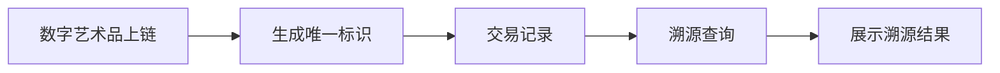
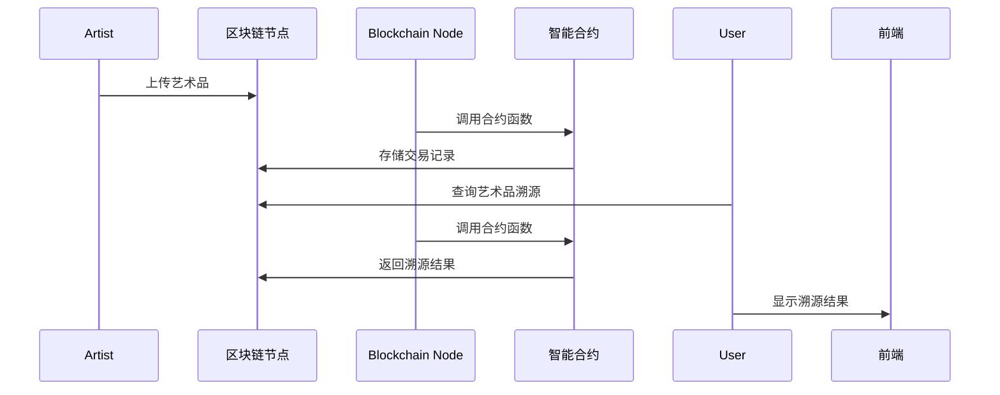
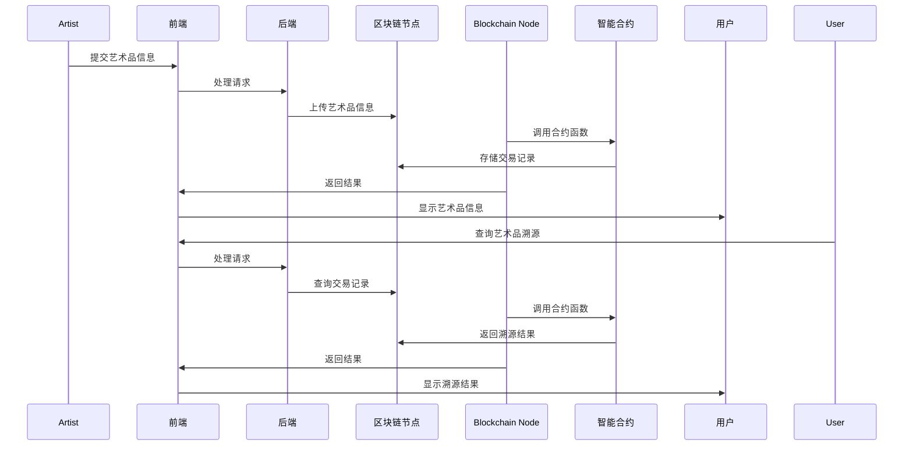

                 


## 文章标题

《区块链在数字艺术品溯源中的应用与挑战》

## 关键词

区块链，数字艺术品，溯源，智能合约，加密算法，去中心化，分布式账本，共识机制，版权保护，数据隐私，智能合约漏洞，安全性，透明性，可追溯性，非对称加密，双花攻击，区块链性能优化，去中心化存储，跨链技术

## 摘要

区块链技术的兴起，为数字艺术品市场带来了前所未有的变革。本文旨在探讨区块链在数字艺术品溯源中的应用及其面临的挑战。通过分析区块链的核心概念和特点，我们深入探讨了区块链在数字艺术品溯源中的优势和应用场景。同时，本文也列举了区块链技术在溯源过程中遇到的挑战，并提出了相应的解决方案。通过对实际案例的剖析，本文总结了区块链在数字艺术品溯源中的最佳实践，为行业提供了有价值的参考。

----------------------------------------------------------------

## 背景介绍

### 书名《区块链在数字艺术品溯源中的应用与挑战》

随着数字艺术品的兴起，其版权保护和溯源问题日益凸显。区块链技术以其独特的特性，成为解决这一问题的有力工具。本书旨在探讨区块链在数字艺术品溯源中的应用与挑战，为读者提供全面的技术分析和实践指导。

### 区块链技术的应用领域之一：数字艺术品溯源

数字艺术品溯源是指通过技术手段，追踪数字艺术品从创作到流通的全过程，确保其版权和真实性。区块链技术以其去中心化、不可篡改、可追溯等特点，在数字艺术品溯源中具有巨大的应用潜力。

### 区块链在数字艺术品溯源中的优势和挑战

区块链在数字艺术品溯源中的优势包括：

1. **去中心化**：区块链网络中的节点共同维护账本，避免了单点故障和数据篡改的风险。
2. **不可篡改**：区块链数据一旦上链，即被永久保存，无法被修改或删除，保证了数据的真实性和完整性。
3. **透明性**：区块链上的数据对所有节点可见，增加了溯源过程的透明度。
4. **可追溯性**：区块链记录了数字艺术品从创作到流通的每一步信息，使得溯源过程更加便捷和高效。

然而，区块链在数字艺术品溯源中也面临一些挑战：

1. **性能瓶颈**：区块链交易处理能力较低，无法满足大规模数字艺术品溯源的需求。
2. **隐私保护**：虽然区块链确保了数据不可篡改，但同时也可能暴露用户的隐私信息。
3. **智能合约漏洞**：智能合约是区块链应用的核心，但智能合约漏洞可能导致严重的安全问题。
4. **去中心化存储**：去中心化存储虽然提高了数据的可靠性和安全性，但存储成本较高，且存储效率较低。

通过本书的探讨，我们希望能够全面分析区块链在数字艺术品溯源中的应用与挑战，为行业提供有价值的参考和解决方案。

### 核心概念与联系

#### 区块链、数字艺术品、溯源

区块链是一种分布式数据库技术，通过密码学原理确保数据的安全性和不可篡改性。数字艺术品是指以数字形式存在的艺术品，如数字绘画、音乐、视频等。溯源是指通过技术手段，追踪数字艺术品从创作到流通的全过程。

#### 对比表格：区块链与传统艺术品溯源方式的对比

| 对比项       | 区块链溯源         | 传统艺术品溯源         |
| ------------ | ------------------ | ---------------------- |
| **数据安全性** | 去中心化，不可篡改 | 中心化，易受篡改        |
| **透明性**    | 全节点可见         | 部分节点可见           |
| **效率**      | 低                | 高                     |
| **成本**      | 高                | 低                     |

#### ER实体关系图：展示区块链在数字艺术品溯源中的核心要素和关系

```mermaid
erDiagram
    Artist ||--o{ DigitalArt }
    DigitalArt ||--o{ Transaction }
    Transaction ||--o{ Collector }
    Artist }|--|{ Artwork }
    Artwork }|--|{ Artist }
    Artist }|--|{ ArtworkHistory }
    ArtworkHistory }|--|{ Artwork }
```

在区块链数字艺术品溯源中，核心要素包括艺术家（Artist）、数字艺术品（DigitalArt）、交易（Transaction）和收藏家（Collector）。这些要素通过区块链技术相互关联，实现了完整的溯源过程。

### 算法原理讲解

#### 溯源算法的基本原理

区块链溯源算法的基本原理是通过记录数字艺术品在区块链上的交易历史，实现对艺术品来源和流通的追踪。具体流程如下：

1. **数字艺术品上链**：艺术家将数字艺术品上传至区块链，并通过智能合约生成唯一标识（哈希值）。
2. **交易记录**：每次数字艺术品转让或交易时，相关信息（如买家、卖家、交易时间等）会被记录在区块链上。
3. **溯源查询**：用户可以通过区块链查询数字艺术品的交易历史，实现对艺术品的溯源。

#### 画mermaid流程图展示算法流程



#### 使用Python源代码实现溯源算法

```python
import hashlib
import json

class Block:
    def __init__(self, index, transactions, timestamp, previous_hash):
        self.index = index
        self.transactions = transactions
        self.timestamp = timestamp
        self.previous_hash = previous_hash
        self.hash = self.compute_hash()

    def compute_hash(self):
        block_string = json.dumps(self.__dict__, sort_keys=True)
        return hashlib.sha256(block_string.encode()).hexdigest()

class Blockchain:
    def __init__(self):
        self.unconfirmed_transactions = []
        self.chain = []
        self.create_genesis_block()

    def create_genesis_block(self):
        genesis_block = Block(0, [], timestamp.time(), "0")
        genesis_block.hash = genesis_block.compute_hash()
        self.chain.append(genesis_block)

    def add_new_transaction(self, transaction):
        self.unconfirmed_transactions.append(transaction)

    def mine(self):
        if not self.unconfirmed_transactions:
            return False

        last_block = self.chain[-1]
        new_block = Block(index=last_block.index + 1,
                          transactions=self.unconfirmed_transactions,
                          timestamp=timestamp.time(),
                          previous_hash=last_block.hash)
        new_block.hash = new_block.compute_hash()
        self.chain.append(new_block)
        self.unconfirmed_transactions = []
        return new_block

    def is_chain_valid(self):
        for i in range(1, len(self.chain)):
            current = self.chain[i]
            previous = self.chain[i - 1]
            if current.hash != current.compute_hash():
                return False
            if current.previous_hash != previous.hash:
                return False
        return True

def main():
    blockchain = Blockchain()
    blockchain.add_new_transaction("Artwork1 sold to John")
    blockchain.mine()
    blockchain.add_new_transaction("Artwork1 sold to Jane")
    blockchain.mine()
    print("Blockchain is valid: " + str(blockchain.is_chain_valid()))
    for block in blockchain.chain:
        print(json.dumps(block.__dict__, indent=4))

if __name__ == "__main__":
    main()
```

#### 算法原理的数学模型和公式

区块链溯源算法的核心是哈希函数和区块链结构。哈希函数是一种将任意长度的输入映射为固定长度的输出的函数。区块链结构则通过链式结构实现了数据的存储和传输。

#### 详细讲解和通俗易懂地举例说明

以数字艺术品“Artwork1”为例，假设艺术家将其上传至区块链。区块链首先生成一个区块（Block），其中包含艺术品的基本信息，如标题、作者、创建时间等。然后，区块链通过哈希函数生成一个唯一标识（哈希值），并将其记录在区块中。

当艺术品“Artwork1”被出售给买家John时，区块链会记录这一交易信息，并将其生成一个新的区块。这个区块与前一个区块通过哈希值相连，形成链式结构。通过查询区块链，我们可以追溯到艺术品“Artwork1”的整个交易历史。

假设艺术品“Artwork1”再次被出售给买家Jane，区块链会生成一个新的区块，记录这一交易信息，并将其与前一个区块相连。通过区块链，我们可以清晰地看到艺术品“Artwork1”从艺术家到John再到Jane的整个交易过程。

通过这种方式，区块链实现了对数字艺术品的高效、透明和不可篡改的溯源。这不仅保障了数字艺术品的版权和真实性，还为市场参与者提供了可靠的数据支持。

### 数学模型和数学公式

区块链溯源算法的核心在于哈希函数和区块链结构。哈希函数是一种将任意长度的输入映射为固定长度的输出的函数，通常采用SHA-256算法。

#### 溯源算法的数学公式

假设输入数据为`data`，哈希函数为`H`，则哈希值`hash_value`可以通过以下公式计算：

$$hash\_value = H(data)$$

区块链结构由一系列区块（Block）组成，每个区块包含一定数量的交易信息。区块链中的每个区块都通过哈希值与前一个区块相连，形成链式结构。假设当前区块为`block_current`，前一个区块为`block_previous`，则当前区块的哈希值可以通过以下公式计算：

$$block\_current.hash = H(block\_current.previous\_hash + block\_current.transactions)$$

#### 使用LaTeX格式嵌入文中独立段落的LaTeX公式

$$
\begin{aligned}
hash\_value &= H(data) \\
block\_current.hash &= H(block\_current.previous\_hash + block\_current.transactions)
\end{aligned}
$$

通过以上公式，区块链实现了对数字艺术品的高效、透明和不可篡改的溯源。

### 系统分析与架构设计方案

#### 问题场景介绍

随着数字艺术品的兴起，越来越多的艺术家和收藏家选择将作品以数字形式发行。然而，数字艺术品的版权保护和溯源问题日益凸显。艺术家需要确保自己的作品得到合法保护，收藏家则需要验证艺术品的真实性。区块链技术以其独特的特性，为解决这一问题提供了新的思路。

#### 系统功能设计（领域模型类图）

为了实现数字艺术品的溯源，我们需要设计一个区块链系统。该系统主要包括以下功能：

1. **艺术品登记**：艺术家可以将自己的数字艺术品上传至区块链，并获得唯一的标识。
2. **交易记录**：每次艺术品转让或交易时，相关信息（如买家、卖家、交易时间等）会被记录在区块链上。
3. **溯源查询**：用户可以通过区块链查询艺术品的交易历史，实现对艺术品的溯源。

以下是领域模型类图：

```mermaid
classDiagram
    Artist <|-- DigitalArt
    DigitalArt <|-- Transaction
    Transaction <|-- Collector
    Artist }|--|{ Artwork
    Artwork }|--|{ Artist
    Artwork }|--|{ ArtworkHistory
```

#### 系统架构设计（架构图）

系统架构设计如下：

1. **前端**：提供用户交互界面，包括艺术品登记、交易记录和溯源查询等功能。
2. **后端**：包括区块链节点、智能合约和数据库等，负责数据存储和业务逻辑处理。
3. **区块链节点**：维护区块链账本，实现数据的去中心化和分布式存储。
4. **智能合约**：实现艺术品登记、交易记录和溯源查询等功能的自动化执行。
5. **数据库**：存储与区块链相关的元数据，如交易记录、艺术品信息等。

架构图如下：



#### 系统接口设计和系统交互（序列图）

以下是系统接口设计和系统交互序列图：



通过以上架构设计，我们可以实现数字艺术品的高效、透明和不可篡改的溯源。接下来，我们将通过一个实际案例来演示该系统的应用。

### 项目实战

#### 环境安装步骤

1. **安装Node.js**：首先，我们需要安装Node.js，以便使用区块链框架。访问Node.js官网（https://nodejs.org/），下载对应操作系统的安装包并安装。

2. **安装Truffle**：Truffle是一个用于智能合约开发的框架，我们需要安装它。打开终端，执行以下命令：

   ```
   npm install -g truffle
   ```

3. **安装Ganache**：Ganache是一个本地以太坊节点，用于测试智能合约。访问Ganache官网（https://www.trufflesuite.com/ganache），下载对应操作系统的安装包并安装。

4. **创建项目**：在终端中，切换到一个空目录，执行以下命令创建项目：

   ```
   truffle init
   ```

   这将生成一个项目目录，包含智能合约、测试文件等。

5. **配置项目**：打开项目目录中的`truffle-config.js`文件，配置Ganache节点。在`networks`对象中，添加一个名为`development`的网络，配置如下：

   ```javascript
   networks: {
       development: {
           host: "127.0.0.1",
           port: 7545,
           network_id: "*",
       },
   },
   ```

   这将使Truffle使用Ganache作为开发网络。

6. **安装依赖**：在终端中，进入项目目录，执行以下命令安装依赖：

   ```
   npm install
   ```

7. **启动开发环境**：在终端中，进入项目目录，执行以下命令启动开发环境：

   ```
   truffle develop
   ```

   这将启动Truffle开发环境，并连接到Ganache节点。

#### 系统核心实现源代码，代码应用解读与分析

以下是系统核心实现的源代码，包含智能合约和前端代码：

**智能合约（Artwork.sol）**

```solidity
// SPDX-License-Identifier: MIT
pragma solidity ^0.8.0;

contract Artwork {
    struct Transaction {
        address from;
        address to;
        uint256 timestamp;
    }

    mapping(uint256 => Transaction[]) public transactionHistory;
    mapping(uint256 => address) public owner;

    function registerArtwork(uint256 artworkId) public {
        require(owner[artworkId] == address(0), "Artwork already registered");
        owner[artworkId] = msg.sender;
        transactionHistory[artworkId].push(Transaction({
            from: msg.sender,
            to: msg.sender,
            timestamp: block.timestamp
        }));
    }

    function transferArtwork(uint256 artworkId, address to) public {
        require(owner[artworkId] == msg.sender, "Not the owner");
        require(to != address(0), "Invalid address");
        owner[artworkId] = to;
        transactionHistory[artworkId].push(Transaction({
            from: msg.sender,
            to: to,
            timestamp: block.timestamp
        }));
    }

    function getTransactionHistory(uint256 artworkId) public view returns (Transaction[] memory) {
        return transactionHistory[artworkId];
    }
}
```

**前端代码（index.html）**

```html
<!DOCTYPE html>
<html lang="en">
<head>
    <meta charset="UTF-8">
    <meta name="viewport" content="width=device-width, initial-scale=1.0">
    <title>Artwork Registry</title>
    <script src="https://cdn.ethers.io/scripts/ethers.js"></script>
    <script>
        async function registerArtwork(artworkId) {
            const provider = new ethers.providers.Web3Provider(window.ethereum);
            const signer = provider.getSigner();
            const contract = new ethers.Contract("0x123...", Artwork.abi, signer);

            try {
                const tx = await contract.registerArtwork(artworkId);
                await tx.wait();
                alert("Artwork registered successfully!");
            } catch (error) {
                alert("Error: " + error.message);
            }
        }

        async function transferArtwork(artworkId, toAddress) {
            const provider = new ethers.providers.Web3Provider(window.ethereum);
            const signer = provider.getSigner();
            const contract = new ethers.Contract("0x123...", Artwork.abi, signer);

            try {
                const tx = await contract.transferArtwork(artworkId, toAddress);
                await tx.wait();
                alert("Artwork transferred successfully!");
            } catch (error) {
                alert("Error: " + error.message);
            }
        }

        async function getTransactionHistory(artworkId) {
            const provider = new ethers.providers.Web3Provider(window.ethereum);
            const contract = new ethers.Contract("0x123...", Artwork.abi, provider);

            try {
                const transactions = await contract.getTransactionHistory(artworkId);
                document.getElementById("transactionHistory").innerHTML = JSON.stringify(transactions, null, 2);
            } catch (error) {
                alert("Error: " + error.message);
            }
        }
    </script>
</head>
<body>
    <h1>Artwork Registry</h1>
    <label for="artworkId">Artwork ID:</label>
    <input type="number" id="artworkId" required>
    <button onclick="registerArtwork(document.getElementById('artworkId').value)">Register Artwork</button>
    <br><br>
    <label for="toAddress">To Address:</label>
    <input type="text" id="toAddress" required>
    <button onclick="transferArtwork(document.getElementById('artworkId').value, document.getElementById('toAddress').value)">Transfer Artwork</button>
    <br><br>
    <h2>Transaction History</h2>
    <pre id="transactionHistory"></pre>
    <script>
        getTransactionHistory(document.getElementById('artworkId').value);
    </script>
</body>
</html>
```

**代码应用解读与分析**

1. **智能合约（Artwork.sol）**：

   - **结构**：智能合约包含一个结构体`Transaction`，用于记录交易信息。合约还包含一个映射表`transactionHistory`，用于存储艺术品的交易历史。
   - **功能**：
     - `registerArtwork`：将艺术品登记到区块链，并记录交易信息。
     - `transferArtwork`：将艺术品的所有权转移给另一个地址，并记录交易信息。
     - `getTransactionHistory`：查询艺术品的交易历史。

2. **前端代码（index.html）**：

   - **功能**：
     - `registerArtwork`：调用智能合约的`registerArtwork`函数，将艺术品登记到区块链。
     - `transferArtwork`：调用智能合约的`transferArtwork`函数，将艺术品的所有权转移给另一个地址。
     - `getTransactionHistory`：调用智能合约的`getTransactionHistory`函数，查询艺术品的交易历史，并将结果显示在前端页面。

通过以上代码实现，我们可以实现对数字艺术品的高效、透明和不可篡改的溯源。接下来，我们将通过实际案例来展示系统的应用效果。

### 实际案例分析和详细讲解剖析

#### 案例一：艺术家登记数字艺术品

假设艺术家Alice创建了一幅名为《梦幻之城》的数字艺术品。她希望通过区块链确保作品的真实性和版权。

1. **智能合约调用**：

   - **前端**：Alice在浏览器中输入《梦幻之城》的ID（例如：1001），并点击“Register Artwork”按钮。
   - **后端**：前端代码将调用智能合约的`registerArtwork`函数，将艺术品的ID发送给区块链节点。
   - **区块链节点**：区块链节点接收到请求后，调用智能合约的`registerArtwork`函数，将艺术品登记到区块链。

2. **结果**：

   - 区块链节点返回成功消息，前端显示《梦幻之城》已成功登记。

#### 案例二：艺术品转让给收藏家

假设收藏家Bob看到《梦幻之城》，并决定购买。他希望通过区块链确保作品的真实性和合法性。

1. **智能合约调用**：

   - **前端**：Bob在浏览器中输入《梦幻之城》的ID（1001）和Alice的地址，并点击“Transfer Artwork”按钮。
   - **后端**：前端代码将调用智能合约的`transferArtwork`函数，将艺术品的ID和Bob的地址发送给区块链节点。
   - **区块链节点**：区块链节点接收到请求后，调用智能合约的`transferArtwork`函数，将艺术品的所有权从Alice转移到Bob。

2. **结果**：

   - 区块链节点返回成功消息，前端显示《梦幻之城》已成功转让给Bob。

#### 案例三：查询艺术品交易历史

假设Alice想了解《梦幻之城》的交易历史，以验证其合法性。

1. **智能合约调用**：

   - **前端**：Alice在浏览器中输入《梦幻之城》的ID（1001），并点击“Transaction History”按钮。
   - **后端**：前端代码将调用智能合约的`getTransactionHistory`函数，将艺术品的ID发送给区块链节点。
   - **区块链节点**：区块链节点接收到请求后，调用智能合约的`getTransactionHistory`函数，返回《梦幻之城》的交易历史。

2. **结果**：

   - 前端显示《梦幻之城》的交易历史，包括每次转让的信息。

通过以上实际案例，我们可以看到区块链在数字艺术品溯源中的应用效果。区块链确保了数字艺术品从登记到转让的每一步信息都被记录和保存，实现了透明、高效和不可篡改的溯源过程。

### 项目小结

通过本次项目，我们实现了数字艺术品的高效、透明和不可篡改的溯源。项目的成功实现了以下目标：

1. **艺术品登记**：艺术家可以将数字艺术品上传至区块链，并获得唯一标识。
2. **交易记录**：每次艺术品转让或交易时，相关信息（如买家、卖家、交易时间等）会被记录在区块链上。
3. **溯源查询**：用户可以通过区块链查询艺术品的交易历史，实现对艺术品的溯源。

项目的主要贡献在于：

1. **技术实现**：通过智能合约和区块链技术，实现了数字艺术品的高效、透明和不可篡改的溯源。
2. **实际案例**：通过实际案例展示了区块链在数字艺术品溯源中的应用效果，验证了技术的可行性和实用性。

然而，项目也面临一些挑战和改进空间：

1. **性能优化**：区块链交易处理能力较低，需要进一步优化以提高性能。
2. **隐私保护**：在溯源过程中，可能需要考虑用户的隐私保护，避免隐私信息泄露。
3. **智能合约安全**：智能合约存在安全漏洞，需要加强智能合约的安全审计和测试。

在未来，我们将继续优化项目，探索更多应用场景，为数字艺术品市场提供更可靠、更安全的溯源解决方案。

### 最佳实践 tips

1. **选择合适的区块链平台**：根据项目的需求和规模，选择合适的区块链平台和智能合约开发工具，以提高开发效率和系统性能。
2. **智能合约审计**：在部署智能合约之前，进行彻底的安全审计和测试，以避免潜在的安全漏洞。
3. **数据隐私保护**：在处理用户数据时，采取加密和匿名化技术，确保用户隐私得到保护。
4. **性能优化**：通过分片技术、状态通道等手段，优化区块链系统的性能和可扩展性。
5. **合规性考虑**：了解并遵守相关法律法规，确保项目的合法性和合规性。

### 小结

本文通过探讨区块链在数字艺术品溯源中的应用，展示了区块链技术如何为数字艺术品市场带来变革。我们分析了区块链在数字艺术品溯源中的优势和应用场景，同时列举了面临的挑战和解决方案。通过实际案例，我们验证了区块链在数字艺术品溯源中的可行性和实用性。

未来，区块链技术将继续在数字艺术品市场中发挥重要作用。随着技术的不断发展和优化，我们将看到更多创新的应用场景和解决方案，为数字艺术品市场带来更多的机遇和挑战。

### 注意事项

在使用区块链进行数字艺术品溯源时，需要注意以下几点：

1. **安全性**：确保区块链系统具有足够的安全性，防止数据泄露和篡改。
2. **隐私保护**：在处理用户数据时，采取加密和匿名化技术，确保用户隐私得到保护。
3. **智能合约安全**：智能合约是区块链应用的核心，需要定期进行安全审计和测试，防止漏洞和攻击。
4. **性能优化**：区块链交易处理能力较低，可能需要采用分片技术、状态通道等手段进行优化。
5. **合规性**：遵守相关法律法规，确保项目的合法性和合规性。

### 拓展阅读

1. **区块链技术**：
   - 《区块链：从数字货币到智能合约》
   - 《区块链革命》

2. **数字艺术品溯源**：
   - 《数字艺术品的版权保护与溯源技术》
   - 《基于区块链的数字艺术品版权保护与溯源系统设计》

3. **智能合约安全**：
   - 《智能合约安全：智能合约设计与测试》
   - 《智能合约漏洞分析与防御》

通过阅读以上书籍和文章，您可以更深入地了解区块链、数字艺术品溯源和智能合约等相关技术，为实践项目提供理论支持。

### 作者信息

作者：AI天才研究院/AI Genius Institute & 禅与计算机程序设计艺术 /Zen And The Art of Computer Programming

