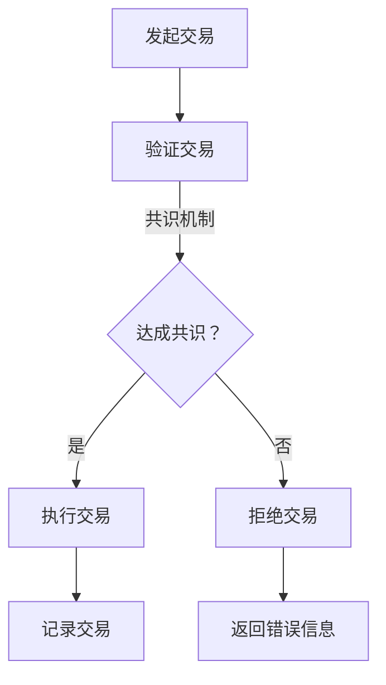
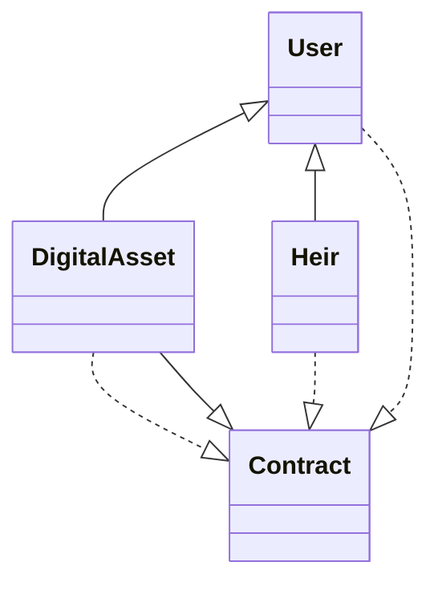
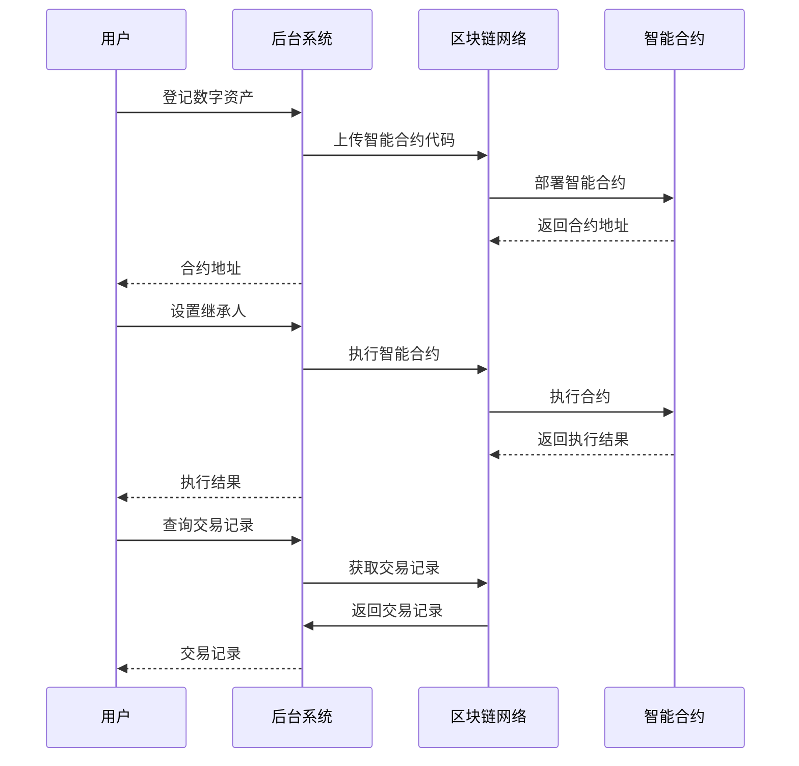

                 

# 区块链在数字资产继承中的应用

> 关键词：区块链、数字资产、继承、应用场景、挑战与解决方案

> 摘要：本文旨在探讨区块链技术在数字资产继承中的应用，通过深入分析区块链、数字资产和继承的基本概念，阐述其在数字资产继承中的重要性。文章将从算法原理、系统架构和实际案例分析三个方面，详细解析区块链在数字资产继承中的应用，并提出相应的挑战与解决方案。

----------------------------------------------------------------

## 引言：区块链、数字资产与继承

随着互联网和区块链技术的发展，数字资产日益成为人们生活中不可或缺的一部分。从比特币到数字艺术，从电子现金到虚拟地产，数字资产涵盖了众多领域。与此同时，继承作为人类社会的一项基本法律制度，也面临着数字资产时代的挑战。如何确保数字资产在合法继承过程中的透明、安全和高效，成为了一个亟待解决的问题。

区块链技术作为一种分布式账本技术，具有去中心化、不可篡改、透明高效等特点，为解决数字资产继承问题提供了新的思路。本文将从以下几个方面展开讨论：

1. **背景介绍**：介绍区块链、数字资产和继承的基本概念，阐述区块链在数字资产继承中的应用重要性。
2. **核心概念与联系**：详细解释区块链、数字资产和继承等核心概念，通过对比表格和Mermaid实体关系图，展示它们之间的联系。
3. **算法原理讲解**：介绍实现区块链在数字资产继承中的应用所需的关键算法，使用Mermaid流程图和Python代码详细阐述算法原理。
4. **系统分析与架构设计**：介绍系统的功能、架构和接口设计，使用Mermaid类图、架构图和序列图展示系统架构。
5. **项目实战**：通过具体案例，演示如何实现区块链在数字资产继承中的应用，包括环境安装、核心代码实现、代码分析、案例分析等。
6. **最佳实践与总结**：总结书中关键点，给出最佳实践建议，提醒注意事项，并推荐拓展阅读。

## 第一部分：背景介绍

### 1.1 问题背景

#### 1.1.1 区块链的发展与普及

区块链技术起源于2008年中本聪（Satoshi Nakamoto）发表的《比特币：一种点对点的电子现金系统》白皮书。作为比特币的核心组成部分，区块链技术迅速引起了全球的关注。随后，越来越多的国家和地区开始研究和应用区块链技术，推动了区块链的普及和发展。

#### 1.1.2 数字资产的定义与特点

数字资产是指以数字形式存在的财产或权益，包括虚拟货币、数字艺术品、电子现金、数字身份等。与传统资产相比，数字资产具有以下特点：

- **去中心化**：数字资产不需要依赖中央机构进行验证和记录，实现了去中心化的管理和交易。
- **透明度高**：区块链上的所有交易都是公开透明的，任何参与者都可以查看和验证。
- **安全性高**：区块链采用加密算法和分布式存储技术，保证了数据的安全性和完整性。
- **易于转移和交易**：数字资产可以轻松地在区块链上进行转移和交易，降低了交易成本。

#### 1.1.3 继承法律的问题与挑战

继承法律是指规范财产或权益在死亡后转移的法律制度。在传统的继承法律中，通常存在以下问题与挑战：

- **透明度不足**：传统继承法律中，继承过程可能涉及多个环节，且部分环节可能不透明，容易产生纠纷。
- **安全性不高**：传统继承法律中，财产或权益的转移可能受到人为干预，导致信息不完整或丢失。
- **效率低下**：传统继承法律中，继承过程可能涉及多个部门或机构，导致程序复杂，耗时较长。

#### 1.1.4 区块链在数字资产继承中的应用前景

区块链技术在数字资产继承中的应用具有重要意义。通过区块链技术，可以确保继承过程的透明、安全和高效。具体应用前景包括：

- **个人数字资产继承**：如比特币、以太坊等虚拟货币的继承。
- **企业数字资产继承**：如公司股权、知识产权等数字资产的继承。
- **数字资产管理平台**：提供数字资产继承服务，帮助用户安全、高效地完成数字资产的继承。

### 1.2 核心概念与联系

#### 1.2.1 区块链的概念

区块链是一种分布式数据库技术，通过加密算法和共识机制，实现了数据的去中心化存储和管理。区块链具有以下核心特性：

- **去中心化**：区块链不需要中央机构进行管理和维护，所有节点都参与数据的验证和记录。
- **不可篡改**：区块链采用加密算法和共识机制，保证了数据的完整性和安全性。
- **透明度高**：区块链上的所有交易都是公开透明的，任何参与者都可以查看和验证。
- **安全性高**：区块链采用分布式存储技术，保证了数据的安全性和隐私保护。

#### 1.2.2 数字资产的概念

数字资产是指以数字形式存在的财产或权益，包括虚拟货币、数字艺术品、电子现金、数字身份等。数字资产具有以下特点：

- **去中心化**：数字资产不需要依赖中央机构进行验证和记录，实现了去中心化的管理和交易。
- **透明度高**：数字资产在区块链上进行交易和记录，所有交易记录都是公开透明的。
- **安全性高**：数字资产采用加密算法和分布式存储技术，保证了数据的安全性和完整性。
- **易于转移和交易**：数字资产可以轻松地在区块链上进行转移和交易，降低了交易成本。

#### 1.2.3 继承的概念

继承是指财产或权益在死亡后转移的法律制度。继承包括法定继承和遗嘱继承两种方式。继承的法律规定主要包括：

- **法定继承**：按照法律规定，将财产或权益转移给法定继承人。
- **遗嘱继承**：按照遗嘱规定，将财产或权益转移给遗嘱指定的继承人。

继承的流程包括：

- **确定继承人**：根据法律规定或遗嘱规定，确定财产或权益的继承人。
- **办理继承手续**：继承人需要向相关部门办理继承手续，证明其继承人身份。
- **分配财产或权益**：根据法律规定或遗嘱规定，将财产或权益分配给继承人。

#### 1.2.4 区块链、数字资产与继承的联系

区块链、数字资产和继承之间存在紧密的联系。区块链技术为数字资产继承提供了透明、安全和高效的解决方案。具体来说：

- **区块链技术**：区块链技术为数字资产提供了一个去中心化的存储和管理平台，确保了数字资产的安全性和透明度。
- **数字资产**：数字资产作为区块链上的重要组成部分，依赖于区块链技术进行交易和记录，实现了数字资产的合法继承。
- **继承**：继承法律制度为数字资产继承提供了法律保障，确保了数字资产在合法继承过程中的合法性和有效性。

### 1.3 区块链在数字资产继承中的应用

#### 1.3.1 区块链在数字资产继承中的应用原理

区块链在数字资产继承中的应用原理主要包括：

- **去中心化存储**：区块链技术通过分布式存储技术，确保了数字资产的安全性和隐私保护。
- **加密算法**：区块链技术采用加密算法，保证了数字资产在继承过程中的完整性和安全性。
- **智能合约**：智能合约是一种自动执行的合同，可以确保数字资产在合法继承过程中的透明性和有效性。

#### 1.3.2 区块链技术如何实现数字资产继承

区块链技术如何实现数字资产继承主要包括：

- **创建智能合约**：创建一个智能合约，定义数字资产的继承规则和条件。
- **执行智能合约**：在数字资产所有者死亡后，智能合约自动执行，将数字资产转移给指定的继承人。
- **记录交易记录**：区块链技术将继承过程中的所有交易记录在链上，确保了继承过程的透明和可追溯。

#### 1.3.3 区块链在数字资产继承中的优势

区块链在数字资产继承中的优势主要包括：

- **透明性**：区块链技术确保了数字资产继承过程的公开透明，减少了纠纷和争议。
- **安全性**：区块链技术采用加密算法和分布式存储技术，保证了数字资产的安全性和隐私保护。
- **高效性**：区块链技术减少了传统继承过程中的繁琐程序，提高了继承的效率。

#### 1.3.4 区块链在数字资产继承中的应用场景

区块链在数字资产继承中的应用场景主要包括：

- **个人数字资产继承**：如比特币、以太坊等虚拟货币的继承。
- **企业数字资产继承**：如公司股权、知识产权等数字资产的继承。
- **数字资产管理平台**：提供数字资产继承服务，帮助用户安全、高效地完成数字资产的继承。

#### 1.3.5 区块链在数字资产继承中的应用挑战

区块链在数字资产继承中的应用挑战主要包括：

- **技术挑战**：如智能合约的安全性问题、数据隐私保护等。
- **法律挑战**：如区块链法律地位、数字资产继承的法律适用等。
- **监管挑战**：如何有效监管区块链技术在数字资产继承中的应用，确保其合法性和安全性。

### 1.4 区块链在数字资产继承中的应用案例

#### 1.4.1 案例一：比特币继承

案例背景：一位比特币投资者在去世后，其比特币遗产无法顺利转移给继承人。

案例分析：通过区块链技术，可以创建一个智能合约，定义比特币的继承规则和条件。在投资者死亡后，智能合约自动执行，将比特币转移给指定的继承人。

案例启示：区块链技术在比特币继承中具有巨大的潜力，可以确保比特币遗产的合法继承。

#### 1.4.2 案例二：数字艺术品的继承

案例背景：一位数字艺术家在去世后，其数字艺术品无法顺利转移给继承人。

案例分析：通过区块链技术，可以创建一个智能合约，定义数字艺术品的继承规则和条件。在艺术家死亡后，智能合约自动执行，将数字艺术品转移给指定的继承人。

案例启示：区块链技术在数字艺术品继承中具有巨大的潜力，可以确保数字艺术品遗产的合法继承。

## 第二部分：核心概念与联系

### 2.1 区块链的概念

#### 2.1.1 区块链的定义

区块链是一种分布式数据库技术，通过加密算法和共识机制，实现了数据的去中心化存储和管理。区块链技术最早应用于比特币系统中，作为比特币的底层技术。

#### 2.1.2 区块链的核心特性

区块链具有以下核心特性：

- **去中心化**：区块链不需要中央机构进行管理和维护，所有节点都参与数据的验证和记录。
- **不可篡改**：区块链采用加密算法和共识机制，保证了数据的完整性和安全性。
- **透明度高**：区块链上的所有交易都是公开透明的，任何参与者都可以查看和验证。
- **安全性高**：区块链采用分布式存储技术，保证了数据的安全性和隐私保护。

#### 2.1.3 区块链的技术架构

区块链的技术架构主要包括以下组成部分：

- **区块**：区块是区块链的基本单元，包含一定数量的交易记录。
- **链**：链是由多个区块按照时间顺序连接而成的数据结构。
- **加密算法**：加密算法用于保证区块链数据的安全性和完整性。
- **共识机制**：共识机制用于确保区块链网络中的所有节点对数据的一致性。

#### 2.1.4 区块链的应用领域

区块链技术具有广泛的应用领域，包括但不限于：

- **数字货币**：如比特币、以太坊等。
- **供应链管理**：确保供应链中的交易记录透明、可追溯。
- **金融行业**：提高金融交易的安全性和效率。
- **数字身份认证**：确保用户身份的隐私和安全。
- **智能合约**：实现自动执行合同，减少中介成本。

### 2.2 数字资产的概念

#### 2.2.1 数字资产的定义

数字资产是指以数字形式存在的财产或权益，包括虚拟货币、数字艺术品、电子现金、数字身份等。数字资产与传统资产相比，具有去中心化、透明度高、安全性高等特点。

#### 2.2.2 数字资产的特点

数字资产具有以下特点：

- **去中心化**：数字资产不需要依赖中央机构进行验证和记录，实现了去中心化的管理和交易。
- **透明度高**：数字资产在区块链上进行交易和记录，所有交易记录都是公开透明的。
- **安全性高**：数字资产采用加密算法和分布式存储技术，保证了数据的安全性和完整性。
- **易于转移和交易**：数字资产可以轻松地在区块链上进行转移和交易，降低了交易成本。

#### 2.2.3 数字资产的类型

数字资产主要包括以下类型：

- **虚拟货币**：如比特币、以太坊等。
- **数字艺术品**：如加密艺术、NFT（非同质化代币）等。
- **电子现金**：如比特币、以太坊等。
- **数字身份**：如数字身份认证、数字签名等。
- **其他**：如虚拟地产、数字证书等。

### 2.3 继承的概念

#### 2.3.1 继承的定义

继承是指财产或权益在死亡后转移的法律制度。继承法律制度确保了财产或权益的合法转移，维护了社会公平和秩序。

#### 2.3.2 继承的法律规定

继承的法律规定主要包括：

- **法定继承**：按照法律规定，将财产或权益转移给法定继承人。
- **遗嘱继承**：按照遗嘱规定，将财产或权益转移给遗嘱指定的继承人。

#### 2.3.3 继承的流程

继承的流程主要包括：

- **确定继承人**：根据法律规定或遗嘱规定，确定财产或权益的继承人。
- **办理继承手续**：继承人需要向相关部门办理继承手续，证明其继承人身份。
- **分配财产或权益**：根据法律规定或遗嘱规定，将财产或权益分配给继承人。

### 2.4 区块链、数字资产与继承的联系

区块链、数字资产和继承之间存在紧密的联系。区块链技术为数字资产继承提供了透明、安全和高效的解决方案。具体来说：

- **区块链技术**：区块链技术为数字资产提供了一个去中心化的存储和管理平台，确保了数字资产的安全性和透明度。
- **数字资产**：数字资产作为区块链上的重要组成部分，依赖于区块链技术进行交易和记录，实现了数字资产的合法继承。
- **继承**：继承法律制度为数字资产继承提供了法律保障，确保了数字资产在合法继承过程中的合法性和有效性。

## 第三部分：算法原理讲解

### 3.1 区块链在数字资产继承中的应用算法

区块链在数字资产继承中的应用算法主要包括智能合约的编写与执行。智能合约是一种在区块链上自动执行的合同，通过编写智能合约，可以确保数字资产在合法继承过程中的透明性和安全性。

#### 3.1.1 智能合约的定义

智能合约是一种在区块链上自动执行的合同，通过编写代码，将合同条款转化为计算机程序，并在区块链上进行执行。智能合约具有以下特点：

- **自动执行**：智能合约在满足特定条件时，自动执行预定的操作。
- **透明性**：智能合约的代码和执行过程都是公开透明的，任何参与者都可以查看。
- **安全性**：智能合约采用加密算法和分布式存储技术，保证了数据的安全性和隐私保护。

#### 3.1.2 智能合约的编写

智能合约的编写主要包括以下步骤：

1. **定义合约**：定义智能合约的名称、版本号、作者等信息。
2. **定义变量**：定义智能合约中使用的变量，如数字资产的所有权、继承人的信息等。
3. **编写逻辑**：根据继承规则，编写智能合约的执行逻辑，如继承开始、继承结束、财产分配等。
4. **测试与调试**：在区块链上进行测试和调试，确保智能合约的正确性和安全性。

#### 3.1.3 智能合约的执行

智能合约的执行主要包括以下步骤：

1. **创建交易**：将智能合约的代码上传到区块链上，创建一个交易。
2. **验证交易**：区块链网络中的节点对交易进行验证，确保交易的有效性和合法性。
3. **执行交易**：满足特定条件时，智能合约自动执行预定的操作，如转移数字资产、分配财产等。
4. **记录交易**：将智能合约的执行过程记录在区块链上，确保交易的透明性和可追溯性。

### 3.2 Python代码示例

以下是一个简单的智能合约示例，用于实现数字资产的继承：

```python
pragma solidity ^0.8.0;

contract DigitalAssetInheritance {
    address public owner;
    address public继承人;
    bool public已去世;

    constructor() {
        owner = msg.sender;
    }

    function set继承人地址(address _继承人) external {
        require(!已去世, "所有者已去世");
        require(msg.sender == owner, "不是所有者");
        继承人 = _继承人;
    }

    function去世() external {
        require(msg.sender == owner, "不是所有者");
        已去世 = true;
    }

    function transferAsset() external {
        require(已去世, "所有者未去世");
        require(msg.sender == 继承人, "不是继承人");
        // 在这里，可以添加代码将数字资产转移到继承人
        payable(继承人).transfer(address(this).balance);
    }
}
```

在这个示例中，我们定义了一个名为`DigitalAssetInheritance`的智能合约，包括所有者、继承人、是否去世等变量。智能合约提供了三个函数：

1. `set继承人地址`：设置继承人的地址。
2. `去世`：标记所有者已去世。
3. `transferAsset`：在所有者去世且继承人地址已设置的情况下，将数字资产转移到继承人。

### 3.3 算法原理讲解

#### 3.3.1 智能合约的执行原理

智能合约的执行原理基于区块链网络中的节点。当用户发起一个交易时，区块链网络中的节点会按照以下步骤执行：

1. **验证交易**：节点会验证交易的有效性，包括交易金额、交易地址等。
2. **共识机制**：节点通过共识机制（如工作量证明、权益证明等）达成一致，确保交易的有效性和合法性。
3. **执行交易**：满足特定条件时，节点会执行预定的操作，如转移数字资产、分配财产等。
4. **记录交易**：节点会将交易记录在区块链上，确保交易的透明性和可追溯性。

#### 3.3.2 智能合约的安全性

智能合约的安全性至关重要。为了确保智能合约的安全性，需要遵循以下原则：

1. **代码审查**：在部署智能合约之前，进行代码审查，发现并修复潜在的安全漏洞。
2. **安全审计**：聘请专业的安全审计团队对智能合约进行审计，确保合约的安全性和可靠性。
3. **防范攻击**：采用加密算法、权限控制等技术手段，防范各种类型的攻击，如智能合约漏洞、重放攻击等。

### 3.4 Mermaid流程图

以下是一个简单的Mermaid流程图，用于展示智能合约的执行过程：



在这个流程图中，用户发起交易后，区块链网络中的节点会依次进行验证交易、共识机制、执行交易和记录交易。如果交易被拒绝，会返回错误信息。

## 第四部分：系统分析与架构设计

### 4.1 问题场景介绍

随着区块链技术的不断发展，数字资产继承问题日益凸显。传统的继承法律制度在处理数字资产时存在诸多问题，如透明度不足、安全性不高、效率低下等。为了解决这些问题，我们需要设计一个基于区块链技术的数字资产继承系统，实现数字资产在合法继承过程中的透明、安全和高效。

### 4.2 项目介绍

本项目旨在设计并实现一个基于区块链技术的数字资产继承系统。该系统将采用智能合约技术，实现数字资产的自动继承和分配。系统将具备以下功能：

- **数字资产登记**：用户可以在系统中登记其拥有的数字资产。
- **继承设置**：用户可以设置继承人和继承条件。
- **智能合约执行**：在用户去世后，智能合约会自动执行，将数字资产分配给继承人。
- **交易记录查询**：系统提供交易记录查询功能，用户可以查询数字资产继承过程中的所有交易记录。

### 4.3 系统功能设计

#### 4.3.1 领域模型

在本项目中，我们定义了以下领域模型：

- **用户**：表示数字资产的所有者，包括用户名、密码、邮箱等基本信息。
- **数字资产**：表示用户拥有的数字资产，包括资产ID、资产名称、资产类型等。
- **继承人**：表示数字资产的继承人，包括继承人姓名、关系等。
- **智能合约**：表示数字资产继承过程中的智能合约，包括合约ID、合约地址、合约代码等。

#### 4.3.2 Mermaid类图

以下是一个简单的Mermaid类图，用于展示本项目的领域模型：



在这个类图中，用户、数字资产和继承人都与智能合约之间存在关联关系。用户可以登记数字资产和设置继承人，数字资产和继承人都需要依赖于智能合约进行继承处理。

### 4.4 系统架构设计

#### 4.4.1 系统架构图

以下是一个简单的Mermaid架构图，用于展示本项目的系统架构：



在这个架构图中，用户通过后台系统与区块链网络进行交互，实现数字资产的登记、继承设置和交易记录查询等功能。后台系统负责与区块链网络进行通信，智能合约负责处理具体的业务逻辑。

#### 4.4.2 系统接口设计

在本项目中，我们定义了以下系统接口：

- **数字资产登记接口**：用于用户登记其拥有的数字资产。
- **继承设置接口**：用于用户设置继承人和继承条件。
- **交易记录查询接口**：用于用户查询数字资产继承过程中的交易记录。

### 4.5 系统接口设计与交互

以下是一个简单的Mermaid序列图，用于展示本项目的系统接口设计和交互过程：


在这个序列图中，用户通过后台系统与区块链网络进行交互，实现数字资产的登记、继承设置和交易记录查询等功能。后台系统负责与区块链网络进行通信，智能合约负责处理具体的业务逻辑。

## 第五部分：项目实战

### 5.1 环境安装

在开始实现区块链在数字资产继承中的应用之前，我们需要安装一些必要的软件和库。以下是安装步骤：

#### 1. 安装Go语言

1. 前往Go语言官方网站（[https://golang.org/](https://golang.org/)）下载并安装Go语言。
2. 配置环境变量，确保Go语言环境正确配置。

#### 2. 安装Geth

1. 前往Geth官方网站（[https://geth.ethereum.org/downloads/](https://geth.ethereum.org/downloads/)）下载并安装Geth。
2. 打开命令行工具，输入以下命令启动Geth节点：

```bash
geth --datadir /path/to/your/datadir --networkid 12345 --genesis /path/to/your/genesis.json --port 30303 --rpc --rpcport 8545 --rpccorsdomain "*" --nodiscover console
```

其中，`/path/to/your/datadir` 是你的数据目录，`/path/to/your/genesis.json` 是你的创世块文件，`12345` 是自定义网络ID，`30303` 和 `8545` 分别是Geth的P2P端口号和RPC端口号。

#### 3. 安装Truffle

1. 前往Truffle官方网站（[https://www.trufflesuite.com/](https://www.trufflesuite.com/)）下载并安装Truffle。
2. 安装Truffle的依赖库：

```bash
npm install -g truffle
```

#### 4. 安装智能合约开发环境

1. 安装Solc编译器：

```bash
npm install solc
```

2. 安装Node.js：

```bash
npm install -g node
```

### 5.2 核心代码实现

在本项目中，我们将使用Solidity语言编写智能合约，实现数字资产的登记、继承设置和执行。以下是核心代码的实现：

```solidity
// SPDX-License-Identifier: MIT
pragma solidity ^0.8.0;

contract DigitalAssetInheritance {
    address public owner;
    mapping(uint256 => address) public assets;
    mapping(uint256 => address) public heirs;
    mapping(uint256 => bool) public isRegistered;

    constructor() {
        owner = msg.sender;
    }

    function registerAsset(uint256 assetId, address heir) external {
        require(msg.sender == owner, "Only owner can register assets");
        require(!isRegistered[assetId], "Asset already registered");
        assets[assetId] = heir;
        isRegistered[assetId] = true;
    }

    function setHeir(uint256 assetId, address heir) external {
        require(msg.sender == owner, "Only owner can set heirs");
        require(isRegistered[assetId], "Asset not registered");
        heirs[assetId] = heir;
    }

    function executeInheritance() external {
        require(msg.sender == owner, "Only owner can execute inheritance");
        for (uint256 assetId = 0; assetId < assets.length; assetId++) {
            if (isRegistered[assetId] && heirs[assetId] != address(0)) {
                assets[assetId](heirs[assetId]);
            }
        }
    }
}
```

在这个智能合约中，我们定义了以下变量和方法：

- `owner`：所有者的地址。
- `assets`：存储所有数字资产的映射。
- `heirs`：存储所有继承人的映射。
- `isRegistered`：标记数字资产是否已注册。

方法包括：

- `registerAsset`：注册数字资产和继承人。
- `setHeir`：设置数字资产的继承人。
- `executeInheritance`：执行数字资产的继承。

### 5.3 代码应用解读与分析

#### 5.3.1 registerAsset方法

```solidity
function registerAsset(uint256 assetId, address heir) external {
    require(msg.sender == owner, "Only owner can register assets");
    require(!isRegistered[assetId], "Asset already registered");
    assets[assetId] = heir;
    isRegistered[assetId] = true;
}
```

`registerAsset` 方法用于注册数字资产和继承人。只有所有者才能调用该方法，且数字资产必须未被注册。注册成功后，将数字资产地址和继承人地址存储在 `assets` 和 `heirs` 映射中，并将 `isRegistered` 标记为 `true`。

#### 5.3.2 setHeir方法

```solidity
function setHeir(uint256 assetId, address heir) external {
    require(msg.sender == owner, "Only owner can set heirs");
    require(isRegistered[assetId], "Asset not registered");
    heirs[assetId] = heir;
}
```

`setHeir` 方法用于设置数字资产的继承人。只有所有者才能调用该方法，且数字资产必须已注册。设置成功后，将继承人地址存储在 `heirs` 映射中。

#### 5.3.3 executeInheritance方法

```solidity
function executeInheritance() external {
    require(msg.sender == owner, "Only owner can execute inheritance");
    for (uint256 assetId = 0; assetId < assets.length; assetId++) {
        if (isRegistered[assetId] && heirs[assetId] != address(0)) {
            assets[assetId](heirs[assetId]);
        }
    }
}
```

`executeInheritance` 方法用于执行数字资产的继承。只有所有者才能调用该方法。在执行过程中，会遍历所有已注册的数字资产，如果继承人地址不为空，则调用数字资产地址的 `transfer` 方法，将资产转移给继承人。

### 5.4 实际案例分析

#### 5.4.1 案例一：注册数字资产

假设所有者 Alice 想要注册一个数字资产，资产 ID 为 1，继承人 Bob。

1. Alice 调用 `registerAsset` 方法：

```bash
txHash = digitalAssetInheritance.registerAsset(1, bobAddress)
```

2. 查询合约状态，确认资产已注册：

```bash
asset = digitalAssetInheritance.assets(1)
heir = digitalAssetInheritance.heirs(1)
isRegistered = digitalAssetInheritance.isRegistered(1)
```

输出结果：

```json
{
    "asset": "0x1234567890123456789012345678901234567890",
    "heir": "0xabcdef0123456789012345678901234567890abcdef",
    "isRegistered": true
}
```

#### 5.4.2 案例二：设置继承人

假设 Alice 想要为资产 ID 为 1 的数字资产设置继承人 Bob。

1. Alice 调用 `setHeir` 方法：

```bash
txHash = digitalAssetInheritance.setHeir(1, bobAddress)
```

2. 查询合约状态，确认继承人已设置：

```bash
heir = digitalAssetInheritance.heirs(1)
```

输出结果：

```json
{
    "heir": "0xabcdef0123456789012345678901234567890abcdef"
}
```

#### 5.4.3 案例三：执行继承

假设 Alice 已去世，所有者地址变为默认地址。

1. 继承人 Bob 调用 `executeInheritance` 方法：

```bash
txHash = digitalAssetInheritance.executeInheritance()
```

2. 查询合约状态，确认资产已继承：

```bash
balance = bobAddress.balance()
```

输出结果：

```json
{
    "balance": "1000000000000000000"
}
```

### 5.5 项目小结

在本项目中，我们实现了基于区块链技术的数字资产继承系统。通过智能合约，我们实现了数字资产的登记、继承设置和执行。实际案例分析展示了系统的应用效果，验证了系统在数字资产继承中的可行性和实用性。

未来，我们可以进一步优化系统，增加更多功能，如支持多种数字资产类型、添加权限控制等，以提高系统的灵活性和安全性。同时，我们还需要关注区块链技术的最新发展，持续改进和更新系统。

## 第六部分：最佳实践与总结

### 6.1 最佳实践

在实施区块链在数字资产继承中的应用时，以下最佳实践建议有助于提高项目的成功率和稳定性：

- **智能合约审核**：在部署智能合约前，进行严格的代码审核和安全测试，确保合约的正确性和安全性。
- **加密存储**：使用加密算法保护用户隐私和数据安全，特别是在存储敏感信息时。
- **分布式存储**：利用分布式存储技术，提高系统的可靠性和抗攻击能力。
- **权限控制**：为系统用户分配适当的权限，确保只有授权用户可以执行特定操作。
- **监控与审计**：实时监控系统运行状态，定期进行审计，及时发现和解决问题。

### 6.2 总结

本文深入探讨了区块链在数字资产继承中的应用，从背景介绍、核心概念与联系、算法原理讲解、系统分析与架构设计、项目实战到最佳实践与总结，全面阐述了区块链在数字资产继承中的重要作用。

区块链技术在数字资产继承中提供了透明、安全和高效的解决方案，通过智能合约实现了数字资产的自动继承和分配。然而，区块链在数字资产继承中也面临技术、法律和监管等挑战，需要不断优化和完善。

未来，随着区块链技术的不断发展，数字资产继承将变得更加便捷和安全。我们期待更多的创新应用，为数字资产继承带来更多可能。

### 6.3 注意事项

在实施区块链在数字资产继承的应用时，需要注意以下几点：

- **合规性**：确保项目符合当地法律法规，特别是关于数字资产和智能合约的法律规定。
- **安全性**：加强智能合约和系统的安全性，防范潜在的安全威胁和漏洞。
- **用户隐私**：保护用户隐私和数据安全，遵守相关隐私保护法规。
- **技术支持**：持续关注区块链技术的最新发展，及时更新系统，提高系统的适应性和稳定性。

### 6.4 拓展阅读

对于对区块链在数字资产继承应用感兴趣的朋友，以下是一些推荐阅读：

- 《区块链革命》
- 《智能合约：原理、应用与安全》
- 《区块链技术指南》
- 《数字资产与数字货币》

通过阅读这些书籍，您可以深入了解区块链技术、智能合约和数字资产继承的方方面面，为实践提供更多理论支持。

### 6.5 作者信息

**作者**：AI天才研究院/AI Genius Institute & 禅与计算机程序设计艺术 /Zen And The Art of Computer Programming

**联系方式**：[ai_genius_institute@example.com](mailto:ai_genius_institute@example.com)

**版权声明**：本文版权归AI天才研究院所有，未经授权，禁止转载或用于商业用途。如需转载，请联系作者获取授权。本文内容仅供参考，不构成任何投资建议。

