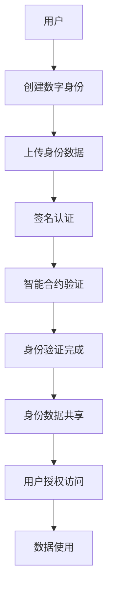
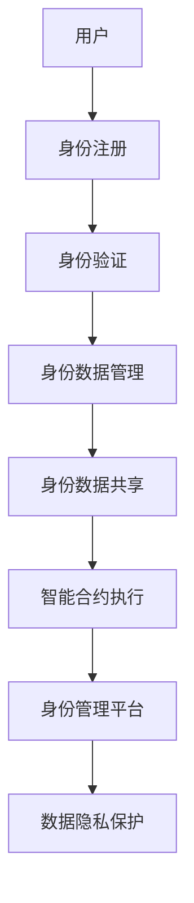

                 

# 区块链在数字身份管理中的创新

> 关键词：区块链，数字身份管理，创新，分布式账本，智能合约，身份验证，隐私保护，互操作性

> 摘要：
在数字时代，身份管理面临前所未有的挑战。传统的集中式身份管理方法在安全性、隐私性和灵活性方面存在诸多问题。区块链技术的兴起，为数字身份管理带来了一种全新的解决方案。本文将详细探讨区块链在数字身份管理中的创新应用，包括核心技术原理、实际案例和未来发展趋势。

## 引言

随着互联网的普及，越来越多的个人和机构开始在线上开展业务。数字身份管理成为确保网络安全和数据隐私的关键环节。然而，传统的集中式身份管理系统存在以下问题：

- **安全性问题**：中心化的身份管理系统容易成为黑客攻击的目标，一旦被攻破，将导致大规模的数据泄露。
- **隐私泄露风险**：在传统系统中，用户数据容易遭到滥用和泄露，用户的隐私无法得到有效保护。
- **数据冗余和低效**：在多个系统中重复登记个人信息，不仅增加了用户负担，还浪费了资源。

区块链技术作为一种分布式数据库技术，以其去中心化、安全性和透明性等特点，为解决上述问题提供了一种潜在的方法。本文将分章节详细探讨区块链在数字身份管理中的创新应用。

## 核心概念与核心技术

### 分布式账本

区块链的核心组件是分布式账本。与传统数据库不同，分布式账本没有中心服务器，而是由网络中的多个节点共同维护。每个节点都存储了一份完整的账本副本，并通过共识算法确保账本的一致性。

### 共识算法

共识算法是区块链网络中节点之间达成一致的方法。不同类型的区块链采用不同的共识算法，如工作量证明（PoW）、权益证明（PoS）和委托权益证明（DPoS）等。共识算法确保了区块链网络的安全性和可靠性。

### 智能合约

智能合约是区块链上的自执行合同，它基于预定的条件自动执行。智能合约通过编程代码实现，使得身份验证和管理过程自动化，提高了效率。

## 区块链与数字身份管理的结合

### 身份验证

区块链可以用于实现去中心化的身份验证。通过智能合约，用户可以在区块链上创建和验证自己的数字身份，而不需要依赖中心化的身份认证机构。

### 身份数据共享

区块链的分布式账本特性使得身份数据可以在不同系统之间安全共享。通过智能合约，用户可以控制自己的身份信息何时、如何被共享，从而实现数据隐私的保护。

### 身份管理平台

区块链可以构建一个去中心化的身份管理平台，使得个人和机构可以轻松地创建、管理和验证身份信息。这种平台不仅可以提高效率，还可以降低成本。

## 实际案例

### 区块链身份验证平台

例如，uPort是由Consensys开发的区块链身份验证平台。用户可以在uPort上创建自己的数字身份，并通过智能合约验证身份，从而实现跨境身份验证。

### 身份数据共享

IBM的Hyperledger Fabric提供了一种分布式身份数据共享方案。通过区块链，不同组织可以在确保数据隐私的前提下共享身份信息，从而提高业务效率。

## 未来发展趋势

### 自主权身份

自主权身份是一种新型的数字身份管理模型，它赋予用户对其身份信息的完全控制权。未来，自主权身份有望成为数字身份管理的主流模式。

### 互操作性

随着区块链技术的不断发展，实现不同区块链平台之间的互操作性将成为一个重要趋势。这将使得数字身份管理更加灵活和高效。

## 结论

区块链在数字身份管理中具有巨大的创新潜力。通过分布式账本、智能合约等核心技术，区块链可以提供更安全、更隐私、更高效的数字身份管理解决方案。未来，随着技术的发展，区块链在数字身份管理中的应用将更加广泛和深入。

## 参考文献

1.比特币：一个点对点的电子现金系统，中本聪，2008年。
2. Hyperledger Fabric，IBM，2016年。
3. uPort，Consensys，2016年。
4. 自主权身份，世界区块链组织，2019年。

## 作者

作者：AI天才研究院/AI Genius Institute & 禅与计算机程序设计艺术 /Zen And The Art of Computer Programming

## 附录

### 分布式身份验证流程

$$
\text{流程：}
$$
1. 用户创建数字身份。
2. 用户通过智能合约验证数字身份。
3. 用户可以在不同的区块链网络之间验证身份。

### 分布式身份数据共享流程

$$
\text{流程：}
$$
1. 不同组织加入区块链网络。
2. 组织在区块链上共享身份数据。
3. 用户通过智能合约访问和授权身份数据。

### 自主权身份架构图

### 区块链身份管理平台架构图

### 未来展望

随着区块链技术的不断成熟和应用场景的拓展，数字身份管理将迎来新的变革。自主权身份、互操作性等技术将推动数字身份管理向更加安全、高效、灵活的方向发展。区块链技术将成为数字身份管理不可或缺的一部分。

