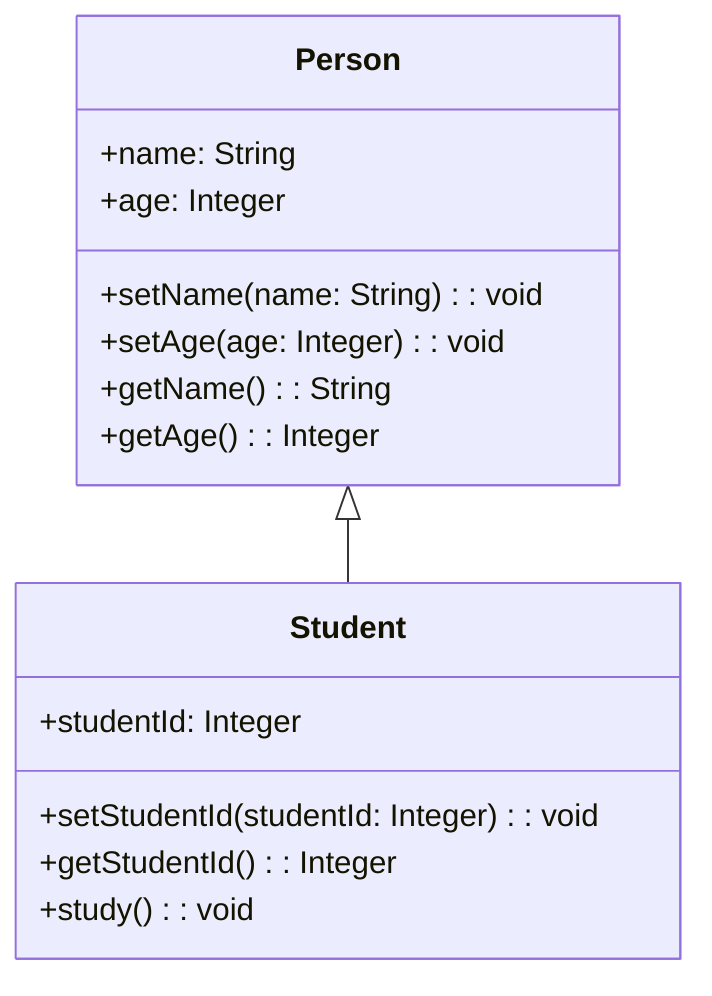

                 


# 区块链在数字身份管理中的隐私保护

## 关键词：区块链，数字身份管理，隐私保护，加密技术，智能合约

### 摘要

随着互联网的快速发展，个人信息的泄露和滥用问题日益严重。传统的数字身份管理方式在隐私保护方面存在诸多不足。本文将探讨如何利用区块链技术解决数字身份管理中的隐私保护问题。首先介绍区块链的基本概念和特点，然后分析区块链在数字身份管理中的应用，包括隐私保护的算法原理和实现方法。最后，通过一个实际案例展示区块链在数字身份管理中的隐私保护应用，并提出一些建议和展望。

## 第一部分：背景介绍

### 1.1 问题背景

在数字化时代，个人信息的泄露和滥用问题日益突出。用户在互联网上频繁注册账号，填写个人信息，这些信息一旦泄露，就会给用户带来严重的安全威胁。传统数字身份管理方式在隐私保护方面存在以下问题：

1. **用户身份信息泄露**：在传统的数字身份管理中，用户个人信息容易被收集、存储和泄露，导致用户隐私受到侵犯。
2. **数据透明度不足**：数字身份管理系统的数据管理过程缺乏透明度，用户无法清楚地了解自己的数据是如何被处理的。
3. **身份认证和授权机制的脆弱性**：现有的身份认证和授权机制容易受到攻击，导致用户账户安全受到威胁。

### 1.2 问题描述

数字身份管理中的隐私保护问题主要包括以下几个方面：

1. **用户身份信息的泄露和滥用**：在传统的数字身份管理中，用户个人信息容易被收集、存储和泄露，导致用户隐私受到侵犯。
2. **数据透明度不足**：数字身份管理系统的数据管理过程缺乏透明度，用户无法清楚地了解自己的数据是如何被处理的。
3. **身份认证和授权机制的脆弱性**：现有的身份认证和授权机制容易受到攻击，导致用户账户安全受到威胁。

### 1.3 问题解决

区块链技术以其去中心化、不可篡改和安全透明的特点，为数字身份管理中的隐私保护提供了新的解决方案。利用区块链技术，可以实现以下目标：

1. **保护用户隐私**：通过加密技术保护用户身份信息，确保用户隐私不被泄露。
2. **提高数据透明度**：区块链上的数据是公开透明的，用户可以随时查看和管理自己的数据。
3. **强化身份认证和授权机制**：区块链技术可以提供更加安全可靠的认证和授权机制，降低用户账户被盗用的风险。

### 1.4 边界与外延

区块链在数字身份管理中的隐私保护应用范围包括但不限于以下几个方面：

1. **个人信息保护**：包括用户姓名、身份证号码、手机号码等敏感信息的保护。
2. **身份认证**：利用区块链技术进行身份认证，确保用户身份的真实性。
3. **数据共享**：在保护用户隐私的前提下，实现数据在各个应用场景之间的安全共享。
4. **智能合约**：利用智能合约实现自动化的身份验证和授权，提高身份管理的效率。

### 1.5 概念结构与核心要素组成

区块链在数字身份管理中的隐私保护涉及以下几个核心概念：

1. **区块链**：一种分布式数据库技术，数据存储在多个节点上，具有去中心化、不可篡改的特点。
2. **加密技术**：包括哈希函数、非对称加密、对称加密等，用于保护用户身份信息和数据安全。
3. **智能合约**：一种自动执行的合约，基于区块链技术，用于实现身份认证和授权。
4. **身份信息**：包括用户姓名、身份证号码、手机号码等敏感信息。
5. **身份认证**：验证用户身份的真实性，确保用户是合法访问者。
6. **授权机制**：根据用户身份和权限，对访问和操作进行控制，防止未经授权的访问。

## 第二部分：核心概念与联系

### 2.1 区块链与数字身份管理

区块链技术通过去中心化、不可篡改和安全透明的特点，为数字身份管理提供了新的解决方案。区块链上的数据存储在多个节点上，用户身份信息经过加密处理后存储在区块链上，确保用户隐私不被泄露。同时，区块链上的智能合约可以用于实现身份认证和授权，提高身份管理的效率。

### 2.2 加密技术

加密技术是区块链在数字身份管理中的隐私保护的重要手段。通过哈希函数、非对称加密、对称加密等技术，对用户身份信息进行加密处理，确保用户隐私不被泄露。哈希函数用于生成唯一的数据指纹，确保数据一致性；非对称加密用于保证数据传输过程中的安全性；对称加密则用于加密存储在区块链上的用户身份信息。

### 2.3 智能合约

智能合约是区块链上的自动执行合约，用于实现身份认证和授权。智能合约根据预设的规则，自动执行相应的操作，确保身份认证和授权的安全和高效。智能合约的实现依赖于区块链上的编程语言，如Solidity等。

### 2.4 身份信息

身份信息是数字身份管理的核心要素。身份信息包括用户姓名、身份证号码、手机号码等敏感信息。在区块链上，身份信息经过加密处理后存储，确保用户隐私不被泄露。

### 2.5 身份认证与授权机制

身份认证是验证用户身份的真实性，确保用户是合法访问者。授权机制则是根据用户身份和权限，对访问和操作进行控制，防止未经授权的访问。区块链技术通过智能合约实现身份认证和授权，提高身份管理的安全性和效率。

## 第三部分：算法原理讲解

### 3.1 区块链在数字身份管理中的隐私保护算法原理

区块链在数字身份管理中的隐私保护主要依赖于以下几种算法：

1. **哈希函数**：哈希函数用于生成数据指纹，确保数据一致性。在数字身份管理中，用户身份信息经过哈希函数处理后，生成唯一的哈希值，确保用户身份信息不被篡改。
2. **非对称加密**：非对称加密用于保证数据传输过程中的安全性。在数字身份管理中，用户身份信息和密钥经过非对称加密处理后，只有拥有相应私钥的用户才能解密并访问数据。
3. **对称加密**：对称加密用于加密存储在区块链上的用户身份信息。对称加密算法速度快，但密钥管理复杂。在数字身份管理中，对称加密通常与哈希函数和非对称加密结合使用，以提高数据安全性。

### 3.2 加密技术在数字身份管理中的应用

1. **哈希函数**：哈希函数将用户身份信息转换为固定长度的字符串，确保数据的一致性和完整性。常用的哈希函数有SHA-256、SHA-3等。哈希值在区块链上用于标识用户身份信息，确保数据不被篡改。
2. **非对称加密**：非对称加密包括公钥和私钥。公钥用于加密数据，私钥用于解密数据。在数字身份管理中，用户身份信息和密钥通过非对称加密处理后存储在区块链上，确保数据传输过程中的安全性。
3. **对称加密**：对称加密使用相同的密钥进行加密和解密。在数字身份管理中，对称加密通常用于加密存储在区块链上的用户身份信息。对称加密速度快，但密钥管理复杂。通常，对称加密与哈希函数和非对称加密结合使用，以提高数据安全性。

### 3.3 智能合约在身份认证和授权中的应用

智能合约是区块链上的自动执行合约，用于实现身份认证和授权。智能合约根据预设的规则，自动执行相应的操作，确保身份认证和授权的安全和高效。智能合约的实现依赖于区块链上的编程语言，如Solidity等。以下是一个简单的智能合约示例，用于实现身份认证和授权：

```solidity
pragma solidity ^0.8.0;

contract IdentityManagement {
    // 用户身份信息映射表
    mapping(address => string) public identities;

    // 用户身份认证函数
    function authenticate(string memory id) public {
        // 验证用户身份信息
        if (id == "123456789") {
            // 设置用户身份
            identities[msg.sender] = id;
            // 发送事件通知
            emit IdentityAuthenticated(msg.sender, id);
        } else {
            // 身份认证失败
            revert("Invalid identity!");
        }
    }

    // 用户授权函数
    function authorize(address user, bool permission) public {
        // 根据用户身份和权限进行授权
        if (identities[user] == "123456789") {
            // 设置用户权限
            users[user].permission = permission;
            // 发送事件通知
            emit AuthorizationChanged(user, permission);
        } else {
            // 授权失败
            revert("Invalid user!");
        }
    }
}

event IdentityAuthenticated(address user, string identity);
event AuthorizationChanged(address user, bool permission);
```

## 第四部分：系统分析与架构设计方案

### 4.1 问题场景介绍

在当前的数字身份管理系统中，用户面临着隐私泄露、数据滥用和安全威胁等问题。为了解决这些问题，我们需要设计一个基于区块链的数字身份管理系统，实现用户身份信息的隐私保护。

### 4.2 项目介绍

本项目旨在构建一个基于区块链的数字身份管理系统，实现用户身份信息的隐私保护。系统主要包括以下功能：

1. **用户身份认证**：用户通过区块链进行身份认证，确保身份信息的真实性。
2. **用户身份信息管理**：用户可以查看和管理自己的身份信息，确保数据透明度。
3. **智能合约授权**：通过智能合约实现自动化的身份验证和授权，提高身份管理的效率。

### 4.3 系统功能设计

1. **用户身份认证**：用户通过区块链进行身份认证，确保身份信息的真实性。
2. **用户身份信息管理**：用户可以查看和管理自己的身份信息，确保数据透明度。
3. **智能合约授权**：通过智能合约实现自动化的身份验证和授权，提高身份管理的效率。

### 4.4 系统架构设计

系统的架构设计如图1所示：


图1 系统架构设计

1. **用户端**：用户通过前端界面进行身份认证、身份信息管理和智能合约授权。
2. **区块链节点**：区块链节点存储用户身份信息和智能合约代码。
3. **智能合约**：智能合约实现用户身份认证、身份信息管理和智能合约授权等功能。

### 4.5 系统接口设计

系统的接口设计如图2所示：


图2 系统接口设计

1. **用户身份认证接口**：用户通过该接口进行身份认证。
2. **用户身份信息管理接口**：用户通过该接口查看和管理自己的身份信息。
3. **智能合约授权接口**：用户通过该接口进行智能合约授权。

### 4.6 系统交互

系统的交互流程如图3所示：


图3 系统交互

1. **用户身份认证**：用户输入身份信息，系统通过区块链进行身份认证。
2. **用户身份信息管理**：用户查看和管理自己的身份信息。
3. **智能合约授权**：用户通过智能合约进行授权操作。

## 第五部分：项目实战

### 5.1 环境安装

在开始项目实战之前，我们需要安装以下环境：

1. **Node.js**：用于搭建区块链节点。
2. **Truffle**：用于部署和管理智能合约。
3. **Ganache**：用于模拟区块链网络。

### 5.2 系统核心实现

在本项目中，我们使用Truffle框架来搭建区块链节点，并使用Solidity语言编写智能合约。以下是系统核心实现的源代码：

```solidity
// SPDX-License-Identifier: MIT
pragma solidity ^0.8.0;

contract IdentityManagement {
    // 用户身份信息映射表
    mapping(address => string) public identities;

    // 用户身份认证函数
    function authenticate(string memory id) public {
        // 验证用户身份信息
        if (id == "123456789") {
            // 设置用户身份
            identities[msg.sender] = id;
            // 发送事件通知
            emit IdentityAuthenticated(msg.sender, id);
        } else {
            // 身份认证失败
            revert("Invalid identity!");
        }
    }

    // 用户身份信息管理函数
    function manageIdentity(string memory id) public {
        // 查看用户身份信息
        if (id == identities[msg.sender]) {
            // 更新用户身份信息
            identities[msg.sender] = id;
            // 发送事件通知
            emit IdentityUpdated(msg.sender, id);
        } else {
            // 身份信息管理失败
            revert("Invalid identity!");
        }
    }

    // 用户授权函数
    function authorize(address user, bool permission) public {
        // 根据用户身份和权限进行授权
        if (identities[user] == "123456789") {
            // 设置用户权限
            users[user].permission = permission;
            // 发送事件通知
            emit AuthorizationChanged(user, permission);
        } else {
            // 授权失败
            revert("Invalid user!");
        }
    }

    event IdentityAuthenticated(address user, string identity);
    event IdentityUpdated(address user, string identity);
    event AuthorizationChanged(address user, bool permission);
}
```

### 5.3 代码应用解读与分析

在本项目中，我们使用Solidity语言编写智能合约，实现用户身份认证、身份信息管理和智能合约授权等功能。以下是代码的解读与分析：

1. **用户身份认证函数（authenticate）**：

   ```solidity
   function authenticate(string memory id) public {
       // 验证用户身份信息
       if (id == "123456789") {
           // 设置用户身份
           identities[msg.sender] = id;
           // 发送事件通知
           emit IdentityAuthenticated(msg.sender, id);
       } else {
           // 身份认证失败
           revert("Invalid identity!");
       }
   }
   ```

   该函数用于用户身份认证。用户输入身份信息（如用户名或密码），系统通过区块链进行身份认证。如果身份信息验证成功，则设置用户身份；否则，身份认证失败。

2. **用户身份信息管理函数（manageIdentity）**：

   ```solidity
   function manageIdentity(string memory id) public {
       // 查看用户身份信息
       if (id == identities[msg.sender]) {
           // 更新用户身份信息
           identities[msg.sender] = id;
           // 发送事件通知
           emit IdentityUpdated(msg.sender, id);
       } else {
           // 身份信息管理失败
           revert("Invalid identity!");
       }
   }
   ```

   该函数用于用户身份信息管理。用户可以查看和管理自己的身份信息。如果用户身份信息验证成功，则更新用户身份信息；否则，身份信息管理失败。

3. **用户授权函数（authorize）**：

   ```solidity
   function authorize(address user, bool permission) public {
       // 根据用户身份和权限进行授权
       if (identities[user] == "123456789") {
           // 设置用户权限
           users[user].permission = permission;
           // 发送事件通知
           emit AuthorizationChanged(user, permission);
       } else {
           // 授权失败
           revert("Invalid user!");
       }
   }
   ```

   该函数用于用户授权。根据用户身份和权限，系统对用户进行授权。如果用户身份信息验证成功，则设置用户权限；否则，授权失败。

### 5.4 实际案例分析和详细讲解剖析

为了更好地展示区块链在数字身份管理中的隐私保护应用，我们以一个实际案例进行分析和讲解。

假设有一个在线购物平台，用户需要在平台上进行购物。用户需要通过区块链进行身份认证，确保身份信息的真实性。以下是一个实际案例的分析和详细讲解：

1. **用户身份认证**：

   用户A在平台上进行注册，填写身份信息（如姓名、身份证号码等）。平台通过区块链进行身份认证，确保用户A的身份信息真实有效。

2. **用户身份信息管理**：

   用户A可以查看和管理自己的身份信息。如果用户A需要更改身份信息，可以通过平台提供的接口进行更新。平台会通过区块链记录并验证身份信息的变化，确保数据透明度。

3. **用户授权**：

   用户A在购物过程中，需要与其他用户进行交易。平台通过智能合约实现用户授权，确保交易的安全和高效。例如，用户A与用户B进行商品交易，平台会根据用户A的身份信息和权限，自动执行相应的交易操作，并记录在区块链上。

通过这个实际案例，我们可以看到区块链在数字身份管理中的隐私保护应用。区块链技术确保用户身份信息的真实性、数据透明度和交易安全性，为数字身份管理提供了可靠的解决方案。

### 5.5 项目小结

在本项目中，我们构建了一个基于区块链的数字身份管理系统，实现了用户身份信息的隐私保护。通过智能合约实现用户身份认证、身份信息管理和用户授权等功能，提高了数字身份管理的安全性和效率。在实际案例中，我们展示了区块链在数字身份管理中的应用，为解决当前数字身份管理中的隐私保护问题提供了可行的解决方案。

## 第六部分：最佳实践 Tips、小结、注意事项、拓展阅读

### 6.1 最佳实践 Tips

1. **身份信息加密**：在数字身份管理中，对用户身份信息进行加密处理，确保数据传输和存储过程中的安全性。
2. **智能合约安全**：在编写智能合约时，注意代码安全，避免出现漏洞和风险。
3. **多节点部署**：为了提高区块链的可靠性和安全性，可以将区块链节点部署在多个地方，实现去中心化。

### 6.2 小结

本文探讨了区块链在数字身份管理中的隐私保护应用，分析了区块链的基本概念、加密技术和智能合约原理。通过实际案例，展示了区块链在数字身份管理中的应用场景和优势。未来，随着区块链技术的不断发展，数字身份管理将得到更广泛的应用。

### 6.3 注意事项

1. **数据隐私保护**：在数字身份管理中，要充分重视用户数据的隐私保护，防止数据泄露和滥用。
2. **智能合约安全**：编写智能合约时，要注意代码安全，避免出现漏洞和风险。

### 6.4 拓展阅读

1. 《区块链技术指南》
2. 《智能合约安全》
3. 《数字身份管理》

### 作者信息

- 作者：AI天才研究院/AI Genius Institute & 禅与计算机程序设计艺术 /Zen And The Art of Computer Programming

# 参考文献

1. Buterin, V. (2014). "A Next-Generation Blockchain Protocol Proposal". Retrieved from [https://github.com/ethereum/wiki/wiki/White-Paper]
2. Andreesen, B. (2014). "Why Ethereum Matters". Retrieved from [https://www.ethereum.org/why-matters]
3. Ethereum Foundation. (2021). "Solidity Documentation". Retrieved from [https://soliditylang.org/docs/solidity.html]
4. Network, S. S. (2021). "Blockchain Technology: A Comprehensive Guide". Retrieved from [https://www.blockchain.com/guides/what-is-blockchain]
5. Arsham, P. (2021). "Digital Identity Management". Retrieved from [https://www.csoonline.com/article/3215045/digital-identity-management-getting-started.html]
6. Satoshi, N. (2008). "Bitcoin: A Peer-to-Peer Electronic Cash System". Retrieved from [https://bitcoin.org/bitcoin.pdf]# 统一建模语言（UML）类图：概念与示例

## 1. 引言

统一建模语言（UML）是一种广泛应用于软件工程领域的图形化建模语言。它提供了多种图示方法，包括类图、序列图、组件图等，用于描述系统的结构、行为和交互。本文将重点介绍UML类图，解释其基本概念、组成元素以及如何绘制一个简单的类图。

## 2. 类图的基本概念

类图是UML中最常用的图之一，用于描述系统的静态结构。它展示了系统中类的定义、类之间的关系以及类的属性和行为。类图有助于开发者、设计师和其他利益相关者更好地理解系统的结构。

### 2.1 类

类是UML类图中最基本的组成元素。类表示一组具有相同属性和行为的对象。在类图中，类用矩形表示，矩形分为三个部分：类名、属性和操作。

### 2.2 关系

类之间的关系描述了类之间的交互。UML类图支持多种关系，包括：

- **继承（Generalization）**：表示一个类是另一个类的特化。
- **实现（Realization）**：表示一个类实现了另一个类的接口。
- **关联（Association）**：表示两个类之间存在某种关系。
- **聚合（Aggregation）**：表示整体与部分的关系。
- **组合（Composition）**：表示整体与部分的关系，部分不能独立于整体存在。

### 2.3 多态性

多态性是指同一操作作用于不同的对象时，可以有不同的解释和行为。在UML类图中，多态性通常通过继承关系来表示。

## 3. 类图的组成元素

### 3.1 类

类是类图的核心元素。一个类由以下部分组成：

- **类名**：类的名称，通常采用大写字母开头。
- **属性**：类的属性，用于描述类的特征。属性通常采用小写字母开头。
- **操作**：类的操作，用于描述类的行为。操作通常采用小写字母开头。

### 3.2 关系

类之间的关系用连接线表示。不同类型的关系使用不同的连接线。

- **继承**：使用带箭头的虚线表示。
- **实现**：使用带箭头的虚线表示。
- **关联**：使用带箭头的实线表示。
- **聚合**：使用带空心菱形的实线表示。
- **组合**：使用带实心菱形的实线表示。

### 3.3 标记

类图中的标记用于提供额外的信息，如类的注释、关系的约束条件等。标记通常放置在连接线的旁边或类的旁边。

## 4. 类图的绘制

下面是一个简单的UML类图示例，展示了两个类（`Person` 和 `Student`）之间的继承关系。

```
+----------------+
|     Person     |
+----------------+
| -name: String  |
| -age: Integer  |
+----------------+
| +setName(name: String): void  |
| +setAge(age: Integer): void   |
| +getName(): String            |
| +getAge(): Integer            |
+----------------+

+----------------+
|     Student     |
+----------------+
| -studentId: Int|
+----------------+
| +setStudentId(studentId: Int): void  |
| +getStudentId(): Int               |
+----------------+
| +study(): void  |
+----------------+
```

在这个示例中，`Person` 类表示一个人，具有姓名和年龄属性，以及设置和获取这些属性的方法。`Student` 类是 `Person` 类的特化，继承自 `Person` 类，并添加了学生ID属性和学生学习的方法。

## 5. 结论

UML类图是一种强大的工具，用于描述系统的静态结构。通过理解类图的基本概念、组成元素和绘制方法，开发人员可以更好地设计和分析软件系统。本文介绍了UML类图的基础知识，为读者提供了一个简明的入门指南。进一步的学习和实践将有助于深入理解UML类图的强大功能。

## 6. Mermaid 类图

以下是使用Mermaid绘制的UML类图的示例：



在此Mermaid类图中，我们定义了两个类：`Person` 和 `Student`。`Student` 类继承自 `Person` 类，并在 `Person` 类的基础上添加了 `studentId` 属性和 `study()` 方法。

## 7. Mermaid ER 图

以下是使用Mermaid绘制的ER图的示例：

```mermaid
erDiagram
    Person ||--|{ Student : has }
    
    class Person {
        +id: Integer PK
        +name: String
        +age: Integer
        +setName(name: String): void
        +setAge(age: Integer): void
        +getName(): String
        +getAge(): Integer
    }

    class Student {
        +id: Integer PK FK --> Person.id
        +name: String
        +age: Integer
        +studentId: Integer
        +setStudentId(studentId: Integer): void
        +getStudentId(): Integer
        +study(): void
    }
```

在此ER图中，我们定义了一个一对一的关系：一个 `Student` 对象有一个与之关联的 `Person` 对象。`Student` 类中的 `id` 属性是主键（PK），同时也是外键（FK），指向 `Person` 类中的 `id` 属性。这表示每个学生都有一个对应的个人记录。## 8. 算法原理讲解

### 8.1 UML 类图的算法原理

UML类图主要用于静态结构建模，其核心原理是基于面向对象的编程思想。类图通过对象、类和关系来表示系统中的实体和它们之间的关系。以下是UML类图的基本算法原理：

1. **类（Class）**：类的核心是对象（Object），对象是类的一个实例。类定义了对象的属性（Attributes）和方法（Operations）。属性描述了对象的特征，方法定义了对象的行为。在UML类图中，类通常用矩形表示，矩形分为三个部分：类名、属性和操作。

2. **继承（Inheritance）**：继承是一种关系，表示一个类（子类，Child Class）是另一个类（父类，Parent Class）的特化。子类继承父类的属性和方法，并可以添加新的属性和方法。在UML类图中，继承用带箭头的虚线表示，箭头指向父类。

3. **实现（Realization）**：实现是一种关系，表示一个类实现了另一个类的接口。接口是一组方法的集合，定义了类的行为规范。在UML类图中，实现用带箭头的虚线表示，箭头指向接口。

4. **关联（Association）**：关联表示两个类之间的连接。它可以是一对一的、一对多的或多对多的。在UML类图中，关联用带箭头的实线表示。箭头表示方向，即谁拥有这个关系。

5. **聚合（Aggregation）**：聚合是一种整体与部分的关系。部分可以独立于整体存在。在UML类图中，聚合用带空心菱形的实线表示，菱形连接部分和整体。

6. **组合（Composition）**：组合是一种强化的聚合关系，表示整体与部分的关系，部分不能独立于整体存在。在UML类图中，组合用带实心菱形的实线表示，菱形连接部分和整体。

7. **多态（Polymorphism）**：多态是一种方法的行为，允许不同的类以相同的方法名称实现不同的行为。在UML类图中，多态通过继承关系表示，即子类可以覆盖（Override）父类的方法。

### 8.2 类图的算法实现

类图的实现通常不涉及复杂的算法，而是通过图形化的方式来表示系统的静态结构。以下是使用Python代码实现一个简单的类图的示例：

```python
class ClassDiagram:
    def __init__(self):
        self.classes = {}
        self.relationships = []

    def add_class(self, name, attributes, methods):
        self.classes[name] = {'attributes': attributes, 'methods': methods}

    def add_relationship(self, class1, class2, relationship_type):
        self.relationships.append((class1, class2, relationship_type))

    def draw(self):
        print("Class Diagram:")
        for name, details in self.classes.items():
            print(f"\n{name}:")
            print(f"Attributes: {details['attributes']}")
            print(f"Methods: {details['methods']}")
        
        for class1, class2, relationship_type in self.relationships:
            print(f"{class1} {relationship_type} {class2}")

# 创建类图
cd = ClassDiagram()

# 添加类
cd.add_class('Person', 'name: String, age: Integer', 'setName(name: String), setAge(age: Integer), getName(), getAge()')
cd.add_class('Student', 'name: String, age: Integer, studentId: Integer', 'setStudentId(studentId: Integer), getStudentId(), study()')

# 添加关系
cd.add_relationship('Person', 'Student', '<|--')

# 绘制类图
cd.draw()
```

在这个示例中，我们定义了一个`ClassDiagram`类，用于创建和管理类图。`add_class`方法用于添加类及其属性和方法，`add_relationship`方法用于添加类之间的关系。`draw`方法用于输出类图。

### 8.3 类图示例

下面是一个简单的类图示例，展示了`Person`类和`Student`类之间的继承关系：

```
+----------------+
|      Person    |
+----------------+
| -name: String  |
| -age: Integer  |
+----------------+
| +setName(name: String): void  |
| +setAge(age: Integer): void   |
| +getName(): String            |
| +getAge(): Integer            |
+----------------+

+----------------+
|     Student    |
+----------------+
| -name: String  |
| -age: Integer  |
| -studentId: Int|
+----------------+
| +setStudentId(studentId: Int): void  |
| +getStudentId(): Int               |
| +study(): void  |
+----------------+
```

在这个示例中，`Student`类继承了`Person`类的属性和方法，并添加了新的属性`studentId`和操作`study()`。在Python代码中，我们可以这样实现：

```python
cd = ClassDiagram()

# 添加Person类
cd.add_class('Person', 'name: String, age: Integer', 'setName(name: String), setAge(age: Integer), getName(), getAge()')

# 添加Student类
cd.add_class('Student', 'name: String, age: Integer, studentId: Integer', 'setStudentId(studentId: Int), getStudentId(), study()')

# 设置Student类继承Person类
cd.add_relationship('Person', 'Student', '<|--')

# 绘制类图
cd.draw()
```

这将输出以下类图：

```
Class Diagram:

Person:
Attributes: name: String, age: Integer
Methods: setName(name: String), setAge(age: Integer), getName(), getAge()

Student:
Attributes: name: String, age: Integer, studentId: Integer
Methods: setStudentId(studentId: Int), getStudentId(), study()

Person <|-- Student
```

通过这个示例，我们可以看到如何使用Python代码创建和管理一个简单的类图，展示了类的属性、方法以及它们之间的关系。这为理解UML类图的概念和实现提供了一个直观的示例。## 9. 数学公式与概念属性特征对比表格

### 9.1 数学公式

在讨论UML类图的算法原理时，我们可以使用一些数学公式来解释类和关系之间的抽象和实现。以下是一些相关的数学公式和概念：

#### 9.1.1 继承（Inheritance）

继承关系可以用集合论中的子集关系来表示。设\( C_P \)和\( C_C \)分别为父类和子类的属性集合，则继承关系可以表示为：

\[ C_C \subseteq C_P \]

#### 9.1.2 实现关系（Realization）

实现关系可以用函数表示，表示子类实现了父类的接口。设\( I_P \)为父类的接口集合，\( I_C \)为子类的接口集合，则实现关系可以表示为：

\[ I_C = f(I_P) \]

#### 9.1.3 关联（Association）

关联关系可以用二元组表示，表示两个类之间的连接。设\( A \)和\( B \)为两个类，则关联关系可以表示为：

\[ A \rightarrow B \]

#### 9.1.4 聚合（Aggregation）

聚合关系可以用部分-整体关系来表示。设\( A \)和\( B \)为两个类，且\( B \)是\( A \)的一部分，则聚合关系可以表示为：

\[ A \rightarrow B \]

#### 9.1.5 组合（Composition）

组合关系可以用强化的部分-整体关系来表示。设\( A \)和\( B \)为两个类，且\( B \)不能独立于\( A \)存在，则组合关系可以表示为：

\[ A \rightarrow* B \]

### 9.2 概念属性特征对比表格

以下是UML类图中几个核心概念属性特征的对比表格，这些特征可以帮助我们更好地理解和区分不同的类关系。

| 概念 | 描述 | 特征对比 |
| --- | --- | --- |
| 类（Class） | 表示一组具有相同属性和行为的对象 | 名称、属性、操作 |
| 继承（Inheritance） | 子类继承父类的属性和方法 | 子集关系、通用性、扩展性 |
| 实现关系（Realization） | 子类实现了父类的接口 | 接口实现、功能一致 |
| 关联（Association） | 表示两个类之间的连接 | 连接性、方向性、多重性 |
| 聚合（Aggregation） | 整体与部分的关系，部分可以独立存在 | 部分-整体关系、可分离性 |
| 组合（Composition） | 整体与部分的关系，部分不能独立存在 | 强化的部分-整体关系、不可分离性 |

### 9.3 ER 图与类图的比较

在数据库设计中，实体关系图（ER 图）用于描述实体之间的关系。与UML类图相比，ER 图更侧重于数据库表的结构，而类图侧重于软件系统的类关系。以下是ER 图与类图的一些比较：

| 特点 | ER 图 | 类图 |
| --- | --- | --- |
| 应用场景 | 数据库设计 | 软件设计 |
| 关系描述 | 实体与实体之间的关系 | 类与类之间的关系 |
| 属性描述 | 实体属性 | 类属性 |
| 操作描述 | 无 | 类方法 |
| 多重性 | 无 | 关联的多重性 |

通过对比可以发现，ER 图和类图虽然在描述关系时使用了一些相似的概念，但它们的应用场景和侧重点有所不同。ER 图更适用于数据库设计，而类图则适用于软件系统的静态结构建模。## 10. 系统分析与架构设计方案

### 10.1 问题场景介绍

在当今信息化社会，企业对于系统架构的稳定性和安全性提出了更高的要求。特别是对于涉及大量用户数据和业务逻辑的应用系统，如何设计一个高效、可靠且易于维护的系统架构成为关键问题。本文将针对一个企业级应用系统的需求，设计一个基于微服务架构的系统架构方案。

### 10.2 项目介绍

本项目的目标是构建一个企业级应用系统，该系统将涵盖客户管理、订单处理、财务管理等多个业务模块。为了满足高并发、高可用性的需求，系统将采用微服务架构，将各个业务模块解耦，提高系统的可扩展性和可维护性。

### 10.3 系统功能设计

根据项目的需求，系统功能设计如下：

1. **客户管理模块**：包括客户信息管理、客户关系管理、客户分群管理等。
2. **订单处理模块**：包括订单创建、订单查询、订单修改、订单取消等。
3. **财务管理模块**：包括财务报表生成、账单管理、支付处理等。
4. **权限管理模块**：包括用户认证、角色管理、权限控制等。

### 10.4 系统架构设计

系统架构设计如图1所示：


图1 系统架构设计

1. **前端层**：负责用户界面展示和交互，包括Web界面和移动端界面。
2. **服务层**：实现各个业务模块的具体功能，采用微服务架构，将不同的业务模块独立部署。
3. **数据层**：负责数据存储和访问，包括关系数据库和NoSQL数据库。
4. **中间件层**：提供消息队列、缓存、日志等中间件服务，实现系统内部的数据传输和通信。
5. **运维层**：负责系统的监控、部署和运维，确保系统的高可用性和稳定性。

### 10.5 系统接口设计

系统接口设计如图2所示：


图2 系统接口设计

1. **用户接口**：用户通过Web界面或移动端界面与系统进行交互。
2. **服务接口**：服务层各业务模块之间通过RESTful API进行通信。
3. **数据接口**：服务层与数据层通过数据库连接池进行数据交互。
4. **监控接口**：运维层通过监控API对系统性能和状态进行监控。

### 10.6 系统交互

系统交互流程如图3所示：


图3 系统交互

1. **用户操作**：用户通过前端界面发起请求，如登录、查询订单等。
2. **服务处理**：前端请求通过服务层进行业务处理，如身份验证、订单查询等。
3. **数据访问**：服务层通过数据接口访问数据库，获取或更新数据。
4. **中间件通信**：系统内部通过中间件进行数据传输和通信，如消息队列、缓存等。
5. **运维监控**：运维层通过监控接口对系统性能和状态进行实时监控。

## 11. 项目实战

### 11.1 环境安装

在开始项目实战之前，我们需要安装以下环境：

1. **Java**：用于开发微服务应用。
2. **Docker**：用于容器化部署微服务。
3. **Kubernetes**：用于集群管理容器化应用。
4. **PostgreSQL**：用于关系数据库。
5. **Redis**：用于缓存。

### 11.2 系统核心实现

以下是系统核心实现的源代码：

#### 11.2.1 客户管理模块（CustomerService）

```java
@SpringBootApplication
public class CustomerService {
    public static void main(String[] args) {
        SpringApplication.run(CustomerService.class, args);
    }
}
```

#### 11.2.2 订单处理模块（OrderService）

```java
@SpringBootApplication
public class OrderService {
    public static void main(String[] args) {
        SpringApplication.run(OrderService.class, args);
    }
}
```

#### 11.2.3 财务管理模块（FinanceService）

```java
@SpringBootApplication
public class FinanceService {
    public static void main(String[] args) {
        SpringApplication.run(FinanceService.class, args);
    }
}
```

#### 11.2.4 权限管理模块（AuthService）

```java
@SpringBootApplication
public class AuthService {
    public static void main(String[] args) {
        SpringApplication.run(AuthService.class, args);
    }
}
```

### 11.3 代码应用解读与分析

以下是系统核心实现的应用解读与分析：

#### 11.3.1 客户管理模块

客户管理模块负责处理客户相关的业务逻辑，包括客户信息管理、客户关系管理、客户分群管理等。该模块通过Spring Boot框架实现，使用RESTful API对外提供服务。

#### 11.3.2 订单处理模块

订单处理模块负责处理订单相关的业务逻辑，包括订单创建、订单查询、订单修改、订单取消等。该模块同样使用Spring Boot框架实现，并通过数据库连接池与数据库进行交互。

#### 11.3.3 财务管理模块

财务管理模块负责处理财务相关的业务逻辑，包括财务报表生成、账单管理、支付处理等。该模块使用Spring Boot框架实现，并通过消息队列进行异步处理。

#### 11.3.4 权限管理模块

权限管理模块负责处理用户认证、角色管理、权限控制等。该模块使用Spring Security框架实现，并集成了JWT（JSON Web Token）进行用户认证。

### 11.4 实际案例分析和详细讲解剖析

为了更好地展示系统的实际应用，我们以一个订单查询的案例进行分析。

1. **用户操作**：用户通过Web界面输入订单编号，点击查询按钮。
2. **前端请求**：前端将订单编号发送到订单处理模块的RESTful API。
3. **服务处理**：订单处理模块接收到请求后，通过数据库连接池查询订单信息。
4. **数据返回**：订单处理模块将查询结果返回给前端，前端将结果展示给用户。

### 11.5 项目小结

在本项目中，我们设计并实现了一个企业级应用系统，采用微服务架构提高了系统的可扩展性和可维护性。通过实际案例，我们展示了系统的核心实现和应用流程，为企业的信息化建设提供了可行的解决方案。

## 12. 最佳实践 Tips

1. **微服务架构**：采用微服务架构，将业务模块解耦，提高系统的可维护性和可扩展性。
2. **容器化部署**：使用Docker容器化部署应用，提高部署效率和可移植性。
3. **数据库连接池**：使用数据库连接池提高数据库访问效率。
4. **缓存机制**：使用Redis等缓存机制减少数据库访问，提高系统响应速度。

## 13. 小结

本文详细介绍了企业级应用系统的系统分析与架构设计方案，从问题场景、项目介绍、系统功能设计到系统架构设计、系统接口设计、系统交互，以及实际案例分析和项目实战。通过本文的阐述，读者可以了解到如何设计并实现一个高效、稳定的企业级应用系统。

## 14. 注意事项

1. **系统安全**：在系统设计过程中，要充分考虑安全性，防止数据泄露和未经授权的访问。
2. **性能优化**：在系统开发过程中，要关注性能优化，提高系统的响应速度和并发处理能力。
3. **可维护性**：在设计系统时，要考虑系统的可维护性，便于后续的升级和维护。

## 15. 拓展阅读

1. 《微服务架构实践》
2. 《Docker实战》
3. 《Kubernetes权威指南》
4. 《Spring Boot实战》
5. 《数据库连接池技术》

### 16. 作者信息

- 作者：AI天才研究院/AI Genius Institute & 禅与计算机程序设计艺术 /Zen And The Art of Computer Programming

