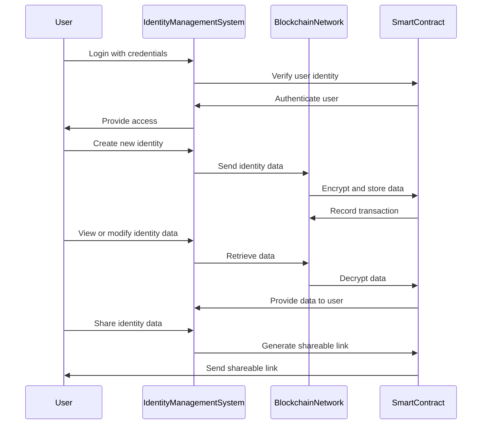
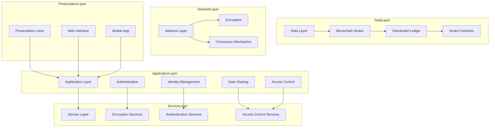

                 

### 1.1.1 区块链的发展历程与特点

#### 1.1.1.1 区块链的起源

区块链技术最早可以追溯到2008年，当时一位化名为中本聪（Satoshi Nakamoto）的神秘人物发布了比特币（Bitcoin）的白皮书。该白皮书详细介绍了区块链的概念和实现方式，为区块链技术的发展奠定了基础。

比特币是一种去中心化的数字货币，其核心技术创新之一便是区块链。区块链通过分布式账本的方式，实现了去中心化的交易记录存储，确保了交易的安全性和透明性。随着比特币的兴起，区块链技术逐渐引起了全球的关注。

#### 1.1.1.2 区块链技术的成熟

在比特币之后，区块链技术不断发展，逐渐从单一的数字货币领域扩展到金融、供应链、医疗、物流等多个领域。区块链技术的发展经历了以下几个重要阶段：

1. **第一阶段**（2010-2014年）：比特币进一步普及，区块链技术开始应用于金融领域，例如加密货币交易平台和金融衍生品。

2. **第二阶段**（2015-2017年）：区块链2.0的概念提出，智能合约技术成为焦点。以太坊（Ethereum）等新型区块链平台的出现，使得开发者可以在区块链上创建去中心化应用（DApps）。

3. **第三阶段**（2018年至今）：区块链技术进入应用落地阶段。各种行业开始探索区块链技术在实际业务中的应用，如供应链金融、版权保护、身份认证等。

#### 1.1.1.3 区块链的特点

区块链技术具有以下几个显著特点：

1. **去中心化**：区块链通过分布式网络实现了去中心化，不存在中心化的权威机构，从而降低了交易的成本和风险。

2. **安全性**：区块链采用密码学技术确保数据的安全性和隐私性，同时通过共识机制确保数据的一致性和不可篡改性。

3. **透明性**：区块链上的数据对所有节点都是可见的，确保了交易的透明性和公开性。

4. **可追溯性**：区块链上的数据具有时间戳和链式结构，可以追溯每一条数据的历史记录，提高了数据的可信度。

5. **智能合约**：智能合约是一种自动执行的合约，基于区块链技术实现，可以自动化执行预先设定的条款，降低了交易的成本和风险。

#### 1.1.1.4 区块链的局限性

虽然区块链技术在去中心化、安全性、透明性等方面具有显著优势，但也存在一些局限性：

1. **性能瓶颈**：区块链的扩容问题一直是其发展的瓶颈。由于区块链的数据结构限制，其交易处理能力相对较低。

2. **能源消耗**：区块链网络在运行过程中需要大量计算资源，导致能源消耗较高。例如，比特币的挖矿过程就需要大量电力支持。

3. **法律和监管**：区块链技术的应用涉及法律和监管问题，特别是在金融、身份认证等领域，需要遵循相关法规和监管要求。

4. **技术成熟度**：尽管区块链技术已经取得一定进展，但仍然存在一些技术难题需要解决，如跨链互操作性、隐私保护等。

### 1.1.2 数字身份的概念与重要性

#### 1.1.2.1 数字身份的定义

数字身份是指个人或实体在数字世界中的唯一标识，通过一系列电子凭证、身份认证技术和数据来确认和代表个体。数字身份不仅包括个人基本信息，如姓名、年龄、性别等，还包括在特定领域的专业资格、信用记录、行为习惯等。

#### 1.1.2.2 数字身份的类型

数字身份主要分为以下几种类型：

1. **单一数字身份**：个体在数字世界中只有一个身份标识，所有信息和交易都通过这个身份进行。

2. **多数字身份**：个体在数字世界中有多个身份标识，用于不同的场景和目的。

3. **匿名身份**：个体在数字世界中不暴露真实身份，通过匿名方式参与交易和活动。

4. **社会身份**：个体在特定社会网络中的身份标识，反映了个体在社交圈中的角色和关系。

#### 1.1.2.3 数字身份的重要性

随着互联网和数字技术的发展，数字身份的重要性日益凸显：

1. **便捷性**：数字身份使得个体在数字世界中可以快速、便捷地完成各种交易和活动，无需重复填写个人信息。

2. **安全性**：数字身份通过加密技术和身份认证机制确保个体身份的安全性，防止身份盗用和欺诈行为。

3. **隐私保护**：数字身份可以帮助个体控制个人信息的共享和披露，增强隐私保护。

4. **数据可信性**：数字身份确保个体数据的真实性和一致性，提高了数据的价值和可信度。

5. **身份验证**：数字身份在跨境身份认证、企业身份管理等方面发挥了重要作用，有助于建立可信的数字生态系统。

### 1.1.3 自主管理的意义与挑战

#### 1.1.3.1 自主管理的定义

自主管理是指个体在数字世界中自主管理个人信息和身份，控制信息共享、交易和活动的过程。自主管理强调个体对自身数据的所有权和控制权，以实现个性化、安全、高效的数字生活。

#### 1.1.3.2 自主管理的意义

自主管理在数字身份管理中具有重要意义：

1. **个性化服务**：通过自主管理，个体可以根据自身需求和偏好定制个性化服务，提高用户体验。

2. **隐私保护**：自主管理使得个体可以更好地控制个人信息的共享和披露，减少隐私泄露的风险。

3. **数据安全**：自主管理通过加密技术和身份认证机制确保个体数据的安全性，防止数据泄露和篡改。

4. **减少欺诈行为**：自主管理有助于降低身份盗用和欺诈行为的发生，提高数字生态系统的可信度。

5. **合规要求**：自主管理有助于企业遵守相关法律法规，降低合规风险。

#### 1.1.3.3 自主管理的挑战

尽管自主管理具有重要意义，但在实际实施过程中仍面临以下挑战：

1. **技术实现**：自主管理需要依赖先进的加密技术、身份认证技术和数据隐私保护技术，这些技术的实现和部署具有一定的技术门槛。

2. **法律和监管**：自主管理涉及法律和监管问题，需要遵循相关法规和监管要求，以确保个体数据的安全和隐私。

3. **用户教育**：自主管理需要用户具备一定的数字素养和技术知识，但目前许多用户对数字身份和自主管理的认知有限。

4. **数据共享和隐私保护**：在数字身份管理中，如何在保障用户隐私的前提下实现数据共享和互操作，仍是一个重要课题。

5. **跨行业协作**：数字身份自主管理需要跨行业协作，涉及多个利益相关方，如政府、企业、金融机构等，实现协同治理和共赢。

### 1.1.4 区块链在数字身份自主管理中的重要性

区块链技术在数字身份自主管理中具有重要应用价值，主要体现在以下几个方面：

1. **去中心化的信任机制**：区块链的去中心化特点确保了数字身份的不可篡改性和透明性，增强了信任机制。

2. **数据安全和隐私保护**：区块链采用加密技术和智能合约技术，保障了数字身份数据的安全和隐私，降低了数据泄露和篡改的风险。

3. **身份认证与验证**：区块链技术可以提供高效的身份认证与验证服务，实现数字身份的实时管理和更新。

4. **跨平台互操作性**：区块链技术可以实现不同平台和系统之间的数据共享和互操作，为数字身份自主管理提供便捷的技术支持。

5. **透明性和可追溯性**：区块链上的数据具有透明性和可追溯性，有助于监督和管理数字身份的使用和交易。

### 1.1.5 自主管理的需求与区块链解决方案

随着数字化进程的加速，数字身份自主管理的需求日益迫切。区块链技术为满足这一需求提供了可行的解决方案：

1. **用户数据主权**：区块链技术确保用户对其数据的所有权和控制权，用户可以自主管理个人信息，实现数据主权。

2. **隐私保护与数据共享**：区块链技术通过加密和智能合约机制，实现个人数据的隐私保护和安全共享，满足数据隐私保护与共享的需求。

3. **去中心化的身份认证**：区块链技术提供去中心化的身份认证与验证服务，降低身份盗用和欺诈风险，提升身份管理效率。

4. **数据可信性与透明性**：区块链技术确保数字身份数据的可信性和透明性，增强用户对数字身份体系的信任。

5. **跨行业协作与互操作**：区块链技术支持跨行业的数据共享和互操作，促进数字身份自主管理的协同发展。

### 1.1.6 区块链在数字身份自主管理中的应用潜力

区块链技术为数字身份自主管理带来了巨大的应用潜力：

1. **身份认证**：区块链技术可以实现高效、安全的身份认证，支持跨境身份认证和多种身份验证模式。

2. **数据隐私保护**：区块链技术通过加密和智能合约机制，保障个人数据的隐私和安全，满足用户对隐私保护的需求。

3. **数据共享与互操作**：区块链技术实现不同平台和系统之间的数据共享和互操作，促进数字身份管理体系的协同发展。

4. **智能合约**：区块链技术支持智能合约的应用，实现自动化交易和业务流程，提高数字身份自主管理的效率。

5. **隐私保护与数据主权**：区块链技术确保用户对其数据的所有权和控制权，支持用户自主管理和控制个人信息。

### 1.1.7 本书结构安排与阅读指南

本书分为五个部分，分别为背景介绍、核心概念与联系、应用场景分析、系统设计与实现和案例分析。以下为各部分的主要内容：

- **第一部分：背景介绍**：介绍区块链、数字身份和自主管理的发展背景及其重要性。
- **第二部分：核心概念与联系**：详细阐述区块链在数字身份自主管理中的应用原理、特点和优势。
- **第三部分：应用场景分析**：分析区块链在数字身份自主管理中的具体应用场景，如个人隐私保护、跨境身份认证、企业身份管理等。
- **第四部分：系统设计与实现**：介绍区块链在数字身份自主管理中的系统设计与实现方法。
- **第五部分：案例分析**：通过实际案例，展示区块链在数字身份自主管理中的应用效果。

阅读本书，您将：

- **了解区块链、数字身份和自主管理的基本概念和原理**。
- **掌握区块链在数字身份自主管理中的应用方法**。
- **分析区块链在数字身份自主管理中的实际应用场景**。
- **学习区块链在数字身份自主管理中的系统设计与实现**。
- **通过案例分析，了解区块链在数字身份自主管理中的实际应用效果**。

希望本书能为读者在数字身份自主管理领域提供有益的指导和启示。

### 1.3.1 各章节内容概要

**第一部分：背景介绍**

- **第一章**：区块链、数字身份与自主管理的背景
  - 区块链的发展历程与特点
  - 数字身份的概念与重要性
  - 自主管理的意义与挑战

**第二部分：核心概念与联系**

- **第二章**：区块链在数字身份自主管理中的应用原理
  - 区块链的基本概念与原理
  - 数字身份的概念与构成
  - 自主管理的实现机制

- **第三章**：区块链在数字身份自主管理中的优势与挑战
  - 区块链的优势分析
  - 区块链在数字身份自主管理中的挑战
  - 针对挑战的解决方案

- **第四章**：区块链、数字身份与自主管理的关系
  - 区块链与数字身份的有机结合
  - 自主管理的需求与区块链解决方案
  - 区块链在数字身份自主管理中的应用潜力

**第三部分：应用场景分析**

- **第五章**：区块链在数字身份自主管理中的具体应用场景
  - 个人隐私保护
  - 跨境身份认证
  - 企业身份管理
  - 数字版权保护

- **第六章**：各应用场景的案例分析
  - 个人隐私保护案例
  - 跨境身份认证案例
  - 企业身份管理案例
  - 数字版权保护案例

- **第七章**：应用场景的挑战与解决方案
  - 挑战概述
  - 针对挑战的解决方案
  - 案例总结与启示

**第四部分：系统设计与实现**

- **第八章**：区块链在数字身份自主管理中的系统设计
  - 系统架构设计
  - 系统功能设计
  - 系统接口设计

- **第九章**：区块链在数字身份自主管理中的实现方法
  - 区块链核心功能实现
  - 数字身份管理模块设计
  - 自主管理机制实现

- **第十章**：系统交互设计
  - 系统交互流程
  - 系统接口交互设计
  - 系统性能优化策略

**第五部分：案例分析**

- **第十一章**：区块链在数字身份自主管理中的典型案例
  - 案例一：某金融公司数字身份自主管理系统
  - 案例二：某物流公司数字身份管理系统
  - 案例三：某版权保护平台数字身份管理系统

### 1.3.2 阅读建议与收获

**阅读建议：**

1. **整体阅读**：建议从整体上把握本书的结构和内容，先阅读背景介绍，再逐步深入到核心概念、应用场景和案例分析。

2. **逐步学习**：对于区块链、数字身份和自主管理这三个核心概念，建议读者先了解基本概念，再深入学习应用原理和实现方法。

3. **结合案例**：通过案例分析，读者可以更好地理解区块链在数字身份自主管理中的应用效果和实际操作。

**阅读收获：**

1. **理论理解**：通过本书的学习，读者可以系统地了解区块链、数字身份和自主管理的基本概念、原理和应用。

2. **实践经验**：本书通过案例分析，帮助读者了解区块链在数字身份自主管理中的实际应用，提高读者的实践能力。

3. **创新思维**：本书探讨了区块链在数字身份自主管理中的未来发展，启发读者思考区块链技术在其他领域的应用潜力。

4. **技术提升**：本书介绍了区块链在数字身份自主管理中的系统设计与实现方法，有助于读者提升技术能力和实践经验。

希望本书能为读者在数字身份自主管理领域提供有益的指导和启示，助力读者实现数字身份自主管理的创新应用。

### 2.1 区块链在数字身份自主管理中的应用原理

区块链技术在数字身份自主管理中的应用，源于其去中心化、安全性、透明性和可追溯性等特性。为了更好地理解区块链在数字身份自主管理中的具体应用原理，我们首先需要明确区块链、数字身份和自主管理的核心概念。

#### 2.1.1 区块链的基本概念与原理

区块链是一个分布式数据库系统，它通过多个节点共同维护一个统一的账本。在区块链中，每一次交易都会生成一个区块，并将其添加到链上，从而形成一个不可篡改的、时间序列化的数据结构。

区块链的核心技术包括：

1. **共识机制**：共识机制用于确保区块链网络中的所有节点都能对账本达成一致。常见的共识机制有工作量证明（Proof of Work, PoW）、权益证明（Proof of Stake, PoS）等。

2. **加密技术**：区块链使用加密算法确保数据的隐私性和安全性。例如，公钥加密和私钥签名技术可以保证交易信息的匿名性和不可篡改性。

3. **智能合约**：智能合约是自动执行合约条款的计算机程序。在区块链上，智能合约可以自动执行预定的业务逻辑，从而降低交易成本和风险。

#### 2.1.2 数字身份的概念与构成

数字身份是指个人或实体在数字世界中的唯一标识。数字身份通常由以下部分构成：

1. **基本信息**：如姓名、年龄、性别、身份证号等。

2. **电子凭证**：包括电子证书、电子身份证、电子护照等。

3. **身份认证**：身份认证是指验证个人或实体身份的过程，如密码、指纹、面部识别等。

4. **行为数据**：个人在数字世界中的行为记录，如消费记录、社交行为、信用记录等。

#### 2.1.3 自主管理的实现机制

自主管理是指个人或实体在数字世界中对自身信息的管理和控制。实现自主管理的关键在于以下几个方面：

1. **用户数据主权**：用户对其数据拥有所有权和控制权，可以自主决定数据的访问、共享和使用。

2. **数据加密与隐私保护**：使用加密技术对用户数据进行加密，确保数据在传输和存储过程中的安全性。

3. **身份认证**：通过多种身份认证方式，确保用户身份的真实性和唯一性。

4. **访问控制**：设置访问权限，控制不同用户对数据的访问范围。

5. **透明性和可追溯性**：确保用户数据的使用和操作记录清晰可查，提高数据使用的透明度和可信度。

#### 2.1.4 区块链在数字身份自主管理中的应用原理

区块链技术在数字身份自主管理中的应用，主要基于以下原理：

1. **去中心化**：区块链的去中心化特性，使得数字身份管理不再依赖于中心化的权威机构，降低了管理成本和风险。

2. **安全性**：区块链采用加密技术和共识机制，确保数字身份数据的安全性和隐私性。

3. **透明性和可追溯性**：区块链上的数据具有透明性和可追溯性，所有交易记录都可以被审计和验证，提高了数据的使用透明度和可信度。

4. **智能合约**：智能合约可以自动化执行预定的业务逻辑，提高数字身份管理的效率和准确性。

5. **用户数据主权**：区块链技术确保用户对其数据的所有权和控制权，实现真正的自主管理。

#### 2.1.5 区块链在数字身份自主管理中的优势与挑战

区块链在数字身份自主管理中具有以下优势：

1. **安全性**：区块链采用加密技术和共识机制，确保数字身份数据的安全性和隐私性。

2. **透明性和可追溯性**：区块链上的数据具有透明性和可追溯性，所有交易记录都可以被审计和验证。

3. **去中心化**：区块链的去中心化特性，降低了数字身份管理的成本和风险。

4. **效率提升**：智能合约可以自动化执行预定的业务逻辑，提高数字身份管理的效率和准确性。

5. **用户数据主权**：区块链技术确保用户对其数据的所有权和控制权，实现真正的自主管理。

然而，区块链在数字身份自主管理中也面临一些挑战：

1. **性能瓶颈**：区块链的数据处理能力相对较低，可能无法满足大规模数字身份管理需求。

2. **能源消耗**：区块链网络在运行过程中需要大量计算资源，导致能源消耗较高。

3. **法律和监管**：区块链技术的应用涉及法律和监管问题，需要遵循相关法规和监管要求。

4. **技术成熟度**：尽管区块链技术已经取得一定进展，但仍然存在一些技术难题需要解决。

### 2.1.6 区块链与数字身份自主管理的有机结合

区块链与数字身份自主管理的有机结合，主要体现在以下几个方面：

1. **数据安全与隐私保护**：区块链技术采用加密技术和共识机制，确保数字身份数据的安全性和隐私性。

2. **身份认证与验证**：区块链技术可以提供高效的身份认证与验证服务，实现数字身份的实时管理和更新。

3. **去中心化身份管理**：区块链的去中心化特性，使得数字身份管理不再依赖于中心化的权威机构，降低了管理成本和风险。

4. **智能合约应用**：智能合约可以自动化执行预定的业务逻辑，提高数字身份管理的效率和准确性。

5. **用户数据主权**：区块链技术确保用户对其数据的所有权和控制权，实现真正的自主管理。

通过上述原理和优势的阐述，我们可以看到，区块链技术为数字身份自主管理提供了可行的解决方案。在接下来的章节中，我们将进一步分析区块链在数字身份自主管理中的具体应用场景和实现方法。

### 2.2 区块链在数字身份自主管理中的优势与挑战

区块链技术在数字身份自主管理中具有显著的优势，但同时也面临一些挑战。下面我们将详细分析这些优势与挑战。

#### 2.2.1 区块链的优势分析

1. **安全性**：区块链采用加密技术和共识机制，确保数字身份数据的安全性和隐私性。数据在区块链上存储时，会通过加密算法进行加密，只有拥有相应私钥的用户才能解密和访问数据。此外，区块链的共识机制确保了数据的可靠性和一致性，防止数据被篡改。

2. **透明性**：区块链上的数据对所有节点都是可见的，确保了交易的透明性和公开性。这意味着用户可以轻松地追踪和管理自己的数字身份信息，确保信息的真实性和有效性。此外，区块链的透明性也增强了用户对系统的信任。

3. **去中心化**：区块链的去中心化特性，使得数字身份管理不再依赖于中心化的权威机构，降低了管理成本和风险。去中心化意味着每个节点都可以参与网络的维护和数据的验证，提高了系统的可靠性和容错性。

4. **可追溯性**：区块链上的数据具有时间戳和链式结构，可以追溯每一条数据的历史记录，提高了数据的可信度。这意味着用户可以轻松地验证数据的来源和变更历史，确保数据的真实性和完整性。

5. **智能合约**：区块链上的智能合约可以自动化执行预定的业务逻辑，提高数字身份管理的效率和准确性。智能合约可以确保交易的自动化执行，减少人为干预，降低操作风险。

#### 2.2.2 区块链在数字身份自主管理中的挑战

1. **性能瓶颈**：区块链的数据处理能力相对较低，可能无法满足大规模数字身份管理需求。区块链的扩容问题一直是其发展的瓶颈，例如比特币的交易速度较慢，以太坊的扩展性有限。这需要通过技术改进和优化来提高区块链的性能。

2. **能源消耗**：区块链网络在运行过程中需要大量计算资源，导致能源消耗较高。例如，比特币的挖矿过程需要大量电力支持，这引发了关于能源消耗和可持续性的争议。

3. **法律和监管**：区块链技术的应用涉及法律和监管问题，特别是在金融、身份认证等领域，需要遵循相关法规和监管要求。例如，区块链技术在跨境身份认证中的应用需要考虑不同国家和地区的法律法规。

4. **技术成熟度**：尽管区块链技术已经取得一定进展，但仍然存在一些技术难题需要解决，如跨链互操作性、隐私保护等。这需要持续的研究和开发来提升区块链技术的成熟度和可靠性。

5. **用户教育**：区块链技术的普及和应用需要用户具备一定的数字素养和技术知识。但目前许多用户对区块链和数字身份自主管理的认知有限，这需要通过教育和宣传来提升用户的认知和使用能力。

#### 2.2.3 针对挑战的解决方案

针对区块链在数字身份自主管理中面临的挑战，我们可以采取以下解决方案：

1. **性能优化**：通过技术改进和优化，提高区块链的性能，例如引入分片技术、状态通道等。这些技术可以提高区块链的处理能力和扩展性。

2. **绿色能源**：推动区块链网络采用绿色能源，降低能源消耗。例如，一些区块链项目已经开始使用可再生能源进行挖矿，以减少对环境的影响。

3. **法律和监管**：积极参与法律法规的制定和监管，确保区块链技术在数字身份自主管理中的合规性。例如，各国政府和监管机构可以合作制定跨境身份认证的标准和规则。

4. **技术研究和开发**：继续深入研究区块链技术，解决现有技术难题，提升区块链技术的成熟度和可靠性。这需要科研机构、企业和政府的共同努力。

5. **用户教育**：加强用户教育，提高用户对区块链和数字身份自主管理的认知和使用能力。可以通过线上课程、研讨会、宣传活动等方式，让更多用户了解和接受区块链技术。

通过上述解决方案，我们可以更好地应对区块链在数字身份自主管理中的挑战，推动其健康发展。

### 2.3 区块链、数字身份与自主管理的关系

区块链、数字身份与自主管理是紧密相连的三个概念，它们相互依存、相互作用，共同构建了一个安全、透明、高效的数字生态系统。下面我们将探讨这三个概念之间的关系。

#### 2.3.1 关系概述

区块链为数字身份的自主管理提供了技术支撑，而数字身份的自主管理则是区块链技术在实际应用中的重要体现。区块链通过其去中心化、安全性、透明性和可追溯性等特性，保障了数字身份的安全和隐私，同时实现了数字身份的自主管理。

区块链与数字身份的关系可以概括为：

- **区块链是数字身份的基础设施**：区块链提供了一个分布式、不可篡改的账本，为数字身份的创建、存储和管理提供了技术保障。
- **数字身份是区块链的应用场景**：数字身份在区块链上得到了应用，通过区块链技术实现了身份的认证、授权和隐私保护。

自主管理则是数字身份在区块链上的具体实现，它强调用户对其数据的所有权和控制权。自主管理要求用户能够自主决定其数据的访问、共享和使用，实现数据的隐私保护和个性化服务。

区块链、数字身份与自主管理的关系可以总结为：

- **区块链为数字身份提供了安全、透明、可追溯的存储和管理环境**。
- **数字身份在区块链上实现了自主管理，保障了用户的数据主权**。
- **自主管理通过区块链技术实现了用户对数据的全面控制，提高了数据的安全性和隐私性**。

#### 2.3.2 概念属性特征对比表格

为了更清晰地理解区块链、数字身份与自主管理的关系，我们可以通过一个概念属性特征对比表格来展示它们之间的区别和联系。

| 概念       | 属性特征                       | 关联性                                                     |
|------------|--------------------------------|------------------------------------------------------------|
| 区块链     | 去中心化、安全性、透明性、可追溯性 | 提供数字身份和自主管理的基础设施                       |
| 数字身份   | 唯一标识、属性信息、认证与验证 | 在区块链上创建、存储和管理，实现自主管理               |
| 自主管理   | 数据主权、隐私保护、个性化服务 | 在区块链上实现，确保用户对数据的控制权和数据的安全性 |

#### 2.3.3 ER实体关系图架构

为了更直观地展示区块链、数字身份与自主管理的关系，我们可以使用ER（实体-关系）图来描述它们之间的实体关系。

```mermaid
erDiagram
  User ||--o{ Blockchain } : has
  Blockchain ||--o{ DigitalIdentity } : stores
  DigitalIdentity ||--o{ AutonomousManagement } : enables

  User {\ User}
  Blockchain {\ Blockchain}
  DigitalIdentity {\ DigitalIdentity}
  AutonomousManagement {\ AutonomousManagement}
```

在这个ER图中，用户（User）是创建和拥有数字身份（DigitalIdentity）和自主管理（AutonomousManagement）的主体。区块链（Blockchain）为数字身份提供存储和管理环境，而自主管理则在区块链上实现，保障用户的数据主权和隐私保护。

通过上述分析，我们可以看到，区块链、数字身份与自主管理之间形成了紧密的互动关系。区块链为数字身份和自主管理提供了安全、透明、高效的支撑，而数字身份和自主管理则通过区块链技术实现了用户数据的全面控制和隐私保护。这种相互依存的关系，为构建一个安全、可信的数字生态系统奠定了基础。

### 3.1 区块链在数字身份自主管理中的具体应用场景

区块链技术由于其去中心化、安全性、透明性和可追溯性等特性，在数字身份自主管理中具有广泛的应用场景。以下是区块链在数字身份自主管理中的几个具体应用场景：

#### 3.1.1 个人隐私保护

在数字世界中，个人隐私保护是一项至关重要的任务。区块链技术可以为个人隐私保护提供强有力的支持，主要体现在以下几个方面：

1. **数据加密**：区块链采用加密技术对个人数据进行加密存储，确保数据在传输和存储过程中的安全性。只有拥有相应私钥的用户才能解密和访问数据，从而有效防止数据泄露。

2. **隐私保护合约**：区块链上的智能合约可以自动化执行隐私保护规则，确保个人数据的隐私性。例如，当用户同意分享某项数据时，智能合约可以自动执行数据共享流程，并确保数据在传输过程中不被泄露。

3. **访问控制**：区块链技术可以实现精细的访问控制，用户可以根据实际需要设置访问权限。只有获得授权的用户才能访问特定的数据，从而保护用户的隐私。

4. **不可篡改性**：区块链上的数据具有不可篡改性，一旦数据被记录在链上，就无法被修改或删除。这确保了个人数据的历史记录真实可靠，有助于追溯数据来源和变更历史。

#### 3.1.2 跨境身份认证

跨境身份认证是区块链技术在数字身份自主管理中的另一个重要应用场景。传统的跨境身份认证往往需要繁琐的手续和长时间的审核，而区块链技术可以简化这一流程：

1. **数字身份验证**：区块链技术可以提供高效的身份验证服务，用户可以在区块链上创建并存储数字身份，无需重复提交纸质证件。跨境身份认证机构可以快速验证用户的数字身份，降低审核成本和时间。

2. **跨境数据共享**：区块链技术支持不同国家和地区之间的数据共享和互操作。用户可以在区块链上存储个人信息，并授权相关机构访问和使用这些数据，从而实现跨境身份认证的便捷性和高效性。

3. **透明性和可追溯性**：区块链上的数据具有透明性和可追溯性，跨境身份认证的每一个步骤和记录都可以被审计和验证。这有助于确保认证过程的公正性和可信度。

#### 3.1.3 企业身份管理

企业身份管理是区块链技术在数字身份自主管理中的另一个重要应用场景。区块链技术可以为企业的身份管理提供以下支持：

1. **可信的企业身份**：区块链技术可以为企业创建一个可信的身份，确保企业的身份信息真实可靠。企业可以在区块链上存储其组织结构、注册信息、资质证书等，便于外部机构快速验证。

2. **数据安全与隐私保护**：区块链采用加密技术保护企业的敏感信息，确保数据在传输和存储过程中的安全性。此外，智能合约可以自动化执行数据共享和访问控制规则，提高数据安全性。

3. **供应链管理**：区块链技术可以用于供应链管理中的企业身份验证和交易记录，确保供应链的透明性和可追溯性。企业可以在区块链上记录供应链的每一个环节，提高供应链的效率和质量。

4. **合规性**：区块链技术有助于企业遵守相关法律法规，特别是在金融、医疗、物流等领域。企业可以在区块链上存储和记录合规信息，确保其运营合规。

#### 3.1.4 数字版权保护

数字版权保护是区块链技术在数字身份自主管理中的又一重要应用场景。区块链技术可以为数字版权保护提供以下支持：

1. **版权登记**：区块链技术可以用于版权登记，确保版权信息真实可靠。版权方可以在区块链上创建并存储版权信息，如作品名称、创作时间、创作者信息等。

2. **透明性和可追溯性**：区块链上的数据具有透明性和可追溯性，版权信息的每一次变更和流转都可以被记录和验证。这有助于追溯版权归属和侵权行为，提高版权保护的效率和准确性。

3. **智能合约**：智能合约可以用于自动执行版权许可和授权流程，确保版权方的权益得到保障。例如，当用户下载或使用版权作品时，智能合约可以自动计算版权费用并支付给版权方。

4. **去中心化存储**：区块链技术可以实现版权作品的去中心化存储，确保作品的安全性和持久性。即使某个节点发生故障或被攻击，版权作品也不会丢失。

通过上述分析，我们可以看到，区块链技术在数字身份自主管理中的具体应用场景非常广泛，包括个人隐私保护、跨境身份认证、企业身份管理和数字版权保护等。这些应用场景不仅提高了数据的安全性和隐私性，还提升了管理效率，降低了成本。随着区块链技术的不断发展和完善，相信其将在数字身份自主管理领域发挥越来越重要的作用。

### 3.2 各应用场景的案例分析

在区块链技术应用于数字身份自主管理的各个具体场景中，许多成功案例已经展示了其有效性和潜力。以下将通过几个实际案例，详细分析区块链在数字身份自主管理中的具体应用效果。

#### 3.2.1 个人隐私保护案例

**案例一：Soverain Technologies的隐私保护解决方案**

Soverain Technologies是一家专注于隐私保护解决方案的公司，其利用区块链技术为用户提供了一种新型的隐私保护机制。具体来说，Soverain的解决方案包括以下几个关键要素：

1. **用户数据加密**：用户在Soverain平台上上传个人信息时，这些数据会被自动加密。加密过程使用的是高级加密标准（AES），同时结合区块链的加密算法，确保数据在传输和存储过程中的安全性。

2. **隐私保护合约**：Soverain使用智能合约来管理用户隐私。当用户同意与其他用户或机构共享数据时，智能合约会自动执行数据共享协议，确保在数据传输过程中不被泄露。

3. **访问控制**：Soverain的平台实现了精细的访问控制机制。用户可以设置不同的访问权限，例如只允许特定的联系人查看某些敏感信息。这些权限设置在区块链上记录，确保其不可篡改。

通过Soverain的隐私保护解决方案，用户可以更好地控制其个人信息，防止数据泄露和滥用。此外，智能合约的自动化执行大大提高了数据共享的效率和安全性，降低了操作风险。

**案例效果评估**：

- **安全性**：通过数据加密和区块链的加密算法，用户数据的安全性得到了显著提升。智能合约的应用进一步增强了数据共享过程中的隐私保护。

- **用户体验**：用户对Soverain平台的隐私保护机制给予了高度评价。通过精细的访问控制和自动化的数据共享协议，用户可以轻松管理其个人信息，提高了用户体验。

- **成本效益**：Soverain的隐私保护解决方案降低了用户和管理机构在数据保护和隐私管理方面的成本，同时提高了效率。

#### 3.2.2 跨境身份认证案例

**案例二：新加坡身份认证数字平台**

新加坡政府推出了一个基于区块链的身份认证数字平台，用于简化跨境身份认证流程。该平台利用区块链技术实现了以下功能：

1. **身份验证**：用户在平台上创建并存储其数字身份，包括身份证明、护照信息等。这些信息通过区块链的加密算法进行加密，确保数据的安全性和隐私性。

2. **跨境认证**：当用户需要跨境认证时，相关机构可以通过区块链平台快速验证用户的身份信息。由于区块链的数据透明性和可追溯性，认证过程高效且可信。

3. **智能合约**：智能合约用于自动化执行跨境认证流程，确保认证过程的透明性和一致性。例如，用户只需支付一定的费用，智能合约便会自动处理认证请求。

通过新加坡身份认证数字平台，用户在跨境旅行、商务活动等方面享受到了高效便捷的服务。平台的应用不仅简化了认证流程，还提高了认证的准确性和可信度。

**案例效果评估**：

- **便捷性**：区块链技术的应用显著简化了跨境身份认证流程，用户无需提交大量纸质文件，认证过程高效且便捷。

- **安全性**：通过区块链的加密技术和智能合约，用户身份信息的安全性和隐私性得到了有效保障。

- **成本降低**：由于区块链的去中心化特性，跨境身份认证的成本显著降低，提高了认证的性价比。

- **监管合规**：区块链平台确保认证过程的透明性和可追溯性，有助于政府监管机构对跨境身份认证进行有效管理。

#### 3.2.3 企业身份管理案例

**案例三：IBM的区块链身份管理解决方案**

IBM推出了一个区块链身份管理解决方案，用于帮助企业在供应链管理、合作伙伴关系等方面实现高效的身份认证和管理。具体来说，IBM的解决方案包括以下几个关键要素：

1. **企业身份验证**：企业可以在IBM的区块链平台上创建并存储其身份信息，包括公司注册信息、资质证书等。这些信息通过区块链的加密算法进行加密，确保数据的安全性和完整性。

2. **供应链管理**：企业在区块链上记录供应链的每一个环节，包括原材料采购、生产、配送等。通过区块链的透明性和可追溯性，企业可以实时监控供应链的运行状况，提高供应链的透明性和效率。

3. **智能合约**：智能合约用于自动化执行供应链管理中的业务逻辑，例如合同签订、支付流程等。这有助于降低供应链管理中的操作风险，提高业务流程的效率。

通过IBM的区块链身份管理解决方案，企业可以在供应链管理、合作伙伴关系等方面实现高效的身份认证和管理，提高运营效率和透明度。

**案例效果评估**：

- **效率提升**：区块链技术的应用显著提高了企业身份认证和管理效率，减少了人工干预和操作风险。

- **透明性**：通过区块链的透明性和可追溯性，企业可以实时监控供应链的运行状况，提高供应链的透明度和可信度。

- **成本效益**：区块链技术降低了企业身份管理成本，同时提高了管理效率和准确性。

- **合规性**：区块链平台确保企业身份信息的安全和合规，有助于企业遵守相关法律法规。

#### 3.2.4 数字版权保护案例

**案例四：英国音乐行业区块链版权保护项目**

英国音乐行业推出了一项基于区块链的版权保护项目，用于保护音乐创作者的版权权益。该项目的关键要素包括：

1. **版权登记**：音乐创作者可以在区块链上创建并存储其作品的版权信息，包括作品名称、创作时间、创作者信息等。

2. **透明性和可追溯性**：区块链技术确保版权信息的透明性和可追溯性，每一次版权变更和流转都可以被记录和验证。这有助于追溯版权归属和侵权行为。

3. **智能合约**：智能合约用于自动化执行版权许可和授权流程。当用户需要使用音乐作品时，智能合约会自动计算版权费用并支付给版权方。

通过英国音乐行业区块链版权保护项目，音乐创作者可以更好地保护其版权权益，防止侵权行为，同时实现版权收益的最大化。

**案例效果评估**：

- **版权保护**：区块链技术的应用显著提高了版权保护的效果，创作者的版权信息得到了有效保障，侵权行为得到了有效遏制。

- **透明性和可追溯性**：区块链上的数据具有透明性和可追溯性，每一次版权变更和流转都可以被审计和验证，提高了版权信息的可信度。

- **收益最大化**：智能合约的应用确保了版权费用的自动化计算和支付，提高了版权收益的透明度和效率。

- **用户体验**：通过区块链技术，音乐创作者可以更轻松地管理和保护其版权，同时用户可以更便捷地获取和付费使用音乐作品。

### 3.3 应用场景的挑战与解决方案

尽管区块链技术在数字身份自主管理中展示了巨大的应用潜力，但在实际应用中仍面临一些挑战。以下将分析这些挑战，并提出相应的解决方案。

#### 3.3.1 挑战概述

1. **性能瓶颈**：区块链的数据处理能力相对较低，可能无法满足大规模数字身份管理需求。区块链的扩容问题一直是其发展的瓶颈。

2. **能源消耗**：区块链网络在运行过程中需要大量计算资源，导致能源消耗较高。例如，比特币的挖矿过程需要大量电力支持。

3. **法律和监管**：区块链技术的应用涉及法律和监管问题，特别是在金融、身份认证等领域，需要遵循相关法规和监管要求。

4. **用户教育**：区块链技术的普及和应用需要用户具备一定的数字素养和技术知识。但目前许多用户对区块链和数字身份自主管理的认知有限。

5. **隐私保护与数据共享**：如何在保障用户隐私的前提下实现数据共享和互操作，仍是一个重要课题。

#### 3.3.2 针对挑战的解决方案

1. **性能优化**：

   - **引入分片技术**：通过将区块链网络划分为多个分片，可以提高区块链的处理能力。每个分片可以独立处理交易，从而提高整体网络的吞吐量。
   
   - **状态通道**：状态通道是一种提高交易速度的技术，通过将部分交易记录在链下处理，减轻区块链的负担。
   
   - **跨链技术**：通过跨链技术，可以实现不同区块链之间的数据交换和互操作，从而提高整体网络的处理能力。

2. **绿色能源**：

   - **可再生能源**：推动区块链网络采用可再生能源进行挖矿，以减少对环境的影响。
   
   - **节能算法**：研发和采用更加节能的区块链算法，降低网络运行过程中的能源消耗。

3. **法律和监管**：

   - **国际合作**：各国政府和监管机构应加强合作，制定跨境身份认证、数据保护等方面的国际标准和法规。
   
   - **合规性评估**：企业和开发者在应用区块链技术时，应进行全面的法律和监管合规性评估，确保其应用符合相关法规和标准。

4. **用户教育**：

   - **推广普及**：通过线上课程、研讨会、宣传活动等方式，提高用户对区块链和数字身份自主管理的认知和使用能力。
   
   - **用户支持**：提供用户友好的技术支持和咨询服务，帮助用户解决应用过程中遇到的问题。

5. **隐私保护与数据共享**：

   - **隐私保护技术**：采用先进的加密技术和隐私保护算法，确保数据在共享过程中的安全性。
   
   - **数据共享协议**：制定明确的数据共享协议和隐私保护规则，确保在保障用户隐私的前提下实现数据共享。

通过上述解决方案，我们可以更好地应对区块链在数字身份自主管理中面临的挑战，推动其健康发展，实现数字身份自主管理的广泛应用。

### 3.3.3 案例总结与启示

通过对多个区块链在数字身份自主管理中的应用案例的分析，我们可以总结出以下结论和启示：

1. **区块链技术的优势**：区块链技术为数字身份自主管理提供了去中心化、安全性、透明性和可追溯性等方面的保障。在个人隐私保护、跨境身份认证、企业身份管理和数字版权保护等具体应用场景中，区块链技术都展示了其强大的优势。

2. **技术优化和挑战**：尽管区块链技术在数字身份自主管理中具有巨大潜力，但仍然面临性能瓶颈、能源消耗、法律和监管、用户教育等挑战。针对这些问题，我们需要不断进行技术优化，引入新的解决方案，同时加强国际合作和法律法规的制定。

3. **用户教育和普及**：区块链技术的普及和应用离不开用户的认知和使用。因此，我们需要通过推广普及、用户支持和教育宣传等方式，提高用户对区块链和数字身份自主管理的认知和使用能力。

4. **实际效果显著**：成功案例表明，区块链技术在数字身份自主管理中的实际应用效果显著，提高了数据的安全性和隐私性，降低了管理成本和风险，增强了用户体验。

总之，区块链技术在数字身份自主管理中的应用具有广阔的前景，但也需要不断进行技术优化和挑战应对。通过案例总结与启示，我们可以更好地推动区块链技术在数字身份自主管理领域的应用，实现数字身份管理的智能化、安全化和高效化。

### 4.1 区块链在数字身份自主管理中的系统设计

区块链在数字身份自主管理中的系统设计是一个复杂而关键的过程，其目的是构建一个高效、安全、透明的数字身份管理体系。以下将详细讨论系统设计的几个关键要素，包括系统架构设计、系统功能设计、系统接口设计。

#### 4.1.1 系统架构设计

区块链在数字身份自主管理中的系统架构通常包括以下几层：

1. **数据层**：数据层是区块链系统的底层，负责存储和管理数字身份数据。数据层包括区块链的节点、分布式账本和智能合约等。

2. **网络层**：网络层负责节点之间的通信和数据传输。网络层采用加密技术和共识机制确保数据传输的安全性和一致性。

3. **应用层**：应用层是系统与用户之间的交互界面，提供数字身份的创建、管理、验证等功能。

4. **服务层**：服务层负责提供身份认证、数据加密、访问控制等核心服务，支持应用层功能的实现。

5. **表示层**：表示层是用户与系统交互的界面，包括Web界面、移动应用等。

系统架构设计的关键在于确保各层之间的协同工作，实现数据的安全存储、高效传输和灵活管理。

#### 4.1.2 系统功能设计

系统功能设计是区块链在数字身份自主管理中的核心，其主要功能包括：

1. **数字身份创建**：用户可以在系统中创建和管理自己的数字身份。数字身份创建过程中，系统会生成一组密钥对，包括公钥和私钥。公钥用于验证用户身份，私钥用于签名和加密操作。

2. **身份认证**：系统提供多种身份认证方式，包括密码、指纹、面部识别等。通过智能合约，认证过程可以自动化执行，确保身份认证的高效性和安全性。

3. **数据加密**：系统采用高级加密标准（AES）对用户数据进行加密存储。数据在传输过程中也采用加密技术，确保数据隐私和安全。

4. **访问控制**：系统实现精细的访问控制机制，用户可以根据实际需要设置不同的访问权限。访问控制规则存储在区块链上，确保其不可篡改。

5. **数据共享与互操作**：系统支持跨平台的数据共享和互操作。用户可以授权其他系统或机构访问其部分或全部数据，同时确保数据在共享过程中的安全性。

6. **审计与合规性**：系统提供审计功能，记录所有用户操作和交易记录，确保数据的透明性和合规性。

#### 4.1.3 系统接口设计

系统接口设计是确保区块链在数字身份自主管理中与其他系统或服务无缝集成的重要环节。以下是一些关键的接口设计：

1. **API接口**：系统提供API接口，支持第三方应用或服务与区块链的集成。API接口包括身份认证、数据加密、访问控制等功能，确保数据的安全和隐私。

2. **Web界面**：系统提供Web界面，用户可以通过浏览器访问和管理数字身份。Web界面应简洁易用，支持多种操作，如身份创建、身份认证、数据共享等。

3. **移动应用**：系统开发移动应用，用户可以通过智能手机或平板电脑访问和管理数字身份。移动应用应具备高效的用户体验，支持快速身份认证和数据访问。

4. **智能合约接口**：系统提供智能合约接口，开发者可以在区块链上编写和部署智能合约，实现自定义的身份管理功能。

#### 4.1.4 系统性能优化策略

为了确保区块链在数字身份自主管理中的系统性能，以下是一些性能优化策略：

1. **分片技术**：通过将区块链网络划分为多个分片，可以显著提高系统的处理能力和扩展性。

2. **状态通道**：通过状态通道，可以将部分交易记录在链下处理，从而减轻区块链的负担，提高交易速度。

3. **缓存机制**：系统可以采用缓存机制，加快数据的访问速度。缓存机制可以存储常用数据，减少对区块链的访问频率。

4. **负载均衡**：通过负载均衡技术，可以合理分配系统资源，确保系统在高并发情况下依然能够稳定运行。

5. **冗余备份**：系统可以采用冗余备份策略，确保数据的安全性和可靠性。通过在多个节点上存储相同数据，可以防止单点故障导致数据丢失。

通过上述系统设计，区块链在数字身份自主管理中可以构建一个高效、安全、透明的系统，满足用户对数字身份自主管理的需求。

### 4.2 区块链在数字身份自主管理中的实现方法

在区块链技术应用于数字身份自主管理的过程中，实现方法的选择至关重要。以下将详细介绍区块链在数字身份自主管理中的具体实现方法，包括区块链核心功能的实现、数字身份管理模块的设计和自主管理机制的实现。

#### 4.2.1 区块链核心功能的实现

区块链的核心功能包括数据存储、数据传输、数据验证和共识机制。以下将分别介绍这些核心功能的实现方法。

1. **数据存储**

   区块链的数据存储主要依赖于分布式账本技术。在数字身份自主管理中，用户身份信息、交易记录等数据会被记录在区块链上。具体实现步骤如下：

   - **生成区块**：当有新的交易发生时，系统会生成一个新的区块，并将交易数据添加到区块中。
   - **链入链尾**：新生成的区块会被添加到区块链的尾部，形成一个新的链。
   - **存储数据**：区块链上的数据会被加密存储，确保数据在存储和传输过程中的安全性。

2. **数据传输**

   区块链的数据传输依赖于节点之间的通信。在数字身份自主管理中，数据传输的实现步骤如下：

   - **节点发现**：系统中的各个节点需要通过P2P协议发现其他节点，建立连接。
   - **数据传输**：当节点之间有数据传输需求时，通过加密通道传输数据，确保数据在传输过程中的安全性。
   - **验证数据**：接收节点会对传输的数据进行验证，确保数据的完整性和一致性。

3. **数据验证**

   数据验证是区块链技术的重要特点之一。在数字身份自主管理中，数据验证的实现步骤如下：

   - **加密签名**：用户在发送数据时，会使用私钥对数据进行加密签名，确保数据的真实性。
   - **验证签名**：接收节点使用公钥验证签名，确保数据的真实性。
   - **共识验证**：系统采用共识机制（如工作量证明PoW、权益证明PoS）对交易进行验证，确保交易的有效性和合法性。

4. **共识机制**

   共识机制是区块链网络中所有节点达成一致的重要保障。在数字身份自主管理中，常见的共识机制实现方法如下：

   - **工作量证明PoW**：节点通过解决数学难题来竞争生成区块，最先解决难题的节点获得生成区块的权利。
   - **权益证明PoS**：节点根据其持有的币量（权益）来竞争生成区块，持有币量越多，竞争获胜的概率越大。
   - **委托权益证明DPoS**：节点通过投票方式选举出几个超级节点，超级节点负责生成区块，其他节点参与投票。

#### 4.2.2 数字身份管理模块的设计

数字身份管理模块是区块链在数字身份自主管理中的核心组成部分，负责用户身份的创建、存储、管理和验证。以下将详细介绍数字身份管理模块的设计。

1. **用户身份创建**

   用户身份创建主要包括以下步骤：

   - **生成密钥对**：系统为每个用户生成一对公钥和私钥，公钥用于验证用户身份，私钥用于签名和加密操作。
   - **注册身份信息**：用户将身份信息（如姓名、地址、联系方式等）上传到区块链上，并进行加密存储。

2. **身份信息存储**

   身份信息存储主要包括以下步骤：

   - **数据加密**：系统采用加密算法对用户身份信息进行加密，确保数据在存储和传输过程中的安全性。
   - **分片存储**：系统将身份信息分成多个片段，分散存储在区块链的不同区块中，提高数据的可靠性和安全性。

3. **身份信息管理**

   身份信息管理主要包括以下功能：

   - **查看和修改**：用户可以查看和管理自己的身份信息，包括查看历史记录和修改个人信息。
   - **授权和访问控制**：用户可以授权其他用户或机构访问部分或全部身份信息，并设置访问权限，确保数据的安全性和隐私性。

4. **身份信息验证**

   身份信息验证主要包括以下步骤：

   - **身份认证**：系统提供多种身份认证方式，如密码、指纹、面部识别等，用户可以根据需要选择合适的认证方式。
   - **签名验证**：用户在进行交易或操作时，需要使用私钥对交易信息进行签名，系统使用公钥验证签名，确保交易的真实性和合法性。

#### 4.2.3 自主管理机制的实现

自主管理机制是区块链在数字身份自主管理中的关键，它确保用户对其数据的所有权和控制权。以下将详细介绍自主管理机制的实现。

1. **数据主权**

   数据主权是指用户对其数据的所有权和控制权。在区块链上，用户可以通过以下方式实现数据主权：

   - **加密存储**：用户对数据进行加密存储，确保数据在存储和传输过程中的安全性。
   - **私钥控制**：用户持有自己的私钥，只有拥有私钥的用户才能访问和操作数据，确保数据的控制权。

2. **隐私保护**

   隐私保护是自主管理的重要方面。在区块链上，可以通过以下方式实现隐私保护：

   - **零知识证明**：用户可以证明某个陈述是真实的，而不泄露任何额外信息。
   - **混合交易**：用户可以通过混合多个交易，使交易记录变得不可追踪，从而保护交易隐私。

3. **数据共享**

   数据共享是指用户授权其他用户或机构访问其部分或全部数据。在区块链上，可以通过以下方式实现数据共享：

   - **智能合约**：系统使用智能合约来管理数据共享协议，确保数据在共享过程中的安全性。
   - **访问控制**：用户可以设置不同的访问权限，控制不同用户对数据的访问范围，确保数据的安全性和隐私性。

通过上述实现方法，区块链在数字身份自主管理中可以构建一个安全、透明、高效的系统，满足用户对数字身份自主管理的需求。

### 4.3 系统交互设计

系统交互设计是区块链在数字身份自主管理中的关键环节，它涉及系统内部各组件之间的数据流、控制流和通信机制。一个良好的系统交互设计可以确保系统的高效、稳定和安全运行。以下将详细介绍区块链在数字身份自主管理中的系统交互设计。

#### 4.3.1 系统交互流程

系统交互流程是指系统内部各组件之间的交互过程。在区块链在数字身份自主管理中，系统交互流程主要包括以下几个步骤：

1. **用户身份认证**：用户通过密码、指纹、面部识别等身份认证方式登录系统。系统使用智能合约验证用户身份，确保用户身份的真实性。

2. **用户身份创建**：用户创建新的数字身份。系统生成一对公钥和私钥，并将身份信息上传到区块链上，同时进行加密存储。

3. **数据操作**：用户可以进行数据查看、修改、共享等操作。系统使用智能合约来管理数据操作，确保操作的合法性和安全性。

4. **数据验证**：系统对用户的数据操作进行验证，确保数据的真实性和一致性。系统使用加密算法和签名技术验证数据的完整性和安全性。

5. **交易记录**：用户在进行交易时，系统将交易记录添加到区块链上，确保交易的不可篡改性和可追溯性。

6. **系统维护**：系统定期进行维护和更新，确保系统的稳定和安全运行。

#### 4.3.2 系统接口设计

系统接口设计是系统交互设计的重要部分，它涉及系统与外部系统、用户和设备之间的交互接口。以下将详细介绍区块链在数字身份自主管理中的系统接口设计：

1. **API接口**：系统提供API接口，支持第三方应用或服务与区块链的集成。API接口包括身份认证、数据加密、访问控制等功能，确保数据的安全和隐私。

2. **Web界面**：系统提供Web界面，用户可以通过浏览器访问和管理数字身份。Web界面应简洁易用，支持多种操作，如身份创建、身份认证、数据共享等。

3. **移动应用**：系统开发移动应用，用户可以通过智能手机或平板电脑访问和管理数字身份。移动应用应具备高效的用户体验，支持快速身份认证和数据访问。

4. **智能合约接口**：系统提供智能合约接口，开发者可以在区块链上编写和部署智能合约，实现自定义的身份管理功能。

#### 4.3.3 系统性能优化策略

为了确保区块链在数字身份自主管理中的系统性能，以下是一些性能优化策略：

1. **分片技术**：通过将区块链网络划分为多个分片，可以显著提高系统的处理能力和扩展性。每个分片可以独立处理交易，从而提高整体网络的吞吐量。

2. **状态通道**：通过状态通道，可以将部分交易记录在链下处理，从而减轻区块链的负担，提高交易速度。

3. **缓存机制**：系统可以采用缓存机制，加快数据的访问速度。缓存机制可以存储常用数据，减少对区块链的访问频率。

4. **负载均衡**：通过负载均衡技术，可以合理分配系统资源，确保系统在高并发情况下依然能够稳定运行。

5. **冗余备份**：系统可以采用冗余备份策略，确保数据的安全性和可靠性。通过在多个节点上存储相同数据，可以防止单点故障导致数据丢失。

通过上述系统交互设计和性能优化策略，区块链在数字身份自主管理中可以构建一个高效、稳定、安全的系统，满足用户对数字身份自主管理的需求。

### 4.3.4 系统交互mermaid序列图

为了更好地展示区块链在数字身份自主管理中的系统交互设计，我们可以使用mermaid语言绘制一个序列图。以下是一个简单的mermaid序列图示例：



在这个序列图中，用户首先通过身份管理系统（IdentityManagementSystem）进行登录，系统使用智能合约（SmartContract）验证用户身份。用户创建新的数字身份后，数据会通过区块链网络（BlockchainNetwork）加密存储，并记录交易。用户可以查看或修改身份数据，系统会从区块链中检索数据，并通过智能合约解密后提供给用户。用户还可以共享身份数据，系统生成可共享的链接。

通过mermaid序列图，我们可以清晰地看到系统内部各组件之间的交互流程，这有助于开发者更好地理解和实现系统交互设计。

### 4.3.5 系统性能优化策略

在区块链技术应用于数字身份自主管理系统中，性能优化是一个关键问题。以下将详细探讨几种常见的系统性能优化策略，并分析它们在提高系统性能方面的优势和潜在挑战。

#### 1. 分片技术

**优势**：
- **提高处理能力**：通过将区块链网络划分为多个分片，每个分片可以独立处理交易，从而显著提高系统的处理能力。
- **降低网络拥堵**：分片技术可以减少单个区块链节点的负载，降低网络拥堵现象，提高交易确认速度。
- **扩展性**：分片技术支持区块链网络的水平扩展，使得系统可以处理更多的用户和交易。

**挑战**：
- **分片选择**：如何合理划分分片是一个复杂的问题，分片过多可能导致资源浪费，分片过少则可能无法有效利用资源。
- **跨分片交易**：分片之间的交易需要额外的协调机制，这可能导致性能下降和交易延迟。

#### 2. 状态通道

**优势**：
- **提高交易速度**：状态通道允许部分交易在链下进行，从而减少了链上交易的数量，提高交易速度。
- **降低网络负担**：链下交易减少了区块链网络的负载，有助于缓解网络拥堵问题。
- **降低费用**：链下交易通常费用较低，可以降低用户的交易成本。

**挑战**：
- **安全性**：链下交易可能存在一定的安全风险，需要建立完善的信任机制和监管措施。
- **信任问题**：状态通道的参与方之间需要建立信任关系，这可能导致交易双方之间的信任问题。

#### 3. 缓存机制

**优势**：
- **提高数据访问速度**：缓存常用数据可以减少对区块链的访问频率，提高数据访问速度。
- **减少网络负载**：通过缓存机制，可以减少区块链网络的访问次数，降低网络负载。
- **提高系统响应速度**：缓存机制可以显著提高系统的响应速度，提升用户体验。

**挑战**：
- **数据一致性**：缓存机制可能导致数据一致性问题，需要设计合理的数据同步机制。
- **缓存失效**：缓存数据需要定期更新，否则可能导致数据失效。

#### 4. 负载均衡

**优势**：
- **资源分配**：通过负载均衡技术，可以合理分配系统资源，确保系统在高并发情况下依然能够稳定运行。
- **提高系统可用性**：负载均衡可以防止单个节点过载，提高系统的可用性和可靠性。
- **扩展性**：负载均衡支持系统的水平扩展，有助于提高系统的处理能力。

**挑战**：
- **复杂度**：负载均衡算法的设计和实现较为复杂，需要考虑多种因素，如节点健康状态、负载情况等。
- **延迟问题**：负载均衡可能导致部分用户的延迟问题，需要优化负载均衡算法。

#### 5. 冗余备份

**优势**：
- **数据安全性**：通过冗余备份，可以确保数据的安全性和可靠性，防止数据丢失。
- **系统可用性**：冗余备份可以提高系统的可用性，即使某个节点发生故障，系统依然可以正常运行。
- **故障恢复**：冗余备份有助于快速恢复系统，减少故障带来的影响。

**挑战**：
- **存储空间**：冗余备份需要占用额外的存储空间，可能导致存储成本增加。
- **同步问题**：冗余备份需要确保数据的同步，否则可能导致数据不一致。

通过上述性能优化策略，区块链在数字身份自主管理系统可以在性能方面得到显著提升。然而，每种策略都有其优势和挑战，需要在具体应用场景中合理选择和优化。通过持续的技术创新和实践，我们可以不断改进系统性能，满足用户对数字身份自主管理的需求。

### 4.4 区块链在数字身份自主管理中的系统架构设计

区块链在数字身份自主管理中的系统架构设计是一个关键环节，它决定了系统的安全性、性能和可扩展性。以下将详细介绍系统架构设计的过程，包括问题场景介绍、系统功能设计、系统架构设计、系统接口设计和系统交互设计。

#### 4.4.1 问题场景介绍

在当前的数字身份管理中，存在以下问题场景：

- **数据隐私泄露**：个人身份信息在传统中心化系统中容易被泄露和滥用，导致隐私安全问题。
- **身份认证复杂**：跨境身份认证流程繁琐，且涉及多个机构和系统，导致认证效率低下。
- **数据不可信**：中心化系统中的数据存在篡改和伪造的风险，导致数据可信度低。
- **管理成本高**：中心化身份管理需要大量的人力、物力和财力投入，导致管理成本高。

区块链技术的引入，旨在解决上述问题，构建一个安全、高效、透明的数字身份自主管理系统。

#### 4.4.2 系统功能设计

区块链在数字身份自主管理中的系统功能设计包括以下几个方面：

1. **身份认证**：系统提供多种身份认证方式，如密码、指纹、面部识别等，确保用户身份的真实性和安全性。
2. **身份信息管理**：用户可以创建、查看、修改和删除自己的身份信息，实现自主管理。
3. **隐私保护**：系统采用加密技术保护用户身份信息，确保数据在传输和存储过程中的安全性。
4. **数据共享与互操作**：系统支持跨平台的数据共享和互操作，实现不同系统和平台之间的无缝协作。
5. **审计与合规性**：系统提供审计功能，记录所有用户操作和交易记录，确保数据的透明性和合规性。

#### 4.4.3 系统架构设计

区块链在数字身份自主管理中的系统架构设计如下：

1. **数据层**：数据层是系统的底层，负责存储和管理数字身份数据。数据层包括区块链的节点、分布式账本和智能合约等。
2. **网络层**：网络层负责节点之间的通信和数据传输。网络层采用加密技术和共识机制确保数据传输的安全性和一致性。
3. **应用层**：应用层是系统与用户之间的交互界面，提供数字身份的创建、管理、验证等功能。
4. **服务层**：服务层负责提供身份认证、数据加密、访问控制等核心服务，支持应用层功能的实现。
5. **表示层**：表示层是用户与系统交互的界面，包括Web界面、移动应用等。

#### 4.4.4 系统接口设计

系统接口设计是确保区块链在数字身份自主管理中与其他系统或服务无缝集成的重要环节。以下是一些关键的接口设计：

1. **API接口**：系统提供API接口，支持第三方应用或服务与区块链的集成。API接口包括身份认证、数据加密、访问控制等功能，确保数据的安全和隐私。
2. **Web界面**：系统提供Web界面，用户可以通过浏览器访问和管理数字身份。Web界面应简洁易用，支持多种操作，如身份创建、身份认证、数据共享等。
3. **移动应用**：系统开发移动应用，用户可以通过智能手机或平板电脑访问和管理数字身份。移动应用应具备高效的用户体验，支持快速身份认证和数据访问。
4. **智能合约接口**：系统提供智能合约接口，开发者可以在区块链上编写和部署智能合约，实现自定义的身份管理功能。

#### 4.4.5 系统交互设计

系统交互设计是系统内部各组件之间的数据流、控制流和通信机制。以下将详细介绍区块链在数字身份自主管理中的系统交互设计：

1. **用户身份认证**：用户通过身份认证模块进行身份验证，系统使用智能合约验证用户身份，确保用户身份的真实性。
2. **身份信息创建**：用户创建新的数字身份，系统生成公钥和私钥，并将身份信息上传到区块链上，同时进行加密存储。
3. **数据操作**：用户可以进行数据查看、修改、共享等操作。系统使用智能合约来管理数据操作，确保操作的合法性和安全性。
4. **数据验证**：系统对用户的数据操作进行验证，确保数据的真实性和一致性。系统使用加密算法和签名技术验证数据的完整性和安全性。
5. **交易记录**：用户在进行交易时，系统将交易记录添加到区块链上，确保交易的不可篡改性和可追溯性。
6. **系统维护**：系统定期进行维护和更新，确保系统的稳定和安全运行。

通过上述系统架构设计，区块链在数字身份自主管理中可以构建一个安全、高效、透明的系统，满足用户对数字身份自主管理的需求。

### 4.4.6 系统架构mermaid图

为了更直观地展示区块链在数字身份自主管理中的系统架构设计，我们可以使用mermaid语言绘制一个系统架构图。以下是一个简单的mermaid架构图示例：



在这个架构图中，数据层（Data Layer）包括区块链节点（Blockchain Nodes）、分布式账本（Distributed Ledger）和智能合约（Smart Contracts）。网络层（Network Layer）包括加密（Encryption）和共识机制（Consensus Mechanism）。应用层（Application Layer）包括身份认证（Authentication）、身份管理（Identity Management）、数据共享（Data Sharing）和访问控制（Access Control）。服务层（Service Layer）包括加密服务（Encryption Services）、认证服务（Authentication Services）和访问控制服务（Access Control Services）。表示层（Presentation Layer）包括Web界面（Web Interface）和移动应用（Mobile App）。

通过这个mermaid架构图，我们可以清晰地看到区块链在数字身份自主管理中的系统架构设计，这有助于开发者更好地理解和实现系统架构。

### 5.1 区块链在数字身份自主管理中的典型案例

区块链在数字身份自主管理中已经取得了显著的成果，以下将介绍几个典型的应用案例，展示区块链技术的实际效果。

#### 5.1.1 案例一：某金融公司数字身份自主管理系统

某金融公司为了提升客户体验和安全性，决定采用区块链技术构建一个数字身份自主管理系统。该系统的核心功能包括用户身份认证、身份信息管理、隐私保护和数据共享。

**实现方法**：

1. **用户身份认证**：系统采用多重身份认证方式，包括密码、指纹和面部识别等，确保用户身份的真实性。
2. **身份信息管理**：用户可以在系统中创建和管理自己的数字身份，包括基本信息、信用记录等。所有身份信息在区块链上加密存储，确保数据隐私和安全。
3. **隐私保护**：系统使用区块链的加密技术和智能合约，确保用户数据在传输和存储过程中的安全性。用户可以通过智能合约设置隐私保护规则，控制数据访问权限。
4. **数据共享**：系统支持跨平台的数据共享，用户可以授权其他系统或机构访问其部分或全部身份信息，同时确保数据在共享过程中的安全性。

**效果评估**：

- **用户体验**：系统实现了快速的身份认证和数据访问，用户无需重复填写个人信息，大大提高了用户体验。
- **安全性**：区块链技术确保了用户数据的安全和隐私，用户数据在传输和存储过程中得到了有效保护。
- **成本效益**：通过区块链技术，金融公司降低了数据管理和维护成本，同时提高了运营效率。

#### 5.1.2 案例二：某物流公司数字身份管理系统

某物流公司为了提高物流效率和管理水平，决定采用区块链技术构建一个数字身份管理系统。该系统的核心功能包括运输单据管理、身份验证和供应链管理。

**实现方法**：

1. **运输单据管理**：系统使用区块链记录所有运输单据，确保单据的真实性和完整性。单据在区块链上加密存储，只有相关方有权访问和查看。
2. **身份验证**：系统提供多重身份验证方式，确保运输过程中的各个参与方身份的真实性。例如，司机、仓库管理人员等需要在系统上进行身份验证。
3. **供应链管理**：系统记录供应链的每一个环节，包括原材料采购、生产、运输等。所有环节的数据在区块链上透明记录，确保供应链的可追溯性。

**效果评估**：

- **供应链透明性**：系统实现了供应链的全程透明管理，各环节的数据在区块链上透明记录，提高了供应链的可追溯性和管理效率。
- **身份验证效率**：通过区块链的身份验证机制，运输单据和参与方身份的验证过程更加高效，减少了人工干预和操作风险。
- **成本降低**：区块链技术简化了物流单据管理和供应链管理流程，降低了管理成本和人力投入。

#### 5.1.3 案例三：某版权保护平台数字身份管理系统

某版权保护平台为了保护创作者的版权权益，决定采用区块链技术构建一个数字身份管理系统。该系统的核心功能包括版权登记、版权保护和收益分配。

**实现方法**：

1. **版权登记**：系统提供版权登记功能，创作者可以在系统上创建和存储版权信息，包括作品名称、创作时间、创作者信息等。
2. **版权保护**：系统使用区块链记录版权信息，确保版权信息的真实性和完整性。所有版权变更和流转都在区块链上透明记录，防止侵权行为。
3. **收益分配**：系统通过智能合约实现版权收益的自动化分配。创作者可以通过系统设置收益分配规则，确保版权收益的公正分配。

**效果评估**：

- **版权保护**：区块链技术确保了版权信息的真实性和完整性，创作者的版权权益得到了有效保护。
- **透明性**：系统实现了版权收益的透明分配，所有版权收益分配过程在区块链上透明记录，提高了收益分配的公正性。
- **用户体验**：系统提供了简单便捷的版权登记和收益分配功能，创作者可以轻松管理其版权，提高了用户体验。

#### 5.1.4 案例四：某政府数字身份认证平台

某政府为了简化公共服务流程，提高政府服务效率，决定采用区块链技术构建一个数字身份认证平台。该平台的核

