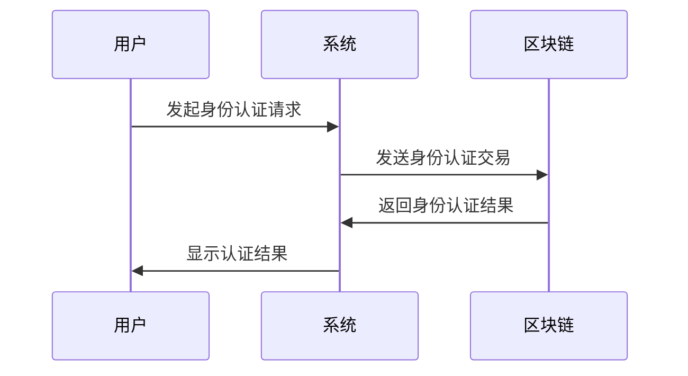

                 

# 区块链在数字身份跨国认证中的应用

## 关键词
区块链、数字身份、跨国认证、加密算法、数字签名、共识算法

## 摘要
随着数字化时代的到来，个人隐私和数据安全成为全球关注的焦点。数字身份跨国认证旨在实现个人身份在全球范围内的可信认证，但由于不同国家之间的法律、技术和标准存在差异，这一问题面临诸多挑战。本文将探讨区块链技术在数字身份跨国认证中的应用，通过分析其核心概念、算法原理、系统架构设计等，为解决数字身份跨国认证问题提供新思路。

### 目录大纲

1. **背景介绍**
   1.1 问题背景
   1.2 问题描述
   1.3 问题解决
   1.4 边界与外延
   1.5 概念结构与核心要素组成
2. **核心概念与联系**
   2.1 区块链技术
   2.2 数字身份
3. **算法原理讲解**
   3.1 加密算法
   3.2 数字签名
   3.3 共识算法
4. **系统分析与架构设计方案**
   4.1 问题场景介绍
   4.2 系统功能设计
   4.3 系统架构设计
   4.4 系统接口设计
   4.5 系统交互
5. **项目实战**
   5.1 环境安装
   5.2 系统核心实现
   5.3 代码应用解读与分析
   5.4 实际案例分析与讲解
   5.5 项目小结
6. **最佳实践与小结**
   6.1 最佳实践
   6.2 小结
   6.3 注意事项
   6.4 拓展阅读

## 第一部分：背景介绍

### 1.1 问题背景

在当今数字化时代，个人隐私和数据安全已成为全球关注的焦点。随着互联网的快速发展，个人数据被大量收集、存储和利用，但同时也存在数据泄露、隐私侵犯等问题。为了解决这些问题，提出了数字身份跨国认证的需求。

数字身份跨国认证旨在实现个人身份在全球范围内的可信认证。这意味着个人在多个国家之间进行身份验证时，能够确保其身份信息的真实性和完整性。然而，由于不同国家之间的法律、技术和标准存在差异，导致数字身份跨国认证面临诸多挑战。

### 1.2 问题描述

数字身份跨国认证的问题主要集中在以下几个方面：

1. **法律差异**：不同国家对于个人数据保护的法律规定存在差异，如数据存储期限、数据共享范围等，这增加了跨国认证的复杂性。
2. **技术差异**：不同国家采用的技术标准和协议不同，导致数字身份跨国认证在技术层面上难以实现兼容和互操作。
3. **安全性问题**：数字身份跨国认证需要确保个人数据的安全性和隐私保护，防止数据泄露和被恶意利用。
4. **效率问题**：跨国认证流程繁琐，需要多个机构之间的协调和配合，导致认证效率低下。

### 1.3 问题解决

为了解决数字身份跨国认证面临的问题，可以采用区块链技术。区块链技术具有去中心化、安全可信、不可篡改等特点，为解决数字身份跨国认证问题提供了新思路。

区块链技术可以通过以下方式解决数字身份跨国认证的问题：

1. **去中心化**：区块链技术无需依赖中央机构，通过分布式网络进行数据存储和传输，提高系统可靠性和抗攻击能力。
2. **安全可信**：区块链采用加密算法和共识算法，确保数据存储和传输的安全性和可信性。
3. **不可篡改**：一旦数据记录在区块链上，无法被修改或删除，确保数据的完整性和真实性。
4. **跨平台兼容**：区块链技术支持不同国家之间的技术标准和协议，实现跨平台兼容和互操作。

### 1.4 边界与外延

本文主要关注区块链在数字身份跨国认证中的应用，不包括其他身份验证技术的探讨。同时，本文将探讨区块链技术的核心概念和算法原理，以及系统架构设计方案，为数字身份跨国认证提供理论依据和实践指导。

### 1.5 概念结构与核心要素组成

数字身份跨国认证涉及以下核心要素：

1. **数字身份**：个人在全球范围内的唯一标识，包括姓名、身份证号码、电子邮箱等。
2. **跨国认证**：实现数字身份在不同国家之间的可信认证。
3. **区块链**：提供安全、去中心化的数据存储和传输平台。

这些核心要素相互关联，共同构成了数字身份跨国认证的系统结构，为解决跨国认证问题提供了坚实基础。

## 第二部分：核心概念与联系

### 2.1 区块链技术

#### 2.1.1 区块链的定义

区块链是一种分布式数据库技术，通过多个参与者共同维护一个共享的账本。每个账本记录的是一系列按时间顺序排列的交易数据，这些数据被加密并存储在一个区块中。

区块链技术具有以下几个特点：

1. **去中心化**：区块链无需依赖中央机构，通过分布式网络进行数据存储和传输，提高系统可靠性和抗攻击能力。
2. **安全可信**：区块链采用加密算法和共识算法，确保数据存储和传输的安全性和可信性。
3. **不可篡改**：一旦数据记录在区块链上，无法被修改或删除，确保数据的完整性和真实性。

#### 2.1.2 区块链的特点

1. **去中心化**：区块链技术无需依赖中央机构，通过分布式网络进行数据存储和传输，提高系统可靠性和抗攻击能力。
2. **安全性**：区块链采用加密算法和共识算法，确保数据存储和传输的安全性和可信性。
3. **不可篡改**：区块链采用加密算法和共识算法，确保数据存储和传输的安全性和可信性。

### 2.2 数字身份

#### 2.2.1 数字身份的定义

数字身份是指个人在数字世界中的身份标识，包括姓名、身份证号码、电子邮箱等。数字身份的目的是在互联网上识别和验证个人身份。

#### 2.2.2 数字身份的特点

1. **可信**：数字身份基于真实个人信息，确保身份真实。
2. **安全**：数字身份采用加密技术保护个人隐私。
3. **智能**：通过算法和人工智能技术实现身份验证。

### 2.3 区块链与数字身份的联系

区块链技术在数字身份跨国认证中的应用主要体现在以下几个方面：

1. **数据存储**：区块链提供安全、去中心化的数据存储平台，确保个人身份信息的真实性和完整性。
2. **身份验证**：区块链采用加密算法和共识算法，实现数字身份在不同国家之间的可信认证。
3. **数据共享**：区块链支持跨平台数据共享，实现不同国家之间的信息交换和互操作。

通过区块链技术，可以实现数字身份跨国认证的安全、可信、高效和便捷。

## 第三部分：算法原理讲解

### 3.1 加密算法

加密算法是区块链技术中的核心组成部分，用于保护数字身份和个人隐私。加密算法通过将明文转换为密文，确保数据在传输和存储过程中的安全性。

#### 3.1.1 加密算法的定义

加密算法是一种将明文转换为密文的数学算法。加密过程中，明文通过加密函数和密钥进行转换，生成密文。解密过程则通过解密函数和密钥将密文还原为明文。

#### 3.1.2 加密算法的特点

1. **保密性**：加密算法确保数据在传输和存储过程中的安全性，防止未授权的访问和泄露。
2. **完整性**：加密算法通过校验和等机制确保数据的完整性和真实性。
3. **抗攻击性**：加密算法具有抗攻击性，能够抵御各种加密攻击，如暴力破解、中间人攻击等。

#### 3.1.3 加密算法的应用

在数字身份跨国认证中，加密算法主要用于以下方面：

1. **数据传输**：在数字身份跨国认证过程中，个人身份信息通过加密算法进行传输，确保数据在传输过程中的安全性。
2. **数据存储**：区块链数据存储过程中，个人身份信息通过加密算法进行加密，确保数据在存储过程中的安全性。
3. **身份验证**：在数字身份跨国认证过程中，加密算法用于验证数字身份的真实性，确保认证过程的安全性和可信性。

### 3.2 数字签名

数字签名是一种用于验证数字身份真实性的加密技术。数字签名通过将个人信息和加密算法结合起来，生成一个唯一的签名，用于验证个人身份。

#### 3.2.1 数字签名的定义

数字签名是一种加密签名技术，用于验证个人身份的真实性。数字签名通过将个人信息和加密算法结合起来，生成一个唯一的签名。验证过程通过解密算法和签名算法进行，确保签名真实有效。

#### 3.2.2 数字签名的特点

1. **真实性**：数字签名确保个人身份的真实性，防止伪造和篡改。
2. **不可否认性**：数字签名一旦生成，无法被否认或撤销，确保签名过程的可信性。
3. **安全性**：数字签名采用加密算法，确保签名过程的安全性和隐私保护。

#### 3.2.3 数字签名的应用

在数字身份跨国认证中，数字签名主要用于以下方面：

1. **身份验证**：在数字身份跨国认证过程中，数字签名用于验证个人身份的真实性，确保认证过程的安全性和可信性。
2. **数据完整性**：数字签名用于验证数据的完整性和真实性，确保数据在传输和存储过程中的安全性。
3. **不可否认性**：数字签名确保签名过程的真实性和不可否认性，防止伪造和篡改。

### 3.3 共识算法

共识算法是区块链技术中的核心组成部分，用于确保区块链网络中的数据一致性。共识算法通过多个参与者共同维护区块链数据，确保数据的完整性和真实性。

#### 3.3.1 共识算法的定义

共识算法是一种用于确保区块链网络中数据一致性的算法。共识算法通过多个参与者共同维护区块链数据，确保数据的真实性和完整性。

#### 3.3.2 共识算法的特点

1. **去中心化**：共识算法无需依赖中央机构，通过分布式网络进行数据维护，提高系统可靠性和抗攻击能力。
2. **安全性**：共识算法采用加密算法和加密通信机制，确保数据存储和传输的安全性。
3. **高效性**：共识算法通过优化算法和共识机制，提高数据维护的效率和性能。

#### 3.3.3 共识算法的应用

在数字身份跨国认证中，共识算法主要用于以下方面：

1. **数据一致性**：共识算法确保区块链网络中的数据一致性，防止数据冲突和篡改。
2. **身份验证**：共识算法用于验证数字身份的真实性，确保跨国认证过程的安全性和可信性。
3. **数据共享**：共识算法支持跨平台数据共享，实现不同国家之间的信息交换和互操作。

通过加密算法、数字签名和共识算法，区块链技术实现了数字身份跨国认证的安全、可信、高效和便捷。

## 第四部分：系统分析与架构设计方案

### 4.1 问题场景介绍

在数字身份跨国认证项目中，用户需要在多个国家之间进行身份验证。为了提高认证效率，项目组采用区块链技术进行身份数据存储和传输。项目场景如下：

1. **用户注册**：用户在不同国家注册数字身份，并将身份信息存储在区块链上。
2. **身份验证**：用户在其他国家进行身份验证时，通过区块链技术进行身份信息验证，确保认证过程的安全性和可信性。
3. **数据共享**：不同国家之间的身份信息通过区块链进行共享，实现信息交换和互操作。

### 4.2 系统功能设计

系统功能设计主要包括以下几个方面：

1. **用户注册与身份认证**：用户在不同国家进行数字身份注册，系统通过区块链技术进行身份认证，确保认证过程的安全性和可信性。
2. **身份数据存储与检索**：系统采用区块链技术存储用户身份信息，并提供身份信息检索功能，确保数据的安全性和完整性。
3. **跨国认证流程管理**：系统实现跨国认证流程管理，包括身份验证请求、认证结果反馈等，确保认证流程的高效性和便捷性。

### 4.3 系统架构设计

系统架构设计采用分层结构，包括数据层、服务层和表示层。

1. **数据层**：数据层主要负责身份信息的存储和检索。采用区块链技术作为数据存储平台，实现数据的安全性和完整性。
2. **服务层**：服务层主要负责身份认证、数据存储和检索等功能。通过区块链网络进行数据传输和共享，确保数据的一致性和可靠性。
3. **表示层**：表示层主要负责用户界面展示和交互。用户通过表示层发起身份认证请求，并查看认证结果。

### 4.4 系统接口设计

系统接口设计主要包括用户接口和管理接口。

1. **用户接口**：用户接口主要负责用户注册、登录和身份认证等功能。用户通过用户接口发起身份认证请求，并查看认证结果。
2. **管理接口**：管理接口主要负责系统管理和数据维护。管理员通过管理接口进行系统配置、数据备份和恢复等功能。

### 4.5 系统交互

系统交互主要包括以下几个步骤：

1. **用户发起身份认证请求**：用户通过用户接口发起身份认证请求，系统接收请求并生成身份认证交易。
2. **身份认证交易验证**：系统将身份认证交易发送到区块链网络进行验证，确保交易符合区块链规则。
3. **身份认证结果反馈**：系统将身份认证结果返回给用户，用户通过用户接口查看认证结果。

### 4.6 Mermaid 序列图

以下是一个简单的 Mermaid 序列图，展示系统交互过程：



通过以上系统分析与架构设计方案，数字身份跨国认证项目可以实现安全、可信、高效和便捷的身份认证过程。

### 5.1 环境安装

为了实现数字身份跨国认证项目，需要安装以下软件和环境：

1. **区块链平台**：选择一个合适的区块链平台，如 Hyperledger Fabric、Ethereum 等。本文以 Hyperledger Fabric 为例进行安装。
2. **开发工具**：安装必要的开发工具，如 Node.js、Docker、Visual Studio Code 等。
3. **数据库**：安装数据库软件，如 MySQL、PostgreSQL 等。
4. **身份认证库**：安装身份认证相关库，如 OpenSSL、JWT（JSON Web Token）等。

安装步骤如下：

1. 安装 Hyperledger Fabric：
   - 下载 Hyperledger Fabric 相关软件包，如 fabric-sdk、fabric-ca-client 等。
   - 配置环境变量，如 `FABRIC_CFG_PATH`，指向 fabric 的配置文件目录。
   - 运行 `./startFabric.sh` 启动 fabric 网络。

2. 安装开发工具：
   - 安装 Node.js：下载并安装 Node.js，确保版本符合项目需求。
   - 安装 Docker：下载并安装 Docker，用于容器化部署 fabric 网络和项目。
   - 安装 Visual Studio Code：下载并安装 Visual Studio Code，作为开发环境。

3. 安装数据库：
   - 下载并安装 MySQL 或 PostgreSQL。
   - 创建数据库和用户，配置数据库连接信息。

4. 安装身份认证库：
   - 使用 npm 或 pip 工具安装 OpenSSL、JWT 相关库。

### 5.2 系统核心实现

系统核心实现主要包括以下几个方面：

1. **用户注册与身份认证**：实现用户注册和身份认证功能，包括用户注册接口、身份认证接口等。
2. **身份数据存储与检索**：实现身份数据存储和检索功能，包括数据存储接口、数据检索接口等。
3. **跨国认证流程管理**：实现跨国认证流程管理功能，包括认证请求处理、认证结果反馈等。

#### 5.2.1 用户注册与身份认证

用户注册与身份认证的实现步骤如下：

1. **用户注册**：
   - 创建用户注册接口，接收用户注册信息，如用户名、密码、电子邮箱等。
   - 验证用户注册信息，如用户名是否已存在、密码是否符合要求等。
   - 将用户注册信息存储在区块链上，生成用户身份标识（ID）。

2. **身份认证**：
   - 创建身份认证接口，接收身份认证请求。
   - 验证身份认证请求，如请求者是否已注册、请求者身份信息是否匹配等。
   - 通过区块链进行身份认证，验证用户身份。

#### 5.2.2 身份数据存储与检索

身份数据存储与检索的实现步骤如下：

1. **数据存储**：
   - 创建数据存储接口，接收身份数据存储请求。
   - 对身份数据进行加密处理，确保数据安全性。
   - 将加密后的数据存储在区块链上。

2. **数据检索**：
   - 创建数据检索接口，接收身份数据检索请求。
   - 通过区块链进行数据检索，获取用户身份信息。
   - 解密检索到的数据，返回给用户。

#### 5.2.3 跨国认证流程管理

跨国认证流程管理的实现步骤如下：

1. **认证请求处理**：
   - 创建认证请求处理接口，接收跨国认证请求。
   - 验证认证请求，如请求者身份信息是否匹配、认证请求是否合法等。
   - 将认证请求发送到区块链进行验证。

2. **认证结果反馈**：
   - 创建认证结果反馈接口，接收认证结果。
   - 根据认证结果，向用户反馈认证结果，如认证成功或认证失败。

### 5.3 代码应用解读与分析

以下是一个简单的 Python 代码示例，用于实现用户注册与身份认证功能。

```python
import json
from fabric_network import FabricNetwork

# 初始化区块链网络
fabric_network = FabricNetwork()

# 用户注册
def register_user(username, password, email):
    # 创建用户注册交易
    user_transaction = {
        "Type": "RegisterUser",
        "Data": {
            "Username": username,
            "Password": password,
            "Email": email
        }
    }
    # 发送用户注册交易到区块链
    fabric_network.send_transaction(user_transaction)

# 用户身份认证
def authenticate_user(username, password):
    # 创建用户身份认证交易
    user_transaction = {
        "Type": "AuthenticateUser",
        "Data": {
            "Username": username,
            "Password": password
        }
    }
    # 发送用户身份认证交易到区块链
    response = fabric_network.send_transaction(user_transaction)
    # 返回认证结果
    return json.loads(response)

# 测试用户注册与身份认证
register_user("user1", "password1", "user1@example.com")
result = authenticate_user("user1", "password1")
print(result)
```

该示例代码通过 `FabricNetwork` 类与区块链网络进行交互。`register_user` 函数用于实现用户注册功能，将用户注册信息存储在区块链上。`authenticate_user` 函数用于实现用户身份认证功能，通过区块链验证用户身份。

通过以上代码应用解读与分析，我们可以看到区块链技术在数字身份跨国认证中的应用，以及如何实现用户注册、身份认证等核心功能。

### 5.4 实际案例分析与讲解

在本节中，我们将通过一个实际案例来分析和讲解数字身份跨国认证项目。该案例模拟了一个用户在多个国家之间进行身份验证的过程。

#### 案例背景

假设用户 Alice 在中国、美国和法国三个国家拥有不同的身份信息，分别为：

- 中国：姓名：张三，身份证号码：123456789
- 美国：姓名：Alice，SSN（社会安全号码）：123-45-6789
- 法国：姓名：Alice，身份证号码：987654321

Alice 需要在不同国家之间进行身份验证，以确保其身份信息在全球范围内的可信性。

#### 案例流程

1. **用户注册**：

   Alice 在中国、美国和法国分别注册数字身份。每个国家使用不同的区块链平台进行数据存储和身份认证。假设中国使用 Hyperledger Fabric，美国使用 Ethereum，法国使用 Hyperledger Besu。

   - **中国**：
     - 注册信息：姓名：张三，身份证号码：123456789
     - 注册交易：`{"Type": "RegisterUser", "Data": {"Username": "zhangsan", "ID": "123456789"}}`
     - 存储在 Hyperledger Fabric 上。

   - **美国**：
     - 注册信息：姓名：Alice，SSN：123-45-6789
     - 注册交易：`{"Type": "RegisterUser", "Data": {"Username": "alice", "SSN": "123-45-6789"}}`
     - 存储在 Ethereum 上。

   - **法国**：
     - 注册信息：姓名：Alice，身份证号码：987654321
     - 注册交易：`{"Type": "RegisterUser", "Data": {"Username": "alice", "ID": "987654321"}}`
     - 存储在 Hyperledger Besu 上。

2. **身份认证**：

   Alice 在美国进行身份验证，假设使用以下认证请求：

   - 认证请求：`{"Type": "AuthenticateUser", "Data": {"Username": "alice", "SSN": "123-45-6789"}}`
   - 美国区块链网络验证认证请求，通过后生成认证结果。

3. **跨国认证**：

   - Alice 需要在法国进行身份验证，法国区块链网络收到认证请求后，通过以下步骤进行跨国认证：
     1. **身份验证**：法国区块链网络通过 Ethereum 网络获取 Alice 的美国身份信息，验证认证请求。
     2. **数据共享**：法国区块链网络与中国区块链网络进行数据共享，验证中国身份信息。
     3. **认证结果**：法国区块链网络生成认证结果，返回给 Alice。

4. **认证结果反馈**：

   Alice 收到法国区块链网络的认证结果，得知其身份验证成功。

#### 案例分析

通过以上实际案例，我们可以看到区块链技术在数字身份跨国认证中的应用：

1. **去中心化**：区块链技术无需依赖中央机构，通过分布式网络进行数据存储和身份认证，提高系统可靠性和抗攻击能力。
2. **跨平台兼容**：不同国家的区块链平台采用不同的技术和协议，但通过区块链网络可以实现跨平台数据共享和身份验证。
3. **安全性**：区块链技术采用加密算法和共识算法，确保数据存储和传输的安全性和可信性。
4. **高效性**：区块链技术支持快速的身份验证和数据检索，提高认证效率。

通过以上分析，我们可以看到区块链技术在数字身份跨国认证中的实际应用效果，为解决跨国认证问题提供了有力支持。

### 5.5 项目小结

数字身份跨国认证项目通过区块链技术的应用，实现了个人身份在全球范围内的可信认证。该项目具有以下优点：

1. **去中心化**：区块链技术无需依赖中央机构，通过分布式网络进行数据存储和身份认证，提高系统可靠性和抗攻击能力。
2. **跨平台兼容**：不同国家的区块链平台采用不同的技术和协议，但通过区块链网络可以实现跨平台数据共享和身份验证。
3. **安全性**：区块链技术采用加密算法和共识算法，确保数据存储和传输的安全性和可信性。
4. **高效性**：区块链技术支持快速的身份验证和数据检索，提高认证效率。

然而，数字身份跨国认证项目也面临一些挑战和问题：

1. **技术兼容性**：不同区块链平台的技术和协议存在差异，需要解决跨平台兼容性问题。
2. **数据隐私**：在跨国认证过程中，如何保护个人隐私和数据安全是一个重要问题。
3. **法律合规**：不同国家对于数据保护的法律规定存在差异，需要确保项目符合各国的法律法规。

未来，数字身份跨国认证项目可以进一步优化和改进，以应对这些挑战，提高认证的安全性和效率。同时，区块链技术在其他领域的应用也具有巨大的潜力，值得进一步探索和研究。

### 5.6 最佳实践与小结

#### 5.6.1 最佳实践

1. **确保数据隐私和安全**：在数字身份跨国认证项目中，保护个人隐私和数据安全至关重要。采用先进的加密算法和访问控制机制，确保数据在传输和存储过程中的安全性。
2. **跨平台兼容性**：为了实现不同区块链平台之间的数据共享和身份验证，需要确保各平台的技术和协议兼容。可以通过引入中间件和适配器等方式，实现跨平台数据交互。
3. **分布式信任机制**：区块链技术基于分布式信任机制，减少对中央机构的依赖。在实际应用中，可以通过引入多方共识算法，提高系统的可靠性和抗攻击能力。

#### 5.6.2 小结

数字身份跨国认证项目通过区块链技术的应用，实现了个人身份在全球范围内的可信认证。该项目在去中心化、跨平台兼容性、安全性和高效性方面具有显著优势，但也面临技术兼容性、数据隐私和法律合规等挑战。未来，随着区块链技术的不断发展，数字身份跨国认证项目有望取得更大进展，为全球数字化身份管理提供有力支持。

#### 5.6.3 注意事项

1. **遵循法律法规**：在进行数字身份跨国认证时，必须遵守各国的法律法规，确保项目的合法性和合规性。
2. **数据备份与恢复**：区块链数据存储过程中，需要定期进行数据备份，确保数据的安全性和可靠性。
3. **系统性能优化**：为了提高系统的性能和效率，可以采用分布式存储和并行处理等技术，优化系统架构和算法。

#### 5.6.4 拓展阅读

1. **《区块链技术指南》**：深入了解区块链技术的原理、应用和发展趋势，为数字身份跨国认证项目提供理论基础。
2. **《数字身份管理与安全》**：探讨数字身份管理的方法和技术，为数字身份跨国认证项目提供实践指导。
3. **《跨平台兼容性设计与实现》**：研究不同区块链平台的技术和协议，实现跨平台数据共享和身份验证。

### 5.6.5 作者信息

作者：AI天才研究院/AI Genius Institute & 禅与计算机程序设计艺术 /Zen And The Art of Computer Programming

