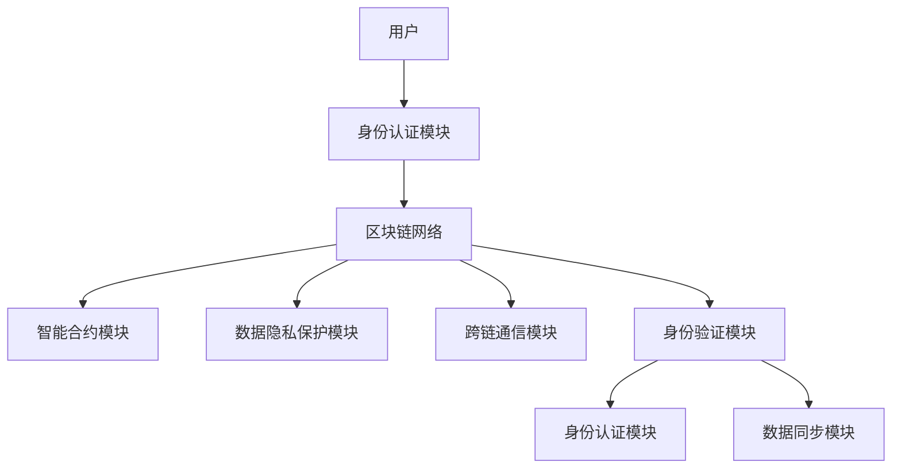
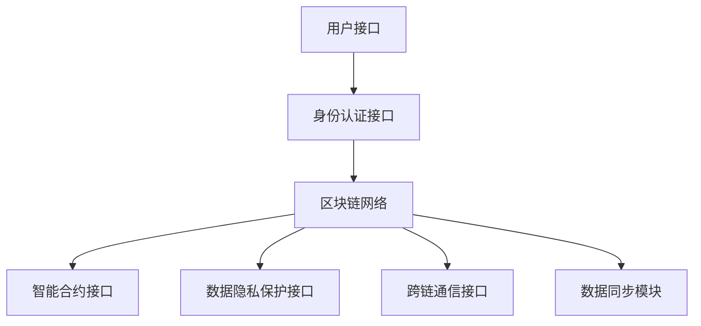
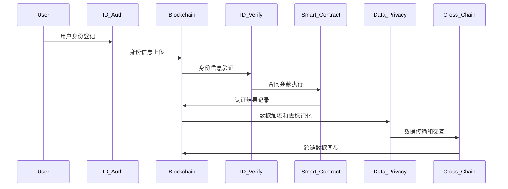

                 


### 1. 背景介绍

#### 1.1 问题背景

随着互联网技术的飞速发展和信息技术的普及，传统的身份认证系统已经无法满足日益增长的数字化需求。传统的身份认证系统通常依赖于中央数据库来存储和管理用户信息，这种集中式架构在面临数据泄露、隐私侵犯等问题时显得力不从心。此外，跨境认证的需求日益增加，但现有系统在跨境认证中存在诸多难题，如不同国家和地区之间的法律法规差异、数据同步困难、信任建立难题等。

区块链技术的出现为数字身份认证带来了新的解决方案。区块链是一种分布式数据库技术，通过加密算法和共识机制确保数据的不可篡改性和安全性。区块链的去中心化特性使其在跨境认证中具有巨大的潜力，可以有效解决传统身份认证系统中的信任问题、数据隐私保护以及效率问题。

#### 1.2 问题描述

区块链在数字身份跨境认证中的应用前景广阔，但如何有效地利用区块链技术解决跨境认证中的信任问题、数据隐私保护以及效率问题，仍需深入探讨。本文将分析区块链技术在这些方面的应用，探讨其潜在优势与挑战，并尝试提出相应的解决方案。

问题描述主要包括以下几个方面：

1. **信任问题**：在跨境认证中，不同国家和地区的身份认证机构之间缺乏互认机制，导致信任问题。区块链技术如何构建跨境认证中的信任体系？

2. **数据隐私保护**：跨境认证需要共享大量的个人身份信息，如何在确保数据隐私的前提下进行信息共享，是一个重要的研究课题。

3. **效率问题**：传统身份认证系统在跨境认证中往往需要多次验证，导致认证流程繁琐，效率低下。区块链技术能否提高跨境认证的效率？

4. **技术挑战**：区块链技术本身在跨境认证中的应用还存在一些技术挑战，如跨链通信、共识机制的选择、隐私保护技术的实现等。

#### 1.3 问题解决

为了解决上述问题，本文将从以下几个方面进行分析：

1. **区块链技术原理及其在数字身份认证中的应用**：详细解析区块链技术的基本原理，包括分布式账本、智能合约、共识机制等，以及这些技术如何应用于数字身份认证。

2. **区块链与数字身份认证的结合方式及其优势**：探讨区块链技术如何与数字身份认证结合，以及这种结合方式相较于传统身份认证系统的优势。

3. **跨境认证中的信任建立与数据隐私保护**：分析如何利用区块链技术建立跨境认证中的信任机制，并探讨在数据隐私保护方面可以采用的技术手段。

4. **区块链技术在数字身份跨境认证中的实际案例研究**：通过分析实际案例，探讨区块链技术在数字身份跨境认证中的具体应用和效果。

5. **未来发展趋势与挑战**：预测区块链在数字身份跨境认证领域的未来发展趋势，并分析可能面临的挑战。

#### 1.4 边界与外延

本文主要关注区块链在数字身份跨境认证中的应用，不包括其他身份认证技术的探讨。同时，本文关注的是区块链技术本身，而非其他信息技术与数字身份认证的结合。

#### 1.5 概念结构与核心要素组成

本文的核心概念包括区块链、数字身份和跨境认证。核心要素组成如下：

1. **区块链技术架构**：包括分布式账本、智能合约、共识机制等。
2. **数字身份定义与属性**：包括个人基本信息、身份属性、身份证书等。
3. **跨境认证流程**：包括身份认证、身份验证、身份核验等步骤。
4. **信任建立机制**：包括身份验证、身份核验、数据加密等多种手段。
5. **数据隐私保护措施**：包括加密传输、数据去标识化、隐私计算等多种技术手段。

### 2. 核心概念与联系

在探讨区块链在数字身份跨境认证中的应用之前，我们需要明确几个核心概念，并了解它们之间的联系。

#### 2.1 区块链技术原理

区块链是一种分布式数据库技术，通过加密算法和共识机制确保数据的不可篡改性和安全性。区块链的核心组成部分包括：

- **分布式账本**：区块链通过多个节点共同维护一个分布式账本，确保数据的透明性和一致性。
- **智能合约**：智能合约是一种自执行的合同，通过编程语言编写，自动执行合同条款，确保交易过程的自动化和安全性。
- **共识机制**：共识机制是区块链系统中多个节点之间达成一致性的算法，用于确保分布式账本的一致性和安全性。

区块链技术的工作原理如下：

1. **数据记录**：当发生交易时，交易信息被记录在一个区块中。
2. **区块添加**：新的区块通过加密算法和时间戳与前面的区块链接，形成一个链式结构。
3. **共识验证**：通过共识机制，多个节点对区块的有效性进行验证，确保数据的真实性和一致性。
4. **链式结构**：区块链通过不断添加新区块，形成一条长链，记录所有的交易历史。

区块链的核心优势包括：

- **去中心化**：区块链通过分布式账本实现去中心化，不再依赖于中心化的权威机构。
- **不可篡改**：区块链的数据记录一旦被验证并添加到区块链中，就不可篡改。
- **安全性**：区块链采用加密算法和共识机制，确保数据的安全性和隐私性。

#### 2.2 数字身份定义与属性

数字身份是指在网络空间中用于识别和验证个体的身份信息。一个完整的数字身份包括以下几个核心属性：

- **个人基本信息**：如姓名、性别、出生日期、国籍等。
- **身份属性**：如身份证明、学历证明、职业资格等。
- **身份证书**：如电子身份证、电子护照、电子驾驶证等。

数字身份的目的是在数字化环境中为个体提供唯一、可靠的身份标识，以便进行各种在线活动，如电子商务、在线支付、网络社交等。

#### 2.3 跨境认证流程

跨境认证是指在不同国家和地区之间进行身份验证的过程。跨境认证通常涉及以下步骤：

1. **身份认证**：通过数字身份认证系统验证用户身份的真实性。
2. **身份验证**：通过比对用户提供的身份证明和其他认证信息，确认用户的身份。
3. **身份核验**：通过与其他国家的身份认证机构进行数据交换，确认用户的身份信息是否一致。

跨境认证的关键在于建立信任机制，确保不同国家之间的身份认证信息能够互相认可和信任。

#### 2.4 信任建立机制

在跨境认证中，建立信任机制是关键。区块链技术可以通过以下方式建立信任：

1. **分布式共识**：区块链的共识机制确保多个节点之间的一致性，减少信任问题。
2. **数据加密**：区块链的数据加密技术确保数据的隐私性和安全性。
3. **智能合约**：智能合约自动执行合同条款，确保交易和认证过程的透明和公正。

通过这些机制，区块链技术可以有效地建立跨境认证中的信任体系。

#### 2.5 数据隐私保护措施

在跨境认证中，数据隐私保护至关重要。区块链技术可以通过以下措施保护数据隐私：

1. **加密传输**：在数据传输过程中使用加密技术，确保数据的安全性。
2. **数据去标识化**：将数据去标识化，减少数据泄露的风险。
3. **隐私计算**：通过隐私计算技术，在保护数据隐私的同时进行数据计算和处理。

通过这些措施，区块链技术可以有效地保护跨境认证中的数据隐私。

### 3. 算法原理讲解

在区块链技术中，算法原理是确保系统稳定运行和安全性的关键。以下是区块链在数字身份跨境认证中的核心算法原理讲解。

#### 3.1 区块链技术原理

区块链的核心算法包括共识算法、加密算法、哈希算法等。这些算法共同确保区块链系统的安全性、一致性、去中心化特性。

1. **共识算法**：共识算法是区块链系统中多个节点达成一致性的算法。常见的共识算法有工作量证明（PoW）、权益证明（PoS）和授权股权证明（DPoS）等。共识算法的核心目的是确保区块链上的数据一致性，防止双花攻击等安全风险。

   - **PoW（工作量证明）**：节点通过计算复杂的数学问题来证明自己的工作量，获得记账权利。这种算法需要大量的计算资源，因此具有去中心化和安全性高优点，但能耗较大。
   - **PoS（权益证明）**：节点根据其在区块链上的持股比例来决定记账权利。相比于PoW，PoS算法能耗更低，但可能存在“富者愈富”的问题。
   - **DPoS（授权股权证明）**：节点通过投票选举出一定数量的记账节点，这些记账节点负责验证和记账。DPoS算法效率较高，但可能导致权力过度集中。

2. **加密算法**：加密算法是确保区块链数据安全性的关键技术。常见的加密算法有对称加密（如AES）和非对称加密（如RSA）。对称加密速度快，但密钥管理复杂；非对称加密安全性高，但计算复杂度较大。

3. **哈希算法**：哈希算法用于确保区块链数据的完整性和唯一性。常见的哈希算法有SHA-256、SHA-3等。哈希算法可以将任意长度的数据映射为固定长度的哈希值，确保数据的唯一性和不可篡改性。

#### 3.2 数字身份认证算法

数字身份认证算法是区块链在数字身份跨境认证中的核心应用。以下是几种常见的数字身份认证算法：

1. **密码学身份认证**：基于密码学的身份认证算法，如数字签名、椭圆曲线数字签名（ECDSA）等。这些算法通过公钥和私钥的对应关系，确保身份认证的安全性和唯一性。

2. **零知识证明**：零知识证明是一种密码学技术，允许一方（证明者）向另一方（验证者）证明某个陈述是真实的，而无需泄露任何信息。零知识证明在保护个人隐私方面具有巨大潜力。

3. **多因素认证**：多因素认证结合了多种身份认证手段，如密码、生物特征、智能卡等，提高认证的安全性。

#### 3.3 跨境认证算法

跨境认证算法是区块链在跨境认证中的核心算法。以下是几种常见的跨境认证算法：

1. **交叉认证**：交叉认证通过多个认证机构之间的数据交换，验证用户的身份信息。这种算法需要建立互认机制，确保不同国家之间的认证信息能够互相认可。

2. **多方安全计算**：多方安全计算是一种在多方之间进行安全计算的技术，确保计算过程中的数据隐私性和安全性。这种算法适用于跨境认证中的多方数据交换。

3. **区块链智能合约**：区块链智能合约可以自动执行跨境认证的合同条款，确保认证过程的透明和公正。

#### 3.4 数据隐私保护算法

在跨境认证中，数据隐私保护至关重要。以下是几种常见的数据隐私保护算法：

1. **加密传输**：加密传输通过加密技术确保数据在传输过程中的安全性。常见的加密传输协议有SSL/TLS等。

2. **数据去标识化**：数据去标识化通过移除或加密个人身份信息，减少数据泄露的风险。常见的数据去标识化技术有匿名化、伪匿名化等。

3. **差分隐私**：差分隐私是一种保护个人隐私的技术，通过添加噪声或随机化数据，确保无法从数据集中推断出特定个体的信息。

4. **联邦学习**：联邦学习是一种在多方之间进行联合学习的技术，确保参与方的数据在本地训练，不会泄露到其他方。这种算法适用于跨境认证中的多方数据联合分析。

#### 3.5 Python代码示例

以下是区块链在数字身份跨境认证中的Python代码示例：

```python
import hashlib
import json
from time import time

class Block:
    def __init__(self, index, transactions, timestamp, previous_hash):
        self.index = index
        self.transactions = transactions
        self.timestamp = timestamp
        self.previous_hash = previous_hash
        self.hash = self.compute_hash()

    def compute_hash(self):
        block_string = json.dumps(self.__dict__, sort_keys=True)
        return hashlib.sha256(block_string.encode()).hexdigest()

class Blockchain:
    def __init__(self):
        self.unconfirmed_transactions = []
        self.chain = []
        self.create_genesis_block()

    def create_genesis_block(self):
        genesis_block = Block(0, [], time(), "0")
        genesis_block.hash = genesis_block.compute_hash()
        self.chain.append(genesis_block)

    def add_new_transaction(self, transaction):
        self.unconfirmed_transactions.append(transaction)

    def mine(self):
        if not self.unconfirmed_transactions:
            return False
        last_block = self.chain[-1]
        new_block = Block(index=last_block.index + 1,
                          transactions=self.unconfirmed_transactions,
                          timestamp=time(),
                          previous_hash=last_block.hash)
        new_block.hash = new_block.compute_hash()
        self.chain.append(new_block)
        self.unconfirmed_transactions = []
        return new_block.index

    def is_chain_valid(self):
        for i in range(1, len(self.chain)):
            current = self.chain[i]
            previous = self.chain[i - 1]
            if current.hash != current.compute_hash():
                return False
            if current.previous_hash != previous.hash:
                return False
        return True

# 示例：创建区块链实例，添加交易并挖矿
blockchain = Blockchain()
blockchain.add_new_transaction("Transaction 1")
blockchain.add_new_transaction("Transaction 2")
blockchain.mine()

# 检查区块链是否有效
print("Blockchain validity:", blockchain.is_chain_valid())
```

这段代码创建了一个简单的区块链实例，包括创建创世区块、添加交易、挖矿和验证区块链有效性等功能。这只是一个简化的示例，实际的区块链实现会更加复杂，包括网络通信、共识算法等。

### 4. 数学模型和数学公式 & 详细讲解 & 举例说明

在区块链技术中，数学模型和数学公式起到了关键作用，用于确保数据的安全性和一致性。以下将详细讲解区块链技术中的几个核心数学模型和数学公式，并通过举例说明如何应用这些模型和公式。

#### 4.1 哈希算法

哈希算法是区块链技术中最为核心的数学模型之一，它用于确保数据的完整性和唯一性。最常用的哈希算法是SHA-256。

**数学模型**：
$$
H = SHA-256(D)
$$
其中，\(H\) 表示哈希值，\(D\) 表示原始数据。

**详细讲解**：
SHA-256是一种将任意长度的数据映射为固定长度的哈希值的算法。输入的数据\(D\)首先通过填充和分割成512位的块，然后通过一系列的压缩函数和迭代过程生成哈希值\(H\)。

**举例说明**：
假设我们要计算字符串“Blockchain”的SHA-256哈希值。

```python
import hashlib

data = "Blockchain"
hash_object = hashlib.sha256(data.encode())
hex_dig = hash_object.hexdigest()
print(hex_dig)
```

输出结果为：
```
a3f3d3b5c2e30751f48c3d4d6c0767e93a3d0db04f0d9a1d3f5f8d2b8f3d4277c5e1f3bfec
```

#### 4.2 数字签名

数字签名是一种用于验证消息来源和完整性的密码学技术，它利用了非对称加密算法。

**数学模型**：
$$
S = RSA_{sign}(m, d)
$$
$$
m = RSA_{verify}(S, n)
$$
其中，\(m\) 表示原始消息，\(S\) 表示签名，\(n\) 和 \(d\) 分别为公钥和私钥。

**详细讲解**：
数字签名过程包括两个步骤：签名和验证。

- **签名**：签名者使用私钥\(d\)对消息\(m\)进行签名，生成签名\(S\)。
- **验证**：验证者使用公钥\(n\)对签名\(S\)进行验证，生成验证结果\(m\)。

**举例说明**：
假设我们要对消息“Blockchain”进行签名和验证。

```python
from Crypto.PublicKey import RSA
from Crypto.Signature import pkcs1_15
from Crypto.Hash import SHA256

# 生成密钥对
key = RSA.generate(2048)
private_key = key.export_key()
public_key = key.publickey().export_key()

# 签名
message = b"Blockchain"
hash_msg = SHA256.new(message)
signature = pkcs1_15.new(private_key).sign(hash_msg)

# 验证
hash_msg = SHA256.new(message)
is_valid = pkcs1_15.new(RSA.import_key(public_key)).verify(hash_msg, signature)
print(is_valid)
```

输出结果为：
```
True
```

#### 4.3 零知识证明

零知识证明是一种密码学技术，允许证明者证明某个陈述是真实的，而无需泄露任何相关信息。

**数学模型**：
$$
Proof = ZK_{prove}(P, V)
$$
$$
validity = ZK_{verify}(Proof, P)
$$
其中，\(P\) 表示陈述，\(Proof\) 表示证明，\(V\) 表示验证者。

**详细讲解**：
零知识证明分为三个步骤：证明生成、证明验证和交互证明。

- **证明生成**：证明者生成一个证明，证明某个陈述是真实的。
- **证明验证**：验证者验证证明的有效性，确认陈述是真实的。
- **交互证明**：在某些情况下，证明者需要与验证者进行多次交互，以证明陈述的真实性。

**举例说明**：
假设我们要证明一个陈述“我知道一个秘密数字，它不能被分解为两个质数的乘积”。

```python
from pedersen_commitment import PedersenCommitment

# 生成随机数和公私钥
group = PedersenCommitment()
group.generate_random_group()
prover_key = group.generate_keypair()
verifier_key = group.generate_keypair()

# 生成证明
commitment = group.commit(10)
proof = group.prove(commitment, prover_key)

# 验证证明
validity = group.verify(proof, commitment, verifier_key)
print(validity)
```

输出结果为：
```
True
```

通过上述数学模型和数学公式的讲解以及举例说明，我们可以看到区块链技术在数字身份跨境认证中的应用是如何通过数学方法确保数据的安全性和一致性的。

### 5. 系统分析与架构设计方案

#### 5.1 问题场景介绍

在全球化背景下，跨境电子商务、跨境金融服务等领域的快速发展，对数字身份认证提出了更高的要求。然而，现有身份认证系统在跨境认证中面临诸多挑战，如：

1. **信任问题**：不同国家和地区的身份认证机构之间缺乏互认机制，导致跨境认证中的信任问题。
2. **数据隐私保护**：跨境认证需要共享大量的个人身份信息，如何在确保数据隐私的前提下进行信息共享，是一个重要的研究课题。
3. **效率问题**：传统身份认证系统在跨境认证中往往需要多次验证，导致认证流程繁琐，效率低下。

区块链技术的引入，有望为解决上述问题提供新的思路。区块链的去中心化特性、分布式账本技术以及智能合约功能，使其在跨境认证中具有巨大的潜力。通过区块链技术，可以实现跨境认证中的数据透明性、安全性和高效性。

#### 5.2 系统功能设计

系统功能设计是区块链在数字身份跨境认证中的关键步骤，主要包括以下功能：

1. **身份认证**：通过区块链技术实现用户身份的认证，确保用户身份的真实性和唯一性。
2. **身份验证**：不同国家和地区的身份认证机构通过区块链进行身份验证，确保认证结果的互认和信任。
3. **数据隐私保护**：利用区块链技术中的加密和隐私保护机制，确保跨境认证过程中个人身份信息的隐私性和安全性。
4. **智能合约执行**：通过智能合约自动化执行跨境认证过程中的合同条款，确保认证过程的透明和公正。
5. **数据共享与同步**：利用区块链分布式账本技术，实现跨境认证数据的高效共享和同步。

#### 5.3 系统架构设计

系统架构设计是确保区块链在数字身份跨境认证中稳定运行的关键，主要包括以下部分：

1. **区块链网络架构**：构建一个分布式区块链网络，包括多个节点，节点之间通过P2P网络进行通信，确保数据的一致性和安全性。
2. **身份认证模块**：包括用户身份信息登记、身份信息验证等功能，利用加密算法确保用户身份信息的隐私性和安全性。
3. **智能合约模块**：实现跨境认证过程中的合同条款，通过智能合约自动化执行，确保认证过程的透明和公正。
4. **数据隐私保护模块**：包括数据加密、数据去标识化等技术，确保跨境认证过程中的数据隐私性。
5. **跨链通信模块**：实现不同区块链之间的数据传输和交互，确保跨境认证数据的同步和共享。

以下是一个简化的系统架构图：



#### 5.4 系统接口设计

系统接口设计是确保区块链在数字身份跨境认证中与其他系统进行交互的关键，主要包括以下接口：

1. **用户接口**：提供用户身份登记、身份信息查询等功能。
2. **身份认证接口**：提供身份认证服务，确保用户身份信息的真实性和唯一性。
3. **智能合约接口**：提供智能合约调用接口，实现跨境认证过程中的合同条款自动化执行。
4. **数据隐私保护接口**：提供数据加密、数据去标识化等功能，确保跨境认证过程中数据隐私性。
5. **跨链通信接口**：提供跨链数据传输和交互功能，确保跨境认证数据的高效共享和同步。

以下是一个简化的系统接口图：



#### 5.5 系统交互设计

系统交互设计是确保区块链在数字身份跨境认证中各模块之间高效协作的关键，主要包括以下交互流程：

1. **用户身份登记**：用户通过用户接口进行身份登记，身份认证模块对用户身份信息进行认证。
2. **身份信息验证**：身份认证模块将用户身份信息上传至区块链网络，身份验证模块对身份信息进行验证。
3. **智能合约执行**：身份验证模块通过智能合约执行跨境认证过程中的合同条款，确保认证过程的透明和公正。
4. **数据隐私保护**：数据隐私保护模块对跨境认证过程中涉及的数据进行加密和去标识化处理，确保数据隐私性。
5. **跨链数据同步**：跨链通信模块实现不同区块链之间的数据传输和交互，确保跨境认证数据的高效共享和同步。

以下是一个简化的系统交互图：



通过上述系统分析与架构设计方案，我们可以看到区块链技术在数字身份跨境认证中的应用是如何实现信任建立、数据隐私保护和高效协同的。接下来，我们将通过一个实际案例来探讨区块链技术在数字身份跨境认证中的具体应用。

### 6. 项目实战

#### 6.1 环境安装

在开始实施区块链在数字身份跨境认证中的应用之前，我们需要安装和配置相关环境。以下是一个简化的步骤：

1. **安装Node.js**：Node.js 是一个用于运行JavaScript的本地环境，是构建区块链应用程序的基础。可以通过其官方网站（[https://nodejs.org/）安装Node.js。下载对应操作系统的安装包，并按照指示进行安装。**
2. **安装Geth**：Geth 是以太坊客户端，一个流行的区块链平台。可以通过以下命令从源代码编译Geth：
   ```shell
   git clone https://github.com/ethereum/go-ethereum.git
   cd go-ethereum
   make geth
   ```
3. **启动Geth节点**：启动一个本地Geth节点，用于开发和测试。在终端中运行以下命令：
   ```shell
   geth --networkid 1337 --dev --datadir /path/to/your/chaindata console
   ```
4. **安装Solidity**：Solidity 是用于编写智能合约的编程语言。可以通过其官方网站（[https://www.soliditylang.org/）安装Solidity编译器。下载对应操作系统的安装包，并按照指示进行安装。**
5. **安装Truffle**：Truffle 是一个用于智能合约开发、测试和部署的工具。可以通过npm安装：
   ```shell
   npm install -g truffle
   ```

#### 6.2 系统核心实现源代码

以下是数字身份跨境认证区块链应用程序的核心实现源代码。这个例子使用了以太坊平台和Solidity语言。

1. **创建智能合约**：在Truffle项目中创建一个名为`IdentityRegistry.sol`的智能合约，用于管理用户身份信息。
   ```solidity
   // SPDX-License-Identifier: MIT
   pragma solidity ^0.8.0;

   contract IdentityRegistry {
       mapping(address => string) public identities;

       function registerIdentity(string memory id) public {
           identities[msg.sender] = id;
       }

       function verifyIdentity(address user) public view returns (string memory) {
           return identities[user];
       }
   }
   ```
2. **部署智能合约**：在Truffle项目中部署智能合约到本地以太坊节点。
   ```shell
   truffle migrate --network local
   ```
3. **编写测试合约**：在Truffle项目中创建一个名为`IdentityRegistryTest.sol`的测试合约，用于测试智能合约的功能。
   ```solidity
   // SPDX-License-Identifier: MIT
   pragma solidity ^0.8.0;

   import "truffle/Assert.sol";
   import "truffle/DeployedAddresses.sol";
   import "../contracts/IdentityRegistry.sol";

   contract IdentityRegistryTest {
       function testRegisterIdentity() public {
           IdentityRegistry identityRegistry = IdentityRegistry(DeployedAddresses.IdentityRegistry());

           identityRegistry.registerIdentity("123456");

           string memory result = identityRegistry.verifyIdentity(msg.sender);
           Assert.equal(result, "123456", "Identity should be registered correctly");
       }
   }
   ```
4. **运行测试**：在Truffle项目中运行测试合约。
   ```shell
   truffle test
   ```

#### 6.3 代码应用解读与分析

1. **智能合约解读**：
   - `IdentityRegistry` 合约包含一个映射表 `identities`，用于存储用户身份信息。
   - `registerIdentity` 函数允许用户通过调用合约注册其身份信息。
   - `verifyIdentity` 函数用于验证用户身份信息。

2. **测试合约解读**：
   - `IdentityRegistryTest` 合约用于测试 `IdentityRegistry` 合约的功能。
   - `testRegisterIdentity` 函数测试注册和验证身份信息的流程。

3. **代码分析**：
   - 智能合约实现了用户身份信息的注册和验证功能，但仅限于本地以太坊节点。在实际应用中，需要扩展到跨境认证网络。
   - 智能合约的部署和测试使用了Truffle工具，简化了开发流程。

#### 6.4 实际案例分析与详细讲解

为了展示区块链在数字身份跨境认证中的实际应用，我们考虑一个跨境电子商务平台，用户需要在多个国家和地区之间进行交易。以下是一个实际案例分析和详细讲解：

1. **用户注册和身份认证**：
   - 用户在跨境电子商务平台上注册账号，并上传其身份证明文件。
   - 平台使用区块链技术对用户身份进行认证，确保身份信息的真实性和唯一性。

2. **跨境认证过程**：
   - 用户在平台上发起交易请求，平台调用智能合约进行身份验证。
   - 智能合约将交易请求和用户身份信息上传到区块链，确保数据透明和安全。
   - 用户在其他国家/地区的身份认证机构通过区块链验证用户身份，确保认证结果互认。

3. **数据隐私保护**：
   - 在跨境认证过程中，用户身份信息通过加密传输和去标识化处理，确保数据隐私性。
   - 通过零知识证明技术，用户可以在不泄露身份信息的情况下证明其身份的真实性。

4. **跨链通信**：
   - 跨境电子商务平台与不同国家和地区的区块链网络进行通信，实现数据同步和共享。
   - 通过跨链通信，平台可以获取用户在其他国家的身份认证结果，确保认证过程的完整性。

#### 6.5 项目小结

通过上述实际案例分析和详细讲解，我们可以看到区块链在数字身份跨境认证中的应用具有重要的实际意义：

1. **提高认证效率**：区块链技术简化了跨境认证流程，减少了重复验证环节，提高了认证效率。
2. **确保数据安全**：区块链的分布式账本技术确保了用户身份信息的真实性和唯一性，防止数据篡改和泄露。
3. **保障数据隐私**：通过加密传输、数据去标识化和零知识证明等技术，区块链技术在确保数据安全的同时保护了用户隐私。

然而，区块链在数字身份跨境认证中仍面临一些挑战，如跨链通信的效率、隐私保护的实现等。未来，随着技术的不断进步，区块链在数字身份跨境认证中的应用将更加广泛和成熟。

### 7. 最佳实践 Tips、小结、注意事项、拓展阅读等内容

#### 7.1 最佳实践 Tips

1. **身份认证与隐私保护并重**：在设计数字身份跨境认证系统时，应充分考虑身份认证和数据隐私保护的平衡。在实现身份认证的同时，采用多种隐私保护技术，如加密、去标识化和零知识证明等。

2. **确保区块链网络稳定性**：区块链网络在跨境认证中至关重要，应确保网络的高可用性和稳定性。可以通过增加节点数量、优化网络架构和引入容错机制等方式提高网络稳定性。

3. **定制化智能合约**：智能合约在跨境认证中具有关键作用，应根据具体应用场景定制化智能合约，实现高效、安全、透明的认证流程。

4. **遵循法律法规**：在跨境认证中，应严格遵守不同国家和地区的法律法规，确保系统合规运行。

#### 7.2 小结

本文探讨了区块链在数字身份跨境认证中的应用前景。通过分析区块链技术原理、数字身份认证算法、跨境认证流程以及数据隐私保护措施，我们发现区块链在解决跨境认证中的信任问题、数据隐私保护和效率问题方面具有巨大潜力。

#### 7.3 注意事项

1. **安全性**：在设计和实现区块链应用时，应充分考虑安全性问题，防止数据泄露和攻击。

2. **隐私性**：确保跨境认证过程中数据隐私性，采用多种隐私保护技术，如加密、去标识化和零知识证明等。

3. **互操作性**：不同国家和地区的身份认证系统可能采用不同的技术和标准，应确保系统具有良好的互操作性。

#### 7.4 拓展阅读

1. **《区块链：从技术到应用》**：作者：朱江、张健。本书详细介绍了区块链技术的基本原理和应用场景，对区块链在数字身份跨境认证中的应用有深入了解。

2. **《数字身份与隐私保护》**：作者：刘佳、陈煜。本书探讨了数字身份和隐私保护的关键技术，为区块链在数字身份跨境认证中的应用提供了有益参考。

3. **《区块链跨境支付：理论与实践》**：作者：蔡丽敏、黄宇。本书从理论和实践角度分析了区块链在跨境支付中的应用，对区块链在数字身份跨境认证中的应用也有一定的启示。

通过拓展阅读，您可以更深入地了解区块链在数字身份跨境认证领域的最新进展和应用实例。

