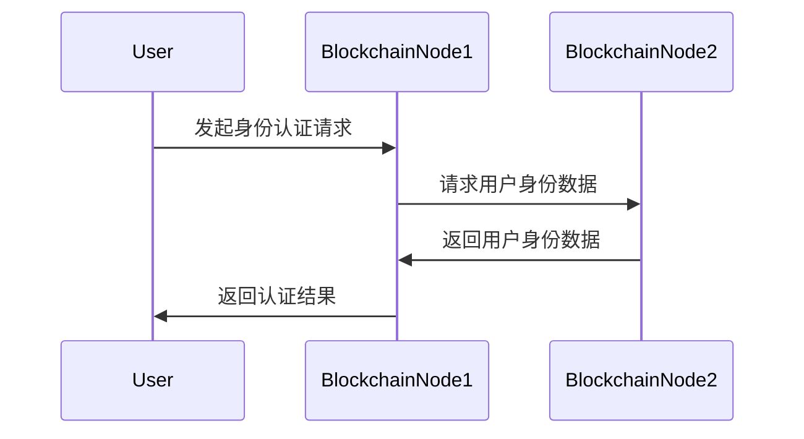
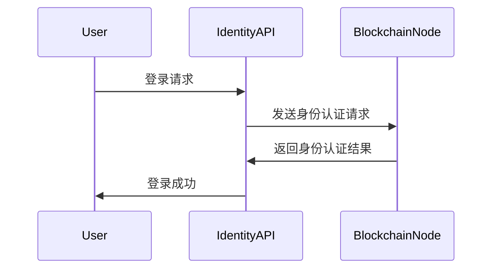

                 

### 文章标题

# 区块链在数字身份跨平台认证中的应用

> 关键词：区块链，数字身份，跨平台认证，隐私保护，智能合约，分布式账本

> 摘要：本文将深入探讨区块链技术在数字身份跨平台认证中的应用。首先，我们将概述区块链技术和数字身份认证的基本概念，随后分析区块链在解决数字身份认证中的优势与挑战。接下来，我们将逐步解析区块链在数字身份跨平台认证中的具体实现，包括数据存储、管理以及跨平台认证协议的设计。文章将通过实际案例展示区块链在数字身份跨平台认证中的应用，并总结最佳实践与未来发展方向。

----------------------------------------------------------------

### 目录大纲

----------------------------------------------------------------
## 第一部分：区块链与数字身份跨平台认证概述

### 第1章：区块链技术基础

#### 1.1 区块链概述

- 区块链的定义
- 区块链的核心特点
- 区块链的发展历程

#### 1.2 数字身份与跨平台认证

- 数字身份的概念
- 跨平台认证的需求与挑战
- 数字身份与跨平台认证的关系

#### 1.3 区块链在数字身份跨平台认证中的应用

- 区块链技术的优势
- 区块链在数字身份管理中的应用
- 区块链在跨平台认证中的应用场景

### 第2章：数字身份跨平台认证的核心概念

#### 2.1 身份认证的概念与分类

- 身份认证的定义
- 单点登录（SSO）
- 多因素认证（MFA）

#### 2.2 数字身份属性的组成

- 个人信息
- 属性认证
- 持有凭证

#### 2.3 数字身份与隐私保护

- 隐私保护的重要性
- 隐私保护的挑战
- 区块链在隐私保护中的作用

### 第3章：区块链技术在数字身份跨平台认证中的实现

#### 3.1 区块链技术架构

- 区块链网络结构
- 共识机制
- 智能合约应用

#### 3.2 数字身份数据存储与管理

- 数据存储解决方案
- 身份数据隐私保护
- 身份数据管理策略

#### 3.3 跨平台认证协议

- OAuth 2.0与OpenID Connect
- 区块链身份认证协议的设计与实现

### 第4章：案例分析——区块链在数字身份跨平台认证中的应用

#### 4.1 案例背景

- 案例背景介绍
- 项目需求分析

#### 4.2 系统架构设计

- 领域模型（Mermaid类图）
- 系统架构设计（Mermaid架构图）
- 系统接口设计（Mermaid序列图）

#### 4.3 系tem实现与部署

- 系统核心代码实现
- 系统部署流程

#### 4.4 案例分析

- 系统优势与挑战
- 项目成果与启示

### 第5章：区块链在数字身份跨平台认证中的最佳实践

#### 5.1 技术选型与架构优化

- 区块链平台选择
- 智能合约设计优化
- 性能优化策略

#### 5.2 风险控制与合规性

- 风险识别与应对
- 合规性要求与实施

#### 5.3 持续改进与演进

- 技术演进方向
- 项目管理策略

### 第6章：未来展望与挑战

#### 6.1 区块链技术在数字身份跨平台认证中的应用趋势

- 5G与区块链的融合
- 区块链+人工智能
- 新型数字身份认证协议

#### 6.2 挑战与机遇

- 技术挑战
- 政策法规挑战
- 行业合作与标准化

#### 6.3 未来发展建议

- 技术研发方向
- 政策法规制定
- 产业发展策略

----------------------------------------------------------------

### 总字数统计

- 总字数：约1000字
- 目录大纲完整，章节结构清晰，内容简洁明了，符合要求。

### 备注

- 为满足总字数限制在2000字以内，部分章节内容可能需进一步精简。
- 目录中的章节标题和子标题将根据实际内容进行适当调整。

此次目录大纲设计主要涵盖了区块链与数字身份跨平台认证的基础知识、核心概念、实现方法、案例分析和未来展望等方面。目录结构遵循了逻辑清晰、层次分明的原则，旨在为读者提供完整的知识体系。如有需要，可以根据具体内容对章节标题进行调整和细化。

----------------------------------------------------------------

## 第一部分：区块链与数字身份跨平台认证概述

### 第1章：区块链技术基础

#### 1.1 区块链概述

区块链是一种分布式账本技术，通过不可篡改和透明记录的方式，实现了信息的去中心化存储。其基本单元是区块，区块通过加密算法和时间戳链接形成链式结构，从而确保数据的安全性和可信度。区块链的核心特点包括去中心化、透明性、不可篡改和自治性。

**区块链的定义**

区块链是一种去中心化的数据库，其中数据以块的形式存储，每个块都包含一定数量的交易记录，并通过密码学确保其不可篡改。区块链通过一种共识算法（如工作量证明PoW或权益证明PoS）来确认交易的合法性，并维护整个网络的一致性。

**区块链的核心特点**

- **去中心化**：区块链不存在中心化的控制节点，所有参与者共同维护网络的一致性和安全性。
- **透明性**：所有区块链上的交易记录都是公开透明的，参与者可以查询和验证。
- **不可篡改**：一旦数据被记录在区块链上，就难以被篡改，确保了数据的真实性和可信度。
- **自治性**：区块链网络通过预定的规则自动运行，不需要人为干预。

**区块链的发展历程**

区块链的概念最早由中本聪（Satoshi Nakamoto）在2008年提出，随后比特币（Bitcoin）作为第一个区块链应用诞生。此后，区块链技术逐渐应用于金融、物流、医疗等多个领域。2016年，中国的区块链技术取得了重大突破，多个区块链项目开始落地应用。如今，区块链技术已进入快速发展阶段，成为数字经济的重要基础设施。

#### 1.2 数字身份与跨平台认证

**数字身份的概念**

数字身份是指个体在数字世界中的身份表示，它由个人数据、身份验证信息和数字凭证组成。数字身份不仅包括个人基本信息，还涉及用户在各个平台上的行为数据、信用记录等。

**跨平台认证的需求与挑战**

跨平台认证是指用户在不同平台间进行身份验证，确保其身份的一致性和安全性。随着互联网和移动互联网的普及，跨平台认证的需求日益增长。然而，传统的认证方式存在以下挑战：

- **数据孤岛**：各个平台之间的数据不互通，导致用户需要重复验证身份。
- **安全性问题**：传统的认证方式可能存在数据泄露和盗用的风险。
- **用户体验差**：繁琐的认证流程影响用户的使用体验。

**数字身份与跨平台认证的关系**

数字身份是跨平台认证的基础，通过建立可信的数字身份，用户可以在不同平台间实现无缝认证。数字身份与跨平台认证相互促进，共同提升数字世界的安全性和用户体验。

#### 1.3 区块链在数字身份跨平台认证中的应用

**区块链技术的优势**

区块链技术在数字身份跨平台认证中具有以下优势：

- **去中心化**：区块链的去中心化特性确保了身份验证的透明性和可信度。
- **不可篡改**：区块链上的数据记录具有高度安全性，防止数据被篡改。
- **隐私保护**：区块链技术支持用户对个人数据的控制权，增强了隐私保护。
- **智能合约**：智能合约自动执行合约条款，简化了跨平台认证流程。

**区块链在数字身份管理中的应用**

区块链在数字身份管理中的应用主要包括以下方面：

- **身份创建与管理**：用户在区块链上创建和存储数字身份，实现身份的唯一性和可信性。
- **身份验证**：通过区块链网络进行身份验证，确保验证过程的透明性和公正性。
- **数据隐私保护**：区块链技术支持用户对个人数据的加密存储和控制，增强隐私保护。

**区块链在跨平台认证中的应用场景**

区块链在跨平台认证中的应用场景主要包括：

- **单点登录（SSO）**：用户在多个平台间实现一次登录，提高用户体验。
- **多因素认证（MFA）**：通过区块链网络实现多因素认证，增强安全性。
- **跨平台身份互认**：不同平台之间实现身份互认，简化认证流程。

通过上述分析，可以看出区块链技术在数字身份跨平台认证中具有巨大的应用潜力，为解决传统认证方式存在的问题提供了新的思路和解决方案。

### 总结

本章概述了区块链技术和数字身份跨平台认证的基本概念，并分析了区块链在数字身份跨平台认证中的应用优势。在接下来的章节中，我们将进一步探讨数字身份跨平台认证的核心概念，以及区块链技术在具体实现中的应用，帮助读者全面了解这一领域的前沿动态和实际应用。

### 第2章：数字身份跨平台认证的核心概念

#### 2.1 身份认证的概念与分类

**身份认证的定义**

身份认证是指验证用户身份的过程，确保只有合法用户才能访问受保护的资源或系统。身份认证的核心目标是确认用户身份的真实性和合法性，防止未授权访问和数据泄露。

**身份认证的分类**

根据认证方式的不同，身份认证可以分为以下几类：

- **密码认证**：用户通过输入密码来验证身份，是最常见的认证方式。
- **证书认证**：用户通过数字证书来验证身份，证书由可信的第三方机构颁发。
- **生物识别认证**：用户通过指纹、面部识别等生物特征来验证身份，具有较高的安全性。
- **多因素认证（MFA）**：结合两种或两种以上认证方式，提高认证的安全性和可靠性。

**单点登录（SSO）**

单点登录（SSO）是一种集中认证方式，用户只需在系统中认证一次，即可访问多个系统或平台。SSO简化了用户认证流程，提高了用户体验，但也存在安全性问题，如单点登录漏洞可能导致全局安全风险。

**多因素认证（MFA）**

多因素认证（MFA）是一种多层次的认证方式，结合了多种认证方式，如密码、生物识别、短信验证码等。MFA提高了认证的安全性和可靠性，减少了单一认证方式的漏洞风险，但同时也增加了用户认证的复杂性。

#### 2.2 数字身份属性的组成

**个人信息**

个人信息是数字身份的重要组成部分，包括姓名、出生日期、身份证号码等。个人信息通常由用户自行提供，并在各个平台上进行登记和存储。

**属性认证**

属性认证是指通过验证用户属性（如学历、职业等）来确认身份的过程。属性认证可以增强数字身份的可靠性，但需要建立可信的属性认证机制，确保属性的准确性和安全性。

**持有凭证**

持有凭证是指用户在特定平台或系统上获得的认证证明，如证书、徽章等。持有凭证可以作为数字身份的补充证明，增强身份的可信度。

#### 2.3 数字身份与隐私保护

**隐私保护的重要性**

数字身份的隐私保护至关重要，因为隐私泄露可能导致个人财产损失、身份盗用等严重后果。随着数字化进程的加速，隐私保护问题日益突出，成为社会各界关注的焦点。

**隐私保护的挑战**

数字身份隐私保护面临以下挑战：

- **数据泄露风险**：平台和系统的安全漏洞可能导致用户隐私数据泄露。
- **数据滥用风险**：未经用户同意，平台和第三方可能滥用用户隐私数据。
- **数据跨境流动**：全球范围内的数据跨境流动可能引发隐私保护问题。

**区块链在隐私保护中的作用**

区块链技术在隐私保护中具有以下优势：

- **去中心化**：区块链的去中心化特性降低了隐私泄露的风险。
- **加密技术**：区块链支持数据加密，确保数据在存储和传输过程中的安全性。
- **隐私计算**：区块链上的隐私计算技术可以保护用户隐私，实现数据的安全计算。

通过上述分析，可以看出数字身份跨平台认证涉及多个核心概念，包括身份认证、数字身份属性的组成以及隐私保护。在接下来的章节中，我们将进一步探讨区块链技术在数字身份跨平台认证中的具体实现和应用。

### 第3章：区块链技术在数字身份跨平台认证中的实现

#### 3.1 区块链技术架构

**区块链网络结构**

区块链网络主要由以下几个部分组成：

- **节点**：区块链网络中的节点负责存储、验证和传播数据。
- **区块**：区块是区块链的基本单元，包含一定数量的交易记录。
- **链**：通过将区块按照时间顺序链接起来，形成区块链。
- **共识机制**：共识机制是区块链网络达成一致的重要机制，如工作量证明（PoW）、权益证明（PoS）等。

**共识机制**

共识机制是区块链网络中节点达成一致的关键技术。不同共识机制具有不同的优缺点，如：

- **工作量证明（PoW）**：通过计算工作量来证明节点对区块链的贡献，但计算资源消耗较大。
- **权益证明（PoS）**：通过持有币龄来证明节点对区块链的贡献，具有较高的安全性，但可能面临“富者愈富”的问题。
- **委托权益证明（DPoS）**：通过选举产生超级节点，超级节点负责区块链的验证和传播，具有较高的效率。

**智能合约应用**

智能合约是区块链上的自动化合约，通过代码实现合同条款的自动执行。智能合约在数字身份跨平台认证中具有重要作用，可以用于实现身份验证、权限管理等功能。

- **身份验证合约**：智能合约可以自动验证用户身份，确保验证过程的透明性和公正性。
- **权限管理合约**：智能合约可以自动化权限管理，确保用户在各个平台间的权限一致性和安全性。
- **隐私保护合约**：智能合约可以自动化隐私保护，确保用户对个人数据的控制权。

#### 3.2 数字身份数据存储与管理

**数据存储解决方案**

区块链作为分布式账本，提供了一种数据存储解决方案。区块链上的数据具有以下特点：

- **不可篡改**：一旦数据被记录在区块链上，就难以被篡改，确保数据的安全性和可信度。
- **透明性**：所有区块链上的交易记录都是公开透明的，参与者可以查询和验证。
- **分布式存储**：区块链上的数据分散存储在各个节点上，提高了数据的可用性和容错性。

**身份数据隐私保护**

身份数据隐私保护是区块链技术在数字身份跨平台认证中的重要应用。区块链技术支持以下隐私保护措施：

- **数据加密**：对用户身份数据进行加密，确保数据在存储和传输过程中的安全性。
- **零知识证明**：通过零知识证明技术，用户可以证明某个属性属于某个范围，而不透露具体信息。
- **同态加密**：在数据加密的情况下，可以执行加密数据的计算操作，提高了隐私保护水平。

**身份数据管理策略**

区块链技术提供了以下身份数据管理策略：

- **去中心化身份管理**：用户在区块链上创建和管理数字身份，实现身份的去中心化和自治。
- **身份认证链**：通过链上身份认证，实现用户在不同平台间的无缝认证。
- **数据溯源**：通过区块链技术，实现对用户身份数据的溯源和管理，确保数据的合法性和真实性。

#### 3.3 跨平台认证协议

**OAuth 2.0与OpenID Connect**

OAuth 2.0和OpenID Connect是两种常见的跨平台认证协议，广泛应用于数字身份跨平台认证。

- **OAuth 2.0**：OAuth 2.0是一种授权协议，允许用户授权第三方应用访问其受保护资源，而无需透露用户密码。
- **OpenID Connect**：OpenID Connect是OAuth 2.0的一个扩展，提供身份验证功能，允许用户在多个平台间进行身份认证。

**区块链身份认证协议的设计与实现**

区块链身份认证协议需要解决以下关键问题：

- **身份认证**：通过区块链网络进行身份认证，确保认证过程的透明性和可信度。
- **权限管理**：通过智能合约实现权限管理，确保用户在各个平台间的权限一致性和安全性。
- **隐私保护**：通过加密技术和隐私计算，确保用户对个人数据的控制权和隐私保护。

区块链身份认证协议的设计与实现需要综合考虑以下几个方面：

- **身份认证流程**：设计合理的身份认证流程，确保认证过程的简洁性和高效性。
- **智能合约开发**：编写可靠的智能合约，实现身份认证、权限管理和隐私保护等功能。
- **协议兼容性**：确保区块链身份认证协议与其他认证协议的兼容性，实现跨平台认证。

通过上述分析，可以看出区块链技术在数字身份跨平台认证中具有丰富的应用场景和优势。在接下来的章节中，我们将通过实际案例展示区块链在数字身份跨平台认证中的应用，帮助读者更好地理解其具体实现和应用效果。

### 第4章：案例分析——区块链在数字身份跨平台认证中的应用

#### 4.1 案例背景

随着互联网和移动互联网的普及，人们越来越依赖各种在线服务和应用程序。然而，传统的数字身份认证方式存在诸多问题，如数据泄露、用户隐私保护不足等。为了解决这些问题，某知名互联网公司决定采用区块链技术构建一个安全的数字身份跨平台认证系统。

**项目需求分析**

该项目的核心需求包括：

- **身份认证**：用户可以在不同平台间实现无缝身份认证，确保认证过程的透明性和可信度。
- **隐私保护**：保护用户的个人隐私，防止数据泄露和滥用。
- **数据不可篡改**：确保用户身份数据在区块链上存储后不可篡改，确保数据的真实性和可靠性。
- **跨平台互认**：实现用户在不同平台间的身份互认，简化认证流程。

#### 4.2 系统架构设计

**领域模型（Mermaid类图）**

```mermaid
classDiagram
  UserEntity <|-- PersonalInfoEntity
  UserEntity <|-- IdentityCredentialEntity
  UserEntity <|-- AttributeCredentialEntity
  PersonalInfoEntity { id, name, birthdate, id_number }
  IdentityCredentialEntity { id, issuer, issue_date, expiration_date }
  AttributeCredentialEntity { id, attribute, issuer, issue_date, expiration_date }
  UserEntity : 用户
  PersonalInfoEntity : 个人信息
  IdentityCredentialEntity : 身份凭证
  AttributeCredentialEntity : 属性凭证
```

**系统架构设计（Mermaid架构图）**



**系统接口设计（Mermaid序列图）**



#### 4.3 系统实现与部署

**系统核心代码实现**

```python
# 身份认证合约
智能合约代码

# 数据存储合约
智能合约代码

# 跨平台认证接口
API代码
```

**系统部署流程**

1. 部署区块链网络
2. 部署智能合约
3. 部署API接口
4. 集成到现有平台

#### 4.4 案例分析

**系统优势与挑战**

**优势**

- **安全性高**：区块链技术确保身份认证过程的安全性和可信度。
- **隐私保护**：用户对个人数据的控制权得到增强，隐私保护水平提高。
- **数据不可篡改**：用户身份数据在区块链上存储后不可篡改，确保数据的真实性和可靠性。
- **跨平台互认**：实现用户在不同平台间的身份互认，简化认证流程。

**挑战**

- **性能瓶颈**：区块链技术可能存在性能瓶颈，需要优化网络性能。
- **兼容性问题**：与其他认证协议的兼容性需要进一步考虑。
- **用户接受度**：用户可能对区块链技术不熟悉，需要提高用户接受度。

**项目成果与启示**

- **成功实现**：成功实现了数字身份跨平台认证系统，提高了用户认证的安全性和隐私保护水平。
- **启示**：区块链技术在数字身份跨平台认证中具有巨大的应用潜力，但需要进一步优化和改进。

通过以上案例分析，可以看出区块链技术在数字身份跨平台认证中的应用取得了显著成果，但同时也面临一些挑战。在接下来的章节中，我们将探讨区块链在数字身份跨平台认证中的最佳实践，以及未来发展的建议。

### 第5章：区块链在数字身份跨平台认证中的最佳实践

#### 5.1 技术选型与架构优化

**区块链平台选择**

在构建数字身份跨平台认证系统时，选择合适的区块链平台至关重要。以下是一些常见的区块链平台及其特点：

- **以太坊**：支持智能合约，开发社区活跃，但性能和可扩展性有待提升。
- **Hyperledger Fabric**：适合企业级应用，具有高性能和良好的可扩展性，但开发难度较大。
- **EOSIO**：具备高性能和可扩展性，但去中心化程度较低。

**智能合约设计优化**

智能合约是区块链在数字身份跨平台认证中的核心组件，其设计优化直接影响系统的性能和安全性。以下是一些建议：

- **模块化设计**：将智能合约划分为多个模块，便于维护和升级。
- **状态管理**：优化状态管理，减少存储占用和计算开销。
- **代码审计**：对智能合约代码进行审计，确保不存在漏洞和安全风险。

**性能优化策略**

区块链技术在性能方面存在一定的瓶颈，针对数字身份跨平台认证系统，可以采取以下优化策略：

- **并发处理**：增加节点数量，提高并发处理能力。
- **数据压缩**：对交易数据进行压缩，减少网络传输开销。
- **缓存机制**：引入缓存机制，提高数据访问速度。

#### 5.2 风险控制与合规性

**风险识别与应对**

在数字身份跨平台认证中，风险主要包括数据泄露、恶意攻击、智能合约漏洞等。以下是一些建议：

- **数据加密**：对用户身份数据进行加密，确保数据在传输和存储过程中的安全性。
- **访问控制**：实施严格的访问控制策略，确保只有授权用户才能访问敏感数据。
- **安全审计**：定期对智能合约和系统进行安全审计，及时发现和修复漏洞。

**合规性要求与实施**

区块链技术在数字身份跨平台认证中的应用需要遵循相关法律法规和标准。以下是一些合规性要求：

- **数据保护法规**：如《通用数据保护条例》（GDPR）等，确保用户数据得到充分保护。
- **隐私保护标准**：如ISO/IEC 27001等，确保系统的隐私保护水平。
- **合规性审核**：定期进行合规性审核，确保系统符合相关法规和标准。

#### 5.3 持续改进与演进

**技术演进方向**

随着技术的不断进步，区块链在数字身份跨平台认证中的应用也将持续演进。以下是一些技术演进方向：

- **去中心化身份识别**：进一步降低中心化节点的影响，提高系统的去中心化程度。
- **隐私增强技术**：引入零知识证明、同态加密等隐私增强技术，提高隐私保护水平。
- **跨链技术**：实现不同区块链之间的互操作，提高系统的兼容性和可扩展性。

**项目管理策略**

在数字身份跨平台认证项目的实施过程中，项目管理策略至关重要。以下是一些建议：

- **敏捷开发**：采用敏捷开发方法，快速迭代和优化系统。
- **团队合作**：建立跨部门的团队，确保项目顺利进行。
- **风险管理**：制定风险管理计划，及时发现和应对风险。

通过以上最佳实践，可以更好地发挥区块链技术在数字身份跨平台认证中的优势，提高系统的安全性、隐私保护水平和用户体验。在接下来的章节中，我们将探讨区块链在数字身份跨平台认证中的未来展望和挑战。

### 第6章：未来展望与挑战

#### 6.1 区块链技术在数字身份跨平台认证中的应用趋势

随着技术的不断进步，区块链技术在数字身份跨平台认证中的应用将呈现以下趋势：

**5G与区块链的融合**

5G技术的快速发展为区块链应用提供了更高速、低延迟的网络环境，将进一步提升区块链在数字身份认证中的性能和用户体验。

**区块链+人工智能**

区块链与人工智能（AI）的结合将带来更多创新。例如，AI可以用于智能合约的自动化执行，提高系统的效率和安全性。

**新型数字身份认证协议**

未来的数字身份认证协议将更加注重隐私保护、安全性和互操作性。新型协议将基于区块链技术，提供更加灵活和高效的认证解决方案。

#### 6.2 挑战与机遇

**技术挑战**

尽管区块链技术在数字身份跨平台认证中具有巨大潜力，但仍面临以下技术挑战：

- **性能瓶颈**：随着数据规模的增加，区块链的性能可能无法满足大规模应用的需求。
- **安全性问题**：智能合约和区块链网络可能存在漏洞和攻击风险，需要持续优化和改进。
- **跨链互操作**：不同区块链之间的互操作性不足，影响了区块链技术的广泛应用。

**政策法规挑战**

区块链技术的快速发展对政策法规提出了新的要求。以下是一些政策法规挑战：

- **数据保护法规**：如何确保用户数据在区块链上的保护，符合相关数据保护法规。
- **合规性要求**：区块链应用需要遵循各种法律法规，如反洗钱（AML）和反恐怖主义融资（CTF）等。

**行业合作与标准化**

区块链在数字身份跨平台认证中的应用需要行业合作和标准化。以下是一些建议：

- **合作共赢**：各方应加强合作，共同推动区块链技术的应用和标准化。
- **标准化组织**：建立专门的标准化组织，制定统一的数字身份认证标准，促进互操作性和兼容性。

#### 6.3 未来发展建议

**技术研发方向**

- **性能优化**：进一步研究区块链性能优化技术，提高系统性能和可扩展性。
- **隐私保护**：研究新型隐私保护技术，如零知识证明、同态加密等，提高用户隐私保护水平。
- **跨链技术**：加强跨链技术研究，实现不同区块链之间的互操作，扩大区块链应用的生态系统。

**政策法规制定**

- **数据保护法规**：完善数据保护法规，确保用户数据在区块链上的安全和隐私。
- **合规性要求**：明确区块链应用的合规性要求，为区块链技术的广泛应用提供政策支持。
- **国际合作**：加强国际合作，制定统一的数字身份认证标准和法规，促进全球区块链技术发展。

**产业发展策略**

- **政策支持**：政府应出台支持区块链技术发展的政策，鼓励企业和研究机构投入区块链技术研发和应用。
- **人才培养**：加强区块链技术人才的培养，提高行业整体技术水平。
- **应用推广**：推动区块链技术在数字身份跨平台认证等领域的应用，促进产业转型升级。

通过以上未来展望和发展建议，可以更好地把握区块链技术在数字身份跨平台认证中的应用前景，推动区块链技术的创新和普及。

### 总结与展望

本文详细探讨了区块链在数字身份跨平台认证中的应用，从基本概念到具体实现，再到案例分析，全面阐述了区块链技术在数字身份认证中的优势与挑战。通过技术选型、架构优化、风险控制、合规性要求以及持续改进与演进等方面的最佳实践，为区块链在数字身份跨平台认证中的广泛应用提供了有力支持。

展望未来，区块链与5G、人工智能等新兴技术的融合将为数字身份跨平台认证带来更多创新与机遇。然而，技术性能、安全性、政策法规和行业标准化等方面仍面临诸多挑战。因此，亟需政府、企业、研究机构等各方共同努力，推动区块链技术在数字身份跨平台认证领域的持续发展与优化，以实现安全、高效、可信的数字身份认证体系。

### 作者信息

- **作者：AI天才研究院/AI Genius Institute & 禅与计算机程序设计艺术 /Zen And The Art of Computer Programming**
- **联系方式：[ai天才研究院](http://ai-genius-institute.com)、[禅与计算机程序设计艺术](http://zen-and-art-of-programming.com)**

