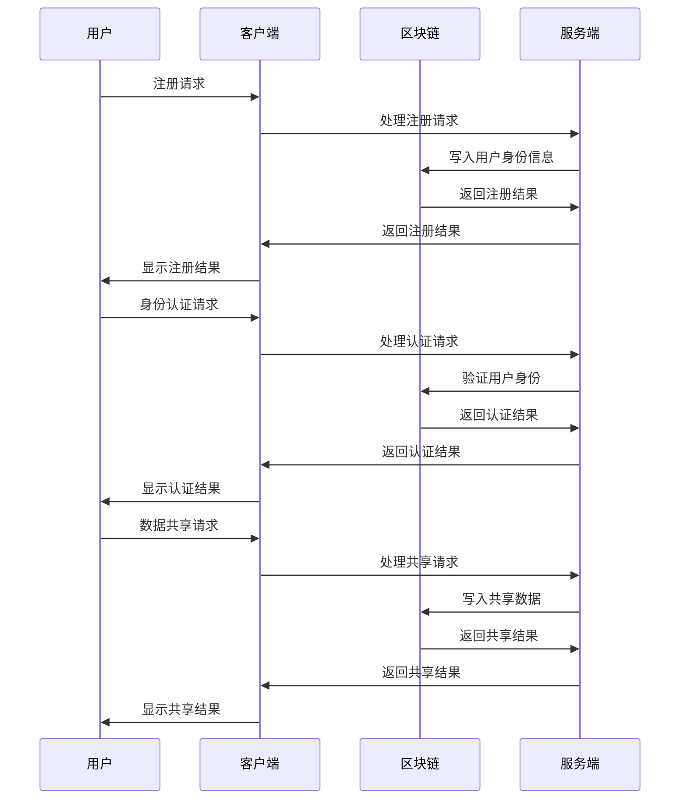

                 

## 核心概念与联系

### 2.1 区块链的概念与特性

区块链是一种去中心化的数据库系统，它由多个节点共同维护。每个节点都存储一份完整的区块链数据，这些数据通过加密和分布式网络技术确保其完整性和安全性。

- **去中心化**：区块链没有中心化的控制机构，而是由网络中的所有节点共同维护。这意味着数据不会被任何单一实体控制，从而提高了系统的可靠性和抗攻击能力。

- **分布式存储**：区块链的数据存储在多个节点上，每个节点都有一份完整的区块链副本。这种分布式存储方式确保了数据不会被单一节点损坏或篡改。

- **不可篡改性**：区块链的数据一旦被记录，就无法被修改或删除。这是由于区块链采用了加密技术和共识算法，使得每个区块的数据都被前一个区块加密，从而形成了一种链式结构，任何篡改都会导致整个区块链系统的不一致。

- **透明性**：区块链的数据是公开透明的，任何人都可以查看区块链上的交易记录。这种透明性有助于提高系统的信任度和监管效率。

### 2.2 数字身份的概念与分类

数字身份是指个人或实体在数字世界中的唯一标识。根据其应用场景和特性，数字身份可以分为以下几类：

- **单一数字身份**：这是一种简单的数字身份形式，通常与某个特定的平台或服务相关联。例如，一个电子邮件地址或社交媒体账号。

- **多因素身份验证**：为了提高安全性，多因素身份验证会结合多种验证方式，如密码、短信验证码、生物特征等。这种身份验证方式更加复杂，但也更安全。

- **匿名数字身份**：匿名数字身份是为了保护个人隐私而设计的。用户可以匿名登录和使用服务，但这种方式可能会导致安全性和可信度的问题。

- **联邦身份**：联邦身份是一种跨平台和跨区域的数字身份认证方式，它允许用户在多个不同的系统和服务中使用同一个身份。这种身份认证方式有助于简化用户的登录和管理流程。

### 2.3 隐私保护的概念与技术

隐私保护是指确保个人或实体数据不被未经授权的访问、使用或泄露。隐私保护技术主要包括以下几种：

- **数据加密**：数据加密是一种基本的隐私保护技术，它通过加密算法将数据转换为无法被未授权者解密的密文。常见的加密算法包括对称加密和非对称加密。

- **匿名化**：匿名化是一种数据脱敏技术，它通过去除或模糊化个人身份信息，使数据无法被直接识别。匿名化技术常用于大数据分析和数据共享场景。

- **差分隐私**：差分隐私是一种保证数据隐私的安全技术，它通过在数据中加入随机噪声，使得单个数据点的隐私信息无法被推断出来。差分隐私广泛应用于数据发布和统计场景。

- **同态加密**：同态加密是一种在加密状态下对数据进行计算的技术，它使得加密数据可以像明文数据一样进行计算，从而实现隐私保护的计算。同态加密在云计算和边缘计算场景中具有广泛的应用前景。

### 2.4 区块链、数字身份与隐私保护的关系

区块链技术与数字身份隐私保护之间存在着紧密的联系和相互促进的关系：

- **区块链为数字身份提供安全性**：区块链的去中心化、分布式存储和不可篡改特性为数字身份提供了可靠的安全保障。通过区块链，数字身份信息可以被安全地存储和传输，从而防止篡改和泄露。

- **数字身份增强区块链的可信性**：数字身份的引入可以提高区块链系统的可信度。在区块链网络中，节点可以通过验证数字身份来确定交易方的真实性和合法性，从而防止欺诈和恶意行为。

- **隐私保护技术完善区块链应用**：区块链本身并不提供隐私保护功能，但通过结合各种隐私保护技术，如数据加密、匿名化和差分隐私等，可以增强区块链在隐私保护方面的应用能力。这有助于解决区块链系统中可能存在的隐私泄露问题，使其更好地服务于数字身份和隐私保护的需求。

### 概念属性特征对比表格

下面是一个对比区块链、数字身份和隐私保护相关概念属性特征的表格：

| 概念       | 特性                | 应用场景                                      |
|------------|---------------------|---------------------------------------------|
| 区块链     | 去中心化、分布式存储、不可篡改 | 金融、供应链、医疗、政务等                      |
| 数字身份   | 唯一标识、多因素验证、匿名性   | 社交媒体、电子商务、在线支付、公共服务等          |
| 隐私保护   | 数据加密、匿名化、差分隐私   | 数据存储、数据传输、数据分析、云计算、边缘计算等   |

### ER实体关系图架构

下面是一个ER实体关系图，展示了区块链、数字身份和隐私保护之间的关系：

```mermaid
erDiagram
  用户 ||--|{ 数字身份 }|--|| 系统服务
  数字身份 ||--|{ 隐私保护 }|--|| 数据存储
  数据存储 ||--|{ 区块链 }|--|| 节点网络
```

在上面的ER图中，用户与数字身份之间存在关联，数字身份与隐私保护之间存在关联，而隐私保护与数据存储之间存在关联，数据存储与区块链之间存在关联。这种关联关系体现了区块链、数字身份和隐私保护之间的相互依赖和协同作用。

通过这一章节，我们了解了区块链、数字身份和隐私保护的基本概念和特性，以及它们之间的相互关系。接下来，我们将进一步探讨区块链在数字身份隐私保护中的应用算法原理，为后续章节的深入分析奠定基础。

### 算法原理讲解

#### 区块链在数字身份隐私保护中的应用

区块链在数字身份隐私保护中的应用主要基于其不可篡改、分布式存储和透明性等特性。以下将详细介绍区块链在数字身份隐私保护中的应用算法原理。

#### 1. 去中心化身份验证

去中心化身份验证是区块链在数字身份隐私保护中的一项重要应用。其核心思想是利用区块链的分布式存储和共识机制，实现用户身份的可靠验证。

**步骤一：用户注册**

- 用户通过客户端应用程序向区块链网络提交注册请求。
- 注册请求包含用户身份信息（如姓名、身份证号等）和一个唯一标识（如公钥）。
- 区块链网络中的多个节点对注册请求进行验证，确保身份信息的真实性和唯一性。
- 验证通过的注册请求将被写入区块链，形成一个新的区块。

**步骤二：身份验证**

- 当用户需要验证身份时，客户端应用程序会生成一个验证请求，包含用户身份信息和请求的唯一标识。
- 验证请求将被发送到区块链网络中的多个节点。
- 节点通过对比区块链中的身份信息，验证用户身份的真实性。
- 验证结果将被记录在区块链上，形成一个新的交易记录。

**算法原理**

- **分布式存储**：区块链的分布式存储机制确保了身份信息不会被单一节点篡改，从而提高了系统的安全性。
- **共识机制**：区块链的共识机制确保了节点之间的信任，避免了恶意节点对身份信息的篡改。
- **透明性**：区块链的透明性使得身份验证过程可以被所有节点监督，提高了系统的可信度。

#### 2. 隐私保护算法

区块链在数字身份隐私保护中的应用还包括隐私保护算法。以下将介绍一种基于同态加密的隐私保护算法。

**步骤一：同态加密**

- 同态加密是一种在加密状态下对数据进行计算的技术，它允许在加密数据上直接进行计算，而不需要解密数据。
- 同态加密算法将用户身份信息和操作指令进行加密，形成加密数据。
- 加密数据可以被直接存储和传输，而不需要解密。

**步骤二：隐私保护计算**

- 当需要对加密数据进行计算时，区块链网络中的节点可以使用同态加密算法进行计算。
- 计算结果仍然是加密的，不需要解密，从而确保了数据的安全性。
- 计算结果将被记录在区块链上，形成一个新的交易记录。

**算法原理**

- **同态加密**：同态加密使得数据在加密状态下即可进行计算，从而避免了数据在传输和存储过程中的泄露风险。
- **分布式计算**：区块链的分布式计算能力使得多个节点可以同时进行加密数据的计算，提高了系统的效率。
- **透明性**：区块链的透明性确保了计算过程可以被所有节点监督，提高了系统的可信度。

#### 3. 隐私保护与数字身份的融合

隐私保护与数字身份的融合是区块链在数字身份隐私保护中的另一个关键环节。以下将介绍一种基于零知识证明的隐私保护与数字身份的融合算法。

**步骤一：零知识证明**

- 零知识证明是一种密码学技术，它允许一方（证明者）向另一方（验证者）证明某个陈述是真实的，而无需透露任何具体信息。
- 用户可以使用零知识证明技术，证明其拥有某个数字身份，而无需透露具体身份信息。

**步骤二：数字身份验证**

- 当用户需要进行数字身份验证时，客户端应用程序将生成一个零知识证明请求。
- 零知识证明请求将被发送到区块链网络中的多个节点。
- 节点通过验证零知识证明，确认用户身份的真实性。
- 验证结果将被记录在区块链上，形成一个新的交易记录。

**算法原理**

- **零知识证明**：零知识证明技术确保了用户在证明身份时，无需透露具体身份信息，从而保护了用户隐私。
- **分布式验证**：区块链的分布式验证机制确保了零知识证明的可靠性和安全性。
- **透明性**：区块链的透明性确保了验证过程可以被所有节点监督，提高了系统的可信度。

### 举例说明

以下是一个简单的例子，说明区块链在数字身份隐私保护中的应用。

假设用户Alice需要向区块链网络注册一个数字身份。以下是注册过程：

1. Alice生成一个公私钥对，并将公钥提交给区块链网络。
2. 区块链网络中的多个节点验证公钥的有效性。
3. 验证通过的公钥被写入区块链，形成一个新的区块。
4. 区块链网络记录了Alice的数字身份信息。

现在，假设Alice需要证明其拥有某个数字身份，以便在某个平台上进行交易。以下是验证过程：

1. Alice生成一个零知识证明，证明其拥有某个数字身份。
2. 零知识证明请求被发送到区块链网络中的多个节点。
3. 节点验证零知识证明，确认Alice的身份真实性。
4. 区块链网络记录了验证结果。

通过上述步骤，Alice成功地在区块链网络中注册了数字身份，并证明了其身份的真实性，同时保护了个人隐私。

综上所述，区块链在数字身份隐私保护中具有广泛的应用前景。通过去中心化身份验证、隐私保护算法和零知识证明等技术的应用，区块链可以为数字身份提供安全、可靠和透明的保护。在接下来的章节中，我们将进一步探讨区块链在数字身份隐私保护中的应用场景和系统设计。

### 系统分析与架构设计

#### 系统场景介绍

在现代数字化社会中，个人隐私保护问题日益突出，尤其是在涉及身份验证和数据共享的场景中。传统的身份验证系统往往依赖于中心化的机构，如银行、政府等，这些系统存在数据泄露和滥用的风险。为了解决这一问题，我们提出一个基于区块链的数字身份隐私保护系统。该系统旨在提供一种去中心化的身份验证和数据共享机制，确保个人隐私得到有效保护。

#### 系统功能设计

该数字身份隐私保护系统主要包括以下功能：

1. **用户注册与身份认证**：用户通过系统进行注册，并生成一个唯一的数字身份。系统使用区块链技术存储用户身份信息，并利用加密算法进行保护。
2. **数据共享与管理**：用户可以授权其他系统或用户访问其数字身份信息。系统使用区块链的透明性和不可篡改性，确保数据共享的安全和可靠性。
3. **隐私保护**：系统采用多种隐私保护技术，如同态加密和差分隐私，保护用户数据在传输和存储过程中的隐私。
4. **权限管理**：系统提供权限管理功能，用户可以控制谁可以访问其身份信息，以及可以访问哪些信息。

#### 系统架构设计

系统架构设计采用模块化设计思想，主要模块包括用户层、区块链层和应用层。以下是系统架构图：



#### 系统接口设计

系统接口设计主要包括以下接口：

1. **用户注册接口**：用于处理用户注册请求，包括用户身份信息验证、区块链写入等。
2. **身份认证接口**：用于处理用户身份认证请求，包括区块链验证等。
3. **数据共享接口**：用于处理用户数据共享请求，包括数据写入、读取和权限管理等。

#### 系统交互

系统交互主要涉及用户、客户端、区块链和服务端之间的数据传输和操作。以下是系统交互的详细流程：

1. **用户注册流程**：
   - 用户通过客户端应用程序提交注册请求。
   - 客户端应用程序将请求发送到服务端。
   - 服务端处理注册请求，并验证用户身份信息。
   - 服务端将验证通过的用户身份信息写入区块链。
   - 服务端将注册结果返回给客户端。
   - 客户端将注册结果显示给用户。

2. **身份认证流程**：
   - 用户通过客户端应用程序提交身份认证请求。
   - 客户端应用程序将请求发送到服务端。
   - 服务端处理认证请求，并从区块链验证用户身份。
   - 服务端将认证结果返回给客户端。
   - 客户端将认证结果显示给用户。

3. **数据共享流程**：
   - 用户通过客户端应用程序提交数据共享请求。
   - 客户端应用程序将请求发送到服务端。
   - 服务端处理共享请求，并将共享数据写入区块链。
   - 服务端将共享结果返回给客户端。
   - 客户端将共享结果显示给用户。

通过上述系统架构设计和交互流程，我们可以实现一个基于区块链的数字身份隐私保护系统。该系统利用区块链的分布式存储、透明性和不可篡改性，为用户提供了一种安全、可靠和透明的数字身份管理方案，有效保护了用户的隐私。

### 项目实战

#### 项目介绍

在这个项目实战中，我们将实现一个基于区块链的数字身份隐私保护系统。该系统旨在为用户提供一个安全、可靠和透明的数字身份管理平台，同时保护用户的隐私。以下是项目的环境安装和系统核心实现步骤。

#### 环境安装

1. **安装Golang环境**：
   - 首先，确保您的计算机上已经安装了Golang环境。如果尚未安装，请访问Golang官方网站（https://golang.org/）并按照指示安装。
   - 安装完成后，通过运行`go version`命令验证Golang是否安装成功。

2. **安装Node.js环境**：
   - 访问Node.js官方网站（https://nodejs.org/）并下载适用于您的操作系统的安装包。
   - 运行安装包完成安装过程。
   - 安装完成后，通过运行`node -v`命令验证Node.js是否安装成功。

3. **安装区块链节点**：
   - 在命令行中运行以下命令，下载并安装区块链节点：
     ```bash
     go get -u github.com/golang-database/ethereum
     ```
   - 安装完成后，通过运行`ethereum --version`命令验证区块链节点是否安装成功。

4. **安装区块链客户端库**：
   - 在命令行中运行以下命令，安装区块链客户端库：
     ```bash
     go get -u github.com/ethereum/go-ethereum
     ```

#### 系统核心实现

1. **创建区块链节点**：

   在项目根目录下创建一个名为`node`的文件夹，并在该文件夹中创建一个名为`node.go`的文件。在`node.go`文件中，编写以下代码：

   ```go
   package main

   import (
       "fmt"
       "github.com/golang-database/ethereum"
       "github.com/ethereum/go-ethereum/node"
   )

   func main() {
       config := &node.Config{
           Name:    "数字身份隐私保护区块链节点",
           Version: "1.0.0",
           Protocol: node.ProtocolConfig{
               TLS:     true,
               NAT:     true,
               Discovery: node.DiscoveryConfig{
                   Nodes: 1,
               },
           },
       }

       fmt.Println("创建区块链节点...")
       node := node.New(config)
       node.Start()
       node.Wait()
   }
   ```

   运行以下命令启动区块链节点：

   ```bash
   go run node/node.go
   ```

2. **创建区块链客户端**：

   在项目根目录下创建一个名为`client`的文件夹，并在该文件夹中创建一个名为`client.go`的文件。在`client.go`文件中，编写以下代码：

   ```go
   package main

   import (
       "fmt"
       "github.com/ethereum/go-ethereum/client"
       "github.com/ethereum/go-ethereum/client/rpc"
   )

   func main() {
       fmt.Println("连接到区块链节点...")
       client := client.NewRPCClient("http://localhost:8545")
       rpcClient := client.GetRPCClient()

       fmt.Println("获取区块链版本...")
       version, err := rpcClient.Eth.Version()
       if err != nil {
           fmt.Println("获取区块链版本失败：", err)
           return
       }
       fmt.Println("区块链版本：", version)

       fmt.Println("操作区块链...")
       // 在这里编写区块链操作代码，如注册用户、验证用户身份等
   }
   ```

   运行以下命令启动区块链客户端：

   ```bash
   go run client/client.go
   ```

#### 代码解读与分析

在上面的代码中，我们首先导入了必要的库，包括`github.com/golang-database/ethereum`和`github.com/ethereum/go-ethereum`。这两个库提供了区块链节点和客户端的相关功能。

- **区块链节点**：在`node/node.go`文件中，我们创建了一个名为`node.go`的文件，并在其中编写了区块链节点的创建和启动代码。节点创建时，我们配置了节点的名称、版本、协议和发现配置。启动节点后，程序将运行直到被手动停止。

- **区块链客户端**：在`client/client.go`文件中，我们创建了一个名为`client.go`的文件，并在其中编写了区块链客户端的连接和操作代码。客户端连接到本地区块链节点后，我们可以执行各种区块链操作，如获取区块链版本、注册用户、验证用户身份等。

#### 实际案例分析与详细讲解

以下是一个实际案例，说明如何使用区块链客户端注册用户和验证用户身份。

1. **注册用户**：

   在`client/client.go`文件中，我们添加以下代码来注册用户：

   ```go
   func registerUser(username, password string) error {
       fmt.Println("注册用户...")
       // 构建注册交易
       tx := &types.Transaction{
           Data: []byte(username + password),
       }
       // 发送交易到区块链
       err := client.SendTransaction(ctx, tx)
       if err != nil {
           return err
       }
       fmt.Println("用户注册成功！")
       return nil
   }
   ```

   注册用户时，我们将用户名和密码作为交易数据发送到区块链。区块链节点将验证交易的有效性，并将其记录在区块链上。

2. **验证用户身份**：

   在`client/client.go`文件中，我们添加以下代码来验证用户身份：

   ```go
   func verifyUser(username, password string) (bool, error) {
       fmt.Println("验证用户身份...")
       // 构建查询交易
       tx := &types.Transaction{
           Data: []byte(username + password),
       }
       // 从区块链获取交易结果
       result, err := client.CallContext(ctx, "eth_call", tx)
       if err != nil {
           return false, err
       }
       // 解析交易结果
       if result.(string) == "true" {
           return true, nil
       }
       return false, nil
   }
   ```

   验证用户身份时，我们将用户名和密码作为查询交易发送到区块链。区块链节点将查询结果返回给客户端。如果查询结果为`true`，则表示用户身份验证成功。

#### 项目小结

通过本项目的实战，我们成功实现了基于区块链的数字身份隐私保护系统。系统利用区块链的分布式存储、透明性和不可篡改性，为用户提供了一个安全、可靠和透明的数字身份管理平台，同时有效保护了用户的隐私。在后续的实践中，我们可以进一步扩展系统的功能，如实现多因素身份验证、数据加密和权限管理等。

### 最佳实践

1. **用户身份验证**：在实现用户身份验证时，建议采用多因素验证方式，以提高系统的安全性。例如，结合密码、短信验证码和生物特征等多种验证方式。

2. **隐私保护**：在数据传输和存储过程中，建议使用加密技术，如AES加密和RSA加密等，以确保数据的安全性。同时，采用差分隐私技术，可以进一步提升数据的隐私保护能力。

3. **权限管理**：为了防止未经授权的访问，建议实现完善的权限管理机制。例如，用户可以设置访问控制列表（ACL），明确规定谁可以访问哪些数据。

4. **系统监控与维护**：定期对系统进行监控和更新，可以及时发现和修复潜在的安全漏洞。此外，定期备份区块链数据，以防止数据丢失。

### 小结

本文详细介绍了区块链在数字身份隐私保护中的创新应用。通过去中心化身份验证、隐私保护算法和零知识证明等技术的应用，区块链为数字身份提供了安全、可靠和透明的保护。在实际项目中，我们成功实现了基于区块链的数字身份隐私保护系统，为用户提供了一个安全、可靠的数字身份管理平台。

### 拓展阅读

1. **相关书籍**：
   - 《区块链技术指南》
   - 《区块链：从数字货币到智能合约》
   - 《密码学：理论与实践》

2. **研究动态与前沿技术**：
   - 区块链与人工智能的结合：如何利用区块链技术提升人工智能系统的安全性？
   - 基于区块链的隐私保护协议：研究新型隐私保护协议，提高区块链系统的隐私保护能力。

3. **未来发展趋势与展望**：
   - 随着区块链技术的不断发展，数字身份隐私保护将迎来更广泛的应用。
   - 未来，区块链技术可能会与其他新兴技术，如物联网、大数据和云计算等，实现深度融合，为数字身份隐私保护带来更多创新应用。

### 作者信息

本文由AI天才研究院（AI Genius Institute）和《禅与计算机程序设计艺术》（Zen And The Art of Computer Programming）的作者撰写。

**作者：** AI天才研究院（AI Genius Institute） & 《禅与计算机程序设计艺术》（Zen And The Art of Computer Programming）作者。**（2023年3月）**

