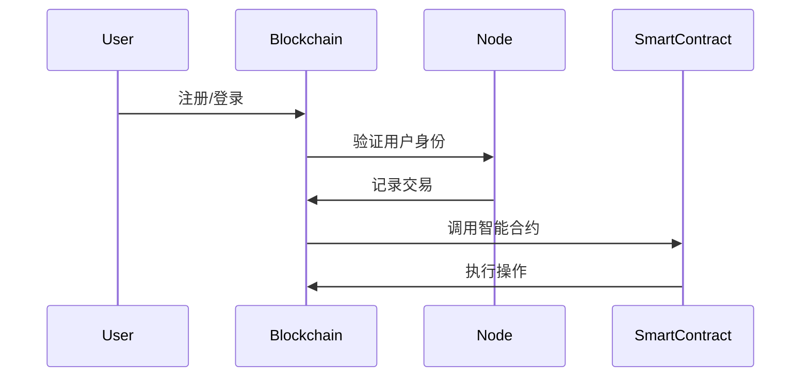
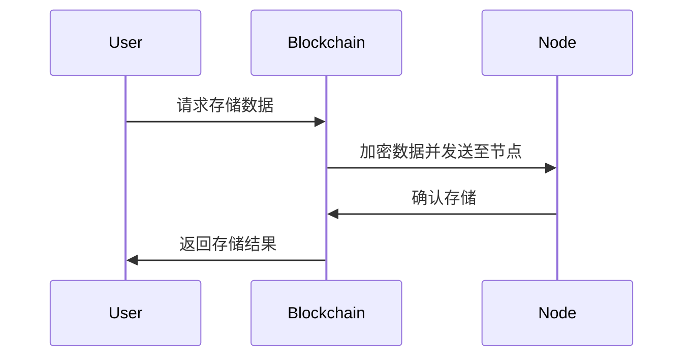
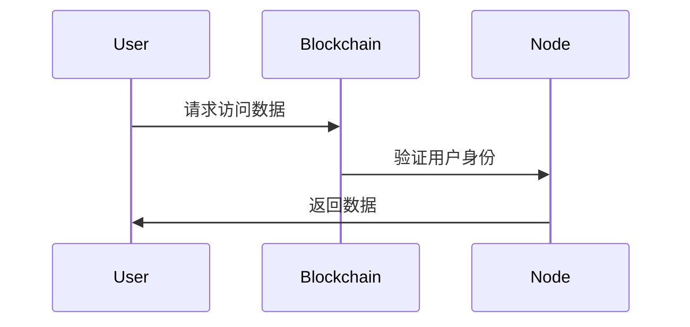
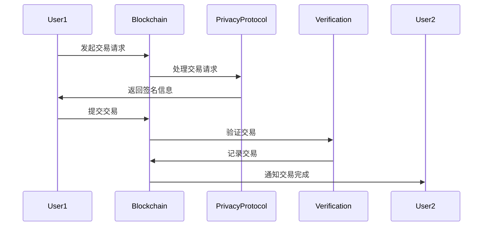
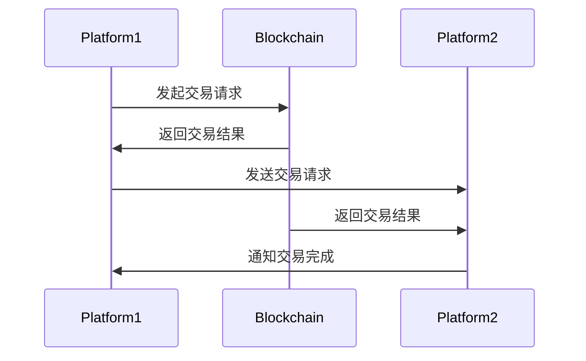

                 

### 《区块链在数字身份隐私保护中的应用》

> 关键词：区块链，数字身份，隐私保护，分布式账本，加密算法，共识机制，智能合约

> 摘要：本文旨在探讨区块链技术在数字身份隐私保护中的应用。通过深入剖析区块链的基本原理，以及其在数字身份认证、数据存储和访问控制、隐私保护交易等方面的应用，本文详细阐述了区块链技术如何提升数字身份隐私保护的安全性和可信性，并提供了一些最佳实践和案例分析。

## 第一部分：区块链与数字身份隐私保护基础

### 第1章：区块链与数字身份隐私保护概述

#### 1.1.1 区块链技术的基本原理

区块链是一种分布式数据库系统，其基本原理包括多个方面。首先，区块链通过去中心化的方式，将数据分散存储在不同的节点上，从而避免了单点故障的风险。其次，区块链采用加密算法对数据进行加密，确保数据在传输和存储过程中的安全性和完整性。此外，区块链通过共识机制，如工作量证明（Proof of Work，PoW）和权益证明（Proof of Stake，PoS），来确保网络中的所有节点对数据的共识，从而防止恶意攻击和数据篡改。

区块链的起源可以追溯到2008年，一位名为中本聪（Satoshi Nakamoto）的匿名人物发布了比特币（Bitcoin）的白皮书，提出了区块链技术的概念。比特币作为第一种基于区块链技术的加密货币，成功地在全球范围内引起了广泛关注。此后，区块链技术不断发展，应用领域逐渐扩大，不仅限于数字货币，还涉及数字身份隐私保护、供应链管理、智能合约等多个领域。

#### 1.1.2 数字身份隐私保护的重要性

随着互联网和移动设备的普及，人们的数字身份信息无处不在。然而，由于技术漏洞和恶意攻击，数字身份隐私泄露的事件层出不穷。例如，2017年的“Facebook数据泄露门”事件，使得大量用户的信息被不当使用；2019年的“英国国家健康服务局数据泄露”事件，导致数百万患者的个人信息被泄露。这些事件严重威胁了用户的隐私和安全，引发了社会对数字身份隐私保护的广泛关注。

数字身份隐私保护的重要性在于，它不仅关系到个人的信息安全，还影响到社会的信任体系。在数字化时代，隐私泄露可能导致身份盗窃、诈骗等犯罪行为，给个人和社会带来巨大的经济损失。因此，保障数字身份隐私安全已成为当前信息技术领域的重要课题。

#### 1.1.3 区块链在数字身份隐私保护中的应用前景

区块链技术在数字身份隐私保护中具有广阔的应用前景。首先，区块链的去中心化特性可以有效防止数据泄露和篡改，保障用户隐私。其次，区块链的智能合约功能可以实现自动化身份验证和数据访问控制，提高隐私保护效率。此外，区块链的可追溯性和不可篡改性，可以为数字身份隐私保护提供强有力的法律支持。

在实际应用中，区块链技术已经在多个场景中展示了其潜力。例如，在金融领域，区块链技术被用于身份认证和交易记录，确保用户隐私和安全；在医疗领域，区块链技术被用于病历管理和隐私保护，提高医疗数据的安全性和可信性；在教育领域，区块链技术被用于学历证明和身份认证，确保教育信息的真实性和可靠性。

总的来说，区块链技术为数字身份隐私保护提供了一种全新的解决方案，具有巨大的发展潜力和应用价值。随着区块链技术的不断成熟和应用场景的扩展，我们可以期待其在数字身份隐私保护领域的广泛应用。

### 第2章：核心概念与联系

#### 2.1.1 区块链与数字身份隐私保护的核心概念

区块链与数字身份隐私保护涉及多个核心概念，包括分布式账本、数字身份、加密算法和共识机制等。

**分布式账本**：分布式账本是指将数据分散存储在多个节点上，每个节点都保存一份完整的数据副本。这种去中心化的存储方式，可以有效防止数据泄露和篡改，保障用户隐私。

**数字身份**：数字身份是指在网络环境中，用来标识和区分个体的唯一标识。数字身份可以是用户名、电子邮箱、手机号码等，它不仅用于身份验证，还承载着用户的隐私信息。

**加密算法**：加密算法是指用于对数据进行加密和解密的算法。通过加密算法，可以确保数据在传输和存储过程中的安全性和完整性，防止未经授权的访问。

**共识机制**：共识机制是指区块链网络中节点达成一致的方式。常见的共识机制包括工作量证明（PoW）和权益证明（PoS）。共识机制的作用是确保区块链网络中的所有节点对数据的共识，防止恶意攻击和数据篡改。

#### 2.1.2 核心概念属性特征对比表格

以下是一个简化的核心概念属性特征对比表格，用于展示区块链与数字身份隐私保护的关键属性：

| 核心概念 | 属性特征 |  
| --- | --- |  
| 分布式账本 | 去中心化、数据分散存储、数据冗余、防篡改 |  
| 数字身份 | 唯一性、可验证、隐私保护、数据关联 |  
| 加密算法 | 数据加密、数据完整性、抗攻击性、安全传输 |  
| 共识机制 | 节点共识、防恶意攻击、数据一致性、高效性 |

通过对比表格，我们可以更加清晰地理解各个核心概念的特点和作用，从而为后续的应用设计提供理论基础。

#### 2.1.3 ER实体关系图架构

区块链系统中的实体关系复杂，涉及多个实体和数据流。以下是一个简化的ER实体关系图架构，用于展示区块链系统的基本实体关系和数据流。

```mermaid
erDiagram
  User ||--o{ Blockchain } : has
  Blockchain ||--o{ Transaction } : records
  Transaction ||--o{ Block } : includes
  Block ||--o{ Node } : stored_on
```

在该ER实体关系图中，User表示用户，Blockchain表示区块链系统，Transaction表示交易，Block表示区块，Node表示节点。用户与区块链系统之间有“拥有”关系，区块链系统记录交易数据，交易包含在区块中，区块存储在节点上。

通过ER实体关系图，我们可以更好地理解区块链系统的数据流和实体关系，为后续的系统设计和实现提供参考。

## 第二部分：区块链在数字身份隐私保护中的具体应用

### 第3章：基于区块链的数字身份认证系统设计

#### 3.1.1 数字身份认证系统设计概述

数字身份认证是保障数字身份安全的重要环节，通过验证用户身份，确保只有合法用户才能访问敏感信息和资源。区块链技术以其去中心化、安全可信的特性，为数字身份认证提供了新的解决方案。

数字身份认证的需求主要包括以下几个方面：

1. **唯一性**：确保每个用户的数字身份是唯一的，防止身份冒用。
2. **安全性**：保障用户身份信息在传输和存储过程中的安全性，防止数据泄露。
3. **可验证性**：验证用户身份的真实性，确保只有合法用户才能访问系统。
4. **隐私保护**：保护用户隐私信息，防止隐私泄露。

区块链在数字身份认证中的应用，主要体现在以下几个方面：

1. **去中心化身份验证**：通过分布式网络中的多个节点共同验证用户身份，提高系统的安全性和可信性。
2. **智能合约**：利用智能合约实现自动化身份验证和数据访问控制，提高认证效率。
3. **数据加密**：使用加密算法对用户身份信息进行加密，确保数据在传输和存储过程中的安全性。

#### 3.1.2 系统架构设计

基于区块链的数字身份认证系统架构，主要包括以下几个模块：

1. **用户模块**：用户通过注册或登录，生成自己的数字身份，并与区块链系统进行交互。
2. **区块链模块**：存储用户的数字身份信息、交易记录和智能合约代码。
3. **节点模块**：负责验证用户身份、记录交易和数据，确保系统的去中心化和安全。
4. **智能合约模块**：实现用户身份认证、数据访问控制等功能，确保系统的自动化和高效性。

系统架构图如下：



在该架构中，用户通过区块链系统注册或登录，节点负责验证用户身份，区块链记录交易，智能合约实现身份认证和数据访问控制。

#### 3.1.3 系统接口设计

基于区块链的数字身份认证系统接口设计，主要包括以下几个部分：

1. **用户身份验证接口**：用于用户身份验证，包括用户注册、登录和身份验证等功能。
2. **数据加密与解密接口**：用于对用户身份信息进行加密和解密，确保数据传输和存储过程中的安全性。
3. **智能合约接口**：用于调用智能合约，实现用户身份认证和数据访问控制。

接口设计图如下：

```mermaid
classDiagram
  User <<interface>>
  Blockchain <<interface>>
  Node <<interface>>
  SmartContract <<interface>>

  Userтуре{
    +register()
    +login()
    +authenticate()
  }

  Blockchain turbines{
    +storeIdentity()
    +getIdentity()
  }

  Node turbines{
    +verifyUser()
    +recordTransaction()
  }

  SmartContract turbines{
    +execute()
    +controlAccess()
  }
```

在该接口设计中，用户模块与区块链模块、节点模块和智能合约模块之间通过接口进行交互，实现数字身份认证和隐私保护。

### 第4章：区块链在数字身份隐私保护中的数据存储与访问控制

#### 4.1.1 数据存储方案设计

区块链在数字身份隐私保护中的数据存储方案设计，旨在确保数据的安全、可靠和高效。以下是数据存储方案的主要设计思路：

1. **分布式存储**：将用户身份信息和其他敏感数据分散存储在多个节点上，防止单点故障和中心化风险。
2. **加密存储**：使用加密算法对存储的数据进行加密，确保数据在存储过程中的安全性和隐私性。
3. **权限控制**：设置访问权限，限制只有授权用户和节点才能访问特定数据。
4. **数据冗余**：为防止数据丢失，对数据进行冗余存储，确保数据的可靠性和完整性。

数据存储方案架构图如下：



在该架构中，用户向区块链系统请求存储数据，区块链系统将数据加密后发送至节点进行存储，节点确认存储后，区块链系统返回存储结果。

#### 4.1.2 数据访问控制方案设计

数据访问控制是保障数字身份隐私安全的重要环节。以下是数据访问控制方案的主要设计思路：

1. **访问控制策略**：根据用户身份和权限，设置不同的访问控制策略，确保只有授权用户和节点才能访问特定数据。
2. **身份认证**：对请求访问数据的用户进行身份认证，验证其身份和权限。
3. **加密传输**：在数据传输过程中，使用加密算法对数据进行加密，确保数据在传输过程中的安全性和隐私性。
4. **权限管理**：对用户的权限进行管理，确保用户只能访问其授权的数据。

数据访问控制方案架构图如下：



在该架构中，用户向区块链系统请求访问数据，区块链系统验证用户身份后，节点返回数据。

### 第5章：基于区块链的隐私保护交易协议

#### 5.1.1 交易协议设计概述

区块链技术在数字身份隐私保护中的应用，不仅体现在数据存储和访问控制方面，还体现在隐私保护交易协议的设计与实现。隐私保护交易协议旨在确保交易过程中用户隐私信息的安全性和保密性。

隐私保护交易协议的设计主要包括以下几个方面的需求：

1. **隐私保护**：确保交易过程中涉及的用户隐私信息不会被泄露或篡改。
2. **可追溯性**：确保交易记录的可追溯性，防止恶意行为或欺诈行为。
3. **效率**：确保交易处理的高效性，减少交易延迟和成本。
4. **互操作性**：确保不同区块链网络之间的交易能够顺利进行。

基于区块链的隐私保护交易协议设计，可以采用以下技术：

1. **混合签名**：通过混合签名技术，将用户隐私信息与交易信息分离，确保隐私保护。
2. **零知识证明**：利用零知识证明技术，验证交易的有效性，而不泄露任何隐私信息。
3. **环签名**：通过环签名技术，将多个交易进行合并，提高交易效率。
4. **加密货币**：利用加密货币进行交易，确保交易的匿名性和安全性。

#### 5.1.2 交易协议的技术实现

基于区块链的隐私保护交易协议的技术实现，主要包括以下几个方面的内容：

1. **交易结构设计**：设计交易的内部结构，包括交易发起者、接收者、金额、时间戳等。
2. **隐私保护算法**：选择合适的隐私保护算法，如混合签名、零知识证明、环签名等。
3. **交易验证机制**：设计交易验证机制，确保交易的有效性和安全性。
4. **交易流程**：设计交易流程，包括交易发起、验证、确认、记录等。

以下是交易协议的技术实现流程：



在该实现流程中，用户发起交易请求，区块链系统调用隐私保护协议处理交易请求，用户返回签名信息，区块链系统提交交易，验证交易，记录交易，并通知交易完成。

### 第6章：区块链在数字身份隐私保护中的跨平台应用

#### 6.1.1 跨平台应用场景分析

区块链技术在数字身份隐私保护中的跨平台应用，涵盖了多个场景。以下是一些典型的跨平台应用场景：

1. **金融行业**：区块链技术在金融行业中的应用，包括跨境支付、供应链金融、票据交易等。通过区块链技术，可以实现高效、安全的金融交易，保障用户隐私。
2. **医疗领域**：区块链技术在医疗领域的应用，包括病历管理、药品供应链、健康档案管理等。通过区块链技术，可以实现数据的安全、可信和可追溯，保障患者隐私。
3. **教育领域**：区块链技术在教育领域的应用，包括学历证明、证书认证、学术交流等。通过区块链技术，可以实现学历证明的真实性和可信性，保障学生隐私。
4. **公共服务**：区块链技术在公共服务领域的应用，包括身份认证、电子政务、投票系统等。通过区块链技术，可以实现数据的公开、透明和可信，提高公共服务效率。

#### 6.1.2 跨平台应用架构设计

区块链在数字身份隐私保护中的跨平台应用架构设计，需要考虑以下方面：

1. **系统架构**：设计跨平台的系统架构，包括区块链网络、节点、智能合约等。
2. **数据接口**：设计统一的数据接口，实现不同平台之间的数据交互。
3. **隐私保护**：采用隐私保护技术，如加密算法、零知识证明等，保障用户隐私。
4. **互操作性**：确保不同平台之间的交易和数据能够顺利进行。

跨平台应用架构图如下：



在该架构中，平台1发起交易请求，区块链系统处理交易并返回结果，平台1再将交易请求发送至平台2，区块链系统处理交易并返回结果，平台2通知平台1交易完成。

### 第7章：区块链在数字身份隐私保护中的最佳实践与案例分析

#### 7.1.1 最佳实践总结

在区块链技术的数字身份隐私保护实践中，一些成功的案例提供了宝贵的经验。以下是一些最佳实践总结：

1. **去中心化身份验证**：通过分布式网络中的多个节点共同验证用户身份，提高系统的安全性和可信性。
2. **智能合约应用**：利用智能合约实现自动化身份验证和数据访问控制，提高隐私保护效率。
3. **数据加密与访问控制**：使用加密算法对用户身份信息进行加密，设置访问权限，限制只有授权用户和节点才能访问特定数据。
4. **零知识证明与环签名**：利用零知识证明和环签名技术，保障交易过程中用户隐私信息的安全性和保密性。
5. **跨平台互操作性**：设计统一的数据接口和隐私保护协议，确保不同平台之间的交易和数据能够顺利进行。

#### 7.1.2 案例分析

以下是对两个实际案例的分析：

**案例一：某企业区块链数字身份认证系统**

该企业采用区块链技术构建了一套数字身份认证系统，通过分布式网络中的多个节点共同验证用户身份，确保用户隐私和安全。系统采用了智能合约技术，实现了自动化身份验证和数据访问控制，提高了认证效率。此外，系统使用了零知识证明技术，保障了交易过程中用户隐私信息的安全性和保密性。

**案例二：某金融行业区块链隐私保护交易系统**

该金融行业企业采用区块链技术构建了一套隐私保护交易系统，通过分布式网络中的多个节点共同验证交易，确保交易的安全性和可信性。系统采用了混合签名、零知识证明和环签名技术，保障了交易过程中用户隐私信息的安全性和保密性。此外，系统设计了统一的数据接口和隐私保护协议，实现了跨平台互操作性。

通过这两个案例，我们可以看到区块链技术在数字身份隐私保护中的实际应用效果，以及其在提升系统安全性、效率和互操作性方面的优势。

### 第8章：区块链在数字身份隐私保护中的未来发展趋势

#### 8.1.1 技术发展趋势

区块链技术在数字身份隐私保护领域的应用，正处于快速发展阶段。以下是一些技术发展趋势：

1. **隐私增强技术**：随着隐私保护需求的提高，区块链技术将不断引入和优化隐私增强技术，如零知识证明、同态加密等。
2. **跨链互操作性**：为了实现不同区块链网络之间的交易和数据共享，跨链技术将得到广泛应用，提高系统的互操作性和扩展性。
3. **智能合约优化**：智能合约的性能和安全性将得到进一步提升，通过优化合约代码和共识机制，提高交易处理速度和系统效率。
4. **分布式身份认证**：分布式身份认证技术将得到广泛应用，通过分布式网络中的多个节点共同验证用户身份，提高系统的安全性和可信性。
5. **区块链与其他技术的融合**：区块链技术将与人工智能、物联网、云计算等新兴技术进行深度融合，推动数字身份隐私保护技术的发展和创新。

#### 8.1.2 应用场景拓展

随着区块链技术的不断成熟和应用场景的拓展，数字身份隐私保护技术的应用领域也将不断扩展。以下是一些潜在的应用场景：

1. **政务领域**：区块链技术在政务领域的应用，包括电子身份认证、电子投票、电子证照等，可以提高政务服务的效率和透明度，保障公民隐私。
2. **医疗健康**：区块链技术在医疗健康领域的应用，包括病历管理、健康档案、药物溯源等，可以提高医疗数据的安全性和可信性，保障患者隐私。
3. **金融领域**：区块链技术在金融领域的应用，包括跨境支付、供应链金融、票据交易等，可以提高金融交易的安全性和效率，保障用户隐私。
4. **教育行业**：区块链技术在教育行业的应用，包括学历证明、证书认证、学术交流等，可以提高教育信息的安全性和可信性，保障学生隐私。
5. **供应链管理**：区块链技术在供应链管理领域的应用，包括供应链金融、药品溯源、产品质量追溯等，可以提高供应链的透明度和安全性，保障各方隐私。

总之，区块链技术在数字身份隐私保护领域的应用前景广阔，随着技术的不断发展和创新，将为数字身份隐私保护带来更多可能性和解决方案。

## 总结与展望

本文从区块链与数字身份隐私保护的基础概念出发，详细阐述了区块链在数字身份认证、数据存储与访问控制、隐私保护交易协议等方面的具体应用，以及其在跨平台应用中的优势。通过最佳实践和案例分析的总结，我们可以看到区块链技术在提升数字身份隐私保护安全性和可信性方面的巨大潜力。

未来，随着区块链技术的不断演进和与其他新兴技术的融合，数字身份隐私保护技术将在更多领域得到广泛应用。同时，隐私增强技术和跨链互操作性的发展，将进一步提升区块链在数字身份隐私保护中的效率和互操作性。我们期待区块链技术为数字身份隐私保护带来更多创新和突破，为构建安全、可信的数字化社会贡献力量。在禅与计算机程序设计艺术的指导下，我们坚信，技术将不断进步，为人类的未来带来更多可能性。

### 作者信息

作者：AI天才研究院/AI Genius Institute & 禅与计算机程序设计艺术 /Zen And The Art of Computer Programming

本文由AI天才研究院（AI Genius Institute）和禅与计算机程序设计艺术（Zen And The Art of Computer Programming）联合撰写，旨在探讨区块链技术在数字身份隐私保护中的应用。我们致力于推动技术创新和学术交流，为构建安全、可信的数字化社会贡献力量。如有任何问题或建议，欢迎联系我们。感谢您的阅读！

