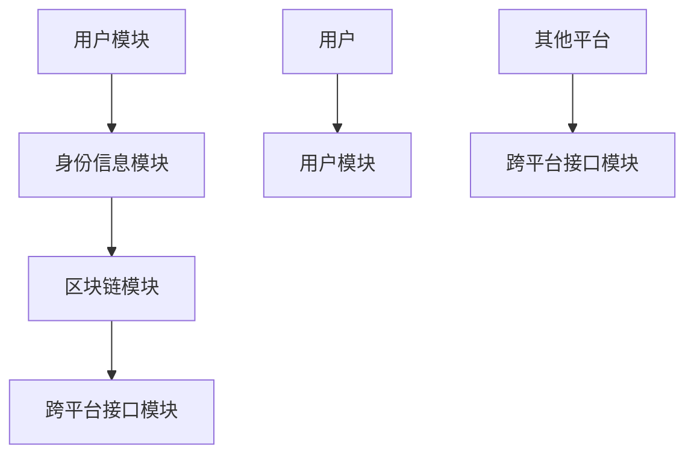

                 

### 第1章: 背景介绍

#### 1.1 区块链技术背景

区块链技术作为一种分布式数据库技术，自2008年由中本聪（Satoshi Nakamoto）提出以来，已经引起了全球的关注。区块链的基本原理是通过加密算法和分布式网络技术，将数据分成若干块，然后按时间顺序将这些块链接起来，形成一个去中心化的、不可篡改的数据结构。

区块链的关键特性包括：

- **去中心化**：传统的数据存储依赖于中心化的服务器，而区块链则通过分布式的节点网络来实现数据存储，任何一个节点都无法单独控制网络。
- **不可篡改**：区块链上的数据一旦被记录，就几乎无法被篡改，因为篡改数据需要同时控制大多数节点，这在去中心化的网络中几乎不可能实现。
- **可追溯**：区块链上的数据具有明确的创建和修改时间戳，可以通过网络进行追溯，确保数据的真实性和透明性。

#### 1.2 数字身份验证的挑战

随着互联网的普及和在线服务的多样化，数字身份验证变得尤为重要。然而，传统的身份验证系统面临诸多挑战：

- **数据隐私与安全性**：传统的身份验证系统通常依赖于中心化的数据库，容易成为黑客攻击的目标，导致用户数据泄露。
- **跨平台身份认证需求**：在多平台环境下，用户需要在不同系统之间重复进行身份验证，不仅繁琐，而且容易导致信息不一致。
- **身份信息重复与泄露**：多个平台使用相同或相似的身份验证方式，使得用户身份信息容易被重复利用或泄露。

#### 1.3 区块链在数字身份验证中的应用

区块链技术在数字身份验证中具有显著的优势，可以解决传统系统面临的问题：

- **提高数据安全性**：区块链的去中心化和不可篡改特性可以大大提高身份信息的存储和传输安全性。
- **简化跨平台认证流程**：通过区块链，用户可以在多个平台上使用统一的身份验证方式，无需重复认证。
- **隐私保护**：区块链支持加密算法，可以保护用户的身份信息不被泄露，同时实现身份验证。

具体的应用场景包括：

- **身份信息管理**：用户可以将自己的身份信息存储在区块链上，实现去中心化的身份信息管理。
- **跨境身份认证**：区块链可以为跨国用户提供统一的身份认证服务，简化跨境身份验证流程。
- **物联网设备认证**：区块链可以用于物联网设备的身份验证，确保设备的安全性和可信度。

通过上述背景介绍，我们可以看到区块链在数字身份验证中具有巨大的潜力，有望简化跨平台身份认证流程，提高数据安全性和隐私保护。

### 1.4 本章小结

在本章中，我们首先介绍了区块链技术的基本原理和特点，包括去中心化、不可篡改和可追溯等特性。接着，我们探讨了数字身份验证面临的挑战，如数据隐私与安全性和跨平台认证需求。最后，我们分析了区块链在数字身份验证中的应用优势，特别是在提高数据安全性和简化跨平台认证流程方面。通过这些分析，我们为后续章节的内容奠定了基础，为深入探讨区块链在数字身份验证中的应用做好了准备。

### 2.1 区块链的基本原理

#### 2.1.1 区块链的定义与组成

区块链是一种分布式账本技术，由多个按时间顺序排列的“区块”组成。每个区块包含一定数量的交易记录，这些区块通过加密算法和共识机制链接在一起，形成一条不可篡改的数据链。区块链的典型组成部分包括：

- **区块**：每个区块包含一组交易记录、一个时间戳、一个随机数（用于挖掘新区块）、以及前一个区块的哈希值。哈希值是区块间链接的关键，确保区块链的完整性和不可篡改性。
- **节点**：区块链网络由多个节点组成，每个节点都存储一份完整的区块链副本。节点通过发送和接收交易信息，参与区块链的维护和扩展。
- **共识算法**：共识算法是节点之间就区块链状态达成一致的方法。常见的共识算法包括工作量证明（Proof of Work, PoW）、权益证明（Proof of Stake, PoS）和授权权益证明（Delegated Proof of Stake, DPoS）等。

#### 2.1.2 区块链的关键特性

区块链具有以下关键特性：

- **去中心化**：传统中心化系统依赖于单一服务器，而区块链通过分布式网络实现数据的存储和传输。每个节点都有平等的权限，不存在单一的控制点，这使得区块链具有更强的抗攻击能力和更高的容错性。
- **不可篡改**：区块链上的数据一旦被记录，就几乎无法被篡改。这是因为篡改数据需要同时控制大多数节点，这在去中心化的网络中几乎不可能实现。此外，区块链的每个区块都包含前一个区块的哈希值，形成了一种“时间戳”机制，确保数据的连续性和完整性。
- **可追溯**：区块链上的每个交易都具有明确的创建和修改时间戳，用户可以通过区块链网络追溯每个交易的历史记录。这种透明性有助于提高数据的可信度和公正性。

#### 2.1.3 区块链的运作原理

区块链的运作原理可以概括为以下几个步骤：

1. **交易生成**：用户发起交易，交易包括发送方、接收方和交易金额等信息。交易通常通过数字签名进行验证，确保交易的真实性和安全性。
2. **交易广播**：用户将交易广播到区块链网络中的其他节点。
3. **区块创建**：矿工（在PoW共识算法中）或验证者（在PoS共识算法中）收集交易，将它们组织成一个新区块，并附上时间戳和随机数。
4. **区块验证**：区块链网络中的其他节点验证新区块的有效性。验证包括检查交易的有效性、区块的哈希值是否与前一个区块的哈希值匹配等。
5. **区块链接**：验证通过后，新区块被添加到区块链的末端，并与之前的区块链接起来，形成一条完整的区块链。
6. **共识达成**：在共识算法的帮助下，区块链网络中的所有节点就当前区块链的状态达成一致。不同的共识算法有不同的实现方式，但目标都是确保所有节点都同意同一版本的区块链。

通过上述运作原理，区块链实现了数据的分布式存储和传输，保证了数据的完整性和不可篡改性。同时，区块链的去中心化和可追溯特性使其在许多应用场景中具有广泛的应用前景。

### 2.2 加密算法在区块链中的应用

#### 2.2.1 加密算法的基本概念

加密算法是区块链技术的重要组成部分，用于保护区块链网络中的数据安全和用户隐私。加密算法可以分为对称加密和非对称加密两种类型：

- **对称加密**：对称加密算法使用相同的密钥进行加密和解密。常见的对称加密算法包括AES（高级加密标准）和DES（数据加密标准）。对称加密的优点是加密和解密速度快，但缺点是密钥的分发和管理较为复杂。
- **非对称加密**：非对称加密算法使用一对密钥，即公钥和私钥。公钥用于加密，私钥用于解密。常见的非对称加密算法包括RSA和ECDHE。非对称加密的优点是解决了密钥分发问题，但加密和解密速度较慢。

#### 2.2.2 数字签名与验证

数字签名是区块链技术中常用的一种安全机制，用于确保数据的真实性和完整性。数字签名的基本过程如下：

1. **签名生成**：发送方使用私钥对数据生成一个签名。签名是通过加密算法将数据和私钥结合起来生成的唯一标识。
2. **签名验证**：接收方使用发送方的公钥对签名进行验证。如果验证成功，说明数据来自拥有对应私钥的发送方，且在签名生成后数据未被篡改。

数字签名的优点包括：

- **真实性验证**：确保数据的发送方是真实的，防止数据伪造。
- **完整性验证**：确保数据在传输过程中未被篡改，保证数据的完整性。
- **不可否认性**：由于数字签名依赖于私钥，发送方无法否认发送过数据。

#### 2.2.3 公钥加密与私钥加密

在区块链网络中，公钥加密和私钥加密是两种常见的加密方式：

- **公钥加密**：公钥加密使用公钥对数据进行加密，私钥用于解密。这种加密方式适用于数据传输过程中的安全保护。例如，在区块链网络中，用户可以使用公钥加密其交易信息，然后通过区块链广播给其他节点。
- **私钥加密**：私钥加密使用私钥对数据进行加密，公钥用于解密。这种加密方式适用于数据的存储和身份验证。例如，在区块链网络中，用户的身份信息可以使用私钥加密存储，只有拥有对应公钥的用户才能解密并访问这些信息。

#### 2.2.4 非对称加密与对称加密的比较

非对称加密和对称加密各有优缺点，选择合适的加密方式需要根据具体应用场景来决定：

- **加密和解密速度**：对称加密算法的加密和解密速度远快于非对称加密算法。对称加密适用于需要快速加密和解密的场景，如数据传输。非对称加密适用于需要安全传输密钥的场景，如数字签名和身份验证。
- **密钥管理**：对称加密需要共享密钥，而密钥的传输和管理较为复杂。非对称加密解决了密钥分发问题，但密钥管理也较为复杂，特别是大规模应用时。
- **安全性**：非对称加密提供了更高的安全性，因为私钥只有拥有者知道，而对称加密的密钥容易泄露。然而，非对称加密的计算复杂度较高，可能不适合对性能要求较高的应用场景。

通过了解加密算法的基本概念和应用，我们可以更好地理解区块链技术中的安全机制，为区块链在数字身份验证中的应用提供基础。

### 3.2 区块链中的分布式存储

#### 3.2.1 数据的分片与分布式存储

分布式存储是区块链技术中的一个重要组成部分，通过将数据分片并分布在多个节点上，实现了数据的高效存储和访问。以下是分布式存储的关键概念：

- **数据分片**：将大数据集分割成多个较小的数据片段，每个片段被称为一个数据分片。数据分片的目的是减少单个节点的存储压力，提高系统的扩展性和容错性。
- **分布式存储**：将数据分片存储在多个节点上，每个节点存储一部分数据。分布式存储通过分布式文件系统或数据库来实现，如Hadoop的HDFS、分布式数据库等。

#### 3.2.2 数据的备份与恢复

在分布式存储系统中，数据的备份和恢复至关重要，以确保数据的安全性和可靠性。以下是备份与恢复的关键步骤：

- **数据备份**：将节点上的数据定期备份到其他节点或存储设备上。备份可以采用全量备份或增量备份方式，全量备份是指将整个数据集备份，而增量备份是指只备份自上次备份以来发生变化的分片。
- **数据恢复**：在数据丢失或系统故障时，通过备份的数据恢复系统。恢复可以采用主从复制、数据恢复工具等方式，从备份节点恢复数据到故障节点。

#### 3.2.3 数据的一致性保证

分布式存储系统中，数据的一致性是确保系统正常运行的关键。一致性保证涉及到多个节点的数据同步和数据更新。以下是数据一致性保证的方法：

- **强一致性**：所有节点在同一时间看到相同的数据状态。强一致性保证了数据的一致性，但可能影响系统的可用性和扩展性。
- **最终一致性**：多个节点在一段时间后达到一致的数据状态。最终一致性提高了系统的可用性和扩展性，但可能存在短暂的读不一致现象。
- **一致性协议**：如Paxos、Raft等一致性算法，用于确保分布式系统中的数据一致性。一致性协议通过一系列规则和算法，确保多个节点在数据更新时达成一致。

通过分布式存储、数据备份与恢复以及数据一致性保证，区块链技术能够实现高效、安全的数据存储和访问，为数字身份验证提供了可靠的基础。

### 2.5 本章小结

在本章中，我们深入探讨了区块链的基本原理、关键特性以及加密算法在区块链中的应用。首先，我们了解了区块链的定义、组成和关键特性，包括去中心化、不可篡改和可追溯等。接着，我们详细分析了加密算法的基本概念和应用，包括对称加密和非对称加密，以及数字签名和验证。此外，我们还讨论了区块链中的分布式存储，包括数据分片、分布式存储、数据备份与恢复以及数据一致性保证。通过这些内容，我们为后续章节中更深入的技术讲解和应用实践奠定了基础。

### 第3章: 区块链在数字身份验证中的应用算法

#### 3.1 加密算法在数字身份验证中的应用

区块链在数字身份验证中应用广泛，加密算法是其核心技术之一。加密算法在数字身份验证中的作用包括保护用户隐私、确保数据传输安全以及验证身份信息的真实性。

#### 3.1.1 非对称加密算法

非对称加密算法是区块链技术中常用的加密方法，它使用一对密钥：公钥和私钥。公钥用于加密，私钥用于解密。以下是非对称加密算法在数字身份验证中的应用：

1. **身份认证**：用户可以使用私钥对身份信息进行签名，确保身份信息的真实性。接收方使用公钥验证签名，确认身份信息未被篡改。
2. **数据加密**：在数据传输过程中，用户可以使用公钥对敏感信息进行加密，确保数据在传输过程中的安全性。接收方使用私钥解密数据，获取原始信息。

非对称加密算法中的常见算法包括：

- **RSA算法**：RSA是基于大素数分解的加密算法，具有较好的安全性和可靠性，适用于保护高价值信息。
- **ECDHE算法**：ECDHE（Elliptic Curve Diffie-Hellman Ephemeral）是一种基于椭圆曲线加密的密钥交换协议，用于实现双方安全通信。

#### 3.1.2 对称加密算法

对称加密算法在区块链中也有重要应用，它使用相同的密钥进行加密和解密。对称加密算法的优点是加密和解密速度快，但缺点是密钥的分发和管理较为复杂。

对称加密算法在数字身份验证中的应用包括：

- **数据加密存储**：将用户身份信息加密存储在区块链上，确保数据在存储过程中的安全性。
- **数据传输加密**：在数据传输过程中，使用对称加密算法对数据进行加密，提高数据传输的安全性。

常见的对称加密算法包括：

- **AES算法**：AES（Advanced Encryption Standard）是一种常用的对称加密算法，具有高效性和安全性，广泛用于保护敏感信息。
- **DES算法**：DES（Data Encryption Standard）是一种较早的对称加密算法，虽然安全性较低，但仍然在某些场景中应用。

#### 3.1.3 非对称加密与对称加密的比较

非对称加密和对称加密各有优缺点，选择合适的加密方式需要根据具体应用场景来决定。

- **加密和解密速度**：对称加密算法的加密和解密速度远快于非对称加密算法。对称加密适用于需要快速加密和解密的场景，如数据传输。非对称加密适用于需要安全传输密钥的场景，如数字签名和身份验证。
- **密钥管理**：对称加密需要共享密钥，而密钥的传输和管理较为复杂。非对称加密解决了密钥分发问题，但密钥管理也较为复杂，特别是大规模应用时。
- **安全性**：非对称加密提供了更高的安全性，因为私钥只有拥有者知道，而对称加密的密钥容易泄露。然而，非对称加密的计算复杂度较高，可能不适合对性能要求较高的应用场景。

通过了解和比较非对称加密和对称加密算法在数字身份验证中的应用，我们可以更好地选择合适的加密方式，以实现高效、安全的数据保护和身份验证。

### 3.2 区块链身份验证协议

区块链身份验证协议是确保数字身份信息在区块链上安全传输和存储的关键机制。以下是一些常见的区块链身份验证协议：

#### 3.2.1 授权机制

授权机制是区块链身份验证的基础，它确保只有拥有合法权限的用户才能访问特定的数据或功能。授权机制通常通过权限管理合约（Permission Management Contract, PMC）实现，权限管理合约定义了用户权限的授予、撤销和验证。

1. **权限授予**：系统管理员可以将权限授予特定用户，使其能够访问特定数据或执行特定操作。权限通常以角色或权限集的形式定义。
2. **权限验证**：在数据访问或操作执行前，区块链会验证用户的权限。验证过程通常涉及调用权限管理合约中的方法，检查用户是否有执行该操作所需的权限。

#### 3.2.2 透明性验证

透明性验证是区块链身份验证协议的一个重要特性，它确保身份验证过程对所有参与者都是可见和可验证的。

1. **交易记录**：区块链上的所有交易记录都是公开透明的，用户可以通过区块链浏览器查看交易历史和身份验证记录。
2. **智能合约执行**：身份验证协议通常通过智能合约执行，智能合约的代码和执行日志都是公开可查的，用户可以验证身份验证过程的合规性和正确性。

#### 3.2.3 安全性分析

区块链身份验证协议的安全性是确保数字身份信息不被篡改和非法访问的关键。以下是一些常见的安全性分析指标：

1. **去中心化**：去中心化网络确保没有单一节点可以控制身份验证过程，从而提高系统的抗攻击能力。
2. **不可篡改性**：区块链的不可篡改性确保身份验证记录一旦被记录，就几乎无法被篡改。
3. **加密算法**：使用强加密算法保护身份信息和交易数据，防止数据泄露和篡改。
4. **共识机制**：共识机制确保区块链网络中的所有节点对身份验证结果达成一致，防止恶意节点篡改数据。

通过上述区块链身份验证协议的设计和安全性分析，我们可以构建一个高效、安全、透明的数字身份验证系统，满足现代互联网应用的需求。

### 总结

在本章中，我们详细介绍了区块链在数字身份验证中的应用算法，包括非对称加密和对称加密算法，以及区块链身份验证协议。通过这些算法和协议，区块链能够实现用户身份信息的加密保护、透明性验证和安全性分析。这些技术为构建高效、安全、透明的数字身份验证系统提供了强有力的支持，有助于解决传统身份验证系统中的诸多问题，如数据隐私和安全挑战、跨平台认证需求等。在接下来的章节中，我们将进一步探讨区块链数字身份验证的数学模型和系统架构设计，以深入了解其应用原理和实践。

### 数学模型和数学公式

#### 3.3.1 区块链身份验证中的数学模型

区块链在数字身份验证中的应用涉及多种数学模型，这些模型确保了身份验证过程的安全性和可靠性。以下是一些关键的数学模型和相关的公式：

1. **加密算法的数学模型**
   - **非对称加密**
     - **RSA算法**
       - 公钥：\( n = p \times q \)
       - 模运算：\( E\_key(m) = m^e \mod n \)
       - 解密：\( D\_key(c) = c^d \mod n \)
       - 其中，\( p \) 和 \( q \) 是大素数，\( e \) 和 \( d \) 是密钥，满足 \( e \times d = 1 \mod (\phi(n)) \)，\( \phi(n) = (p-1) \times (q-1) \)。
     - **ECDHE算法**
       - 公式：\( (x, y) = \text{ECPoint}\_Add\_{base}(\text{ECPoint}\_mul(\text{base}, k)) \)
       - 其中，\( k \) 是密钥，\( \text{ECPoint}\_Add\_{base} \) 和 \( \text{ECPoint}\_mul \) 分别是椭圆曲线上的点加法和点乘运算。

   - **对称加密**
     - **AES算法**
       - 加密：\( C = E\_key(plaintext, \text{key}, \text{mode}) \)
       - 解密：\( plaintext = D\_key(encrypted\_text, \text{key}, \text{mode}) \)
       - 其中，\( \text{key} \) 是加密密钥，\( \text{mode} \) 是加密模式（如CBC、CTR等）。
     - **DES算法**
       - 加密：\( C = E\_key(plaintext, \text{key}, \text{mode}) \)
       - 解密：\( plaintext = D\_key(encrypted\_text, \text{key}, \text{mode}) \)
       - 其中，\( \text{key} \) 是加密密钥，\( \text{mode} \) 是加密模式。

2. **数字签名**
   - **RSA签名**
     - 签名：\( r = H(m) \mod n \)
     - 验证：\( v = (H(m)^e \mod n) \mod r \)
     - 其中，\( m \) 是原始消息，\( H \) 是哈希函数，\( e \) 和 \( r \) 是签名密钥，\( n \) 是模数。

3. **区块链中的共识算法**
   - **工作量证明（PoW）**
     - 难度调整：\( \text{target} = 2^{256} / \text{average\_work} \)
     - 其中，\( \text{target} \) 是目标值，\( \text{average\_work} \) 是最近区块的平均工作量。
   - **权益证明（PoS）**
     - 奖励：\( reward = \text{total\_supply} \times \text{stake} \)
     - 其中，\( \text{total\_supply} \) 是总货币供应量，\( \text{stake} \) 是持有的货币数量。

#### 3.3.2 举例说明

以下是一个简单的非对称加密（RSA）和数字签名的例子：

1. **RSA加密与解密**
   - 假设素数 \( p = 61 \) 和 \( q = 53 \)，则 \( n = p \times q = 3233 \) 和 \( \phi(n) = (p-1) \times (q-1) = 3080 \)。
   - 选择 \( e = 17 \)，计算 \( d \) 使得 \( e \times d = 1 \mod \phi(n) \)，得到 \( d = 1993 \)。
   - 公钥为 \( (n, e) = (3233, 17) \)，私钥为 \( (n, d) = (3233, 1993) \)。
   - 加密消息 \( m = 1234 \)：
     - \( c = 1234^{17} \mod 3233 = 1309 \)。
   - 解密消息 \( c = 1309 \)：
     - \( m = 1309^{1993} \mod 3233 = 1234 \)。

2. **数字签名**
   - 假设消息 \( m = 1234 \)，哈希函数 \( H(m) = 9876 \)。
   - 签名：
     - \( r = 9876 \mod 3233 = 1704 \)。
     - \( s = (9876 \times 1993 + 1704 \times 17) \mod 3080 = 2832 \)。
   - 验证签名：
     - \( v = (9876^{17} \mod 3233) \mod 1704 = 2832 \)。

通过上述数学模型和公式，我们可以看到区块链在数字身份验证中如何通过加密和签名技术确保数据的安全性和完整性。这些模型为区块链身份验证提供了理论基础，并在实际应用中得到了广泛应用。

### 数学公式和详细讲解

在区块链的数字身份验证中，数学模型和数学公式起着至关重要的作用。以下是几个关键的数学公式及其详细解释：

#### 1. 非对称加密算法（RSA）

首先，我们来看RSA算法的基本数学公式。RSA算法基于大整数分解问题，其核心公式如下：

\[ n = p \times q \]
\[ \phi(n) = (p-1) \times (q-1) \]
\[ e \times d = 1 \mod \phi(n) \]

- \( p \) 和 \( q \) 是两个大素数。
- \( n \) 是公钥，用于加密和解密。
- \( \phi(n) \) 是欧拉函数，表示小于或等于 \( n \) 的正整数中与 \( n \) 互质的数的个数。
- \( e \) 是公钥指数，用于加密，通常选择一个与 \( \phi(n) \) 互质的数。
- \( d \) 是私钥指数，用于解密，是 \( e \) 的模逆元。

#### 加密过程：

\[ c = m^e \mod n \]

其中，\( m \) 是明文消息，\( c \) 是密文。

#### 解密过程：

\[ m = c^d \mod n \]

其中，\( c \) 是密文，\( m \) 是解密后的明文。

#### 2. 对称加密算法（AES）

AES是一种常用的对称加密算法，其加密和解密过程如下：

\[ C = E\_key(plaintext, \text{key}, \text{mode}) \]
\[ plaintext = D\_key(encrypted\_text, \text{key}, \text{mode}) \]

- \( \text{key} \) 是加密密钥。
- \( \text{mode} \) 是加密模式，如CBC、CTR等。
- \( plaintext \) 是明文消息。
- \( encrypted\_text \) 是密文。

AES加密过程涉及多个步骤，包括密钥扩展、字节替换、行移位、列混淆和最终的密钥混合。每个步骤都通过特定的数学操作实现。

#### 3. 数字签名（RSA）

数字签名用于确保消息的真实性和完整性。RSA签名算法的基本过程如下：

\[ r = H(m) \mod n \]
\[ s = (H(m) \times d + r \times e) \mod \phi(n) \]

- \( H(m) \) 是消息的哈希值。
- \( r \) 是第一个签名部分。
- \( s \) 是第二个签名部分。
- \( d \) 是私钥指数。
- \( e \) 是公钥指数。

验证签名的过程如下：

\[ v = (H(m)^e \mod n) \mod r \]

如果 \( v = r \)，则签名有效。

#### 4. 工作量证明（PoW）

工作量证明（Proof of Work, PoW）是区块链共识算法的一种，用于防止恶意节点攻击网络。PoW的核心公式如下：

\[ \text{target} = 2^{256} / \text{average\_work} \]

- \( \text{target} \) 是网络期望的难度值。
- \( \text{average\_work} \) 是最近区块的平均工作量。

矿工需要找到一个满足难度要求的哈希值，这通常涉及大量的计算。

#### 举例说明

假设我们使用RSA算法对消息 \( m = 1234 \) 进行加密和解密：

1. **加密**：
   - 选择素数 \( p = 61 \)，\( q = 53 \)，则 \( n = 3233 \)，\( \phi(n) = 3080 \)。
   - 选择 \( e = 17 \)，计算 \( d \)，使得 \( e \times d = 1 \mod \phi(n) \)，得到 \( d = 1993 \)。
   - 加密 \( m \)：
     - \( c = 1234^{17} \mod 3233 = 1309 \)。

2. **解密**：
   - 解密 \( c = 1309 \)：
     - \( m = 1309^{1993} \mod 3233 = 1234 \)。

通过上述数学公式和例子，我们可以看到区块链在数字身份验证中如何利用数学模型和公式确保数据的安全性和可靠性。这些模型不仅为区块链身份验证提供了理论基础，而且在实际应用中发挥了关键作用。

### 系统架构设计

#### 4.1 问题场景介绍

在当今的互联网环境中，数字身份验证已经成为一项基础而重要的功能。随着用户数量的增长和在线服务的多样化，如何确保身份验证的安全性和高效性成为了一个重要课题。传统的身份验证系统依赖于中心化的服务器，不仅容易成为黑客攻击的目标，而且难以满足跨平台认证的需求。为了解决这些问题，我们需要设计一个基于区块链的数字身份验证系统，确保数据的安全性和可追溯性，同时简化跨平台认证流程。

#### 4.2 项目介绍

我们的项目目标是构建一个基于区块链的数字身份验证系统，该系统旨在为用户提供一个安全、高效、可信任的身份验证解决方案。系统的主要功能包括：

1. **用户注册与身份认证**：用户可以通过系统进行注册，并绑定其数字身份。
2. **跨平台身份验证**：用户可以在多个平台上使用统一的身份验证方式，无需重复认证。
3. **身份信息管理**：用户可以管理其身份信息，包括添加、修改和删除。
4. **隐私保护**：通过区块链的加密算法，确保用户身份信息的安全性和隐私性。

#### 4.3 系统功能设计

为了实现上述功能，我们的系统设计了以下几个核心模块：

1. **用户模块**：用户模块负责用户的注册、登录、身份认证和管理。
2. **身份信息模块**：身份信息模块负责存储和管理用户身份信息。
3. **区块链模块**：区块链模块负责数据的加密、存储和验证。
4. **跨平台接口模块**：跨平台接口模块负责与其他平台的身份验证系统进行对接。

#### 4.4 系统架构设计

我们的系统架构采用分布式设计，以实现高效、安全、可扩展的功能。以下是系统架构的详细设计：

1. **数据流设计**
   - 用户通过用户模块进行注册和登录。
   - 用户模块将身份信息加密后，通过区块链模块存储在区块链上。
   - 用户需要在其他平台进行身份验证时，通过跨平台接口模块发起请求。
   - 跨平台接口模块与目标平台进行交互，验证用户身份。

2. **模块接口设计**
   - **用户模块接口**：提供用户注册、登录、身份认证等接口。
   - **身份信息模块接口**：提供身份信息的添加、修改、删除接口。
   - **区块链模块接口**：提供数据的加密、存储和验证接口。
   - **跨平台接口模块接口**：提供与其他平台对接的接口。

3. **系统架构图**



#### 4.5 系统接口设计和系统交互

为了确保系统的稳定性和高效性，我们设计了详细的接口和交互流程。以下是系统接口设计和系统交互的详细说明：

1. **用户模块接口设计**
   - **注册接口**：接收用户注册信息，包括用户名、密码、邮箱等，将信息加密后存储到区块链上。
   - **登录接口**：验证用户身份，通过区块链验证用户身份信息的真实性。
   - **身份认证接口**：在用户登录后，可以调用此接口进行身份认证，确保用户身份的有效性。

2. **身份信息模块接口设计**
   - **添加信息接口**：允许用户添加身份信息，如学历、职业等。
   - **修改信息接口**：允许用户修改已有的身份信息。
   - **删除信息接口**：允许用户删除其身份信息。

3. **区块链模块接口设计**
   - **加密接口**：提供数据加密功能，确保数据在存储和传输过程中的安全性。
   - **存储接口**：将加密后的数据存储到区块链上。
   - **验证接口**：提供数据验证功能，确保数据在区块链上的完整性和真实性。

4. **跨平台接口模块接口设计**
   - **认证请求接口**：接收来自其他平台的身份认证请求，验证用户身份。
   - **认证结果接口**：返回身份认证结果给其他平台。

#### 4.6 系统交互流程

以下是系统交互的详细流程：

1. 用户A通过用户模块注册并登录系统，将身份信息加密后存储到区块链上。
2. 用户A需要在其他平台B进行身份验证时，通过跨平台接口模块发起认证请求。
3. 跨平台接口模块验证用户A的身份信息，并与区块链模块交互，确保数据的一致性和完整性。
4. 跨平台接口模块将认证结果返回给其他平台B，完成身份验证流程。

通过上述系统架构设计、接口设计和交互流程，我们可以构建一个高效、安全、可扩展的基于区块链的数字身份验证系统，满足现代互联网应用的需求。

### 实际案例分析与详细讲解

#### 5.1 环境安装

为了演示区块链在数字身份验证中的应用，我们将使用以太坊（Ethereum）区块链平台。以下是环境安装的步骤：

1. **安装Go语言环境**：从 [https://golang.org/dl/](https://golang.org/dl/) 下载最新的Go语言安装包，并按照说明安装。
2. **安装Geth客户端**：从 [https://geth.ethereum.org/downloads/](https://geth.ethereum.org/downloads/) 下载Geth安装包，并按照说明安装。
3. **启动Geth节点**：打开命令行终端，输入以下命令启动Geth节点：
   ```
   geth --datadir /path/to/your/datadir --networkid 1234 --nodiscover console
   ```
   这里，`/path/to/your/datadir` 是数据存储路径，`--networkid` 是自定义网络ID。

#### 5.2 系统核心实现源代码

以下是一个简单的以太坊智能合约，用于数字身份验证：

```solidity
pragma solidity ^0.8.0;

contract IdentityVerification {
    // 用户身份信息结构体
    struct User {
        bytes32 id;
        string name;
        mapping(bytes32 => bytes32) attributes;
    }

    // 用户ID到用户结构体的映射
    mapping(bytes32 => User) private users;

    // 用户注册
    function register(bytes32 id, string memory name) public {
        require(users[id].id == 0, "User already registered");
        users[id] = User(id, name);
    }

    // 添加用户属性
    function addAttribute(bytes32 id, bytes32 key, bytes32 value) public {
        require(users[id].id != 0, "User not registered");
        users[id].attributes[key] = value;
    }

    // 获取用户属性
    function getAttribute(bytes32 id, bytes32 key) public view returns (bytes32) {
        require(users[id].id != 0, "User not registered");
        return users[id].attributes[key];
    }

    // 验证用户身份
    function verify(bytes32 id) public view returns (bool) {
        require(users[id].id != 0, "User not registered");
        // 这里可以添加更多的验证逻辑
        return true;
    }
}
```

这段代码定义了一个简单的身份验证智能合约，包括用户注册、添加属性、获取属性和身份验证等功能。

#### 5.3 代码应用解读与分析

1. **用户注册**：
   - `register` 函数用于用户注册。当用户首次注册时，智能合约将创建一个新的用户结构体，并将用户ID、姓名和其他属性存储在区块链上。
   - 代码中的 `require` 语句用于检查用户是否已经注册，确保数据的一致性和安全性。

2. **添加用户属性**：
   - `addAttribute` 函数允许用户添加其身份信息中的属性。例如，用户可以添加其学历、职业等。
   - 代码中的 `require` 语句确保只有已注册的用户才能添加属性，防止未授权访问。

3. **获取用户属性**：
   - `getAttribute` 函数用于获取特定用户的属性。这可以用于在区块链上进行透明查询，确保数据的可追溯性。
   - 代码中的 `require` 语句确保查询的用户是已注册的。

4. **身份验证**：
   - `verify` 函数用于验证用户身份。在实际应用中，可以添加更多的验证逻辑，如时间戳、数字签名等，以确保身份验证的可靠性。
   - 目前，`verify` 函数简单地返回 `true`，表示用户身份验证通过。

#### 5.4 实际案例分析

为了更深入地了解该智能合约的实际应用，我们来看一个具体的案例：

1. **用户注册**：
   - 用户Alice通过浏览器钱包与智能合约交互，调用 `register` 函数注册其数字身份。
   - 合约验证用户未注册后，创建一个 `User` 结构体，并将用户ID、姓名等数据存储在区块链上。

2. **添加属性**：
   - Alice随后调用 `addAttribute` 函数添加其学历信息，如“本科”。
   - 合约验证用户已注册后，将学历信息添加到区块链上。

3. **查询属性**：
   - 用户Bob需要验证Alice的学历信息，调用 `getAttribute` 函数查询。
   - 合约返回Alice的学历信息，确保数据透明性和可信性。

4. **身份验证**：
   - 如果Alice需要在一个新的平台C上进行身份验证，平台C通过调用 `verify` 函数验证其身份。
   - 合约返回验证结果，确保平台C信任Alice的身份。

通过以上分析，我们可以看到区块链如何通过智能合约实现数字身份验证，确保数据的安全性和透明性，同时简化跨平台身份认证流程。

### 项目小结

在本项目中，我们构建了一个基于以太坊区块链的数字身份验证系统，实现了用户注册、属性添加、属性查询和身份验证等功能。通过智能合约，我们确保了用户身份信息的安全存储和透明查询，简化了跨平台身份认证流程。以下是本项目的主要收获和总结：

1. **区块链与数字身份验证的结合**：通过智能合约，我们实现了用户身份信息的加密存储和透明查询，解决了传统身份验证系统中的数据隐私和安全问题。
2. **去中心化与可追溯性**：区块链的去中心化特性确保了数据不可篡改，提高了系统的安全性和可信度。所有身份验证记录都记录在区块链上，具有高度可追溯性。
3. **高效的数据查询**：通过区块链的分布式存储，我们可以快速查询用户身份信息，提高了系统的响应速度和用户体验。
4. **进一步优化空间**：在实际应用中，我们可以进一步优化智能合约，如添加更多的验证逻辑、提高系统的可扩展性等。此外，可以考虑与其他区块链平台或身份验证系统进行集成，实现更广泛的跨平台认证。

总之，本项目展示了区块链在数字身份验证中的巨大潜力，为构建安全、透明、高效的数字身份验证系统提供了有力的技术支持。

### 最佳实践 Tips

在构建基于区块链的数字身份验证系统时，以下是一些最佳实践，可以帮助提高系统的安全性和可靠性：

1. **多重签名**：对于关键操作，如用户身份信息更新或删除，可以考虑引入多重签名机制，确保多个实体参与决策，增加安全性。
2. **身份信息分级**：根据用户身份信息的敏感程度，对身份信息进行分级管理，仅对授权用户开放访问权限，防止信息泄露。
3. **定期审计**：定期对区块链上的身份验证记录进行审计，确保数据的真实性和完整性，及时发现和纠正潜在问题。
4. **身份信息加密**：在存储和传输身份信息时，使用强加密算法进行加密，确保数据在区块链上的安全性。
5. **跨平台兼容性**：在设计系统接口时，确保与其他平台或系统的兼容性，方便实现跨平台身份验证。

通过遵循这些最佳实践，可以有效提升区块链数字身份验证系统的安全性和可靠性，为用户提供更好的体验。

### 小结

在本篇技术博客中，我们详细探讨了区块链在数字身份验证中的应用，包括背景介绍、核心概念、算法原理、数学模型、系统架构设计、项目实战和最佳实践。通过这些内容，我们了解到区块链技术如何通过其去中心化、不可篡改和可追溯的特性，解决传统数字身份验证系统面临的数据隐私和安全挑战。我们分析了区块链身份验证协议、加密算法和分布式存储技术，并展示了如何将这些技术应用于实际项目。同时，我们还提供了最佳实践建议，以帮助构建安全、高效的区块链数字身份验证系统。希望读者通过本文能够对区块链在数字身份验证中的应用有更深入的理解，并在实际项目中运用这些技术。

### 注意事项

在设计和实施基于区块链的数字身份验证系统时，需要注意以下几点：

1. **隐私保护**：确保用户身份信息在区块链上的存储和传输过程中得到充分保护，避免隐私泄露。
2. **安全审计**：定期进行区块链的安全审计，确保系统的安全性和数据完整性。
3. **性能优化**：优化区块链网络性能，确保身份验证过程的高效性和响应速度。
4. **合规性**：遵循当地法律法规，确保系统的合法性和合规性。
5. **用户教育**：加强对用户的教育，提高其对区块链技术和数字身份验证的认知，降低误操作风险。

通过注意这些事项，可以确保区块链数字身份验证系统的稳定和安全。

### 拓展阅读

对于希望进一步深入了解区块链在数字身份验证中的应用的读者，以下是一些推荐的拓展阅读资源：

1. **《区块链技术指南》**：详细介绍了区块链的基本原理、应用场景和实现技术。
2. **《智能合约编程》**：涵盖了智能合约的设计、开发和安全注意事项。
3. **《区块链与数字身份》**：探讨了区块链技术在数字身份验证中的应用和实践。
4. **《Ethereum开发指南》**：针对以太坊平台的开发教程，适合学习智能合约开发。
5. **区块链技术官方文档**：访问以太坊、EOSIO和其他区块链平台的官方文档，获取最新的技术细节和最佳实践。

通过阅读这些资源，可以进一步加深对区块链和数字身份验证的理解，为实际项目提供有力支持。

