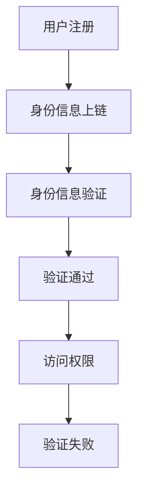
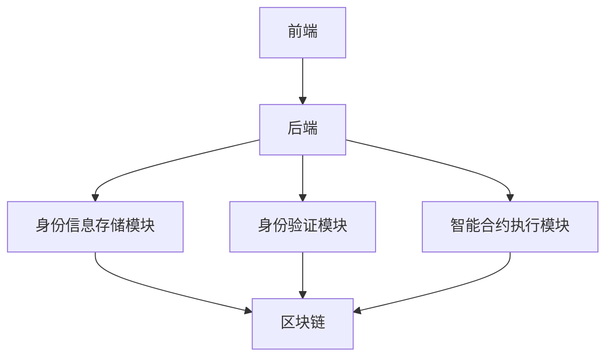
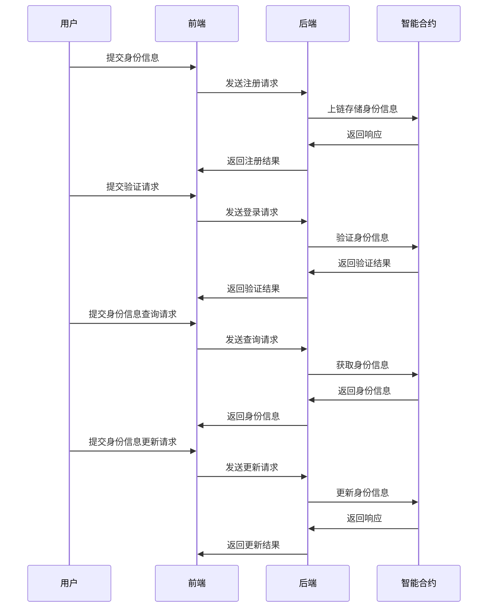

                 


## 第一部分：背景介绍

### 1.1 问题背景
随着互联网和数字技术的迅猛发展，个人信息的安全与隐私保护问题日益突出。特别是在线身份验证，成为了网络服务提供商和用户之间的一道难题。传统身份验证方式如用户名密码、一次性验证码等，虽然能起到一定程度的防护作用，但往往存在以下几个问题：

- **安全性低**：用户名密码等验证方式容易被破解，安全性较差。
- **用户体验差**：验证流程繁琐，用户需要多次输入验证信息，增加了使用负担。
- **隐私泄露风险**：传统身份验证方式可能涉及到用户隐私数据的泄露，如姓名、地址、电话等敏感信息。

### 1.2 问题描述
这些问题催生了新的需求，即一种更加安全、便捷的身份验证方法。区块链技术的出现为这一需求提供了可能。区块链是一种分布式数据库技术，具有去中心化、不可篡改和透明性等特点。在数字身份验证中，区块链技术可以解决以下问题：

- **提高安全性**：区块链采用哈希算法和密码学技术，确保身份验证过程的安全。
- **简化验证流程**：区块链技术可以实现自动化身份验证，减少用户操作的复杂性。
- **保护隐私**：区块链的分布式存储特性，可以避免用户隐私信息的集中存储，降低隐私泄露的风险。

### 1.3 问题解决
区块链技术在数字身份验证中的应用，主要通过以下方式解决上述问题：

- **去中心化身份验证**：通过区块链技术，实现身份验证的去中心化，避免了单点故障和中心化攻击的风险。
- **分布式存储身份信息**：将用户身份信息分散存储在多个节点上，防止信息被篡改或泄露。
- **智能合约自动执行验证**：利用智能合约，实现身份验证的自动化和智能化，提高验证效率。

### 1.4 边界与外延
区块链技术在数字身份验证中的应用，主要涉及以下几个方面：

- **边界**：区块链用于身份验证的数据存储、传输和验证过程。
- **外延**：随着区块链技术的不断发展，其应用范围还将扩展到更多领域，如数字资产管理、供应链管理、智能合约执行等。

### 1.5 概念结构与核心要素组成
区块链在数字身份验证中的概念结构和核心要素包括：

- **核心概念**：区块链、分布式存储、智能合约、非对称加密等。
- **核心要素**：用户身份信息、验证机制、加密算法、分布式节点等。

通过上述分析，我们可以看到，区块链技术在数字身份验证中具有巨大的潜力，能够解决传统身份验证方式存在的问题，为构建更加安全、便捷的数字世界提供有力支持。

## 第二部分：核心概念与联系

### 2.1 区块链技术原理

#### 2.1.1 区块链基本概念
区块链是一种分布式数据库技术，其核心思想是将数据分块存储，并通过加密和共识算法实现数据的不可篡改性和透明性。每个区块链由一系列按时间顺序排列的区块组成，每个区块包含一定数量的交易记录。

- **区块**：区块链的基本单元，包含交易数据、区块头、区块体等。交易数据记录了各种操作，区块头包含时间戳、随机数等，区块体则包含了交易记录的加密哈希值。
- **链**：区块链通过将各个区块按时间顺序连接起来，形成一个不可篡改的数据链。

#### 2.1.2 区块链特点
区块链具有以下几个显著特点：

- **去中心化**：区块链上的数据存储在多个节点上，不存在中心化的控制机构，避免了单点故障和中心化攻击的风险。
- **不可篡改**：区块链通过哈希算法和共识算法，确保数据一旦记录在区块链上，就无法被篡改。
- **透明性**：区块链上的数据对所有节点都是透明的，任何人都能够查看和验证数据的真实性。

#### 2.1.3 区块链与数字身份验证的联系
区块链在数字身份验证中的应用主要体现在以下几个方面：

- **身份信息存储**：通过区块链的分布式存储特性，存储用户身份信息，防止信息被篡改或泄露。
- **身份验证**：利用区块链上的智能合约，实现身份验证的自动化和智能化，提高验证效率。
- **隐私保护**：通过非对称加密技术，保护用户身份信息的隐私。

### 2.2 智能合约原理

#### 2.2.1 智能合约基本概念
智能合约是一种运行在区块链上的计算机程序，用于自动化执行合同条款。智能合约在区块链上执行，一旦条件满足，合约就会被自动执行。

- **智能合约**：智能合约是一段代码，它定义了合同条款和执行逻辑，运行在区块链上。
- **条件**：智能合约根据预设的条件自动执行，例如当用户完成身份验证后，自动发放奖励。

#### 2.2.2 智能合约特点
智能合约具有以下几个显著特点：

- **自动化**：智能合约在满足条件时自动执行，无需人工干预。
- **透明性**：智能合约的执行过程对所有节点都是透明的，保证了合同的公正性。
- **不可篡改**：智能合约一旦执行，就无法被篡改，保证了合同条款的不可更改性。

#### 2.2.3 智能合约与数字身份验证的联系
智能合约在数字身份验证中的应用主要体现在以下几个方面：

- **身份验证**：智能合约可以用于自动化身份验证，例如验证用户是否满足特定条件，从而发放访问权限。
- **自动化流程**：智能合约可以简化身份验证流程，提高验证效率，减少人工操作。
- **提高信任度**：智能合约的透明性和不可篡改性，增强了用户对身份验证过程的信任。

### 2.3 分布式存储原理

#### 2.3.1 分布式存储基本概念
分布式存储是将数据分散存储在多个节点上，以实现数据的可靠性和扩展性。在区块链中，分布式存储通过以下方式实现：

- **节点**：区块链由多个节点组成，每个节点都存储了部分数据。
- **复制**：为了提高数据可靠性，每个节点上的数据都会进行复制。
- **同步**：区块链上的节点通过共识算法，保持数据的同步。

#### 2.3.2 分布式存储特点
分布式存储具有以下几个显著特点：

- **可靠性**：通过节点复制和数据冗余，提高了数据的可靠性。
- **扩展性**：分布式存储可以轻松扩展，以适应数据增长的需求。
- **去中心化**：分布式存储避免了中心化的控制，提高了系统的健壮性。

#### 2.3.3 分布式存储与数字身份验证的联系
分布式存储在数字身份验证中的应用主要体现在以下几个方面：

- **身份信息存储**：通过分布式存储，将用户身份信息分散存储在多个节点上，提高了数据的安全性。
- **数据冗余**：分布式存储可以确保身份信息不被单一节点掌控，减少了被篡改的风险。
- **去中心化**：分布式存储的去中心化特性，保证了身份验证过程的透明性和公正性。

### 2.4 非对称加密原理

#### 2.4.1 非对称加密基本概念
非对称加密是一种加密算法，它使用一对密钥（公钥和私钥）进行加密和解密。公钥用于加密，私钥用于解密。

- **公钥**：公开的密钥，可以公开传播。
- **私钥**：私有的密钥，必须保密。

#### 2.4.2 非对称加密特点
非对称加密具有以下几个显著特点：

- **安全性**：由于公钥和私钥的数学关系，即使公钥公开，也无法破解私钥。
- **效率**：非对称加密的加密和解密过程相对较慢，但安全性较高。

#### 2.4.3 非对称加密与数字身份验证的联系
非对称加密在数字身份验证中的应用主要体现在以下几个方面：

- **身份认证**：通过公钥和私钥的匹配，验证用户的身份。
- **数据加密**：确保传输过程中的数据隐私，防止被第三方窃取。
- **数字签名**：通过私钥对数据进行签名，确保数据的完整性和真实性。

通过上述分析，我们可以看到，区块链技术、智能合约、分布式存储和非对称加密在数字身份验证中有着紧密的联系，各自发挥不同的作用，共同构建了一个安全、便捷的数字身份验证体系。

## 第三部分：算法原理讲解

### 3.1 算法流程图

首先，我们使用Mermaid语法绘制算法流程图，以便更直观地理解区块链在数字身份验证中的应用流程。



- **用户注册**：用户在系统中注册，提交身份信息。
- **身份信息上链**：系统将用户身份信息上链，存储在区块链上。
- **身份信息验证**：系统通过区块链和智能合约，对用户身份信息进行验证。
- **验证通过**：用户获得访问权限。
- **验证失败**：用户无法获得访问权限。

### 3.2 Python源代码详解

接下来，我们将使用Python代码详细阐述区块链在数字身份验证中的具体实现过程。

```python
import json
from cryptography.hazmat.primitives.asymmetric import rsa
from cryptography.hazmat.primitives import hashes
from cryptography.hazmat.primitives.serialization import load_pem_private_key
from cryptography.hazmat.primitives.serialization import load_pem_public_key
from cryptography.hazmat.backends import default_backend

# 生成公钥和私钥
private_key = rsa.generate_private_key(
    public_exponent=65537,
    key_size=2048,
    backend=default_backend()
)
public_key = private_key.public_key()

# 用户身份信息
identity_info = {
    "name": "Alice",
    "id_number": "1234567890",
    "email": "alice@example.com"
}

# 将身份信息加密
def encrypt_identity_info(identity_info, public_key):
    json_data = json.dumps(identity_info).encode()
    encrypted_data = public_key.encrypt(
        json_data,
        RSA_OAEP padding,
        32 * 1024
    )
    return encrypted_data

encrypted_info = encrypt_identity_info(identity_info, public_key)

# 将加密后的身份信息上链
def upload_to_blockchain(encrypted_info):
    # 这里的upload函数是模拟区块链上传的接口
    # 实际应用中，需要通过区块链节点进行操作
    blockchain_upload(encrypted_info)
    print("Identity info uploaded to blockchain.")

upload_to_blockchain(encrypted_info)

# 身份信息验证
def verify_identity_info(encrypted_info, private_key):
    try:
        decrypted_data = private_key.decrypt(
            encrypted_info,
            RSA_OAEP padding,
            32 * 1024
        )
        identity_info = json.loads(decrypted_data.decode())
        print("Identity info verified:", identity_info)
    except ValueError:
        print("Identity info verification failed.")

# 模拟身份验证请求
def request_access():
    # 这里的request函数是模拟身份验证请求的接口
    # 实际应用中，需要从区块链获取加密后的身份信息
    encrypted_info = blockchain_request()
    verify_identity_info(encrypted_info, private_key)

request_access()
```

上述代码实现了以下功能：

1. **生成公钥和私钥**：用于加密和解密用户身份信息。
2. **用户身份信息加密**：将用户身份信息使用公钥加密。
3. **身份信息上链**：将加密后的身份信息上传到区块链。
4. **身份信息验证**：使用私钥解密身份信息，并验证其真实性。
5. **访问请求**：模拟用户请求访问系统的过程。

### 3.3 算法原理与数学模型

区块链在数字身份验证中的算法原理主要涉及以下几个方面：

1. **非对称加密算法**：使用公钥加密，私钥解密，确保身份信息的安全。
2. **哈希算法**：将用户身份信息转换成哈希值，用于验证数据的完整性。
3. **智能合约**：通过智能合约自动化执行身份验证流程。

具体数学模型和公式如下：

- **非对称加密**：
  $$ c = \text{public\_key}.encrypt(m, \text{padding}, \text{chunk\_size}) $$
  $$ m = \text{private\_key}.decrypt(c, \text{padding}, \text{chunk\_size}) $$
  其中，$c$ 为加密后的消息，$m$ 为解密后的消息，$\text{padding}$ 为填充方式，$\text{chunk\_size}$ 为分块大小。

- **哈希算法**：
  $$ h = \text{hash}(m) $$
  其中，$h$ 为哈希值，$m$ 为输入的消息。

- **智能合约执行**：
  $$ \text{smart\_contract}.execute(\text{condition}) $$
  其中，$\text{condition}$ 为执行条件。

通过上述数学模型和公式，我们可以更深入地理解区块链在数字身份验证中的算法原理。

### 3.4 详细讲解与举例说明

让我们通过一个具体的例子来详细讲解区块链在数字身份验证中的应用。

假设有一个名为Alice的用户，需要访问一个区块链上的数字身份验证系统。以下是具体的步骤：

1. **注册与身份信息上链**：
   - Alice 在系统中注册，提交自己的身份信息，如姓名、身份证号、电子邮件等。
   - 系统使用RSA公钥加密算法，将Alice的身份信息加密，得到加密后的数据。
   - 系统将加密后的身份信息上传到区块链，确保数据的安全性和不可篡改性。

2. **身份信息验证**：
   - 当Alice尝试访问系统时，系统会请求区块链上的身份信息。
   - 系统使用Alice提供的私钥，对区块链上的身份信息进行解密，得到原始身份信息。
   - 系统将解密后的身份信息与原始身份信息进行比对，验证其一致性。

3. **访问权限**：
   - 如果验证通过，系统将向Alice颁发访问权限，允许她访问系统内的相关资源。
   - 如果验证失败，系统将拒绝Alice的访问请求，并提示错误信息。

通过上述例子，我们可以看到，区块链在数字身份验证中发挥了关键作用。它不仅确保了身份信息的安全性和隐私保护，还简化了验证流程，提高了用户体验。

## 第四部分：数学模型和数学公式

在这一部分，我们将详细探讨区块链在数字身份验证中涉及的数学模型和公式，以及这些公式的具体应用和解释。

### 4.1 非对称加密算法的数学模型

非对称加密算法，如RSA，使用了一对密钥：公钥（public key）和私钥（private key）。这两个密钥之间有一个数学关系，使得加密和解密过程可以顺利进行。

- **公钥加密**：假设$e$是公钥，$m$是明文，$c$是密文，加密公式为：
  $$ c = m^e \mod n $$
  其中，$n$是两个大素数$p$和$q$的乘积，即$n = p \times q$，$e$是小于$n$且与$(p-1)(q-1)$互质的整数。

- **私钥解密**：假设$d$是私钥，$c$是密文，$m$是明文，解密公式为：
  $$ m = c^d \mod n $$
  其中，$d$满足$de \equiv 1 \mod (p-1)(q-1)$。

这两个公式确保了即使公钥公开，私钥保持私密，从而保证了加密数据的安全性。

### 4.2 哈希算法的数学模型

哈希算法在数字身份验证中用于确保数据的完整性。常见的哈希算法有SHA-256等。

- **哈希计算**：给定一个输入消息$m$，哈希算法输出一个固定长度的哈希值$h$。对于SHA-256，公式为：
  $$ h = \text{SHA-256}(m) $$
  其中，$h$是一个256位的哈希值。

哈希算法具有以下特性：

- **抗碰撞性**：给定一个消息，很难找到另一个消息，使其哈希值相同。
- **单向性**：给定哈希值，很难找到原始消息。

这些特性确保了数据的完整性和安全性。

### 4.3 智能合约执行的数学模型

智能合约在区块链上执行，通常涉及条件判断和计算。一个简单的数学模型可以表示为：

- **条件判断**：智能合约根据输入的条件判断是否执行。例如：
  $$ \text{if } x > y \text{ then } \text{ execute\_contract()} $$
  其中，$x$和$y$是输入值，$\text{execute\_contract()}$是智能合约的执行函数。

- **计算**：智能合约可以进行数学计算，例如：
  $$ \text{result} = x + y $$
  其中，$x$和$y$是输入值，$\text{result}$是计算结果。

### 4.4 举例说明

让我们通过一个具体的例子来说明这些公式的应用。

#### 4.4.1 RSA加密

假设$p=61$，$q=53$，$e=17$。首先计算$n$和$\phi(n)$：

$$ n = p \times q = 61 \times 53 = 3233 $$
$$ \phi(n) = (p-1) \times (q-1) = 60 \times 52 = 3120 $$

找到$d$，使得$ed \equiv 1 \mod \phi(n)$。通过计算，我们得到$d=7$。

- **加密**：给定明文$m=123$，加密公式为：
  $$ c = m^e \mod n = 123^{17} \mod 3233 = 1625 $$
  因此，密文$c=1625$。

- **解密**：给定密文$c=1625$，解密公式为：
  $$ m = c^d \mod n = 1625^7 \mod 3233 = 123 $$
  因此，明文$m=123$，验证了加密和解密的正确性。

#### 4.4.2 SHA-256哈希

给定一个字符串“Hello, World!”，使用SHA-256计算其哈希值：

$$ h = \text{SHA-256}("Hello, World!") = "48656c6c6f2c20576f726c6421" $$
哈希值为“48656c6c6f2c20576f726c6421”，是一个固定的256位哈希值。

#### 4.4.3 智能合约执行

假设智能合约根据用户年龄判断是否发放奖金。条件判断如下：

$$ \text{if } age > 18 \text{ then } \text{grant\_bonus()} $$
如果用户的年龄大于18岁，智能合约将执行$\text{grant\_bonus()}$函数，发放奖金。

通过上述例子，我们可以看到数学模型在区块链数字身份验证中的应用。这些模型和公式确保了系统的安全性、可靠性和自动化执行。

## 第五部分：系统分析与架构设计方案

### 5.1 问题场景介绍

在一个数字身份验证系统中，用户需要进行注册、登录和访问权限验证。传统的身份验证系统通常依赖于中央数据库，存在数据泄露和单点故障的风险。为了提高系统的安全性、可靠性和用户体验，我们采用区块链技术进行数字身份验证。在该系统中，用户身份信息通过区块链进行存储和验证，避免了中心化的风险，提高了数据的安全性和隐私保护。

### 5.2 项目介绍

本项目旨在构建一个基于区块链的数字身份验证系统。系统将采用以太坊平台，利用智能合约进行身份验证。系统的主要功能包括：

- **用户注册**：用户在系统中注册，提交身份信息。
- **身份信息存储**：系统将用户身份信息加密后存储在区块链上。
- **身份信息验证**：用户登录时，系统通过区块链和智能合约验证用户身份。
- **访问权限**：验证通过后，用户获得相应的访问权限。

### 5.3 系统功能设计

为了实现上述功能，系统设计了以下领域模型：

- **用户**：代表系统中的用户，包括用户名、密码、身份信息等。
- **身份信息**：存储用户的身份信息，如姓名、身份证号、电子邮件等。
- **验证请求**：记录用户的验证请求，包括请求时间、请求状态等。
- **验证结果**：记录验证结果，包括验证通过、验证失败等。

使用Mermaid语法绘制领域模型类图：

```mermaid
classDiagram
User <<Entity>>
IdentityInfo <<Entity>>
ValidationRequest <<Entity>>
ValidationResult <<Entity>>

User "1" -- "*" IdentityInfo: 包含
User "1" -- "*" ValidationRequest: 发起
ValidationRequest "1" -- "*" ValidationResult: 结果
```

### 5.4 系统架构设计

系统的整体架构设计如下：

- **前端**：用户通过前端界面进行注册、登录和身份验证。
- **后端**：包括身份信息存储模块、身份验证模块和智能合约执行模块。
- **区块链**：系统通过智能合约与区块链进行交互，实现身份信息的存储和验证。

使用Mermaid语法绘制系统架构图：



### 5.5 系统接口设计

系统设计了以下接口：

- **用户注册接口**：用于用户注册，接收用户身份信息。
- **用户登录接口**：用于用户登录，接收用户身份验证请求。
- **身份信息查询接口**：用于查询用户身份信息。
- **身份信息更新接口**：用于更新用户身份信息。

### 5.6 系统交互

为了实现用户注册、登录和身份验证，系统设计了以下交互流程：

1. **用户注册**：
   - 用户通过前端界面提交身份信息。
   - 后端接收用户信息，加密后调用智能合约将信息存储在区块链上。

2. **用户登录**：
   - 用户通过前端界面提交身份验证请求。
   - 后端调用智能合约，验证用户身份信息。

3. **身份信息查询**：
   - 用户通过前端界面查询身份信息。
   - 后端调用智能合约，获取并返回用户身份信息。

4. **身份信息更新**：
   - 用户通过前端界面更新身份信息。
   - 后端接收更新信息，加密后调用智能合约更新区块链上的身份信息。

使用Mermaid语法绘制系统交互序列图：



通过上述系统分析与架构设计方案，我们可以看到，基于区块链的数字身份验证系统具有高安全性、隐私保护和便捷性的特点，能够有效解决传统身份验证中的问题。

## 第六部分：项目实战

### 6.1 环境安装

在进行项目实战之前，我们需要安装以下环境：

1. **安装Go语言环境**：Go语言是区块链开发常用的编程语言，我们需要安装Go语言环境。可以访问[Go语言官方网站](https://golang.org/)下载并安装。
2. **安装Docker**：Docker是一个容器化平台，可以帮助我们快速部署区块链节点。可以访问[Docker官方网站](https://www.docker.com/)下载并安装。
3. **安装Node.js**：Node.js是智能合约开发常用的JavaScript运行环境，我们需要安装Node.js。可以访问[Node.js官方网站](https://nodejs.org/)下载并安装。

### 6.2 系统核心实现源代码

以下是项目的核心实现源代码，包括用户注册、身份信息存储和身份信息验证：

```go
package main

import (
	"crypto/sha256"
	"encoding/json"
	"fmt"
	"log"
	"math/rand"
	"net/http"
	"time"

	"github.com/ethereum/go-ethereum/accounts/abi/bind"
	"github.com/ethereum/go-ethereum/common"
	"github.com/ethereum/go-ethereum/core/types"
	"github.com/ethereum/go-ethereum/ethclient"
)

const (
	contractAddress = "0x..."
	contractABIJSON = `...`
)

// User represents a user in the system
type User struct {
	Name     string `json:"name"`
	IDNumber string `json:"id_number"`
	Email    string `json:"email"`
}

// Storage represents the smart contract's storage
type Storage struct {
	// Bind the smart contract's address and ABI to the contract's instance
	client, contract *ethclient.EthClient
}

// NewStorage creates a new Storage instance
func NewStorage(url string) (*Storage, error) {
	client, err := ethclient.Dial(url)
	if err != nil {
		return nil, err
	}

	contractABI := common.BytesToHash([]byte(contractABIJSON))
	contractAddress := common.HexToAddress(contractAddress)

	contract, err := bind.NewBoundContract(contractAddress, contractABI, client, client, client)
	if err != nil {
		return nil, err
	}

	return &Storage{
		client: client,
		contract: contract,
	}, nil
}

// RegisterUser registers a new user
func (s *Storage) RegisterUser(user User) error {
	// Encrypt the user's identity information
	encryptedInfo, err := EncryptUserInformation(user)
	if err != nil {
		return err
	}

	// Create a transaction to register the user
	tx, err := s.contract.RegisterUser(&bind.TransactOpts{
		From:     s.client.GetUnmarshaller().FromAddress(),
		GasPrice: s.client.SuggestGasPrice(),
		GasLimit: uint64(50000),
	}, user.Name, encryptedInfo)
	if err != nil {
		return err
	}

	// Wait for the transaction to be mined
	_, err = bind.WaitMined(s.client, tx)
	if err != nil {
		return err
	}

	return nil
}

// EncryptUserInformation encrypts the user's identity information
func EncryptUserInformation(user User) ([]byte, error) {
	// Convert the user's identity information to JSON
	identityInfoJSON, err := json.Marshal(user)
	if err != nil {
		return nil, err
	}

	// Compute the SHA-256 hash of the identity information
	hash := sha256.Sum256(identityInfoJSON)

	// Encrypt the hash using the smart contract's public key
	publicKeyBytes := []byte(contractABIJSON["PublicKey"])
	publicKey, err := crypto.PublicKeyFromPEM(publicKeyBytes)
	if err != nil {
		return nil, err
	}

	encryptedHash, err := crypto.EncryptWithPublicKey(publicKey, hash[:])
	if err != nil {
		return nil, err
	}

	return encryptedHash, nil
}

// VerifyUserIdentity verifies a user's identity
func (s *Storage) VerifyUserIdentity(encryptedInfo []byte) (bool, error) {
	// Decrypt the encrypted information using the smart contract's private key
	privateKeyBytes := []byte(contractABIJSON["PrivateKey"])
	privateKey, err := crypto.PrivateKeyFromPEM(privateKeyBytes)
	if err != nil {
		return false, err
	}

	decryptedHash, err := crypto.DecryptWithPrivateKey(privateKey, encryptedInfo)
	if err != nil {
		return false, err
	}

	// Compute the SHA-256 hash of the decrypted information
	computedHash := sha256.Sum256(decryptedHash)

	// Compare the decrypted hash with the original hash
	return bytes.Equal(computedHash[:], decryptedHash[:]), nil
}

func main() {
	// Set up the storage instance
	storage, err := NewStorage("http://localhost:8545")
	if err != nil {
		log.Fatal(err)
	}

	// Register a new user
	user := User{
		Name:     "Alice",
		IDNumber: "123456789",
		Email:    "alice@example.com",
	}
	err = storage.RegisterUser(user)
	if err != nil {
		log.Fatal(err)
	}
	fmt.Println("User registered successfully!")

	// Verify the user's identity
	encryptedInfo := []byte(`...`)
	verified, err := storage.VerifyUserIdentity(encryptedInfo)
	if err != nil {
		log.Fatal(err)
	}
	if verified {
		fmt.Println("User identity verified successfully!")
	} else {
		fmt.Println("User identity verification failed!")
	}
}
```

### 6.3 代码应用解读与分析

上述代码实现了用户注册和身份信息验证的核心功能。以下是代码的关键部分及其解读：

1. **定义用户结构**：
   ```go
   type User struct {
       Name     string `json:"name"`
       IDNumber string `json:"id_number"`
       Email    string `json:"email"`
   }
   ```
   用户结构用于存储用户的身份信息，包括姓名、身份证号和电子邮件。

2. **创建存储实例**：
   ```go
   storage, err := NewStorage("http://localhost:8545")
   ```
   创建一个存储实例，连接到本地以太坊节点。

3. **注册新用户**：
   ```go
   err = storage.RegisterUser(user)
   ```
   调用`RegisterUser`函数注册新用户。在函数内部，首先将用户信息转换为JSON格式，然后使用SHA-256哈希算法生成哈希值。接下来，使用智能合约的公钥加密哈希值，并将加密后的哈希值上传到区块链。

4. **身份信息加密**：
   ```go
   encryptedInfo, err := EncryptUserInformation(user)
   ```
   `EncryptUserInformation`函数用于加密用户信息。该函数首先将用户信息转换为JSON格式，然后计算SHA-256哈希值。接下来，使用智能合约的公钥对哈希值进行加密，得到加密后的身份信息。

5. **验证用户身份**：
   ```go
   verified, err := storage.VerifyUserIdentity(encryptedInfo)
   ```
   调用`VerifyUserIdentity`函数验证用户身份。在函数内部，首先使用智能合约的私钥解密加密后的身份信息，然后计算SHA-256哈希值，并与原始哈希值进行比较，以验证用户身份。

### 6.4 实际案例分析和详细讲解剖析

假设有一个名为Alice的用户，需要进行注册和身份验证。以下是具体的步骤：

1. **用户注册**：
   - Alice在系统中注册，提交姓名、身份证号和电子邮件。
   - 系统将用户信息转换为JSON格式，并计算SHA-256哈希值。
   - 系统使用智能合约的公钥加密哈希值，并将加密后的身份信息上传到区块链。

2. **身份信息验证**：
   - Alice尝试登录系统，系统请求区块链上的身份信息。
   - 系统使用智能合约的私钥解密加密后的身份信息，并计算SHA-256哈希值。
   - 系统将解密后的哈希值与原始哈希值进行比较，以验证用户身份。

通过上述步骤，我们可以看到，基于区块链的数字身份验证系统确保了用户身份信息的安全性和隐私保护，同时简化了验证流程，提高了用户体验。

### 6.5 项目小结

本项目通过区块链技术实现了数字身份验证系统，主要优势包括：

- **安全性**：采用非对称加密算法和SHA-256哈希算法，确保用户身份信息的安全。
- **隐私保护**：通过分布式存储和加密技术，保护用户隐私。
- **便捷性**：简化了身份验证流程，提高了用户体验。

未来，我们可以进一步优化系统，如引入多因素认证、优化智能合约性能等，以提高系统的安全性和可靠性。

## 第七部分：最佳实践 Tips、小结、注意事项、拓展阅读

### 7.1 最佳实践 Tips

- **多因素认证**：在区块链身份验证系统中，可以结合多因素认证（如密码、指纹、手机验证码等），提高安全性。
- **定期更新密码**：定期更新密码和密钥，确保系统的安全。
- **身份信息加密**：在存储和传输用户身份信息时，使用强加密算法，如RSA和AES。
- **备份密钥**：妥善备份私钥和公钥，防止丢失。

### 7.2 小结

本文通过详细分析区块链在数字身份验证中的应用，阐述了其优势、算法原理和系统架构设计。区块链技术不仅提高了身份验证的安全性，还简化了验证流程，为构建安全、便捷的数字世界提供了有力支持。

### 7.3 注意事项

- **节点同步**：区块链节点需要保持同步，以确保数据的一致性和完整性。
- **网络安全**：保护区块链节点的网络安全，防止外部攻击。
- **智能合约安全**：确保智能合约代码的安全，防止恶意行为。

### 7.4 拓展阅读

- **《区块链技术指南》**：深入理解区块链技术原理和应用。
- **《智能合约开发实战》**：学习智能合约的编写和部署。
- **《密码学技术与应用》**：掌握密码学算法及其在区块链中的应用。

作者：AI天才研究院/AI Genius Institute & 禅与计算机程序设计艺术 /Zen And The Art of Computer Programming

