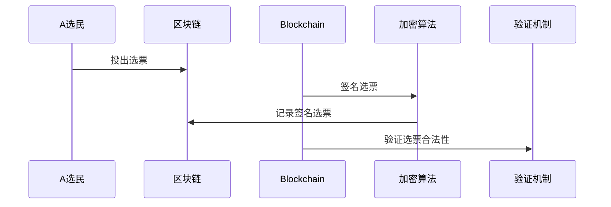
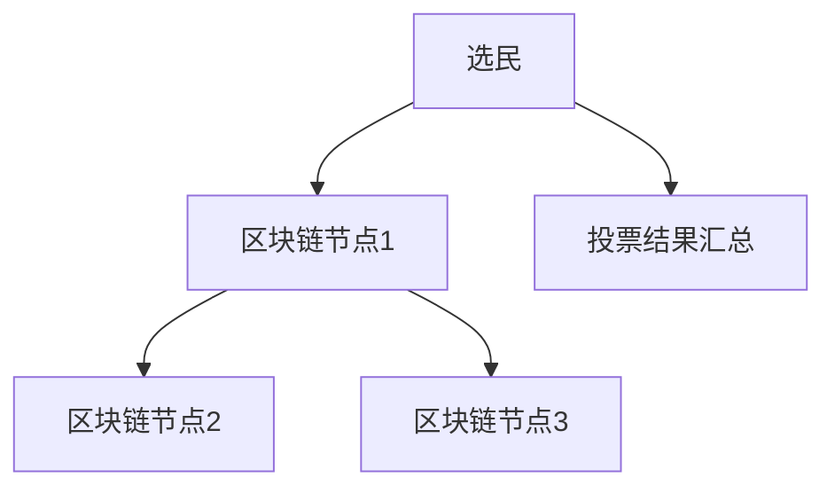
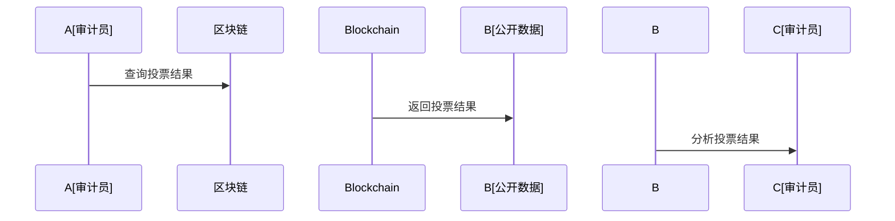
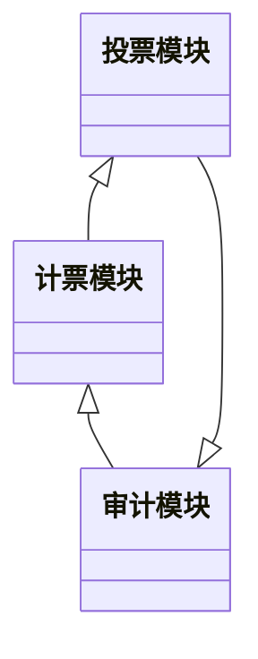
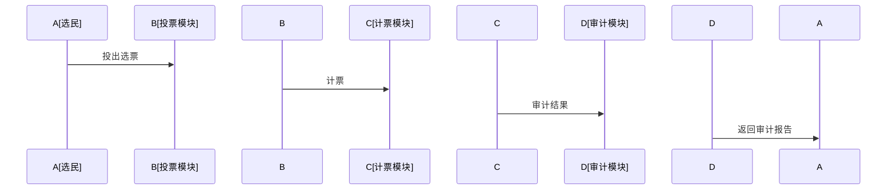

                 

# 区块链在数字选举中的应用：确保投票过程的透明和安全

## 关键词
- 区块链
- 数字选举
- 透明性
- 安全性
- 投票

## 摘要
本文将深入探讨区块链技术在数字选举中的应用，以提升投票过程的透明度和安全性。我们将从核心概念入手，逐步分析区块链如何解决数字选举中的现有问题，并通过实际案例和研究，展示其应用潜力。本文旨在为读者提供一个全面的技术视角，以便理解区块链在选举领域的重要性和未来发展方向。

## 引言

### 区块链的基本概念

区块链是一种分布式数据库技术，通过多个参与节点共同维护一个不断增长的、不可篡改的数据记录集合。每个记录称为“区块”，区块之间通过加密哈希链接形成一个链条，从而确保数据的完整性和安全性。区块链的去中心化特性使其在许多领域具有潜在的应用价值，包括金融、供应链管理和数字选举。

### 数字选举的挑战

数字选举是现代技术的产物，旨在通过互联网实现投票过程的电子化和自动化。然而，这一过程面临诸多挑战，如：

- **透明性**：传统投票过程中，投票结果容易被篡改或操纵。
- **安全性**：网络攻击和数据泄露可能导致投票结果的不真实。
- **可验证性**：选民需要确信他们的投票已被正确记录和统计。

### 区块链在数字选举中的应用

区块链技术因其独特特性，被认为是解决上述挑战的理想选择。通过加密算法和分布式账本，区块链能够提供以下优势：

- **透明性**：所有投票数据都在区块链上公开透明，便于第三方审计。
- **安全性**：区块链的加密特性确保数据不被篡改。
- **可验证性**：通过数字签名和加密验证，选民能够确信他们的投票已被记录。

## 核心概念与联系

### 区块链的构成要素

- **节点**：区块链网络中的参与者，负责维护和验证数据。
- **区块**：数据记录单元，包含一定数量的交易。
- **加密算法**：确保数据完整性和保密性。
- **分布式账本**：所有节点共享和同步的数据集合。

### 区块链在数字选举中的角色

- **投票记录**：选民通过数字签名投票，投票结果记录在区块链上。
- **去中心化投票系统**：无需中心化服务器，减少单点故障风险。
- **透明审计**：区块链上的所有交易都公开透明，便于第三方审计。

### 核心概念属性特征对比表格

| 特征 | 传统投票系统 | 区块链投票系统 |
| ---- | ------------ | -------------- |
| 透明性 | 不可验证 | 高透明性 |
| 安全性 | 易受攻击 | 高安全性 |
| 可验证性 | 无法验证 | 可验证 |

### ER实体关系图架构

```mermaid
erDiagram
  类--|{ 投票者 | 投票 | 选举结果 } |{
  投票者 ||--|| 投票 : 投票者可以投出多张选票
  投票 ||--|| 选举结果 : 投票结果用于统计选举结果
  }
```

## 区块链在数字选举中的应用

### 投票过程的加密与验证

区块链通过数字签名和加密算法，确保投票过程的隐私性和安全性。选民在投票时，使用私钥对选票进行签名，投票结果被记录在区块链上，并通过公钥验证其合法性。以下是一个简单的流程图：



### 去中心化投票系统

区块链的去中心化特性，使得投票系统不再依赖于中心化服务器，从而减少了单点故障的风险。每个节点都存储完整的区块链数据，任何节点的故障都不会影响整个系统的运行。以下是一个简单的架构图：



### 透明审计与结果验证

区块链上的所有交易都公开透明，便于第三方审计。选民和审计员可以随时查看投票结果，确保选举过程的公正性和透明度。以下是一个简单的流程图：



### 实际案例研究

1. **瑞士伯尔尼州选举**：
   瑞士伯尔尼州在2016年进行了首次基于区块链的选举试点，通过加密投票和透明审计，提高了选举的透明度和安全性。试点结果显示，区块链技术在选举中的应用具有巨大的潜力。

2. **马其顿全国大选**：
   2018年，马其顿进行了基于区块链的全国大选。虽然过程中出现了技术问题，但总体上，区块链技术在确保选举安全性和透明性方面取得了成功。

### 区块链技术的潜力与挑战

区块链技术在数字选举中的应用展示了其巨大的潜力，但也面临一些挑战：

- **技术成熟度**：区块链技术仍处于发展阶段，需要进一步优化和改进。
- **监管合规**：不同国家和地区的法律法规对区块链技术的要求不同，需要制定相应的监管政策。
- **用户接受度**：普通用户对区块链技术的了解和接受程度较低，需要加强宣传和教育。

## 技术实现与系统设计

### 技术实现

1. **区块链平台选择**：
   选择适合的区块链平台，如Ethereum、Hyperledger Fabric等，根据具体需求进行定制化开发。

2. **加密算法**：
   采用强加密算法，如SHA-256、ECDSA等，确保数据的安全性和隐私性。

3. **去中心化投票系统**：
   设计去中心化投票系统，确保投票过程的隐私性和安全性。

### 系统设计

1. **系统功能设计**：
   设计包括投票、计票、审计等功能的模块，确保系统的高效和可靠。

2. **系统架构设计**：
   设计分布式架构，确保系统的可扩展性和容错性。

3. **系统接口设计**：
   设计用户界面和API接口，便于用户和开发者使用。

4. **系统交互**：
   设计投票、计票和审计等过程的交互流程，确保系统的协同工作。

### Mermaid 图形表示

以下是一个简单的Mermaid类图，展示系统功能模块：



以下是一个简单的Mermaid序列图，展示投票、计票和审计的交互流程：



## 项目实战

### 环境安装

1. 安装Ethereum区块链节点：
   ```bash
   $ wget https://github.com/ethereum/go-ethereum/releases/download/v1.10.25/go-ethereum-linux-amd64-1.10.25.tar.gz
   $ tar xvf go-ethereum-linux-amd64-1.10.25.tar.gz
   $ cd go-ethereum
   $ ./geth --datadir "./data" init "./genesis.json"
   ```

2. 启动Ethereum节点：
   ```bash
   $ ./geth --datadir "./data" --networkid 1337 --port 30303 --nodiscover --mine --minerthreads 1
   ```

### 系统核心实现源代码

```python
# voter.py
import json
from web3 import Web3

# 连接到本地Ethereum节点
w3 = Web3(Web3.HTTPProvider('http://127.0.0.1:30303'))

# 定义智能合约接口
contract_address = w3.eth.contract(address='0x...')

def vote(candidate):
    # 创建交易
    tx_hash = contract_address.functions.vote(candidate).transact({'from': w3.eth.defaultAccount, 'gas': 200000})
    # 等待交易确认
    tx_receipt = w3.eth.waitForTransactionReceipt(tx_hash)
    print("Vote successful:", tx_receipt)
```

```solidity
// Voting.sol
pragma solidity ^0.8.0;

contract Voting {
    mapping(address => bool) private hasVoted;
    mapping(address => string) private votes;

    function vote(string calldata candidate) external {
        require(!hasVoted[msg.sender], "Already voted");
        votes[msg.sender] = candidate;
        hasVoted[msg.sender] = true;
        emit VoteEvent(msg.sender, candidate);
    }

    function getVote(address voter) public view returns (string memory) {
        return votes[voter];
    }

    event VoteEvent(address voter, string candidate);
}
```

### 代码应用解读与分析

代码实现了一个简单的投票合约，其中：

- `vote` 函数用于投票，通过调用该函数，选民可以将其选票记录在区块链上。
- `getVote` 函数用于查询某个选民的投票结果。
- `hasVoted` 和 `votes` 是两个存储选民投票状态的映射。

通过Web3.py库，Python代码可以与Ethereum节点进行交互，实现投票和查询功能。

### 实际案例分析与详细讲解剖析

#### 案例一：瑞士伯尔尼州选举

瑞士伯尔尼州在2016年进行了基于区块链的选举试点。选民通过互联网进行投票，投票结果记录在区块链上，并通过加密验证其合法性。审计员可以随时查询区块链上的投票数据，确保选举的公正性和透明度。

**分析**：

- **透明性**：通过区块链技术，选举结果公开透明，便于第三方审计。
- **安全性**：区块链的加密特性确保投票数据不被篡改。
- **可验证性**：选民可以通过区块链上的数字签名验证其投票已被记录。

#### 案例二：马其顿全国大选

2018年，马其顿进行了基于区块链的全国大选。虽然过程中出现了技术问题，如网络延迟和高负载导致系统瘫痪，但总体上，区块链技术在确保选举安全性和透明性方面取得了成功。

**分析**：

- **技术成熟度**：虽然区块链技术仍在发展，但其在选举中的应用已展示出潜力。
- **监管合规**：马其顿政府需要进一步制定监管政策，确保区块链技术的合法合规。
- **用户接受度**：提高公众对区块链技术的了解和接受程度，是未来推广的关键。

## 最佳实践 Tips

1. **确保隐私性**：在区块链投票系统中，使用加密算法确保选民隐私。
2. **优化系统性能**：提高区块链网络的处理能力，减少投票过程的延迟。
3. **加强监管合规**：制定相应的监管政策，确保区块链技术在选举中的合法合规。
4. **用户教育**：加强公众对区块链技术的了解和接受，提高用户信任度。

## 小结

区块链技术在数字选举中的应用，为提升投票过程的透明度和安全性提供了新的可能性。通过实际案例和研究，我们看到了区块链技术在这一领域的巨大潜力。然而，技术成熟度、监管合规和用户接受度仍是需要解决的问题。未来，随着区块链技术的不断发展和完善，其在数字选举中的应用将越来越广泛。

## 注意事项

1. **网络安全**：确保区块链网络的安全，防止恶意攻击和数据泄露。
2. **系统维护**：定期检查和维护区块链节点，确保系统稳定运行。
3. **用户隐私**：在设计和实施区块链投票系统时，要确保选民隐私得到保护。

## 拓展阅读

1. **区块链技术基础**：
   - 《区块链：从数字货币到分布式账本》
   - 《区块链：技术原理与应用实践》
2. **数字选举与区块链**：
   - 《区块链在数字选举中的应用：透明性与安全性》
   - 《区块链选举系统设计与实现》
3. **最佳实践与案例研究**：
   - 《区块链选举实践：瑞士伯尔尼州选举案例》
   - 《马其顿全国大选：区块链技术的成功与挑战》

## 作者信息

作者：AI天才研究院/AI Genius Institute & 禅与计算机程序设计艺术 /Zen And The Art of Computer Programming

