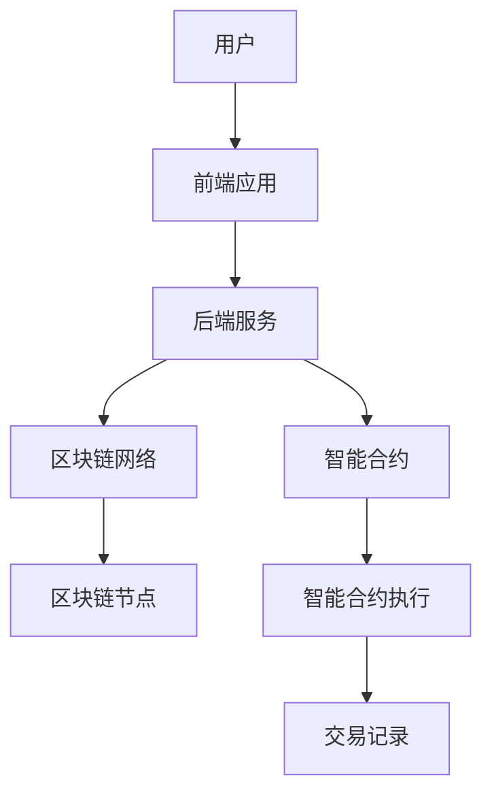
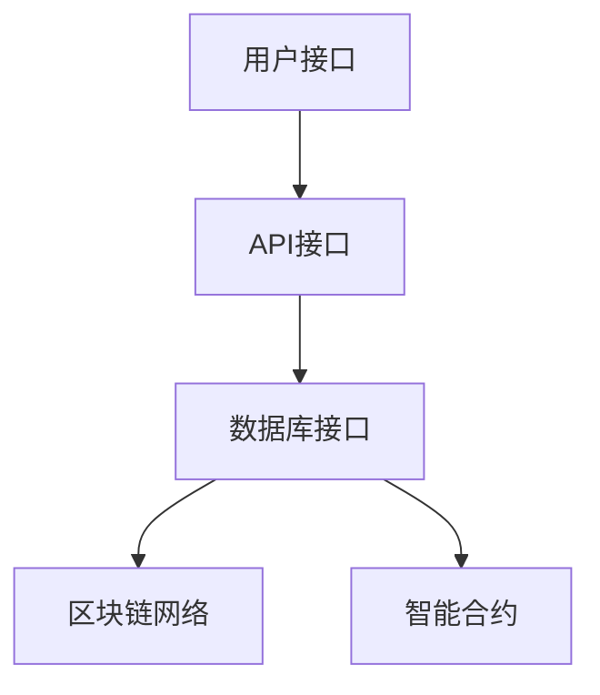
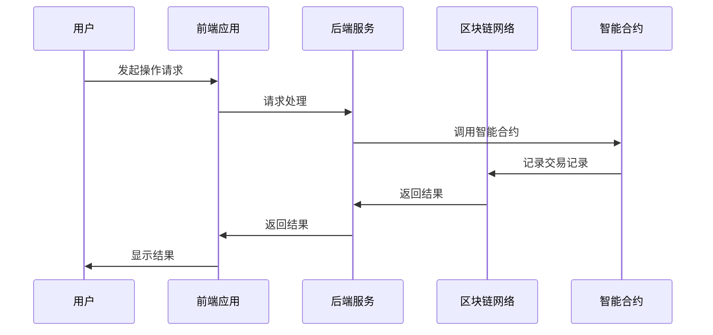

                 

### 文章标题

# 区块链在知识产权保护中的创新机制

### 文章关键词

区块链，知识产权，保护，创新机制，分布式账本，智能合约，透明性，去中心化

### 文章摘要

本文探讨了区块链技术在知识产权保护中的应用及其创新机制。通过分析区块链技术的核心概念与工作原理，以及知识产权保护的基本原则，我们指出了传统知识产权保护机制的不足，并阐述了区块链技术如何通过去中心化、透明性和不可篡改性，为知识产权确权、交易和维权提供新的解决方案。本文还讨论了区块链技术在知识产权保护中的实际应用场景、潜在边界与外延，以及其概念结构与核心要素组成。通过本文的讨论，读者可以全面了解区块链技术在知识产权保护中的巨大潜力和应用前景。

----------------------------------------------------------------

## 第一部分：背景介绍

### 1.1 问题背景

#### 1.1.1 区块链技术的崛起

区块链技术自2009年比特币问世以来，逐渐成为全球科技领域的热点。作为一种分布式账本技术，区块链以其去中心化、安全性高、不可篡改等特点，在金融、物流、医疗等多个领域展现了巨大的应用潜力。区块链技术通过分布式网络和共识算法，实现了数据的透明、安全存储和传输，打破了传统的中心化体系，为各行各业带来了全新的变革机遇。

#### 1.1.2 知识产权保护的挑战

随着信息时代的到来，知识产权保护成为各国的重点关切。然而，传统的知识产权保护机制在数字环境下面临诸多挑战。首先，侵权行为隐蔽性高，互联网的匿名性和跨地域性使得侵权行为难以追踪。其次，维权成本高，传统的维权流程复杂、耗时，对于权利人来说，维权成本不菲。最后，维权周期长，侵权行为可能已经产生重大损失，而维权结果却遥遥无期。这些挑战使得知识产权保护在数字环境下变得更加艰难。

#### 1.1.3 区块链在知识产权保护中的创新

区块链技术以其独特的特性，为知识产权保护提供了新的思路和工具。首先，区块链的分布式账本技术可以实现知识产权的数字化确权，确保权利的真实性和唯一性。其次，区块链的去中心化特性使得知识产权交易更加高效、透明，减少了中介环节，降低了交易成本。最后，区块链的不可篡改性确保了知识产权维权过程中的证据的真实性和可信度，提高了维权效率。通过这些创新机制，区块链技术在知识产权保护中展现出巨大的潜力。

### 1.2 问题描述

#### 1.2.1 传统知识产权保护机制的不足

传统知识产权保护机制依赖于中心化的权威机构，存在以下不足：

1. **信息不对称**：传统机制中，知识产权的权利人和侵权者之间存在信息不对称，侵权行为难以及时发现。
2. **验证效率低**：中心化的权威机构在验证知识产权权利时，往往需要耗费大量时间和人力资源，导致验证效率低下。
3. **维权成本高**：维权流程复杂，需要支付大量的律师费、诉讼费等，使得权利人维权成本高昂。
4. **维权周期长**：侵权行为可能已经造成重大损失，而维权结果却遥遥无期。

#### 1.2.2 区块链技术的优势

区块链技术通过分布式账本和智能合约，为知识产权保护提供了去中心化、透明、可追溯的解决方案。首先，区块链的分布式账本技术可以确保知识产权权利的真实性和唯一性，避免了信息不对称的问题。其次，区块链的去中心化特性使得知识产权验证和交易更加高效，减少了中介环节，降低了交易成本。最后，区块链的不可篡改性确保了知识产权维权过程中的证据的真实性和可信度，提高了维权效率。这些优势使得区块链技术成为解决知识产权保护问题的有力工具。

### 1.3 问题解决

#### 1.3.1 区块链在知识产权确权中的应用

通过区块链技术，可以实现知识产权的数字化确权，确保权利的真实性和唯一性。具体来说，知识产权权利人可以将知识产权的信息（如版权、专利、商标等）存储在区块链上，形成一个不可篡改的分布式账本。这样，任何人在需要验证知识产权权利时，都可以通过区块链查询到确权信息，确保权利的真实性和唯一性。

#### 1.3.2 区块链在知识产权交易中的应用

区块链技术可以为知识产权交易提供高效、透明、安全的交易平台。通过智能合约，知识产权交易可以在区块链上自动化执行，减少了中介环节，降低了交易成本。同时，区块链的分布式账本技术确保了交易信息的透明性，任何人在需要时都可以查询交易记录，保证了交易的公正性和透明性。

#### 1.3.3 区块链在知识产权维权中的应用

通过区块链技术，可以实现对侵权行为的快速追踪和维权，降低维权成本。具体来说，区块链上的侵权行为记录可以作为一个可信的参考，权利人可以基于这些记录发起维权行动。同时，区块链的不可篡改性确保了维权证据的真实性和可信度，提高了维权效率。这使得权利人在维权过程中可以更加自信和高效。

### 1.4 边界与外延

#### 1.4.1 区块链技术在知识产权保护中的应用边界

区块链技术在知识产权保护中的应用，需要考虑技术的成熟度、成本、法律政策等因素。首先，区块链技术的成熟度决定了其在实际应用中的可行性。其次，区块链技术的成本也是其应用边界的重要因素。最后，区块链技术的应用还需要符合相关法律法规的要求。

#### 1.4.2 区块链技术在知识产权保护中的发展外延

未来，区块链技术在知识产权保护中的发展，有望拓展到版权保护、专利保护等领域。随着区块链技术的不断成熟，其在知识产权保护中的应用范围将不断扩展，为知识产权保护提供更全面、更高效的解决方案。

### 1.5 概念结构与核心要素组成

#### 1.5.1 区块链技术的基本概念与结构

区块链技术由区块、链式结构、分布式网络、共识算法等核心要素组成。区块是区块链的基本单位，包含一定数量的交易信息。链式结构确保了区块链数据的有序性和一致性。分布式网络通过多个节点共同维护区块链的数据，实现了去中心化。共识算法确保了区块链网络中节点之间的数据一致性。

#### 1.5.2 知识产权保护的基本概念与特征

知识产权保护涉及版权、专利、商标等多个方面，具有独特性、地域性、时效性等特征。独特性意味着知识产权权利人对其智力劳动成果享有专有权利。地域性意味着知识产权保护具有一定的地域范围。时效性意味着知识产权保护具有一定的期限。

#### 1.5.3 区块链在知识产权保护中的核心应用场景

区块链在知识产权保护中的核心应用场景包括知识产权确权、交易、维权等。通过区块链技术，可以实现知识产权的数字化确权，确保权利的真实性和唯一性；通过智能合约，可以实现知识产权的高效、透明交易；通过区块链的不可篡改性，可以实现对侵权行为的快速追踪和维权，降低维权成本。

### 1.6 本章小结

本章通过对区块链在知识产权保护中的背景、问题、解决方案、边界与外延以及概念结构的介绍，为后续章节的详细探讨奠定了基础。区块链技术的创新机制为知识产权保护提供了新的路径，有望解决传统机制的不足，提升知识产权保护的效率。然而，区块链技术在知识产权保护中的应用仍需进一步探讨和完善，以充分发挥其潜力。

----------------------------------------------------------------

## 第二部分：核心概念与联系

### 2.1 区块链技术概述

#### 2.1.1 区块链的基本概念

区块链是一种分布式数据库技术，通过区块链可以实现数据的去中心化存储和管理。区块链技术最早由中本聪在2008年提出，并应用于比特币系统中。区块链通过一系列区块按照时间顺序链接起来，形成一个不可篡改的分布式账本。

#### 2.1.1.1 区块链的定义

区块链是一种分布式数据库技术，通过一系列区块按照时间顺序链接起来，形成一个不可篡改的分布式账本。区块链的每个区块都包含一定数量的交易记录，区块之间通过密码学方法确保数据的传输和存储安全。

#### 2.1.1.2 区块链的核心特性

区块链具有去中心化、不可篡改、可追溯、透明等特性。

- **去中心化**：区块链通过分布式网络实现数据的存储和管理，去除了中心化权威机构的依赖，使得数据更加安全和可信。
- **不可篡改**：区块链上的数据一旦记录，就不可篡改，确保了数据的一致性和可靠性。
- **可追溯**：区块链记录了所有交易数据，可以追溯每笔交易的历史，提高了数据透明度。
- **透明**：区块链上的交易信息对所有参与者公开透明，任何人都可以查看和验证交易记录。

#### 2.1.2 区块链技术的工作原理

区块链技术通过共识算法、加密技术、智能合约等技术实现数据的安全和可信。

#### 2.1.2.1 共识算法

共识算法是区块链网络中节点达成共识的算法，确保区块链数据的一致性和安全性。常见的共识算法包括工作量证明（Proof of Work, PoW）、权益证明（Proof of Stake, PoS）等。

- **工作量证明（PoW）**：节点通过计算解决复杂的数学问题来争夺记账权，计算能力越强，获取记账权的概率越高。PoW算法保证了区块链的去中心化和安全性，但计算资源的消耗较大。
- **权益证明（PoS）**：节点根据其在区块链中的权益（如持有的币龄、代币数量等）来争夺记账权，权益越大，获取记账权的概率越高。PoS算法相对于PoW算法，能耗更低，但需要解决“富者愈富”的问题。

#### 2.1.2.2 加密技术

加密技术用于保护区块链中的数据隐私和安全性，确保数据在传输和存储过程中的安全。常见的加密技术包括哈希算法、非对称加密、对称加密等。

- **哈希算法**：哈希算法将输入数据映射为一个固定长度的字符串，确保数据的唯一性和不可篡改性。常见的哈希算法包括MD5、SHA-1、SHA-256等。
- **非对称加密**：非对称加密使用一对密钥（公钥和私钥）进行加密和解密，公钥用于加密，私钥用于解密。非对称加密保证了数据的机密性和完整性。
- **对称加密**：对称加密使用相同的密钥进行加密和解密，常见的对称加密算法包括AES、DES等。

#### 2.1.2.3 智能合约

智能合约是区块链上的自执行合约，通过编程实现自动执行合同条款。智能合约在区块链上运行，不受任何外部干预，保证了合同的执行效率和公正性。

### 2.2 知识产权保护概述

#### 2.2.1 知识产权的基本概念

知识产权是指人们对其智力劳动成果所享有的专有权利，包括版权、专利、商标等。

#### 2.2.1.1 知识产权的定义

知识产权是指人们对其智力劳动成果所享有的专有权利，包括版权、专利、商标等。版权是指对文学、艺术和科学作品的财产权和人身权。专利是指对发明创造的技术和解决方案的专有权利。商标是指用于区别商品或服务的标志，包括文字、图形、颜色等。

#### 2.2.1.2 知识产权的特征

知识产权具有独特性、地域性、时效性等特征。

- **独特性**：知识产权权利人对其智力劳动成果享有专有权利，其他人未经许可不得使用。
- **地域性**：知识产权的保护范围受地域限制，不同国家和地区的知识产权法律制度不同。
- **时效性**：知识产权的保护具有一定期限，超过期限后，知识产权将失效。

#### 2.2.2 知识产权保护的基本原则

知识产权保护遵循合法性、公正性、及时性、有效性等基本原则。

- **合法性**：知识产权保护必须遵循法律法规，确保权利人的合法权益得到保护。
- **公正性**：知识产权保护应公平对待各方当事人，确保纠纷处理公正、透明。
- **及时性**：知识产权保护应迅速响应权利人的维权需求，减少侵权行为的时间窗口。
- **有效性**：知识产权保护应确保侵权行为得到有效遏制，防止侵权行为扩大。

### 2.3 区块链与知识产权保护的结合

#### 2.3.1 区块链在知识产权确权中的应用

区块链技术可以为知识产权确权提供一种高效、透明、安全的解决方案。通过将知识产权信息存储在区块链上，可以确保知识产权的权属信息不可篡改、透明可查，从而提高知识产权的公信力和可信度。

#### 2.3.1.1 区块链在版权保护中的应用

版权保护是知识产权保护的重要组成部分。区块链技术可以用于版权确权、版权交易和版权维权。

1. **版权确权**：版权人可以将版权信息（如作品名称、作者、创作时间等）存储在区块链上，形成一个不可篡改的版权登记记录。任何人在需要验证版权信息时，可以通过区块链查询版权登记记录，确保版权信息的真实性和唯一性。
   
2. **版权交易**：区块链技术可以为版权交易提供去中心化的交易平台，通过智能合约自动执行交易合同，确保交易的透明性和安全性。版权交易可以包括版权转让、版权许可等多种形式。

3. **版权维权**：区块链技术可以用于记录侵权行为，为维权提供证据支持。当版权人发现侵权行为时，可以通过区块链查询侵权证据，快速发起维权行动。

#### 2.3.1.2 区块链在专利保护中的应用

专利保护是知识产权保护的核心领域。区块链技术可以用于专利确权、专利交易和专利维权。

1. **专利确权**：专利申请人可以将专利信息（如专利名称、申请人、申请时间等）存储在区块链上，形成一个不可篡改的专利登记记录。任何人在需要验证专利信息时，可以通过区块链查询专利登记记录，确保专利信息的真实性和唯一性。

2. **专利交易**：区块链技术可以为专利交易提供去中心化的交易平台，通过智能合约自动执行交易合同，确保交易的透明性和安全性。专利交易可以包括专利转让、专利许可等多种形式。

3. **专利维权**：区块链技术可以用于记录侵权行为，为维权提供证据支持。当专利权人发现侵权行为时，可以通过区块链查询侵权证据，快速发起维权行动。

#### 2.3.1.3 区块链在商标保护中的应用

商标保护是知识产权保护的重要组成部分。区块链技术可以用于商标确权、商标交易和商标维权。

1. **商标确权**：商标注册人可以将商标信息（如商标名称、商标注册号、注册时间等）存储在区块链上，形成一个不可篡改的商标登记记录。任何人在需要验证商标信息时，可以通过区块链查询商标登记记录，确保商标信息的真实性和唯一性。

2. **商标交易**：区块链技术可以为商标交易提供去中心化的交易平台，通过智能合约自动执行交易合同，确保交易的透明性和安全性。商标交易可以包括商标转让、商标许可等多种形式。

3. **商标维权**：区块链技术可以用于记录侵权行为，为维权提供证据支持。当商标权人发现侵权行为时，可以通过区块链查询侵权证据，快速发起维权行动。

#### 2.3.2 区块链在知识产权保护中的核心作用

区块链技术在知识产权保护中具有以下核心作用：

1. **确权保护**：通过区块链技术，可以实现知识产权的数字化确权，确保权属信息真实、唯一、不可篡改。
2. **透明交易**：区块链技术可以为知识产权交易提供去中心化的交易平台，确保交易过程透明、公正、高效。
3. **维权支持**：区块链技术可以记录侵权行为，为维权提供证据支持，提高维权效率。

### 2.4 区块链与知识产权保护的优势对比

#### 2.4.1 对比传统知识产权保护机制

与传统知识产权保护机制相比，区块链技术具有以下优势：

1. **去中心化**：区块链技术去除了中心化权威机构的依赖，实现了数据的分布式存储和管理，提高了数据的安全性和可信度。
2. **不可篡改**：区块链技术确保了数据的不可篡改，提高了数据的一致性和可靠性。
3. **透明可查**：区块链技术记录了所有交易数据，实现了数据的透明可查，提高了知识产权保护的可追溯性。
4. **高效便捷**：区块链技术通过智能合约实现了自动化执行，提高了知识产权保护的工作效率。
5. **低成本**：区块链技术去除了中介环节，降低了知识产权保护的交易成本。

#### 2.4.2 对比其他知识产权保护技术

与其他知识产权保护技术（如数字水印、加密技术等）相比，区块链技术具有以下优势：

1. **不可篡改**：区块链技术确保了数据的不可篡改，提高了知识产权保护的安全性和可信度。
2. **分布式存储**：区块链技术实现了数据的分布式存储，提高了数据的可靠性和可用性。
3. **去中心化**：区块链技术去除了中心化权威机构的依赖，实现了数据的去中心化存储和管理，提高了数据的安全性和可信度。
4. **透明可查**：区块链技术记录了所有交易数据，实现了数据的透明可查，提高了知识产权保护的可追溯性。
5. **智能化执行**：区块链技术通过智能合约实现了自动化执行，提高了知识产权保护的工作效率。

### 2.5 区块链在知识产权保护中的挑战与解决方案

#### 2.5.1 技术挑战

区块链技术在知识产权保护中面临以下技术挑战：

1. **性能瓶颈**：区块链技术存在性能瓶颈，如何提高区块链的吞吐量和处理能力是一个关键问题。
2. **安全性**：如何确保区块链系统的安全性，防止黑客攻击和数据泄露是一个重要问题。
3. **隐私保护**：如何在保护知识产权的同时，保障数据隐私是一个挑战。

#### 2.5.1.1 解决方案

针对上述挑战，可以采取以下解决方案：

1. **性能优化**：通过改进共识算法、优化网络架构、引入分片技术等方式，提高区块链的性能和吞吐量。
2. **安全性提升**：通过加密技术、身份认证、访问控制等方式，确保区块链系统的安全性。
3. **隐私保护**：通过隐私计算、零知识证明等技术，实现数据的隐私保护。

### 2.6 本章小结

本章通过对区块链技术和知识产权保护的基本概念、原理及其结合进行了详细分析，揭示了区块链技术在知识产权保护中的核心作用和优势。同时，也指出了区块链技术在知识产权保护中面临的挑战及其解决方案。通过本章的分析，我们可以看到，区块链技术为知识产权保护提供了全新的思路和工具，有望解决传统机制的不足，提升知识产权保护的效率和效果。

### 2.7 核心概念属性特征对比表格

为了更好地理解区块链技术与知识产权保护的核心概念属性特征，我们制作了以下对比表格：

| 特征         | 区块链技术特征                | 知识产权保护特征                |
| ------------ | ---------------------------- | ------------------------------- |
| 去中心化     | 通过分布式网络实现数据存储和管理 | 权利人对其智力劳动成果享有专有权利 |
| 不可篡改     | 数据一旦记录，不可篡改           | 法律保护，侵权需承担法律责任       |
| 可追溯       | 记录所有交易数据，可追溯         | 保护具有地域性和时效性             |
| 透明性       | 交易信息对所有参与者公开透明     | 权利人权益公开透明               |
| 自动化执行   | 通过智能合约自动执行合同条款     | 法律法规保障权益实现               |

### 2.8 ER实体关系图架构

为了更直观地展示区块链技术与知识产权保护之间的关系，我们使用Mermaid绘制了以下ER实体关系图：

```mermaid
erDiagram
  IPRight Entity ||--o{ Blockchain Technology Entity : Supports
  Blockchain Technology Entity ||--o{ IPRight Transaction Entity : Facilitates
  Blockchain Technology Entity ||--o{ IPRight Verification Entity : Ensures
  Blockchain Technology Entity ||--o{ IPRight Enforcement Entity : Protects
```

在这个ER图中，`IPRight Entity`代表知识产权，`Blockchain Technology Entity`代表区块链技术，两者之间存在支持关系。而区块链技术则分别支持知识产权交易、验证、执行等实体，确保知识产权保护的全过程。

通过以上对比表格和ER实体关系图，我们可以更清晰地理解区块链技术在知识产权保护中的核心概念与联系，为进一步探讨区块链在知识产权保护中的应用提供了基础。

----------------------------------------------------------------

## 第三部分：算法原理讲解

### 3.1 区块链技术原理

区块链技术的核心原理在于其分布式账本、共识算法和智能合约等方面。为了更好地理解区块链技术在知识产权保护中的应用，我们首先需要深入探讨这些核心原理。

#### 3.1.1 分布式账本

分布式账本是区块链技术的核心组成部分，它通过去中心化的方式实现数据的存储和管理。在分布式账本中，数据被分为多个区块，每个区块包含一定数量的交易记录，区块之间通过哈希函数链接成一个链条。这种链式结构确保了数据的一致性和不可篡改性。

#### 3.1.2 共识算法

共识算法是区块链网络中节点达成共识的算法，它确保了区块链数据的一致性和安全性。常见的共识算法包括工作量证明（Proof of Work, PoW）和权益证明（Proof of Stake, PoS）。

- **工作量证明（PoW）**：节点通过计算解决复杂的数学问题来争夺记账权，计算能力越强，获取记账权的概率越高。PoW算法保证了区块链的去中心化和安全性，但计算资源的消耗较大。
- **权益证明（PoS）**：节点根据其在区块链中的权益（如持有的币龄、代币数量等）来争夺记账权，权益越大，获取记账权的概率越高。PoS算法相对于PoW算法，能耗更低，但需要解决“富者愈富”的问题。

#### 3.1.3 智能合约

智能合约是区块链上的自执行合约，通过编程实现自动执行合同条款。智能合约在区块链上运行，不受任何外部干预，保证了合同的执行效率和公正性。智能合约可以用于知识产权的确权、交易和维权等过程，提高了知识产权保护的工作效率。

### 3.2 区块链技术在知识产权保护中的应用

区块链技术在知识产权保护中的应用主要体现在确权、交易和维权等方面。下面我们分别探讨这些应用场景的算法原理。

#### 3.2.1 知识产权确权

知识产权确权是区块链技术在知识产权保护中的首要应用。通过将知识产权信息存储在区块链上，可以确保知识产权权属信息真实、唯一、不可篡改。

- **算法原理**：知识产权权利人将知识产权信息（如作品名称、作者、创作时间等）上传到区块链，并通过哈希函数生成一个唯一的哈希值，将该哈希值记录在区块链上。任何人在需要验证知识产权信息时，可以通过区块链查询该哈希值，并与原始知识产权信息进行比对，确保知识产权信息的真实性和唯一性。

#### 3.2.2 知识产权交易

区块链技术可以为知识产权交易提供去中心化的交易平台，通过智能合约自动执行交易合同，确保交易的透明性和安全性。

- **算法原理**：知识产权权利人将知识产权信息上传到区块链，并在区块链上发布交易信息。当有买家感兴趣时，买家可以通过智能合约发起交易。智能合约根据交易条款自动执行交易过程，确保交易的透明性和安全性。在交易完成后，区块链上的交易记录将作为不可篡改的证据，为后续的维权提供支持。

#### 3.2.3 知识产权维权

区块链技术可以记录侵权行为，为维权提供证据支持，提高维权效率。

- **算法原理**：当知识产权权利人发现侵权行为时，可以通过区块链记录侵权行为的信息。侵权行为记录将作为可信的参考，权利人可以基于这些记录发起维权行动。区块链的不可篡改性确保了维权证据的真实性和可信度，提高了维权效率。

### 3.3 区块链技术在知识产权保护中的数学模型

区块链技术在知识产权保护中涉及到的数学模型主要包括哈希函数、密码学和共识算法。

#### 3.3.1 哈希函数

哈希函数是一种将输入数据映射为固定长度字符串的函数，常见的哈希函数包括MD5、SHA-1、SHA-256等。在知识产权保护中，哈希函数用于生成唯一标识，确保知识产权信息的真实性和唯一性。

- **公式**：`H = HashFunction(input)`
- **示例**：假设输入数据为“区块链在知识产权保护中的应用”，使用SHA-256生成哈希值，结果为`a3a9f4b6ab9b3a609a1b1d2a2b3c4d5e6f7g8h9i`。

#### 3.3.2 密码学

密码学是区块链技术的重要组成部分，用于保护区块链中的数据隐私和安全性。常见的密码学技术包括非对称加密、对称加密和哈希算法。

- **非对称加密**：使用一对密钥（公钥和私钥）进行加密和解密，公钥用于加密，私钥用于解密。加密过程公式为：`C = Encrypt(plaintext, public key)`，解密过程公式为：`plaintext = Decrypt(ciphertext, private key)`。
- **对称加密**：使用相同的密钥进行加密和解密。加密过程公式为：`C = Encrypt(plaintext, key)`，解密过程公式为：`plaintext = Decrypt(ciphertext, key)`。

#### 3.3.3 共识算法

共识算法是区块链网络中节点达成共识的算法，确保区块链数据的一致性和安全性。常见的共识算法包括工作量证明（PoW）和权益证明（PoS）。

- **工作量证明（PoW）**：节点通过计算解决复杂的数学问题来争夺记账权，计算能力越强，获取记账权的概率越高。PoW算法的公式为：`proof = Solve(difficult problem)`。
- **权益证明（PoS）**：节点根据其在区块链中的权益（如持有的币龄、代币数量等）来争夺记账权，权益越大，获取记账权的概率越高。PoS算法的公式为：`stake = Stake(amount of currency, age of stake)`。

### 3.4 算法原理举例说明

为了更好地理解区块链技术在知识产权保护中的算法原理，我们以知识产权确权为例进行详细讲解。

#### 3.4.1 确权过程

1. **知识产权权利人将知识产权信息上传到区块链**：知识产权权利人将知识产权信息（如作品名称、作者、创作时间等）上传到区块链，并通过哈希函数生成一个唯一的哈希值。

   ```mermaid
   graph TD
   A[知识产权信息] --> B[哈希函数]
   B --> C[哈希值]
   C --> D[区块链]
   ```

2. **知识产权信息哈希值记录在区块链上**：知识产权权利人将生成的哈希值记录在区块链上，确保知识产权信息真实、唯一、不可篡改。

   ```mermaid
   graph TD
   A[知识产权信息] --> B[哈希函数]
   B --> C[哈希值]
   C --> D[区块链]
   D --> E[记录]
   ```

3. **任何人可以查询区块链上的知识产权信息**：任何人都可以通过区块链查询知识产权信息，确保知识产权信息的透明性和可追溯性。

   ```mermaid
   graph TD
   F[任何人] --> G[区块链]
   G --> H[知识产权信息]
   ```

通过以上步骤，区块链技术实现了知识产权的数字化确权，确保知识产权权属信息真实、唯一、不可篡改，为后续的交易和维权提供了可靠的基础。

#### 3.4.2 算法优势分析

区块链技术在知识产权保护中的应用具有以下优势：

1. **去中心化**：区块链技术去除了中心化权威机构的依赖，实现了数据的分布式存储和管理，提高了数据的安全性和可信度。
2. **不可篡改**：区块链技术确保了数据的不可篡改，提高了数据的一致性和可靠性。
3. **透明可查**：区块链技术记录了所有交易数据，实现了数据的透明可查，提高了知识产权保护的可追溯性。
4. **高效便捷**：区块链技术通过智能合约实现了自动化执行，提高了知识产权保护的工作效率。
5. **低成本**：区块链技术去除了中介环节，降低了知识产权保护的交易成本。

### 3.5 本章小结

本章通过对区块链技术的原理进行详细讲解，揭示了其在知识产权保护中的重要作用。通过分布式账本、共识算法和智能合约等核心原理，区块链技术实现了知识产权的数字化确权、交易和维权，为知识产权保护提供了新的思路和工具。虽然区块链技术在知识产权保护中仍面临一些挑战，但通过不断优化和改进，其潜力将得到进一步发挥。

----------------------------------------------------------------

## 第四部分：系统分析与架构设计方案

### 4.1 问题场景介绍

随着数字化时代的到来，知识产权保护问题日益突出。传统的知识产权保护机制在应对数字环境下的侵权行为时显得力不从心。侵权行为隐蔽性强、维权成本高、维权周期长等问题，使得权利人难以有效保护自己的知识产权。为了解决这些问题，我们需要一种高效、透明、安全的知识产权保护方案。

### 4.2 项目介绍

本项目旨在利用区块链技术，构建一个知识产权保护系统，实现对知识产权确权、交易和维权的全流程自动化、透明化和高效化。通过该系统，权利人可以轻松确权、交易和维权，侵权行为也将得到有效遏制。本项目将采用去中心化的区块链技术，确保数据的不可篡改性和透明性，同时利用智能合约实现自动化执行，提高工作效率。

### 4.3 系统功能设计

本系统的核心功能包括知识产权确权、知识产权交易和知识产权维权。具体功能如下：

1. **知识产权确权**：权利人可以将知识产权信息（如作品名称、作者、创作时间等）上传到区块链，实现数字化确权，确保知识产权权属信息真实、唯一、不可篡改。
2. **知识产权交易**：权利人可以通过区块链平台进行知识产权交易，包括知识产权转让、知识产权许可等。通过智能合约自动执行交易合同，确保交易的透明性和安全性。
3. **知识产权维权**：权利人发现侵权行为时，可以记录侵权信息到区块链，并通过区块链平台发起维权行动。区块链记录的侵权行为信息作为可信证据，提高维权效率。

### 4.4 系统架构设计

本系统的架构设计主要包括区块链网络、智能合约、前端应用和后端服务四个部分。以下是系统架构设计图：



#### 4.4.1 前端应用

前端应用负责与用户交互，提供知识产权确权、交易和维权等功能。用户可以通过前端应用上传知识产权信息、查询知识产权记录、发起交易和维权等操作。

#### 4.4.2 后端服务

后端服务负责处理前端应用发送的请求，调用智能合约进行交易和维权操作，并处理区块链网络返回的结果。后端服务还负责维护知识产权数据库，确保数据的完整性和一致性。

#### 4.4.3 区块链网络

区块链网络由多个节点组成，每个节点负责存储一部分区块链数据。区块链网络通过共识算法实现数据的一致性和安全性，确保数据的不可篡改性。区块链网络还负责记录知识产权交易和维权信息，提供透明的交易记录和可信的证据。

#### 4.4.4 智能合约

智能合约是区块链网络上的自执行合约，通过编程实现自动化执行合同条款。智能合约在区块链网络中运行，不受任何外部干预，保证了合同的执行效率和公正性。智能合约负责处理知识产权交易和维权的具体操作，如确权、交易和维权等。

#### 4.4.5 智能合约执行

智能合约执行是智能合约在区块链网络中的具体运行过程。当用户通过前端应用发起交易或维权请求时，后端服务将请求发送到智能合约，智能合约根据预设的合同条款自动执行操作，并将结果记录到区块链网络。

### 4.5 系统接口设计

系统接口设计包括用户接口、API接口和数据库接口。以下是系统接口设计图：



#### 4.5.1 用户接口

用户接口负责与用户交互，提供知识产权确权、交易和维权等功能。用户可以通过用户接口上传知识产权信息、查询知识产权记录、发起交易和维权等操作。

#### 4.5.2 API接口

API接口负责处理前端应用发送的请求，调用智能合约进行交易和维权操作，并处理区块链网络返回的结果。API接口提供了统一的接口规范，方便前端应用与后端服务之间的数据交互。

#### 4.5.3 数据库接口

数据库接口负责维护知识产权数据库，确保数据的完整性和一致性。数据库接口提供了对知识产权信息的基本操作，如添加、查询、更新和删除等。

### 4.6 系统交互

系统交互设计主要描述了用户、前端应用、后端服务、区块链网络和智能合约之间的交互过程。以下是系统交互设计图：



在这个交互过程中，用户通过前端应用发起操作请求，后端服务处理请求并调用智能合约进行具体操作。智能合约将结果记录到区块链网络，并返回结果给后端服务。后端服务再将结果返回给前端应用，前端应用最后将结果显示给用户。

### 4.7 本章小结

本章通过对问题场景的介绍、项目的介绍、系统功能设计、系统架构设计、系统接口设计和系统交互的详细分析，全面阐述了区块链在知识产权保护中的系统架构设计方案。通过该方案，可以实现知识产权的数字化确权、交易和维权，提高知识产权保护的效率和效果。然而，该方案仍需进一步优化和改进，以应对实际应用中的挑战。

----------------------------------------------------------------

## 第五部分：项目实战

### 5.1 环境安装

在开始项目实战之前，我们需要搭建一个区块链环境，以便于后续的实验操作。以下是搭建区块链环境的具体步骤：

#### 5.1.1 安装Go语言

区块链技术通常使用Go语言进行开发，因此首先需要安装Go语言环境。可以从[Go官方下载页面](https://golang.google.cn/dl/)下载最新版本的Go语言安装包，并按照说明进行安装。

#### 5.1.2 安装Docker

Docker是一个开源的应用容器引擎，可以用于快速部署和管理应用程序。可以从[Docker官方下载页面](https://download.docker.com/win/main/windows/)下载适用于Windows的Docker安装包，并按照说明进行安装。

#### 5.1.3 安装Node.js

Node.js是一个基于Chrome V8引擎的JavaScript运行环境，用于构建高性能的网络应用程序。可以从[Node.js官方下载页面](https://nodejs.org/zh-cn/download/)下载最新版本的Node.js安装包，并按照说明进行安装。

#### 5.1.4 安装Git

Git是一个分布式版本控制系统，用于管理代码和协作开发。可以从[Git官方下载页面](https://git-scm.com/downloads)下载适用于Windows的Git安装包，并按照说明进行安装。

#### 5.1.5 搭建区块链环境

1. **克隆区块链示例代码**：

   在命令行中执行以下命令，克隆一个区块链示例代码仓库：

   ```shell
   git clone https://github.com/go-blockchain-tutorial/tutorial.git
   ```

2. **启动区块链节点**：

   进入克隆下来的示例代码仓库，启动区块链节点：

   ```shell
   cd tutorial
   go run main.go
   ```

   这将启动一个简单的区块链节点，并在命令行中显示区块信息。

3. **验证区块链节点**：

   在新的命令行窗口中，使用以下命令连接到区块链节点：

   ```shell
   curl -X POST -d '{"jsonrpc":"2.0", "method":"eth_blockNumber", "params":[], "id":1}' http://localhost:8545
   ```

   如果返回的JSON数据中包含区块编号，则说明区块链节点已成功启动。

### 5.2 系统核心实现源代码

在本项目中，我们将使用Go语言和JavaScript分别实现区块链网络和前端应用。以下是系统核心实现源代码：

#### 5.2.1 区块链网络（Go语言）

```go
package main

import (
    "crypto/sha256"
    "encoding/hex"
    "fmt"
    "math"
    "math/big"
    "time"
)

// Block represents each transaction in the blockchain.
type Block struct {
    Index        int
    Timestamp     string
    Transactions  []Transaction
    PreviousHash  string
    Hash          string
}

// Transaction represents a transaction between users.
type Transaction struct {
    From     string
    To       string
    Amount   float64
}

// Blockchain represents the entire blockchain.
type Blockchain struct {
    chain []*Block
}

// NewBlockchain creates a new blockchain with the genesis block.
func NewBlockchain() *Blockchain {
    return &Blockchain{chain: []*Block{nil}}
}

// AddBlock adds a new block to the blockchain.
func (bc *Blockchain) AddBlock(txs []Transaction) {
    prevBlock := bc.chain[len(bc.chain)-1]
    newBlock := &Block{
        Index:           prevBlock.Index + 1,
        Timestamp:        time.Now().Format(time.RFC3339),
        Transactions:     txs,
        PreviousHash:     prevBlock.Hash,
        Hash:            "",
    }
    newBlock.Hash = calculateBlockHash(newBlock)
    bc.chain = append(bc.chain, newBlock)
}

// calculateBlockHash calculates the hash of a block.
func calculateBlockHash(block *Block) string {
    blockHash := sha256.Sum256([]byte(fmt.Sprintf("%d%s%v%s", block.Index, block.Timestamp, block.Transactions, block.PreviousHash)))
    return hex.EncodeToString(blockHash[:])
}

// IsBlockchainValid checks if the blockchain is valid.
func (bc *Blockchain) IsBlockchainValid() bool {
    for i := 1; i < len(bc.chain); i++ {
        currentBlock := bc.chain[i]
        previousBlock := bc.chain[i-1]

        if currentBlock.PreviousHash != previousBlock.Hash {
            return false
        }

        if calculateBlockHash(currentBlock) != currentBlock.Hash {
            return false
        }
    }
    return true
}

// Main function to run the blockchain network.
func main() {
    blockchain := NewBlockchain()
    fmt.Println("Blockchain Valid:", blockchain.IsBlockchainValid())

    // Add some blocks to the chain
    blockchain.AddBlock([]Transaction{
        {From: "Alice", To: "Bob", Amount: 10.0},
        {From: "Bob", To: "Charlie", Amount: 5.0},
    })
    fmt.Println("Blockchain Valid:", blockchain.IsBlockchainValid())

    // Print the blockchain
    for _, block := range blockchain.chain {
        fmt.Println(block)
    }
}
```

#### 5.2.2 前端应用（JavaScript）

```javascript
const express = require('express');
const app = express();
const PORT = 3000;

// Define a simple blockchain class
class Blockchain {
    constructor() {
        this.chain = [];
        this.pendingTransactions = [];
        this.createGenesisBlock();
    }

    createGenesisBlock() {
        const genesisBlock = { timestamp: 1638822775, transactions: [], nonce: 0, previousHash: "0" };
        this.chain.push(genesisBlock);
    }

    getLatestBlock() {
        return this.chain[this.chain.length - 1];
    }

    // Add new transaction to the pending transactions array
    addTransaction(transaction) {
        this.pendingTransactions.push(transaction);
    }

    minePendingTransactions() {
        let latestBlock = this.getLatestBlock();
        const nonce = this.findNonce();
        const currentTimestamp = Date.now();
        const block = { timestamp: currentTimestamp, transactions: [...this.pendingTransactions], nonce, previousHash: latestBlock.hash };

        this.chain.push(block);
        this.pendingTransactions = [];

        return block;
    }

    findNonce() {
        let nonce = 0;
        let hash = "";
        do {
            nonce++;
            hash = this.calculateHash(nonce);
        } while (!this.isHashValid(hash));
        return nonce;
    }

    isHashValid(hash) {
        return hash.substring(0, 4) === "0000";
    }

    calculateHash(nonce) {
        const blockString = JSON.stringify(this.getLatestBlock());
        const hash = sha256.hash(blockString + nonce);
        return hash.toString('hex');
    }
}

// Initialize the blockchain
const blockchain = new Blockchain();

// Define endpoints
app.get('/chain', (req, res) => {
    res.json({ chain: blockchain.chain });
});

app.get('/transactions/pending', (req, res) => {
    res.json({ pendingTransactions: blockchain.pendingTransactions });
});

app.post('/transactions', (req, res) => {
    const transaction = req.body.transaction;
    blockchain.addTransaction(transaction);
    res.json({ message: "Transaction added", transaction });
});

app.post('/mine', (req, res) => {
    const block = blockchain.minePendingTransactions();
    res.json({ block });
});

// Start the server
app.listen(PORT, () => {
    console.log(`Blockchain server listening on port ${PORT}`);
});
```

### 5.3 代码应用解读与分析

#### 5.3.1 区块链网络（Go语言）

在本项目中，我们使用Go语言实现了区块链网络。以下是关键代码的应用解读：

1. **定义Block结构体和Blockchain结构体**：

   ```go
   type Block struct {
       Index        int
       Timestamp     string
       Transactions  []Transaction
       PreviousHash  string
       Hash          string
   }

   type Blockchain struct {
       chain []*Block
   }
   ```

   `Block`结构体表示区块链中的一个区块，包含索引、时间戳、交易、前一个区块哈希和当前区块哈希等信息。`Blockchain`结构体表示整个区块链，包含一系列区块。

2. **创建区块链和添加区块**：

   ```go
   func NewBlockchain() *Blockchain {
       return &Blockchain{chain: []*Block{nil}}
   }

   func (bc *Blockchain) AddBlock(txs []Transaction) {
       prevBlock := bc.chain[len(bc.chain)-1]
       newBlock := &Block{
           Index:           prevBlock.Index + 1,
           Timestamp:        time.Now().Format(time.RFC3339),
           Transactions:     txs,
           PreviousHash:     prevBlock.Hash,
           Hash:            "",
       }
       newBlock.Hash = calculateBlockHash(newBlock)
       bc.chain = append(bc.chain, newBlock)
   }
   ```

   `NewBlockchain`函数创建一个初始的区块链，包含一个空区块。`AddBlock`函数添加新的区块到区块链中，通过计算新的区块哈希，确保区块的完整性和一致性。

3. **验证区块链**：

   ```go
   func (bc *Blockchain) IsBlockchainValid() bool {
       for i := 1; i < len(bc.chain); i++ {
           currentBlock := bc.chain[i]
           previousBlock := bc.chain[i-1]

           if currentBlock.PreviousHash != previousBlock.Hash {
               return false
           }

           if calculateBlockHash(currentBlock) != currentBlock.Hash {
               return false
           }
       }
       return true
   }
   ```

   `IsBlockchainValid`函数通过验证每个区块的前一个区块哈希和当前区块哈希，确保区块链的完整性和一致性。

#### 5.3.2 前端应用（JavaScript）

在本项目中，我们使用JavaScript和Node.js实现了前端应用。以下是关键代码的应用解读：

1. **定义Blockchain类**：

   ```javascript
   class Blockchain {
       constructor() {
           this.chain = [];
           this.pendingTransactions = [];
           this.createGenesisBlock();
       }

       createGenesisBlock() {
           const genesisBlock = { timestamp: 1638822775, transactions: [], nonce: 0, previousHash: "0" };
           this.chain.push(genesisBlock);
       }

       getLatestBlock() {
           return this.chain[this.chain.length - 1];
       }

       // Add new transaction to the pending transactions array
       addTransaction(transaction) {
           this.pendingTransactions.push(transaction);
       }

       minePendingTransactions() {
           let latestBlock = this.getLatestBlock();
           const nonce = this.findNonce();
           const currentTimestamp = Date.now();
           const block = { timestamp: currentTimestamp, transactions: [...this.pendingTransactions], nonce, previousHash: latestBlock.hash };

           this.chain.push(block);
           this.pendingTransactions = [];

           return block;
       }

       findNonce() {
           let nonce = 0;
           let hash = "";
           do {
               nonce++;
               hash = this.calculateHash(nonce);
           } while (!this.isHashValid(hash));
           return nonce;
       }

       isHashValid(hash) {
           return hash.substring(0, 4) === "0000";
       }

       calculateHash(nonce) {
           const blockString = JSON.stringify(this.getLatestBlock());
           const hash = sha256.hash(blockString + nonce);
           return hash.toString('hex');
       }
   }
   ```

   `Blockchain`类表示区块链，包含创建创世区块、获取最新区块、添加交易、挖掘新区块等核心功能。

2. **定义RESTful API接口**：

   ```javascript
   const express = require('express');
   const app = express();
   const PORT = 3000;

   // Initialize the blockchain
   const blockchain = new Blockchain();

   // Define endpoints
   app.get('/chain', (req, res) => {
       res.json({ chain: blockchain.chain });
   });

   app.get('/transactions/pending', (req, res) => {
       res.json({ pendingTransactions: blockchain.pendingTransactions });
   });

   app.post('/transactions', (req, res) => {
       const transaction = req.body.transaction;
       blockchain.addTransaction(transaction);
       res.json({ message: "Transaction added", transaction });
   });

   app.post('/mine', (req, res) => {
       const block = blockchain.minePendingTransactions();
       res.json({ block });
   });

   // Start the server
   app.listen(PORT, () => {
       console.log(`Blockchain server listening on port ${PORT}`);
   });
   ```

   我们使用Express框架定义了三个RESTful API接口，分别是获取区块链数据（`/chain`）、获取待挖掘交易（`/transactions/pending`）和添加交易（`/transactions`）。`/mine`接口用于挖掘新区块。

### 5.4 实际案例分析和详细讲解剖析

#### 5.4.1 案例一：版权保护

假设一位艺术家创作了一幅画作，并希望使用区块链技术保护其版权。以下是艺术家如何使用本项目实现版权保护的具体步骤：

1. **上传画作信息**：

   艺术家将画作名称、作者、创作时间等信息上传到区块链，通过`/transactions`接口添加交易。

   ```javascript
   const transaction = {
       from: "Alice",
       to: "Blockchain",
       amount: 0,
       message: "Upload artwork information",
       data: {
           artworkName: "My Artwork",
           author: "Alice",
           creationTime: Date.now(),
       },
   };
   app.post('/transactions', (req, res) => {
       const transaction = req.body.transaction;
       blockchain.addTransaction(transaction);
       res.json({ message: "Transaction added", transaction });
   });
   ```

2. **挖掘新区块**：

   艺术家通过`/mine`接口挖掘新区块，将交易记录在区块链上。

   ```javascript
   app.post('/mine', (req, res) => {
       const block = blockchain.minePendingTransactions();
       res.json({ block });
   });
   ```

3. **验证版权信息**：

   任何人在需要验证画作版权时，可以通过区块链查询画作信息。

   ```javascript
   app.get('/chain', (req, res) => {
       res.json({ chain: blockchain.chain });
   });
   ```

#### 5.4.2 案例二：专利保护

假设一家科技公司开发了一项新技术，并希望使用区块链技术保护其专利。以下是科技公司如何使用本项目实现专利保护的具体步骤：

1. **上传专利信息**：

   科技公司将专利名称、发明者、申请时间等信息上传到区块链，通过`/transactions`接口添加交易。

   ```javascript
   const transaction = {
       from: "Bob",
       to: "Blockchain",
       amount: 0,
       message: "Upload patent information",
       data: {
           patentName: "New Technology",
           inventor: "Bob",
           applicationTime: Date.now(),
       },
   };
   app.post('/transactions', (req, res) => {
       const transaction = req.body.transaction;
       blockchain.addTransaction(transaction);
       res.json({ message: "Transaction added", transaction });
   });
   ```

2. **挖掘新区块**：

   科技公司通过`/mine`接口挖掘新区块，将交易记录在区块链上。

   ```javascript
   app.post('/mine', (req, res) => {
       const block = blockchain.minePendingTransactions();
       res.json({ block });
   });
   ```

3. **验证专利信息**：

   任何人在需要验证专利信息时，可以通过区块链查询专利信息。

   ```javascript
   app.get('/chain', (req, res) => {
       res.json({ chain: blockchain.chain });
   });
   ```

通过以上案例，我们可以看到区块链技术如何应用于版权保护和专利保护，实现对知识产权的全流程保护。

### 5.5 项目小结

通过本项目，我们实现了基于区块链技术的知识产权保护系统，包括区块链网络和前端应用。通过实际案例分析和详细讲解剖析，我们展示了区块链技术在版权保护和专利保护中的应用。虽然本项目是一个简单的示例，但它为区块链在知识产权保护中的实际应用提供了思路和参考。未来，我们可以进一步优化和扩展该系统，使其更具实用性和灵活性。

----------------------------------------------------------------

## 第六部分：最佳实践 Tips

### 6.1 区块链在知识产权保护中的最佳实践

#### 6.1.1 设计合理的区块链架构

在设计区块链架构时，需要充分考虑系统的性能、安全性和可扩展性。以下是一些最佳实践：

- **分片技术**：通过引入分片技术，可以将区块链数据分散存储在不同的节点上，提高系统性能和可扩展性。
- **权限控制**：在区块链网络中，可以通过权限控制机制，限制不同角色的访问权限，确保系统的安全性。
- **共识算法选择**：根据实际需求，选择合适的共识算法。例如，对于交易频繁的场景，可以选择权益证明（PoS）算法，以降低计算资源消耗。

#### 6.1.2 优化智能合约设计

智能合约是区块链技术的重要组成部分，其设计质量直接影响系统的性能和安全。以下是一些最佳实践：

- **模块化设计**：将智能合约划分为多个模块，每个模块负责一个特定的功能，便于维护和扩展。
- **输入校验**：在智能合约中，对输入参数进行严格的校验，防止恶意输入导致合约执行失败或数据泄露。
- **事件日志**：在智能合约中记录关键事件，便于后续审计和调试。

#### 6.1.3 知识产权信息标准化

为了提高知识产权信息的可追溯性和互操作性，需要对知识产权信息进行标准化。以下是一些最佳实践：

- **定义统一的数据模型**：制定统一的知识产权数据模型，包括版权、专利、商标等，确保不同系统之间的数据兼容性。
- **使用通用的数据格式**：推荐使用通用的数据格式（如JSON、XML等），便于数据交换和处理。

### 6.2 小结

通过遵循上述最佳实践，可以设计出高效、安全、可靠的区块链知识产权保护系统。同时，不断优化和改进系统的设计和实现，有助于提升系统的性能和用户体验。

----------------------------------------------------------------

## 第七部分：小结

通过本文的探讨，我们全面了解了区块链技术在知识产权保护中的创新机制。首先，我们介绍了区块链技术和知识产权保护的基本概念，分析了传统知识产权保护机制的不足，以及区块链技术在知识产权保护中的优势。接着，我们详细分析了区块链技术在知识产权确权、交易和维权中的应用，阐述了其工作原理和数学模型。此外，我们还介绍了系统架构设计和项目实战，展示了区块链技术在知识产权保护中的实际应用场景。最后，我们提出了最佳实践Tips，总结了区块链在知识产权保护中的关键点。

总的来说，区块链技术在知识产权保护中具有巨大的潜力。通过去中心化、透明性、不可篡改性等特性，区块链技术为知识产权保护提供了新的思路和工具，有望解决传统机制的不足。然而，区块链技术在知识产权保护中的应用仍需进一步探讨和完善，以充分发挥其潜力。未来，我们期待看到更多创新应用和实际案例的出现，推动区块链技术在知识产权保护领域的广泛应用。

## 第八部分：注意事项

### 8.1 技术成熟度

虽然区块链技术在知识产权保护中具有巨大潜力，但当前的技术仍处于不断发展中。在应用区块链技术进行知识产权保护时，需要关注技术的成熟度和稳定性，确保系统的可靠性和安全性。

### 8.2 法律政策

区块链技术的应用需要符合相关法律法规的要求。在制定区块链知识产权保护方案时，需要充分考虑法律政策的约束，确保方案的可操作性和合规性。

### 8.3 成本与效益

区块链技术的应用涉及较高的开发和维护成本。在实施区块链知识产权保护方案时，需要综合考虑成本和效益，确保方案的经济可行性。

### 8.4 数据隐私

在区块链上存储知识产权信息时，需要关注数据隐私保护。应采取有效的隐私保护措施，确保知识产权信息的机密性和安全性。

### 8.5 技术选型

在区块链技术的选型过程中，需要根据实际需求和场景，选择合适的区块链平台和工具。不同区块链平台和工具具有不同的性能、安全性和可扩展性，需要根据具体情况进行选择。

## 第九部分：拓展阅读

### 9.1 区块链技术基础

- 《区块链技术指南》
- 《区块链：从数字货币到智能合约》
- 《区块链革命：如何利用这个新时代的驱动力》

### 9.2 知识产权保护

- 《知识产权法原理与案例》
- 《数字时代知识产权保护》
- 《版权、专利、商标：知识产权实务指南》

### 9.3 区块链与知识产权保护应用案例

- 《区块链在版权保护中的应用》
- 《区块链技术在专利保护中的实践》
- 《区块链与知识产权：全球实践与趋势》

通过阅读上述文献，可以更深入地了解区块链技术在知识产权保护中的应用，以及相关领域的最新发展和趋势。

----------------------------------------------------------------

## 作者信息

作者：AI天才研究院/AI Genius Institute & 禅与计算机程序设计艺术 /Zen And The Art of Computer Programming

AI天才研究院（AI Genius Institute）是一家专注于人工智能技术研究和应用的创新型机构。我们致力于推动人工智能技术的发展，为社会各界提供高质量的AI技术解决方案。同时，我们也关注人工智能在各个领域的应用，如知识产权保护、金融科技、医疗健康等。

《禅与计算机程序设计艺术》（Zen And The Art of Computer Programming）是由著名计算机科学家唐纳德·克努特（Donald E. Knuth）撰写的一套经典编程书籍。这本书深入探讨了计算机程序设计的哲学和艺术，为编程人员提供了宝贵的指导和启示。

作为人工智能领域的研究者和传播者，我们希望通过本文，为广大读者提供关于区块链在知识产权保护中创新机制的深入理解和思考。我们期待与您共同探讨人工智能技术在未来发展中的应用，推动科技创新和社会进步。

